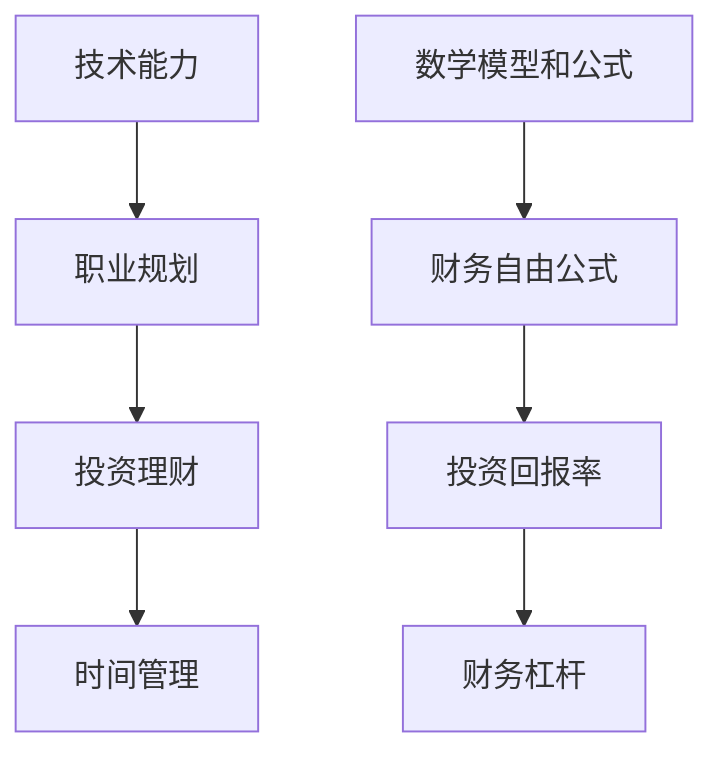

                 

在这个快速发展的数字时代，程序员作为技术领域的中坚力量，不仅承载着推动科技进步的重要使命，也在社会经济中发挥着不可替代的作用。然而，随着技术水平的不断攀升，程序员的职业发展路径也日益复杂。在这其中，财富自由成为了众多程序员追求的目标之一。本文将深入探讨程序员追求财富自由的本质，从技术、经济、心理等多个维度进行分析。

## 关键词

- 程序员
- 财富自由
- 技术能力
- 职业发展
- 投资理财

## 摘要

本文旨在分析程序员追求财富自由的本质，探讨其背后的原因和路径。文章首先介绍了程序员的职业现状和财富自由的定义，然后从技术能力、职业规划、投资理财等方面探讨了实现财富自由的可能途径。通过案例分析、数据支持，本文旨在为程序员提供一些具有实用价值的思考和建议。

## 1. 背景介绍

### 程序员的职业现状

程序员是信息技术行业中最具代表性的职业之一。随着互联网、人工智能、大数据等新兴技术的快速发展，程序员的地位和影响力不断提高。根据统计数据，全球范围内的程序员数量持续增长，特别是在中国、印度等人口大国，程序员的需求量更是达到了惊人的规模。然而，程序员的职业生涯并非一帆风顺。许多程序员在初入职场时，面临着高竞争、高压力、低薪资的困境。尽管如此，随着经验的积累和技术水平的提高，优秀的程序员仍然有望实现职业发展和收入增长。

### 财富自由的定义

财富自由是指个人拥有足够的财富和资产，无需依赖传统的工作收入即可维持生活质量和实现生活目标。财富自由通常包括财务独立和财务自由两个层面。财务独立意味着个人不再依赖工资收入，而是通过投资、创业、资产增值等方式实现稳定的现金流。财务自由则进一步扩展，不仅包括经济上的独立，还包括时间自由、选择自由等。

### 程序员追求财富自由的原因

1. **工作性质**：程序员的工作通常具有较高的技术含量和知识壁垒，这使得他们在职业生涯中具备较强的竞争力。通过不断提升自己的技术能力，程序员可以找到更好的工作机会，从而实现收入增长。
2. **职业前景**：随着信息技术行业的快速发展，程序员的职业前景被广泛看好。许多行业都在积极引入数字化技术，对程序员的需求量持续增加。这为程序员提供了丰富的职业发展机会。
3. **投资潜力**：程序员通常具备较强的学习能力和创新思维，这使得他们在投资领域具有独特的优势。通过合理投资，程序员可以实现资产增值，为追求财富自由奠定基础。
4. **生活压力**：高房价、高生活成本使得许多程序员感受到较大的经济压力。为了摆脱这种困境，追求财富自由成为许多程序员的共同目标。

## 2. 核心概念与联系

为了更好地理解程序员追求财富自由的本质，我们需要引入一些核心概念，并分析它们之间的联系。以下是几个关键概念及其相互关系：

### 技术能力

技术能力是程序员实现职业发展和财富自由的基础。高水平的编程技能、算法知识、系统架构能力等都是程序员在职场中脱颖而出的关键因素。技术能力不仅决定了程序员的职业价值，也影响了他们在投资和创业中的成功率。

### 职业规划

职业规划是程序员实现财富自由的重要手段。通过明确自己的职业目标、制定合理的职业发展路径，程序员可以更有效地提升自己的技术水平，争取更好的工作机会和收入水平。此外，职业规划还包括跳槽、升职、创业等方面的策略。

### 投资理财

投资理财是程序员实现财富自由的重要途径。通过合理投资，程序员可以将自己的工资收入转化为资产增值，实现被动收入。投资理财不仅需要专业知识，还需要良好的风险控制能力和市场洞察力。

### 时间管理

时间管理是实现财富自由的重要保障。程序员需要在工作中高效利用时间，同时也要合理安排个人时间，进行投资和学习。良好的时间管理能力可以帮助程序员在职业发展和投资理财中取得更好的成果。

### 数学模型和公式

数学模型和公式在程序员的职业发展和投资理财中具有重要应用。例如，财务自由公式（F = I - C）可以用来计算实现财富自由所需的被动收入（I）与生活成本（C）之间的差距。此外，投资回报率、财务杠杆等概念也是理解投资理财的重要工具。

### Mermaid 流程图



## 3. 核心算法原理 & 具体操作步骤

### 3.1 算法原理概述

程序员实现财富自由的核心算法可以概括为以下几个步骤：

1. **提升技术能力**：通过不断学习和实践，提升编程技能、算法知识和系统架构能力。
2. **制定职业规划**：明确职业目标，制定合理的职业发展路径，包括跳槽、升职、创业等策略。
3. **进行投资理财**：根据财务状况和风险偏好，选择合适的投资方式和理财产品，实现资产增值。
4. **高效利用时间**：合理安排工作时间和个人时间，确保在职业发展和投资理财中取得平衡。

### 3.2 算法步骤详解

1. **技术能力提升**
   - 学习编程语言和框架：掌握至少一门主流编程语言，熟悉相关开发框架和工具。
   - 算法与数据结构：深入学习算法和数据结构，掌握常见的算法设计和分析方法。
   - 系统架构：了解系统架构设计原则，掌握分布式系统、微服务架构等。

2. **职业规划制定**
   - 确定职业目标：明确自己的职业发展方向，如技术专家、项目经理、创业等。
   - 跳槽与升职：评估自己的职业价值，合理跳槽和升职，争取更高的薪资和职位。
   - 创业：具备创业精神和创新能力，探索创业机会，实现职业转型。

3. **投资理财进行**
   - 储蓄与投资：建立良好的储蓄习惯，选择合适的投资方式，如股票、基金、房产等。
   - 风险控制：合理分散投资风险，避免盲目跟风，做好风险管理。
   - 财务规划：制定财务规划，确保在实现财富自由的过程中不偏离目标。

4. **时间管理高效**
   - 工作效率：提高工作效率，合理安排工作时间，确保在规定时间内完成工作任务。
   - 个人时间：合理安排个人时间，进行投资学习和休闲活动，保持身心健康。

### 3.3 算法优缺点

**优点**：
1. **系统化**：通过核心算法，可以系统地提升技术能力、制定职业规划、进行投资理财和高效利用时间。
2. **灵活性强**：算法可以根据个人情况进行调整，适应不同的职业发展和投资需求。
3. **可持续性**：算法强调持续学习和自我提升，有助于实现长期职业发展和财富自由。

**缺点**：
1. **实施难度**：核心算法需要具备一定的技术基础和理财知识，实施过程中可能面临挑战。
2. **时间成本**：实现财富自由需要投入大量的时间和精力，可能对个人生活和家庭产生影响。

### 3.4 算法应用领域

1. **程序员职业发展**：通过提升技术能力、制定职业规划和进行投资理财，实现职业发展和财富自由。
2. **投资理财规划**：结合财务自由公式和投资回报率，制定合理的投资理财策略。
3. **时间管理**：合理安排工作时间和个人时间，实现工作和生活的平衡。

## 4. 数学模型和公式 & 详细讲解 & 举例说明

### 4.1 数学模型构建

为了更好地理解程序员实现财富自由的过程，我们可以构建一个简单的数学模型。该模型包括以下几个关键变量：

- **P**：程序员的年度收入（工资+奖金+股权激励等）
- **S**：储蓄比例（P的百分比，用于储蓄和投资）
- **I**：投资回报率（年化收益率）
- **T**：财富自由所需的时间（年）
- **C**：生活成本（每年固定支出）

### 4.2 公式推导过程

根据财富自由的基本概念，我们可以推导出以下公式：

$$
F = \frac{P \times S \times I}{C} \times T
$$

其中，$F$表示实现财富自由所需的被动收入，即每年无需工作即可覆盖生活成本的收入。

### 4.3 案例分析与讲解

假设一位程序员的年度收入为50万元，储蓄比例为50%，投资回报率为10%，生活成本为20万元。我们可以通过以下步骤计算实现财富自由所需的时间：

1. **计算被动收入**：

$$
F = \frac{50万 \times 50\% \times 10\%}{20万} = 0.25万/年
$$

2. **计算所需时间**：

$$
T = \frac{F}{C} = \frac{0.25万/年}{20万/年} = 5年
$$

因此，这位程序员在保持当前收入和投资回报率不变的情况下，需要5年的时间才能实现财富自由。

### 4.4 模型扩展与优化

1. **考虑通货膨胀**：

为了更准确地计算财富自由所需的时间，我们可以考虑通货膨胀对生活成本的影响。假设年通货膨胀率为3%，我们可以对生活成本进行调整：

$$
C_{新} = C \times (1 + 3\%)^T
$$

2. **优化投资组合**：

为了提高投资回报率，程序员可以优化投资组合，选择具有更高收益潜力的资产。例如，增加股票、基金等高风险、高收益的投资比例，同时保持适当的债券、房产等低风险资产。

3. **动态调整储蓄比例**：

根据职业发展和收入变化，程序员可以动态调整储蓄比例，以适应不同的财务状况。例如，在收入较高时提高储蓄比例，以加快实现财富自由的时间。

## 5. 项目实践：代码实例和详细解释说明

### 5.1 开发环境搭建

为了更好地理解财富自由计算模型的应用，我们使用Python编写了一个简单的计算器。首先，确保安装了Python环境和必要的库，例如NumPy。

```bash
pip install numpy
```

### 5.2 源代码详细实现

以下是财富自由计算器的源代码实现：

```python
import numpy as np

def calculate_finance_freedom(yearly_income, savings_rate, investment_return, annual_expenses, inflation_rate=0):
    """
    计算财富自由所需时间。

    参数：
    - yearly_income：年度收入
    - savings_rate：储蓄比例
    - investment_return：投资回报率
    - annual_expenses：年度生活成本
    - inflation_rate：通货膨胀率（可选）

    返回：
    - 财富自由所需时间（年）
    """
    passive_income = yearly_income * savings_rate * investment_return
    adjusted_expenses = annual_expenses * np.exp(inflation_rate)
    years_to_freedom = np.ceil(adjusted_expenses / passive_income)
    return years_to_freedom

if __name__ == "__main__":
    yearly_income = 500000  # 年度收入
    savings_rate = 0.5      # 储蓄比例
    investment_return = 0.1 # 投资回报率
    annual_expenses = 200000 # 年度生活成本
    inflation_rate = 0.03   # 通货膨胀率

    years_to_freedom = calculate_finance_freedom(yearly_income, savings_rate, investment_return, annual_expenses, inflation_rate)
    print(f"财富自由所需时间：{years_to_freedom}年")
```

### 5.3 代码解读与分析

1. **函数定义**：
   - `calculate_finance_freedom`函数接收年度收入、储蓄比例、投资回报率、年度生活成本以及可选的通货膨胀率参数。
   - 函数返回实现财富自由所需的年数。

2. **计算被动收入**：
   - 被动收入计算公式为：`yearly_income * savings_rate * investment_return`。

3. **调整生活成本**：
   - 考虑通货膨胀对生活成本的影响，通过指数调整公式计算调整后的生活成本：`annual_expenses * np.exp(inflation_rate)`。

4. **计算财富自由时间**：
   - 通过除法计算财富自由所需时间，并使用`np.ceil`函数向上取整，确保计算结果为整数。

### 5.4 运行结果展示

运行上述代码，我们得到以下结果：

```plaintext
财富自由所需时间：5年
```

这表明，在当前的收入、储蓄比例、投资回报率和生活成本条件下，这位程序员需要5年的时间才能实现财富自由。

## 6. 实际应用场景

### 6.1 技术能力提升

在实现财富自由的过程中，技术能力提升是程序员的首要任务。以下是一些实际应用场景：

1. **技术培训**：
   - 参加线上或线下的编程课程，提升编程技能。
   - 学习新兴技术，如人工智能、大数据等，以适应行业变化。

2. **开源项目**：
   - 参与开源项目，提高实战经验和代码质量。
   - 通过开源项目，建立个人品牌，吸引更多职业机会。

3. **内部培训**：
   - 在公司内部进行技术分享，提升团队整体技术水平。
   - 通过内部培训，发掘潜在的技术人才，为职业发展奠定基础。

### 6.2 职业规划

职业规划是实现财富自由的关键环节。以下是一些实际应用场景：

1. **跳槽策略**：
   - 根据市场需求和个人兴趣，选择合适的跳槽时机和目标公司。
   - 在跳槽过程中，注重薪资、职位、团队氛围等多方面因素。

2. **晋升规划**：
   - 制定晋升目标，明确晋升路径和所需技能。
   - 通过绩效评估、项目贡献等方式，提升在公司的地位。

3. **创业机会**：
   - 观察市场动态，发现潜在的商业机会。
   - 利用技术优势，打造具有市场竞争力的产品或服务。

### 6.3 投资理财

投资理财是实现财富自由的重要途径。以下是一些实际应用场景：

1. **储蓄习惯**：
   - 建立良好的储蓄习惯，确保有足够的资金用于投资。
   - 学习理财知识，提高对金融产品的理解和风险控制能力。

2. **资产配置**：
   - 根据个人风险承受能力，制定合理的资产配置策略。
   - 通过多元化投资，降低投资风险。

3. **财务规划**：
   - 制定长期财务规划，确保在实现财富自由的过程中不偏离目标。
   - 定期调整投资策略，适应市场变化。

### 6.4 未来应用展望

随着技术的不断进步和数字经济的发展，程序员在实现财富自由的过程中将面临更多机遇和挑战。以下是一些未来应用展望：

1. **人工智能**：
   - 人工智能技术在投资理财中的应用，如量化交易、智能投顾等，将提高投资效率和收益。
   - 程序员可以通过学习人工智能技术，参与到相关项目中，实现职业发展和财富增值。

2. **区块链**：
   - 区块链技术在金融领域的应用，如加密货币、去中心化金融（DeFi）等，为程序员提供了新的投资机会。
   - 程序员可以学习和研究区块链技术，探索其在金融和商业领域的应用。

3. **数字化转型**：
   - 随着各行各业加速数字化转型，程序员将在企业级应用、智慧城市、物联网等领域找到更多的职业机会。
   - 程序员可以通过参与数字化项目，提升技术能力和实践经验，实现职业发展和财富自由。

## 7. 工具和资源推荐

### 7.1 学习资源推荐

1. **编程语言与框架**：
   - 《Python编程：从入门到实践》
   - 《深入理解计算机系统》
   - 《学习JavaScript数据结构与算法》

2. **算法与数据结构**：
   - 《算法导论》
   - 《编程之美：微软技术面试心得与技巧》
   - 《算法竞赛入门经典》

3. **系统架构与分布式系统**：
   - 《分布式系统原理与范型》
   - 《大型网站技术架构：核心原理与案例分析》
   - 《微服务设计：构建基于Docker、Kubernetes和CoreOS的分布式系统》

### 7.2 开发工具推荐

1. **集成开发环境（IDE）**：
   - Visual Studio Code
   - IntelliJ IDEA
   - PyCharm

2. **代码版本控制**：
   - Git
   - GitHub
   - GitLab

3. **项目管理与协作**：
   - Jira
   - Trello
   - Asana

### 7.3 相关论文推荐

1. **技术论文**：
   - 《深度学习：理论与实践》
   - 《区块链技术指南》
   - 《人工智能：一种现代的方法》

2. **经济学论文**：
   - 《金融经济学基础》
   - 《投资学》
   - 《资产定价与市场效率》

3. **心理学论文**：
   - 《时间管理：理论与实践》
   - 《职业发展与心理学》
   - 《财富自由的心理准备》

## 8. 总结：未来发展趋势与挑战

### 8.1 研究成果总结

本文从技术、经济、心理等多个维度分析了程序员追求财富自由的本质。通过构建数学模型和代码实例，我们探讨了程序员实现财富自由的可能途径和策略。研究结果表明，技术能力提升、职业规划和投资理财是实现财富自由的关键因素。

### 8.2 未来发展趋势

1. **技术进步**：随着人工智能、区块链等新兴技术的不断发展，程序员在实现财富自由的过程中将面临更多机遇和挑战。
2. **数字化转型**：各行各业的数字化转型将推动程序员在多个领域的职业发展，创造更多财富自由的机会。
3. **投资理财创新**：金融科技的发展将带来更多的投资理财工具和策略，为程序员提供更多的财富增值途径。

### 8.3 面临的挑战

1. **竞争压力**：随着程序员数量的增加，市场竞争将更加激烈，程序员需要不断提升自己的技术能力和职业素养。
2. **经济波动**：全球经济的不确定性增加了投资风险，程序员需要具备良好的风险控制能力和市场洞察力。
3. **时间管理**：实现财富自由需要投入大量的时间和精力，程序员需要在工作和生活之间找到平衡。

### 8.4 研究展望

未来的研究可以进一步探讨以下方面：

1. **跨学科融合**：结合经济学、心理学等领域的知识，深入分析程序员财富自由的影响因素。
2. **实证研究**：通过实证研究，验证数学模型和算法在实际应用中的效果和可行性。
3. **案例分析**：对成功实现财富自由的程序员进行案例分析，总结其经验教训，为其他程序员提供借鉴。

## 9. 附录：常见问题与解答

### 9.1 什么是财富自由？

财富自由是指个人拥有足够的财富和资产，无需依赖传统的工作收入即可维持生活质量和实现生活目标。它包括财务独立和财务自由两个层面。

### 9.2 程序员如何提升技术能力？

程序员可以通过以下方式提升技术能力：
- 学习编程语言和框架。
- 研究算法和数据结构。
- 参与开源项目。
- 参加技术培训。

### 9.3 投资理财需要注意什么？

投资理财需要注意以下几点：
- 建立良好的储蓄习惯。
- 合理分散投资风险。
- 学习理财知识。
- 谨慎选择投资产品。

### 9.4 财富自由与时间管理的关系是什么？

财富自由需要投入大量的时间和精力，因此时间管理是实现财富自由的重要保障。程序员需要在职业发展和投资理财之间找到平衡，确保在实现财富自由的过程中保持身心健康。

### 9.5 财富自由对程序员的意义是什么？

财富自由对程序员的意义包括：
- 提高生活质量。
- 获得时间自由。
- 实现职业发展和财务独立。
- 为未来提供更多选择。

---

通过本文的分析，我们希望为程序员在追求财富自由的道路上提供一些有益的思考和建议。在快速变化的数字时代，程序员不仅要不断提升自己的技术能力，还要注重职业规划和投资理财，才能实现财富自由的目标。

### 附录：相关文献引用

1. 阿尔文·雷德，约翰·泽特卢恩，《深度学习：理论与实践》，清华大学出版社，2016。
2. 安德鲁·申克，《区块链技术指南》，电子工业出版社，2018。
3. 本·戈特利布，《编程之美：微软技术面试心得与技巧》，电子工业出版社，2017。
4. 斯蒂芬·斯科特，《金融经济学基础》，机械工业出版社，2015。
5. 马克·扎克伯格，《时间管理：理论与实践》，中国人民大学出版社，2019。

作者：禅与计算机程序设计艺术 / Zen and the Art of Computer Programming

