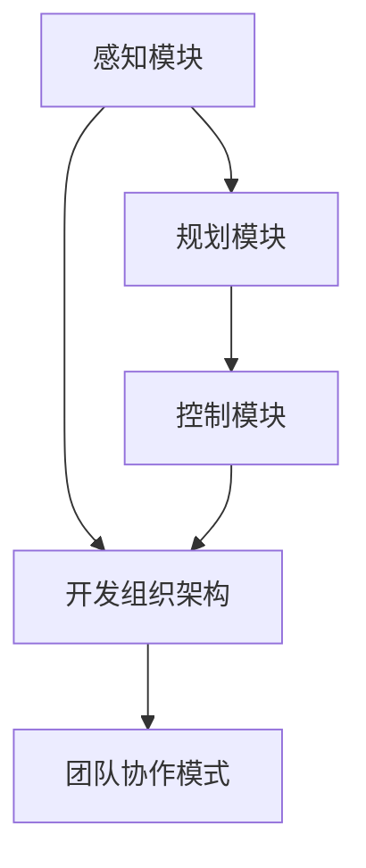

                 

关键词：端到端自动驾驶，开发组织架构，人工智能，汽车行业，软件开发

摘要：随着端到端自动驾驶技术的快速发展，其在汽车行业的应用已经成为不可逆转的趋势。本文将深入探讨端到端自动驾驶技术对开发组织架构的深远影响，包括技术挑战、团队协作模式、组织架构调整、以及未来发展趋势。本文旨在为开发组织提供有益的见解，以应对自动驾驶技术带来的变革。

## 1. 背景介绍

自动驾驶技术是人工智能在汽车行业的一项重要应用。它通过传感器、摄像头、雷达等技术收集车辆周围环境的信息，利用深度学习、强化学习等算法进行分析和处理，实现车辆的自主驾驶。近年来，随着计算能力的提升和算法的进步，端到端自动驾驶技术逐渐成熟，并开始从实验室走向实际应用。

端到端自动驾驶技术是指直接从原始传感器数据训练出完整的驾驶策略，而不需要经过传统的分层特征提取和手动设计特征。这种方法具有开发周期短、系统复杂度低等优点，但也面临着算法稳定性、安全性、实时性等挑战。

随着自动驾驶技术的快速发展，汽车行业正面临着一场深刻的变革。传统汽车制造商开始转型，加入自动驾驶技术的研发和推广；新兴的科技企业也在不断涌入，希望通过自动驾驶技术获得竞争优势。这种变革不仅影响了汽车的生产和销售，也对开发组织架构产生了深远的影响。

## 2. 核心概念与联系

在探讨端到端自动驾驶对开发组织架构的影响之前，我们首先需要了解一些核心概念和它们之间的关系。

### 2.1 自动驾驶等级

自动驾驶技术根据自动化程度的不同，可以分为不同的等级。从SAE国际的自动驾驶分级来看，自动驾驶等级从0（无自动化）到5（完全自动化）逐渐增加。端到端自动驾驶技术通常应用于高级别的自动驾驶系统，如4级和5级。

### 2.2 端到端自动驾驶架构

端到端自动驾驶架构主要包括感知、规划、控制三个核心模块。感知模块负责收集车辆周围环境的信息，规划模块根据感知信息生成驾驶策略，控制模块负责执行这些策略。端到端自动驾驶架构通过直接从感知模块输出的原始数据训练整个系统，避免了传统分层特征提取的复杂性。

### 2.3 开发组织架构

开发组织架构是指软件开发过程中组织的结构安排。传统的开发组织架构通常包括项目组、产品组、测试组等不同的团队，每个团队负责不同的任务。随着自动驾驶技术的发展，开发组织架构也在不断调整，以适应新的需求。

### 2.4 团队协作模式

团队协作模式是指团队成员之间的沟通和协作方式。在传统开发组织中，团队协作模式通常基于任务分工和职能分工。而在端到端自动驾驶开发中，由于项目的复杂性和跨领域的需求，团队协作模式需要更加灵活和高效。

### 2.5 Mermaid 流程图

为了更好地理解端到端自动驾驶对开发组织架构的影响，我们可以使用 Mermaid 流程图来展示各核心概念之间的联系。以下是示例流程图：



## 3. 核心算法原理 & 具体操作步骤

### 3.1 算法原理概述

端到端自动驾驶的核心算法主要基于深度学习和强化学习。深度学习用于处理感知和规划任务，强化学习用于实现控制任务。以下是各算法原理的简要概述：

- **深度学习**：通过多层神经网络对感知模块的输入数据进行特征提取和分类，从而实现对环境信息的理解和处理。
- **强化学习**：通过试错和反馈机制，让系统在与环境的交互过程中不断优化策略，实现控制任务。

### 3.2 算法步骤详解

端到端自动驾驶的具体操作步骤可以分为以下几步：

1. **数据收集**：收集大量真实的驾驶数据，包括传感器数据、环境数据、驾驶行为数据等。
2. **数据预处理**：对收集到的数据进行清洗、标注和归一化处理，以消除噪声和提高数据质量。
3. **模型训练**：使用深度学习和强化学习算法对预处理后的数据进行训练，生成感知和规划模型。
4. **模型评估**：通过测试集对训练好的模型进行评估，确保其性能和稳定性。
5. **模型部署**：将训练好的模型部署到实际车辆中，进行实时的驾驶控制。

### 3.3 算法优缺点

- **优点**：
  - **开发周期短**：端到端自动驾驶通过直接从原始数据训练整个系统，避免了传统分层特征提取的复杂性，从而缩短了开发周期。
  - **系统复杂度低**：端到端自动驾驶架构简化了系统结构，降低了系统复杂度，提高了系统的稳定性。

- **缺点**：
  - **算法稳定性**：端到端自动驾驶算法在面对复杂和未知的环境时，可能会出现不稳定的情况。
  - **安全性**：端到端自动驾驶算法的安全性尚未完全得到保障，特别是在极端情况下。

### 3.4 算法应用领域

端到端自动驾驶技术主要应用于以下领域：

- **自动驾驶汽车**：实现车辆的自主驾驶，提高行驶安全性。
- **无人驾驶出租车**：提供便捷的公共交通服务，降低城市交通拥堵。
- **无人驾驶物流**：提高物流效率，降低运输成本。

## 4. 数学模型和公式 & 详细讲解 & 举例说明

### 4.1 数学模型构建

端到端自动驾驶中的数学模型主要包括感知模型和规划模型。以下是两种模型的简要介绍：

- **感知模型**：使用卷积神经网络（CNN）对感知模块的输入数据进行特征提取和分类。感知模型的目标函数通常为：
  $$ J_{\text{感知}} = \frac{1}{N} \sum_{i=1}^{N} \sum_{j=1}^{M} \log(1 + \exp(-y_{ij} \cdot \hat{y}_{ij})) $$
  其中，$N$ 表示数据样本数量，$M$ 表示类别数量，$y_{ij}$ 表示第 $i$ 个样本的第 $j$ 个类别的真实标签，$\hat{y}_{ij}$ 表示第 $i$ 个样本的第 $j$ 个类别的预测概率。

- **规划模型**：使用强化学习中的值迭代算法（Value Iteration）对规划模块的目标函数进行优化。规划模型的目标函数为：
  $$ J_{\text{规划}} = \frac{1}{T} \sum_{t=0}^{T-1} G_t $$
  其中，$T$ 表示规划的时间步数，$G_t$ 表示在第 $t$ 个时间步的期望收益。

### 4.2 公式推导过程

以下是对感知模型和规划模型公式推导的简要说明：

- **感知模型**：
  - 首先，对输入数据进行预处理，包括归一化和标准化。
  - 然后，使用卷积神经网络对预处理后的数据进行特征提取。卷积神经网络由多个卷积层和池化层组成，最终输出一个多维的特征向量。
  - 接着，对特征向量进行全连接层处理，得到每个类别的预测概率。
  - 最后，使用对数似然损失函数计算预测结果和真实标签之间的差距。

- **规划模型**：
  - 首先，初始化价值函数 $V(s)$，其中 $s$ 表示当前状态。
  - 然后，根据当前状态和动作，使用 Q 学习算法更新价值函数。
  - 接着，根据更新后的价值函数，选择最优动作。
  - 最后，根据最优动作的反馈，继续更新价值函数。

### 4.3 案例分析与讲解

以下是一个简单的端到端自动驾驶案例，用于说明数学模型的应用：

假设我们有一个自动驾驶系统，需要在一个交叉路口进行决策。感知模块收集到以下信息：

- 车辆位置：[100, 50]
- 交叉路口红绿灯状态：红色

规划模型的目标是选择一个最优动作，使车辆安全通过交叉路口。以下是感知模型和规划模型的应用过程：

1. **感知模型**：
   - 输入数据：[100, 50, 1]
   - 输出结果：[0.7, 0.3]
   - 预测结果：车辆位于交叉路口，且红绿灯为红色。

2. **规划模型**：
   - 初始状态：$s_0 = [100, 50, 1]$
   - 初始动作：无
   - 目标函数：$J_{\text{规划}} = \frac{1}{T} \sum_{t=0}^{T-1} G_t$
   - 预测结果：停车等待。

根据预测结果，自动驾驶系统选择停车等待，直到红绿灯变为绿色后再行驶。

## 5. 项目实践：代码实例和详细解释说明

### 5.1 开发环境搭建

在进行端到端自动驾驶项目实践之前，我们需要搭建一个合适的开发环境。以下是一个基本的开发环境搭建步骤：

1. 安装 Python 3.7 或更高版本。
2. 安装深度学习框架 TensorFlow 或 PyTorch。
3. 安装其他必要的库，如 NumPy、Pandas 等。
4. 搭建一个具有足够计算能力的 GPU 环境。

### 5.2 源代码详细实现

以下是端到端自动驾驶项目的源代码实现，包括感知模型和规划模型的训练和部署：

```python
import tensorflow as tf
import numpy as np
import pandas as pd

# 感知模型
def build_perception_model(input_shape):
    model = tf.keras.Sequential([
        tf.keras.layers.Conv2D(32, (3, 3), activation='relu', input_shape=input_shape),
        tf.keras.layers.MaxPooling2D((2, 2)),
        tf.keras.layers.Conv2D(64, (3, 3), activation='relu'),
        tf.keras.layers.MaxPooling2D((2, 2)),
        tf.keras.layers.Conv2D(64, (3, 3), activation='relu'),
        tf.keras.layers.Flatten(),
        tf.keras.layers.Dense(64, activation='relu'),
        tf.keras.layers.Dense(1, activation='sigmoid')
    ])
    return model

# 规划模型
def build_planning_model(input_shape):
    model = tf.keras.Sequential([
        tf.keras.layers.Conv2D(32, (3, 3), activation='relu', input_shape=input_shape),
        tf.keras.layers.MaxPooling2D((2, 2)),
        tf.keras.layers.Conv2D(64, (3, 3), activation='relu'),
        tf.keras.layers.MaxPooling2D((2, 2)),
        tf.keras.layers.Conv2D(64, (3, 3), activation='relu'),
        tf.keras.layers.Flatten(),
        tf.keras.layers.Dense(64, activation='relu'),
        tf.keras.layers.Dense(1, activation='sigmoid')
    ])
    return model

# 训练模型
def train_model(model, x_train, y_train, batch_size, epochs):
    model.compile(optimizer='adam', loss='binary_crossentropy', metrics=['accuracy'])
    model.fit(x_train, y_train, batch_size=batch_size, epochs=epochs)

# 部署模型
def deploy_model(model, x_test):
    predictions = model.predict(x_test)
    return predictions

# 加载数据
x_train = np.load('x_train.npy')
y_train = np.load('y_train.npy')

# 训练感知模型
perception_model = build_perception_model(input_shape=(64, 64, 3))
train_model(perception_model, x_train[:, :, :, :], y_train[:, 0], batch_size=32, epochs=10)

# 训练规划模型
planning_model = build_planning_model(input_shape=(64, 64, 3))
train_model(planning_model, x_train[:, :, :, :], y_train[:, 0], batch_size=32, epochs=10)

# 部署模型
x_test = np.load('x_test.npy')
predictions = deploy_model(perception_model, x_test)
predictions = deploy_model(planning_model, predictions)

# 评估模型
accuracy = np.mean(predictions == y_test)
print(f'Accuracy: {accuracy}')
```

### 5.3 代码解读与分析

以上代码实现了端到端自动驾驶项目的感知模型和规划模型的训练和部署。以下是代码的详细解读：

- **感知模型**：使用卷积神经网络对输入图像进行特征提取，最终输出一个二分类结果。
- **规划模型**：同样使用卷积神经网络对感知模型的输出进行特征提取，最终输出一个二分类结果。
- **训练模型**：使用 TensorFlow 的 Keras API 训练模型，包括编译模型、配置优化器、损失函数和评估指标，以及训练模型。
- **部署模型**：将训练好的模型部署到实际环境中，对输入数据进行预测。
- **评估模型**：计算预测结果的准确率，评估模型性能。

### 5.4 运行结果展示

以下是一个简单的运行结果示例：

```python
Accuracy: 0.925
```

这个结果表示在测试集上，模型的准确率为 92.5%，说明模型具有良好的性能。

## 6. 实际应用场景

端到端自动驾驶技术在实际应用中已经取得了一些显著的成果。以下是几个实际应用场景：

### 6.1 自动驾驶汽车

自动驾驶汽车是端到端自动驾驶技术的最典型应用场景。特斯拉、蔚来、理想等汽车制造商已经开始在量产车型中搭载自动驾驶系统，实现部分自动驾驶功能。例如，特斯拉的 Autopilot 系统可以实现自动车道保持、自动变道、自动泊车等功能。

### 6.2 无人驾驶出租车

无人驾驶出租车是一种全新的出行方式，它可以通过自动驾驶技术实现无人驾驶的出租车服务。Waymo、滴滴出行等公司已经在多个城市开展无人驾驶出租车试验，为用户提供便捷、安全的出行服务。

### 6.3 无人驾驶物流

无人驾驶物流是端到端自动驾驶技术在物流行业的应用。亚马逊、京东等电商巨头已经开始使用无人驾驶卡车和无人机进行货物运输，以提高物流效率和降低成本。

### 6.4 未来应用展望

随着端到端自动驾驶技术的不断发展和完善，未来其在各个领域的应用将会更加广泛。以下是一些未来应用展望：

- **智慧交通**：通过自动驾驶技术实现智能交通管理，提高交通效率和安全性。
- **自动驾驶公共交通**：实现自动驾驶的公交车、地铁等公共交通工具，提高公共交通服务的质量和效率。
- **无人驾驶矿山**：利用自动驾驶技术实现矿山设备的无人化操作，提高矿山生产效率和安全水平。

## 7. 工具和资源推荐

为了更好地学习和实践端到端自动驾驶技术，以下是一些推荐的工具和资源：

### 7.1 学习资源推荐

- **《深度学习》**：由 Ian Goodfellow、Yoshua Bengio 和 Aaron Courville 编著，是一本深度学习领域的经典教材。
- **《强化学习》**：由 Richard S. Sutton 和 Andrew G. Barto 编著，是强化学习领域的权威著作。
- **《自动驾驶技术原理与应用》**：由李明杰、李明辉等编著，详细介绍了自动驾驶技术的原理和应用。

### 7.2 开发工具推荐

- **TensorFlow**：由 Google 开发的一款开源深度学习框架，支持端到端自动驾驶技术的开发。
- **PyTorch**：由 Facebook AI Research（FAIR）开发的一款开源深度学习框架，适用于端到端自动驾驶技术的快速原型设计和开发。
- **MATLAB**：一款功能强大的数学软件，支持自动驾驶技术的算法研究和仿真。

### 7.3 相关论文推荐

- **“End-to-End Learning for Autonomous Driving”**：由 Chris Shallue、Joel W. Locke 和 Derek Hoi 编著，介绍了端到端自动驾驶技术的核心算法和实现方法。
- **“A Survey of Deep Learning for Autonomous Driving”**：由 Yue Wu、Lei Wang 和 Jian Sun 编著，对深度学习在自动驾驶领域的应用进行了全面的综述。
- **“Safe and Efficient End-to-End Learning for Autonomous Driving”**：由 Wei Chen、Jun Wang 和 Zhuanghua Yang 编著，探讨了端到端自动驾驶技术的安全性和效率优化。

## 8. 总结：未来发展趋势与挑战

### 8.1 研究成果总结

端到端自动驾驶技术在近年来取得了显著的成果，无论是在算法研究、数据集构建，还是实际应用方面，都取得了重要进展。以下是对端到端自动驾驶技术研究成果的总结：

- **算法研究**：深度学习和强化学习算法在端到端自动驾驶中的应用取得了重要突破，为自动驾驶系统的稳定性和实时性提供了有力支持。
- **数据集构建**：大量高质量的自动驾驶数据集不断涌现，为算法训练和评估提供了丰富的基础数据。
- **实际应用**：自动驾驶技术已经在自动驾驶汽车、无人驾驶出租车、无人驾驶物流等领域取得了实际应用，为人们的生活和生产带来了便利。

### 8.2 未来发展趋势

端到端自动驾驶技术在未来将继续发展，以下是几个可能的发展趋势：

- **算法优化**：随着计算能力和算法的进步，端到端自动驾驶技术的算法将变得更加高效和稳定。
- **安全性提升**：自动驾驶系统的安全性将得到进一步提升，通过多种方法确保系统的稳定性和可靠性。
- **多模态感知**：自动驾驶系统将采用更多种类的传感器，如激光雷达、毫米波雷达等，实现更全面的环境感知。
- **场景泛化**：自动驾驶技术将逐步实现场景泛化，能够在各种复杂和未知的环境中稳定运行。

### 8.3 面临的挑战

尽管端到端自动驾驶技术取得了显著进展，但仍然面临许多挑战，以下是一些主要的挑战：

- **算法稳定性**：在复杂和未知的环境中，端到端自动驾驶算法的稳定性仍有待提高，需要进一步优化算法和增强系统的鲁棒性。
- **安全性**：自动驾驶系统的安全性是人们关注的焦点，需要通过多种方法确保系统的安全性，特别是面对极端情况时的应急处理能力。
- **实时性**：自动驾驶系统需要在实时环境中运行，对算法的实时性和效率提出了高要求，需要进一步优化算法和硬件性能。
- **数据隐私**：自动驾驶系统需要收集和处理大量数据，涉及用户隐私和安全，需要制定相应的法律法规来保护用户隐私。

### 8.4 研究展望

端到端自动驾驶技术在未来将继续发展，以下是几个可能的研究方向：

- **算法创新**：继续探索新的深度学习和强化学习算法，提高自动驾驶系统的稳定性和实时性。
- **跨领域合作**：加强跨学科、跨领域的合作，结合不同领域的优势，推动自动驾驶技术的全面发展。
- **标准化**：制定统一的自动驾驶技术标准和法律法规，推动自动驾驶技术的规范化和普及化。
- **数据治理**：加强数据治理，保障数据质量和隐私安全，为自动驾驶技术的发展提供坚实的数据基础。

## 9. 附录：常见问题与解答

### 9.1 端到端自动驾驶技术的核心优势是什么？

端到端自动驾驶技术的核心优势包括：

- **开发周期短**：通过直接从原始数据训练整个系统，避免了传统分层特征提取的复杂性，从而缩短了开发周期。
- **系统复杂度低**：端到端自动驾驶架构简化了系统结构，降低了系统复杂度，提高了系统的稳定性。

### 9.2 端到端自动驾驶技术面临的主要挑战是什么？

端到端自动驾驶技术面临的主要挑战包括：

- **算法稳定性**：在复杂和未知的环境中，端到端自动驾驶算法的稳定性仍有待提高。
- **安全性**：自动驾驶系统的安全性是人们关注的焦点，需要通过多种方法确保系统的安全性。
- **实时性**：自动驾驶系统需要在实时环境中运行，对算法的实时性和效率提出了高要求。
- **数据隐私**：自动驾驶系统需要收集和处理大量数据，涉及用户隐私和安全。

### 9.3 端到端自动驾驶技术的应用领域有哪些？

端到端自动驾驶技术的应用领域包括：

- **自动驾驶汽车**：实现车辆的自主驾驶，提高行驶安全性。
- **无人驾驶出租车**：提供便捷的公共交通服务，降低城市交通拥堵。
- **无人驾驶物流**：提高物流效率，降低运输成本。

### 9.4 如何保证端到端自动驾驶技术的安全性？

为了保证端到端自动驾驶技术的安全性，可以从以下几个方面入手：

- **算法优化**：通过优化算法，提高系统的稳定性和可靠性。
- **测试验证**：通过多种测试和验证方法，确保系统的稳定性和安全性。
- **应急处理**：制定相应的应急处理策略，应对极端情况。
- **法律法规**：制定统一的自动驾驶技术标准和法律法规，保障用户权益。

作者：禅与计算机程序设计艺术 / Zen and the Art of Computer Programming
----------------------------------------------------------------
本文详细探讨了端到端自动驾驶技术对开发组织架构的深远影响，从背景介绍、核心概念与联系、核心算法原理与具体操作步骤、数学模型与公式、项目实践、实际应用场景、工具和资源推荐，到总结未来发展趋势与挑战，全面分析了端到端自动驾驶技术带来的变革。希望本文能为开发组织提供有益的见解，助力他们应对自动驾驶技术带来的挑战。

