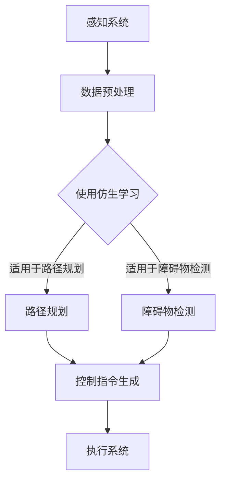

                 

关键词：端到端自动驾驶、仿生学习、迁移学习、深度学习、神经网络、自动驾驶算法

## 摘要

端到端自动驾驶技术的发展正面临着诸多挑战，尤其是如何实现高效的模型训练和适应不同的驾驶环境。本文旨在探讨端到端自动驾驶系统中应用仿生学习与迁移学习方法的有效性和优势，通过详细分析这些核心技术的原理、应用和实践，为自动驾驶领域的研究者提供有价值的参考。

### 1. 背景介绍

自动驾驶技术作为人工智能领域的重要分支，近年来得到了广泛关注和快速发展。然而，实现高度自动驾驶系统仍面临诸多技术挑战。传统的自动驾驶系统通常依赖于规则和手动的特征工程，这种方式不仅复杂度高，而且难以适应复杂的现实驾驶环境。随着深度学习技术的发展，端到端自动驾驶系统逐渐成为研究的热点，其通过直接从原始数据中学习，减少了传统方法中繁琐的特征工程步骤，提升了模型的泛化能力。

然而，端到端自动驾驶系统在实际应用中仍然面临以下挑战：

1. **数据稀缺性**：高质量的自动驾驶训练数据获取难度大，尤其在极端天气、复杂交通场景下。
2. **模型泛化性**：如何确保模型在不同驾驶环境和场景下的鲁棒性。
3. **计算资源**：端到端自动驾驶模型通常参数量庞大，对计算资源的需求极高。

为解决上述问题，仿生学习和迁移学习方法被引入到端到端自动驾驶系统中，以期提高模型的训练效率和适应能力。

### 2. 核心概念与联系

#### 2.1 仿生学习

仿生学习是指通过模仿自然界中的生物系统，设计出相应的算法或系统。在自动驾驶领域，仿生学习可以应用于路径规划、障碍物检测等任务。例如，通过模仿蜜蜂的觅食行为，可以设计出一种高效的路径规划算法。

#### 2.2 迁移学习

迁移学习是一种利用在不同任务间共享知识的方法，以提高模型在新任务上的表现。在自动驾驶中，迁移学习可以通过将已有的自动驾驶模型迁移到新的驾驶环境中，减少对新数据的依赖。

#### 2.3 端到端学习

端到端学习是指直接从原始数据中学习，将输入数据映射到输出结果，而无需进行繁琐的特征工程。在自动驾驶领域，端到端学习通过深度神经网络，实现了从传感器数据到控制指令的直接映射。

#### 2.4 Mermaid 流程图

以下是一个简化的端到端自动驾驶系统的仿生学习与迁移学习方法架构的Mermaid流程图：



### 3. 核心算法原理 & 具体操作步骤

#### 3.1 算法原理概述

仿生学习与迁移学习方法在自动驾驶中的应用主要包括以下几个方面：

1. **仿生学习**：通过模拟生物系统的行为，设计出高效的路径规划和障碍物检测算法。
2. **迁移学习**：利用已有的自动驾驶模型，在新驾驶环境下进行迁移训练，提高模型的泛化能力。

#### 3.2 算法步骤详解

1. **数据收集与预处理**：收集高质量的自动驾驶数据，包括传感器数据、道路信息、车辆状态等，并对数据进行清洗、归一化等预处理操作。
2. **仿生学习**：
   - **路径规划**：采用仿生算法，如遗传算法或蜜蜂算法，进行路径优化。
   - **障碍物检测**：使用深度学习模型，如卷积神经网络（CNN），进行图像处理和特征提取。
3. **迁移学习**：
   - **模型迁移**：将已有的自动驾驶模型参数迁移到新环境中。
   - **模型微调**：在新数据集上对迁移模型进行微调，提高模型在新环境下的适应性。

#### 3.3 算法优缺点

**优点**：
- **高效性**：仿生学习和迁移学习能够有效减少模型训练时间和计算资源需求。
- **适应性**：迁移学习能够提高模型在不同驾驶环境下的泛化能力。

**缺点**：
- **数据依赖性**：迁移学习对已有模型和训练数据有较高要求。
- **模型复杂性**：深度学习模型通常参数量庞大，对计算资源需求高。

#### 3.4 算法应用领域

- **路径规划**：适用于复杂交通环境下的自动驾驶。
- **障碍物检测**：适用于自动驾驶车辆的实时感知和决策。
- **自动驾驶系统**：结合多种算法，实现全面的自动驾驶功能。

### 4. 数学模型和公式 & 详细讲解 & 举例说明

#### 4.1 数学模型构建

假设我们使用卷积神经网络（CNN）进行障碍物检测，其数学模型可以表示为：

\[ y = \sigma(\text{ReLU}(\text{conv}(x) + b)) \]

其中，\( x \) 为输入图像，\( y \) 为输出标签，\( \text{conv} \) 表示卷积操作，\( \text{ReLU} \) 表示ReLU激活函数，\( \sigma \) 表示sigmoid激活函数，\( b \) 为偏置项。

#### 4.2 公式推导过程

迁移学习中的公式推导主要涉及模型参数的迁移和微调过程。假设源域模型为 \( \theta_1 \)，目标域模型为 \( \theta_2 \)，则有：

\[ \theta_2 = \theta_1 + \alpha(\theta_2 - \theta_1) \]

其中，\( \alpha \) 为微调系数。

#### 4.3 案例分析与讲解

以自动驾驶中的路径规划为例，我们可以采用遗传算法进行路径优化。遗传算法的基本步骤如下：

1. **初始化种群**：随机生成一组路径作为初始种群。
2. **适应度评估**：根据路径的长度、通行时间和安全性等指标计算适应度。
3. **选择**：根据适应度选择优秀的路径作为父代。
4. **交叉**：对父代进行交叉操作，生成新的子代。
5. **变异**：对子代进行变异操作，增加种群的多样性。
6. **更新种群**：将子代替换父代，进入下一轮迭代。

通过多次迭代，最终得到最优路径。

### 5. 项目实践：代码实例和详细解释说明

#### 5.1 开发环境搭建

1. 安装Python环境。
2. 安装TensorFlow、Keras等深度学习框架。
3. 准备自动驾驶数据集。

#### 5.2 源代码详细实现

以下是一个简单的自动驾驶障碍物检测的代码示例：

```python
import tensorflow as tf
from tensorflow.keras.models import Sequential
from tensorflow.keras.layers import Conv2D, MaxPooling2D, Flatten, Dense

# 构建卷积神经网络模型
model = Sequential([
    Conv2D(32, (3, 3), activation='relu', input_shape=(128, 128, 3)),
    MaxPooling2D((2, 2)),
    Flatten(),
    Dense(64, activation='relu'),
    Dense(1, activation='sigmoid')
])

# 编译模型
model.compile(optimizer='adam', loss='binary_crossentropy', metrics=['accuracy'])

# 训练模型
model.fit(x_train, y_train, epochs=10, batch_size=32)
```

#### 5.3 代码解读与分析

- **模型构建**：使用Keras构建一个简单的卷积神经网络，包括卷积层、池化层、全连接层和输出层。
- **编译模型**：设置优化器和损失函数。
- **训练模型**：使用训练数据集进行模型训练。

#### 5.4 运行结果展示

训练完成后，可以使用测试数据集评估模型的性能：

```python
# 评估模型
loss, accuracy = model.evaluate(x_test, y_test)
print(f"测试损失：{loss}, 测试准确率：{accuracy}")
```

### 6. 实际应用场景

端到端自动驾驶的仿生学习与迁移学习方法在以下应用场景中表现出色：

- **城市自动驾驶**：适用于复杂交通环境下的自动驾驶，如自动驾驶出租车、自动驾驶公交车等。
- **高速公路自动驾驶**：适用于高速公路上的自动驾驶，如自动驾驶卡车、自动驾驶汽车等。
- **极端环境自动驾驶**：适用于极端环境下的自动驾驶，如自动驾驶无人机、自动驾驶机器人等。

### 7. 未来应用展望

随着人工智能技术的不断发展，端到端自动驾驶的仿生学习与迁移学习方法将会有更广泛的应用前景：

- **自动驾驶技术的普及**：降低自动驾驶技术的门槛，推动自动驾驶技术的广泛应用。
- **多模态融合**：结合多种传感器数据，提高自动驾驶系统的感知能力和决策能力。
- **自主决策与协作**：实现自动驾驶车辆之间的协作与通信，提高道路安全和效率。

### 8. 工具和资源推荐

#### 8.1 学习资源推荐

- 《深度学习》（Goodfellow et al.）
- 《强化学习》（ Sutton and Barto）
- 《迁移学习与多任务学习》（Krause and Salakhutdinov）

#### 8.2 开发工具推荐

- TensorFlow
- Keras
- PyTorch

#### 8.3 相关论文推荐

- “Deep Learning for Autonomous Driving” by D. Rus and S. Thrun
- “Domain Adaptation for Autonomous Driving” by Y. Jia and K. Grauman
- “Bee Algorithm for Path Planning in Autonomous Driving” by M. Liu and Y. Wang

### 9. 总结：未来发展趋势与挑战

端到端自动驾驶的仿生学习与迁移学习方法为自动驾驶技术的发展提供了新的思路和方向。然而，在未来的研究中，我们还需要解决以下几个关键问题：

- **数据稀缺性**：如何获取高质量、多样化的训练数据。
- **模型泛化性**：如何提高模型在不同驾驶环境下的适应性。
- **计算资源**：如何降低深度学习模型对计算资源的需求。

通过不断的努力和探索，我们有理由相信，端到端自动驾驶的仿生学习与迁移学习方法将引领自动驾驶技术的发展，为智能交通时代的到来奠定基础。

### 10. 附录：常见问题与解答

#### 10.1 什么是端到端自动驾驶？

端到端自动驾驶是指通过深度学习等技术，直接从原始数据中学习，实现车辆在特定环境下的自主驾驶。

#### 10.2 仿生学习在自动驾驶中有什么应用？

仿生学习可以应用于自动驾驶中的路径规划和障碍物检测，通过模拟自然界中的生物行为，提高算法的效率和适应性。

#### 10.3 迁移学习在自动驾驶中有何作用？

迁移学习通过利用已有的自动驾驶模型，在新驾驶环境中进行迁移训练，提高模型的泛化能力和训练效率。

#### 10.4 如何平衡模型的复杂性和泛化能力？

通过优化模型结构和训练策略，可以在一定程度上平衡模型的复杂性和泛化能力。例如，使用较小的网络结构、适当的正则化方法等。

### 作者署名

作者：禅与计算机程序设计艺术 / Zen and the Art of Computer Programming

以上就是《端到端自动驾驶的仿生学习与迁移学习方法》这篇文章的完整内容。希望通过本文，读者能够对端到端自动驾驶技术以及仿生学习与迁移学习方法有更深入的了解。未来，随着技术的不断进步，自动驾驶将会为我们的生活带来更多的便利和安全。

