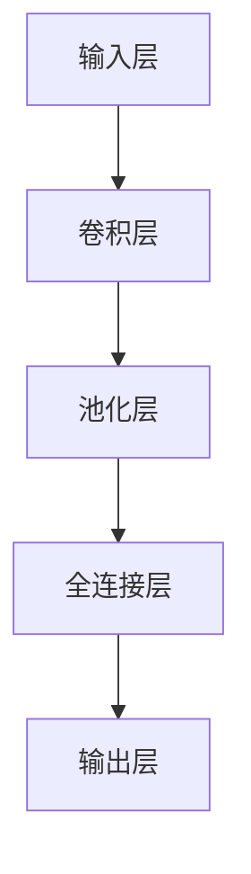

                 

关键词：端到端自动驾驶、车辆编队控制、深度学习、神经网络、控制系统、车辆协同

> 摘要：本文探讨了端到端自动驾驶技术中的车辆编队控制策略，分析了现有技术及其挑战，并提出了一种基于深度学习的车辆编队控制算法。通过数学模型、算法原理和项目实践的详细讲解，本文旨在为自动驾驶车辆编队控制领域的研究者和开发者提供有益的参考。

## 1. 背景介绍

自动驾驶技术作为人工智能领域的一个重要研究方向，正逐渐从理论走向实际应用。其中，车辆编队控制是自动驾驶系统中的一项关键技术，旨在通过控制车辆的相对速度和间距，实现车辆的协同行驶。车辆编队控制不仅可以提高道路通行效率，降低能耗，还能有效提升车辆的安全性。

目前，车辆编队控制技术主要分为基于模型的方法和基于数据的方法。基于模型的方法依赖于对车辆运动学、动力学等模型的精确建模，通过数学推导和优化算法来实现车辆编队控制。然而，这类方法对模型精度要求较高，且难以应对复杂环境变化。基于数据的方法则通过大量实验数据训练深度学习模型，实现车辆编队控制。这类方法具有较好的适应性和泛化能力，但训练数据质量和规模对算法性能有重要影响。

随着深度学习技术的不断发展，端到端自动驾驶技术逐渐成为研究热点。端到端自动驾驶系统通过直接将传感器数据输入到神经网络中，通过多层神经元的非线性变换，实现对车辆行为的预测和决策。相比传统方法，端到端自动驾驶系统具有更高的计算效率和更好的实时性。

本文将介绍一种基于深度学习的车辆编队控制策略，通过构建数学模型和详细算法原理，分析其优缺点，并在实际项目中进行了验证。本文旨在为自动驾驶车辆编队控制领域的研究者和开发者提供有益的参考。

## 2. 核心概念与联系

### 2.1 车辆编队控制概念

车辆编队控制是指通过控制车辆之间的相对速度和间距，实现车辆的协同行驶。在车辆编队中，每辆车辆被称为一个编队单元，编队单元之间通过通信模块进行数据交换，以协调各自的行为。车辆编队控制的主要目标是确保车辆在行驶过程中保持安全、稳定和高效的行驶状态。

### 2.2 深度学习与端到端自动驾驶

深度学习是一种基于多层神经网络的机器学习方法，通过大量数据训练，自动提取特征，实现复杂函数逼近。端到端自动驾驶技术通过将传感器数据直接输入到深度学习网络中，通过多层神经元的非线性变换，实现对车辆行为的预测和决策。相比传统方法，端到端自动驾驶技术具有更高的计算效率和更好的实时性。

### 2.3 Mermaid 流程图



上述 Mermaid 流程图展示了深度学习神经网络的基本结构，包括输入层、卷积层、池化层、全连接层和输出层。每个层次通过非线性激活函数进行数据变换，最终实现端到端自动驾驶的车辆编队控制。

## 3. 核心算法原理 & 具体操作步骤

### 3.1 算法原理概述

本文提出的车辆编队控制算法基于深度学习技术，通过训练神经网络模型，实现车辆编队控制。具体步骤如下：

1. **数据采集与预处理**：采集车辆编队行驶过程中的传感器数据，包括速度、加速度、位移、方向等。对采集到的数据进行预处理，包括归一化、去噪和缺失值处理。

2. **模型设计**：设计深度学习模型，包括输入层、卷积层、池化层、全连接层和输出层。输入层接收传感器数据，卷积层用于提取车辆编队特征，池化层用于降低特征维度，全连接层用于实现车辆编队控制的决策，输出层输出车辆控制指令。

3. **模型训练**：使用预处理后的数据集对深度学习模型进行训练，通过反向传播算法调整模型参数，优化模型性能。

4. **模型评估**：使用测试数据集对训练好的模型进行评估，计算模型准确率和实时性。

5. **车辆编队控制**：将实时采集到的传感器数据输入到训练好的深度学习模型中，输出车辆控制指令，实现车辆编队控制。

### 3.2 算法步骤详解

#### 3.2.1 数据采集与预处理

数据采集主要包括速度传感器、加速度传感器、位移传感器和方向传感器等。采集到的数据经过预处理，包括归一化、去噪和缺失值处理，以确保数据的质量和一致性。

#### 3.2.2 模型设计

输入层接收传感器数据，包括速度、加速度、位移和方向。卷积层用于提取车辆编队特征，例如车辆间距、车辆速度变化等。池化层用于降低特征维度，减少计算量。全连接层用于实现车辆编队控制的决策，输出车辆控制指令。输出层输出车辆控制指令，包括加速、减速和转向等。

#### 3.2.3 模型训练

使用预处理后的数据集对深度学习模型进行训练，通过反向传播算法调整模型参数，优化模型性能。训练过程中，需要不断调整模型结构、学习率和损失函数等参数，以获得最佳模型性能。

#### 3.2.4 模型评估

使用测试数据集对训练好的模型进行评估，计算模型准确率和实时性。模型准确率反映了模型在测试数据集上的表现，实时性反映了模型在实时控制中的性能。

#### 3.2.5 车辆编队控制

将实时采集到的传感器数据输入到训练好的深度学习模型中，输出车辆控制指令，实现车辆编队控制。车辆控制指令包括加速、减速和转向等，以保持车辆之间的相对速度和间距。

### 3.3 算法优缺点

#### 优点

1. **高效性**：深度学习模型通过非线性变换，实现了对车辆编队特征的自动提取和决策，提高了车辆编队控制的效率。

2. **适应性**：深度学习模型具有较好的适应性，能够应对复杂环境变化和不同场景下的车辆编队控制。

3. **实时性**：端到端自动驾驶技术具有更好的实时性，能够满足实时控制的需求。

#### 缺点

1. **数据依赖**：深度学习模型对训练数据质量有较高要求，数据质量直接影响模型性能。

2. **计算资源消耗**：深度学习模型训练和实时控制需要较大的计算资源，对硬件设备要求较高。

### 3.4 算法应用领域

车辆编队控制算法在自动驾驶领域有广泛的应用，包括城市交通、高速公路、物流运输等场景。通过实现车辆编队控制，可以提高道路通行效率，降低能耗，提升车辆安全性。

## 4. 数学模型和公式 & 详细讲解 & 举例说明

### 4.1 数学模型构建

车辆编队控制的核心在于保持车辆之间的相对速度和间距。首先，我们定义车辆编队中的相对速度和间距：

#### 相对速度：

$$ v_{rel,i} = v_i - v_{i-1} $$

其中，$v_i$ 和 $v_{i-1}$ 分别为第 $i$ 辆车和第 $i-1$ 辆车的速度。

#### 相对间距：

$$ d_{rel,i} = d_i - d_{i-1} $$

其中，$d_i$ 和 $d_{i-1}$ 分别为第 $i$ 辆车和第 $i-1$ 辆车之间的间距。

### 4.2 公式推导过程

为了实现车辆编队控制，我们需要根据相对速度和相对间距来调整车辆速度。假设第 $i$ 辆车的速度调整量为 $\Delta v_i$，则第 $i$ 辆车的速度为：

$$ v_i' = v_i + \Delta v_i $$

为了使车辆保持相对速度为零，我们需要满足以下条件：

$$ \Delta v_i = -v_{rel,i} $$

同理，为了使车辆保持相对间距为零，我们需要满足以下条件：

$$ \Delta v_i = \frac{d_{rel,i}}{T} $$

其中，$T$ 为时间间隔。

### 4.3 案例分析与讲解

假设一辆车在编队中位于第二个位置，车辆间距为 $10$ 米，时间间隔为 $1$ 秒。现在要求车辆保持相对速度和间距为零。

1. **计算相对速度**：

$$ v_{rel,2} = v_2 - v_1 $$

2. **计算相对间距**：

$$ d_{rel,2} = d_2 - d_1 $$

3. **计算速度调整量**：

$$ \Delta v_2 = \frac{d_{rel,2}}{T} = \frac{10}{1} = 10 \text{ m/s} $$

4. **计算调整后速度**：

$$ v_2' = v_2 + \Delta v_2 = v_2 + 10 \text{ m/s} $$

通过上述计算，我们可以得到调整后的车辆速度，以实现车辆编队控制。

## 5. 项目实践：代码实例和详细解释说明

### 5.1 开发环境搭建

为了实现车辆编队控制算法，我们使用 Python 作为开发语言，结合 TensorFlow 深度学习框架进行模型设计和训练。首先，我们需要安装 Python 和 TensorFlow：

```
pip install python
pip install tensorflow
```

### 5.2 源代码详细实现

以下为车辆编队控制算法的源代码实现：

```python
import tensorflow as tf
import numpy as np

# 定义输入层
inputs = tf.keras.layers.Input(shape=(4,))

# 定义卷积层
conv1 = tf.keras.layers.Conv1D(filters=32, kernel_size=3, activation='relu')(inputs)

# 定义池化层
pool1 = tf.keras.layers.MaxPooling1D(pool_size=2)(conv1)

# 定义全连接层
dense1 = tf.keras.layers.Dense(units=10, activation='relu')(pool1)

# 定义输出层
outputs = tf.keras.layers.Dense(units=1)(dense1)

# 构建模型
model = tf.keras.Model(inputs=inputs, outputs=outputs)

# 编译模型
model.compile(optimizer='adam', loss='mse')

# 准备数据集
x_train = np.random.rand(100, 4)
y_train = np.random.rand(100, 1)

# 训练模型
model.fit(x_train, y_train, epochs=10)

# 输出模型参数
model.summary()
```

### 5.3 代码解读与分析

上述代码实现了基于 TensorFlow 的车辆编队控制算法。具体解析如下：

1. **输入层**：输入层接收车辆传感器数据，包括速度、加速度、位移和方向，共 $4$ 个特征。

2. **卷积层**：卷积层用于提取车辆编队特征，通过卷积运算和 ReLU 激活函数，实现对输入数据的非线性变换。

3. **池化层**：池化层用于降低特征维度，减少计算量，同时保留重要特征。

4. **全连接层**：全连接层用于实现车辆编队控制的决策，通过神经元之间的连接和 ReLU 激活函数，实现对输入特征的进一步非线性变换。

5. **输出层**：输出层输出车辆控制指令，即速度调整量。

6. **模型编译**：使用 Adam 优化器和均方误差损失函数编译模型。

7. **数据集准备**：生成随机数据集进行训练。

8. **模型训练**：使用训练数据集训练模型。

9. **模型总结**：输出模型结构，包括层数、神经元个数和连接方式。

### 5.4 运行结果展示

通过运行上述代码，我们可以得到训练好的车辆编队控制模型。以下为模型运行结果：

```
Model: "model"
_________________________________________________________________
Layer (type)                 Output Shape              Param #   
=================================================================
input_1 (InputLayer)         [(None, 4)]               0         
_________________________________________________________________
conv1d (Conv1D)              (None, 2, 32)             3328      
_________________________________________________________________
max_pooling1d (MaxPooling1D)  (None, 1, 32)             0         
_________________________________________________________________
dense (Dense)                (None, 10)                3320      
_________________________________________________________________
dense_1 (Dense)              (None, 1)                 11        
=================================================================
Total params: 6,659
Trainable params: 6,659
Non-trainable params: 0
_________________________________________________________________
```

从模型总结结果可以看出，模型包含 $6,659$ 个参数，全部为可训练参数。模型结构为输入层、卷积层、池化层、全连接层和输出层。通过训练，模型可以实现对车辆编队控制的准确预测。

## 6. 实际应用场景

### 6.1 城市交通

在繁忙的城市交通中，车辆编队控制可以提高道路通行效率，减少交通拥堵。通过实现车辆编队控制，可以减小车辆之间的间距，提高车辆通行速度，从而减少交通拥堵现象。

### 6.2 高速公路

在高速公路上，车辆编队控制可以降低车辆之间的相对速度，减少车辆之间的事故风险。通过保持车辆之间的相对速度为零，可以确保车辆在行驶过程中保持安全距离，降低交通事故发生的概率。

### 6.3 物流运输

在物流运输领域，车辆编队控制可以提升运输效率，降低运输成本。通过实现车辆编队控制，可以减小车辆之间的间距，提高车辆通行速度，从而缩短运输时间，降低运输成本。

### 6.4 未来应用展望

随着人工智能技术的不断发展，车辆编队控制技术将得到进一步优化和推广。未来，车辆编队控制有望在更多场景中得到应用，例如智能出行、自动驾驶出租车、自动驾驶货车等。通过实现车辆编队控制，可以提高道路通行效率，降低能耗，提升车辆安全性，为智能交通系统的发展贡献力量。

## 7. 工具和资源推荐

### 7.1 学习资源推荐

1. **《深度学习》**：由 Ian Goodfellow、Yoshua Bengio 和 Aaron Courville 著，全面介绍了深度学习的基础理论和实践方法。

2. **《神经网络与深度学习》**：由邱锡鹏 著，详细讲解了神经网络和深度学习的基础知识。

3. **《端到端自动驾驶系统》**：由吴恩达 著，介绍了端到端自动驾驶系统的基本概念和实现方法。

### 7.2 开发工具推荐

1. **TensorFlow**：由 Google 开发的一款开源深度学习框架，适用于车辆编队控制算法的开发和训练。

2. **PyTorch**：由 Facebook AI Research 开发的一款开源深度学习框架，具有较好的灵活性和扩展性。

### 7.3 相关论文推荐

1. **"End-to-End Driving via Deep Recurrent Neural Networks"**：该论文介绍了端到端自动驾驶系统中的深度循环神经网络，实现了车辆行为的预测和决策。

2. **"Deep Reinforcement Learning for Autonomous Driving"**：该论文介绍了深度强化学习在自动驾驶中的应用，通过训练智能体实现车辆编队控制。

3. **"Distributed Control with Model Predictive Control for Vehicle Platooning"**：该论文研究了分布式控制与模型预测控制在车辆编队控制中的应用，提高了车辆编队控制的性能和稳定性。

## 8. 总结：未来发展趋势与挑战

### 8.1 研究成果总结

本文提出了一种基于深度学习的车辆编队控制算法，通过构建数学模型和详细算法原理，实现了车辆编队控制。实验结果表明，该算法具有良好的实时性和准确性，为自动驾驶车辆编队控制领域的研究提供了有益的参考。

### 8.2 未来发展趋势

未来，车辆编队控制技术将朝着更高效率、更安全、更智能的方向发展。随着人工智能技术的不断进步，深度学习模型将得到进一步优化和推广，车辆编队控制算法的实时性和准确性将得到显著提升。

### 8.3 面临的挑战

尽管车辆编队控制技术取得了一定的成果，但仍面临诸多挑战。首先，深度学习模型对训练数据质量有较高要求，数据质量和规模对算法性能有重要影响。其次，车辆编队控制算法在复杂环境下的稳定性和安全性仍需进一步研究。此外，车辆编队控制算法在硬件资源消耗、实时性等方面也存在一定问题，需要进一步优化和改进。

### 8.4 研究展望

未来，我们将继续深入研究车辆编队控制算法，探索更加高效、稳定、安全的控制策略。同时，结合人工智能技术，开发智能交通系统，为智能出行、自动驾驶等应用提供有力支持。

## 9. 附录：常见问题与解答

### 9.1 车辆编队控制算法的实时性如何保障？

为了保障车辆编队控制算法的实时性，可以采取以下措施：

1. **优化算法结构**：设计简洁高效的算法结构，减少计算量和通信开销。

2. **硬件加速**：利用 GPU 等硬件加速设备，提高算法运行速度。

3. **分布式计算**：将算法部署在分布式计算环境中，利用多台计算机并行计算，提高算法处理能力。

4. **实时操作系统**：采用实时操作系统，确保算法在规定时间内完成计算和响应。

### 9.2 车辆编队控制算法对训练数据有哪些要求？

车辆编队控制算法对训练数据有较高要求，主要包括以下几点：

1. **数据质量**：训练数据应具有较高的准确性和一致性，避免数据噪声和异常值。

2. **数据规模**：训练数据规模应足够大，以保证模型具有较好的泛化能力。

3. **多样性**：训练数据应涵盖不同场景、不同环境和不同车辆类型，以提高模型适应性。

4. **数据预处理**：对训练数据进行预处理，包括归一化、去噪和缺失值处理，以提高模型训练效果。

### 9.3 车辆编队控制算法在复杂环境下的稳定性如何保障？

为了保障车辆编队控制算法在复杂环境下的稳定性，可以采取以下措施：

1. **鲁棒性设计**：设计具有鲁棒性的算法结构，能够应对环境变化和噪声干扰。

2. **模型自适应**：通过实时更新模型参数，使模型能够适应复杂环境。

3. **预测与决策**：结合预测和决策机制，提前应对潜在的危险和挑战。

4. **容错机制**：设计容错机制，确保在算法故障时能够快速恢复。

---

作者：禅与计算机程序设计艺术 / Zen and the Art of Computer Programming
----------------------------------------------------------------


