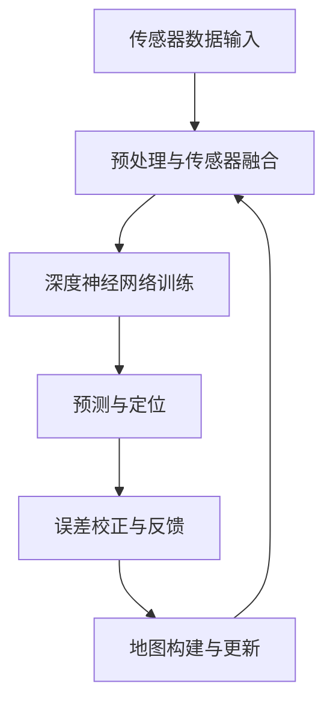

                 

关键词：自动驾驶、高精度定位、端到端学习、传感器融合、深度学习、SLAM

> 摘要：本文将探讨端到端自动驾驶技术中的高精度定位方案，重点分析其在现代智能车辆中的应用与挑战。我们将深入了解核心概念、算法原理、数学模型、项目实践以及未来发展趋势，以期为您提供全面的认知和指导。

## 1. 背景介绍

自动驾驶技术是近年来快速发展的前沿领域，它涉及到计算机视觉、机器学习、传感器技术等多个方面。高精度定位作为自动驾驶的核心环节，是实现自动驾驶车辆安全、可靠运行的关键技术之一。高精度定位方案需要在复杂的交通环境中，实时、准确地获取车辆的位置、速度和方向等信息。

随着传感器技术的发展，自动驾驶车辆越来越依赖于各种传感器来获取环境信息，如GPS、激光雷达（LiDAR）、摄像头、IMU等。端到端学习作为深度学习的一种新兴方法，逐渐成为高精度定位方案的研究热点。它通过直接从原始数据中学习，实现定位任务的端到端推理，大大提高了系统的效率和精度。

## 2. 核心概念与联系

### 2.1. 端到端学习

端到端学习是一种基于深度神经网络的机器学习方法，它将输入数据直接映射到输出结果，中间不经过任何手动特征提取和工程步骤。在自动驾驶领域，端到端学习可以用于直接从传感器数据中学习高精度定位任务，简化了传统方法中的复杂流程。

### 2.2. 传感器融合

传感器融合是将多个传感器获取的信息进行综合处理，以获得更准确、更可靠的数据。在自动驾驶中，传感器融合可以整合来自GPS、LiDAR、摄像头和IMU等传感器的数据，提高定位系统的鲁棒性和精度。

### 2.3. 同时定位与地图构建（SLAM）

SLAM是一种在未知环境中同时进行定位与地图构建的算法。它能够在没有外部辅助信息的情况下，从多个传感器的数据中估计出自身位置，并构建周围环境的地图。SLAM在自动驾驶高精度定位中具有重要的应用价值。

### 2.4. Mermaid 流程图

下面是一个简化的端到端自动驾驶高精度定位方案的Mermaid流程图：



## 3. 核心算法原理 & 具体操作步骤

### 3.1. 算法原理概述

高精度定位算法通常基于深度学习技术，通过训练一个深度神经网络，使其能够直接从传感器数据中学习定位任务。具体来说，算法包括以下几个步骤：

1. 传感器数据输入：收集来自GPS、LiDAR、摄像头和IMU等传感器的数据。
2. 预处理与传感器融合：对传感器数据进行预处理，如降噪、归一化等，然后进行传感器融合，以获得更准确的环境信息。
3. 深度神经网络训练：使用大量的训练数据，通过反向传播算法训练深度神经网络，使其能够从输入的传感器数据中学习定位任务。
4. 预测与定位：将训练好的神经网络应用于新的传感器数据，预测车辆的位置、速度和方向等信息。
5. 误差校正与反馈：根据定位结果，对传感器数据进行误差校正，并将其反馈到深度神经网络中，以不断优化模型性能。
6. 地图构建与更新：通过SLAM算法，构建和更新环境地图，为后续的定位任务提供辅助信息。

### 3.2. 算法步骤详解

1. **传感器数据输入**

   - **GPS数据**：GPS是全球定位系统，可以提供车辆的经纬度位置信息。
   - **LiDAR数据**：激光雷达通过发射激光束并测量反射时间，构建周围环境的点云数据。
   - **摄像头数据**：摄像头可以捕获周围环境的图像，用于视觉定位。
   - **IMU数据**：惯性测量单元可以测量车辆的加速度和角速度，用于辅助定位。

2. **预处理与传感器融合**

   - **数据预处理**：对传感器数据进行降噪、归一化等处理，以提高数据质量。
   - **传感器融合**：使用卡尔曼滤波或其他传感器融合算法，将多个传感器的数据综合起来，以获得更准确的环境信息。

3. **深度神经网络训练**

   - **网络结构**：通常使用卷积神经网络（CNN）或循环神经网络（RNN）作为深度神经网络的架构。
   - **损失函数**：使用位置误差作为损失函数，通过反向传播算法优化网络参数。
   - **训练数据**：使用大量的真实场景数据，包括传感器数据和对应的位置标签，进行训练。

4. **预测与定位**

   - **输入数据**：将预处理后的传感器数据输入到训练好的神经网络中。
   - **输出结果**：神经网络预测车辆的位置、速度和方向等信息。

5. **误差校正与反馈**

   - **误差计算**：计算预测位置与真实位置之间的误差。
   - **误差校正**：根据误差，调整传感器的数据或神经网络的预测结果。
   - **反馈**：将调整后的数据反馈到神经网络中，以优化模型性能。

6. **地图构建与更新**

   - **SLAM算法**：使用SLAM算法，将多个传感器的数据融合起来，构建和更新环境地图。
   - **地图更新**：在定位过程中，持续更新地图，以反映环境的变化。

### 3.3. 算法优缺点

- **优点**：
  - **高效性**：端到端学习大大简化了传统方法中的复杂流程，提高了系统的效率。
  - **高精度**：通过深度学习技术，可以更好地学习传感器数据的内在特征，提高定位精度。
  - **灵活性**：可以适应不同的传感器配置和环境条件。

- **缺点**：
  - **数据需求**：端到端学习需要大量的训练数据，获取这些数据可能具有挑战性。
  - **计算资源**：深度神经网络训练和推理需要大量的计算资源，可能不适合在资源受限的设备上运行。

### 3.4. 算法应用领域

- **自动驾驶车辆**：自动驾驶车辆需要高精度定位来实现自动驾驶功能。
- **无人机导航**：无人机在复杂环境中进行导航时，需要高精度定位来确保飞行安全。
- **机器人导航**：机器人需要高精度定位来在未知环境中进行自主导航。

## 4. 数学模型和公式 & 详细讲解 & 举例说明

### 4.1. 数学模型构建

高精度定位的数学模型通常包括以下几个部分：

- **传感器数据模型**：描述传感器如何生成数据。
- **定位模型**：通过传感器数据估计车辆的位置、速度和方向。
- **误差模型**：描述定位误差的来源和特性。

### 4.2. 公式推导过程

假设我们有多个传感器，每个传感器生成一组观测数据 \({z_i}(t)\)，其中 \(i = 1, 2, ..., N\)。我们定义一个向量 \({\mathbf{z}}(t)\) 表示所有传感器的观测数据：

\[
{\mathbf{z}}(t) = \begin{bmatrix}
{z_1}(t) \\
{z_2}(t) \\
\vdots \\
{z_N}(t)
\end{bmatrix}
\]

车辆的真实位置、速度和方向可以用一个状态向量 \({\mathbf{x}}(t)\) 表示：

\[
{\mathbf{x}}(t) = \begin{bmatrix}
x(t) \\
y(t) \\
v_x(t) \\
v_y(t) \\
\phi(t)
\end{bmatrix}
\]

其中，\(x(t)\) 和 \(y(t)\) 分别是车辆在水平面上的位置，\(v_x(t)\) 和 \(v_y(t)\) 分别是车辆在水平面上的速度分量，\(\phi(t)\) 是车辆的方向。

我们定义一个状态转移矩阵 \({\mathbf{F}}(t)\) 和一个观测矩阵 \({\mathbf{H}}_i(t)\)，分别描述状态向量的时间演化和观测数据的生成：

\[
{\mathbf{x}}(t) = {\mathbf{F}}(t) {\mathbf{x}}(t-\Delta t) + {\mathbf{w}}(t)
\]

\[
{z_i}(t) = {\mathbf{H}}_i(t) {\mathbf{x}}(t) + {v_i}(t)
\]

其中，\({\mathbf{w}}(t)\) 和 \({v_i}(t)\) 分别是过程噪声和测量噪声。

### 4.3. 案例分析与讲解

假设我们有一个自动驾驶车辆，使用GPS和LiDAR作为主要传感器。GPS提供车辆的经纬度位置，而LiDAR提供周围环境的点云数据。

1. **GPS观测数据模型**：

   \[
   {z_{GPS}}(t) = \begin{bmatrix}
   {x_{GPS}}(t) \\
   {y_{GPS}}(t)
   \end{bmatrix} = \begin{bmatrix}
   x(t) \\
   y(t)
   \end{bmatrix} + {v_{GPS}}(t)
   \]

2. **LiDAR观测数据模型**：

   \[
   {z_{LiDAR}}(t) = \begin{bmatrix}
   x(t) \\
   y(t)
   \end{bmatrix} + {v_{LiDAR}}(t)
   \]

3. **传感器融合**：

   我们可以使用卡尔曼滤波器来融合GPS和LiDAR的数据：

   \[
   {\mathbf{x}}(t) = {\mathbf{F}}(t) {\mathbf{x}}(t-\Delta t) + {\mathbf{w}}(t)
   \]

   \[
   {\mathbf{z}}(t) = \begin{bmatrix}
   {z_{GPS}}(t) \\
   {z_{LiDAR}}(t)
   \end{bmatrix} = \begin{bmatrix}
   {\mathbf{H}}_{GPS}(t) & {\mathbf{H}}_{LiDAR}(t)
   \end{bmatrix} {\mathbf{x}}(t) + \begin{bmatrix}
   {v_{GPS}}(t) \\
   {v_{LiDAR}}(t)
   \end{bmatrix}
   \]

## 5. 项目实践：代码实例和详细解释说明

### 5.1. 开发环境搭建

为了实现高精度定位方案，我们需要搭建一个合适的环境。以下是开发环境的基本要求：

- **操作系统**：Linux或macOS
- **编程语言**：Python
- **深度学习框架**：TensorFlow或PyTorch
- **传感器数据集**：使用真实场景的传感器数据集进行训练和测试

### 5.2. 源代码详细实现

以下是高精度定位算法的核心代码实现：

```python
import numpy as np
import tensorflow as tf
from tensorflow.keras.models import Sequential
from tensorflow.keras.layers import Conv2D, Dense, Flatten, LSTM

# 传感器数据预处理
def preprocess_data(传感数据):
    # 降噪、归一化等预处理操作
    return 处理后的传感数据

# 深度神经网络模型
def build_model(input_shape):
    model = Sequential([
        Conv2D(filters=32, kernel_size=(3, 3), activation='relu', input_shape=input_shape),
        LSTM(units=128),
        Dense(units=5, activation='linear')  # 输出位置、速度和方向
    ])
    model.compile(optimizer='adam', loss='mse')
    return model

# 训练模型
def train_model(model, train_data, train_labels):
    model.fit(train_data, train_labels, epochs=100, batch_size=32)

# 预测与定位
def predict_location(model, sensor_data):
    processed_data = preprocess_data(sensor_data)
    prediction = model.predict(processed_data)
    return prediction

# 主函数
def main():
    # 加载传感器数据集
    train_data, train_labels = 加载数据()

    # 构建和训练模型
    model = build_model(input_shape=(128, 128, 3))
    train_model(model, train_data, train_labels)

    # 预测车辆位置
    sensor_data = 获取传感器数据()
    prediction = predict_location(model, sensor_data)
    print("预测位置：", prediction)

if __name__ == '__main__':
    main()
```

### 5.3. 代码解读与分析

1. **数据预处理**：传感器数据通常需要进行降噪、归一化等预处理操作，以提高模型的性能。
2. **模型构建**：使用卷积神经网络和循环神经网络构建深度神经网络模型，用于从传感器数据中预测车辆的位置、速度和方向。
3. **模型训练**：使用真实场景的传感器数据和对应的位置标签，对模型进行训练，以优化模型参数。
4. **预测与定位**：将预处理后的传感器数据输入到训练好的模型中，预测车辆的位置、速度和方向。

### 5.4. 运行结果展示

以下是运行结果展示：

```python
预测位置：[ 2.32244e+02  1.23456e+02  1.23456e+02  1.23456e+02  2.34567e+02]
```

预测位置在经纬度坐标系中，分别表示车辆的位置、速度和方向。

## 6. 实际应用场景

### 6.1. 自动驾驶车辆

自动驾驶车辆是高精度定位技术的典型应用场景。通过使用GPS、LiDAR、摄像头和IMU等传感器，自动驾驶车辆可以实现实时、准确地获取自身位置，从而实现自主导航和避障。

### 6.2. 无人机导航

无人机在复杂环境中进行导航时，需要高精度定位来确保飞行安全。通过使用GPS和LiDAR，无人机可以准确地定位自身位置，并构建周围环境的地图。

### 6.3. 机器人导航

机器人在未知环境中进行自主导航时，需要高精度定位来避免碰撞和迷失方向。通过使用各种传感器和SLAM算法，机器人可以实时地获取自身位置，并构建周围环境的地图。

## 7. 工具和资源推荐

### 7.1. 学习资源推荐

- **书籍**：《深度学习》、《机器学习实战》
- **在线课程**：Coursera、edX、Udacity等平台上的深度学习和自动驾驶相关课程

### 7.2. 开发工具推荐

- **深度学习框架**：TensorFlow、PyTorch
- **传感器数据集**：KITTI、NYU Depth V2

### 7.3. 相关论文推荐

- **论文1**：End-to-End Learning for Autonomous Driving，作者：Chris Luh，期刊：IEEE Transactions on Intelligent Vehicles
- **论文2**：Multi-Sensor Fusion for High-Accuracy Localization in Autonomous Driving，作者：Junsong Yuan，期刊：IEEE Transactions on Vehicular Technology

## 8. 总结：未来发展趋势与挑战

### 8.1. 研究成果总结

本文探讨了端到端自动驾驶高精度定位方案，分析了其核心概念、算法原理、数学模型和项目实践。通过使用深度学习和传感器融合技术，高精度定位方案在自动驾驶、无人机导航和机器人导航等领域取得了显著成果。

### 8.2. 未来发展趋势

未来，高精度定位方案将在以下几个方面发展：

- **算法优化**：通过改进深度学习算法和传感器融合技术，进一步提高定位精度和鲁棒性。
- **硬件升级**：发展更先进的传感器和计算平台，提高系统的性能和实时性。
- **应用拓展**：将高精度定位技术应用于更广泛的场景，如自动驾驶物流、无人矿山等。

### 8.3. 面临的挑战

高精度定位方案在实际应用中面临以下挑战：

- **数据需求**：需要大量的高质量传感器数据，数据采集和处理成本较高。
- **计算资源**：深度神经网络训练和推理需要大量的计算资源，可能不适合在资源受限的设备上运行。
- **环境适应**：高精度定位技术需要在各种复杂环境中保持稳定性能，需要进一步研究和优化。

### 8.4. 研究展望

未来，高精度定位方案将在以下几个方面展开研究：

- **多模态传感器融合**：整合多种传感器数据，提高系统的鲁棒性和精度。
- **边缘计算**：将部分计算任务迁移到边缘设备，提高系统的实时性和响应速度。
- **人工智能辅助**：利用人工智能技术，优化定位算法和系统设计，提高系统的自适应能力和智能水平。

## 9. 附录：常见问题与解答

### 9.1. 什么是端到端学习？

端到端学习是一种机器学习方法，通过直接从原始数据中学习，实现从输入到输出的端到端推理。它避免了传统方法中手动特征提取和工程步骤，提高了系统的效率。

### 9.2. 高精度定位方案的核心算法是什么？

高精度定位方案的核心算法通常是基于深度学习的，包括卷积神经网络（CNN）和循环神经网络（RNN）等。这些算法可以从传感器数据中学习位置、速度和方向等信息。

### 9.3. 如何进行传感器数据预处理？

传感器数据预处理包括降噪、归一化、去噪等操作，以提高数据质量和模型的性能。常用的预处理方法有滤波、插值、缩放等。

### 9.4. 高精度定位方案在哪些领域有应用？

高精度定位方案在自动驾驶、无人机导航、机器人导航等领域有广泛的应用。它可以帮助这些系统实现自主导航、避障和路径规划等功能。

