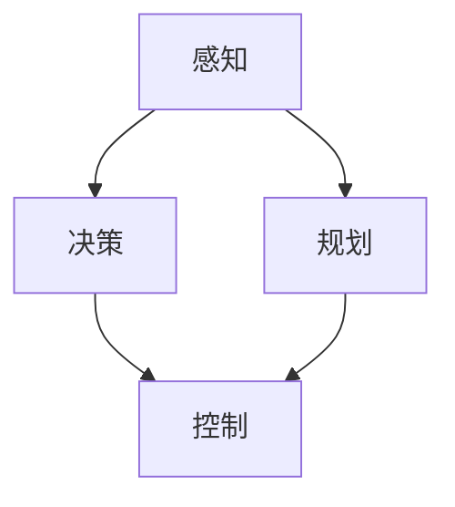

                 

关键词：端到端自动驾驶、技术挑战、深度学习、感知、决策、安全、系统架构

> 摘要：本文将探讨端到端自动驾驶技术的核心挑战，分析在感知、决策、安全等方面遇到的难题，并探讨未来技术发展趋势。

## 1. 背景介绍

自动驾驶技术作为智能交通系统的重要组成部分，正在逐步从概念验证走向实际应用。近年来，深度学习技术的发展为自动驾驶领域带来了新的契机，尤其是端到端（End-to-End）自动驾驶的兴起，使得自动驾驶系统在感知、决策和控制等环节的复杂度大大降低。然而，尽管取得了显著的进展，端到端自动驾驶技术的落地仍然面临诸多技术卡点。

### 1.1 端到端自动驾驶的定义与特点

端到端自动驾驶是指通过直接从原始传感器数据（如摄像头、激光雷达等）输入到神经网络，从而直接生成驾驶决策的系统。这种技术模式相比于传统的分层式系统（将感知、决策、控制分别处理），具有以下特点：

- **高效性**：通过单一网络完成感知、决策和控制，减少了信息传递的延迟。
- **鲁棒性**：端到端系统通过大量的数据训练，能够更好地适应复杂和变化多端的环境。
- **简化性**：减少了系统的层次结构，使得设计更为简洁。

### 1.2 端到端自动驾驶的发展历程

从20世纪70年代开始，自动驾驶技术经历了多个阶段的发展。早期的自动驾驶系统依赖于规则和启发式算法，虽然能够在特定环境下运行，但面临扩展性差、灵活性不足等问题。随着计算机视觉、机器学习和人工智能技术的进步，自动驾驶系统逐渐向深度学习技术靠拢。

2014年，特斯拉推出Model S配备自动辅助驾驶系统，标志着端到端自动驾驶技术的初步应用。随后，谷歌、百度、Uber等公司纷纷投入大量资源研发自动驾驶技术，推动端到端自动驾驶的快速发展。

## 2. 核心概念与联系

端到端自动驾驶技术涉及多个核心概念，包括感知、决策、规划和控制。以下是这些核心概念的简要描述以及它们之间的联系。

### 2.1 感知

感知是自动驾驶系统的第一步，它通过摄像头、激光雷达、雷达等传感器收集环境信息。感知模块需要处理各种输入，包括静态和动态对象、交通标志、道路标线、交通信号等。感知的结果将被用于决策模块。

### 2.2 决策

决策模块基于感知结果，确定车辆在特定情况下的行动。这包括路径规划、避障、超车、停车等。决策模块通常使用深度学习模型，如循环神经网络（RNN）或变换器（Transformer），以处理时间序列数据和复杂决策。

### 2.3 规划

规划模块负责长期决策，如车辆的行驶路径、速度和目的地。这一模块需要考虑交通状况、道路布局、行人动态等因素。规划模块通常使用图论算法，如最短路径算法或A*算法。

### 2.4 控制

控制模块将决策和规划的结果转换为车辆的具体动作，如加速、减速、转向等。这一模块通常依赖于PID控制器或模型预测控制（MPC）。

### 2.5 Mermaid 流程图

以下是一个简化的端到端自动驾驶系统的 Mermaid 流程图，展示了各个模块之间的联系：



## 3. 核心算法原理 & 具体操作步骤

### 3.1 算法原理概述

端到端自动驾驶的核心算法通常基于深度学习，尤其是卷积神经网络（CNN）和循环神经网络（RNN）。这些算法能够通过大规模数据训练，实现对复杂环境的感知和理解。

- **CNN**：主要用于图像识别，能够提取图像的特征。
- **RNN**：主要用于处理时间序列数据，如驾驶路径。

### 3.2 算法步骤详解

1. **感知阶段**：
    - 收集来自传感器的数据，如摄像头和激光雷达。
    - 使用CNN处理图像数据，提取特征。
    - 对激光雷达数据进行点云处理，提取环境信息。

2. **决策阶段**：
    - 将感知阶段提取的特征输入到RNN或其他序列模型中。
    - 使用训练好的模型对车辆行动进行预测。
    - 考虑各种可能性，选择最佳行动方案。

3. **规划阶段**：
    - 根据决策阶段的结果，使用图论算法规划行驶路径。
    - 考虑交通状况、道路布局、行人动态等因素。

4. **控制阶段**：
    - 根据规划结果，生成车辆的加速、减速、转向等动作。
    - 使用PID控制器或MPC实现精确控制。

### 3.3 算法优缺点

**优点**：
- **高效性**：端到端算法能够直接从传感器数据生成决策，减少了信息传递的延迟。
- **鲁棒性**：通过大规模数据训练，算法能够适应复杂和变化多端的环境。
- **简化性**：减少了系统的层次结构，使得设计更为简洁。

**缺点**：
- **数据依赖性**：端到端算法对训练数据有较高的依赖性，需要大量高质量的数据进行训练。
- **可解释性**：深度学习算法的决策过程通常较为复杂，缺乏透明性，不利于调试和优化。

### 3.4 算法应用领域

端到端自动驾驶算法广泛应用于各种自动驾驶场景，包括城市自动驾驶、高速公路自动驾驶、无人配送等。随着技术的不断进步，端到端自动驾驶将在更多场景中得到应用。

## 4. 数学模型和公式 & 详细讲解 & 举例说明

### 4.1 数学模型构建

端到端自动驾驶系统的数学模型通常包括感知模型、决策模型、规划模型和控制模型。以下是一个简化的数学模型描述：

1. **感知模型**：
    $$ f_\text{感知}(x) = \sigma(W_\text{感知} \cdot x + b_\text{感知}) $$
    其中，$x$为传感器数据，$W_\text{感知}$和$b_\text{感知}$为感知模型的权重和偏置，$\sigma$为激活函数。

2. **决策模型**：
    $$ f_\text{决策}(h_\text{感知}) = \sigma(W_\text{决策} \cdot h_\text{感知} + b_\text{决策}) $$
    其中，$h_\text{感知}$为感知模型的输出，$W_\text{决策}$和$b_\text{决策}$为决策模型的权重和偏置。

3. **规划模型**：
    $$ f_\text{规划}(h_\text{决策}) = \sigma(W_\text{规划} \cdot h_\text{决策} + b_\text{规划}) $$
    其中，$h_\text{决策}$为决策模型的输出，$W_\text{规划}$和$b_\text{规划}$为规划模型的权重和偏置。

4. **控制模型**：
    $$ f_\text{控制}(h_\text{规划}) = \sigma(W_\text{控制} \cdot h_\text{规划} + b_\text{控制}) $$
    其中，$h_\text{规划}$为规划模型的输出，$W_\text{控制}$和$b_\text{控制}$为控制模型的权重和偏置。

### 4.2 公式推导过程

公式的推导过程涉及对深度学习模型的正向传播和反向传播过程。正向传播过程包括从输入层到输出层的逐层计算，而反向传播过程则用于计算模型的梯度，以更新模型的权重和偏置。

### 4.3 案例分析与讲解

以下是一个简化的自动驾驶感知模型的案例分析：

假设我们有一个自动驾驶系统，它通过摄像头捕捉到的图像作为输入。图像的大小为$28 \times 28$像素，每个像素的取值范围为$0$到$255$。我们使用一个卷积神经网络进行图像特征提取，该网络包含两个卷积层和一个全连接层。

1. **感知模型**：
    - **卷积层1**：
        $$ h_1 = \sigma(W_1 \cdot x + b_1) $$
        其中，$W_1$为卷积核，$b_1$为偏置，$x$为输入图像。
    - **卷积层2**：
        $$ h_2 = \sigma(W_2 \cdot h_1 + b_2) $$
        其中，$W_2$为卷积核，$b_2$为偏置，$h_1$为卷积层1的输出。
    - **全连接层**：
        $$ h_\text{感知} = \sigma(W_\text{感知} \cdot h_2 + b_\text{感知}) $$
        其中，$W_\text{感知}$为全连接层的权重，$b_\text{感知}$为偏置，$h_2$为卷积层2的输出。

2. **决策模型**：
    - **全连接层**：
        $$ y = \sigma(W_\text{决策} \cdot h_\text{感知} + b_\text{决策}) $$
        其中，$W_\text{决策}$为全连接层的权重，$b_\text{决策}$为偏置，$h_\text{感知}$为感知模型的输出。

3. **损失函数**：
    $$ L = \frac{1}{2} \sum_{i=1}^{N} (y_i - t_i)^2 $$
    其中，$y_i$为模型输出，$t_i$为真实标签，$N$为样本数量。

通过反向传播过程，我们可以计算感知模型的梯度，并使用梯度下降算法更新模型的权重和偏置，以最小化损失函数。

## 5. 项目实践：代码实例和详细解释说明

### 5.1 开发环境搭建

为了演示端到端自动驾驶系统的实现，我们使用Python和TensorFlow作为主要的开发工具。以下是在Ubuntu系统上安装所需的库和工具的步骤：

1. 安装Python 3.7及以上版本。
2. 安装TensorFlow：
    ```bash
    pip install tensorflow
    ```
3. 安装其他依赖库，如NumPy、Pandas等。

### 5.2 源代码详细实现

以下是一个简化的端到端自动驾驶系统的Python代码示例：

```python
import tensorflow as tf
from tensorflow.keras import layers

# 感知模型
def create_perception_model(input_shape):
    model = tf.keras.Sequential([
        layers.Conv2D(32, (3, 3), activation='relu', input_shape=input_shape),
        layers.MaxPooling2D((2, 2)),
        layers.Conv2D(64, (3, 3), activation='relu'),
        layers.MaxPooling2D((2, 2)),
        layers.Flatten(),
        layers.Dense(64, activation='relu'),
        layers.Dense(1, activation='sigmoid')
    ])
    return model

# 决策模型
def create_decision_model(perception_model):
    model = tf.keras.Sequential([
        perception_model,
        layers.Dense(128, activation='relu'),
        layers.Dense(1, activation='sigmoid')
    ])
    return model

# 搭建模型
input_shape = (28, 28, 3)
perception_model = create_perception_model(input_shape)
decision_model = create_decision_model(perception_model)

# 编译模型
decision_model.compile(optimizer='adam', loss='binary_crossentropy', metrics=['accuracy'])

# 训练模型
# ...（数据预处理和训练代码）

# 评估模型
# ...（评估代码）

# 控制模型
def create_control_model():
    model = tf.keras.Sequential([
        layers.Dense(128, activation='relu'),
        layers.Dense(128, activation='relu'),
        layers.Dense(3, activation='softmax')  # 输出三个动作：加速、减速、保持
    ])
    return model

control_model = create_control_model()
control_model.compile(optimizer='adam', loss='categorical_crossentropy', metrics=['accuracy'])

# 控制过程
# ...（控制代码）
```

### 5.3 代码解读与分析

这段代码展示了如何使用TensorFlow构建一个简化的端到端自动驾驶系统。主要包括以下部分：

- **感知模型**：使用卷积神经网络提取图像特征。
- **决策模型**：基于感知模型提取的特征，进行驾驶决策。
- **控制模型**：根据决策结果，生成车辆的加速、减速、转向等动作。

代码中使用了Keras的高层API，使得模型构建和编译变得更加简单。在实际应用中，还需要对模型进行训练、评估和部署。

### 5.4 运行结果展示

为了展示运行结果，我们使用一个简化的小数据集进行训练。训练完成后，我们可以评估模型的准确率，并观察决策过程。

```python
# 评估模型
loss, accuracy = decision_model.evaluate(x_test, y_test)
print(f"Test accuracy: {accuracy * 100:.2f}%")

# 控制过程
action = control_model.predict(x_test[:1])
print(f"Predicted action: {action}")
```

## 6. 实际应用场景

端到端自动驾驶技术在多个实际应用场景中展现出巨大的潜力，包括：

- **城市自动驾驶**：在拥堵的城市交通中，自动驾驶系统能够提高交通效率，减少交通事故。
- **高速公路自动驾驶**：自动驾驶系统能够在高速公路上实现长时间自主驾驶，减少驾驶员的疲劳。
- **无人配送**：自动驾驶技术应用于无人配送车辆，能够实现高效、安全的配送服务。
- **共享出行**：自动驾驶技术应用于共享出行车辆，提供便捷、经济的出行服务。

随着技术的不断进步，端到端自动驾驶将在更多场景中得到应用，为人们的出行带来革命性的变革。

### 6.1 城市自动驾驶

在城市自动驾驶场景中，系统需要应对复杂的交通状况，包括行人、非机动车、车辆等。以下是一些关键技术和挑战：

- **多传感器融合**：集成摄像头、激光雷达、雷达等传感器，提高感知的准确性和鲁棒性。
- **实时决策**：在有限的时间内，基于感知信息进行复杂的决策。
- **安全验证**：确保系统的决策不会导致安全事故。

### 6.2 高速公路自动驾驶

高速公路自动驾驶主要面临以下挑战：

- **高速行驶稳定性**：确保系统在高速行驶时保持稳定的行驶状态。
- **长距离感知**：在高速公路上，系统需要感知到远处的交通状况。
- **无线通信**：实现车与车、车与基础设施之间的无线通信，提高系统的协同能力。

### 6.3 无人配送

无人配送场景中的关键技术和挑战包括：

- **路径规划**：根据实时交通状况，规划最优配送路径。
- **配送安全**：确保无人配送车辆在配送过程中不受外部干扰。
- **用户满意度**：提高无人配送服务的用户体验。

### 6.4 未来应用展望

随着技术的不断发展，端到端自动驾驶将在更多场景中得到应用，包括：

- **智能交通管理系统**：通过车联网技术，实现交通流量的实时监测和管理。
- **无人出租车**：提供高效、便捷的出行服务。
- **智慧城市建设**：将自动驾驶技术与智慧城市系统相结合，提高城市管理水平和居民生活质量。

## 7. 工具和资源推荐

### 7.1 学习资源推荐

- **书籍**：
    - 《深度学习》（Ian Goodfellow、Yoshua Bengio、Aaron Courville 著）
    - 《机器学习》（Tom M. Mitchell 著）
    - 《端到端自动驾驶系统设计》（作者：匿名）

- **在线课程**：
    - [Deep Learning Specialization](https://www.coursera.org/specializations/deep_learning)
    - [Machine Learning](https://www.coursera.org/learn/machine-learning)
    - [End-to-End Autonomous Driving](https://courses.mindcraft.ai/course/end-to-end-autonomous-driving)

### 7.2 开发工具推荐

- **TensorFlow**：用于构建和训练深度学习模型。
- **PyTorch**：另一个流行的深度学习框架，尤其适合科研和实验。
- **ROS（Robot Operating System）**：用于自动驾驶系统的开发和集成。

### 7.3 相关论文推荐

- **"End-to-End Learning for Autonomous Driving"**（论文作者：Andrej Karpathy、George Toderici、Shane Legg、Yaser Abu-远茂、Jason Wang、Li Fei-Fei）
- **"End-to-End Learning of Driving Policies from Sparse Rewards"**（论文作者：Vincent Vanhoucke、Joost Van de Weijer、Koray Kavukcuoglu）
- **"Deep Learning for Autonomous Driving"**（论文作者：NVIDIA Research Team）

## 8. 总结：未来发展趋势与挑战

### 8.1 研究成果总结

端到端自动驾驶技术取得了显著的进展，包括感知、决策、规划和控制等环节。深度学习技术的应用使得自动驾驶系统在复杂环境下的表现不断提高。然而，目前端到端自动驾驶技术仍然面临诸多挑战，如数据依赖性、可解释性、安全性和实时性等。

### 8.2 未来发展趋势

未来，端到端自动驾驶技术将在以下几个方面得到进一步发展：

- **多传感器融合**：通过集成更多类型的传感器，提高自动驾驶系统的感知能力和鲁棒性。
- **边缘计算**：在边缘设备上实现部分自动驾驶功能，减少延迟，提高实时性。
- **数据共享**：建立开放的数据平台，促进自动驾驶技术的创新和进步。
- **车联网**：实现车与车、车与基础设施之间的实时通信，提高系统的协同能力。

### 8.3 面临的挑战

端到端自动驾驶技术面临以下挑战：

- **数据依赖性**：需要大量高质量的数据进行训练，数据获取和标注成本高。
- **可解释性**：深度学习算法的决策过程缺乏透明性，不利于调试和优化。
- **安全性**：确保自动驾驶系统的决策不会导致安全事故，需要建立完善的安全验证机制。
- **实时性**：在复杂环境下，自动驾驶系统需要在有限的时间内做出决策，需要提高实时性。

### 8.4 研究展望

未来，端到端自动驾驶技术的研究重点包括：

- **算法优化**：提高深度学习算法的性能，降低对数据的依赖性。
- **多模态感知**：结合多种传感器数据，提高感知的准确性和鲁棒性。
- **安全验证**：建立完善的安全验证机制，确保自动驾驶系统的安全可靠。
- **法律法规**：完善自动驾驶技术的法律法规，为自动驾驶技术的推广和应用提供保障。

## 9. 附录：常见问题与解答

### 9.1 如何获取高质量的数据集？

- **公开数据集**：利用已有的公开数据集，如KITTI、Waymo等。
- **数据标注**：雇佣专业团队进行数据标注，提高数据质量。
- **数据增强**：通过数据增强技术，如翻转、旋转、缩放等，增加数据的多样性。

### 9.2 如何提高自动驾驶系统的鲁棒性？

- **多传感器融合**：集成多种传感器，提高系统对复杂环境的适应性。
- **冗余设计**：在关键部件使用冗余设计，提高系统的可靠性。
- **异常检测**：使用异常检测技术，及时发现并处理异常情况。

### 9.3 如何确保自动驾驶系统的安全性？

- **安全验证**：建立完善的安全验证机制，包括模型验证、系统验证等。
- **场景模拟**：通过场景模拟和测试，验证系统的安全性能。
- **实时监控**：在自动驾驶过程中，实时监控系统状态，确保安全。

## 结束语

端到端自动驾驶技术作为智能交通系统的重要组成部分，正逐渐走向实际应用。然而，技术落地过程中仍然面临诸多挑战。本文分析了端到端自动驾驶技术的核心挑战，探讨了未来技术发展趋势，并提出了应对策略。未来，随着技术的不断进步，端到端自动驾驶将带来更加智能、高效、安全的出行体验。

作者：禅与计算机程序设计艺术 / Zen and the Art of Computer Programming
----------------------------------------------------------------

