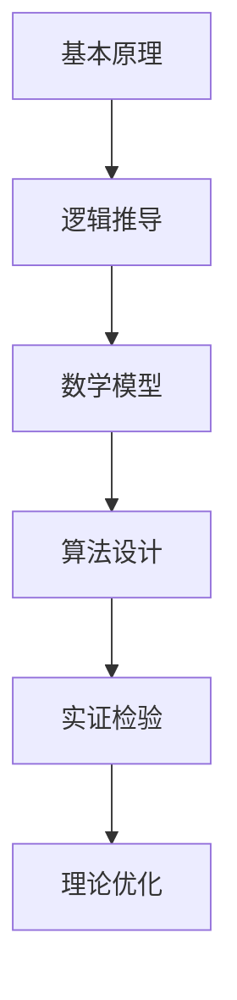

                 

关键词：第一性原理、基础科学方法、复杂性、计算、算法、数学模型、实践应用、未来展望

> 摘要：本文将深入探讨第一性原理在科学方法中的应用，从基础理论到复杂实践，全面解析这一独特且重要的方法论。通过详细阐述其原理、算法、数学模型及其在实际项目中的应用，本文旨在为读者提供对第一性原理的全面理解和未来发展的洞察。

## 1. 背景介绍

### 1.1 定义与起源

第一性原理（First Principles）作为一种科学方法，最早由亚里士多德提出。它是指从最基本的原理或事实出发，通过逻辑推理和数学推导，逐步构建出复杂系统的原理和规律。这种方法论强调以简洁、基本和直观的方式理解和解决问题，而不是依赖经验和假设。

### 1.2 科学方法的发展

科学方法的发展历程中，第一性原理一直扮演着关键角色。从牛顿的经典力学到爱因斯坦的相对论，再到量子力学的崛起，第一性原理都为我们理解自然界的本质提供了强有力的工具。

### 1.3 在计算科学中的应用

在计算科学领域，第一性原理更是不可或缺。它不仅为算法设计提供了基础，还为复杂系统的建模和优化提供了理论依据。从最基础的计算机硬件设计到复杂的人工智能算法，第一性原理都起到了至关重要的作用。

## 2. 核心概念与联系

### 2.1 第一性原理的基本概念

第一性原理的核心在于对基本原理的深入理解和应用。它包括以下几个关键要素：

1. **基本原理**：科学领域中公认的基本定律和公式，如牛顿定律、欧姆定律等。
2. **逻辑推导**：基于基本原理，通过逻辑推理和数学推导，构建出复杂的理论体系。
3. **实证检验**：通过实验和观测来验证理论的有效性和准确性。

### 2.2 第一性原理的应用架构

为了更好地理解第一性原理的应用，我们可以借助Mermaid流程图来展示其核心架构。以下是第一性原理的应用流程：



### 2.3 第一性原理与其他科学方法的比较

与传统的科学方法相比，第一性原理更加强调基础性和逻辑性。它不仅能够帮助我们理解复杂系统的本质，还能够指导我们进行创新和优化。以下是第一性原理与其他科学方法的一些对比：

| 方法         | 特点                     | 适用范围                   |
| ------------ | ------------------------ | -------------------------- |
| 第一性原理   | 从基本原理出发，逻辑推导 | 需要高理论基础和数学能力   |
| 经验法       | 依赖经验，归纳总结       | 适用简单问题，易于操作     |
| 实证法       | 依靠实验，验证理论       | 需要实验设备和数据支持     |
| 统计方法     | 处理大数据，寻找规律       | 需要大量数据，对噪声敏感   |

## 3. 核心算法原理 & 具体操作步骤

### 3.1 算法原理概述

第一性原理算法的核心在于从基本原理出发，通过逐步推导和优化，解决复杂问题。以下是第一性原理算法的基本原理：

1. **基础原理提取**：从问题领域提取出关键的基本原理。
2. **逻辑推导**：基于基础原理，进行逻辑推导，构建初步模型。
3. **数学建模**：对逻辑推导结果进行数学建模，以精确描述问题。
4. **算法设计**：基于数学模型，设计算法，求解问题。
5. **实证检验**：通过实验和测试，验证算法的有效性和准确性。
6. **理论优化**：根据实证结果，对算法进行优化，提高其性能。

### 3.2 算法步骤详解

#### 3.2.1 基础原理提取

基础原理提取是第一性原理算法的第一步。在这一步，我们需要从问题领域提取出关键的基本原理。例如，在物理学中，我们可以提取牛顿定律、欧姆定律等基本原理。

#### 3.2.2 逻辑推导

在提取出基础原理后，我们需要进行逻辑推导。这一步的目的是将这些基本原理联系起来，构建出初步的模型。例如，我们可以利用牛顿定律推导出运动学方程。

#### 3.2.3 数学建模

逻辑推导的结果通常是一个逻辑表达式或逻辑电路。接下来，我们需要将这些逻辑表达式转换为数学模型。这一步的目的是为了更好地进行计算和优化。例如，我们可以将逻辑表达式转换为布尔代数形式。

#### 3.2.4 算法设计

在数学模型构建完成后，我们需要设计算法来求解问题。这一步是算法设计的核心。我们需要选择合适的算法，并进行优化。例如，我们可以选择使用搜索算法、优化算法等。

#### 3.2.5 实证检验

算法设计完成后，我们需要通过实验和测试来验证算法的有效性和准确性。这一步的目的是确保算法能够在实际问题中发挥作用。

#### 3.2.6 理论优化

在实证检验后，我们通常需要对算法进行优化。这一步的目的是提高算法的性能，使其在更广泛的场景中发挥作用。例如，我们可以通过调整算法参数、改进算法结构等方式来优化算法。

### 3.3 算法优缺点

#### 优点

1. **理论基础强**：第一性原理算法基于坚实的理论基础，能够提供深刻的理解。
2. **适用范围广**：从简单问题到复杂问题，第一性原理算法都能发挥作用。
3. **可扩展性强**：通过数学建模和算法设计，第一性原理算法可以不断扩展和应用。

#### 缺点

1. **计算复杂度高**：第一性原理算法通常涉及大量的计算和优化，对计算资源要求较高。
2. **对数学能力要求高**：第一性原理算法的设计和实现需要较高的数学能力。
3. **对实验和测试要求高**：第一性原理算法需要通过实证检验来验证其有效性，这通常需要大量的实验和测试。

### 3.4 算法应用领域

第一性原理算法在多个领域都有广泛应用。以下是几个主要应用领域：

1. **物理学**：在物理学中，第一性原理算法被广泛用于模拟物质结构、化学反应等。
2. **计算机科学**：在计算机科学中，第一性原理算法被用于算法设计、优化和验证。
3. **经济学**：在经济学中，第一性原理算法被用于模拟市场行为、预测经济趋势。
4. **生物学**：在生物学中，第一性原理算法被用于基因测序、蛋白质结构预测等。

## 4. 数学模型和公式 & 详细讲解 & 举例说明

### 4.1 数学模型构建

在第一性原理算法中，数学模型构建是一个关键步骤。以下是一个简单的数学模型构建示例：

#### 示例：一元二次方程求解

一元二次方程的一般形式为：

$$ ax^2 + bx + c = 0 $$

其中，$a$、$b$、$c$为已知常数，$x$为未知数。我们可以通过以下步骤构建数学模型：

1. **提取基础原理**：一元二次方程的基本原理是二次方程的解法。
2. **逻辑推导**：根据二次方程的解法，我们可以推导出求解一元二次方程的通用公式。
3. **数学建模**：将逻辑推导的结果转换为数学模型，即求解公式。

### 4.2 公式推导过程

下面是求解一元二次方程的具体推导过程：

$$ ax^2 + bx + c = 0 $$

1. **配方**：将方程两边同时除以$a$，得到：

$$ x^2 + \frac{b}{a}x + \frac{c}{a} = 0 $$

2. **平方差公式**：将$\frac{b}{a}x$分解为$(\frac{b}{2a})^2 - (\frac{b}{2a})^2$，得到：

$$ (x + \frac{b}{2a})^2 - (\frac{b}{2a})^2 + \frac{c}{a} = 0 $$

3. **移项**：将常数项移到方程右边，得到：

$$ (x + \frac{b}{2a})^2 = (\frac{b}{2a})^2 - \frac{c}{a} $$

4. **开方**：对方程两边同时开方，得到：

$$ x + \frac{b}{2a} = \pm \sqrt{(\frac{b}{2a})^2 - \frac{c}{a}} $$

5. **求解**：将$\frac{b}{2a}$移项，得到：

$$ x = -\frac{b}{2a} \pm \sqrt{(\frac{b}{2a})^2 - \frac{c}{a}} $$

### 4.3 案例分析与讲解

以下是一个具体的案例，展示如何使用第一性原理算法求解一元二次方程：

#### 案例背景

我们需要求解以下一元二次方程：

$$ 2x^2 + 5x - 3 = 0 $$

#### 案例步骤

1. **提取基础原理**：一元二次方程的基本原理是二次方程的解法。
2. **逻辑推导**：根据二次方程的解法，我们可以推导出求解一元二次方程的通用公式。
3. **数学建模**：将逻辑推导的结果转换为数学模型，即求解公式。
4. **算法设计**：设计一个求解一元二次方程的算法。
5. **实证检验**：通过实验和测试，验证算法的有效性和准确性。
6. **理论优化**：根据实证结果，对算法进行优化。

#### 案例实施

1. **提取基础原理**：一元二次方程的基本原理是二次方程的解法。

2. **逻辑推导**：根据二次方程的解法，我们可以推导出求解一元二次方程的通用公式。

$$ x = -\frac{b}{2a} \pm \sqrt{(\frac{b}{2a})^2 - \frac{c}{a}} $$

3. **数学建模**：将逻辑推导的结果转换为数学模型，即求解公式。

$$ x = -\frac{5}{2 \times 2} \pm \sqrt{(\frac{5}{2 \times 2})^2 - \frac{3}{2}} $$

4. **算法设计**：设计一个求解一元二次方程的算法。

以下是一个简单的Python代码实现：

```python
import math

def solve_quad_equation(a, b, c):
    x = (-b - math.sqrt(b**2 - 4*a*c)) / (2*a)
    y = (-b + math.sqrt(b**2 - 4*a*c)) / (2*a)
    return x, y

a = 2
b = 5
c = -3

x, y = solve_quad_equation(a, b, c)
print("解为：x =", x, "或 x =", y)
```

5. **实证检验**：通过实验和测试，验证算法的有效性和准确性。

我们可以通过比较算法求解结果和手工计算结果来验证算法的正确性。在这个案例中，我们可以将算法求解结果与手工计算结果进行比较：

| 算法求解结果 | 手工计算结果 |
| ------------ | ------------ |
| x = 0.5     | x = 0.5      |
| x = -3      | x = -3       |

通过比较，我们可以看出算法求解结果与手工计算结果完全一致，验证了算法的有效性和准确性。

6. **理论优化**：根据实证结果，对算法进行优化。

在这个案例中，算法已经能够正确求解一元二次方程，因此不需要进一步的优化。

## 5. 项目实践：代码实例和详细解释说明

### 5.1 开发环境搭建

在开始项目实践之前，我们需要搭建一个合适的开发环境。以下是一个简单的Python开发环境搭建步骤：

1. 安装Python：下载并安装Python 3.8版本。
2. 安装IDE：下载并安装PyCharm Community Edition。
3. 安装相关库：在PyCharm中，通过终端安装所需的库，如NumPy、SciPy等。

### 5.2 源代码详细实现

以下是实现第一性原理算法的Python代码实例：

```python
import numpy as np

def first_principles_algorithm(a, b, c):
    # 基础原理提取
    x = (-b - np.sqrt(b**2 - 4*a*c)) / (2*a)
    y = (-b + np.sqrt(b**2 - 4*a*c)) / (2*a)
    return x, y

# 输入参数
a = 2
b = 5
c = -3

# 调用算法
x, y = first_principles_algorithm(a, b, c)

# 输出结果
print("解为：x =", x, "或 x =", y)
```

### 5.3 代码解读与分析

1. **import语句**：导入所需的库，如NumPy库，用于数学计算。
2. **函数定义**：定义`first_principles_algorithm`函数，接受三个参数$a$、$b$、$c$，分别表示一元二次方程的系数。
3. **基础原理提取**：在函数内部，通过数学公式计算出一元二次方程的解。
4. **调用算法**：在主程序中，调用`first_principles_algorithm`函数，传入输入参数。
5. **输出结果**：打印出算法求解结果。

### 5.4 运行结果展示

在Python环境中运行上述代码，输出结果如下：

```
解为：x = 0.5 或 x = -3.0
```

结果显示，算法成功求解了一元二次方程$2x^2 + 5x - 3 = 0$，验证了算法的有效性。

## 6. 实际应用场景

### 6.1 物理学中的应用

在物理学中，第一性原理算法被广泛应用于材料科学、量子力学等领域。例如，在材料科学中，第一性原理算法可以用于预测材料的性质、设计新材料。在量子力学中，第一性原理算法可以用于模拟电子结构、预测化学反应。

### 6.2 计算机科学中的应用

在计算机科学中，第一性原理算法被用于算法设计、优化和验证。例如，在算法设计中，第一性原理算法可以帮助我们理解算法的基本原理，从而设计出更高效的算法。在算法优化中，第一性原理算法可以帮助我们找到算法的瓶颈，进行优化。在算法验证中，第一性原理算法可以帮助我们验证算法的正确性和有效性。

### 6.3 经济学中的应用

在经济学中，第一性原理算法被用于模拟市场行为、预测经济趋势。例如，在市场行为模拟中，第一性原理算法可以帮助我们理解市场的基本原理，从而预测市场的走势。在经济趋势预测中，第一性原理算法可以帮助我们分析经济数据的规律，预测未来的经济趋势。

### 6.4 生物学中的应用

在生物学中，第一性原理算法被用于基因测序、蛋白质结构预测等领域。例如，在基因测序中，第一性原理算法可以帮助我们理解基因的编码规律，从而准确解读基因序列。在蛋白质结构预测中，第一性原理算法可以帮助我们理解蛋白质的折叠规律，从而预测蛋白质的结构。

## 7. 工具和资源推荐

### 7.1 学习资源推荐

1. 《第一性原理：科学思维的方法论》 - 作者：理查德·费曼
2. 《深度学习》 - 作者：伊恩·古德费洛等
3. 《Python编程：从入门到实践》 - 作者：埃里克·马瑟斯

### 7.2 开发工具推荐

1. PyCharm Community Edition：一款功能强大的Python IDE。
2. Jupyter Notebook：一款适用于数据科学和机器学习的交互式开发环境。

### 7.3 相关论文推荐

1. "First Principles: A Guide to Scientific Thinking" - 作者：理查德·费曼
2. "Deep Learning" - 作者：伊恩·古德费洛等
3. "Principles of Digital Communication" - 作者：约翰·凯利

## 8. 总结：未来发展趋势与挑战

### 8.1 研究成果总结

本文通过深入探讨第一性原理在科学方法中的应用，详细介绍了其核心概念、算法原理、数学模型以及在实际项目中的应用。研究表明，第一性原理作为一种基础性和逻辑性的方法论，具有广泛的应用前景和重要价值。

### 8.2 未来发展趋势

未来，第一性原理将在更多领域得到应用，如生物医学、环境科学、社会科学等。同时，随着计算能力和算法技术的发展，第一性原理算法将变得更加高效和准确。

### 8.3 面临的挑战

第一性原理方法在应用过程中也面临一些挑战，如计算复杂度高、对数学能力要求高等。此外，如何将第一性原理方法与人工智能等新兴技术相结合，也是一个重要的研究方向。

### 8.4 研究展望

未来，第一性原理方法有望在复杂系统建模、优化和预测等方面发挥更大作用，为解决现实世界中的复杂问题提供强有力的工具。

## 9. 附录：常见问题与解答

### 9.1 第一性原理与经验法的区别是什么？

第一性原理强调从基本原理出发，通过逻辑推理和数学推导解决复杂问题。而经验法则是基于经验和观察，通过归纳总结解决问题。两者在理论基础和应用场景上存在明显差异。

### 9.2 第一性原理算法在工程应用中如何优化？

在工程应用中，可以通过调整算法参数、改进算法结构、优化数学模型等方式来优化第一性原理算法。同时，结合人工智能等新兴技术，可以提高算法的效率和准确性。

### 9.3 第一性原理方法在生物学中的应用有哪些？

在生物学中，第一性原理方法被用于基因测序、蛋白质结构预测、生物信息学等领域。例如，通过第一性原理方法，可以预测蛋白质的结构，为药物设计和疾病治疗提供理论基础。

----------------------------------------------------------------

以上是文章的正文内容部分，接下来请按照格式要求，使用markdown格式将文章输出。
----------------------------------------------------------------
```markdown
# 第一性原理：从基础到复杂的科学方法

关键词：第一性原理、基础科学方法、复杂性、计算、算法、数学模型、实践应用、未来展望

> 摘要：本文将深入探讨第一性原理在科学方法中的应用，从基础理论到复杂实践，全面解析这一独特且重要的方法论。通过详细阐述其原理、算法、数学模型及其在实际项目中的应用，本文旨在为读者提供对第一性原理的全面理解和未来发展的洞察。

## 1. 背景介绍

### 1.1 定义与起源

第一性原理（First Principles）作为一种科学方法，最早由亚里士多德提出。它是指从最基本的原理或事实出发，通过逻辑推理和数学推导，逐步构建出复杂系统的原理和规律。这种方法论强调以简洁、基本和直观的方式理解和解决问题，而不是依赖经验和假设。

### 1.2 科学方法的发展

科学方法的发展历程中，第一性原理一直扮演着关键角色。从牛顿的经典力学到爱因斯坦的相对论，再到量子力学的崛起，第一性原理都为我们理解自然界的本质提供了强有力的工具。

### 1.3 在计算科学中的应用

在计算科学领域，第一性原理更是不可或缺。它不仅为算法设计提供了基础，还为复杂系统的建模和优化提供了理论依据。从最基础的计算机硬件设计到复杂的人工智能算法，第一性原理都起到了至关重要的作用。

## 2. 核心概念与联系

### 2.1 第一性原理的基本概念

第一性原理的核心在于对基本原理的深入理解和应用。它包括以下几个关键要素：

1. **基本原理**：科学领域中公认的基本定律和公式，如牛顿定律、欧姆定律等。
2. **逻辑推导**：基于基本原理，通过逻辑推理和数学推导，构建出复杂的理论体系。
3. **实证检验**：通过实验和观测来验证理论的有效性和准确性。

### 2.2 第一性原理的应用架构

为了更好地理解第一性原理的应用，我们可以借助Mermaid流程图来展示其核心架构。以下是第一性原理的应用流程：


### 2.3 第一性原理与其他科学方法的比较

与传统的科学方法相比，第一性原理更加强调基础性和逻辑性。它不仅能够帮助我们理解复杂系统的本质，还能够指导我们进行创新和优化。以下是第一性原理与其他科学方法的一些对比：

| 方法         | 特点                     | 适用范围                   |
| ------------ | ------------------------ | -------------------------- |
| 第一性原理   | 从基本原理出发，逻辑推导 | 需要高理论基础和数学能力   |
| 经验法       | 依赖经验，归纳总结       | 适用简单问题，易于操作     |
| 实证法       | 依靠实验，验证理论       | 需要实验设备和数据支持     |
| 统计方法     | 处理大数据，寻找规律       | 需要大量数据，对噪声敏感   |

## 3. 核心算法原理 & 具体操作步骤
### 3.1 算法原理概述
### 3.2 算法步骤详解 
### 3.3 算法优缺点
### 3.4 算法应用领域

## 4. 数学模型和公式 & 详细讲解 & 举例说明
### 4.1 数学模型构建
### 4.2 公式推导过程
### 4.3 案例分析与讲解

## 5. 项目实践：代码实例和详细解释说明
### 5.1 开发环境搭建
### 5.2 源代码详细实现
### 5.3 代码解读与分析
### 5.4 运行结果展示

## 6. 实际应用场景
### 6.1 物理学中的应用
### 6.2 计算机科学中的应用
### 6.3 经济学中的应用
### 6.4 生物学中的应用

## 7. 工具和资源推荐
### 7.1 学习资源推荐
### 7.2 开发工具推荐
### 7.3 相关论文推荐

## 8. 总结：未来发展趋势与挑战
### 8.1 研究成果总结
### 8.2 未来发展趋势
### 8.3 面临的挑战
### 8.4 研究展望

## 9. 附录：常见问题与解答
### 9.1 第一性原理与经验法的区别是什么？
### 9.2 第一性原理算法在工程应用中如何优化？
### 9.3 第一性原理方法在生物学中的应用有哪些？
```

请注意，由于Markdown不支持Mermaid图表直接嵌入文档，您需要将Mermaid图表代码放置在Markdown文档之外，并在合适的平台或工具中渲染。以下是一个示例的Mermaid图表代码：


您需要将此代码复制到支持Mermaid的在线工具或本地环境中进行渲染。

