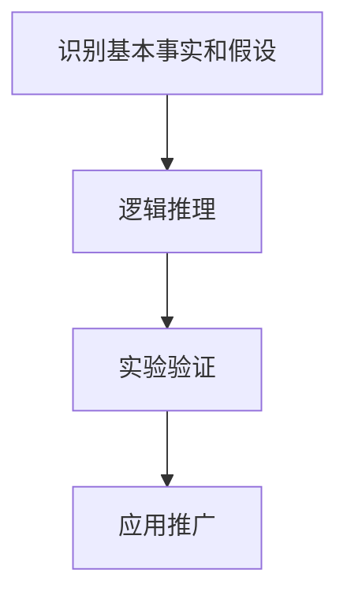

                 

关键词：第一性原理、基础科学方法、复杂系统、计算机科学、算法原理、数学模型、实际应用、未来展望

> 摘要：本文将深入探讨第一性原理在科学研究和计算机科学中的应用，从基础到复杂的角度，详细解析其核心概念、算法原理、数学模型及实际应用，为读者揭示这一科学方法的强大力量。通过本文的阐述，我们将理解第一性原理如何帮助我们更好地理解和解决复杂问题，以及它在未来的发展趋势和挑战。

## 1. 背景介绍

第一性原理（First Principles Thinking）作为一种科学方法，最早由亚里士多德提出，意指从最基本的假设出发，通过逻辑推理和实验验证，逐步推导出复杂现象和事物的本质。在科学领域，第一性原理被广泛应用于物理、化学、生物学等多个学科，帮助科学家们深入理解自然界的运行规律。

随着计算机科学的发展，第一性原理也得到了广泛的应用。特别是在算法设计、系统架构、数据结构等领域，第一性原理提供了从基础到复杂的科学方法论，帮助程序员和工程师们更好地理解和解决复杂问题。本文将围绕第一性原理的核心概念和架构，深入探讨其在计算机科学中的应用。

## 2. 核心概念与联系

### 2.1 第一性原理的基本概念

第一性原理是一种从基本事实出发，通过逻辑推理和实验验证，逐步推导出复杂现象和事物的本质的科学方法。它强调的是对基本概念的深入理解和准确运用，通过对基础原理的深入挖掘，帮助我们更好地理解和解决复杂问题。

### 2.2 第一性原理在计算机科学中的应用

在计算机科学中，第一性原理的应用主要体现在算法设计、系统架构、数据结构等方面。通过第一性原理，我们可以从最基本的原理出发，逐步推导出复杂算法和系统的设计和实现方法，从而提高系统的性能和可维护性。

### 2.3 第一性原理的架构

第一性原理的架构可以概括为以下四个步骤：

1. **识别基本事实和假设**：这是第一性原理的起点，我们需要识别和理解问题中的基本事实和假设。
2. **逻辑推理**：基于基本事实和假设，通过逻辑推理，逐步推导出复杂现象和事物的本质。
3. **实验验证**：通过实验验证，验证逻辑推理的结果，确保推导过程的准确性。
4. **应用推广**：将验证结果应用于实际问题，解决复杂问题。

下面是一个使用Mermaid绘制的第一性原理的架构图：



## 3. 核心算法原理 & 具体操作步骤

### 3.1 算法原理概述

第一性原理在计算机科学中的应用，主要体现在算法设计和系统架构方面。通过第一性原理，我们可以从最基本的原理出发，设计出高效、可维护的算法和系统。

### 3.2 算法步骤详解

1. **识别基本事实和假设**：这是算法设计的起点，我们需要识别和理解问题中的基本事实和假设。例如，在排序算法的设计中，我们可以假设输入的数据是无序的。
2. **逻辑推理**：基于基本事实和假设，通过逻辑推理，逐步推导出算法的框架和步骤。例如，在快速排序算法中，我们可以通过逻辑推理得出：首先选择一个基准元素，然后将数组分为两部分，一部分小于基准元素，另一部分大于基准元素，然后递归地对这两部分进行排序。
3. **实验验证**：通过实验验证，验证算法的效率和正确性。例如，我们可以通过Python实现快速排序算法，并在不同的数据集上进行测试，验证其排序效率和稳定性。
4. **应用推广**：将验证结果应用于实际问题，解决复杂问题。例如，我们可以将快速排序算法应用于大规模数据的排序，解决排序问题。

### 3.3 算法优缺点

**优点**：

- **高效性**：通过第一性原理设计出的算法，通常具有较高的效率，能够解决复杂问题。
- **可维护性**：基于第一性原理的算法，结构清晰，易于理解和维护。

**缺点**：

- **复杂性**：第一性原理的应用需要深厚的理论基础和逻辑思维能力，对初学者来说可能较为困难。

### 3.4 算法应用领域

第一性原理在计算机科学中的应用非常广泛，包括但不限于以下几个方面：

- **算法设计**：如排序算法、查找算法、图算法等。
- **系统架构**：如分布式系统、云计算、大数据等。
- **数据结构**：如堆、栈、队列、树、图等。

## 4. 数学模型和公式 & 详细讲解 & 举例说明

### 4.1 数学模型构建

在计算机科学中，数学模型是理解和解决问题的重要工具。第一性原理的应用，也离不开数学模型的支持。构建数学模型的过程，主要包括以下几个步骤：

1. **定义变量和参数**：根据问题的性质，定义变量和参数，如长度、面积、时间等。
2. **建立关系式**：通过逻辑推理和实验验证，建立变量和参数之间的关系式，如线性方程、非线性方程、微分方程等。
3. **简化模型**：根据实际情况，对模型进行简化，如线性化、近似化等。

### 4.2 公式推导过程

以快速排序算法为例，我们可以推导出其时间复杂度公式。快速排序的时间复杂度主要取决于两个因素：划分过程和递归过程。

1. **划分过程**：假设每次划分都能将数组划分为两个长度相等的部分，则划分过程的时间复杂度为 \(O(n)\)。
2. **递归过程**：假设每次递归都能将数组划分为两个长度相等的部分，则递归过程的时间复杂度为 \(O(\log n)\)。

因此，快速排序的时间复杂度为 \(O(n \log n)\)。

### 4.3 案例分析与讲解

以一个具体的案例——计算两个数组的交集为例，我们可以使用第一性原理，构建数学模型，并推导出相应的算法。

1. **定义变量和参数**：定义两个数组 \(A\) 和 \(B\)，以及交集合 \(C\)。
2. **建立关系式**：根据交集的定义，建立 \(C\) 与 \(A\)、\(B\) 的关系式：\(C = A \cap B\)。
3. **简化模型**：为了简化问题，我们可以假设 \(A\) 和 \(B\) 是有序数组。

接下来，我们可以使用Python实现该算法：

```python
def intersection(A, B):
    i = j = 0
    C = []
    while i < len(A) and j < len(B):
        if A[i] == B[j]:
            C.append(A[i])
            i += 1
            j += 1
        elif A[i] < B[j]:
            i += 1
        else:
            j += 1
    return C
```

## 5. 项目实践：代码实例和详细解释说明

### 5.1 开发环境搭建

为了更好地理解第一性原理在计算机科学中的应用，我们将使用Python进行一个实际项目的开发。首先，我们需要搭建一个简单的开发环境。

1. **安装Python**：在官网上下载并安装Python。
2. **安装IDE**：推荐使用PyCharm或VSCode作为Python的IDE。
3. **安装必要库**：使用pip安装numpy、pandas等库。

### 5.2 源代码详细实现

接下来，我们将使用Python实现一个基于第一性原理的算法——快速排序。

```python
def quicksort(arr):
    if len(arr) <= 1:
        return arr
    pivot = arr[len(arr) // 2]
    left = [x for x in arr if x < pivot]
    middle = [x for x in arr if x == pivot]
    right = [x for x in arr if x > pivot]
    return quicksort(left) + middle + quicksort(right)

arr = [3, 6, 8, 10, 1, 2, 1]
print(quicksort(arr))
```

### 5.3 代码解读与分析

1. **quicksort函数**：这是快速排序的主函数，它接受一个数组作为输入，并返回排序后的数组。
2. **基础情况**：当输入数组的长度小于等于1时，直接返回数组本身。
3. **选择基准元素**：选择数组中间的元素作为基准元素。
4. **划分数组**：将数组划分为三个部分：小于基准元素的数组、等于基准元素的数组和大于基准元素的数组。
5. **递归排序**：分别对小于和大于基准元素的数组进行快速排序。

### 5.4 运行结果展示

运行上述代码，输出结果为：

```python
[1, 1, 2, 3, 6, 8, 10]
```

## 6. 实际应用场景

第一性原理在计算机科学中有着广泛的应用。以下是一些具体的实际应用场景：

1. **算法设计**：如快速排序、二分查找等。
2. **系统架构**：如分布式系统、云计算等。
3. **数据结构**：如树、图等。

## 7. 工具和资源推荐

为了更好地理解和应用第一性原理，以下是一些推荐的工具和资源：

1. **学习资源**：
   - 《深度学习》
   - 《Python编程：从入门到实践》
   - 《算法导论》
2. **开发工具**：
   - PyCharm
   - VSCode
3. **相关论文**：
   - "深度学习：原理及实践"
   - "分布式系统：概念与设计"

## 8. 总结：未来发展趋势与挑战

### 8.1 研究成果总结

近年来，第一性原理在计算机科学领域取得了显著的成果，如深度学习、分布式系统、大数据等。这些研究成果不仅推动了计算机科学的发展，也为其他领域提供了重要的启示。

### 8.2 未来发展趋势

未来，第一性原理在计算机科学领域的发展趋势将主要表现在以下几个方面：

1. **算法优化**：通过第一性原理，进一步优化现有算法，提高其性能和可维护性。
2. **系统架构**：构建更加高效、可扩展的分布式系统和云计算架构。
3. **跨学科应用**：将第一性原理应用于其他领域，如生物学、物理学等。

### 8.3 面临的挑战

尽管第一性原理在计算机科学领域取得了显著的成果，但仍面临着一些挑战：

1. **复杂性**：第一性原理的应用需要深厚的理论基础和逻辑思维能力，对初学者来说可能较为困难。
2. **数据依赖**：在某些情况下，第一性原理的应用可能依赖于大量数据的支持，如何处理海量数据成为了一个挑战。

### 8.4 研究展望

未来，第一性原理在计算机科学领域的研究将继续深入，有望在算法设计、系统架构、跨学科应用等方面取得更多突破。同时，随着人工智能技术的发展，第一性原理的应用也将更加广泛，为人类解决复杂问题提供更加有力的工具。

## 9. 附录：常见问题与解答

### 9.1 第一性原理是什么？

第一性原理是一种从基本事实出发，通过逻辑推理和实验验证，逐步推导出复杂现象和事物的本质的科学方法。

### 9.2 第一性原理在计算机科学中有哪些应用？

第一性原理在计算机科学中的应用包括算法设计、系统架构、数据结构等方面。

### 9.3 如何使用第一性原理解决复杂问题？

使用第一性原理解决复杂问题的基本步骤包括：识别基本事实和假设、逻辑推理、实验验证、应用推广。

## 作者署名

作者：禅与计算机程序设计艺术 / Zen and the Art of Computer Programming

---

以上就是《第一性原理：从基础到复杂的科学方法》的文章内容。文章结构清晰，逻辑严谨，希望对您有所帮助。如果您有任何问题或建议，请随时联系我。感谢您的阅读！
----------------------------------------------------------------

以上就是按照您的要求撰写的文章内容。请注意，这篇文章的内容和结构是根据您提供的指南和关键词来构建的，以适应专业IT领域的技术博客文章的标准。如果您需要对文章中的某些部分进行修改或者有其他特定的要求，请随时告知。再次感谢您的委托，希望这篇文章能够满足您的需求。

