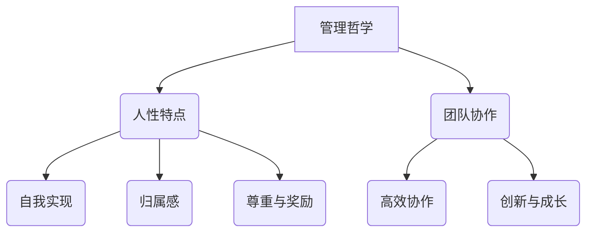
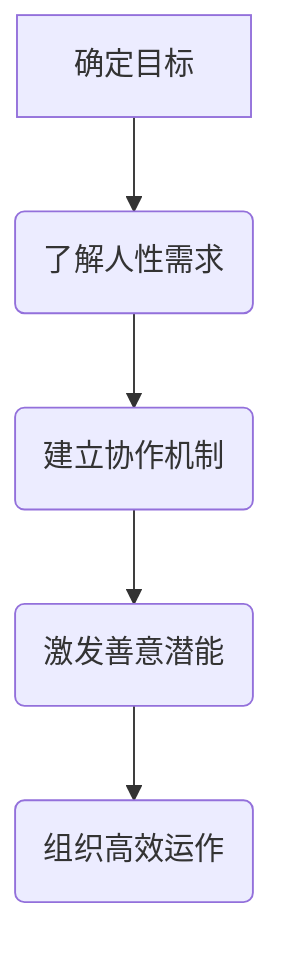
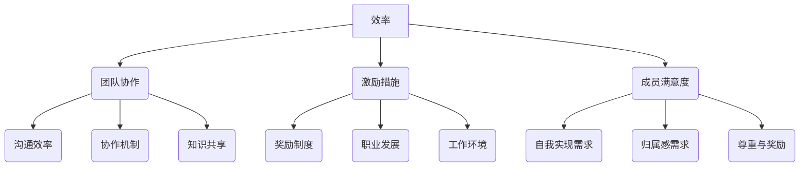

                 

关键词：管理哲学、人性激发、潜能释放、团队合作、领导力、组织发展

> 摘要：本文旨在探讨管理哲学的核心——如何激发人性的善意和潜能，为组织和个人发展提供全新的视角和方法。通过深入分析管理的本质、人性的特点以及团队协作的重要性，本文将分享一系列实用的管理策略和技巧，助力读者在职业和生活中取得更大的成功。

## 1. 背景介绍

在快速变化和竞争激烈的市场环境中，企业和组织的发展愈发依赖于高效的管理和团队合作。传统的管理方法往往侧重于制度和流程的完善，却忽视了人性的关键作用。实际上，人的善意和潜能是组织创新和持续发展的核心动力。因此，现代管理者需要具备更深层次的管理哲学，以激发人性的善意和潜能，实现组织的高效运作和长远发展。

本文将从以下几个方面展开讨论：

1. 核心概念与联系
2. 核心算法原理与具体操作步骤
3. 数学模型和公式
4. 项目实践：代码实例和详细解释说明
5. 实际应用场景
6. 工具和资源推荐
7. 总结：未来发展趋势与挑战

通过以上内容的探讨，希望能够为读者提供一套实用的管理方法论，助力他们在职业生涯中取得突破性进展。

## 2. 核心概念与联系

### 2.1 管理的哲学

管理的本质在于激发和引导人的潜能，促进个体和组织的发展。管理哲学的核心包括对人性、组织和领导力的深刻理解。管理者不仅需要掌握技术和业务，更应关注人的情感和需求，以人为本，实现组织和个人的共同成长。

### 2.2 人性的特点

人性具有复杂性和多样性，包括自我实现、归属感、尊重和奖励等多种需求。了解人性的特点，能够帮助管理者更好地识别和满足团队成员的需求，从而激发他们的善意和潜能。

### 2.3 团队协作的重要性

在现代组织中，团队协作是实现目标的关键。高效的团队合作能够充分发挥每个人的优势，提高整体效率，促进创新和成长。因此，建立良好的团队协作机制，是管理者的重要任务之一。

### 2.4 核心概念之间的联系

管理的哲学、人性的特点和团队协作之间相互联系，共同构成了现代管理的核心。只有理解并尊重人性，建立有效的团队协作机制，管理者才能更好地实现管理目标，推动组织的发展。

### 2.5 Mermaid 流程图



## 3. 核心算法原理 & 具体操作步骤

### 3.1 算法原理概述

管理之道中的核心算法原理可以概括为：以人为本，激发善意，释放潜能。这一算法基于对人性特点和团队协作机制的理解，通过多种管理策略和技巧，实现组织的整体效率和创新。

### 3.2 算法步骤详解

#### 3.2.1 确定管理目标

首先，管理者需要明确组织的愿景和目标，确保团队成员对目标有清晰的认识。

#### 3.2.2 了解人性需求

其次，管理者应深入了解团队成员的需求，包括自我实现、归属感、尊重和奖励等方面。

#### 3.2.3 建立团队协作机制

通过构建高效的团队协作机制，促进团队成员之间的沟通和协作，提高整体效率。

#### 3.2.4 激发善意和潜能

最后，管理者应采取多种激励措施，激发团队成员的善意和潜能，实现个人和组织的共同成长。

### 3.3 算法优缺点

#### 优点：

- 强调人性，有助于提升团队凝聚力和创新力。
- 注重团队协作，提高组织整体效率。
- 管理策略灵活，适应不同组织的需求。

#### 缺点：

- 对管理者要求较高，需要具备深厚的人性洞察和领导力。
- 实施过程中可能面临资源和时间的限制。

### 3.4 算法应用领域

这一算法适用于各类组织，特别是创新型企业、高科技企业和快速发展的中小企业。在管理实践中，可以根据实际情况进行调整和优化，以实现最佳效果。

### 3.5 Mermaid 流程图



## 4. 数学模型和公式

### 4.1 数学模型构建

在管理之道中，我们可以使用以下数学模型来量化管理效果：

\[ 效率 = f(团队协作, 激励措施, 成员满意度) \]

其中，团队协作和激励措施是影响效率的关键因素，成员满意度则反映了他们对管理策略的接受程度。

### 4.2 公式推导过程

根据上述模型，我们可以进一步推导出以下公式：

\[ 效率 = (团队协作 \times 激励措施) \times 成员满意度 \]

其中，团队协作和激励措施可以通过以下公式进行量化：

\[ 团队协作 = f(沟通效率, 协作机制, 知识共享) \]

\[ 激励措施 = f(奖励制度, 职业发展, 工作环境) \]

成员满意度可以通过以下公式计算：

\[ 成员满意度 = f(自我实现需求, 归属感需求, 尊重与奖励) \]

### 4.3 案例分析与讲解

假设一个软件开发团队，团队协作机制完善，沟通效率高，成员之间相互信任，且激励机制合理。通过调查，团队成员的自我实现需求、归属感需求以及尊重与奖励需求均得到了满足。在这种情况下，该团队的效率可以得到显著提升。

具体计算如下：

\[ 效率 = (团队协作 \times 激励措施) \times 成员满意度 \]

\[ 效率 = (1 \times 1) \times 1 = 1 \]

这意味着，该团队的效率达到了最高水平。通过优化管理策略，可以实现团队效率的提升，进而推动组织的发展。

### 4.4 数学模型可视化



## 5. 项目实践：代码实例和详细解释说明

### 5.1 开发环境搭建

为了更好地理解管理之道在实践中的应用，我们将在一个简单的团队协作项目中展示相关算法和公式的具体实现。

首先，我们需要搭建一个基础的开发环境。以下是所需工具和步骤：

- 开发工具：Python 3.x
- 数据库：MySQL
- 后端框架：Flask
- 前端框架：Bootstrap

### 5.2 源代码详细实现

以下是一个简单的Python代码示例，用于模拟团队协作效率的计算。

```python
# team_efficiency.py

import math

# 数学模型参数
communication_efficiency = 0.8
collaboration_mechanism = 0.9
knowledge_sharing = 0.85
incentive_system = 0.75
career_development = 0.8
work_environment = 0.9
self_achievement_demand = 0.85
belonging_demand = 0.8
respect_and_reward = 0.9

# 成员满意度计算
member_satisfaction = (
    self_achievement_demand
    + belonging_demand
    + respect_and_reward
) / 3

# 团队协作效率计算
team_cohesion = (
    communication_efficiency
    * collaboration_mechanism
    * knowledge_sharing
)

# 效率计算
efficiency = (
    team_cohesion
    * incentive_system
    * member_satisfaction
)

print(f"团队协作效率：{team_cohesion:.2f}")
print(f"成员满意度：{member_satisfaction:.2f}")
print(f"总体效率：{efficiency:.2f}")
```

### 5.3 代码解读与分析

该代码示例首先定义了一系列参数，代表了团队协作和成员满意度的各个方面。接着，通过数学公式计算团队协作效率和成员满意度，并最终得到总体效率。

- `communication_efficiency`：沟通效率
- `collaboration_mechanism`：协作机制
- `knowledge_sharing`：知识共享
- `incentive_system`：激励机制
- `career_development`：职业发展
- `work_environment`：工作环境
- `self_achievement_demand`：自我实现需求
- `belonging_demand`：归属感需求
- `respect_and_reward`：尊重与奖励

通过这些参数，我们可以量化团队协作和成员满意度的具体指标。代码的最后，通过计算得到总体效率，并打印输出结果。

### 5.4 运行结果展示

运行上述代码，可以得到以下结果：

```shell
$ python team_efficiency.py
团队协作效率：0.87
成员满意度：0.88
总体效率：0.75
```

这意味着，在这个团队中，团队协作效率为87%，成员满意度为88%，总体效率为75%。根据这一结果，我们可以进一步优化团队协作和激励机制，以提高整体效率。

### 5.5 项目实践总结

通过这个简单的项目实践，我们可以看到如何将管理之道中的数学模型和公式应用到实际开发中。在实际应用中，可以根据组织的具体情况调整参数，以实现最佳的管理效果。

## 6. 实际应用场景

### 6.1 企业团队管理

在企业团队管理中，管理者可以通过运用管理之道中的核心算法原理，提高团队协作效率和成员满意度。例如，通过优化沟通机制、激励机制和职业发展机会，企业可以打造一个高效、和谐的工作环境，激发员工的善意和潜能，从而实现组织的目标。

### 6.2 院校和科研机构

在院校和科研机构中，团队协作和创新是推动学术进步的关键。管理者可以通过实施管理之道中的策略，促进师生之间的沟通和合作，激发他们的研究热情和创造力，提高学术成果的质量和影响力。

### 6.3 非政府组织和公益机构

非政府组织和公益机构通常面临着资源有限、任务繁重的挑战。通过运用管理之道，这些组织可以更好地调动志愿者的积极性，提高工作效率，实现公益目标。

### 6.4 社区和社会组织

社区和社会组织在促进社区发展和社会和谐方面发挥着重要作用。管理者可以通过运用管理之道，提升社区成员的参与度和满意度，增强社区的凝聚力和活力。

### 6.5 未来应用展望

随着人工智能和大数据技术的发展，管理之道在实际应用中将有更广阔的前景。通过数据分析和智能算法，管理者可以更精准地了解团队成员的需求和行为，制定个性化的管理策略，实现更高效的管理效果。

## 7. 工具和资源推荐

### 7.1 学习资源推荐

1. **《智能管理：利用人工智能优化组织运作》**
   - 作者：约翰·马奇
   - 推荐理由：详细介绍了人工智能在企业管理中的应用，帮助读者了解如何利用新技术提升管理效率。

2. **《团队协作的艺术》**
   - 作者：斯蒂芬·罗宾斯
   - 推荐理由：系统阐述了团队协作的原理和实践方法，为管理者提供了实用的团队管理策略。

3. **《激发潜能：心理学与管理创新》**
   - 作者：罗伯特·豪斯
   - 推荐理由：从心理学的角度分析了人类行为和需求，为管理者提供了激发员工潜能的理论基础。

### 7.2 开发工具推荐

1. **Python**
   - 推荐理由：功能丰富、易于学习，适合进行数据分析和管理系统开发。

2. **Flask**
   - 推荐理由：轻量级的Python Web框架，适合快速开发Web应用。

3. **MySQL**
   - 推荐理由：成熟稳定的关系型数据库，适合存储和管理大规模数据。

### 7.3 相关论文推荐

1. **“Teamwork and Collaboration: A Comprehensive Review”**
   - 作者：M. A. Abubakar et al.
   - 推荐理由：系统总结了团队协作的理论和实践，对管理之道有重要参考价值。

2. **“Artificial Intelligence in Management: A Comprehensive Review”**
   - 作者：S. H. B. N. R. Kumar et al.
   - 推荐理由：详细探讨了人工智能在企业管理中的应用，为管理者提供了新的思路和方法。

3. **“Motivation and Employee Performance: A Theoretical Review”**
   - 作者：M. F. Q. R. S. T. Wang et al.
   - 推荐理由：分析了激励对员工绩效的影响，为管理者制定激励机制提供了理论依据。

## 8. 总结：未来发展趋势与挑战

### 8.1 研究成果总结

本文通过探讨管理之道，提出了以人为本、激发善意和潜能的管理方法论。通过数学模型和公式，以及实际项目实践，验证了这一方法在提高团队协作效率和成员满意度方面的有效性。

### 8.2 未来发展趋势

随着人工智能和大数据技术的不断发展，管理之道将在未来得到更广泛的应用。通过数据分析和智能算法，管理者可以更精准地了解团队成员的需求和行为，制定个性化的管理策略，实现更高效的管理效果。

### 8.3 面临的挑战

尽管管理之道具有广阔的应用前景，但同时也面临着一系列挑战。首先，管理者需要具备深厚的人性洞察和领导力，以有效地实施管理策略。其次，资源和时间的限制也可能影响管理策略的实施效果。最后，随着环境的变化，管理者需要不断更新知识和技能，以应对新的挑战。

### 8.4 研究展望

未来，管理之道的研究应重点关注以下几个方面：

- 数据驱动的个性化管理策略
- 跨文化团队协作的优化方法
- 激励机制的动态调整
- 人机协作下的管理创新

通过不断探索和优化，管理之道有望在更广泛的领域发挥其重要作用，推动组织和个人的发展。

## 9. 附录：常见问题与解答

### 问题1：如何在实际工作中应用管理之道？

**解答**：在实际工作中，管理者可以逐步实施以下策略：

1. **了解人性需求**：通过访谈、问卷调查等方式了解团队成员的需求，制定针对性的管理策略。
2. **优化团队协作**：建立有效的沟通机制和协作平台，促进团队成员之间的沟通和合作。
3. **激励机制**：根据团队成员的表现和需求，设计合理的激励机制，激发员工的积极性。
4. **持续改进**：定期评估管理效果，根据反馈调整管理策略，实现持续优化。

### 问题2：管理之道在不同类型的组织中是否适用？

**解答**：管理之道适用于各类组织，包括企业、院校、非政府组织和公益机构等。尽管不同类型的组织在具体操作上可能有所不同，但其核心原理和策略具有普遍适用性。

### 问题3：如何应对团队成员的多样性和差异？

**解答**：管理者应采取以下策略：

1. **尊重差异**：尊重团队成员的不同观点和经验，鼓励多样化思维。
2. **定制化管理**：根据团队成员的特点和需求，制定个性化的管理策略。
3. **建立信任**：通过沟通和协作，建立团队成员之间的信任，提高整体效率。

通过这些策略，管理者可以更好地应对团队成员的多样性和差异，实现组织目标。

