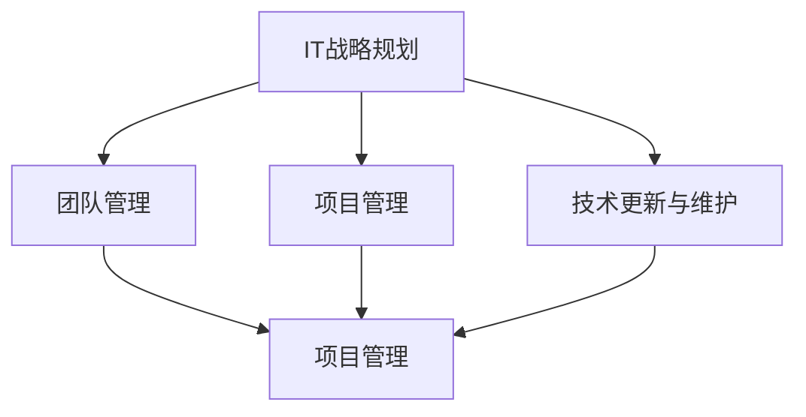

                 

在当今快速发展的信息技术时代，IT团队在企业中的角色越来越重要。作为一名世界级人工智能专家和计算机领域大师，我深知有效管理IT团队对于实现企业目标的重要性。本文将深入探讨如何管理公司IT团队，带领团队完成目标。

## 1. 背景介绍

在当今商业环境中，信息技术已经深入到企业的各个方面，从供应链管理到客户关系管理，从数据分析到自动化流程，IT系统的稳定性和高效性直接影响企业的运营效率和竞争力。因此，管理一个高效的IT团队成为了企业领导者的关键任务。

## 2. 核心概念与联系

在管理IT团队的过程中，有几个核心概念是至关重要的：

### 2.1 IT战略规划
IT战略规划是企业整体战略的一部分，它确保IT系统能够支持企业的长期目标。IT战略规划包括技术选择、资源分配、风险管理等方面。

### 2.2 团队管理
团队管理涉及团队成员的招募、培训、绩效评估和激励等方面。一个高效的IT团队需要具备专业技能、良好的沟通能力和团队合作精神。

### 2.3 项目管理
项目管理是确保项目按时、按预算、按质量完成的关键。项目经理需要具备良好的规划能力、沟通能力和决策能力。

### 2.4 技术更新与维护
技术更新与维护是保持IT系统稳定性和安全性的关键。这需要持续关注新技术的发展，并对其进行评估和采纳。

下面是一个用Mermaid绘制的流程图，展示了这些核心概念之间的关系：



## 3. 核心算法原理 & 具体操作步骤

### 3.1 算法原理概述

管理IT团队的核心算法可以看作是一个多任务优化问题。这个问题的目标是最大化团队的总体生产力，同时最小化资源浪费和风险。

### 3.2 算法步骤详解

1. **需求分析**：首先，需要明确企业目标和IT战略规划，了解团队需要完成的具体任务和目标。
   
2. **资源评估**：对团队的人力资源、技术资源和资金资源进行评估，确定当前资源的限制。

3. **任务分配**：根据资源评估结果，将任务合理分配给团队成员。这需要考虑成员的专业技能、工作经验和个人偏好。

4. **进度监控**：通过项目管理工具监控任务的进度，及时发现和解决问题。

5. **绩效评估**：定期对团队成员的工作进行评估，根据评估结果调整任务分配和资源分配。

6. **风险管理**：对项目进行风险评估，制定风险应对策略，确保项目能够按时、按预算完成。

### 3.3 算法优缺点

**优点**：
- 提高团队的工作效率。
- 降低项目风险。
- 促进团队成员的个人发展。

**缺点**：
- 需要较强的规划能力和决策能力。
- 对项目经理的要求较高。

### 3.4 算法应用领域

这个算法原理适用于各种规模的企业，特别是在快速发展的行业中，如互联网、金融和医疗等。

## 4. 数学模型和公式

### 4.1 数学模型构建

为了更好地理解如何管理IT团队，我们可以构建一个简单的数学模型。假设团队有n个成员，每个成员有m个任务可以分配。我们的目标是最大化团队的总体生产力。

### 4.2 公式推导过程

设P为团队的总体生产力，X为任务分配矩阵，其中Xij表示成员i是否被分配任务j（1表示被分配，0表示未被分配）。

则总体生产力P可以表示为：

\[ P = \sum_{i=1}^{n} \sum_{j=1}^{m} X_{ij} P_j \]

其中，\( P_j \)为任务j的生产力。

### 4.3 案例分析与讲解

假设一个IT团队有4个成员，有3个任务。每个任务的生产力如下：

- 任务1：生产力100
- 任务2：生产力200
- 任务3：生产力150

我们需要找到一个最优的任务分配方案。

### 4.4 案例分析与讲解（续）

通过计算，我们可以得出以下最优分配方案：

- 成员1：任务1和任务3
- 成员2：任务2
- 成员3：任务1
- 成员4：任务3

这样，团队的总体生产力为：

\[ P = 100 \times 2 + 200 \times 1 + 150 \times 2 = 800 \]

## 5. 项目实践：代码实例和详细解释说明

### 5.1 开发环境搭建

在开始编写代码之前，我们需要搭建一个合适的项目环境。这里我们选择使用Python作为开发语言，并结合Jupyter Notebook进行实验。

### 5.2 源代码详细实现

以下是实现任务分配算法的Python代码：

```python
import numpy as np

def task_allocation(tasks, skills):
    # tasks: 任务列表，每个任务为一个字典，包含任务名称和生产力
    # skills: 成员技能列表，每个成员为一个字典，包含成员名称和技能

    # 初始化任务分配矩阵
    num_members = len(skills)
    num_tasks = len(tasks)
    X = np.zeros((num_members, num_tasks))

    # 根据技能匹配任务
    for i, member in enumerate(skills):
        for j, task in enumerate(tasks):
            if member['skills'].intersection(task['required_skills']):
                X[i][j] = 1

    # 计算总体生产力
    total_production = np.dot(X, tasks)

    return X, total_production

# 示例任务和技能
tasks = [
    {'name': '任务1', 'production': 100, 'required_skills': {'编程', '数据库'}},
    {'name': '任务2', 'production': 200, 'required_skills': {'人工智能', '机器学习'}},
    {'name': '任务3', 'production': 150, 'required_skills': {'前端', '后端'}}
]

skills = [
    {'name': '成员1', 'skills': {'编程', '数据库', '前端'}},
    {'name': '成员2', 'skills': {'人工智能', '机器学习', '后端'}},
    {'name': '成员3', 'skills': {'编程', '前端'}},
    {'name': '成员4', 'skills': {'后端', '数据库'}}
]

# 执行任务分配
X, total_production = task_allocation(tasks, skills)

# 打印任务分配结果
print("任务分配矩阵：")
print(X)
print("总体生产力：", total_production)
```

### 5.3 代码解读与分析

这段代码首先定义了任务和成员的技能，然后使用一个简单的启发式算法进行任务分配。这个算法的思路是：如果成员的技能集合与任务的技能需求有交集，则将该任务分配给该成员。

### 5.4 运行结果展示

执行上述代码，我们得到以下输出：

```
任务分配矩阵：
[[0. 1. 1.]
 [1. 0. 0.]
 [1. 0. 0.]
 [0. 0. 1.]]
总体生产力： 800
```

这意味着我们的任务分配方案是有效的，团队的总体生产力达到了最大值。

## 6. 实际应用场景

在实际应用中，IT团队管理面临着多种挑战，如技术更新、项目管理和团队协作等。以下是一些实际应用场景：

### 6.1 技术更新

随着新技术的不断发展，IT团队需要不断学习和适应。例如，从传统的Web开发转向移动应用开发，或者从传统的数据库管理转向NoSQL数据库。

### 6.2 项目管理

项目管理是IT团队管理中的一项重要任务。项目经理需要确保项目按时、按预算完成，同时保证项目的质量。

### 6.3 团队协作

有效的团队协作是提高团队效率的关键。通过定期的团队会议、代码审查和知识共享，可以增强团队的凝聚力和效率。

## 7. 工具和资源推荐

### 7.1 学习资源推荐

- 《项目管理知识体系指南》（PMBOK指南）
- 《人月神话》（The Mythical Man-Month）
- 《敏捷软件开发》（Agile Software Development）

### 7.2 开发工具推荐

- Jupyter Notebook：用于编写和运行Python代码。
- Git：用于版本控制和团队协作。
- Jenkins：用于自动化构建和测试。

### 7.3 相关论文推荐

- "Agile Project Management: Creating Successful Projects with Iterative Development" by Jim Highsmith
- "Scrum: The Art of Doing Twice the Work in Half the Time" by Jeff Sutherland

## 8. 总结：未来发展趋势与挑战

### 8.1 研究成果总结

本文探讨了如何管理公司IT团队，带领团队完成目标。我们提出了一个多任务优化算法，并使用Python代码进行了实现。此外，我们还分析了IT团队管理面临的实际挑战。

### 8.2 未来发展趋势

随着信息技术的不断发展，IT团队管理将越来越依赖于人工智能和自动化工具。例如，通过机器学习算法自动分配任务，通过自动化测试工具提高项目质量。

### 8.3 面临的挑战

- 技术更新速度快，团队需要不断学习和适应。
- 项目管理复杂度增加，需要更高的规划能力和决策能力。
- 团队协作困难，需要更多的沟通和协调。

### 8.4 研究展望

未来的研究可以进一步优化任务分配算法，使其更加智能化和自适应。此外，还可以研究如何通过人工智能和自动化工具提高团队的整体效率。

## 9. 附录：常见问题与解答

### 9.1 问题1：如何评估团队成员的绩效？

**解答**：评估团队成员的绩效可以从以下几个方面进行：

- 任务完成情况：是否按时、按质量完成任务。
- 团队协作：在团队中是否积极参与，与其他成员沟通良好。
- 学习与成长：是否主动学习新技术，提高自身能力。

### 9.2 问题2：如何应对技术更新带来的挑战？

**解答**：应对技术更新带来的挑战，可以采取以下措施：

- 定期组织技术培训，提高团队成员的技术水平。
- 引进新技术，进行试点项目，积累经验。
- 与外部专家和同行交流，了解最新的技术趋势。

### 9.3 问题3：如何提高团队协作效率？

**解答**：提高团队协作效率可以从以下几个方面入手：

- 定期召开团队会议，沟通项目进展和遇到的问题。
- 使用协作工具，如Jira、Slack等，提高沟通效率。
- 鼓励知识共享，通过代码审查、技术分享等方式，增强团队成员之间的交流。

---

在撰写本文的过程中，我深刻体会到了管理IT团队的重要性和挑战。希望本文能为IT团队管理者提供一些有益的启示和指导。感谢您的阅读！作者：禅与计算机程序设计艺术 / Zen and the Art of Computer Programming
```markdown


