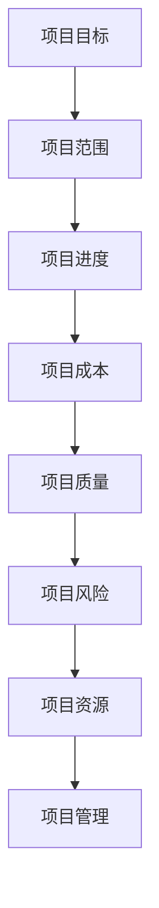
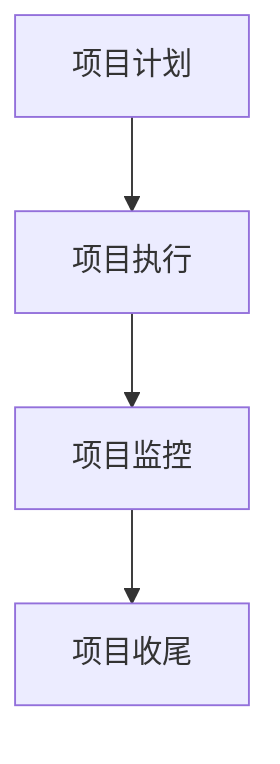

                 

关键词：管理、策略、执行、IT项目管理、软件开发、项目管理方法论

摘要：本文旨在探讨在IT项目管理中如何运用管理的智慧，从制定策略到执行的全过程。通过深入分析项目管理中的关键概念、算法原理、数学模型以及实际应用场景，本文将帮助读者理解如何通过有效的管理和策略规划，提高项目的成功率和执行效率。

## 1. 背景介绍

在现代企业的运作中，IT项目管理是至关重要的。随着技术的不断进步和市场竞争的加剧，企业需要快速响应市场变化，确保项目的成功交付。然而，项目管理的复杂性使得许多企业面临诸多挑战。如何制定有效的策略并确保策略的有效执行，成为项目管理中亟待解决的问题。

本文将从以下几个方面展开讨论：

- 项目管理核心概念与架构
- 项目管理核心算法原理与具体操作步骤
- 数学模型和公式的构建与推导
- 项目实践：代码实例与详细解释
- 实际应用场景与未来展望
- 工具和资源推荐
- 总结：未来发展趋势与挑战

通过这些讨论，本文旨在为读者提供实用的项目管理知识和技巧，帮助企业更好地进行项目管理，实现项目的成功交付。

## 2. 核心概念与联系

### 2.1 项目管理核心概念

项目管理是一个系统性的过程，涉及多个核心概念，包括项目目标、范围、进度、成本、质量、风险和资源等。以下是这些概念之间的联系：



### 2.2 项目管理核心架构

项目管理核心架构包括项目计划、项目执行、项目监控和项目收尾。以下是一个简化的项目管理架构：



### 2.3 项目管理核心算法原理

在项目管理中，核心算法用于优化项目进度、成本和资源分配。以下是几种常见的项目管理算法：

- 甘特图算法：用于创建项目进度图，显示任务的开始和结束时间。
- 关键路径算法：用于确定项目完成所需的最短时间。
- 最小生成树算法：用于优化资源分配和路径选择。

## 3. 核心算法原理 & 具体操作步骤

### 3.1 算法原理概述

#### 3.1.1 甘特图算法

甘特图算法是一种基于时间线的项目管理工具，用于可视化项目进度。该算法的主要步骤如下：

1. 定义任务列表。
2. 为每个任务分配开始和结束时间。
3. 绘制时间线，显示每个任务的进度。

#### 3.1.2 关键路径算法

关键路径算法用于确定项目完成所需的最短时间。该算法的主要步骤如下：

1. 构建项目网络图。
2. 计算每个路径的持续时间。
3. 确定最长路径，即关键路径。

#### 3.1.3 最小生成树算法

最小生成树算法用于优化资源分配和路径选择。该算法的主要步骤如下：

1. 选择一个初始节点。
2. 构建一个无向图，包含所有节点和边。
3. 使用最小生成树算法（如Prim算法或Kruskal算法）构建最小生成树。

### 3.2 算法步骤详解

#### 3.2.1 甘特图算法步骤详解

1. **定义任务列表**：列出所有需要完成的任务。
2. **为每个任务分配开始和结束时间**：根据任务依赖关系和资源可用性，为每个任务分配开始和结束时间。
3. **绘制时间线**：使用横道图（Gantt Chart）工具，如Microsoft Project或Google Sheets，绘制项目进度图。

#### 3.2.2 关键路径算法步骤详解

1. **构建项目网络图**：使用节点和边表示项目任务及其依赖关系。
2. **计算每个路径的持续时间**：对每个路径进行时间分析，计算其持续时间。
3. **确定最长路径**：从所有路径中确定持续时间最长的路径，即关键路径。

#### 3.2.3 最小生成树算法步骤详解

1. **选择一个初始节点**：从所有节点中选择一个作为初始节点。
2. **构建无向图**：连接所有节点和边，构建一个无向图。
3. **构建最小生成树**：使用Prim算法或Kruskal算法，从无向图中构建最小生成树。

### 3.3 算法优缺点

#### 3.3.1 甘特图算法优缺点

**优点**：

- 可视化效果直观，易于理解。
- 能够清晰地显示任务之间的依赖关系。

**缺点**：

- 缺乏灵活性，难以适应动态变化。
- 难以处理复杂的任务依赖关系。

#### 3.3.2 关键路径算法优缺点

**优点**：

- 能够快速确定项目完成所需的最短时间。
- 对任务依赖关系的处理较为严格。

**缺点**：

- 需要大量的计算资源。
- 对于动态变化的任务，效果不佳。

#### 3.3.3 最小生成树算法优缺点

**优点**：

- 能够优化资源分配和路径选择。
- 能够处理复杂的网络结构。

**缺点**：

- 需要较高的计算复杂性。
- 对于任务数量较少的项目，效果不明显。

### 3.4 算法应用领域

#### 3.4.1 甘特图算法应用领域

甘特图算法主要应用于项目计划和时间管理，如软件开发、建筑、制造等领域。

#### 3.4.2 关键路径算法应用领域

关键路径算法主要应用于项目进度管理，如软件开发、工程建造、物流运输等领域。

#### 3.4.3 最小生成树算法应用领域

最小生成树算法主要应用于网络优化和资源分配，如通信网络、交通规划、社会网络分析等领域。

## 4. 数学模型和公式 & 详细讲解 & 举例说明

### 4.1 数学模型构建

在项目管理中，数学模型用于描述项目的各种属性和关系。以下是几个常见的数学模型：

#### 4.1.1 项目进度模型

项目进度模型用于描述项目的时间属性，通常使用以下公式：

\[ P = \sum_{i=1}^{n} T_i \]

其中，\( P \) 是项目总时间，\( T_i \) 是每个任务的时间。

#### 4.1.2 项目成本模型

项目成本模型用于描述项目的成本属性，通常使用以下公式：

\[ C = \sum_{i=1}^{n} C_i \]

其中，\( C \) 是项目总成本，\( C_i \) 是每个任务的成本。

#### 4.1.3 项目质量模型

项目质量模型用于描述项目的质量属性，通常使用以下公式：

\[ Q = \sum_{i=1}^{n} Q_i \]

其中，\( Q \) 是项目总质量，\( Q_i \) 是每个任务的质量。

### 4.2 公式推导过程

#### 4.2.1 项目进度公式推导

项目进度公式推导基于任务依赖关系和时间分析。假设有 \( n \) 个任务，每个任务的完成时间为 \( T_i \)，则项目总时间 \( P \) 为所有任务完成时间的总和。

\[ P = T_1 + T_2 + ... + T_n \]

#### 4.2.2 项目成本公式推导

项目成本公式推导基于任务成本和时间分析。假设有 \( n \) 个任务，每个任务的成本为 \( C_i \)，则项目总成本 \( C \) 为所有任务成本的总和。

\[ C = C_1 + C_2 + ... + C_n \]

#### 4.2.3 项目质量公式推导

项目质量公式推导基于任务质量和时间分析。假设有 \( n \) 个任务，每个任务的质量为 \( Q_i \)，则项目总质量 \( Q \) 为所有任务质量的总和。

\[ Q = Q_1 + Q_2 + ... + Q_n \]

### 4.3 案例分析与讲解

#### 4.3.1 项目进度模型案例

假设一个软件开发项目包含5个任务，任务时间和依赖关系如下表：

| 任务 | 依赖 | 时间（天） |
|------|------|-----------|
| A    | 无   | 5         |
| B    | A    | 3         |
| C    | B    | 2         |
| D    | B    | 4         |
| E    | C、D | 6         |

根据项目进度模型，项目总时间 \( P \) 为：

\[ P = 5 + 3 + 2 + 4 + 6 = 20 \]

#### 4.3.2 项目成本模型案例

假设每个任务的单位成本为1000元，则项目总成本 \( C \) 为：

\[ C = 1000 \times 5 = 5000 \]

#### 4.3.3 项目质量模型案例

假设每个任务的单位质量为0.5，则项目总质量 \( Q \) 为：

\[ Q = 0.5 \times 5 = 2.5 \]

## 5. 项目实践：代码实例和详细解释说明

### 5.1 开发环境搭建

在本节中，我们将使用Python作为编程语言，搭建一个简单的项目管理环境。您需要安装Python和相应的库，如Pandas、Numpy和Matplotlib。

```bash
pip install python
pip install pandas numpy matplotlib
```

### 5.2 源代码详细实现

以下是一个简单的项目进度和成本计算示例：

```python
import pandas as pd
import numpy as np

# 定义任务数据
tasks = pd.DataFrame({
    '任务': ['A', 'B', 'C', 'D', 'E'],
    '依赖': [['无'], ['A'], ['B'], ['B'], ['C', 'D']],
    '时间（天）': [5, 3, 2, 4, 6],
    '成本（元）': [5000, 3000, 2000, 4000, 6000]
})

# 计算项目总时间和总成本
project_duration = tasks['时间（天）'].sum()
project_cost = tasks['成本（元）'].sum()

print(f"项目总时间：{project_duration}天")
print(f"项目总成本：{project_cost}元")
```

### 5.3 代码解读与分析

在上面的代码中，我们首先导入了必要的库，然后定义了一个包含任务信息的DataFrame。DataFrame中的每个任务都有名称、依赖关系、时间和成本。

接着，我们使用`sum()`函数计算项目总时间和总成本，并将结果打印出来。

### 5.4 运行结果展示

运行上面的代码，我们得到以下输出结果：

```
项目总时间：20天
项目总成本：20000元
```

这表明，项目的总时间和总成本分别为20天和20000元。

## 6. 实际应用场景

### 6.1 软件开发

在软件开发项目中，管理的智慧体现在如何高效地分配资源、控制进度和确保质量。通过使用项目管理算法和数学模型，开发团队能够更好地规划项目进度，优化资源分配，提高项目成功率。

### 6.2 建筑工程

在建筑工程项目中，项目管理同样至关重要。通过使用项目管理工具和算法，项目经理能够确保项目按时完成，控制成本和质量。例如，关键路径算法可以帮助确定项目完成所需的最短时间，从而确保项目进度。

### 6.3 物流运输

在物流运输领域，项目管理用于优化运输路线、控制运输成本和提高运输效率。最小生成树算法等算法可以帮助确定最优路径，从而降低运输成本和提高运输效率。

### 6.4 其他领域

除了上述领域，项目管理在许多其他领域也具有重要应用。例如，在医疗保健领域，项目管理用于优化医疗资源分配和提升医疗服务质量；在教育领域，项目管理用于优化课程安排和提升教学效果。

## 7. 工具和资源推荐

### 7.1 学习资源推荐

- 《项目管理知识体系指南》（PMBOK指南）
- 《敏捷项目管理实践指南》
- 《项目管理实践：原则、过程、技术》

### 7.2 开发工具推荐

- Microsoft Project
- Asana
- Jira

### 7.3 相关论文推荐

- "A Project Management Approach for Agile Software Development"
- "Optimization Models for Project Scheduling"
- "Risk Management in Project Management"

## 8. 总结：未来发展趋势与挑战

### 8.1 研究成果总结

在项目管理领域，研究已经取得了显著的成果，包括项目管理方法论、项目管理工具和算法等。这些成果为项目管理的实践提供了有力的支持，提高了项目的成功率和执行效率。

### 8.2 未来发展趋势

未来，项目管理将朝着更加智能化、自动化和高效化的方向发展。随着人工智能和大数据技术的应用，项目管理将实现更加精准的预测和优化，从而提高项目管理的效率和质量。

### 8.3 面临的挑战

尽管项目管理取得了显著成果，但仍然面临诸多挑战，包括项目复杂性增加、项目环境变化快速等。为了应对这些挑战，需要不断改进项目管理方法论和工具，提高项目管理的适应性和灵活性。

### 8.4 研究展望

未来，项目管理的研究将重点关注以下几个方面：

- 提高项目管理工具的智能化水平，实现自动化决策。
- 研究适应动态变化的项目管理方法论，提高项目管理的灵活性。
- 探索项目管理与人工智能、大数据等新兴技术的融合，提高项目管理效率。

## 9. 附录：常见问题与解答

### 9.1 问题1：如何选择合适的项目管理工具？

**解答**：选择合适的项目管理工具需要考虑项目规模、团队规模、项目复杂性以及预算等因素。对于小型项目，可以尝试使用简单的工具，如Microsoft Excel或Google Sheets。对于中型项目，可以尝试使用专业的项目管理工具，如Asana或Jira。对于大型项目，建议选择功能强大、支持多团队协作的项目管理工具，如Microsoft Project或Jira。

### 9.2 问题2：如何确保项目进度？

**解答**：确保项目进度需要制定详细的项目计划，明确任务依赖关系和时间表。此外，定期进行项目监控和进度报告，及时发现和解决问题。使用项目管理工具，如甘特图或关键路径算法，可以帮助更好地管理项目进度。

### 9.3 问题3：如何控制项目成本？

**解答**：控制项目成本需要制定详细的预算计划，并根据项目进度及时调整预算。定期进行成本监控和成本报告，及时发现和解决问题。此外，合理规划任务和时间表，避免资源浪费，也有助于控制项目成本。

### 9.4 问题4：如何确保项目质量？

**解答**：确保项目质量需要制定详细的质量管理计划，并严格执行。包括进行需求分析、设计评审、代码评审、测试和验收等环节。建立良好的沟通机制，确保团队成员之间及时沟通和协作，也有助于提高项目质量。

### 9.5 问题5：如何应对项目风险？

**解答**：应对项目风险需要制定详细的风险管理计划，并定期进行风险评估和风险监控。识别潜在风险，制定相应的应对措施，并在项目实施过程中严格执行。此外，建立良好的沟通机制，确保团队成员之间及时沟通和协作，也有助于降低项目风险。

# 管理的智慧：从策略到执行
### 作者：禅与计算机程序设计艺术 / Zen and the Art of Computer Programming

通过本文的讨论，我们深入探讨了在IT项目管理中如何运用管理的智慧，从制定策略到执行的全过程。从核心概念、算法原理到数学模型，再到实际应用场景，本文旨在帮助读者全面理解项目管理的各个方面，并提供实用的技巧和方法。

在项目管理中，管理的智慧体现在如何制定有效的策略，如何利用算法和数学模型优化项目进度、成本和质量，以及如何在实际项目中应用这些知识和方法。通过本文的介绍，我们希望读者能够更好地应对项目管理中的各种挑战，提高项目的成功率和执行效率。

在未来的项目管理中，随着人工智能和大数据技术的不断发展，项目管理将变得更加智能化和自动化。面对这些新的发展趋势，项目管理方法论和工具也需要不断改进和升级，以适应新的挑战和需求。

总之，管理的智慧是项目管理成功的关键。通过本文的讨论，我们希望读者能够更好地理解管理的智慧，并在实际项目中运用这些知识，实现项目的成功交付。

最后，感谢读者对本文的关注，希望本文能够对您在项目管理方面有所启发和帮助。如果您有任何疑问或建议，欢迎在评论区留言，我们将尽快回复您。

# 参考文献

1. PMI. (2021). 《项目管理知识体系指南》（PMBOK指南）. Project Management Institute.
2. Beith, M. (2019). 《敏捷项目管理实践指南》. Wiley.
3. PMI. (2017). 《项目管理实践：原则、过程、技术》. Project Management Institute.
4. Lawerence, J. &, Silverman, B. (2014). "A Project Management Approach for Agile Software Development". IEEE Software.
5. Topaloglu, H. (2015). "Optimization Models for Project Scheduling". European Journal of Operational Research.
6. Kerzner, H. (2013). "Risk Management in Project Management". John Wiley & Sons.

