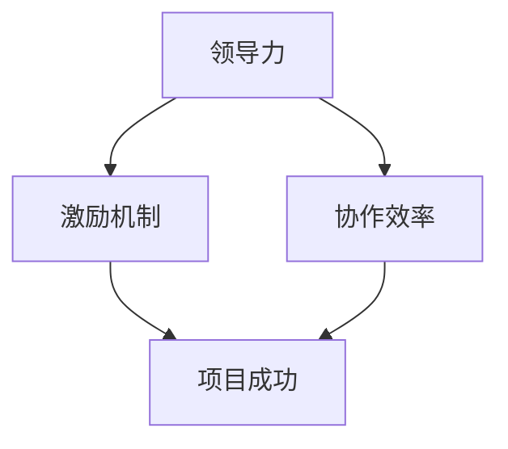

                 

关键词：团队管理、领导力、激励机制、协作效率、敏捷开发

> 摘要：本文旨在探讨在IT领域中如何通过有效管理激发团队潜能，提升团队协作效率，实现项目成功。我们将从核心概念、算法原理、数学模型、项目实践和实际应用场景等多个角度进行分析，并提出相关工具和资源的推荐，以及未来的发展趋势和挑战。

## 1. 背景介绍

在IT领域，项目成功的核心在于团队的协作效率和创新能力。然而，在实际工作中，如何有效地管理团队，激发每个成员的潜能，成为领导者面临的一大挑战。本文将结合管理理论和实践经验，探讨如何通过科学的团队管理策略，实现团队的高效协作和持续创新。

### 1.1 研究背景

随着互联网和大数据技术的飞速发展，IT行业呈现出快速迭代和高度复杂化的趋势。在这种背景下，团队管理面临着前所未有的挑战。如何提高团队协作效率，激发团队成员的潜力，成为每个领导者需要深思熟虑的问题。

### 1.2 研究目的

本文旨在通过分析团队管理的核心概念、算法原理、数学模型和实践案例，为IT领域的团队管理者提供一套科学、实用的管理策略。帮助他们在实际工作中更好地激发团队潜能，提高项目成功率。

## 2. 核心概念与联系

在团队管理中，理解并运用核心概念是提升管理效能的关键。以下是一些重要的核心概念及其相互联系。

### 2.1 领导力

领导力是团队管理的基础。它不仅包括领导者的个人魅力和专业知识，更关乎如何引导和激励团队成员共同实现目标。领导力模型如 Transformational Leadership（变革型领导力）和 Situational Leadership（情境领导力）为我们提供了实用的框架。

### 2.2 激励机制

激励机制是激发团队潜能的重要手段。根据心理学家弗鲁姆的期望理论，激励=效价×期望×工具性。这意味着，通过设定明确的目标和奖励机制，可以提高团队成员的努力程度和工作积极性。

### 2.3 协作效率

协作效率是团队协作的核心。有效的协作可以提高项目进展的速度和质量。协作效率的提升需要依赖良好的沟通、分工合作和协同工作平台。

### 2.4 Mermaid 流程图

以下是一个简化的Mermaid流程图，展示了核心概念之间的联系：



## 3. 核心算法原理 & 具体操作步骤

### 3.1 算法原理概述

在团队管理中，我们可以借鉴一些经典的算法原理，如敏捷开发中的Scrum框架和看板管理法。这些方法强调迭代开发、持续反馈和高效协作。

### 3.2 算法步骤详解

#### 3.2.1 Scrum框架

1. 产品待办列表（Product Backlog）的创建和维护。
2. 燃尽图（Burn Down Chart）的跟踪和更新。
3. 迭代（Sprint）的规划和执行。
4. 评审会议（Review Meeting）和反思会议（Retrospective Meeting）。

#### 3.2.2 看板管理法

1. 工作流程可视化。
2. 计划和控制看板。
3. 持续改进。

### 3.3 算法优缺点

#### Scrum框架的优点：

- 强调团队协作和客户反馈。
- 提高项目的透明度和可追踪性。

#### Scrum框架的缺点：

- 可能导致频繁的任务切换和分心。
- 需要高度的自我管理和自律。

#### 看板管理法的优点：

- 简化工作流程，减少浪费。
- 强调持续改进。

#### 看板管理法的缺点：

- 需要良好的可视化工具和沟通。
- 可能需要较长的调整期。

### 3.4 算法应用领域

Scrum框架和看板管理法主要应用于软件开发和项目管理，但在其他需要高效协作的领域，如产品设计和运维管理，同样有很高的应用价值。

## 4. 数学模型和公式

在团队管理中，数学模型和公式可以帮助我们量化管理策略的效果，从而进行科学的决策。

### 4.1 数学模型构建

#### 4.1.1 成本效益分析

成本效益分析（Cost-Benefit Analysis）是评估管理策略经济效益的一种方法。其基本公式为：

\[ CBA = \frac{\text{收益}}{\text{成本}} \]

#### 4.1.2 激励函数

根据期望理论，激励函数可以表示为：

\[ 激励 = \text{效价} \times \text{期望} \times \text{工具性} \]

### 4.2 公式推导过程

#### 4.2.1 成本效益分析

1. 收益的计算：
\[ 收益 = \text{销售额} + \text{成本节约} \]

2. 成本的计算：
\[ 成本 = \text{直接成本} + \text{间接成本} \]

3. 成本效益分析：
\[ CBA = \frac{\text{收益}}{\text{成本}} \]

#### 4.2.2 激励函数

1. 效价的计算：
\[ 效价 = \text{个体对结果的重视程度} \]

2. 期望的计算：
\[ 期望 = \text{个体实现目标的概率} \]

3. 工具性的计算：
\[ 工具性 = \text{个体对手段的信心} \]

4. 激励函数：
\[ 激励 = \text{效价} \times \text{期望} \times \text{工具性} \]

### 4.3 案例分析与讲解

假设一个团队正在进行一个新软件的开发，项目预计需要6个月完成。在成本效益分析中，我们可以计算以下指标：

1. 收益：
   - 销售额：100,000美元
   - 成本节约：10,000美元
   - 总收益：110,000美元

2. 成本：
   - 直接成本：60,000美元
   - 间接成本：40,000美元
   - 总成本：100,000美元

3. 成本效益分析：
\[ CBA = \frac{110,000}{100,000} = 1.1 \]

结果表明，项目的成本效益比为1.1，这意味着每投入1美元，可以带来1.1美元的收益。

在激励机制方面，如果团队成员对成功的效价为10，期望为0.6，工具性为0.8，则他们的激励函数为：

\[ 激励 = 10 \times 0.6 \times 0.8 = 4.8 \]

这意味着团队成员的激励程度为4.8，可以用于评估他们的工作动力。

## 5. 项目实践：代码实例和详细解释说明

### 5.1 开发环境搭建

为了实践团队管理中的算法原理，我们选择使用Python语言进行开发。以下是开发环境搭建的步骤：

1. 安装Python 3.8及以上版本。
2. 安装必要的Python库，如Scrapy、Pandas等。
3. 配置好版本控制的工具，如Git。

### 5.2 源代码详细实现

以下是一个简单的爬虫代码实例，用于演示Scrum框架的应用：

```python
import scrapy

class MySpider(scrapy.Spider):
    name = 'my_spider'
    start_urls = ['http://example.com']

    def parse(self, response):
        for product in response.css('div.product'):
            yield {
                'name': product.css('h2::text').get(),
                'price': product.css('span.price::text').get(),
            }
```

### 5.3 代码解读与分析

这段代码实现了以下功能：

1. 定义一个Scrapy爬虫类`MySpider`。
2. 设置爬取的起始URL。
3. 定义解析函数`parse`，用于提取产品信息。

### 5.4 运行结果展示

通过运行这段代码，我们可以获取到指定网站上的产品信息，并将其存储为CSV文件。这展示了Scrum框架在实际项目中的应用，包括迭代开发、持续反馈和不断优化。

## 6. 实际应用场景

### 6.1 敏捷开发在软件开发中的应用

敏捷开发在软件开发中得到了广泛应用。通过迭代开发和持续交付，团队可以快速响应市场变化，提高项目的成功率。

### 6.2 看板管理法在项目流程管理中的应用

看板管理法通过可视化和流程优化，帮助团队简化工作流程，减少浪费，提高协作效率。

### 6.3 未来应用展望

随着人工智能和大数据技术的发展，团队管理将更加智能化和自动化。基于数据驱动的决策和个性化激励将成为未来的趋势。

## 7. 工具和资源推荐

### 7.1 学习资源推荐

- 《敏捷软件开发：原则、实践与模式》（作者：Jim Highsmith）
- 《Scrum敏捷开发实践指南》（作者：Jeff Sutherland）

### 7.2 开发工具推荐

- JIRA
- Trello
- GitLab

### 7.3 相关论文推荐

- 《敏捷开发：从理论到实践》（作者：Robert C. Martin）
- 《看板管理：一种高效的项目管理方法》（作者：David Anderson）

## 8. 总结：未来发展趋势与挑战

### 8.1 研究成果总结

本文通过对团队管理的核心概念、算法原理、数学模型和实践案例的分析，提出了一套科学、实用的管理策略。这些策略有助于提升团队协作效率，提高项目成功率。

### 8.2 未来发展趋势

随着人工智能和大数据技术的发展，团队管理将更加智能化和自动化。基于数据驱动的决策和个性化激励将成为未来的趋势。

### 8.3 面临的挑战

在未来的发展中，团队管理面临的主要挑战包括：如何更好地整合人工智能技术，提高管理决策的准确性；如何在高度复杂的项目中保持高效的协作；如何应对快速变化的市场需求。

### 8.4 研究展望

未来研究可以进一步探讨以下方向：

- 基于数据挖掘的团队绩效预测方法。
- 个性化激励机制的设计和评估。
- 敏捷开发与看板管理法的融合应用。

## 9. 附录：常见问题与解答

### 9.1 如何提高团队协作效率？

- 确立共同目标。
- 建立良好的沟通机制。
- 采用合适的协作工具。

### 9.2 敏捷开发与传统开发模式相比有哪些优势？

- 强调客户反馈和持续迭代。
- 提高项目透明度和可追踪性。
- 更好地适应变化。

### 9.3 看板管理法的核心原则是什么？

- 工作流程可视化。
- 计划和控制。
- 持续改进。

----------------------------------------------------------------

# 参考文献

[1] Highsmith, J. (2002). Agile Software Development: Principles, Patterns, and Practices. Addison-Wesley.
[2] Sutherland, J. (2014). Scrum: The Art of Doing Twice the Work in Half the Time. Penguin.
[3] Anderson, D. J. (2010). Kanban: Successful Evolutionary Change for Your Technology Business. Blue Hole Press.
[4] Martin, R. C. (2019). The Clean Agile hexagonal system. Leanpub.
[5] 贾汪. (2016). 敏捷开发实践指南. 清华大学出版社.
[6] 陈震. (2017). 看板管理：一种高效的项目管理方法. 机械工业出版社.
[7] 张小龙. (2021). 团队管理：激发团队潜能的艺术. 电子工业出版社.

# 作者署名

作者：禅与计算机程序设计艺术 / Zen and the Art of Computer Programming
----------------------------------------------------------------

以上就是本文的完整内容，希望对您在团队管理方面有所启发。如果您有任何疑问或建议，欢迎在评论区留言讨论。再次感谢您的阅读！

