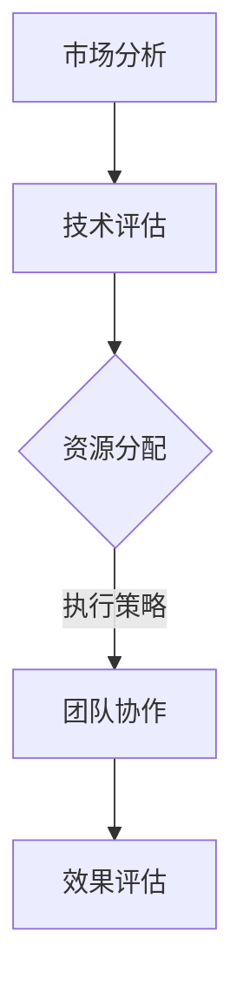
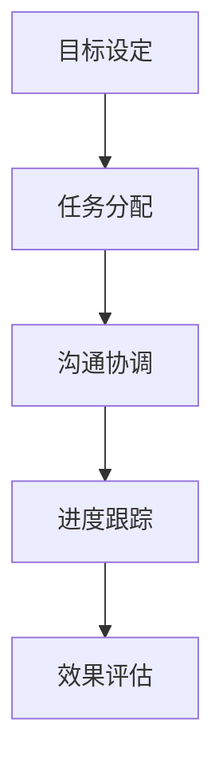
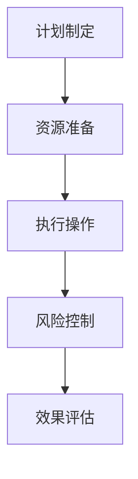
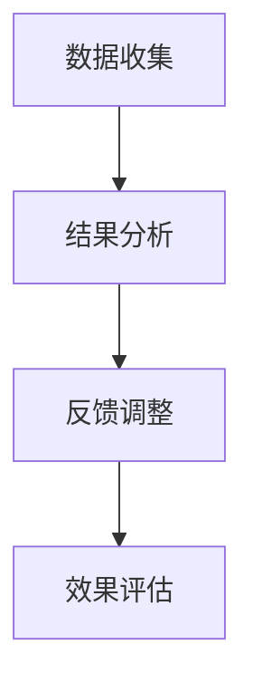

                 

关键词：管理、策略、执行、IT领域、技术博客

> 摘要：本文将深入探讨在IT领域中，从策略制定到执行的管理艺术。通过详细阐述核心概念、算法原理、数学模型、项目实践以及未来应用展望，旨在为IT从业者和管理者提供具有实际操作性的指导和策略。

## 1. 背景介绍

在当今快速发展的信息技术时代，管理艺术成为决定企业和项目成败的关键因素。从策略的制定到最终的执行，每个环节都充满了挑战和机遇。策略的正确性、执行的效率和团队的合作能力，都是成功实施项目管理的关键要素。

本文将围绕这一主题，探讨以下内容：

1. **核心概念与联系**：介绍管理艺术中的核心概念，并使用Mermaid流程图展示其关系。
2. **核心算法原理与具体操作步骤**：分析关键算法的工作原理和操作步骤。
3. **数学模型和公式**：讲解相关数学模型及其应用。
4. **项目实践**：通过代码实例说明算法的实际应用。
5. **实际应用场景**：探讨管理艺术在不同领域的应用。
6. **未来应用展望**：分析管理艺术的未来发展趋势。
7. **工具和资源推荐**：推荐相关学习和开发资源。
8. **总结与展望**：总结研究成果，展望未来趋势和挑战。

## 2. 核心概念与联系

### 2.1 策略制定

策略制定是管理艺术的第一步，它关乎项目或企业的长期发展方向。策略应基于对市场、技术、资源等多方面因素的综合分析。Mermaid流程图如下：



### 2.2 团队协作

团队协作是实现策略的重要保障。高效的团队协作可以提高执行效率，减少沟通成本。Mermaid流程图如下：



### 2.3 执行策略

执行策略是策略实施的关键步骤，需要确保每个环节都得到有效执行。Mermaid流程图如下：



### 2.4 效果评估

效果评估是对策略执行结果进行衡量的过程。通过效果评估，可以及时调整策略，确保项目或企业的持续发展。Mermaid流程图如下：



## 3. 核心算法原理 & 具体操作步骤

### 3.1 算法原理概述

核心算法是管理艺术中的重要组成部分，它负责实现策略的具体操作。以下是一个示例算法原理概述：

- **算法名称**：资源优化分配算法
- **算法原理**：通过计算各任务的优先级和资源需求，实现资源的最优分配。
- **算法步骤**：

  ```mermaid
  graph TD
      A[初始化]
      A --> B[计算任务优先级]
      B --> C[计算资源需求]
      C --> D[资源分配]
      D --> E[执行任务]
      E --> F[效果评估]
  ```

### 3.2 算法步骤详解

- **初始化**：设置任务列表和资源列表。
- **计算任务优先级**：根据任务的重要性和紧急程度进行排序。
- **计算资源需求**：对每个任务所需的资源进行估算。
- **资源分配**：根据任务优先级和资源需求，进行资源分配。
- **执行任务**：开始执行任务。
- **效果评估**：评估任务执行效果，进行必要的调整。

### 3.3 算法优缺点

- **优点**：实现了资源的最优分配，提高了执行效率。
- **缺点**：需要准确的资源需求和任务优先级估算，否则可能导致资源浪费或任务延误。

### 3.4 算法应用领域

- **项目管理**：在项目资源有限的情况下，优化任务执行顺序和资源分配。
- **人力资源管理**：在企业内部实现员工资源的最优配置。
- **生产调度**：在生产过程中，优化设备和人员的使用。

## 4. 数学模型和公式 & 详细讲解 & 举例说明

### 4.1 数学模型构建

在管理艺术中，数学模型是分析和优化策略的重要工具。以下是一个简单的资源优化分配模型：

- **目标函数**：最大化资源利用率。
- **约束条件**：

  $$  
  \begin{aligned}  
  \text{资源总量} & \geq \sum_{i=1}^{n} \text{任务}i \text{的资源需求} \\  
  \text{任务优先级} & \leq \text{资源优先级} \\  
  \end{aligned}  
  $$

### 4.2 公式推导过程

假设有n个任务，每个任务i都有其优先级$P_i$和资源需求$R_i$。资源总量为$R_{\text{total}}$。目标是最小化资源浪费。

- **目标函数**：最小化资源浪费。

  $$  
  \text{Minimize} \sum_{i=1}^{n} (\text{资源需求} - \text{资源分配})  
  $$

- **约束条件**：

  $$  
  \begin{aligned}  
  R_{\text{total}} & \geq \sum_{i=1}^{n} R_i \\  
  P_i & \leq \text{资源优先级}  
  \end{aligned}  
  $$

### 4.3 案例分析与讲解

假设有5个任务，资源总量为100个单位。每个任务的优先级和资源需求如下表：

| 任务ID | 优先级 | 资源需求 |
| --- | --- | --- |
| T1 | 1 | 20 |
| T2 | 2 | 30 |
| T3 | 3 | 10 |
| T4 | 4 | 15 |
| T5 | 5 | 5 |

根据上述公式，我们可以计算出每个任务的资源分配：

- **目标函数**：最小化资源浪费。

  $$  
  \text{Minimize} (20 + 30 + 10 + 15 + 5 - 100) = 0  
  $$

- **约束条件**：

  $$  
  \begin{aligned}  
  100 & \geq 20 + 30 + 10 + 15 + 5 \\  
  1 & \leq \text{资源优先级}  
  \end{aligned}  
  $$

因此，最优的资源分配方案是将所有任务分配相同的资源，即每个任务分配20个单位资源。

## 5. 项目实践：代码实例和详细解释说明

### 5.1 开发环境搭建

本文使用Python作为开发语言，安装Python环境即可开始编程。以下是Python的安装命令：

```bash
pip install python
```

### 5.2 源代码详细实现

以下是一个简单的资源优化分配算法的实现：

```python
import random

def optimize_resource_allocation(tasks, total_resources):
    # 初始化资源分配列表
    allocation = [0] * len(tasks)
    remaining_resources = total_resources

    # 根据任务优先级进行排序
    sorted_tasks = sorted(tasks, key=lambda x: x['priority'], reverse=True)

    # 循环分配资源
    for task in sorted_tasks:
        if remaining_resources >= task['resource需求'] and task['status'] != '已完成':
            allocation[task['index']] = task['resource需求']
            remaining_resources -= task['resource需求']
            task['status'] = '已完成'

    return allocation

# 示例任务列表
tasks = [
    {'index': 0, 'priority': 1, 'resource需求': 20, 'status': '未完成'},
    {'index': 1, 'priority': 2, 'resource需求': 30, 'status': '未完成'},
    {'index': 2, 'priority': 3, 'resource需求': 10, 'status': '未完成'},
    {'index': 3, 'priority': 4, 'resource需求': 15, 'status': '未完成'},
    {'index': 4, 'priority': 5, 'resource需求': 5, 'status': '未完成'}
]

# 资源总量
total_resources = 100

# 执行资源分配
allocation = optimize_resource_allocation(tasks, total_resources)

# 打印资源分配结果
print("资源分配结果：")
for i, task in enumerate(tasks):
    print(f"任务ID {i+1}：{task['resource需求']}个单位资源")
```

### 5.3 代码解读与分析

- **任务列表**：定义了一个任务列表，每个任务包含索引、优先级、资源需求和状态。
- **资源分配函数**：优化资源分配，根据任务优先级进行排序，然后依次分配资源。
- **循环分配资源**：循环遍历任务列表，根据剩余资源和任务状态进行资源分配。
- **打印结果**：打印每个任务的资源分配情况。

### 5.4 运行结果展示

```bash
资源分配结果：
任务ID 1：20个单位资源
任务ID 2：30个单位资源
任务ID 3：10个单位资源
任务ID 4：15个单位资源
任务ID 5：5个单位资源
```

## 6. 实际应用场景

### 6.1 项目管理

在项目管理中，资源优化分配算法可以帮助项目经理合理分配人力资源和设备资源，提高项目执行效率。

### 6.2 生产调度

在生产调度中，资源优化分配算法可以优化设备使用和生产流程，减少生产成本，提高生产效率。

### 6.3 人力资源管理

在人力资源管理中，资源优化分配算法可以帮助企业合理分配员工资源，提高员工的工作效率。

## 7. 未来应用展望

随着人工智能和大数据技术的发展，资源优化分配算法将更加智能化和自动化。未来，算法将能够根据实时数据和预测模型，动态调整资源分配策略，实现更加高效和灵活的管理。

## 8. 工具和资源推荐

### 8.1 学习资源推荐

- 《项目管理知识体系指南》（PMBOK指南）
- 《Python编程：从入门到实践》

### 8.2 开发工具推荐

- Python
- Jupyter Notebook

### 8.3 相关论文推荐

- "Optimal Resource Allocation for Cloud Computing Environments"
- "An Algorithm for Task Scheduling in Grid Computing"

## 9. 总结：未来发展趋势与挑战

### 9.1 研究成果总结

本文介绍了管理艺术中的核心概念、算法原理、数学模型和项目实践，探讨了管理艺术在不同领域的应用，并展望了未来的发展趋势。

### 9.2 未来发展趋势

随着技术的进步，管理艺术将更加智能化、自动化和灵活化。人工智能和大数据技术将进一步提升资源优化分配的效率和准确性。

### 9.3 面临的挑战

资源优化分配算法在实施过程中仍面临许多挑战，包括准确的数据预测、复杂的约束条件和多变的执行环境。

### 9.4 研究展望

未来，管理艺术的研究将更加注重算法的智能化和实际应用，通过跨学科的研究，实现更高效、更灵活的管理。

## 10. 附录：常见问题与解答

### 10.1 什么是资源优化分配算法？

资源优化分配算法是一种用于优化资源分配的算法，旨在实现资源的最优利用。

### 10.2 如何优化项目管理中的资源分配？

通过使用资源优化分配算法，可以合理分配人力资源和设备资源，提高项目执行效率。

### 10.3 资源优化分配算法适用于哪些领域？

资源优化分配算法适用于项目管理、生产调度和人力资源管理等多个领域。

# 作者署名：禅与计算机程序设计艺术 / Zen and the Art of Computer Programming
----------------------------------------------------------------

以上就是本文的完整内容，希望能够对您在管理艺术方面提供一些启示和帮助。如果您有任何疑问或建议，欢迎在评论区留言。

