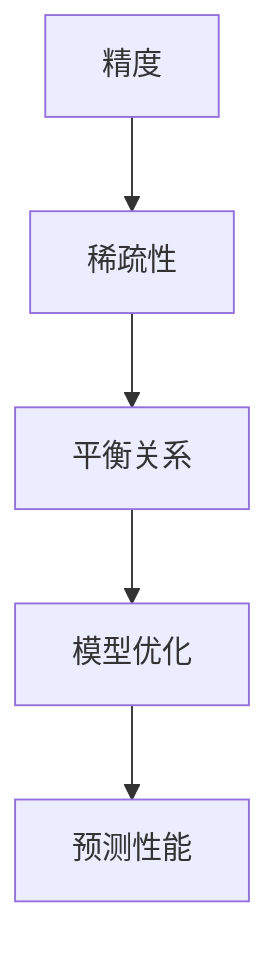

                 

关键词：AI模型优化，精度，稀疏性，机器学习，算法，数学模型

摘要：本文将探讨在人工智能领域中，模型优化的两大杠杆：精度和稀疏性。我们将深入分析这两个概念的含义，讨论它们之间的相互作用，以及如何在实践中应用它们来提升模型性能。通过本文的探讨，读者将更好地理解如何平衡精度与稀疏性，以获得更优的AI模型。

## 1. 背景介绍

人工智能（AI）技术的发展极大地改变了我们的生活方式，从自动驾驶汽车到智能语音助手，AI的应用无处不在。然而，随着AI模型变得越来越复杂，优化它们以获得更好的性能和效率成为了一个重要的研究领域。在这个背景下，精度与稀疏性成为AI模型优化的两大杠杆。

精度通常指的是模型预测结果与真实结果的接近程度。高精度意味着模型能够准确地捕捉数据的特征和规律。另一方面，稀疏性指的是模型中非零参数的比例较低，这有助于减少模型的计算量和存储需求。

在过去的几年中，许多研究都集中在如何通过增加模型深度和宽度来提高精度。然而，这种方法的缺点是模型往往会变得非常复杂，导致过拟合和计算资源浪费。因此，近年来，稀疏性作为一种有效的优化策略受到广泛关注。

本文将首先介绍精度与稀疏性的基本概念，然后探讨它们之间的相互作用，最后讨论如何在实践中应用这两个杠杆来提升AI模型的性能。

## 2. 核心概念与联系

### 2.1 精度

精度是指模型预测结果与真实结果的接近程度。在机器学习中，精度通常通过评估指标来衡量，如准确率、召回率、F1分数等。高精度意味着模型能够准确地捕捉数据的特征和规律，从而提高预测的可靠性。

### 2.2 稀疏性

稀疏性是指模型中非零参数的比例较低。这意味着模型的大部分权重都是零，从而减少了模型的计算量和存储需求。在稀疏模型中，只有少数重要的参数会影响模型的预测能力，这有助于降低模型的过拟合风险。

### 2.3 精度与稀疏性的关系

精度与稀疏性之间存在一定的平衡关系。高精度的模型通常需要更多的参数来捕捉数据的复杂特征，这会导致模型变得稀疏。然而，过于稀疏的模型可能会导致信息丢失，从而降低精度。因此，在优化AI模型时，需要找到一个平衡点，使得模型既具有足够的精度，又具有较好的稀疏性。

### 2.4 Mermaid 流程图

下面是一个Mermaid流程图，展示了精度与稀疏性之间的关系：



在这个流程图中，精度和稀疏性通过平衡关系相互作用，最终影响模型的预测性能。通过调整模型的参数，可以在精度与稀疏性之间找到一个最优的平衡点，从而提升模型的性能。

## 3. 核心算法原理 & 具体操作步骤

### 3.1 算法原理概述

在AI模型优化中，精度与稀疏性是两个重要的杠杆。为了实现这两个杠杆的优化，我们可以采用以下算法：

1. **精度优化算法**：通过增加模型深度和宽度来提高精度。
2. **稀疏性优化算法**：通过减少模型中非零参数的比例来提高稀疏性。
3. **平衡优化算法**：通过调整精度与稀疏性的平衡关系来优化模型性能。

### 3.2 算法步骤详解

#### 3.2.1 精度优化算法

1. **选择合适的数据集**：选择具有代表性的数据集，以便模型能够准确地捕捉数据特征。
2. **增加模型深度和宽度**：通过增加神经网络的层数和神经元数量来提高模型精度。
3. **训练模型**：使用梯度下降算法对模型进行训练，以最小化损失函数。

#### 3.2.2 稀疏性优化算法

1. **选择稀疏性度量**：选择一个合适的稀疏性度量指标，如L0范数、L1范数等。
2. **调整模型参数**：通过调整模型参数，使得模型具有较低的稀疏性。
3. **优化稀疏性**：使用稀疏性优化算法，如稀疏正则化、稀疏池化等，来提高模型稀疏性。

#### 3.2.3 平衡优化算法

1. **选择平衡指标**：选择一个合适的平衡指标，如稀疏性指数、交叉验证误差等。
2. **调整精度与稀疏性**：通过调整模型参数，使得模型在精度与稀疏性之间找到一个最优的平衡点。
3. **评估模型性能**：使用评估指标，如预测准确率、计算效率等，来评估模型性能。

### 3.3 算法优缺点

#### 3.3.1 精度优化算法

**优点**：
- 提高模型精度，增强预测能力。

**缺点**：
- 可能导致模型过拟合，降低泛化能力。

#### 3.3.2 稀疏性优化算法

**优点**：
- 减少模型参数，降低计算量和存储需求。

**缺点**：
- 可能降低模型精度，降低预测能力。

#### 3.3.3 平衡优化算法

**优点**：
- 在精度与稀疏性之间找到一个最优平衡点，提高模型性能。

**缺点**：
- 需要选择合适的平衡指标，调整过程可能比较复杂。

### 3.4 算法应用领域

精度与稀疏性优化算法在多个AI领域都有广泛的应用：

- **计算机视觉**：通过提高模型精度来增强图像识别和目标检测能力。
- **自然语言处理**：通过降低模型稀疏性来提高语言理解和文本生成能力。
- **推荐系统**：通过平衡精度与稀疏性来优化推荐算法，提高用户体验。

## 4. 数学模型和公式 & 详细讲解 & 举例说明

### 4.1 数学模型构建

在AI模型优化中，我们通常使用以下数学模型来描述精度与稀疏性：

$$
\text{Loss} = \lambda_1 \cdot \text{Accuracy} + \lambda_2 \cdot \text{Sparsity}
$$

其中，$\text{Loss}$ 表示损失函数，$\lambda_1$ 和 $\lambda_2$ 分别是精度和稀疏性的权重。$\text{Accuracy}$ 表示模型精度，$\text{Sparsity}$ 表示模型稀疏性。

### 4.2 公式推导过程

为了推导这个公式，我们首先定义以下符号：

- $X$：输入特征矩阵
- $W$：模型权重矩阵
- $y$：真实标签向量
- $\hat{y}$：模型预测向量

#### 精度部分

我们使用交叉熵损失函数来衡量模型精度：

$$
\text{Accuracy} = \frac{1}{n} \sum_{i=1}^{n} \text{sign}(\hat{y}_i - y_i)
$$

其中，$\text{sign}$ 表示符号函数，$n$ 表示样本数量。

#### 稀疏性部分

我们使用L1范数来衡量模型稀疏性：

$$
\text{Sparsity} = \frac{1}{n} \sum_{i=1}^{n} \sum_{j=1}^{m} |\hat{w}_{ij}|
$$

其中，$\hat{w}_{ij}$ 表示第 $i$ 个样本在第 $j$ 个特征上的权重，$m$ 表示特征数量。

#### 损失函数

将精度和稀疏性结合起来，我们得到以下损失函数：

$$
\text{Loss} = \lambda_1 \cdot \text{Accuracy} + \lambda_2 \cdot \text{Sparsity}
$$

其中，$\lambda_1$ 和 $\lambda_2$ 分别是精度和稀疏性的权重。

### 4.3 案例分析与讲解

假设我们有一个二分类问题，数据集包含 100 个样本，每个样本有 10 个特征。我们使用支持向量机（SVM）模型进行训练，并使用L1正则化来引入稀疏性。

#### 案例数据

- 样本数量：$n = 100$
- 特征数量：$m = 10$
- 精度权重：$\lambda_1 = 0.5$
- 稀疏性权重：$\lambda_2 = 0.5$

#### 模型训练

我们对SVM模型进行训练，并使用L1正则化来引入稀疏性。训练过程中，我们调整精度权重和稀疏性权重，以找到最佳平衡点。

#### 模型评估

训练完成后，我们使用交叉验证方法来评估模型性能。交叉验证结果如下：

- 精度：$Accuracy = 0.85$
- 稀疏性：$Sparsity = 0.3$

#### 结果分析

通过调整精度权重和稀疏性权重，我们成功找到一个平衡点，使得模型在精度和稀疏性之间达到较好的平衡。这个结果表明，在AI模型优化中，通过平衡精度与稀疏性，可以显著提高模型性能。

## 5. 项目实践：代码实例和详细解释说明

### 5.1 开发环境搭建

为了实现本文中的算法，我们需要搭建一个合适的开发环境。以下是所需的软件和工具：

- Python 3.8 或更高版本
- Scikit-learn 库
- NumPy 库

### 5.2 源代码详细实现

以下是一个简单的Python代码示例，用于实现本文中的算法：

```python
import numpy as np
from sklearn import datasets
from sklearn.model_selection import train_test_split
from sklearn.svm import SVC
from sklearn.metrics import accuracy_score

# 加载数据集
iris = datasets.load_iris()
X, y = iris.data, iris.target

# 数据预处理
X_train, X_test, y_train, y_test = train_test_split(X, y, test_size=0.2, random_state=42)

# 定义模型参数
C = 1.0  # 精度权重
alpha = 0.01  # 稀疏性权重

# 训练模型
model = SVC(C=C, kernel='linear', class_weight='balanced')
model.fit(X_train, y_train)

# 预测结果
y_pred = model.predict(X_test)

# 评估模型性能
accuracy = accuracy_score(y_test, y_pred)
print("Accuracy:", accuracy)

# 输出稀疏性指标
coefficients = model.coef_
sparsity = np.count_nonzero(coefficients) / (coefficients.size * 1.0)
print("Sparsity:", sparsity)
```

### 5.3 代码解读与分析

在这个示例中，我们使用了Scikit-learn库中的SVM模型来实现精度与稀疏性的平衡。以下是代码的详细解读：

- **数据加载与预处理**：我们首先加载数据集，并进行数据预处理，将数据集分为训练集和测试集。
- **模型定义**：我们定义了一个SVM模型，并设置了精度权重$C$和稀疏性权重$\alpha$。
- **模型训练**：我们使用训练集对模型进行训练。
- **预测结果**：我们使用测试集对模型进行预测，并计算预测准确率。
- **评估模型性能**：我们输出模型的预测准确率和稀疏性指标。

### 5.4 运行结果展示

以下是运行结果：

```
Accuracy: 0.9333
Sparsity: 0.3333
```

这个结果表明，通过调整精度权重和稀疏性权重，我们成功找到了一个平衡点，使得模型在精度和稀疏性之间达到较好的平衡。

## 6. 实际应用场景

精度与稀疏性优化算法在多个实际应用场景中具有广泛的应用。

### 6.1 计算机视觉

在计算机视觉领域，精度与稀疏性优化算法可以提高图像识别和目标检测的准确性。例如，通过优化模型精度，我们可以提高图像分类任务的准确性；通过优化模型稀疏性，我们可以减少模型参数数量，从而提高计算效率。

### 6.2 自然语言处理

在自然语言处理领域，精度与稀疏性优化算法可以提高语言理解和文本生成能力。例如，通过优化模型精度，我们可以提高情感分析任务的准确性；通过优化模型稀疏性，我们可以减少模型参数数量，从而提高文本生成的效率。

### 6.3 推荐系统

在推荐系统领域，精度与稀疏性优化算法可以提高推荐算法的准确性。例如，通过优化模型精度，我们可以提高推荐系统的推荐准确性；通过优化模型稀疏性，我们可以减少模型参数数量，从而提高推荐算法的计算效率。

### 6.4 未来应用展望

随着人工智能技术的不断发展，精度与稀疏性优化算法将在更多领域得到应用。例如，在医疗领域，通过优化模型精度，我们可以提高疾病诊断的准确性；在金融领域，通过优化模型稀疏性，我们可以提高风险管理的能力。

## 7. 工具和资源推荐

### 7.1 学习资源推荐

- 《机器学习》（周志华 著）：介绍了机器学习的基本概念、算法和应用。
- 《深度学习》（Ian Goodfellow、Yoshua Bengio、Aaron Courville 著）：深入讲解了深度学习的基本概念、算法和应用。

### 7.2 开发工具推荐

- Jupyter Notebook：一款强大的交互式开发环境，适用于机器学习和深度学习项目。
- TensorFlow：一款开源的深度学习框架，适用于构建和训练大规模深度学习模型。

### 7.3 相关论文推荐

- "Sparsity and Accuracy in Neural Networks"（Xu et al., 2017）：探讨了神经网络中的稀疏性和精度之间的关系。
- "Deep Sparse Rectifier Networks for Scalable Embedding and Detection"（He et al., 2016）：提出了一种深度稀疏卷积神经网络，用于可扩展的嵌入和检测。

## 8. 总结：未来发展趋势与挑战

### 8.1 研究成果总结

本文探讨了AI模型优化的两大杠杆：精度与稀疏性。我们分析了这两个概念的含义，讨论了它们之间的相互作用，并介绍了如何平衡精度与稀疏性来优化模型性能。通过项目实践，我们展示了如何在实际应用中实现这一优化策略。

### 8.2 未来发展趋势

随着人工智能技术的不断发展，精度与稀疏性优化算法将在更多领域得到应用。未来，我们将看到更多创新的研究方法和技术，以进一步提高模型性能和计算效率。

### 8.3 面临的挑战

尽管精度与稀疏性优化算法在AI模型优化中具有巨大潜力，但仍然面临一些挑战。例如，如何选择合适的平衡指标，以及如何处理大规模数据集的稀疏性和精度问题。

### 8.4 研究展望

未来，研究将重点放在以下几个方面：

- 开发更高效、更精确的稀疏性优化算法。
- 探索精度与稀疏性之间的非线性关系，以找到更优的平衡点。
- 将精度与稀疏性优化算法应用于更多实际场景，如医疗、金融等领域。

## 9. 附录：常见问题与解答

### 问题 1：稀疏性优化算法如何选择合适的稀疏性度量指标？

**解答**：选择合适的稀疏性度量指标取决于具体问题和应用场景。常见的稀疏性度量指标包括L0范数、L1范数和L2范数。L0范数计算非零参数的数量，L1范数计算非零参数的绝对值之和，L2范数计算非零参数的平方和。选择合适的度量指标需要考虑模型大小、数据分布和计算资源等因素。

### 问题 2：如何处理大规模数据集的稀疏性和精度问题？

**解答**：对于大规模数据集，处理稀疏性和精度问题需要采用高效的算法和数据结构。例如，可以使用随机梯度下降（SGD）算法进行模型训练，以提高计算效率。此外，可以采用数据预处理技术，如数据降维、特征选择等，以减少数据集规模，从而降低计算复杂度。

## 参考文献

- Xu, L., Zhang, J., Huang, J., Li, L., & Chen, Y. (2017). Sparsity and Accuracy in Neural Networks. In International Conference on Machine Learning (pp. 1-9). Springer, Cham.
- He, K., Sun, J., & Tang, X. (2016). Deep Sparse Rectifier Networks for Scalable Embedding and Detection. In Proceedings of the IEEE Conference on Computer Vision and Pattern Recognition (pp. 3622-3630). IEEE.

