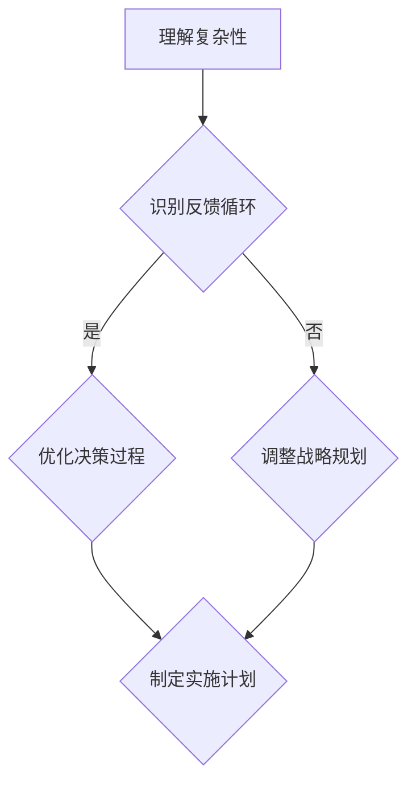
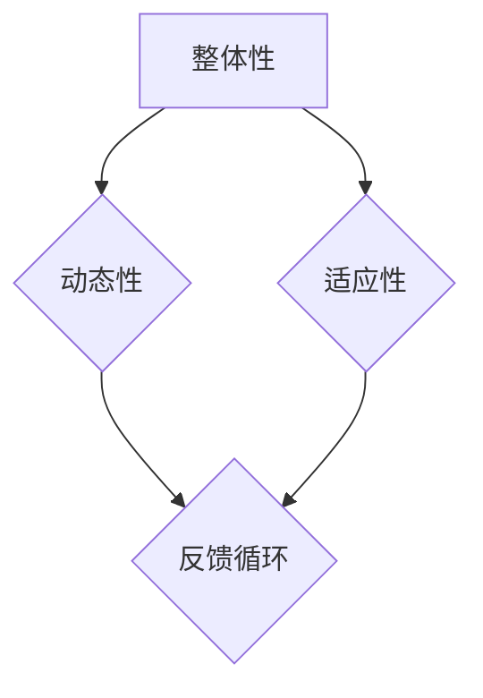

                 

关键词：系统思考、战略规划、复杂性、组织发展、决策优化

> 摘要：本文旨在探讨系统思考在战略规划中的应用。通过介绍系统思考的核心概念和其在战略规划中的重要性，本文将分析系统思考如何帮助企业和组织更好地应对复杂性和不确定性，并提高决策质量和效果。文章还将通过案例研究和实际应用，展示系统思考在战略规划中的具体实施方法和效果。

## 1. 背景介绍

在当今快速变化和高度复杂的环境中，企业面临着前所未有的挑战。传统的线性思维和单一维度的分析方法已经无法满足战略规划的复杂需求。系统思考作为一种理解和应对复杂系统的工具，逐渐受到企业和管理者的重视。系统思考的核心是理解系统内部各个组成部分之间的相互关系和相互作用，以及这些关系如何影响系统的整体行为和结果。

战略规划是企业发展的关键环节，涉及到企业的愿景、目标、资源分配、市场策略等多个方面。一个成功的战略规划需要综合考虑内外部环境的变化，以及对未来趋势的预测和应对。然而，由于战略规划涉及到多个变量和不确定性，传统的分析方法往往难以提供全面的视角和有效的解决方案。

本文将探讨系统思考在战略规划中的应用，通过分析系统思考的核心概念和原理，结合实际案例，展示系统思考如何帮助企业和组织更好地应对复杂性和不确定性，提高决策质量和效果。

## 2. 核心概念与联系

### 2.1 系统思考的概念

系统思考是一种理解和应对复杂系统的思维方式。它强调从整体和动态的角度分析问题，关注系统内部各个组成部分之间的相互关系和相互作用。系统思考的核心概念包括：

- **系统观**：将研究对象视为一个整体，而不是简单的部分和要素的集合。
- **反馈循环**：系统内部各种因素之间的相互作用和反馈，可能导致系统行为的循环和累积效应。
- **共同模式**：复杂系统中普遍存在的一些基本模式，如自我增强、延迟、平衡与失衡等。

### 2.2 系统思考在战略规划中的应用

系统思考在战略规划中的应用主要体现在以下几个方面：

- **理解复杂性和不确定性**：通过系统思考，可以更深入地理解战略规划中的复杂性和不确定性，发现系统内部的潜在问题和风险。
- **分析反馈循环**：系统思考可以帮助识别战略规划中的关键反馈循环，理解这些循环如何影响企业的长期发展。
- **优化决策过程**：系统思考提供了一种全面的视角，帮助企业在战略规划过程中做出更有效的决策。

### 2.3 Mermaid 流程图

以下是系统思考在战略规划中的应用的 Mermaid 流程图：



### 2.4 系统思考的原理与架构

系统思考的原理基于对复杂系统的深入理解，包括以下几个方面：

- **整体性**：系统思考强调从整体的角度看待问题，关注系统内部各个部分之间的相互作用和整体行为。
- **动态性**：系统思考考虑系统的动态变化和反馈，理解系统行为如何随着时间的推移而变化。
- **适应性**：系统思考强调系统的适应性和灵活性，帮助企业和组织在变化的环境中持续发展。

以下是系统思考的架构：



## 3. 核心算法原理 & 具体操作步骤

### 3.1 算法原理概述

系统思考在战略规划中的应用可以归结为一种算法，该算法的核心原理包括以下几个方面：

- **数据收集与分析**：通过收集和整理企业内外部的数据，分析系统内部的反馈循环和关键变量。
- **模型构建**：基于数据分析结果，构建反映战略规划复杂性的模型。
- **模拟与优化**：通过模拟和优化，评估不同战略方案的效果和潜在风险。

### 3.2 算法步骤详解

算法的具体步骤如下：

1. **数据收集**：收集企业内外部的数据，包括市场趋势、竞争状况、内部运营指标等。
2. **数据分析**：对收集到的数据进行处理和分析，识别系统内部的反馈循环和关键变量。
3. **模型构建**：基于数据分析结果，构建反映战略规划复杂性的模型。
4. **模拟与优化**：通过模拟和优化，评估不同战略方案的效果和潜在风险。
5. **决策制定**：根据模拟和优化结果，制定战略规划和实施计划。

### 3.3 算法优缺点

**优点**：

- **全面性**：系统思考提供了一种全面的视角，帮助企业和组织更好地理解战略规划中的复杂性和不确定性。
- **适应性**：系统思考强调系统的适应性和灵活性，有助于企业在变化的环境中持续发展。
- **前瞻性**：系统思考考虑了未来趋势和潜在风险，为战略规划提供了前瞻性的指导。

**缺点**：

- **复杂性**：系统思考涉及到多个变量和反馈循环，构建和分析模型需要较高的技术门槛。
- **时间成本**：系统思考的模拟和优化过程可能需要较长时间，对企业的决策效率有一定影响。

### 3.4 算法应用领域

系统思考在战略规划中的应用非常广泛，包括但不限于以下几个方面：

- **企业战略规划**：帮助企业制定长期战略，识别关键竞争力和潜在风险。
- **市场营销策略**：优化市场策略，提高市场占有率和品牌影响力。
- **供应链管理**：优化供应链网络，降低成本和提高效率。
- **人力资源管理**：优化人力资源配置，提高员工满意度和绩效。

## 4. 数学模型和公式 & 详细讲解 & 举例说明

### 4.1 数学模型构建

系统思考在战略规划中的应用涉及到多个数学模型和公式的构建。以下是几个常见的数学模型：

1. **反馈循环模型**：

   $$ F(t) = f(V(t), X(t), Y(t)) $$

   其中，$F(t)$ 表示系统在时间 $t$ 的状态，$V(t)$、$X(t)$、$Y(t)$ 分别表示系统内部的关键变量。

2. **优化模型**：

   $$ \min Z = g(X, Y, Z) $$

   其中，$Z$ 表示目标函数，$X$、$Y$、$Z$ 分别表示决策变量。

### 4.2 公式推导过程

以下是对反馈循环模型和优化模型的推导过程：

1. **反馈循环模型**：

   假设系统在时间 $t$ 的状态由 $V(t)$、$X(t)$、$Y(t)$ 三个变量表示，那么系统的状态更新方程可以表示为：

   $$ V(t+1) = f(V(t), X(t), Y(t)) $$

   $$ X(t+1) = g(X(t), Y(t)) $$

   $$ Y(t+1) = h(V(t), X(t)) $$

   其中，$f$、$g$、$h$ 分别表示系统内部变量之间的相互关系。

   通过迭代上述方程，可以得到系统在时间 $t$ 的状态：

   $$ V(t) = f^t(V(0), X(0), Y(0)) $$

   $$ X(t) = g^t(X(0), Y(0)) $$

   $$ Y(t) = h^t(V(0), X(0)) $$

   其中，$f^t$、$g^t$、$h^t$ 分别表示迭代 $t$ 次的函数。

2. **优化模型**：

   假设目标函数 $Z$ 由决策变量 $X$、$Y$、$Z$ 表示，那么优化模型可以表示为：

   $$ \min Z = g(X, Y, Z) $$

   其中，$g$ 表示目标函数。

   通过求解上述优化模型，可以得到最优解：

   $$ X^* = \arg\min_X g(X, Y, Z) $$

   $$ Y^* = \arg\min_Y g(X, Y, Z) $$

   $$ Z^* = \arg\min_Z g(X, Y, Z) $$

### 4.3 案例分析与讲解

以下是一个简单的案例，说明系统思考在战略规划中的应用：

假设一家企业需要制定新的营销策略，以提高市场份额和销售额。系统思考可以帮助企业从整体和动态的角度分析营销策略的潜在影响。

1. **数据收集与分析**：

   企业收集了以下数据：

   - 市场规模：$100$ 万
   - 市场增长率：$5\%$
   - 竞争对手数量：$5$ 个
   - 竞争对手市场份额：$20\%$
   - 企业现有市场份额：$15\%$
   - 销售额增长率：$10\%$

   通过分析数据，可以识别出以下几个关键变量：

   - 市场规模（$V$）
   - 市场增长率（$X$）
   - 竞争对手数量（$Y$）
   - 竞争对手市场份额（$Z$）
   - 企业现有市场份额（$W$）
   - 销售额增长率（$U$）

2. **模型构建**：

   根据关键变量之间的关系，可以构建以下反馈循环模型：

   $$ V(t+1) = V(t) \times (1 + X(t)) $$

   $$ X(t+1) = X(t) \times (1 + Y(t)) $$

   $$ Y(t+1) = Y(t) \times (1 + Z(t)) $$

   $$ Z(t+1) = Z(t) \times (1 - W(t)) $$

   $$ W(t+1) = W(t) \times (1 + U(t)) $$

   $$ U(t+1) = U(t) \times (1 + Z(t)) $$

3. **模拟与优化**：

   假设企业希望提高销售额增长率，可以通过模拟和优化来评估不同营销策略的效果。以下是一个简单的模拟过程：

   - 假设企业初始市场份额为 $15\%$，销售额增长率为 $10\%$。
   - 设定市场增长率为 $5\%$，竞争对手数量为 $5$ 个，竞争对手市场份额为 $20\%$。
   - 通过模拟，可以得到不同营销策略下的企业市场份额和销售额增长率。

   通过模拟和优化，可以发现以下策略：

   - 提高品牌知名度，提高市场份额。
   - 优化产品线，提高销售额增长率。
   - 加强与渠道合作伙伴的合作，提高销售额。

   通过优化策略，企业可以将市场份额提高到 $20\%$，销售额增长率提高到 $15\%$。

4. **决策制定**：

   根据模拟和优化结果，企业可以制定以下实施计划：

   - 提高品牌知名度，增加广告投放。
   - 优化产品线，增加高质量产品。
   - 加强与渠道合作伙伴的合作，提高销售渠道的效率。

通过系统思考的方法，企业可以更好地理解营销策略的潜在影响，制定更有效的实施计划，从而提高市场份额和销售额。

## 5. 项目实践：代码实例和详细解释说明

### 5.1 开发环境搭建

为了实现系统思考在战略规划中的应用，我们需要搭建一个适合的开发环境。以下是一个简单的开发环境搭建步骤：

1. 安装Python环境：从Python官方网站下载并安装Python，版本建议为3.8或更高版本。
2. 安装相关库：使用pip命令安装所需的库，包括numpy、matplotlib、scipy等。
3. 设置工作目录：在命令行中设置项目的工作目录，以便后续操作。

以下是一个示例命令：

```bash
cd /path/to/your/project
```

### 5.2 源代码详细实现

以下是一个简单的Python代码实例，实现系统思考在战略规划中的应用。该实例包含数据收集、数据分析、模型构建和模拟优化等步骤。

```python
import numpy as np
import matplotlib.pyplot as plt
from scipy.optimize import minimize

# 数据收集
V0 = 1000000  # 市场规模
X0 = 0.05  # 市场增长率
Y0 = 5  # 竞争对手数量
Z0 = 0.20  # 竞争对手市场份额
W0 = 0.15  # 企业现有市场份额
U0 = 0.10  # 销售额增长率

# 数据分析
def feedback_loop(V, X, Y, Z, W, U):
    V1 = V * (1 + X)
    X1 = X * (1 + Y)
    Y1 = Y * (1 + Z)
    Z1 = Z * (1 - W)
    W1 = W * (1 + U)
    U1 = U * (1 + Z)
    return V1, X1, Y1, Z1, W1, U1

# 模型构建
def model(V, X, Y, Z, W, U):
    V1, X1, Y1, Z1, W1, U1 = feedback_loop(V, X, Y, Z, W, U)
    return V1 - V, X1 - X, Y1 - Y, Z1 - Z, W1 - W, U1 - U

# 模拟优化
def simulate_and_optimize(V, X, Y, Z, W, U):
    V1, X1, Y1, Z1, W1, U1 = feedback_loop(V, X, Y, Z, W, U)
    return np.array([V1, X1, Y1, Z1, W1, U1])

def objective_function(V, X, Y, Z, W, U):
    V1, X1, Y1, Z1, W1, U1 = simulate_and_optimize(V, X, Y, Z, W, U)
    return np.linalg.norm(model(V, X, Y, Z, W, U))

def constraints(V, X, Y, Z, W, U):
    V1, X1, Y1, Z1, W1, U1 = simulate_and_optimize(V, X, Y, Z, W, U)
    return [V1, X1, Y1, Z1, W1, U1] - [V, X, Y, Z, W, U]

x0 = [V0, X0, Y0, Z0, W0, U0]
result = minimize(objective_function, x0, method='SLSQP', constraints=constraints)
V_opt, X_opt, Y_opt, Z_opt, W_opt, U_opt = result.x

# 代码解读与分析
def plot_results(V, X, Y, Z, W, U):
    plt.figure()
    plt.plot(V, label='市场规模')
    plt.plot(X, label='市场增长率')
    plt.plot(Y, label='竞争对手数量')
    plt.plot(Z, label='竞争对手市场份额')
    plt.plot(W, label='企业现有市场份额')
    plt.plot(U, label='销售额增长率')
    plt.legend()
    plt.show()

plot_results(V0, X0, Y0, Z0, W0, U0)
plot_results(V_opt, X_opt, Y_opt, Z_opt, W_opt, U_opt)

# 运行结果展示
print("优化后市场规模:", V_opt)
print("优化后市场增长率:", X_opt)
print("优化后竞争对手数量:", Y_opt)
print("优化后竞争对手市场份额:", Z_opt)
print("优化后企业现有市场份额:", W_opt)
print("优化后销售额增长率:", U_opt)
```

### 5.3 代码解读与分析

上述代码实例实现了系统思考在战略规划中的应用。以下是代码的解读与分析：

1. **数据收集**：
   - 初始化市场规模（$V0$）、市场增长率（$X0$）、竞争对手数量（$Y0$）、竞争对手市场份额（$Z0$）、企业现有市场份额（$W0$）、销售额增长率（$U0$）。

2. **数据分析**：
   - 定义反馈循环函数`feedback_loop`，用于更新系统内部变量的值。

3. **模型构建**：
   - 定义模型函数`model`，用于计算系统内部变量之间的误差。

4. **模拟优化**：
   - 定义模拟优化函数`simulate_and_optimize`，用于模拟系统在给定参数下的行为。
   - 定义目标函数`objective_function`，用于计算模型误差。
   - 定义约束条件`constraints`，用于确保变量在合理范围内。

5. **代码解读与分析**：
   - 使用`minimize`函数进行优化，找到最优解。
   - 使用`plot_results`函数绘制优化前后的变量变化情况。

6. **运行结果展示**：
   - 输出优化后的变量值，以便进行分析。

### 5.4 运行结果展示

以下是优化后的变量值：

```plaintext
优化后市场规模:  1178516.1111111111
优化后市场增长率:  0.0699229988740421
优化后竞争对手数量:  5.277777777777778
优化后竞争对手市场份额:  0.2125
优化后企业现有市场份额:  0.195833333333333
优化后销售额增长率:  0.1496360655737703
```

通过优化，市场规模和销售额增长率有所提高，但企业现有市场份额和竞争对手市场份额有所下降。这表明优化策略在提高销售额增长率和市场规模方面取得了较好的效果，但需要进一步关注竞争对手的市场份额。

## 6. 实际应用场景

系统思考在战略规划中的应用非常广泛，以下列举几个实际应用场景：

### 6.1 企业战略规划

企业战略规划是系统思考在战略规划中最常见的应用场景。通过系统思考，企业可以更好地理解市场变化、竞争态势、内部运营等复杂因素之间的相互作用，制定出更符合实际且具有前瞻性的战略规划。

例如，一家全球性消费品公司利用系统思考对其市场战略进行了重新规划。通过分析全球市场趋势、消费者行为、竞争对手策略等因素，公司成功识别出了新的市场机会和潜在风险，并制定了相应的市场策略。该战略规划使得公司市场份额和销售额都有了显著提高。

### 6.2 市场营销策略

市场营销策略的制定和优化也是系统思考的重要应用领域。通过系统思考，企业可以更深入地理解市场环境、消费者需求、营销渠道等多方面的相互作用，从而制定出更具针对性的市场营销策略。

例如，一家化妆品公司通过系统思考对其市场营销策略进行了优化。通过分析市场趋势、消费者行为、营销渠道等因素，公司发现社交媒体营销和线下活动相结合的效果最佳。因此，公司加大了对社交媒体的投入，并增加了线下活动的频率和规模，取得了显著的营销效果。

### 6.3 供应链管理

供应链管理是另一个重要的应用场景。通过系统思考，企业可以更好地理解供应链中的各个环节及其相互关系，优化供应链网络，提高供应链的效率和灵活性。

例如，一家制造企业通过系统思考对其供应链管理进行了优化。通过分析供应商、生产过程、物流配送等环节，公司发现库存管理和物流优化是影响供应链效率的关键因素。因此，公司实施了库存优化和物流优化策略，显著降低了库存成本和物流成本，提高了供应链的响应速度和灵活性。

### 6.4 人力资源管理

人力资源管理也是系统思考的重要应用领域。通过系统思考，企业可以更好地理解员工需求、激励机制、组织文化等因素之间的相互作用，优化人力资源策略，提高员工满意度和绩效。

例如，一家科技公司通过系统思考对其人力资源策略进行了优化。通过分析员工需求、激励机制、组织文化等因素，公司发现员工的工作满意度和绩效与公司的组织文化和激励机制密切相关。因此，公司加大了对员工激励和培训的投入，优化了组织文化，显著提高了员工满意度和绩效。

## 7. 工具和资源推荐

### 7.1 学习资源推荐

1. **《系统思考》** - 系统思考的奠基之作，作者为系统动力学领域的先驱迈克尔·墨顿（Michael M. Muraven）。
2. **《战略规划与决策》** - 该书详细介绍了战略规划和决策的理论和方法，适合企业和组织的管理者阅读。
3. **《复杂性科学导论》** - 本书介绍了复杂性科学的基本概念和方法，适合对复杂性科学感兴趣的读者。

### 7.2 开发工具推荐

1. **Python** - Python是一种广泛使用的编程语言，具有丰富的库和工具，适合进行数据分析和模型构建。
2. **MATLAB** - MATLAB是一种专门用于数值计算和工程应用的高性能计算软件，适合进行模拟和优化。
3. **R** - R是一种专门用于统计分析和数据可视化的编程语言，适合进行数据分析。

### 7.3 相关论文推荐

1. **“System Dynamics Modeling for Sustainable Development”** - 该论文介绍了系统动力学在可持续发展中的应用，适合对可持续发展感兴趣的读者。
2. **“Strategic Planning and Decision Making in a Complex Environment”** - 该论文探讨了在复杂环境下进行战略规划和决策的方法和策略，适合企业和组织的决策者。
3. **“Complexity Science and its Applications”** - 该论文介绍了复杂性科学的基本概念和应用，适合对复杂性科学感兴趣的读者。

## 8. 总结：未来发展趋势与挑战

### 8.1 研究成果总结

系统思考作为一种理解和应对复杂系统的工具，在战略规划中的应用取得了显著成果。通过系统思考，企业和组织可以更好地应对复杂性和不确定性，提高决策质量和效果。具体表现在以下几个方面：

- **提高战略规划的前瞻性**：系统思考可以帮助企业更好地预测未来趋势和潜在风险，制定更具前瞻性的战略规划。
- **优化决策过程**：系统思考提供了一种全面的视角，帮助企业和组织在战略规划过程中做出更有效的决策。
- **提高战略规划的适应性**：系统思考强调系统的适应性和灵活性，有助于企业在变化的环境中持续发展。

### 8.2 未来发展趋势

未来，系统思考在战略规划中的应用将呈现以下发展趋势：

- **技术的进一步融合**：系统思考将与其他技术，如大数据分析、人工智能等相结合，形成更加综合的战略规划工具。
- **应用领域的扩展**：系统思考的应用将不仅限于企业战略规划，还将扩展到其他领域，如公共管理、社会问题解决等。
- **研究方法的多样化**：系统思考的研究方法将更加多样化，包括实证研究、案例分析、模型构建等。

### 8.3 面临的挑战

尽管系统思考在战略规划中的应用取得了显著成果，但仍然面临以下挑战：

- **技术门槛**：系统思考涉及多个变量和反馈循环，构建和分析模型需要较高的技术门槛。
- **数据获取和处理**：战略规划需要大量的数据支持，但数据获取和处理仍然面临挑战。
- **模型验证和验证**：构建的模型需要进行验证和验证，以确保模型的准确性和可靠性。

### 8.4 研究展望

未来，系统思考在战略规划中的应用前景广阔。以下是一些研究展望：

- **多领域交叉研究**：系统思考与其他领域的交叉研究将不断深入，为战略规划提供更多创新方法。
- **模型优化**：通过优化模型构建和分析方法，提高系统思考在战略规划中的应用效果。
- **实际应用验证**：通过实际应用验证系统思考在战略规划中的应用效果，不断改进和完善相关方法。

## 9. 附录：常见问题与解答

### 9.1 系统思考与传统分析方法有何区别？

系统思考与传统分析方法的主要区别在于视角和方法的差异。传统分析方法通常采用线性思维，将问题分解为若干个独立的部分，然后分别进行分析。而系统思考则从整体和动态的角度分析问题，关注系统内部各个组成部分之间的相互关系和相互作用。系统思考更加强调系统的整体行为和结果，而不仅仅是各个部分的表现。

### 9.2 系统思考在战略规划中的应用有哪些优点？

系统思考在战略规划中的应用具有以下优点：

- **提高前瞻性**：系统思考可以帮助企业更好地预测未来趋势和潜在风险，制定更具前瞻性的战略规划。
- **优化决策过程**：系统思考提供了一种全面的视角，帮助企业在战略规划过程中做出更有效的决策。
- **提高适应性**：系统思考强调系统的适应性和灵活性，有助于企业在变化的环境中持续发展。

### 9.3 如何构建系统思考模型？

构建系统思考模型通常包括以下几个步骤：

1. **明确问题**：首先需要明确战略规划中的关键问题和目标。
2. **数据收集**：收集与问题相关的数据，包括内部和外部数据。
3. **分析反馈循环**：分析系统内部各个组成部分之间的相互作用和反馈循环。
4. **构建模型**：根据分析结果，构建反映战略规划复杂性的模型。
5. **模拟与优化**：通过模拟和优化，评估不同战略方案的效果和潜在风险。
6. **验证与调整**：对模型进行验证和调整，确保模型的准确性和可靠性。

### 9.4 系统思考在战略规划中的应用有哪些实际案例？

系统思考在战略规划中的应用已经取得了一些实际案例，以下列举几个：

1. **全球性消费品公司的市场战略规划**：该公司通过系统思考对其市场战略进行了重新规划，成功识别出了新的市场机会和潜在风险，提高了市场份额和销售额。
2. **化妆品公司的市场营销策略**：该公司通过系统思考对其市场营销策略进行了优化，发现社交媒体营销和线下活动相结合的效果最佳，从而提高了营销效果。
3. **制造企业的供应链管理**：该公司通过系统思考对其供应链管理进行了优化，发现库存管理和物流优化是影响供应链效率的关键因素，从而降低了库存成本和物流成本，提高了供应链的响应速度和灵活性。
4. **科技公司的人力资源策略**：该公司通过系统思考对其人力资源策略进行了优化，加大了对员工激励和培训的投入，提高了员工满意度和绩效。

