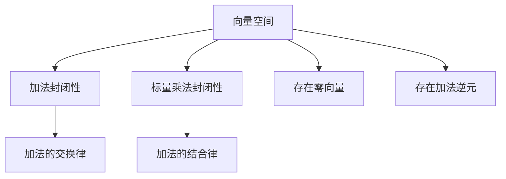

                 

关键词：线性代数，几何向量空间，矩阵运算，向量空间理论，数学模型，算法原理，项目实践，应用场景，未来展望。

> 摘要：本文将深入探讨线性代数在几何向量空间中的应用，分析其核心概念、算法原理，并通过具体案例和实践，阐述其在实际应用中的重要性。文章旨在为读者提供一个全面的线性代数导引，帮助理解和掌握几何向量空间的理论与应用。

## 1. 背景介绍

线性代数是数学的一个重要分支，它在物理、工程、计算机科学等多个领域都有着广泛的应用。几何向量空间，作为线性代数的一个重要概念，其基础理论和运算方法对理解和解决复杂的实际问题具有重要意义。

在几何向量空间中，向量是基本元素，它既有大小又有方向。向量空间则是一组向量的集合，这些向量满足加法和标量乘法的封闭性。矩阵则是向量空间中的另一种表示形式，它通过线性组合可以表示复杂的向量关系。

线性代数在几何向量空间中的应用主要体现在以下几个方面：

1. **矩阵运算**：矩阵可以表示线性变换，从而实现对向量的线性组合和变换。
2. **向量空间理论**：向量空间的封闭性和线性独立性是解决实际问题的基本工具。
3. **算法原理**：许多重要的算法，如矩阵分解、特征值问题等，都是基于线性代数的基本理论。
4. **数学模型**：线性代数可以用来建立和解决各种实际问题中的数学模型。

## 2. 核心概念与联系

### 2.1 向量空间

向量空间（Vector Space）是一个集合V，其中的元素称为向量。向量空间必须满足以下条件：

- **加法封闭性**：对于任意的向量u, v ∈ V，它们的和u + v仍然属于V。
- **标量乘法封闭性**：对于任意的向量v ∈ V和标量c ∈ F，它们的乘积cv仍然属于V。
- **加法的交换律**：对于任意的向量u, v ∈ V，有u + v = v + u。
- **加法的结合律**：对于任意的向量u, v, w ∈ V，有(u + v) + w = u + (v + w)。
- **存在零向量**：存在一个向量0，使得对于任意的向量v ∈ V，有v + 0 = v。
- **存在加法逆元**：对于任意的向量v ∈ V，存在一个向量-v，使得v + (-v) = 0。

### 2.2 线性组合

线性组合是指多个向量通过标量乘法和加法运算的组合。如果v1, v2, ..., vk是向量空间V中的向量，c1, c2, ..., ck是标量，那么它们的线性组合可以表示为：

\[ c_1v_1 + c_2v_2 + ... + c_kv_k \]

### 2.3 线性相关与线性独立

- **线性相关**：如果向量组v1, v2, ..., vk之间存在一个非平凡线性组合等于零向量，即存在一组不全为零的标量c1, c2, ..., ck，使得c1v1 + c2v2 + ... + ckvk = 0，那么这个向量组是线性相关的。
- **线性独立**：如果向量组v1, v2, ..., vk只有当所有标量c1, c2, ..., ck都为零时，线性组合c1v1 + c2v2 + ... + ckvk才等于零向量，那么这个向量组是线性独立的。

### 2.4 Mermaid 流程图

## 3. 核心算法原理 & 具体操作步骤

### 3.1 算法原理概述

线性代数中的许多算法都是基于向量空间和矩阵的基本操作。以下是几个核心算法：

- **矩阵乘法**：矩阵乘法是一种线性组合，它通过矩阵与矩阵之间的乘法运算来表示复杂的关系。
- **矩阵分解**：如LU分解、QR分解等，它们可以将矩阵分解为简单矩阵的乘积，从而简化计算。
- **特征值问题**：求解矩阵的特征值和特征向量，用于分析矩阵的性质。
- **线性方程组求解**：通过矩阵运算求解线性方程组，是线性代数中应用最广泛的算法之一。

### 3.2 算法步骤详解

#### 3.2.1 矩阵乘法

矩阵乘法是一种基本的线性组合操作。给定两个矩阵A ∈ R^(m×n)和B ∈ R^(n×p)，它们的乘积C ∈ R^(m×p)可以表示为：

\[ C_{ij} = \sum_{k=1}^{n} A_{ik}B_{kj} \]

#### 3.2.2 矩阵分解

以LU分解为例，给定矩阵A ∈ R^(n×n)，我们可以将其分解为：

\[ A = LU \]

其中，L是一个下三角矩阵，U是一个上三角矩阵。

步骤如下：

1. 初始化L为单位矩阵。
2. 对于k从1到n：
   - 计算U的第k行。
   - 更新L的第k列。

#### 3.2.3 线性方程组求解

给定线性方程组：

\[ AX = B \]

其中，A是一个n×n矩阵，X和

