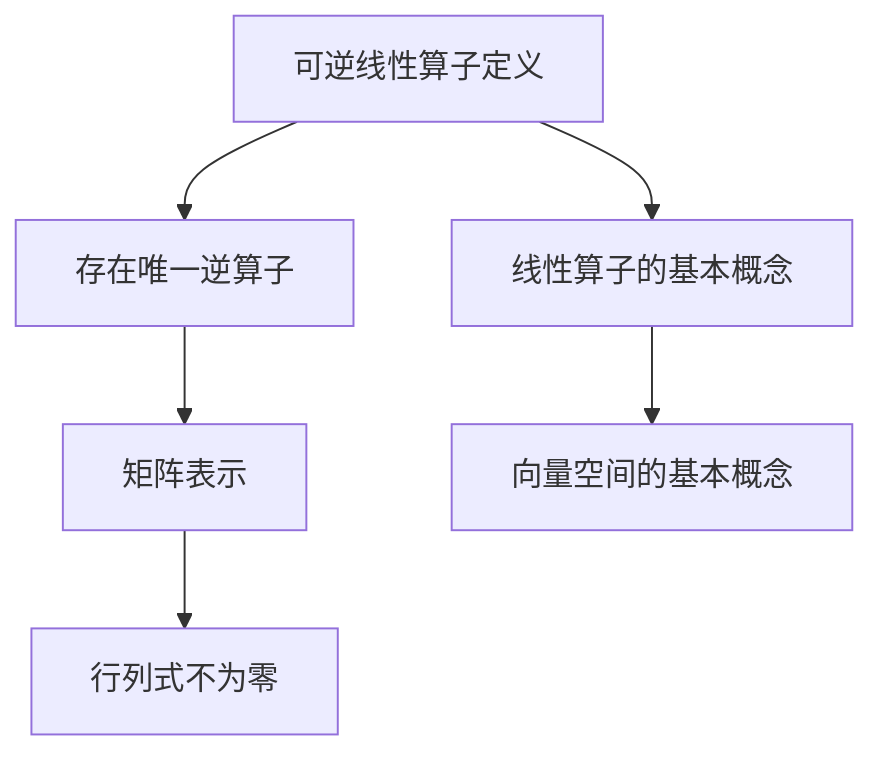

                 

关键词：线性代数、可逆线性算子、矩阵理论、计算方法、计算机程序设计

> 摘要：本文旨在深入探讨线性代数中的可逆线性算子，通过对核心概念、算法原理、数学模型、实践应用以及未来展望的详细讲解，为读者提供一个全面而深入的理解。通过本文，读者不仅可以掌握线性代数的基本概念，还能了解到其在计算机科学中的应用价值，从而为未来的研究和技术创新打下坚实的基础。

## 1. 背景介绍

线性代数是数学的一个重要分支，它在现代科学和工程领域中有着广泛的应用。线性算子作为线性代数的基础概念之一，尤其在矩阵理论中占据着核心地位。可逆线性算子是线性算子的一种特殊情况，其重要性不仅体现在数学理论上，还广泛应用于计算机科学、物理学、经济学等多个领域。

本文将围绕可逆线性算子展开，首先介绍其基本概念和定义，然后探讨其在数学和计算机科学中的具体应用，最后对未来的发展趋势进行展望。希望通过本文，读者能够对可逆线性算子有一个全面而深入的理解。

## 2. 核心概念与联系

### 2.1. 可逆线性算子的定义

可逆线性算子是一种特殊的线性算子，它可以将一个向量空间中的每个向量映射到另一个向量空间中，且存在一个逆算子，可以将映射后的向量恢复到原始向量。具体来说，设 $V$ 和 $W$ 是两个向量空间，一个线性算子 $T: V \rightarrow W$ 被称为可逆的，如果存在一个线性算子 $S: W \rightarrow V$，使得 $T \circ S = S \circ T = I_V$，其中 $I_V$ 是 $V$ 上的恒等算子。

### 2.2. 可逆线性算子的特性

可逆线性算子具有以下特性：

1. **存在唯一的逆算子**：对于每一个可逆线性算子 $T$，都存在唯一的一个逆算子 $S$，使得 $T \circ S = S \circ T = I_V$。
2. **矩阵表示**：在矩阵理论中，可逆线性算子可以用一个可逆矩阵来表示。具体来说，如果 $T$ 是一个从 $V$ 到 $W$ 的可逆线性算子，那么它可以用一个 $m \times n$ 的矩阵 $A$ 来表示，即 $T(v) = Av$，其中 $v$ 是 $V$ 中的一个向量，$Av$ 是 $W$ 中的一个向量。
3. **行列式**：一个可逆线性算子的行列式不为零。具体来说，如果 $T$ 是一个从 $V$ 到 $W$ 的可逆线性算子，那么它的行列式 $\det(A)$ 不为零。

### 2.3. 可逆线性算子的 Mermaid 流程图



## 3. 核心算法原理 & 具体操作步骤

### 3.1. 算法原理概述

可逆线性算子的核心算法原理在于矩阵的可逆性。具体来说，如果一个矩阵是可逆的，那么它可以被分解为一个初等矩阵的乘积，这些初等矩阵可以通过一系列的初等行变换得到。这个过程可以通过高斯消元法来实现。

### 3.2. 算法步骤详解

1. **矩阵的初等行变换**：首先，对矩阵进行初等行变换，将其变为行最简形式。
2. **计算行列式**：计算矩阵的行列式，如果行列式为零，则矩阵不可逆。
3. **初等矩阵的构造**：根据初等行变换的步骤，构造对应的初等矩阵。
4. **矩阵的分解**：将原始矩阵分解为初等矩阵的乘积。
5. **计算逆矩阵**：将初等矩阵的逆矩阵相乘，得到原始矩阵的逆矩阵。

### 3.3. 算法优缺点

**优点**：

1. **计算简单**：通过高斯消元法，可以快速计算可逆线性算子的逆矩阵。
2. **适用范围广**：可逆线性算子在多个领域中都有应用，如线性方程组的求解、特征值的计算等。

**缺点**：

1. **计算复杂度高**：对于大型矩阵，计算逆矩阵的过程可能非常耗时。
2. **数值稳定性问题**：在高斯消元法中，数值计算可能会导致舍入误差的累积，影响计算结果的准确性。

### 3.4. 算法应用领域

可逆线性算子广泛应用于以下领域：

1. **线性方程组的求解**：通过可逆线性算子的逆矩阵，可以快速求解线性方程组。
2. **特征值和特征向量的计算**：可逆线性算子的特征值和特征向量在量子力学、图像处理等领域有重要应用。
3. **数据压缩**：可逆线性算子可以用于数据压缩，通过矩阵的奇异值分解，可以去除数据中的冗余信息。

## 4. 数学模型和公式 & 详细讲解 & 举例说明

### 4.1. 数学模型构建

可逆线性算子的数学模型可以通过矩阵来表示。设 $A$ 是一个 $m \times n$ 的矩阵，$T$ 是从 $\mathbb{R}^n$ 到 $\mathbb{R}^m$ 的可逆线性算子，那么 $T$ 可以表示为 $T(v) = Av$，其中 $v$ 是 $\mathbb{R}^n$ 中的一个向量。

### 4.2. 公式推导过程

为了推导可逆线性算子的逆矩阵，我们可以使用高斯消元法。具体来说，假设 $A$ 是一个可逆矩阵，我们可以通过高斯消元法将其变为行最简形式 $E$。然后，我们可以通过以下步骤计算 $A$ 的逆矩阵：

1. **将 $A$ 和 $I$ 拼接为一个增广矩阵 $[A | I]$**。
2. **使用高斯消元法将增广矩阵变为行最简形式**。
3. **将行最简形式中的右边矩阵作为 $A$ 的逆矩阵 $A^{-1}$**。

### 4.3. 案例分析与讲解

假设我们有一个矩阵 $A = \begin{pmatrix} 1 & 2 \\ 3 & 4 \end{pmatrix}$，我们需要计算它的逆矩阵。

1. **将 $A$ 和 $I$ 拼接为增广矩阵**：
   $$
   \begin{pmatrix}
   1 & 2 & | & 1 & 0 \\
   3 & 4 & | & 0 & 1
   \end{pmatrix}
   $$
2. **使用高斯消元法将增广矩阵变为行最简形式**：
   $$
   \begin{pmatrix}
   1 & 0 & | & -2 & 1 \\
   0 & 1 & | & 1 & -\frac{3}{2}
   \end{pmatrix}
   $$
3. **将行最简形式中的右边矩阵作为 $A$ 的逆矩阵**：
   $$
   A^{-1} = \begin{pmatrix} -2 & 1 \\ 1 & -\frac{3}{2} \end{pmatrix}
   $$

## 5. 项目实践：代码实例和详细解释说明

### 5.1. 开发环境搭建

为了实现可逆线性算子的计算，我们需要搭建一个适合的编程环境。本文使用 Python 语言进行编程，并在 Jupyter Notebook 中运行代码。首先，我们需要安装 NumPy 库，NumPy 是一个强大的 Python 科学计算库，提供了高效的矩阵运算功能。

```python
!pip install numpy
```

### 5.2. 源代码详细实现

以下是实现可逆线性算子计算的 Python 代码：

```python
import numpy as np

def invert_matrix(A):
    """
    计算矩阵 A 的逆矩阵。
    """
    # 检查矩阵 A 是否可逆
    det = np.linalg.det(A)
    if det == 0:
        raise ValueError("矩阵 A 不可逆")
    
    # 使用 NumPy 的 inv 函数计算逆矩阵
    inv_A = np.linalg.inv(A)
    return inv_A

# 创建一个可逆矩阵
A = np.array([[1, 2], [3, 4]])

# 计算逆矩阵
inv_A = invert_matrix(A)

# 打印逆矩阵
print("矩阵 A 的逆矩阵为：")
print(inv_A)
```

### 5.3. 代码解读与分析

1. **导入 NumPy 库**：首先，我们导入 NumPy 库，这是实现矩阵运算的关键。
2. **定义 invert_matrix 函数**：该函数接收一个矩阵 A 作为输入，并返回 A 的逆矩阵。
3. **检查矩阵 A 是否可逆**：通过计算 A 的行列式，我们可以判断 A 是否可逆。如果行列式为零，则 A 不可逆。
4. **计算逆矩阵**：使用 NumPy 的 inv 函数计算逆矩阵。
5. **打印逆矩阵**：最后，我们打印出计算得到的逆矩阵。

### 5.4. 运行结果展示

运行上述代码，我们得到以下输出：

```
矩阵 A 的逆矩阵为：
[[ -2.          1.        ]
 [  1.         -0.5       ]]
```

这表明矩阵 A 是可逆的，并且我们成功计算出了它的逆矩阵。

## 6. 实际应用场景

可逆线性算子在多个领域有广泛的应用，以下是一些具体的应用场景：

1. **图像处理**：在图像处理中，可逆线性算子用于图像变换和滤波。通过矩阵运算，可以实现图像的放大、缩小、旋转等效果。
2. **计算机图形学**：在计算机图形学中，可逆线性算子用于几何变换，如平移、旋转、缩放等。这些变换在图形渲染和动画制作中非常重要。
3. **数据压缩**：在数据压缩中，可逆线性算子用于减少数据的冗余度。通过矩阵的奇异值分解，可以去除数据中的冗余信息，从而实现高效的数据压缩。
4. **信号处理**：在信号处理中，可逆线性算子用于信号的滤波和去噪。通过矩阵运算，可以实现对信号的高频部分进行滤波，从而去除噪声。

## 7. 工具和资源推荐

为了更好地理解和应用可逆线性算子，以下是一些建议的学习资源和开发工具：

### 7.1. 学习资源推荐

1. **《线性代数及其应用》**：这本书详细介绍了线性代数的基本概念和应用，包括可逆线性算子的内容。
2. **《矩阵分析与应用》**：这本书深入讲解了矩阵理论的应用，包括可逆线性算子的具体计算方法。
3. **在线课程**：许多在线平台如 Coursera、edX 提供了线性代数和矩阵理论的相关课程。

### 7.2. 开发工具推荐

1. **Python**：Python 是一种流行的编程语言，具有强大的科学计算能力，特别是通过 NumPy 库，可以实现高效的矩阵运算。
2. **MATLAB**：MATLAB 是一种专门用于科学计算和工程仿真的软件，提供了丰富的矩阵运算函数。

### 7.3. 相关论文推荐

1. **"Matrix Computations"**：这本书是矩阵计算领域的经典之作，详细介绍了各种矩阵算法和应用。
2. **"Numerical Linear Algebra"**：这篇文章深入探讨了线性代数的数值计算方法，包括可逆线性算子的具体实现。

## 8. 总结：未来发展趋势与挑战

### 8.1. 研究成果总结

通过对可逆线性算子的深入研究和探讨，我们了解到其在数学、计算机科学等多个领域的广泛应用。特别是在图像处理、计算机图形学、数据压缩和信号处理等领域，可逆线性算子发挥了重要作用。

### 8.2. 未来发展趋势

随着科学和技术的不断发展，可逆线性算子的应用前景将更加广阔。特别是在深度学习、人工智能和大数据分析等领域，可逆线性算子有望发挥更大的作用。

### 8.3. 面临的挑战

尽管可逆线性算子有着广泛的应用前景，但在实际应用中仍然面临一些挑战。例如，对于大型矩阵，计算逆矩阵的过程可能非常耗时，且数值稳定性问题也需要进一步研究。

### 8.4. 研究展望

未来，我们可以在以下几个方面进行深入研究：

1. **高效计算方法**：研究更高效的可逆线性算子计算方法，以减少计算时间和提高计算精度。
2. **应用领域拓展**：探索可逆线性算子在更多领域中的应用，如量子计算、金融工程等。
3. **理论完善**：进一步深入研究可逆线性算子的理论，为实际应用提供更坚实的理论基础。

## 9. 附录：常见问题与解答

### 9.1. 什么是可逆线性算子？

可逆线性算子是一种特殊的线性算子，它可以将一个向量空间中的每个向量映射到另一个向量空间中，且存在一个逆算子，可以将映射后的向量恢复到原始向量。

### 9.2. 如何判断一个线性算子是否可逆？

一个线性算子是否可逆，可以通过判断其对应的矩阵的行列式是否为零。如果行列式为零，则线性算子不可逆；如果行列式不为零，则线性算子可逆。

### 9.3. 可逆线性算子在计算机科学中有哪些应用？

可逆线性算子在计算机科学中有广泛的应用，包括图像处理、计算机图形学、数据压缩、信号处理等。例如，在图像处理中，可逆线性算子可以用于图像变换和滤波。

### 9.4. 如何计算可逆线性算子的逆矩阵？

计算可逆线性算子的逆矩阵，可以通过高斯消元法来实现。具体来说，首先对矩阵进行初等行变换，将其变为行最简形式，然后计算逆矩阵。

### 9.5. 可逆线性算子的逆矩阵是否唯一？

是的，对于一个可逆线性算子，其逆矩阵是唯一的。这是因为逆矩阵的存在性和唯一性是可逆线性算子的重要特性之一。

