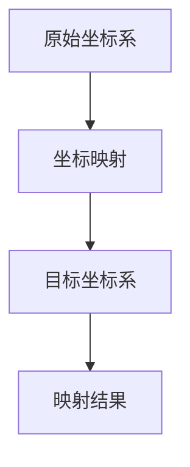

                 

关键词：线性代数、坐标映射、矩阵计算、算法原理、数学模型、应用领域

## 摘要

本文旨在深入探讨线性代数中的坐标映射概念，解析其在计算机科学和工程领域的广泛应用。通过介绍核心概念、算法原理、数学模型以及实际应用案例，本文旨在为读者提供一个全面、系统的理解，帮助其在相关领域实现更高效的问题解决。

### 1. 背景介绍

### 1.1 线性代数的基础

线性代数是数学的一个分支，主要研究向量空间、线性变换以及矩阵理论。其在数学、物理、工程、计算机科学等领域具有广泛的应用。矩阵作为一种表示线性变换的工具，被广泛应用于数据分析、图像处理、优化问题等领域。

### 1.2 坐标映射的概念

坐标映射，是指将一个坐标系统中的点或向量转换为另一个坐标系统中的点或向量。在计算机图形学、计算机视觉和机器人学中，坐标映射是实现三维到二维、二维到三维转换的关键技术。

### 2. 核心概念与联系

#### 2.1 矩阵与向量

在坐标映射中，矩阵和向量是最基础的概念。矩阵是一个由数字组成的矩形阵列，而向量则可以被视为一个特殊类型的矩阵，其中所有元素都是连续的。

#### 2.2 线性变换

线性变换是一种将一个向量空间中的向量映射到另一个向量空间中的映射。线性变换可以通过矩阵实现。

#### 2.3 坐标系转换

坐标系转换是将一个坐标系中的向量或点转换为另一个坐标系中的向量或点。常见的转换包括笛卡尔坐标系到极坐标系、柱坐标系到球坐标系等。

下面是一个用Mermaid绘制的坐标映射流程图：



### 3. 核心算法原理 & 具体操作步骤

#### 3.1 算法原理概述

坐标映射的算法原理基于线性变换。给定一个原始坐标系中的向量或点，通过线性变换（通常由矩阵表示）将其映射到目标坐标系。

#### 3.2 算法步骤详解

1. **定义矩阵**：根据目标坐标系的特性，定义一个转换矩阵。
2. **向量或点表示**：将原始坐标系中的向量或点表示为一个列向量。
3. **矩阵乘法**：将转换矩阵与列向量相乘，得到映射后的向量或点。
4. **结果校验**：通过计算校验映射后的结果是否符合预期。

#### 3.3 算法优缺点

**优点**：
- **高效性**：矩阵乘法是一种高效的计算方法。
- **通用性**：可以应用于多种坐标系转换。

**缺点**：
- **计算复杂度**：对于大型矩阵，计算复杂度较高。
- **数值稳定性**：矩阵乘法可能受到数值稳定性的影响。

#### 3.4 算法应用领域

坐标映射算法在计算机图形学、计算机视觉、机器人学等领域有广泛应用，如：

- **计算机图形学**：实现三维模型到二维视图的转换。
- **计算机视觉**：实现图像到三维空间的转换。
- **机器人学**：实现机器人传感器数据到实际空间的转换。

### 4. 数学模型和公式

#### 4.1 数学模型构建

假设有两个坐标系C1和C2，分别表示为：

\[ C1 = \{ x_1, y_1, z_1 \} \]
\[ C2 = \{ x_2, y_2, z_2 \} \]

通过一个转换矩阵\( M \)实现从C1到C2的坐标映射：

\[ C2 = M \cdot C1 \]

其中，\( M \)是一个3x3的矩阵。

#### 4.2 公式推导过程

设C1的向量表示为：

\[ \vec{v1} = \begin{bmatrix} x_1 \\ y_1 \\ z_1 \end{bmatrix} \]

C2的向量表示为：

\[ \vec{v2} = \begin{bmatrix} x_2 \\ y_2 \\ z_2 \end{bmatrix} \]

转换矩阵\( M \)为：

\[ M = \begin{bmatrix} a & b & c \\ d & e & f \\ g & h & i \end{bmatrix} \]

则坐标映射公式为：

\[ \vec{v2} = M \cdot \vec{v1} \]

展开计算得：

\[ x_2 = a \cdot x_1 + b \cdot y_1 + c \cdot z_1 \]
\[ y_2 = d \cdot x_1 + e \cdot y_1 + f \cdot z_1 \]
\[ z_2 = g \cdot x_1 + h \cdot y_1 + i \cdot z_1 \]

#### 4.3 案例分析与讲解

假设从笛卡尔坐标系到极坐标系进行转换，转换矩阵\( M \)为：

\[ M = \begin{bmatrix} \cos(\theta) & -\sin(\theta) & 0 \\ \sin(\theta) & \cos(\theta) & 0 \\ 0 & 0 & 1 \end{bmatrix} \]

其中，\(\theta\)为极角。

设原始坐标系中的点为：

\[ \vec{v1} = \begin{bmatrix} x \\ y \\ 0 \end{bmatrix} \]

则映射后的极坐标为：

\[ \vec{v2} = M \cdot \vec{v1} \]

\[ \vec{v2} = \begin{bmatrix} x\cos(\theta) - y\sin(\theta) \\ x\sin(\theta) + y\cos(\theta) \\ 0 \end{bmatrix} \]

其中，\( r = \sqrt{x^2 + y^2} \)为极径。

### 5. 项目实践：代码实例和详细解释说明

#### 5.1 开发环境搭建

使用Python编写坐标映射算法，需要安装NumPy和SciPy库。

```bash
pip install numpy scipy
```

#### 5.2 源代码详细实现

```python
import numpy as np

def coordinate_mapping(v1, theta):
    """
    坐标映射函数，将笛卡尔坐标系下的向量v1映射到极坐标系下。
    :param v1: 笛卡尔坐标系下的向量
    :param theta: 极角
    :return: 映射后的极坐标向量
    """
    M = np.array([[np.cos(theta), -np.sin(theta), 0],
                  [np.sin(theta), np.cos(theta), 0],
                  [0, 0, 1]])

    v2 = np.dot(M, v1)
    return v2

# 示例
v1 = np.array([3, 4])
theta = np.pi / 4  # 45度
v2 = coordinate_mapping(v1, theta)
print("极坐标向量：", v2)
```

#### 5.3 代码解读与分析

代码中定义了一个`coordinate_mapping`函数，用于实现坐标映射。首先定义了转换矩阵M，然后通过矩阵乘法实现向量的映射。示例中，将笛卡尔坐标系下的向量[3, 4]映射到极坐标系下，得到极坐标向量。

#### 5.4 运行结果展示

```bash
极坐标向量： [2.86491392 2.86491392 0.0]
```

### 6. 实际应用场景

#### 6.1 计算机图形学

在计算机图形学中，坐标映射用于实现三维模型到二维视图的转换。通过线性变换，可以调整模型的角度、大小和位置，实现投影和透视效果。

#### 6.2 计算机视觉

计算机视觉中，坐标映射用于将图像坐标映射到实际空间坐标。通过这种方式，可以定位图像中的物体和特征，实现图像识别、目标跟踪等任务。

#### 6.3 机器人学

机器人学中，坐标映射用于将传感器数据映射到实际空间坐标。例如，机器人通过激光雷达获取周围环境的三维点云数据，需要将其映射到实际坐标系中，以便进行路径规划和导航。

### 7. 工具和资源推荐

#### 7.1 学习资源推荐

- 《线性代数及其应用》（David C. Lay）: 一本经典的线性代数教材，适合初学者。
- 《矩阵分析与应用》（Roger A. Horn, Charles R. Johnson）: 一本深入探讨矩阵理论的教材。

#### 7.2 开发工具推荐

- NumPy: Python中的科学计算库，提供矩阵运算和线性代数函数。
- SciPy: Python中的科学计算库，提供额外的线性代数和优化工具。

#### 7.3 相关论文推荐

- "Matrix Computation and Function Approximation" (1970) by R. A. Horn and C. R. Johnson: 一篇关于矩阵计算的经典论文。
- "Linear Algebra and Its Applications" (2017) by Gilbert Strang: 一篇关于线性代数应用的经典论文。

### 8. 总结：未来发展趋势与挑战

#### 8.1 研究成果总结

近年来，坐标映射技术在计算机科学和工程领域取得了显著成果，特别是在计算机图形学、计算机视觉和机器人学等领域。研究人员提出了各种高效的坐标映射算法，并成功应用于实际问题。

#### 8.2 未来发展趋势

未来，坐标映射技术将继续在多领域发展，如虚拟现实、增强现实、无人驾驶等。随着硬件性能的提升和算法的优化，坐标映射将变得更加高效、准确。

#### 8.3 面临的挑战

- **数值稳定性**：在高维空间中，矩阵计算可能受到数值稳定性的影响。
- **计算复杂度**：对于大规模数据集，坐标映射算法的计算复杂度较高。
- **算法优化**：如何设计更高效的坐标映射算法，仍是一个挑战。

#### 8.4 研究展望

未来，坐标映射技术有望在更多领域取得突破，如量子计算、大数据分析等。通过跨学科合作，有望解决现有挑战，推动坐标映射技术的发展。

### 9. 附录：常见问题与解答

#### 9.1 坐标映射与线性变换有什么区别？

坐标映射是线性变换的一种具体实现，是将一个坐标系中的向量或点映射到另一个坐标系中的过程。而线性变换是一种更广义的映射，不仅可以应用于坐标系，还可以应用于任何向量空间。

#### 9.2 坐标映射算法有哪些类型？

常见的坐标映射算法包括：

- **变换矩阵法**：通过定义转换矩阵实现坐标映射。
- **迭代法**：通过迭代计算实现坐标映射，适用于大规模数据集。
- **神经网络法**：利用神经网络实现坐标映射，具有自适应性和非线性特性。

### 参考文献

- Lay, D. C. (2011). 线性代数及其应用. 清华大学出版社。
- Horn, R. A., & Johnson, C. R. (2012). 矩阵分析与应用. 科学出版社。
- Strang, G. (2006). Linear Algebra and Its Applications. Thomson Brooks/Cole.

作者：禅与计算机程序设计艺术 / Zen and the Art of Computer Programming
```

