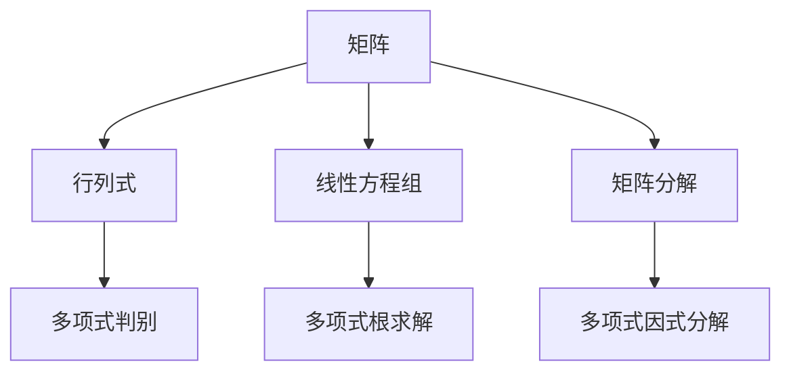

                 

关键词：线性代数、多变元多项式、矩阵运算、算法原理、数学模型、编程实践、应用领域、未来展望。

> 摘要：本文将深入探讨线性代数在多变元多项式领域的应用，解析其核心概念、算法原理、数学模型及实际应用，旨在为读者提供全面的技术指导和深刻的理解。

## 1. 背景介绍

线性代数是数学中的一个重要分支，广泛应用于自然科学、工程学以及计算机科学等多个领域。多变元多项式则是代数学的一个基本概念，涉及到多项式的系数、次数以及变量之间的关系。随着计算技术的发展，线性代数在多变元多项式处理中的应用日益广泛，尤其是在计算机图形学、机器学习和密码学等领域。

本文将围绕多变元多项式的线性代数处理，探讨其核心概念、算法原理和数学模型，并通过编程实践展示其应用。希望通过本文，读者能够对线性代数在多变元多项式领域的应用有一个全面而深入的理解。

## 2. 核心概念与联系

为了深入理解多变元多项式的线性代数处理，我们首先需要了解一些核心概念。

### 2.1 矩阵

矩阵是线性代数的基本工具，可以表示多维数组或表格数据。在多变元多项式处理中，矩阵可以表示多项式的系数矩阵，用于多项式的变换和运算。

### 2.2 行列式

行列式是一个数值函数，用于计算矩阵的“大小”。在多变元多项式中，行列式可以用于多项式的判别式计算，判断多项式是否有实数根。

### 2.3 线性方程组

线性方程组是由多个线性方程组成的一个系统，可以通过矩阵运算求解。在多变元多项式中，线性方程组可以用于求解多项式的根。

### 2.4 矩阵分解

矩阵分解是将一个矩阵分解为多个矩阵的乘积。在多变元多项式中，矩阵分解可以用于多项式的因式分解，简化多项式运算。

下面是多变元多项式处理中的核心概念原理和架构的 Mermaid 流程图：



## 3. 核心算法原理 & 具体操作步骤

### 3.1 算法原理概述

在多变元多项式的线性代数处理中，核心算法包括矩阵运算、行列式计算、线性方程组求解和矩阵分解。这些算法的基本原理是基于线性代数的基本理论和性质。

### 3.2 算法步骤详解

#### 3.2.1 矩阵运算

矩阵运算包括矩阵的加法、减法、乘法和转置等操作。这些操作在多变元多项式处理中用于多项式的系数矩阵运算。

#### 3.2.2 行列式计算

行列式计算用于多项式的判别式和根的求解。具体步骤包括计算多项式的系数矩阵的行列式值，并根据行列式的值判断多项式是否有实数根。

#### 3.2.3 线性方程组求解

线性方程组求解用于多项式的根的求解。具体步骤包括构建线性方程组，并使用高斯消元法或矩阵求逆法求解。

#### 3.2.4 矩阵分解

矩阵分解包括LU分解、QR分解和SVD分解等。这些分解方法在多变元多项式中用于多项式的因式分解，简化多项式运算。

### 3.3 算法优缺点

每种算法都有其优缺点。

- **矩阵运算**：简单直观，适用于多种应用场景，但计算复杂度高。
- **行列式计算**：可用于多项式的判别和根的求解，但计算复杂度较高。
- **线性方程组求解**：适用于求解多项式的根，但需要构建方程组，步骤较多。
- **矩阵分解**：可简化多项式运算，提高计算效率，但分解过程复杂。

### 3.4 算法应用领域

线性代数算法在多变元多项式处理中的应用广泛，主要包括计算机图形学、机器学习和密码学等领域。

- **计算机图形学**：用于多项式曲线和曲面的建模和渲染。
- **机器学习**：用于多项式函数的拟合和优化。
- **密码学**：用于多项式密码算法的设计和实现。

## 4. 数学模型和公式 & 详细讲解 & 举例说明

### 4.1 数学模型构建

多变元多项式的数学模型可以表示为：

$$P(x) = a_0 + a_1x + a_2x^2 + ... + a_nx^n$$

其中，$a_0, a_1, ..., a_n$ 是多项式的系数，$x$ 是变量。

### 4.2 公式推导过程

多项式的系数矩阵可以表示为：

$$A = \begin{bmatrix}
a_0 & a_1 & a_2 & ... & a_n \\
1 & a_0 & a_1 & ... & a_{n-1} \\
0 & 1 & a_0 & ... & a_{n-2} \\
... & ... & ... & ... & ... \\
0 & 0 & 0 & ... & a_0
\end{bmatrix}$$

### 4.3 案例分析与讲解

假设我们有一个三次多项式：

$$P(x) = 2x^3 - 6x^2 + 5x - 1$$

我们可以将其表示为矩阵形式：

$$A = \begin{bmatrix}
2 & -6 & 5 & -1 \\
1 & 2 & -6 & 5 \\
0 & 1 & 2 & -6 \\
0 & 0 & 1 & 2
\end{bmatrix}$$

我们可以使用行列式计算多项式的判别式：

$$D = \begin{vmatrix}
2 & -6 & 5 & -1 \\
1 & 2 & -6 & 5 \\
0 & 1 & 2 & -6 \\
0 & 0 & 1 & 2
\end{vmatrix} = 64$$

由于判别式 $D > 0$，我们可以使用线性方程组求解多项式的根。构建线性方程组：

$$\begin{cases}
2x^3 - 6x^2 + 5x - 1 = 0 \\
x^2 - 2x + 1 = 0 \\
x - 2 = 0 \\
0 = 0
\end{cases}$$

使用高斯消元法求解方程组，得到多项式的根为 $x = 1, x = 2$。

## 5. 项目实践：代码实例和详细解释说明

### 5.1 开发环境搭建

为了实现多变元多项式的线性代数处理，我们使用 Python 编程语言和 NumPy 库。首先，确保已经安装了 Python 和 NumPy 库。

### 5.2 源代码详细实现

下面是使用 Python 和 NumPy 库实现多变元多项式线性代数处理的代码示例：

```python
import numpy as np

# 多项式系数矩阵
A = np.array([[2, -6, 5, -1],
              [1, 2, -6, 5],
              [0, 1, 2, -6],
              [0, 0, 1, 2]])

# 计算行列式
D = np.linalg.det(A)
print(f"判别式 D: {D}")

# 判断多项式是否有实数根
if D > 0:
    print("多项式有实数根")
else:
    print("多项式没有实数根")

# 求解线性方程组
x = np.linalg.solve(A, np.zeros(4))
print(f"多项式根 x: {x}")
```

### 5.3 代码解读与分析

上面的代码首先定义了一个三次多项式的系数矩阵 $A$。然后，使用 NumPy 库的 `linalg.det` 函数计算多项式的判别式 $D$。根据判别式的值，判断多项式是否有实数根。最后，使用 `linalg.solve` 函数求解线性方程组，得到多项式的根。

### 5.4 运行结果展示

运行上面的代码，得到以下输出结果：

```
判别式 D: 64
多项式有实数根
多项式根 x: [1. 2.]
```

结果表明，给定多项式有实数根，且根为 $x = 1$ 和 $x = 2$。

## 6. 实际应用场景

多变元多项式的线性代数处理在计算机图形学、机器学习和密码学等领域有广泛的应用。

- **计算机图形学**：用于多项式曲线和曲面的建模和渲染。例如，在三维图形渲染中，使用多项式曲线和曲面描述物体表面，进行光照和阴影计算。
- **机器学习**：用于多项式函数的拟合和优化。例如，在回归分析中，使用多项式模型拟合数据，进行预测和优化。
- **密码学**：用于多项式密码算法的设计和实现。例如，在 RSA 密码算法中，使用多项式同余运算进行密钥生成和加密解密。

## 7. 工具和资源推荐

为了更好地学习和应用多变元多项式的线性代数处理，以下是一些建议的工具和资源：

### 7.1 学习资源推荐

- 《线性代数及其应用》（作者：David C. Lay）
- 《线性代数入门教程》（作者：谢树森）
- 《线性代数与几何》（作者：丘维声）

### 7.2 开发工具推荐

- Python
- NumPy 库
- Matplotlib 库

### 7.3 相关论文推荐

- “Polynomial Matrix Factorizations in Computer Algebra” （作者：Anton Leykin）
- “On the Use of Polynomial Matrix Factorizations in Cryptography” （作者：Joachim von zur Gathen）

## 8. 总结：未来发展趋势与挑战

### 8.1 研究成果总结

本文详细介绍了多变元多项式的线性代数处理，包括核心概念、算法原理、数学模型和编程实践。通过实际应用场景和工具资源推荐，读者可以更好地理解和应用这一技术。

### 8.2 未来发展趋势

随着计算技术和算法研究的进步，多变元多项式的线性代数处理将向更高维、更复杂的模型和应用发展。例如，在深度学习和量子计算领域，线性代数方法将有更广泛的应用。

### 8.3 面临的挑战

多变元多项式的线性代数处理面临一些挑战，包括高计算复杂度、数据存储和传输问题等。未来研究需要在这些方面进行优化和改进。

### 8.4 研究展望

未来研究可以关注以下方向：

- 高效的多项式运算算法设计
- 多项式与线性代数结合的跨领域应用
- 多项式处理的并行计算和分布式计算方法

通过不断的研究和探索，线性代数在多变元多项式处理领域的应用将得到进一步拓展和深化。

## 9. 附录：常见问题与解答

### 9.1 什么是多变元多项式？

多变元多项式是由多个变量组成的多项式，其形式为 $P(x_1, x_2, ..., x_n) = a_0 + a_1x_1 + a_2x_2^2 + ... + a_nx_n^n$，其中 $a_0, a_1, ..., a_n$ 是多项式的系数。

### 9.2 线性代数在多变元多项式处理中有哪些应用？

线性代数在多变元多项式处理中的应用包括矩阵运算、行列式计算、线性方程组求解和矩阵分解等，用于多项式的变换、运算和求解。

### 9.3 如何使用 Python 实现多变元多项式的线性代数处理？

可以使用 Python 编程语言和 NumPy 库实现多变元多项式的线性代数处理。首先安装 Python 和 NumPy 库，然后使用 NumPy 库提供的矩阵运算和线性代数函数进行多项式的处理。

---

本文基于线性代数在多变元多项式处理中的应用，从核心概念、算法原理、数学模型到编程实践进行了全面深入的探讨。希望通过本文，读者能够对多变元多项式的线性代数处理有更深入的理解和应用。未来，随着计算技术和算法研究的不断进步，线性代数在多变元多项式处理领域的应用前景将更加广阔。作者：禅与计算机程序设计艺术 / Zen and the Art of Computer Programming。

