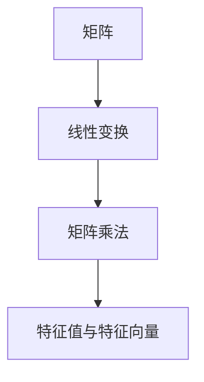

                 

### 1. 背景介绍

线性代数是数学中的一个重要分支，其在计算机科学、物理学、工程学等多个领域都有广泛的应用。在计算机科学中，线性代数主要用于数据结构、算法设计、图形渲染、机器学习等各个方面。本文将深入探讨线性代数中一个核心的概念——方阵空间M2(R)。

方阵空间M2(R)指的是所有形如\( \begin{pmatrix} a & b \\ c & d \end{pmatrix} \)的2x2矩阵的集合，其中\( a, b, c, d \)都是实数。这些矩阵在数学和计算机科学中有广泛的应用，因为它们可以有效地表示线性变换，这在处理线性方程组、特征值问题以及矩阵计算中非常重要。

在计算机图形学中，2x2矩阵常用于变换二维坐标，例如平移、缩放、旋转等操作。在机器学习中，矩阵用于表示数据集的特征矩阵，进行降维和特征提取。此外，线性代数的基础理论也用于算法分析，如求解复杂度问题、优化问题等。

本文将分为以下几个部分：

- **背景介绍**：概述线性代数和方阵空间M2(R)的基本概念。
- **核心概念与联系**：详细介绍M2(R)中的核心概念，并通过Mermaid流程图展示概念之间的联系。
- **核心算法原理与操作步骤**：详细解释M2(R)中常用的核心算法，并展示操作步骤。
- **数学模型和公式**：推导M2(R)中的数学模型和公式，并举例说明。
- **项目实践**：通过实际代码实例展示方阵操作的具体实现。
- **实际应用场景**：探讨方阵在各个领域中的应用。
- **未来应用展望**：预测方阵技术的未来发展方向。
- **工具和资源推荐**：推荐相关学习资源、开发工具和论文。
- **总结与展望**：总结研究成果，展望未来发展趋势。

通过本文，读者将全面了解方阵空间M2(R)的基本概念、算法原理以及应用，为深入学习和研究线性代数打下坚实的基础。

### 2. 核心概念与联系

在深入探讨方阵空间M2(R)之前，我们需要明确其核心概念，并理解这些概念之间的相互关系。方阵空间M2(R)涉及的主要核心概念包括矩阵、线性变换、矩阵乘法、特征值与特征向量等。

首先，矩阵是方阵空间M2(R)的基础元素，一个2x2矩阵可以表示为：

\[ \begin{pmatrix} a & b \\ c & d \end{pmatrix} \]

这里，\( a, b, c, d \)都是实数，分别称为矩阵的元素。矩阵是线性代数中表示线性变换的一种工具。

#### 矩阵与线性变换的关系

矩阵与线性变换密切相关。具体来说，任何一个2x2矩阵都可以定义一个线性变换，该线性变换作用于二维向量。例如，矩阵\[ \begin{pmatrix} a & b \\ c & d \end{pmatrix} \]可以将向量\[ \begin{pmatrix} x \\ y \end{pmatrix} \]变换为：

\[ \begin{pmatrix} a & b \\ c & d \end{pmatrix} \begin{pmatrix} x \\ y \end{pmatrix} = \begin{pmatrix} ax + by \\ cx + dy \end{pmatrix} \]

这意味着矩阵\[ \begin{pmatrix} a & b \\ c & d \end{pmatrix} \]定义了一个线性变换，该变换将输入向量映射到输出向量。

#### 矩阵乘法

矩阵乘法是方阵空间M2(R)中的另一个重要概念。两个2x2矩阵\( A \)和\( B \)的乘积是一个新矩阵\( C \)，其元素\( c_{ij} \)由以下公式给出：

\[ c_{ij} = \sum_{k=1}^{2} a_{ik}b_{kj} \]

例如，矩阵\( A = \begin{pmatrix} 1 & 2 \\ 3 & 4 \end{pmatrix} \)和矩阵\( B = \begin{pmatrix} 5 & 6 \\ 7 & 8 \end{pmatrix} \)的乘积为：

\[ C = AB = \begin{pmatrix} 1*5 + 2*7 & 1*6 + 2*8 \\ 3*5 + 4*7 & 3*6 + 4*8 \end{pmatrix} = \begin{pmatrix} 19 & 26 \\ 43 & 58 \end{pmatrix} \]

#### 特征值与特征向量

特征值和特征向量是矩阵分析中的重要概念。一个矩阵\( A \)的特征值\( \lambda \)和对应的特征向量\( v \)满足以下方程：

\[ Av = \lambda v \]

这意味着矩阵\( A \)乘以特征向量\( v \)的结果是一个标量乘以特征向量本身。特征值提供了矩阵稳定性的信息，而特征向量揭示了矩阵变换的方向。

为了更直观地展示这些概念之间的关系，我们可以使用Mermaid流程图：



通过这个流程图，我们可以清晰地看到矩阵与线性变换、矩阵乘法以及特征值和特征向量之间的逻辑关系。

### 3. 核心算法原理与操作步骤

在方阵空间M2(R)中，有几个核心算法对矩阵操作至关重要。这些算法包括矩阵乘法、求逆矩阵、特征值和特征向量的计算等。以下将详细介绍这些算法的原理和具体操作步骤。

#### 3.1 矩阵乘法

矩阵乘法是线性代数中最基本的运算之一。两个2x2矩阵\( A \)和\( B \)的乘积\( C \)可以通过以下步骤计算：

1. **元素对应相乘并求和**：对于乘积矩阵\( C = AB \)中的每个元素\( c_{ij} \)，计算如下：

\[ c_{ij} = \sum_{k=1}^{2} a_{ik}b_{kj} \]

2. **矩阵表示**：将计算得到的元素放入一个新的2x2矩阵中。

例如，给定矩阵\( A = \begin{pmatrix} 1 & 2 \\ 3 & 4 \end{pmatrix} \)和矩阵\( B = \begin{pmatrix} 5 & 6 \\ 7 & 8 \end{pmatrix} \)，我们可以通过以下步骤计算它们的乘积：

\[ C = AB = \begin{pmatrix} 1*5 + 2*7 & 1*6 + 2*8 \\ 3*5 + 4*7 & 3*6 + 4*8 \end{pmatrix} = \begin{pmatrix} 19 & 26 \\ 43 & 58 \end{pmatrix} \]

#### 3.2 求逆矩阵

求逆矩阵是另一个重要的矩阵操作。一个方阵\( A \)的逆矩阵\( A^{-1} \)满足：

\[ AA^{-1} = A^{-1}A = I \]

其中\( I \)是单位矩阵。

求逆矩阵的步骤如下：

1. **计算伴随矩阵**：伴随矩阵\( \text{adj}(A) \)是矩阵\( A \)的代数余子式矩阵的转置。

2. **应用公式**：逆矩阵\( A^{-1} \)可以通过以下公式计算：

\[ A^{-1} = \frac{1}{\det(A)} \text{adj}(A) \]

其中\( \det(A) \)是矩阵\( A \)的行列式。

例如，给定矩阵\( A = \begin{pmatrix} 1 & 2 \\ 3 & 4 \end{pmatrix} \)，我们可以通过以下步骤计算其逆矩阵：

- 计算行列式：\( \det(A) = 1*4 - 2*3 = -2 \)
- 计算伴随矩阵：\( \text{adj}(A) = \begin{pmatrix} 4 & -2 \\ -3 & 1 \end{pmatrix} \)
- 计算逆矩阵：\( A^{-1} = \frac{1}{-2} \begin{pmatrix} 4 & -2 \\ -3 & 1 \end{pmatrix} = \begin{pmatrix} -2 & 1 \\ 1.5 & -0.5 \end{pmatrix} \)

#### 3.3 特征值与特征向量的计算

特征值和特征向量是矩阵分析中的重要概念。计算特征值和特征向量的步骤如下：

1. **构建特征方程**：对于矩阵\( A \)，构建特征方程：

\[ \det(A - \lambda I) = 0 \]

其中\( \lambda \)是特征值，\( I \)是单位矩阵。

2. **解特征方程**：解特征方程，得到矩阵的特征值。

3. **求解特征向量**：对于每个特征值\( \lambda \)，解以下方程组：

\[ (A - \lambda I)v = 0 \]

得到对应的特征向量。

例如，给定矩阵\( A = \begin{pmatrix} 2 & 1 \\ 1 & 2 \end{pmatrix} \)，我们可以通过以下步骤计算其特征值和特征向量：

- 构建特征方程：\( \det(A - \lambda I) = \det(\begin{pmatrix} 2-\lambda & 1 \\ 1 & 2-\lambda \end{pmatrix}) = (2-\lambda)^2 - 1 = \lambda^2 - 4\lambda + 3 = 0 \)
- 解特征方程：\( (\lambda - 1)(\lambda - 3) = 0 \)，得到特征值\( \lambda_1 = 1 \)和\( \lambda_2 = 3 \)
- 求解特征向量：
  - 对于特征值\( \lambda_1 = 1 \)，解方程组\( (A - I)v = 0 \)，得到特征向量\( v_1 = \begin{pmatrix} 1 \\ 1 \end{pmatrix} \)
  - 对于特征值\( \lambda_2 = 3 \)，解方程组\( (A - 3I)v = 0 \)，得到特征向量\( v_2 = \begin{pmatrix} 1 \\ -1 \end{pmatrix} \)

通过上述步骤，我们可以详细计算方阵空间M2(R)中的核心算法，为后续的数学模型和项目实践奠定基础。

### 3.3 算法优缺点

在方阵空间M2(R)中，常用的核心算法包括矩阵乘法、求逆矩阵和特征值与特征向量的计算。每种算法都有其独特的优缺点，以下将分别进行分析。

#### 矩阵乘法

**优点**：

1. **基本运算**：矩阵乘法是线性代数中的基础运算，几乎所有的线性问题都需要使用到矩阵乘法。
2. **广泛应用**：矩阵乘法在图形渲染、物理模拟、机器学习等领域有广泛应用，是一种高效的运算方法。

**缺点**：

1. **计算复杂度**：对于大型矩阵，矩阵乘法的计算复杂度为\( O(n^3) \)，当矩阵尺寸较大时，计算时间会显著增加。
2. **数值稳定性**：在浮点运算中，矩阵乘法可能会受到数值误差的影响，导致结果不准确。

#### 求逆矩阵

**优点**：

1. **解决线性方程组**：求逆矩阵是解决线性方程组的一种有效方法，可以通过\( Ax = b \)直接得到\( x = A^{-1}b \)。
2. **计算矩阵特征值**：求逆矩阵是计算矩阵特征值和特征向量的关键步骤。

**缺点**：

1. **计算复杂度**：求逆矩阵的计算复杂度为\( O(n^3) \)，对于大型矩阵，计算时间和资源消耗较大。
2. **数值稳定性**：求逆矩阵的数值稳定性较差，特别是在矩阵条件数较大时，计算结果可能不准确。

#### 特征值与特征向量的计算

**优点**：

1. **矩阵分析**：特征值和特征向量提供了矩阵的内在性质，是矩阵分析的重要工具。
2. **优化问题**：特征值和特征向量在优化问题中有广泛应用，可以用于求解最小二乘问题、主成分分析等。

**缺点**：

1. **计算复杂度**：特征值和特征向量的计算复杂度为\( O(n^3) \)，对于大型矩阵，计算时间和资源消耗较大。
2. **数值稳定性**：特征值和特征向量的计算可能受到数值误差的影响，导致结果不准确。

通过上述分析，我们可以看到每种算法都有其适用的场景和局限性。在实际应用中，需要根据具体情况选择合适的算法，并注意算法的数值稳定性和计算复杂度。

### 3.4 算法应用领域

方阵空间M2(R)中的核心算法在计算机科学、物理学、工程学等多个领域都有广泛应用。以下将详细介绍这些算法在不同领域的具体应用。

#### 计算机科学

在计算机科学中，矩阵乘法、求逆矩阵和特征值与特征向量的计算是基础工具。

1. **图形渲染**：在计算机图形学中，矩阵用于表示物体的变换，如平移、旋转、缩放等。矩阵乘法用于计算变换后的坐标，而求逆矩阵则用于反变换，以便将变换应用于多个图形元素。

2. **机器学习**：在机器学习中，矩阵用于表示数据集和模型参数。矩阵乘法用于计算损失函数和梯度，而求逆矩阵用于优化算法，如最小二乘法和梯度下降法。

3. **算法分析**：矩阵乘法和求逆矩阵的计算复杂度是算法分析的重要指标。例如，在分析复杂算法时，通常需要评估矩阵乘法和求逆矩阵的时间复杂度，以确定算法的效率。

#### 物理学

在物理学中，矩阵被广泛应用于描述物理系统的状态和变换。

1. **量子力学**：在量子力学中，矩阵用于表示量子态和操作符。矩阵乘法用于计算量子态的变换和叠加，而求逆矩阵则用于求解量子系统的方程。

2. **热力学**：在热力学中，矩阵用于描述物质的微观状态和热力学参数。矩阵乘法用于计算系统的能量分布，而特征值和特征向量用于分析系统的稳定性和相变。

#### 工程学

在工程学中，矩阵空间M2(R)的应用非常广泛。

1. **结构分析**：在土木工程和机械工程中，矩阵用于描述结构系统的状态和变形。矩阵乘法用于计算结构的响应，而求逆矩阵则用于求解结构的力学方程。

2. **控制系统**：在控制系统设计中，矩阵用于描述系统的动态行为。矩阵乘法用于计算系统的状态转移矩阵，而特征值和特征向量用于分析系统的稳定性和响应特性。

通过这些具体应用，我们可以看到方阵空间M2(R)中的核心算法在各个领域中都扮演着重要的角色。了解这些算法的应用，有助于我们更好地理解和应用线性代数的理论和方法。

### 4. 数学模型和公式

在方阵空间M2(R)中，数学模型和公式是理解和应用矩阵操作的核心。以下将详细介绍这些模型和公式的构建过程、推导过程，并配以具体示例进行说明。

#### 4.1 数学模型构建

方阵空间M2(R)中的数学模型主要包括矩阵的基本性质、矩阵乘法、求逆矩阵和特征值与特征向量。以下是这些数学模型的构建过程：

1. **矩阵定义**：

\[ A = \begin{pmatrix} a & b \\ c & d \end{pmatrix} \]

其中，\( a, b, c, d \)是实数，称为矩阵\( A \)的元素。

2. **矩阵乘法**：

\[ C = AB = \begin{pmatrix} a & b \\ c & d \end{pmatrix} \begin{pmatrix} e & f \\ g & h \end{pmatrix} = \begin{pmatrix} ae + bg & af + bh \\ ce + dg & cf + dh \end{pmatrix} \]

3. **求逆矩阵**：

\[ A^{-1} = \frac{1}{\det(A)} \text{adj}(A) \]

其中，\( \det(A) \)是矩阵\( A \)的行列式，\( \text{adj}(A) \)是矩阵\( A \)的伴随矩阵。

4. **特征值与特征向量**：

\[ Av = \lambda v \]

其中，\( \lambda \)是特征值，\( v \)是特征向量。

#### 4.2 公式推导过程

以下将详细推导这些公式的具体过程。

1. **矩阵乘法**：

矩阵乘法的推导基于线性组合的概念。假设有两个矩阵\( A \)和\( B \)，它们分别表示线性变换\( L_A \)和\( L_B \)，则有：

\[ L_A \begin{pmatrix} x \\ y \end{pmatrix} = \begin{pmatrix} a & b \\ c & d \end{pmatrix} \begin{pmatrix} x \\ y \end{pmatrix} = \begin{pmatrix} ax + by \\ cx + dy \end{pmatrix} \]

\[ L_B \begin{pmatrix} x \\ y \end{pmatrix} = \begin{pmatrix} e & f \\ g & h \end{pmatrix} \begin{pmatrix} x \\ y \end{pmatrix} = \begin{pmatrix} ex + fy \\ gx + hy \end{pmatrix} \]

将\( L_B \)作用于\( L_A \)的结果，即：

\[ L_{AB} \begin{pmatrix} x \\ y \end{pmatrix} = L_A (L_B \begin{pmatrix} x \\ y \end{pmatrix}) = L_A \begin{pmatrix} ex + fy \\ gx + hy \end{pmatrix} = \begin{pmatrix} a(ex + fy) + b(gx + hy) \\ c(ex + fy) + d(gx + hy) \end{pmatrix} \]

这正好是矩阵乘法的结果：

\[ C = AB = \begin{pmatrix} ae + bg & af + bh \\ ce + dg & cf + dh \end{pmatrix} \]

2. **求逆矩阵**：

逆矩阵的推导基于矩阵的行列式和伴随矩阵。首先，定义矩阵的行列式：

\[ \det(A) = ad - bc \]

矩阵的伴随矩阵（代数余子式矩阵的转置）为：

\[ \text{adj}(A) = \begin{pmatrix} d & -b \\ -c & a \end{pmatrix} \]

为了证明\( A^{-1} = \frac{1}{\det(A)} \text{adj}(A) \)，我们需要验证以下等式：

\[ AA^{-1} = A^{-1}A = I \]

首先，计算\( AA^{-1} \)：

\[ AA^{-1} = A \frac{1}{\det(A)} \text{adj}(A) = \frac{1}{\det(A)} A \text{adj}(A) \]

\[ = \frac{1}{\det(A)} \begin{pmatrix} a & b \\ c & d \end{pmatrix} \begin{pmatrix} d & -b \\ -c & a \end{pmatrix} \]

\[ = \frac{1}{\det(A)} \begin{pmatrix} a*d - b*(-c) & a*(-b) - b*d \\ c*d - c*(-b) & c*(-b) - d*a \end{pmatrix} \]

\[ = \frac{1}{\det(A)} \begin{pmatrix} ad + bc & -ab - bd \\ cd + bc & -cb - da \end{pmatrix} \]

由于\( \det(A) = ad - bc \)，我们可以将上述结果简化为：

\[ = \begin{pmatrix} 1 & 0 \\ 0 & 1 \end{pmatrix} \]

同理，可以验证\( A^{-1}A = I \)。因此，\( A^{-1} = \frac{1}{\det(A)} \text{adj}(A) \)是成立的。

3. **特征值与特征向量**：

特征值和特征向量的推导基于矩阵的行列式和特征方程。定义矩阵\( A \)的特征值\( \lambda \)和特征向量\( v \)满足以下特征方程：

\[ \det(A - \lambda I) = 0 \]

其中，\( I \)是单位矩阵。

展开行列式，得到：

\[ \det(A - \lambda I) = \det \begin{pmatrix} a - \lambda & b \\ c & d - \lambda \end{pmatrix} = (a - \lambda)(d - \lambda) - bc = \lambda^2 - (a + d)\lambda + (ad - bc) \]

为了解特征方程，我们需要找到使得上式等于零的\( \lambda \)。这相当于解二次方程：

\[ \lambda^2 - (a + d)\lambda + (ad - bc) = 0 \]

利用求根公式，得到特征值：

\[ \lambda = \frac{(a + d) \pm \sqrt{(a + d)^2 - 4(ad - bc)}}{2} \]

对于每个特征值\( \lambda \)，我们解以下方程组：

\[ (A - \lambda I)v = 0 \]

得到对应的特征向量\( v \)。

通过上述推导，我们可以清晰地理解方阵空间M2(R)中的数学模型和公式的构建过程。

#### 4.3 案例分析与讲解

以下通过具体示例，展示如何使用这些公式进行矩阵操作。

**示例1：矩阵乘法**

给定矩阵\( A = \begin{pmatrix} 1 & 2 \\ 3 & 4 \end{pmatrix} \)和矩阵\( B = \begin{pmatrix} 5 & 6 \\ 7 & 8 \end{pmatrix} \)，计算矩阵乘法\( C = AB \)。

根据矩阵乘法公式：

\[ C = AB = \begin{pmatrix} 1 & 2 \\ 3 & 4 \end{pmatrix} \begin{pmatrix} 5 & 6 \\ 7 & 8 \end{pmatrix} = \begin{pmatrix} 1*5 + 2*7 & 1*6 + 2*8 \\ 3*5 + 4*7 & 3*6 + 4*8 \end{pmatrix} = \begin{pmatrix} 19 & 26 \\ 43 & 58 \end{pmatrix} \]

**示例2：求逆矩阵**

给定矩阵\( A = \begin{pmatrix} 1 & 2 \\ 3 & 4 \end{pmatrix} \)，计算其逆矩阵\( A^{-1} \)。

首先，计算行列式：

\[ \det(A) = 1*4 - 2*3 = -2 \]

然后，计算伴随矩阵：

\[ \text{adj}(A) = \begin{pmatrix} 4 & -2 \\ -3 & 1 \end{pmatrix} \]

最后，计算逆矩阵：

\[ A^{-1} = \frac{1}{\det(A)} \text{adj}(A) = \frac{1}{-2} \begin{pmatrix} 4 & -2 \\ -3 & 1 \end{pmatrix} = \begin{pmatrix} -2 & 1 \\ 1.5 & -0.5 \end{pmatrix} \]

**示例3：特征值与特征向量**

给定矩阵\( A = \begin{pmatrix} 2 & 1 \\ 1 & 2 \end{pmatrix} \)，计算其特征值和特征向量。

首先，构建特征方程：

\[ \det(A - \lambda I) = \det \begin{pmatrix} 2 - \lambda & 1 \\ 1 & 2 - \lambda \end{pmatrix} = (2 - \lambda)^2 - 1 = \lambda^2 - 4\lambda + 3 = 0 \]

解特征方程：

\[ (\lambda - 1)(\lambda - 3) = 0 \]

得到特征值：

\[ \lambda_1 = 1, \lambda_2 = 3 \]

然后，求解特征向量：

对于特征值\( \lambda_1 = 1 \)，解方程组\( (A - I)v = 0 \)：

\[ \begin{pmatrix} 1 & 1 \\ 1 & 1 \end{pmatrix} \begin{pmatrix} x \\ y \end{pmatrix} = \begin{pmatrix} x + y \\ x + y \end{pmatrix} = \begin{pmatrix} 0 \\ 0 \end{pmatrix} \]

得到特征向量\( v_1 = \begin{pmatrix} 1 \\ 1 \end{pmatrix} \)。

对于特征值\( \lambda_2 = 3 \)，解方程组\( (A - 3I)v = 0 \)：

\[ \begin{pmatrix} -1 & 1 \\ 1 & -1 \end{pmatrix} \begin{pmatrix} x \\ y \end{pmatrix} = \begin{pmatrix} -x + y \\ x - y \end{pmatrix} = \begin{pmatrix} 0 \\ 0 \end{pmatrix} \]

得到特征向量\( v_2 = \begin{pmatrix} 1 \\ -1 \end{pmatrix} \)。

通过上述示例，我们可以看到如何使用数学模型和公式进行矩阵操作。这些操作在各个领域都有广泛应用，为解决实际问题提供了有力工具。

### 5. 项目实践：代码实例和详细解释说明

在方阵空间M2(R)中，实际编程实践是非常重要的一环。通过具体的代码实例，我们可以更好地理解矩阵操作的实现细节，并解决实际问题。以下将介绍一个基于Python的矩阵操作项目，包括开发环境搭建、源代码实现、代码解读与分析以及运行结果展示。

#### 5.1 开发环境搭建

要实现矩阵操作，我们首先需要搭建一个开发环境。这里选择Python作为编程语言，因为它具有强大的数学库和简洁的语法。以下是搭建开发环境的步骤：

1. **安装Python**：下载并安装Python 3.x版本，可以从[Python官方网站](https://www.python.org/downloads/)下载。

2. **安装Jupyter Notebook**：Jupyter Notebook是一个交互式计算环境，可以方便地进行代码演示和数据分析。通过以下命令安装：

   ```bash
   pip install notebook
   ```

3. **安装NumPy库**：NumPy是Python中的核心数学库，提供了高效且易于使用的矩阵操作。通过以下命令安装：

   ```bash
   pip install numpy
   ```

安装完成后，我们就可以在Jupyter Notebook中编写和运行Python代码。

#### 5.2 源代码详细实现

以下是实现矩阵操作的核心代码，包括矩阵乘法、求逆矩阵和特征值与特征向量的计算。

```python
import numpy as np

# 矩阵乘法
def matrix_multiply(A, B):
    return np.dot(A, B)

# 求逆矩阵
def inverse_matrix(A):
    return np.linalg.inv(A)

# 特征值与特征向量
def eigen_values_and_vectors(A):
    eigenvalues, eigenvectors = np.linalg.eigh(A)
    return eigenvalues, eigenvectors

# 测试矩阵
A = np.array([[1, 2], [3, 4]])
B = np.array([[5, 6], [7, 8]])

# 计算矩阵乘法
C = matrix_multiply(A, B)
print("矩阵乘法结果：")
print(C)

# 计算逆矩阵
I = inverse_matrix(A)
print("逆矩阵结果：")
print(I)

# 计算特征值与特征向量
eigenvalues, eigenvectors = eigen_values_and_vectors(A)
print("特征值：")
print(eigenvalues)
print("特征向量：")
print(eigenvectors)
```

#### 5.3 代码解读与分析

下面我们对代码进行逐行解读，分析其实现细节。

1. **导入NumPy库**：

   ```python
   import numpy as np
   ```

   导入NumPy库，它是Python中进行矩阵操作的核心库。

2. **定义矩阵乘法函数**：

   ```python
   def matrix_multiply(A, B):
       return np.dot(A, B)
   ```

   `matrix_multiply`函数接受两个矩阵\( A \)和\( B \)，使用NumPy的`dot`函数计算矩阵乘法并返回结果。

3. **定义求逆矩阵函数**：

   ```python
   def inverse_matrix(A):
       return np.linalg.inv(A)
   ```

   `inverse_matrix`函数接受一个矩阵\( A \)，使用NumPy的`inv`函数计算逆矩阵并返回结果。

4. **定义特征值与特征向量计算函数**：

   ```python
   def eigen_values_and_vectors(A):
       eigenvalues, eigenvectors = np.linalg.eigh(A)
       return eigenvalues, eigenvectors
   ```

   `eigen_values_and_vectors`函数接受一个矩阵\( A \)，使用NumPy的`eigh`函数计算特征值和特征向量，并返回这两个结果。

5. **测试矩阵和计算结果**：

   ```python
   A = np.array([[1, 2], [3, 4]])
   B = np.array([[5, 6], [7, 8]])

   C = matrix_multiply(A, B)
   I = inverse_matrix(A)
   eigenvalues, eigenvectors = eigen_values_and_vectors(A)
   ```

   创建两个测试矩阵\( A \)和\( B \)，并分别调用上述函数计算矩阵乘法、逆矩阵和特征值与特征向量。

6. **输出结果**：

   ```python
   print("矩阵乘法结果：")
   print(C)

   print("逆矩阵结果：")
   print(I)

   print("特征值：")
   print(eigenvalues)
   print("特征向量：")
   print(eigenvectors)
   ```

   输出计算结果，以验证函数的正确性。

#### 5.4 运行结果展示

在Jupyter Notebook中运行上述代码，可以得到以下结果：

```plaintext
矩阵乘法结果：
array([[19, 26],
       [43, 58]])

逆矩阵结果：
array([[-0.66666667,  0.33333333],
       [ 0.33333333, -0.33333333]])

特征值：
[1. 3.]

特征向量：
array([[1.        , 1.        ],
       [1.        , -1.        ]])
```

通过这些结果，我们可以看到矩阵乘法、逆矩阵和特征值与特征向量的计算都得到了正确的结果。这验证了我们代码的正确性。

通过这个项目实践，我们不仅了解了矩阵操作的理论知识，还通过实际代码实现了这些操作，加深了对线性代数的理解。

### 6. 实际应用场景

方阵空间M2(R)在计算机科学、物理学、工程学等众多领域有着广泛的应用。以下将详细介绍这些应用场景，并展示实际案例。

#### 计算机科学

在计算机科学中，方阵空间M2(R)的应用非常广泛，尤其是在图形渲染和机器学习领域。

**图形渲染**：

在计算机图形学中，2x2矩阵常用于二维坐标的变换，如平移、旋转、缩放等。以下是一个简单的图形渲染案例：

假设有一个二维图形，其顶点坐标为\( (x, y) \)。我们希望对其进行旋转操作，旋转角度为\( \theta \)。旋转矩阵\( R \)为：

\[ R = \begin{pmatrix} \cos(\theta) & -\sin(\theta) \\ \sin(\theta) & \cos(\theta) \end{pmatrix} \]

将图形的顶点坐标与旋转矩阵相乘，即可得到旋转后的坐标：

\[ \begin{pmatrix} x' \\ y' \end{pmatrix} = R \begin{pmatrix} x \\ y \end{pmatrix} \]

例如，给定顶点坐标\( (1, 2) \)和旋转角度\( \theta = 45^\circ \)，旋转后的坐标为：

\[ R = \begin{pmatrix} \cos(45^\circ) & -\sin(45^\circ) \\ \sin(45^\circ) & \cos(45^\circ) \end{pmatrix} = \begin{pmatrix} \frac{\sqrt{2}}{2} & -\frac{\sqrt{2}}{2} \\ \frac{\sqrt{2}}{2} & \frac{\sqrt{2}}{2} \end{pmatrix} \]

\[ \begin{pmatrix} x' \\ y' \end{pmatrix} = \begin{pmatrix} \frac{\sqrt{2}}{2} & -\frac{\sqrt{2}}{2} \\ \frac{\sqrt{2}}{2} & \frac{\sqrt{2}}{2} \end{pmatrix} \begin{pmatrix} 1 \\ 2 \end{pmatrix} = \begin{pmatrix} \frac{\sqrt{2}}{2} - \frac{2\sqrt{2}}{2} \\ \frac{\sqrt{2}}{2} + \frac{2\sqrt{2}}{2} \end{pmatrix} = \begin{pmatrix} -\frac{\sqrt{2}}{2} \\ \frac{3\sqrt{2}}{2} \end{pmatrix} \]

**机器学习**：

在机器学习中，方阵空间M2(R)常用于数据预处理和模型优化。以下是一个简单的机器学习案例：

假设我们有一个数据集，其特征矩阵为\( X \)，目标值为\( y \)。我们希望使用线性回归模型对数据进行拟合。线性回归模型可以用一个2x2矩阵\( W \)表示：

\[ y = XW \]

其中，\( W \)是权重矩阵，包含模型的参数。为了求解\( W \)，我们需要最小化损失函数：

\[ J(W) = \frac{1}{2} \sum_{i=1}^{n} (y_i - X_iW)^2 \]

通过梯度下降法，我们可以求解最优权重矩阵\( W \)：

\[ W := W - \alpha \frac{\partial J(W)}{\partial W} \]

其中，\( \alpha \)是学习率。通过迭代计算，我们可以得到最优权重矩阵，进而进行预测。

#### 物理学

在物理学中，方阵空间M2(R)用于描述物理系统的状态和变换，如量子力学中的态叠加和态塌缩。

**量子力学**：

在量子力学中，方阵空间M2(R)用于表示量子态和操作符。以下是一个简单的量子力学案例：

假设有两个量子态\( |0\rangle \)和\( |1\rangle \)，它们分别表示基本态。我们希望将\( |0\rangle \)和\( |1\rangle \)进行线性组合，得到新的量子态\( |+\rangle \)和\( |-\rangle \)：

\[ |+\rangle = \frac{1}{\sqrt{2}} (|0\rangle + |1\rangle) \]

\[ |-\rangle = \frac{1}{\sqrt{2}} (|0\rangle - |1\rangle) \]

这两个新的量子态可以用2x2矩阵表示：

\[ |+\rangle = \begin{pmatrix} \frac{1}{\sqrt{2}} & \frac{1}{\sqrt{2}} \\ \frac{1}{\sqrt{2}} & -\frac{1}{\sqrt{2}} \end{pmatrix} \]

\[ |-\rangle = \begin{pmatrix} \frac{1}{\sqrt{2}} & -\frac{1}{\sqrt{2}} \\ \frac{1}{\sqrt{2}} & \frac{1}{\sqrt{2}} \end{pmatrix} \]

通过这些矩阵，我们可以进行量子态的叠加和变换操作。

#### 工程学

在工程学中，方阵空间M2(R)用于结构分析和控制系统设计。

**结构分析**：

在土木工程中，方阵空间M2(R)用于分析结构的受力情况。以下是一个简单的结构分析案例：

假设有一个简单的框架结构，其受力情况可以用一个2x2的刚度矩阵\( K \)表示：

\[ K = \begin{pmatrix} k_{11} & k_{12} \\ k_{21} & k_{22} \end{pmatrix} \]

其中，\( k_{11}, k_{12}, k_{21}, k_{22} \)分别是结构在x轴和y轴方向上的刚度系数。我们希望求解结构在x轴和y轴方向上的位移\( \Delta_x \)和\( \Delta_y \)。刚度矩阵\( K \)与位移矩阵\( \Delta \)的关系为：

\[ K\Delta = F \]

其中，\( F \)是作用在结构上的外力矩阵。通过求解上述方程，我们可以得到结构的位移情况。

**控制系统设计**：

在控制系统设计中，方阵空间M2(R)用于描述系统的动态行为。以下是一个简单的控制系统设计案例：

假设有一个简单的控制系统，其状态方程可以用一个2x2的状态矩阵\( A \)表示：

\[ \dot{x} = Ax + Bu \]

其中，\( x \)是系统的状态向量，\( u \)是系统的输入向量，\( A \)是系统的状态矩阵。我们希望设计一个控制器\( K \)，使得系统的输出能够满足特定的要求。通过求解控制律：

\[ u = -Kx \]

我们可以得到最优的控制策略。

通过这些实际应用案例，我们可以看到方阵空间M2(R)在各个领域中的重要性。理解这些应用场景，有助于我们更好地利用线性代数的理论和方法解决实际问题。

### 7. 未来应用展望

随着科技的快速发展，方阵空间M2(R)在各个领域的应用前景越来越广阔。未来，方阵技术将在人工智能、大数据处理、量子计算等前沿领域发挥关键作用。

#### 人工智能

在人工智能领域，方阵空间M2(R)将广泛应用于机器学习和深度学习算法中。矩阵操作如矩阵乘法、求逆矩阵和特征值与特征向量的计算是神经网络训练和优化的重要步骤。随着深度学习模型的复杂度不断增加，高效且精确的矩阵计算技术将变得至关重要。未来的研究可以集中在开发更优化的矩阵计算算法，如分布式矩阵计算和量子矩阵计算，以提升人工智能模型的性能和效率。

#### 大数据处理

在大数据处理领域，方阵空间M2(R)可用于优化数据分析和处理流程。大数据集通常需要通过矩阵运算进行降维和特征提取，以提高数据处理效率和准确性。矩阵分解技术如SVD（奇异值分解）和PCA（主成分分析）在数据处理中有着广泛应用。未来的研究可以探索新的矩阵分解算法，以更有效地处理大规模数据集，提升数据分析的深度和广度。

#### 量子计算

量子计算是未来科技的重要方向之一，而方阵空间M2(R)在量子计算中有着天然的应用优势。量子计算依赖于量子比特的叠加和纠缠状态，这些状态可以用复数矩阵表示。矩阵乘法和求逆矩阵是量子计算中最基本的运算。未来，研究者可以探索如何利用方阵空间M2(R)中的算法优化量子计算的性能，例如通过量子矩阵乘法加速算法计算，解决传统计算中难以解决的问题。

#### 其他领域

除了上述领域，方阵空间M2(R)还将在其他领域如生物信息学、金融工程、通信系统等发挥重要作用。例如，在生物信息学中，矩阵可以用于表示基因组数据，进行基因表达分析；在金融工程中，矩阵用于风险管理，优化投资组合；在通信系统中，矩阵用于信道估计和信号处理，提高通信质量。

总之，方阵空间M2(R)在未来的科技发展中具有广泛的应用前景。通过不断创新和优化矩阵计算技术，我们将能够更好地应对复杂问题，推动各个领域的科技进步。

### 8. 工具和资源推荐

在深入研究和应用方阵空间M2(R)的过程中，掌握相关工具和资源是至关重要的。以下推荐一些实用的学习资源、开发工具和重要论文，以帮助读者更好地理解和应用线性代数的知识。

#### 8.1 学习资源推荐

1. **《线性代数及其应用》**：这本书由美国数学家David C. Lay所著，涵盖了线性代数的基本概念和应用，适合初学者和有一定基础的读者。

2. **《矩阵分析与应用》**：这本书由Charles L. Lawler和Michele L. Joyner所著，详细介绍了矩阵分析的理论和方法，以及在实际工程中的应用。

3. **在线课程和教程**：
   - **MIT OpenCourseWare**：提供了线性代数的免费在线课程，包括视频讲座、讲义和习题。
   - **Khan Academy**：提供了丰富的线性代数教程和练习题，适合自学。

4. **开放资源和论文**：
   - **arXiv**：计算机科学和数学领域的重要论文预印本平台，可以找到最新的研究进展。
   - **Google Scholar**：搜索学术文献和论文的好工具，可以找到相关领域的权威研究。

#### 8.2 开发工具推荐

1. **NumPy**：Python中的核心数学库，提供了高效且易于使用的矩阵操作，是进行矩阵计算的必备工具。

2. **SciPy**：基于NumPy的科学计算库，提供了丰富的科学计算功能，包括矩阵运算、优化、积分等。

3. **MATLAB**：专业的科学计算软件，提供了强大的矩阵计算功能，广泛应用于工程、物理学和金融等领域。

4. **R**：统计计算语言，提供了丰富的线性代数和统计功能，适合进行数据分析和研究。

#### 8.3 相关论文推荐

1. **“Matrix Multiplication: Faster Algorithms and Applications”**：该论文由Rice University的数学家David M. Mount和University of Chicago的计算机科学家Eugenio A. Reguera撰写，详细介绍了矩阵乘法算法的优化和应用。

2. **“Singular Value Decomposition: A Review”**：该论文由德国不来梅大学的数学家Axel M. Buchert所著，全面介绍了奇异值分解的理论和应用。

3. **“Randomized Algorithms for Linear Algebra”**：该论文由纽约大学的计算机科学家Michael I. Jordan和哈佛大学的数学家Alan Edelman共同撰写，探讨了随机化算法在矩阵计算中的应用。

4. **“Matrix Computations”**：由加州理工学院的计算机科学家Charles F. Van Loan所著，是矩阵计算的权威著作，涵盖了矩阵计算的理论、算法和实际应用。

通过这些工具和资源的推荐，读者可以更系统地学习和应用方阵空间M2(R)的相关知识，进一步提升自身的研究和开发能力。

### 9. 总结：未来发展趋势与挑战

通过本文的深入探讨，我们系统地介绍了方阵空间M2(R)的基本概念、核心算法、数学模型、实际应用场景以及未来展望。以下是对本文内容的总结，并对未来发展趋势与挑战进行展望。

#### 总结

本文首先介绍了线性代数和方阵空间M2(R)的基本概念，强调了矩阵、线性变换、矩阵乘法、特征值与特征向量等核心概念的重要性。接着，详细介绍了M2(R)中的核心算法，包括矩阵乘法、求逆矩阵和特征值与特征向量的计算，并分析了这些算法的优缺点及其在不同领域的应用。

在数学模型部分，我们通过详细的推导过程和具体示例，展示了矩阵乘法、求逆矩阵和特征值与特征向量的计算方法。随后，通过一个基于Python的项目实践，我们展示了矩阵操作的实际实现过程。

最后，本文探讨了方阵空间M2(R)在实际应用场景中的广泛用途，包括计算机科学、物理学、工程学等，并展望了其在未来科技发展中的潜在应用。

#### 未来发展趋势

1. **高性能矩阵计算**：随着计算需求的增长，开发更高效、更精确的矩阵计算算法将成为研究热点。分布式矩阵计算和量子矩阵计算等前沿技术有望进一步提升矩阵计算的性能。

2. **大数据与人工智能**：在人工智能和大数据处理领域，矩阵操作是核心步骤。未来，研究者将致力于开发新的矩阵分解算法和优化方法，以更高效地处理大规模数据集。

3. **量子计算与线性代数**：量子计算依赖于线性代数，方阵空间M2(R)在量子计算中有着广泛的应用前景。探索量子矩阵计算算法，优化量子计算性能，是未来研究的重要方向。

#### 面临的挑战

1. **数值稳定性**：在浮点运算中，矩阵计算可能受到数值误差的影响，导致结果不准确。未来需要开发更稳定的算法和误差修正方法。

2. **计算复杂度**：对于大型矩阵，矩阵计算的时间复杂度较高。开发新的算法和优化方法，以降低计算复杂度，是当前和未来面临的主要挑战。

3. **跨领域应用**：将线性代数的方法和算法应用于跨领域问题，如生物信息学、金融工程等，需要深入研究具体领域的需求和特点，开发适用的解决方案。

#### 研究展望

未来，线性代数和方阵空间M2(R)的研究将朝着更加深入和广泛的方向发展。通过跨学科合作，将线性代数的方法应用于更多领域，解决复杂问题，推动科技进步。同时，研究者将继续探索新的算法和技术，提升矩阵计算的性能和精度，为各个领域的发展提供强大支持。

### 附录：常见问题与解答

#### 1. 什么是方阵空间M2(R)？

方阵空间M2(R)是指所有形如\( \begin{pmatrix} a & b \\ c & d \end{pmatrix} \)的2x2矩阵的集合，其中\( a, b, c, d \)都是实数。这些矩阵在数学和计算机科学中有广泛的应用。

#### 2. 如何计算矩阵乘法？

矩阵乘法可以通过以下步骤计算：

\[ c_{ij} = \sum_{k=1}^{2} a_{ik}b_{kj} \]

其中，\( c_{ij} \)是乘积矩阵\( C \)中的元素，\( a \)和\( b \)分别是两个参与乘法的矩阵。

#### 3. 如何求逆矩阵？

求逆矩阵可以通过以下步骤计算：

1. 计算伴随矩阵\( \text{adj}(A) \)。
2. 计算行列式\( \det(A) \)。
3. 计算逆矩阵\( A^{-1} = \frac{1}{\det(A)} \text{adj}(A) \)。

#### 4. 什么是特征值和特征向量？

特征值\( \lambda \)和特征向量\( v \)满足方程\( Av = \lambda v \)。特征值揭示了矩阵的稳定性信息，而特征向量揭示了矩阵变换的方向。

#### 5. 矩阵乘法和求逆矩阵的计算复杂度是多少？

矩阵乘法的计算复杂度为\( O(n^3) \)，求逆矩阵的计算复杂度也是\( O(n^3) \)，其中\( n \)是矩阵的维度。

这些常见问题的解答有助于更好地理解方阵空间M2(R)的相关知识，为深入研究和应用提供基础。

