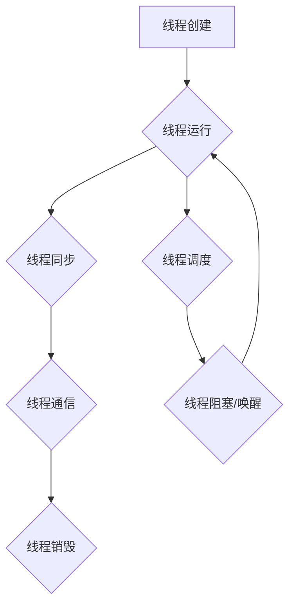

                 

关键词：线程管理、高吞吐量、系统设计、性能优化、并发编程

> 摘要：本文将深入探讨线程管理在高吞吐量系统设计中的关键作用。通过分析核心概念、算法原理、数学模型、项目实践等方面，我们将了解如何有效地利用线程管理技术，实现系统的高性能和高可用性。

## 1. 背景介绍

在现代计算机系统中，线程管理已经成为提高系统性能和吞吐量的关键技术。随着多核处理器的普及和并行计算需求的增长，如何有效地管理线程，实现系统的并行处理和负载均衡，成为了一个亟待解决的重要问题。

高吞吐量系统设计的目标是最大化系统处理能力，满足大规模数据和高并发请求的需求。在这样的系统中，线程管理不仅关系到系统的性能，还直接影响到系统的稳定性和可维护性。因此，深入理解线程管理的基本原理和高级技巧，对于系统架构师和开发者来说至关重要。

本文将从以下几个方面展开讨论：

- **核心概念与联系**：介绍线程管理的基本概念和原理，并使用 Mermaid 流程图展示线程管理的架构。
- **核心算法原理 & 具体操作步骤**：详细解析线程管理的算法原理和操作步骤，包括线程创建、同步、通信和销毁等。
- **数学模型和公式**：构建线程管理的数学模型，推导关键公式，并通过案例进行分析。
- **项目实践：代码实例和详细解释说明**：通过具体项目实例，展示线程管理的实际应用，并进行代码解读和分析。
- **实际应用场景**：探讨线程管理在不同领域的应用场景，如网络应用、大数据处理和实时系统等。
- **未来应用展望**：展望线程管理技术的发展趋势，以及未来可能面临的挑战。

接下来，我们将首先介绍线程管理的基本概念和原理，帮助读者建立初步的认识。

## 2. 核心概念与联系

在深入探讨线程管理之前，我们需要了解一些基本概念和原理。线程（Thread）是操作系统能够进行运算调度的最小单位，是程序执行流的最小序列。它是进程（Process）中的一个实体，是被操作系统独立管理的单元。

线程管理主要包括以下几个方面：

- **线程创建**：操作系统根据程序的需求创建线程，每个线程都有独立的栈空间、程序计数器和寄存器。
- **线程同步**：多个线程在访问共享资源时，为了避免冲突和数据不一致，需要使用同步机制，如互斥锁（Mutex）、信号量（Semaphore）和条件变量（Condition Variable）等。
- **线程通信**：线程之间需要相互通信以交换数据和协调工作，可以使用消息队列、共享内存和信号等机制。
- **线程销毁**：当线程完成任务或不再需要时，操作系统会回收线程资源，释放内存和其他资源。

以下是一个简化的 Mermaid 流程图，展示了线程管理的核心组件和交互流程：



在接下来的章节中，我们将详细解析线程管理的各个核心算法原理和操作步骤。

### 3. 核心算法原理 & 具体操作步骤

#### 3.1 算法原理概述

线程管理的核心算法包括线程创建、同步、通信和销毁。这些算法的实现涉及到操作系统内核和应用程序的紧密合作。以下是每个算法的基本原理：

- **线程创建**：操作系统通过系统调用创建线程，为线程分配资源，包括栈空间、程序计数器和寄存器等。创建线程的过程可以分为内核线程和用户线程两种模式。
- **线程同步**：为了避免多个线程在访问共享资源时出现数据竞争和死锁，需要使用同步机制。互斥锁（Mutex）用于保护临界区，确保同一时刻只有一个线程能够访问；信号量（Semaphore）用于控制对资源的访问权限；条件变量（Condition Variable）用于线程间的同步和等待特定条件。
- **线程通信**：线程之间需要交换数据和协调工作，可以使用消息队列、共享内存和信号等机制。消息队列用于线程间的消息传递，共享内存用于线程间的数据共享，信号用于线程间的通知。
- **线程销毁**：当线程完成任务或不再需要时，操作系统会回收线程资源，释放内存和其他资源。线程销毁的过程可以分为正常终止和异常终止两种情况。

#### 3.2 算法步骤详解

下面是线程管理算法的具体操作步骤：

##### 3.2.1 线程创建

1. **申请资源**：操作系统为线程分配必要的资源，包括栈空间、程序计数器和寄存器等。
2. **初始化线程属性**：设置线程的优先级、栈大小、线程名称等属性。
3. **创建线程**：通过系统调用创建线程，并将线程加入线程队列。

##### 3.2.2 线程同步

1. **创建互斥锁**：初始化互斥锁，确保线程在访问共享资源时不会发生冲突。
2. **加锁/解锁**：线程在进入临界区前加锁，在离开临界区后解锁，确保同一时刻只有一个线程能够访问。
3. **创建信号量**：初始化信号量，用于控制对共享资源的访问权限。
4. **P/V操作**：线程在等待条件满足时执行P操作（信号量减一），在条件满足时执行V操作（信号量加一）。

##### 3.2.3 线程通信

1. **创建消息队列**：初始化消息队列，用于线程间的消息传递。
2. **发送/接收消息**：线程通过发送和接收消息进行数据交换。
3. **创建共享内存**：初始化共享内存区域，用于线程间的数据共享。
4. **读写共享内存**：线程通过读写共享内存进行数据交换。

##### 3.2.4 线程销毁

1. **正常终止**：线程完成任务后，通过系统调用释放资源，退出线程。
2. **异常终止**：线程在遇到错误或异常时，通过系统调用强制终止，释放资源。

#### 3.3 算法优缺点

线程管理的算法各有优缺点：

- **线程创建**：内核线程创建较为复杂，需要操作系统介入，但性能较高；用户线程创建简单，但性能较低，依赖于操作系统。
- **线程同步**：互斥锁保护临界区，但可能导致线程饥饿；信号量控制访问权限，但可能导致死锁。
- **线程通信**：消息队列和共享内存效率较高，但需要额外的同步机制；信号传递简单，但仅适用于通知。
- **线程销毁**：正常终止释放资源，但可能需要较长时间；异常终止快速释放资源，但可能导致数据不一致。

#### 3.4 算法应用领域

线程管理算法广泛应用于各种领域，如：

- **网络应用**：服务器程序通过线程管理处理大量并发请求。
- **大数据处理**：分布式系统通过线程管理实现并行计算和数据处理。
- **实时系统**：嵌入式系统和实时操作系统通过线程管理实现实时响应和处理。

### 4. 数学模型和公式

线程管理中的数学模型主要用于描述线程的行为和性能。以下是一些关键模型和公式：

#### 4.1 数学模型构建

线程模型可以基于以下基本假设：

- 线程数目固定。
- 线程执行时间服从泊松分布。
- 线程间的负载均衡。

基于这些假设，可以构建以下数学模型：

- **线程到达率（λ）**：单位时间内到达线程的平均数目。
- **线程服务时间（μ）**：线程处理请求的平均时间。
- **线程利用率（ρ）**：线程繁忙程度，ρ = λ / μ。
- **系统吞吐量（θ）**：单位时间内处理的请求数目，θ = 1 / ω，其中ω为系统的平均等待时间。

#### 4.2 公式推导过程

根据上述假设，可以推导以下公式：

- **线程利用率**：ρ = λ / μ。
- **系统吞吐量**：θ = 1 / ω，其中ω = λ / (μ(1 - ρ))。
- **线程等待时间**：ω = λ / (μ(1 - ρ))。

#### 4.3 案例分析与讲解

假设一个系统有100个线程，线程到达率λ为10个/秒，线程服务时间μ为1秒/个。计算系统的吞吐量和线程等待时间。

根据公式，系统吞吐量θ = 1 / ω = 1 / (10 / (1 * (1 - 0.1))) = 10个/秒。

线程等待时间ω = λ / (μ(1 - ρ)) = 10 / (1 * (1 - 0.1)) = 1秒。

这个结果表明，系统每秒可以处理10个请求，线程的平均等待时间为1秒。

### 5. 项目实践：代码实例和详细解释说明

为了更好地理解线程管理在实际项目中的应用，我们以下将通过一个简单的例子来展示如何使用线程管理技术来实现一个多线程的并发计算任务。

#### 5.1 开发环境搭建

在本例中，我们将使用Python作为编程语言，借助Python的标准库 threading 模块来实现多线程功能。以下是开发环境的搭建步骤：

1. **安装Python**：确保Python已安装在系统上，版本不低于3.6。
2. **创建虚拟环境**：使用 virtualenv 工具创建一个独立的虚拟环境，以便隔离项目依赖。
   ```bash
   virtualenv venv
   source venv/bin/activate
   ```
3. **安装依赖**：在虚拟环境中安装必要的依赖库。
   ```bash
   pip install numpy
   ```

#### 5.2 源代码详细实现

以下是一个简单的多线程计算任务，用于计算一个给定范围的数列和。代码中使用了 threading 模块创建多个线程，分别计算不同的子数列和。

```python
import threading
import numpy as np

# 线程任务函数
def calculate_partial_sum(start, end, result):
    partial_sum = sum(np.arange(start, end+1))
    result.append(partial_sum)

# 主函数
def main():
    num_threads = 4
    num_elements = 100
    step = num_elements // num_threads

    # 初始化结果列表
    results = [0] * num_threads

    # 创建线程
    threads = []
    for i in range(num_threads):
        start = i * step
        end = (i + 1) * step if i < num_threads - 1 else num_elements
        thread = threading.Thread(target=calculate_partial_sum, args=(start, end, results))
        threads.append(thread)
        thread.start()

    # 等待所有线程完成
    for thread in threads:
        thread.join()

    # 计算最终结果
    total_sum = sum(results)
    print("Total sum:", total_sum)

# 运行主函数
if __name__ == "__main__":
    main()
```

#### 5.3 代码解读与分析

1. **线程任务函数** `calculate_partial_sum`：
   - `start` 和 `end` 参数定义了子数列的范围。
   - `result` 参数是用于存储子数列和的结果列表。

2. **主函数** `main`：
   - `num_threads` 定义了线程的数量。
   - `num_elements` 定义了数列的总元素数。
   - `step` 计算了每个线程处理的元素数量。

3. **初始化结果列表** `results`：
   - `results` 列表用于存储每个线程计算出的子数列和。

4. **创建线程**：
   - 通过循环创建多个线程，每个线程负责计算一部分数列的和。
   - `threading.Thread` 创建线程对象，`target` 参数指定线程执行的函数，`args` 参数传递函数的参数。

5. **启动线程**：
   - `thread.start()` 启动线程，线程开始执行任务。

6. **等待线程完成**：
   - `thread.join()` 等待线程执行完毕，保证主函数在所有线程完成计算后再执行。

7. **计算最终结果**：
   - 使用 `sum(results)` 计算所有子数列和的总和。

通过这个例子，我们可以看到如何使用线程管理技术来提高程序的执行效率。在实际项目中，可以根据具体需求调整线程数量和任务分配，以达到最佳的并发性能。

### 6. 实际应用场景

线程管理技术在各种实际应用场景中发挥着关键作用，以下是一些常见的应用领域：

#### 6.1 网络应用

在网络应用中，线程管理用于处理大量的并发请求。例如，Web服务器可以使用线程池管理器来维护一个固定大小的线程池，根据请求的负载动态分配线程。这样可以有效地利用系统资源，提高响应速度和处理能力。

#### 6.2 大数据处理

在大数据处理领域，线程管理是实现并行计算的关键技术。Hadoop 和 Spark 等分布式计算框架通过多线程和任务并行执行，实现大规模数据的快速处理。线程管理在这些框架中用于分配任务、调度资源和协调多个节点的计算。

#### 6.3 实时系统

实时系统要求系统能够在严格的时间内响应和处理事件。线程管理技术帮助实现任务的实时调度和资源分配，确保系统能够在规定的时间内完成处理。例如，嵌入式系统中的实时操作系统（RTOS）使用线程管理来确保任务的按时完成。

#### 6.4 多媒体应用

在多媒体应用中，线程管理用于处理音频、视频和图像等多媒体数据的实时解码和编码。通过多线程处理，可以同时进行多个数据流的处理，提高播放质量和用户体验。

#### 6.5 游戏开发

游戏开发中，线程管理用于实现游戏引擎的并行处理和渲染。游戏引擎可以同时处理游戏逻辑、物理计算、渲染和用户输入，确保游戏流畅运行并响应用户操作。

### 7. 工具和资源推荐

为了更好地学习和实践线程管理技术，以下是推荐的工具和资源：

#### 7.1 学习资源推荐

1. **《Python并发编程实战》**：一本深入浅出的Python并发编程指南，适合初学者。
2. **《并发编程的艺术》**：详细介绍了并发编程的基础知识和高级技巧。
3. **《操作系统概念》**：涵盖线程管理的操作系统理论，适合进阶学习。

#### 7.2 开发工具推荐

1. **PyCharm**：一款功能强大的Python集成开发环境，支持多线程调试和性能分析。
2. **Visual Studio**：适用于多种编程语言的集成开发环境，提供了丰富的并发编程工具。

#### 7.3 相关论文推荐

1. **"The Art of Multiprocessor Programming"**：详细介绍了多线程编程的理论和实践。
2. **"Concurrency: State Models and Compositional Algorithms"**：讨论了并发编程的模型和算法。
3. **"Parallel Programming: Techniques and Principles"**：探讨了并行编程的技术和原理。

### 8. 总结：未来发展趋势与挑战

线程管理技术在未来的发展中将继续发挥重要作用。随着多核处理器的普及和云计算的兴起，线程管理面临以下发展趋势和挑战：

#### 8.1 研究成果总结

- **多线程优化**：研究人员致力于优化线程调度和资源分配算法，提高系统性能。
- **并行编程模型**：开发新的并行编程模型和工具，简化多线程编程的复杂性。
- **异构计算**：探索多核处理器和GPU等异构计算设备的并发处理能力。

#### 8.2 未来发展趋势

- **智能线程管理**：利用人工智能技术，实现自适应的线程调度和资源分配策略。
- **云原生线程管理**：云计算环境下的线程管理将更加注重弹性扩展和资源优化。
- **实时线程管理**：实时系统中的线程管理将更加关注低延迟和高可靠性的需求。

#### 8.3 面临的挑战

- **并发控制复杂性**：随着线程数量的增加，并发控制算法的复杂性也随之上升。
- **资源竞争和死锁**：多线程程序中容易出现的资源竞争和死锁问题，需要有效的预防和解决策略。
- **性能优化**：如何在各种硬件平台上实现高效的线程管理，是未来的一大挑战。

#### 8.4 研究展望

- **分布式线程管理**：探索分布式系统中的线程管理，实现跨节点的高效并发处理。
- **安全性**：加强线程管理的安全性，防止恶意代码和攻击。
- **可观测性和可维护性**：提高线程管理的可观测性和可维护性，帮助开发者理解和调试多线程程序。

### 9. 附录：常见问题与解答

以下是一些关于线程管理常见问题的解答：

**Q：什么是线程同步？如何实现？**
- **定义**：线程同步是确保多个线程在访问共享资源时不会发生冲突和数据不一致的技术。
- **实现**：可以使用互斥锁（Mutex）、信号量（Semaphore）和条件变量（Condition Variable）等同步机制。

**Q：什么是线程通信？如何实现？**
- **定义**：线程通信是线程之间交换数据和协调工作的机制。
- **实现**：可以使用消息队列（Message Queue）、共享内存（Shared Memory）和信号（Signal）等通信机制。

**Q：线程和进程有什么区别？**
- **区别**：线程是进程中的执行单元，共享进程的资源；进程是操作系统管理的最小单位，拥有独立的地址空间和资源。

**Q：什么是线程池？如何使用？**
- **定义**：线程池是预先创建并维护的一组线程，用于执行任务。
- **使用**：可以使用线程池来减少线程创建和销毁的开销，提高程序性能。

通过本文的介绍，我们深入探讨了线程管理在高吞吐量系统设计中的关键作用。从核心概念到具体算法，再到实际项目应用，我们系统地分析了线程管理的技术和方法。展望未来，随着多核处理器和并行计算需求的增长，线程管理技术将继续发展和创新。希望通过本文，读者能够更好地理解和应用线程管理技术，为构建高效、稳定、可扩展的系统奠定基础。

---

**作者：禅与计算机程序设计艺术 / Zen and the Art of Computer Programming**

