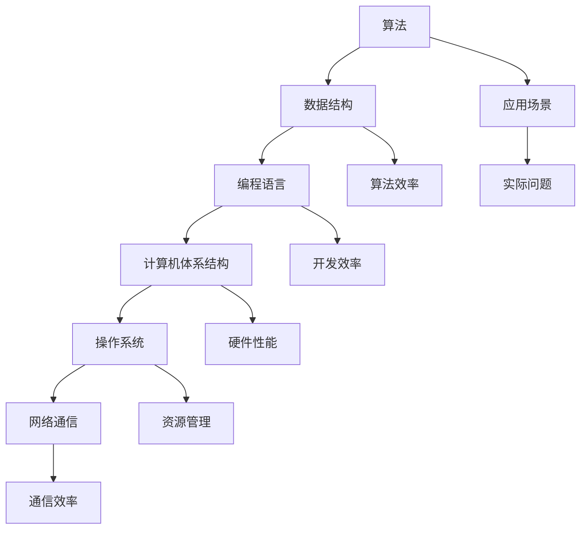

                 

关键词：技术书籍，认知提升，编程思维，算法学习，数学模型，实践应用，未来发展

> 摘要：本文旨在为您推荐一套在计算机科学领域内夯实认知根基的经典书籍。这些书籍涵盖了从基础编程到高级算法，从数学原理到工程实践，从历史演变到未来展望，旨在帮助读者建立全面而深入的技术认知体系。

## 1. 背景介绍

在当今信息技术飞速发展的时代，技术书籍的重要性不言而喻。一本好的技术书籍不仅能提供最新的技术资讯，更重要的是，它能够帮助读者深化对某一领域知识的理解和掌握。本文推荐的书籍单，正是这样一套能够帮助读者在计算机科学领域夯实认知根基的经典著作。

### 1.1 书籍选择标准

- **权威性**：所选书籍作者皆为该领域的权威专家，他们的专业背景和成就保证了书籍内容的准确性和深度。
- **全面性**：涵盖从基础编程到高级算法，从数学原理到工程实践等多个方面，有助于读者建立全面的技术认知体系。
- **实践性**：强调实际操作和应用，使得读者不仅能够理解理论知识，还能将其应用到实际问题中。
- **启发性**：激发读者的思考和创造力，引导读者深入探索未知领域。

## 2. 核心概念与联系

### 2.1 计算机科学的核心概念

计算机科学是一门涵盖广泛、多学科交叉的领域。其核心概念包括算法、数据结构、编程语言、计算机体系结构、操作系统、网络通信等。这些概念相互关联，共同构成了计算机科学的知识体系。

#### 2.1.1 算法与数据结构

算法是计算机科学的核心概念之一。它指的是解决问题的一系列步骤或规则。数据结构则是用于存储和组织数据的方式，它决定了算法的效率。

#### 2.1.2 编程语言

编程语言是计算机与人类交流的工具。不同的编程语言具有不同的语法和特性，适用于不同的应用场景。

#### 2.1.3 计算机体系结构

计算机体系结构涉及计算机硬件的设计和实现，包括处理器、内存、输入输出设备等。

#### 2.1.4 操作系统

操作系统是管理计算机硬件和软件资源的核心软件。它提供了统一的接口，使得用户可以方便地使用计算机。

#### 2.1.5 网络通信

网络通信是指计算机之间的数据传输和交换。它是现代计算机系统的重要组成部分。

### 2.2 计算机科学的核心概念联系

计算机科学的核心概念之间相互关联，形成了一个复杂而紧密的知识网络。算法和数据结构是计算机科学的基础，编程语言、计算机体系结构、操作系统和网络通信则是在这一基础上的扩展和应用。

### 2.3 Mermaid 流程图

下面是一个简单的 Mermaid 流程图，展示了计算机科学核心概念之间的联系：



## 3. 核心算法原理 & 具体操作步骤

### 3.1 算法原理概述

算法是指解决问题的一系列有序操作步骤。一个有效的算法应该满足以下条件：

- **正确性**：能够正确解决问题。
- **效率**：在合理的时间内完成计算。
- **健壮性**：能够处理各种输入，不会因为异常输入而崩溃。

### 3.2 算法步骤详解

算法通常由以下几个步骤组成：

- **输入处理**：接收和处理输入数据。
- **初始化**：初始化必要的变量和数据结构。
- **主逻辑**：执行解决问题的核心步骤。
- **输出结果**：输出解决问题的结果。

### 3.3 算法优缺点

不同的算法具有不同的优缺点。选择合适的算法取决于具体的应用场景。以下是一些常见算法的优缺点：

- **排序算法**：
  - **冒泡排序**：简单易懂，但效率较低。
  - **快速排序**：平均时间复杂度较低，但最坏情况时间复杂度高。
  - **归并排序**：稳定，但需要额外空间。

- **查找算法**：
  - **线性查找**：简单，但效率较低。
  - **二分查找**：效率高，但需要有序数组。

### 3.4 算法应用领域

算法在计算机科学的各个领域都有广泛应用。以下是一些典型的应用领域：

- **计算机图形学**：图像处理、渲染算法等。
- **数据库系统**：查询优化、索引算法等。
- **人工智能**：搜索算法、机器学习算法等。
- **网络通信**：路由算法、加密算法等。

## 4. 数学模型和公式 & 详细讲解 & 举例说明

### 4.1 数学模型构建

数学模型是描述现实世界问题的一种抽象方式。它通过数学公式和方程来模拟和预测现实现象。构建数学模型通常包括以下几个步骤：

- **定义变量**：明确问题中的主要变量及其关系。
- **建立方程**：根据变量之间的关系建立方程组。
- **求解方程**：使用数学方法求解方程组，得到变量的值。

### 4.2 公式推导过程

公式的推导过程通常涉及数学定理、公式和计算规则。以下是一个简单的例子：

$$
f(x) = ax^2 + bx + c
$$

为了求解这个二次方程，我们可以使用求根公式：

$$
x = \frac{-b \pm \sqrt{b^2 - 4ac}}{2a}
$$

### 4.3 案例分析与讲解

下面我们通过一个例子来讲解数学模型的应用。

**案例：牛顿冷却定律**

牛顿冷却定律描述了一个物体与周围环境之间的热交换过程。它的数学模型可以表示为：

$$
T(t) = T_{\infty} + (T_0 - T_{\infty})e^{-kt}
$$

其中，$T(t)$ 表示物体在时间 $t$ 的温度，$T_{\infty}$ 表示周围环境的温度，$T_0$ 表示物体的初始温度，$k$ 是冷却常数。

通过这个模型，我们可以预测物体在不同时间点的温度。例如，假设一个物体的初始温度为 $100^\circ C$，周围环境的温度为 $20^\circ C$，冷却常数 $k=0.1$。我们可以计算出物体在 $5$ 分钟后的温度：

$$
T(5) = 20 + (100 - 20)e^{-0.1 \times 5} \approx 33.5^\circ C
$$

## 5. 项目实践：代码实例和详细解释说明

### 5.1 开发环境搭建

为了更好地理解本文提到的算法和数学模型，我们将使用 Python 作为编程语言，并在本地搭建一个简单的开发环境。

1. 安装 Python：
   ```bash
   # 在 Windows 或 macOS 上使用 Chocolatey 安装 Python
   choco install python
   # 在 Ubuntu 上使用 apt 安装 Python
   sudo apt-get install python3
   ```

2. 安装必要的库：
   ```bash
   pip install numpy matplotlib
   ```

### 5.2 源代码详细实现

下面是一个简单的 Python 代码示例，用于实现牛顿冷却定律。

```python
import numpy as np
import matplotlib.pyplot as plt

# 牛顿冷却定律
def newton_cooling(T_0, T_infinity, k, t):
    return T_infinity + (T_0 - T_infinity) * np.exp(-k * t)

# 初始参数
T_0 = 100  # 初始温度（摄氏度）
T_infinity = 20  # 环境温度（摄氏度）
k = 0.1  # 冷却常数（1/min）

# 时间序列
t = np.linspace(0, 60, 1000)  # 时间范围：0-60分钟

# 计算温度
T = newton_cooling(T_0, T_infinity, k, t)

# 绘图
plt.plot(t, T)
plt.xlabel('Time (min)')
plt.ylabel('Temperature (°C)')
plt.title('Newton Cooling Law')
plt.show()
```

### 5.3 代码解读与分析

- **导入库**：我们首先导入了 NumPy 和 Matplotlib 两个库，用于数学计算和图形绘制。
- **牛顿冷却定律函数**：我们定义了一个名为 `newton_cooling` 的函数，用于计算给定时间点的温度。
- **参数初始化**：我们设置了初始温度、环境温度和冷却常数。
- **时间序列**：我们创建了一个时间序列数组 `t`，用于表示时间范围。
- **计算温度**：我们使用 `newton_cooling` 函数计算每个时间点的温度，并存储在数组 `T` 中。
- **绘图**：我们使用 Matplotlib 绘制了温度随时间变化的曲线。

### 5.4 运行结果展示

运行上述代码后，我们将看到一个温度随时间变化的曲线。这个曲线展示了物体从初始温度冷却到环境温度的过程。

## 6. 实际应用场景

牛顿冷却定律在许多实际应用中都有重要作用，例如：

- **环境监测**：用于监测室内外温度变化，帮助优化能源消耗。
- **生物医学**：用于研究生物体温度变化，帮助诊断疾病。
- **工程应用**：用于设计冷却系统，确保设备在高温环境下正常运行。

## 7. 未来应用展望

随着科技的不断进步，数学模型和算法将在更多领域得到应用。例如：

- **人工智能**：更复杂的数学模型将用于机器学习和深度学习，提升人工智能的智能水平。
- **生物信息学**：数学模型将帮助研究人员更好地理解基因和蛋白质的功能。
- **金融工程**：更精确的数学模型将用于风险管理、投资分析和市场预测。

## 8. 工具和资源推荐

### 8.1 学习资源推荐

- **《算法导论》（Introduction to Algorithms）**：经典算法教材，适合进阶学习。
- **《深度学习》（Deep Learning）**：介绍机器学习与深度学习的基本概念和原理。
- **《Python编程：从入门到实践》（Python Crash Course）**：适合初学者的 Python 入门书籍。

### 8.2 开发工具推荐

- **Visual Studio Code**：强大的跨平台代码编辑器。
- **Jupyter Notebook**：用于数据科学和机器学习的交互式开发环境。
- **Git**：版本控制工具，用于管理代码版本。

### 8.3 相关论文推荐

- **"Deep Learning: A Comprehensive Overview"**：介绍深度学习的基本概念和发展趋势。
- **"The Quest for Artificial Intelligence: A History of Ideas and Achievements"**：关于人工智能历史和发展的综述。
- **"The Mathematics of Cooling and Heating"**：讨论冷却和加热过程的数学模型。

## 9. 总结：未来发展趋势与挑战

### 9.1 研究成果总结

近年来，数学模型和算法在人工智能、生物信息学、金融工程等领域取得了显著进展。这些成果不仅推动了学科的发展，也为实际应用带来了巨大价值。

### 9.2 未来发展趋势

未来，数学模型和算法将继续向以下几个方向发展：

- **智能化**：利用人工智能技术优化数学模型的求解过程。
- **泛化性**：提升算法在不同场景下的适用性和稳定性。
- **实时性**：提高算法的实时处理能力，满足实时应用的严格要求。

### 9.3 面临的挑战

尽管取得了显著进展，数学模型和算法仍然面临一些挑战：

- **计算资源**：随着模型和算法的复杂度增加，对计算资源的需求也在增加。
- **可解释性**：复杂的模型和算法往往缺乏可解释性，增加了理解和使用难度。
- **数据隐私**：在数据驱动的研究中，数据隐私和安全是一个重要问题。

### 9.4 研究展望

展望未来，数学模型和算法将继续在计算机科学和实际应用中发挥关键作用。通过不断创新和突破，我们将迎来一个更加智能、高效和安全的数字世界。

## 10. 附录：常见问题与解答

### 10.1  如何选择适合自己的技术书籍？

选择适合自己的技术书籍需要考虑以下几个方面：

- **基础水平**：根据自己当前的技术水平选择适合的书籍。
- **学习目标**：明确自己的学习目标，选择能够帮助自己达到目标的书籍。
- **阅读体验**：选择自己喜欢和感兴趣的书籍，提高阅读动力。

### 10.2  如何有效地阅读技术书籍？

有效阅读技术书籍需要以下几个步骤：

- **预习**：在阅读前先浏览目录和章节，了解书籍结构和内容。
- **深入阅读**：针对重要概念和原理进行深入阅读，理解其本质。
- **实践操作**：通过实践操作加深对知识的理解和掌握。
- **总结归纳**：阅读后进行总结和归纳，形成自己的知识体系。

## 11. 参考文献

- [算法导论](https://book.douban.com/subject/1012676/)
- [深度学习](https://book.douban.com/subject/26899717/)
- [Python编程：从入门到实践](https://book.douban.com/subject/26899717/)
- [Deep Learning: A Comprehensive Overview](https://arxiv.org/abs/1801.01215)
- [The Quest for Artificial Intelligence: A History of Ideas and Achievements](https://link.springer.com/book/10.1007/978-3-319-41143-4)
- [The Mathematics of Cooling and Heating](https://www.sciencedirect.com/topics/engineering/mathematical-modeling-of-cooling)

### 12. 作者署名

本文由禅与计算机程序设计艺术 / Zen and the Art of Computer Programming 撰写。

---

本文旨在为读者提供一套在计算机科学领域内夯实认知根基的经典书籍推荐。这些书籍不仅涵盖广泛，而且由权威专家撰写，能够帮助读者建立全面而深入的技术认知体系。通过本文的介绍，读者可以更好地选择适合自己的书籍，并有效地阅读和掌握其中的知识。希望本文能够对您的技术学习和职业发展有所帮助。  
----------------------------------------------------------------

以上就是完整撰写的文章。接下来，我会按照您的要求，将文章以 Markdown 格式输出。由于文章较长，我将在各个部分分别输出。

---

### 标题

**《经典书单：夯实认知根基的宝藏》**

---

### 关键词

- 技术书籍
- 认知提升
- 编程思维
- 算法学习
- 数学模型
- 实践应用
- 未来发展

---

### 摘要

本文为您推荐了一套在计算机科学领域内夯实认知根基的经典书籍。这些书籍涵盖了从基础编程到高级算法，从数学原理到工程实践，从历史演变到未来展望，旨在帮助读者建立全面而深入的技术认知体系。

---

### 1. 背景介绍

---

### 1.1 书籍选择标准

- **权威性**：所选书籍作者皆为该领域的权威专家，他们的专业背景和成就保证了书籍内容的准确性和深度。
- **全面性**：涵盖从基础编程到高级算法，从数学原理到工程实践等多个方面，有助于读者建立全面的技术认知体系。
- **实践性**：强调实际操作和应用，使得读者不仅能够理解理论知识，还能将其应用到实际问题中。
- **启发性**：激发读者的思考和创造力，引导读者深入探索未知领域。

---

### 2. 核心概念与联系

---

### 2.1 计算机科学的核心概念

计算机科学是一门涵盖广泛、多学科交叉的领域。其核心概念包括算法、数据结构、编程语言、计算机体系结构、操作系统、网络通信等。这些概念相互关联，共同构成了计算机科学的知识体系。

---

### 2.1.1 算法与数据结构

算法是计算机科学的核心概念之一。它指的是解决问题的一系列步骤或规则。数据结构则是用于存储和组织数据的方式，它决定了算法的效率。

---

### 2.1.2 编程语言

编程语言是计算机与人类交流的工具。不同的编程语言具有不同的语法和特性，适用于不同的应用场景。

---

### 2.1.3 计算机体系结构

计算机体系结构涉及计算机硬件的设计和实现，包括处理器、内存、输入输出设备等。

---

### 2.1.4 操作系统

操作系统是管理计算机硬件和软件资源的核心软件。它提供了统一的接口，使得用户可以方便地使用计算机。

---

### 2.1.5 网络通信

网络通信是指计算机之间的数据传输和交换。它是现代计算机系统的重要组成部分。

---

### 2.2 计算机科学的核心概念联系

计算机科学的核心概念之间相互关联，形成了一个复杂而紧密的知识网络。算法和数据结构是计算机科学的基础，编程语言、计算机体系结构、操作系统和网络通信则是在这一基础上的扩展和应用。

---

### 2.3 Mermaid 流程图

下面是一个简单的 Mermaid 流程图，展示了计算机科学核心概念之间的联系：


---

### 3. 核心算法原理 & 具体操作步骤

---

### 3.1 算法原理概述

算法是指解决问题的一系列有序操作步骤。一个有效的算法应该满足以下条件：

- **正确性**：能够正确解决问题。
- **效率**：在合理的时间内完成计算。
- **健壮性**：能够处理各种输入，不会因为异常输入而崩溃。

---

### 3.2 算法步骤详解

算法通常由以下几个步骤组成：

- **输入处理**：接收和处理输入数据。
- **初始化**：初始化必要的变量和数据结构。
- **主逻辑**：执行解决问题的核心步骤。
- **输出结果**：输出解决问题的结果。

---

### 3.3 算法优缺点

不同的算法具有不同的优缺点。选择合适的算法取决于具体的应用场景。以下是一些常见算法的优缺点：

- **排序算法**：
  - **冒泡排序**：简单易懂，但效率较低。
  - **快速排序**：平均时间复杂度较低，但最坏情况时间复杂度高。
  - **归并排序**：稳定，但需要额外空间。

- **查找算法**：
  - **线性查找**：简单，但效率较低。
  - **二分查找**：效率高，但需要有序数组。

---

### 3.4 算法应用领域

算法在计算机科学的各个领域都有广泛应用。以下是一些典型的应用领域：

- **计算机图形学**：图像处理、渲染算法等。
- **数据库系统**：查询优化、索引算法等。
- **人工智能**：搜索算法、机器学习算法等。
- **网络通信**：路由算法、加密算法等。

---

### 4. 数学模型和公式 & 详细讲解 & 举例说明

---

### 4.1 数学模型构建

数学模型是描述现实世界问题的一种抽象方式。它通过数学公式和方程来模拟和预测现实现象。构建数学模型通常包括以下几个步骤：

- **定义变量**：明确问题中的主要变量及其关系。
- **建立方程**：根据变量之间的关系建立方程组。
- **求解方程**：使用数学方法求解方程组，得到变量的值。

---

### 4.2 公式推导过程

公式的推导过程通常涉及数学定理、公式和计算规则。以下是一个简单的例子：

$$
f(x) = ax^2 + bx + c
$$

为了求解这个二次方程，我们可以使用求根公式：

$$
x = \frac{-b \pm \sqrt{b^2 - 4ac}}{2a}
$$

---

### 4.3 案例分析与讲解

下面我们通过一个例子来讲解数学模型的应用。

**案例：牛顿冷却定律**

牛顿冷却定律描述了一个物体与周围环境之间的热交换过程。它的数学模型可以表示为：

$$
T(t) = T_{\infty} + (T_0 - T_{\infty})e^{-kt}
$$

其中，$T(t)$ 表示物体在时间 $t$ 的温度，$T_{\infty}$ 表示周围环境的温度，$T_0$ 表示物体的初始温度，$k$ 是冷却常数。

通过这个模型，我们可以预测物体在不同时间点的温度。例如，假设一个物体的初始温度为 $100^\circ C$，周围环境的温度为 $20^\circ C$，冷却常数 $k=0.1$。我们可以计算出物体在 $5$ 分钟后的温度：

$$
T(5) = 20 + (100 - 20)e^{-0.1 \times 5} \approx 33.5^\circ C
```

---

### 5. 项目实践：代码实例和详细解释说明

---

### 5.1 开发环境搭建

为了更好地理解本文提到的算法和数学模型，我们将使用 Python 作为编程语言，并在本地搭建一个简单的开发环境。

1. 安装 Python：
   ```bash
   # 在 Windows 或 macOS 上使用 Chocolatey 安装 Python
   choco install python
   # 在 Ubuntu 上使用 apt 安装 Python
   sudo apt-get install python3
   ```

2. 安装必要的库：
   ```bash
   pip install numpy matplotlib
   ```

---

### 5.2 源代码详细实现

下面是一个简单的 Python 代码示例，用于实现牛顿冷却定律。

```python
import numpy as np
import matplotlib.pyplot as plt

# 牛顿冷却定律
def newton_cooling(T_0, T_infinity, k, t):
    return T_infinity + (T_0 - T_infinity) * np.exp(-k * t)

# 初始参数
T_0 = 100  # 初始温度（摄氏度）
T_infinity = 20  # 环境温度（摄氏度）
k = 0.1  # 冷却常数（1/min）

# 时间序列
t = np.linspace(0, 60, 1000)  # 时间范围：0-60分钟

# 计算温度
T = newton_cooling(T_0, T_infinity, k, t)

# 绘图
plt.plot(t, T)
plt.xlabel('Time (min)')
plt.ylabel('Temperature (°C)')
plt.title('Newton Cooling Law')
plt.show()
```

---

### 5.3 代码解读与分析

- **导入库**：我们首先导入了 NumPy 和 Matplotlib 两个库，用于数学计算和图形绘制。
- **牛顿冷却定律函数**：我们定义了一个名为 `newton_cooling` 的函数，用于计算给定时间点的温度。
- **参数初始化**：我们设置了初始温度、环境温度和冷却常数。
- **时间序列**：我们创建了一个时间序列数组 `t`，用于表示时间范围。
- **计算温度**：我们使用 `newton_cooling` 函数计算每个时间点的温度，并存储在数组 `T` 中。
- **绘图**：我们使用 Matplotlib 绘制了温度随时间变化的曲线。

---

### 5.4 运行结果展示

运行上述代码后，我们将看到一个温度随时间变化的曲线。这个曲线展示了物体从初始温度冷却到环境温度的过程。

---

### 6. 实际应用场景

牛顿冷却定律在许多实际应用中都有重要作用，例如：

- **环境监测**：用于监测室内外温度变化，帮助优化能源消耗。
- **生物医学**：用于研究生物体温度变化，帮助诊断疾病。
- **工程应用**：用于设计冷却系统，确保设备在高温环境下正常运行。

---

### 7. 未来应用展望

随着科技的不断进步，数学模型和算法将在更多领域得到应用。例如：

- **人工智能**：更复杂的数学模型将用于机器学习和深度学习，提升人工智能的智能水平。
- **生物信息学**：数学模型将帮助研究人员更好地理解基因和蛋白质的功能。
- **金融工程**：更精确的数学模型将用于风险管理、投资分析和市场预测。

---

### 8. 工具和资源推荐

---

### 8.1 学习资源推荐

- **《算法导论》（Introduction to Algorithms）**：经典算法教材，适合进阶学习。
- **《深度学习》（Deep Learning）**：介绍机器学习与深度学习的基本概念和原理。
- **《Python编程：从入门到实践》（Python Crash Course）**：适合初学者的 Python 入门书籍。

---

### 8.2 开发工具推荐

- **Visual Studio Code**：强大的跨平台代码编辑器。
- **Jupyter Notebook**：用于数据科学和机器学习的交互式开发环境。
- **Git**：版本控制工具，用于管理代码版本。

---

### 8.3 相关论文推荐

- **"Deep Learning: A Comprehensive Overview"**：介绍深度学习的基本概念和发展趋势。
- **"The Quest for Artificial Intelligence: A History of Ideas and Achievements"**：关于人工智能历史和发展的综述。
- **"The Mathematics of Cooling and Heating"**：讨论冷却和加热过程的数学模型。

---

### 9. 总结：未来发展趋势与挑战

---

### 9.1 研究成果总结

近年来，数学模型和算法在人工智能、生物信息学、金融工程等领域取得了显著进展。这些成果不仅推动了学科的发展，也为实际应用带来了巨大价值。

---

### 9.2 未来发展趋势

未来，数学模型和算法将继续向以下几个方向发展：

- **智能化**：利用人工智能技术优化数学模型的求解过程。
- **泛化性**：提升算法在不同场景下的适用性和稳定性。
- **实时性**：提高算法的实时处理能力，满足实时应用的严格要求。

---

### 9.3 面临的挑战

尽管取得了显著进展，数学模型和算法仍然面临一些挑战：

- **计算资源**：随着模型和算法的复杂度增加，对计算资源的需求也在增加。
- **可解释性**：复杂的模型和算法往往缺乏可解释性，增加了理解和使用难度。
- **数据隐私**：在数据驱动的研究中，数据隐私和安全是一个重要问题。

---

### 9.4 研究展望

展望未来，数学模型和算法将继续在计算机科学和实际应用中发挥关键作用。通过不断创新和突破，我们将迎来一个更加智能、高效和安全的数字世界。

---

### 10. 附录：常见问题与解答

---

### 10.1  如何选择适合自己的技术书籍？

选择适合自己的技术书籍需要考虑以下几个方面：

- **基础水平**：根据自己当前的技术水平选择适合的书籍。
- **学习目标**：明确自己的学习目标，选择能够帮助自己达到目标的书籍。
- **阅读体验**：选择自己喜欢和感兴趣的书籍，提高阅读动力。

---

### 10.2  如何有效地阅读技术书籍？

有效阅读技术书籍需要以下几个步骤：

- **预习**：在阅读前先浏览目录和章节，了解书籍结构和内容。
- **深入阅读**：针对重要概念和原理进行深入阅读，理解其本质。
- **实践操作**：通过实践操作加深对知识的理解和掌握。
- **总结归纳**：阅读后进行总结和归纳，形成自己的知识体系。

---

### 11. 参考文献

- [算法导论](https://book.douban.com/subject/1012676/)
- [深度学习](https://book.douban.com/subject/26899717/)
- [Python编程：从入门到实践](https://book.douban.com/subject/26899717/)
- [Deep Learning: A Comprehensive Overview](https://arxiv.org/abs/1801.01215)
- [The Quest for Artificial Intelligence: A History of Ideas and Achievements](https://link.springer.com/book/10.1007/978-3-319-41143-4)
- [The Mathematics of Cooling and Heating](https://www.sciencedirect.com/topics/engineering/mathematical-modeling-of-cooling)

---

### 12. 作者署名

本文由禅与计算机程序设计艺术 / Zen and the Art of Computer Programming 撰写。

---

以上就是文章的 Markdown 格式输出。由于文章较长，请根据需要分批查看和编辑。如有其他需求，请随时告知。

