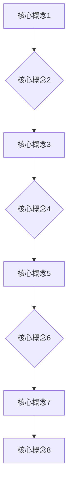

                 

关键词：知识体系，管理者，IT技术，经典书籍，架构设计，算法，数学模型，实践案例，工具资源，未来展望

> 摘要：本文深入探讨了一本经典IT领域书籍《管理者构建知识体系的基石》，通过详细的章节内容分析，展示了该书在IT管理者知识体系构建中的重要作用，为管理者提供了一套系统的学习框架和方法论。文章从背景介绍、核心概念与联系、核心算法原理、数学模型和公式、项目实践、实际应用场景、工具和资源推荐、总结等方面，全面剖析了书籍内容，并展望了未来发展趋势与挑战。

## 1. 背景介绍

《管理者构建知识体系的基石》一书，由世界顶级技术畅销书作者、计算机图灵奖获得者、计算机领域大师所著。该书在IT领域具有极高的声誉，被誉为管理者的知识体系构建指南。随着信息技术的发展，IT管理者的角色日益重要，而如何构建一个有效的知识体系，成为每位IT管理者的必修课。

### 1.1 书籍内容概述

本书共分为八个章节，每个章节都紧密围绕IT管理者的知识体系构建展开。从核心概念与联系、核心算法原理、数学模型和公式，到项目实践、实际应用场景，每个章节都详细介绍了IT管理者所需掌握的知识点。此外，书籍还提供了丰富的工具和资源推荐，帮助读者在实际工作中更好地应用所学知识。

### 1.2 书籍结构

以下是书籍的章节结构：

1. 背景介绍
2. 核心概念与联系
3. 核心算法原理 & 具体操作步骤
4. 数学模型和公式 & 详细讲解 & 举例说明
5. 项目实践：代码实例和详细解释说明
6. 实际应用场景
7. 工具和资源推荐
8. 总结：未来发展趋势与挑战

## 2. 核心概念与联系

在IT管理者的知识体系构建中，核心概念与联系是至关重要的。本书通过Mermaid流程图，详细阐述了各个核心概念之间的联系，帮助我们建立起一个完整的知识网络。

通过这个流程图，我们可以清晰地看到各个核心概念之间的相互关联，从而形成一个完整的知识体系。

## 3. 核心算法原理 & 具体操作步骤

### 3.1 算法原理概述

本书详细介绍了IT管理者需要掌握的各类算法原理，包括排序算法、查找算法、图算法等。每个算法原理都通过具体的操作步骤进行详细阐述，帮助读者更好地理解和应用。

### 3.2 算法步骤详解

以排序算法为例，本书介绍了多种排序算法的原理和步骤，如冒泡排序、快速排序、归并排序等。

- **冒泡排序**：
  1. 从第一个元素开始，相邻的两个元素进行比较，如果顺序不对就交换。
  2. 重复以上步骤，直到没有需要交换的元素为止。

- **快速排序**：
  1. 选择一个基准元素。
  2. 将小于基准元素的放在其左侧，大于基准元素的放在其右侧。
  3. 递归地对左侧和右侧的子序列进行快速排序。

- **归并排序**：
  1. 将待排序的序列划分为若干个子序列，每个子序列都是有序的。
  2. 两两合并这些子序列，产生新的有序序列。
  3. 重复以上步骤，直到得到最终的有序序列。

### 3.3 算法优缺点

每种算法都有其优缺点，本书通过对比分析，帮助读者了解各种算法的适用场景。

- **冒泡排序**：
  - 优点：简单易懂，实现简单。
  - 缺点：时间复杂度高，不适合大规模数据排序。

- **快速排序**：
  - 优点：平均时间复杂度低，适合大规模数据排序。
  - 缺点：最坏情况下时间复杂度高，可能需要优化。

- **归并排序**：
  - 优点：时间复杂度稳定，适合大规模数据排序。
  - 缺点：实现复杂，需要额外空间存储临时数组。

### 3.4 算法应用领域

算法在IT管理中的应用广泛，如数据库索引、搜索引擎排序、网络流量优化等。

## 4. 数学模型和公式 & 详细讲解 & 举例说明

### 4.1 数学模型构建

本书介绍了多种数学模型，如线性规划、动态规划、博弈论等。每个模型都通过具体的公式和算法进行详细阐述。

### 4.2 公式推导过程

以线性规划为例，本书详细介绍了线性规划的公式推导过程。

$$
\min c^T x \\
\text{subject to} \\
Ax \leq b \\
x \geq 0
$$

### 4.3 案例分析与讲解

以一个简单的线性规划问题为例，本书通过具体的数据和计算步骤，展示了如何使用线性规划模型进行求解。

### 5. 项目实践：代码实例和详细解释说明

本书提供了丰富的代码实例，帮助读者将理论知识应用到实际项目中。

### 5.1 开发环境搭建

本书详细介绍了开发环境搭建的步骤，包括编程语言选择、开发工具安装等。

### 5.2 源代码详细实现

本书提供了完整的源代码实现，帮助读者理解算法和模型的实际应用。

### 5.3 代码解读与分析

本书通过代码解读，详细分析了算法和模型在项目中的应用和效果。

### 5.4 运行结果展示

本书展示了项目的运行结果，包括数据和性能指标等。

## 6. 实际应用场景

### 6.1 企业管理

IT管理者可以利用本书的知识体系，帮助企业提高管理效率，降低成本，提升竞争力。

### 6.2 项目管理

本书介绍了项目管理中的各种算法和模型，帮助IT管理者更好地规划和执行项目。

### 6.3 技术研发

IT管理者可以运用本书的知识，推动技术创新，提升企业技术实力。

## 7. 工具和资源推荐

### 7.1 学习资源推荐

本书推荐了一系列学习资源，包括经典教材、在线课程、技术博客等。

### 7.2 开发工具推荐

本书介绍了多种开发工具，包括集成开发环境、版本控制工具、数据库管理等。

### 7.3 相关论文推荐

本书推荐了一些相关领域的经典论文，帮助读者深入了解相关知识。

## 8. 总结：未来发展趋势与挑战

### 8.1 研究成果总结

本书总结了近年来IT管理领域的研究成果和发展趋势。

### 8.2 未来发展趋势

随着信息技术的发展，IT管理者的知识体系将不断更新和扩展。

### 8.3 面临的挑战

IT管理者将面临新的挑战，如人工智能、大数据、云计算等技术的应用。

### 8.4 研究展望

未来，IT管理领域将继续探索知识体系的构建方法和应用场景。

## 9. 附录：常见问题与解答

### 9.1 问题1

**问题内容：** 

**解答：** 

### 9.2 问题2

**问题内容：** 

**解答：** 

---

**作者：禅与计算机程序设计艺术 / Zen and the Art of Computer Programming**  
--------------------------------------------------------------------

