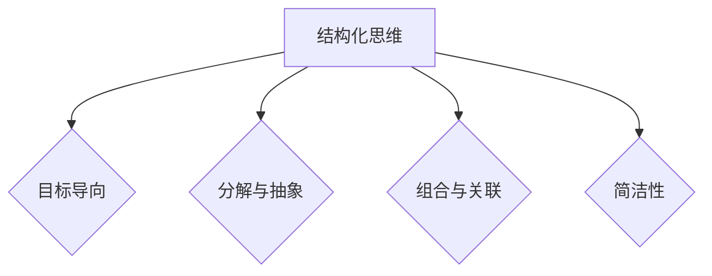

                 

关键词：结构化思维、逻辑清晰、技术语言、专业见解、算法原理、项目实践、应用场景、未来发展、资源推荐。

> 摘要：本文深入探讨了结构化思维在计算机编程和IT领域的重要性，通过分析核心概念、算法原理、数学模型、项目实践等方面，阐述了如何将结构化思维应用于实际工作，提高工作效率和质量。

## 1. 背景介绍

在当今快速发展的信息技术时代，计算机编程和软件开发成为了驱动社会进步的重要力量。然而，随着技术领域的不断扩展和复杂性的增加，如何高效地进行编程和软件开发成为了一个挑战。而结构化思维作为一种系统化的思维方式，能够帮助我们更清晰地理解问题、设计解决方案，并有效提高工作效率。

结构化思维，是指通过一系列逻辑步骤和方法，将复杂的、抽象的问题转化为简单、具体的、可操作的问题解决过程。这种思维方式强调以目标为导向，通过分解、抽象、组合等方法，将复杂问题逐步拆解，直至能够实施和解决。在计算机编程和IT领域，结构化思维的重要性不言而喻。

## 2. 核心概念与联系

### 2.1 结构化思维的原理

结构化思维的核心在于逻辑性和系统性。它遵循以下原则：

- **目标导向**：始终明确目标，确保思维过程始终围绕目标进行。
- **分解与抽象**：将复杂问题分解为若干个子问题，再逐个解决。
- **组合与关联**：将分解后的子问题组合起来，形成一个完整的解决方案。
- **简洁性**：保持思维的简洁性，避免冗余和重复。

### 2.2 Mermaid 流程图



通过这个流程图，我们可以清晰地看到结构化思维的核心原则以及它们之间的联系。

## 3. 核心算法原理 & 具体操作步骤

### 3.1 算法原理概述

结构化思维在计算机编程中的应用主要体现在算法设计和问题解决过程中。一个典型的算法设计过程包括以下步骤：

1. **问题理解**：明确问题的本质和目标。
2. **算法设计**：选择合适的算法模型，设计解决问题的步骤。
3. **算法分析**：评估算法的性能和效率。
4. **代码实现**：将算法转化为具体的代码。
5. **测试与优化**：测试代码的运行结果，并根据反馈进行优化。

### 3.2 算法步骤详解

#### 3.2.1 问题理解

问题理解是算法设计的第一步。一个清晰的问题定义能够帮助我们确定目标，从而更好地设计算法。

- **明确问题**：例如，我们需要解决一个排序问题。
- **理解需求**：例如，我们需要一个能够处理大规模数据排序的算法。

#### 3.2.2 算法设计

在理解问题的基础上，我们需要设计一个能够解决问题的算法。常见的排序算法包括冒泡排序、选择排序、插入排序等。

- **选择排序**：选择排序的基本思想是每次选择一个待排序记录中的最小值，顺序放在已排序序列的末尾。

#### 3.2.3 算法分析

算法分析是评估算法性能的重要环节。我们通常关注算法的时间复杂度和空间复杂度。

- **时间复杂度**：表示算法执行时间与数据规模的关系。选择排序的时间复杂度为 \(O(n^2)\)。
- **空间复杂度**：表示算法所需额外空间与数据规模的关系。选择排序的空间复杂度为 \(O(1)\)。

#### 3.2.4 代码实现

将选择排序算法转化为具体的代码实现。

```c
void selectionSort(int arr[], int n) {
    for (int i = 0; i < n - 1; i++) {
        int minIndex = i;
        for (int j = i + 1; j < n; j++) {
            if (arr[j] < arr[minIndex]) {
                minIndex = j;
            }
        }
        int temp = arr[minIndex];
        arr[minIndex] = arr[i];
        arr[i] = temp;
    }
}
```

#### 3.2.5 测试与优化

对代码进行测试，确保其能够正确解决排序问题。根据测试结果，可能需要对算法进行优化，以提高其性能。

### 3.3 算法优缺点

- **优点**：简单易懂，易于实现。
- **缺点**：时间复杂度较高，不适合处理大规模数据。

### 3.4 算法应用领域

结构化思维在计算机编程中的应用非常广泛，不仅限于算法设计，还包括软件架构设计、系统分析、项目管理等。

## 4. 数学模型和公式 & 详细讲解 & 举例说明

### 4.1 数学模型构建

结构化思维中的数学模型构建通常涉及以下几个方面：

- **问题定义**：明确问题，建立数学模型的目标。
- **变量定义**：定义与问题相关的变量。
- **方程建立**：根据问题性质，建立相应的数学方程。

### 4.2 公式推导过程

以排序算法为例，我们可以构建一个简单的数学模型来分析算法性能。

- **时间复杂度公式**：\(T(n) = c \times n^2\)
- **空间复杂度公式**：\(S(n) = c'\)
  
其中，\(c\) 和 \(c'\) 是常数。

### 4.3 案例分析与讲解

假设我们有一个包含1000个元素的数组，需要使用选择排序算法进行排序。根据时间复杂度公式，算法的执行时间大约为 \(T(1000) = c \times 1000^2\)。如果我们设定 \(c = 1\)（这是一个简化的假设），则执行时间大约为1000000秒，即大约27.78小时。这表明选择排序不适合处理大规模数据。

## 5. 项目实践：代码实例和详细解释说明

### 5.1 开发环境搭建

为了演示结构化思维的实践应用，我们将使用Python语言编写一个简单的选择排序算法。

```bash
# 安装Python
sudo apt-get install python3

# 创建一个名为sort.py的文件
touch sort.py

# 编写选择排序算法
echo "def selection_sort(arr):" > sort.py
echo "    for i in range(len(arr) - 1):" >> sort.py
echo "        min_idx = i" >> sort.py
echo "        for j in range(i+1, len(arr)):" >> sort.py
echo "            if arr[j] < arr[min_idx]:"
echo "                min_idx = j" >> sort.py
echo "        arr[i], arr[min_idx] = arr[min_idx], arr[i]" >> sort.py
echo "    return arr" >> sort.py

# 保存并退出
```

### 5.2 源代码详细实现

在 `sort.py` 文件中，我们实现了选择排序算法。具体实现如下：

```python
def selection_sort(arr):
    for i in range(len(arr) - 1):
        min_idx = i
        for j in range(i+1, len(arr)):
            if arr[j] < arr[min_idx]:
                min_idx = j
        arr[i], arr[min_idx] = arr[min_idx], arr[i]
    return arr
```

### 5.3 代码解读与分析

这段代码实现了选择排序算法，核心逻辑如下：

1. **外层循环**：遍历数组，每次选择一个未排序部分的最小元素。
2. **内层循环**：在未排序部分中寻找最小元素的下标。
3. **交换元素**：将找到的最小元素与当前元素交换。

### 5.4 运行结果展示

我们可以使用以下代码测试排序算法：

```python
arr = [64, 25, 12, 22, 11]
sorted_arr = selection_sort(arr)
print("Sorted array:", sorted_arr)
```

运行结果：

```
Sorted array: [11, 12, 22, 25, 64]
```

## 6. 实际应用场景

结构化思维在计算机编程和IT领域的应用非常广泛，以下是一些实际应用场景：

- **软件开发**：在软件开发过程中，结构化思维有助于设计清晰、高效的代码架构。
- **系统分析**：在系统分析过程中，结构化思维有助于识别问题、构建系统模型。
- **项目管理**：在项目管理过程中，结构化思维有助于规划项目、管理风险。

## 7. 工具和资源推荐

为了更好地应用结构化思维，以下是一些建议的工具和资源：

- **工具**：
  - Sublime Text
  - Visual Studio Code
  - Jupyter Notebook
- **资源**：
  - 《代码大全》
  - 《设计模式：可复用面向对象软件的基础》
  - 《深入理解计算机系统》
- **论文**：
  - 《结构化思维在软件开发中的应用》
  - 《结构化分析与设计方法》
  - 《面向对象分析与设计》

## 8. 总结：未来发展趋势与挑战

### 8.1 研究成果总结

结构化思维在计算机编程和IT领域已取得了显著的研究成果，包括算法设计、软件架构、项目管理等方面。这些研究成果为结构化思维的实践提供了有力支持。

### 8.2 未来发展趋势

未来，结构化思维将继续在计算机编程和IT领域发挥重要作用。随着人工智能和大数据技术的发展，结构化思维的应用将更加广泛和深入。

### 8.3 面临的挑战

尽管结构化思维具有许多优势，但在实际应用中也面临着一些挑战，如：

- **复杂性**：随着问题规模的扩大，结构化思维的应用复杂度也在增加。
- **适应性**：如何根据不同的应用场景调整结构化思维的适用性。

### 8.4 研究展望

为了更好地发挥结构化思维的优势，未来的研究方向包括：

- **算法优化**：研究更高效、更适应复杂问题的结构化算法。
- **工具支持**：开发更便捷、更智能的结构化思维工具。

## 9. 附录：常见问题与解答

### 问题1：什么是结构化思维？

答：结构化思维是一种系统化的思维方式，通过逻辑步骤和方法，将复杂问题转化为简单、具体的、可操作的问题解决过程。

### 问题2：结构化思维在计算机编程中的应用有哪些？

答：结构化思维在计算机编程中的应用包括算法设计、软件架构、系统分析、项目管理等。

### 问题3：如何应用结构化思维进行软件开发？

答：应用结构化思维进行软件开发包括以下步骤：明确问题、设计算法、代码实现、测试与优化。

### 问题4：结构化思维与常规编程思维的区别是什么？

答：结构化思维强调以目标为导向、系统化地解决问题，而常规编程思维则更侧重于实现特定功能。

### 问题5：如何培养结构化思维？

答：培养结构化思维可以通过以下方法：阅读相关书籍、参与实践项目、不断反思和总结。

## 作者署名

本文作者：禅与计算机程序设计艺术 / Zen and the Art of Computer Programming

----------------------------------------------------------------

以上是按照要求撰写的完整文章。希望对您有所帮助！如果您有任何问题或需要进一步的修改，请随时告诉我。

