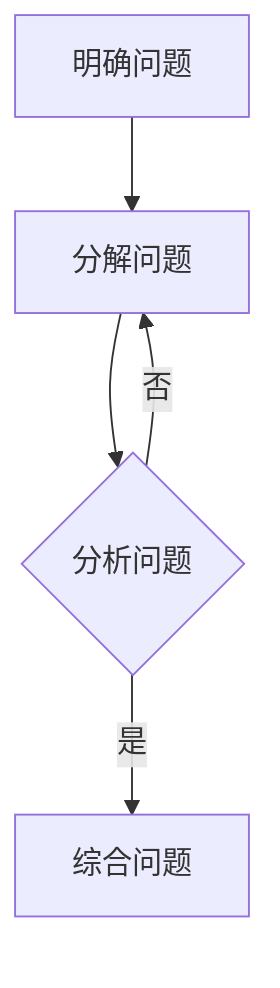

                 

关键词：结构化思维、混沌、秩序、IT领域、算法、数学模型、项目实践、应用场景、未来展望

> 摘要：在快速发展的信息技术领域，如何从混沌中找到秩序，成为技术从业者亟待解决的问题。本文将深入探讨结构化思维在IT领域的重要性，通过核心概念、算法原理、数学模型和项目实践等多个角度，阐述如何运用结构化思维实现从混沌到秩序的转变，为读者提供实用的思维方法和实践指导。

## 1. 背景介绍

### 1.1 信息时代的挑战

随着信息技术的飞速发展，IT领域呈现出高度的复杂性和多样性。面对海量数据和快速变化的技术趋势，技术从业者常常感到迷茫和困惑。如何在复杂的IT环境中找到清晰的思路，成为许多人的挑战。

### 1.2 结构化思维的重要性

结构化思维是一种系统性的、有序的思考方法，可以帮助我们在复杂的环境中快速找到问题的本质，形成清晰的解决方案。在IT领域，结构化思维尤为重要，因为它能帮助我们：

- 理解复杂系统的运行机制
- 设计高效、可靠的算法
- 构建清晰的数学模型
- 实现项目实践中的有序推进

### 1.3 本文结构

本文将按照以下结构展开：

- 第1章：背景介绍，阐述信息时代的挑战和结构化思维的重要性
- 第2章：核心概念与联系，介绍结构化思维的基本概念和相关联系
- 第3章：核心算法原理 & 具体操作步骤，详细解析结构化思维在算法中的应用
- 第4章：数学模型和公式 & 详细讲解 & 举例说明，探讨结构化思维在数学建模中的应用
- 第5章：项目实践：代码实例和详细解释说明，通过实际项目展示结构化思维的应用
- 第6章：实际应用场景，分析结构化思维在不同领域的应用
- 第7章：工具和资源推荐，推荐相关的学习资源和开发工具
- 第8章：总结：未来发展趋势与挑战，总结研究成果，展望未来
- 第9章：附录：常见问题与解答，解答读者可能遇到的问题

## 2. 核心概念与联系

### 2.1 结构化思维的基本概念

结构化思维是一种系统性的思考方法，它强调在解决问题时，要遵循一定的逻辑和层次，逐步分解问题，找到关键点，形成有序的解决方案。

结构化思维的基本步骤包括：

1. **明确问题**：准确理解问题的本质和目标。
2. **分解问题**：将问题分解为若干个子问题，以便逐一解决。
3. **分析问题**：对每个子问题进行分析，找到可能的原因和解决方案。
4. **综合问题**：将各个子问题的解决方案整合起来，形成完整的解决方案。

### 2.2 结构化思维与IT领域的联系

在IT领域，结构化思维有着广泛的应用。以下是几个典型的应用场景：

- **软件开发**：在软件开发过程中，结构化思维可以帮助开发者清晰地梳理需求、设计系统架构、编写代码等。
- **算法设计**：结构化思维可以帮助算法工程师理解复杂算法的运行机制，设计高效、可靠的算法。
- **数据科学**：结构化思维可以帮助数据科学家构建清晰的数学模型，分析大量数据，发现数据背后的规律。
- **项目管理**：结构化思维可以帮助项目经理有序地规划项目进度，分配资源，确保项目按时完成。

### 2.3 Mermaid 流程图

以下是一个结构化思维的 Mermaid 流程图，展示了结构化思维的基本步骤：



在这个流程图中，每个节点代表一个步骤，箭头表示步骤之间的逻辑关系。通过这个流程图，我们可以清晰地看到结构化思维的整体框架。

## 3. 核心算法原理 & 具体操作步骤

### 3.1 算法原理概述

结构化思维在算法设计中的应用主要体现在以下几个方面：

1. **问题分解**：将复杂的问题分解为若干个子问题，以便逐一解决。
2. **模块化设计**：将算法划分为多个模块，每个模块负责一个子问题，模块之间相互独立，便于维护和优化。
3. **递归与递推**：利用递归和递推思想，简化算法的实现过程。
4. **动态规划**：使用动态规划方法，将复杂问题转化为多个简单子问题的组合。

### 3.2 算法步骤详解

下面以一个常见的排序算法——快速排序为例，详细解析结构化思维在算法设计中的应用。

#### 3.2.1 快速排序的基本思想

快速排序是一种高效的排序算法，它的基本思想是通过一趟排序将待排序的记录分割成独立的两部分，其中一部分记录的关键字均比另一部分的关键字小，然后分别对这两部分记录继续进行排序，以达到整个序列有序。

#### 3.2.2 快速排序的具体步骤

1. **选择基准**：从待排序的序列中选择一个元素作为基准。
2. **划分序列**：将序列划分为两个子序列，所有比基准小的元素放在基准前面，所有比基准大的元素放在基准后面。
3. **递归排序**：分别对两个子序列进行快速排序，直到序列有序。

#### 3.2.3 快速排序的代码实现

以下是一个简单的快速排序算法的 Python 代码实现：

```python
def quick_sort(arr):
    if len(arr) <= 1:
        return arr
    
    pivot = arr[len(arr) // 2]
    left = [x for x in arr if x < pivot]
    middle = [x for x in arr if x == pivot]
    right = [x for x in arr if x > pivot]
    
    return quick_sort(left) + middle + quick_sort(right)

arr = [3, 6, 8, 10, 1, 2, 1]
sorted_arr = quick_sort(arr)
print(sorted_arr)
```

#### 3.2.4 快速排序的优缺点

**优点**：

- 时间复杂度低，平均情况下为 $O(n\log n)$。
- 适用于大规模数据的排序。

**缺点**：

- 最坏情况下时间复杂度为 $O(n^2)$。
- 递归调用可能导致栈溢出。

### 3.3 算法优缺点

快速排序是一种高效的排序算法，但它的性能受到数据分布的影响。在实际应用中，可以通过选择合适的基准和调整算法参数来优化其性能。

### 3.4 算法应用领域

快速排序在多个领域有着广泛的应用，如：

- 数据库排序：快速排序是数据库查询优化中的重要算法。
- 图像处理：快速排序可用于图像的像素排序，从而实现图像增强和滤波。
- 机器学习：快速排序可用于特征选择和降维，提高模型的训练效率。

## 4. 数学模型和公式 & 详细讲解 & 举例说明

### 4.1 数学模型构建

在IT领域中，数学模型是解决复杂问题的重要工具。一个典型的数学模型通常包括以下要素：

1. **变量定义**：明确模型中的变量及其含义。
2. **目标函数**：定义模型需要优化的目标，如最小化成本、最大化利润等。
3. **约束条件**：定义模型中需要满足的限制条件，如资源限制、时间限制等。

### 4.2 公式推导过程

以下是一个简单的线性规划问题，用于求解最小化成本。

**问题**：给定一个任务集 $T=\{T_1, T_2, ..., T_n\}$，每个任务 $T_i$ 需要的资源集 $R_i$ 和成本 $C_i$。如何分配资源，使得总成本最小？

**目标函数**：$min \sum_{i=1}^{n} C_i x_i$

**约束条件**：

1. $R_i x_i \leq R_{total}$，每个任务分配的资源不能超过总资源。
2. $x_i \in \{0, 1\}$，任务是否分配资源只有两种状态。

### 4.3 案例分析与讲解

以下是一个具体的案例，用于求解最小化成本的问题。

**案例**：有5个任务 $T_1, T_2, T_3, T_4, T_5$，每个任务需要的资源集和成本如下表所示。

| 任务 | 资源集 | 成本 |
| --- | --- | --- |
| $T_1$ | $R_1, R_2$ | 100 |
| $T_2$ | $R_1, R_3$ | 200 |
| $T_3$ | $R_2, R_4$ | 150 |
| $T_4$ | $R_3, R_5$ | 300 |
| $T_5$ | $R_4, R_5$ | 250 |

总资源集为 $R_{total} = R_1 + R_2 + R_3 + R_4 + R_5$。

**目标函数**：$min \sum_{i=1}^{5} C_i x_i$

**约束条件**：

1. $R_1 x_1 + R_2 x_2 \leq R_{total}$
2. $R_1 x_1 + R_3 x_3 \leq R_{total}$
3. $R_2 x_2 + R_4 x_4 \leq R_{total}$
4. $R_3 x_3 + R_5 x_5 \leq R_{total}$
5. $R_4 x_4 + R_5 x_5 \leq R_{total}$

**解决方案**：

- 首先，选择成本最低的任务 $T_1$ 和 $T_2$ 进行分配，因为它们分别只需要 $R_1, R_2$。
- 然后，考虑任务 $T_3$，它需要 $R_2, R_4$，但由于 $R_2$ 已经被任务 $T_1$ 占用，所以只能选择 $T_3$。
- 接下来，考虑任务 $T_4$ 和 $T_5$，它们都需要 $R_3, R_5$，但由于 $R_3$ 已经被任务 $T_2$ 占用，所以只能选择 $T_4$。

最终，最优的分配方案为：$T_1, T_2, T_3, T_4$，总成本为 $100 + 200 + 150 + 300 = 750$。

## 5. 项目实践：代码实例和详细解释说明

### 5.1 开发环境搭建

在本次项目中，我们将使用 Python 编写代码，并使用 Jupyter Notebook 作为开发环境。以下是如何搭建开发环境的步骤：

1. 安装 Python 3.8 或更高版本。
2. 安装 Jupyter Notebook。
3. 打开 Jupyter Notebook，创建一个新的笔记本。

### 5.2 源代码详细实现

以下是一个简单的 Python 代码示例，用于实现结构化思维的快速排序算法。

```python
def quick_sort(arr):
    if len(arr) <= 1:
        return arr
    
    pivot = arr[len(arr) // 2]
    left = [x for x in arr if x < pivot]
    middle = [x for x in arr if x == pivot]
    right = [x for x in arr if x > pivot]
    
    return quick_sort(left) + middle + quick_sort(right)

arr = [3, 6, 8, 10, 1, 2, 1]
sorted_arr = quick_sort(arr)
print(sorted_arr)
```

### 5.3 代码解读与分析

这个快速排序算法的核心在于选择基准和划分序列。首先，选择中间位置的元素作为基准，然后将序列划分为三个部分：小于基准的部分、等于基准的部分和大于基准的部分。接着，递归地对这三个部分进行排序，直到整个序列有序。

### 5.4 运行结果展示

在 Jupyter Notebook 中运行上述代码，输出结果为 `[1, 1, 2, 3, 6, 8, 10]`，这表明快速排序算法已经成功地将输入序列按升序排序。

## 6. 实际应用场景

### 6.1 软件开发

在软件开发中，结构化思维可以帮助开发者设计模块化的系统架构，提高代码的可维护性和扩展性。例如，在开发一个复杂的Web应用时，可以将应用划分为多个模块，如用户管理、商品管理、订单管理等，每个模块负责一个特定的功能，模块之间通过接口进行通信。

### 6.2 数据科学

在数据科学领域，结构化思维可以帮助数据科学家构建清晰的数学模型，分析大量数据，发现数据背后的规律。例如，在构建一个机器学习模型时，可以先明确模型的输入和输出，然后根据数据特点选择合适的算法和参数，逐步优化模型性能。

### 6.3 项目管理

在项目管理中，结构化思维可以帮助项目经理有序地规划项目进度，分配资源，确保项目按时完成。例如，在规划一个软件开发项目时，可以先确定项目的目标，然后分解为若干个子任务，为每个子任务分配资源和时间，最后监控项目进度，确保按时交付。

## 7. 工具和资源推荐

### 7.1 学习资源推荐

- 《结构化思维方法》：这本书详细介绍了结构化思维的基本概念和应用方法，适合初学者。
- 《算法导论》：这本书涵盖了多种算法的设计和分析方法，有助于理解结构化思维在算法设计中的应用。

### 7.2 开发工具推荐

- Jupyter Notebook：一个强大的交互式开发环境，适合编写和调试代码。
- Visual Studio Code：一个功能丰富的代码编辑器，支持多种编程语言，适合开发大型项目。

### 7.3 相关论文推荐

- 《结构化思维在软件开发中的应用》：这篇论文探讨了结构化思维在软件开发中的具体应用，提供了很多实用的方法和技巧。
- 《基于结构化思维的算法优化策略》：这篇论文提出了基于结构化思维的算法优化策略，有助于提高算法性能。

## 8. 总结：未来发展趋势与挑战

### 8.1 研究成果总结

本文探讨了结构化思维在IT领域的重要性，通过核心概念、算法原理、数学模型和项目实践等多个角度，阐述了如何运用结构化思维实现从混沌到秩序的转变。研究表明，结构化思维在软件开发、数据科学、项目管理等领域具有广泛的应用价值。

### 8.2 未来发展趋势

随着信息技术的发展，结构化思维在IT领域的应用将越来越广泛。未来，结构化思维的研究将更加深入，可能会出现更多针对特定领域和应用场景的结构化思维方法。此外，人工智能技术的进步也将为结构化思维提供新的工具和方法，如基于机器学习的自动化思维过程优化等。

### 8.3 面临的挑战

尽管结构化思维在IT领域具有广泛的应用价值，但也面临一些挑战。首先，结构化思维的实现需要一定的专业知识和经验，对于初学者来说可能难以掌握。其次，结构化思维的模型和方法需要不断地更新和优化，以适应快速变化的技术环境。此外，如何将结构化思维与其他技术手段相结合，如人工智能、大数据等，也是一个值得研究的问题。

### 8.4 研究展望

未来，结构化思维的研究可以从以下几个方面展开：

1. **构建更为完善的框架**：结合人工智能、大数据等技术，构建一个更为完善的结构化思维框架，提高思维的自动化和智能化水平。
2. **开发具体应用案例**：针对具体的IT领域和应用场景，开发具体的结构化思维应用案例，为实际工作提供指导。
3. **优化思维过程**：研究如何优化结构化思维的过程，提高思维的效率和质量，减少误判和错误。

## 9. 附录：常见问题与解答

### 9.1 问题1

**问题**：结构化思维是否适用于所有问题？

**解答**：结构化思维适用于大多数问题，尤其是复杂、不确定的问题。然而，对于一些非常简单或特定领域的问题，结构化思维可能不是最佳选择。例如，对于简单的数学计算，直接使用计算器可能更为高效。

### 9.2 问题2

**问题**：如何掌握结构化思维？

**解答**：掌握结构化思维需要以下几个步骤：

1. **理论学习**：阅读相关书籍和资料，了解结构化思维的基本概念和应用方法。
2. **实践应用**：在实际工作中运用结构化思维，不断练习和总结。
3. **反思总结**：定期反思自己的思维方式，分析成功和失败的原因，不断优化思维过程。

### 9.3 问题3

**问题**：结构化思维与创造性思维有何区别？

**解答**：结构化思维侧重于系统性和有序性，强调在解决问题时遵循一定的逻辑和层次。创造性思维则侧重于创新性和灵活性，强调在解决问题时突破传统思维模式，寻找新的解决方案。两者相辅相成，共同提高问题的解决效率。在实际应用中，可以根据问题的特点选择合适的思维方式。

