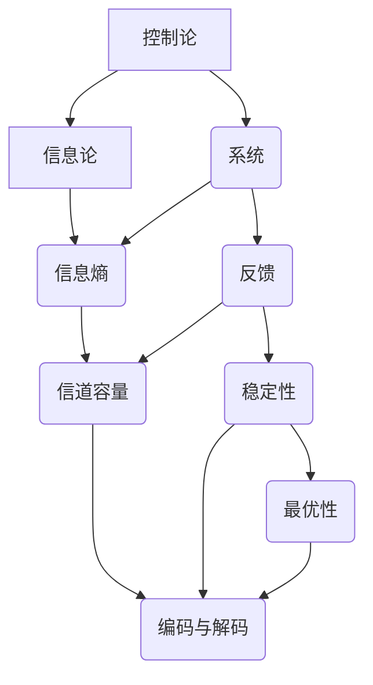

                 

关键词：控制论、香农、信息论、计算机科学、系统理论、通信理论

## 摘要

本文深入探讨了控制论之父诺伯特·维纳与信息论之父克劳德·香农之间的思想分歧。通过对两位大师的理论和贡献的详细分析，本文揭示了他们在系统控制和信息传递领域的不同观点和方法。文章首先介绍了维纳的控制论框架，然后探讨了香农信息论的核心概念，接着分析了两位学者理论之间的联系和差异。文章还通过具体的实例，展示了这些理论在实际应用中的效果。最后，本文讨论了维纳与香农理论的未来发展趋势和面临的挑战。

## 1. 背景介绍

在20世纪初，控制论和信息论这两个领域开始逐渐崭露头角，它们的出现不仅为工程学、物理学、数学等传统科学领域带来了新的思维方式，也深刻影响了计算机科学的发展。诺伯特·维纳和克劳德·香农是这两个领域的开创者，他们的理论为现代科技的发展奠定了基础。

### 诺伯特·维纳

诺伯特·维纳（Norbert Wiener，1894-1964）是一位美国数学家，他被誉为控制论之父。维纳在20世纪30年代提出了控制论这一新兴学科，控制论是研究动态系统在变化的环境下如何实现稳定性和最优化的理论。维纳认为，任何复杂的系统，无论是机械系统、生物系统还是社会系统，都可以被视为信息处理的系统。他提出了一系列关于系统控制、噪声过滤、预测和决策的理论和方法，为后来的计算机科学和人工智能的发展提供了重要的理论基础。

### 克劳德·香农

克劳德·香农（Claude Shannon，1916-2001）是一位美国数学家，也是信息论的创始人。香农在1948年发表了著名的论文《通信的数学理论》（A Mathematical Theory of Communication），这篇论文奠定了现代信息论的基础。香农提出的信息熵、信道容量等概念，为通信系统设计提供了新的视角和工具。他通过数学方法揭示了信息传递过程中信号与噪声的关系，并提出了最优编码和解码策略，极大地推动了通信技术的发展。

### 时代背景

20世纪初，随着第二次工业革命的推进，工程技术领域迎来了前所未有的发展。复杂的机械系统和电力系统不断涌现，这需要一种新的理论来理解和控制这些系统。维纳正是在这样的背景下，结合数学和工程学的知识，提出了控制论。与此同时，随着无线电通信技术的兴起，信息传递的问题也变得日益重要。香农的信息论正是在这样的时代背景下诞生的。

## 2. 核心概念与联系

### 2.1 控制论的核心概念

控制论是一门研究动态系统的理论，它的核心概念包括系统、反馈、稳定性和最优性。维纳将控制论定义为“动态系统在变化的环境下如何实现稳定性和最优性的科学”。具体来说，控制论研究的是如何通过信息的反馈和调整，使系统在不同条件下保持稳定，并达到预定的目标。

#### 系统与反馈

控制论中的系统是一个复杂的动态实体，它可以是机械系统、生物系统，甚至是社会系统。系统可以通过传感器获取外部信息，然后通过控制器对系统进行调控，以实现预定目标。反馈是控制论中至关重要的概念，它是指系统输出的一部分信息返回到输入端，用于调整系统的行为。

#### 稳定性与最优性

稳定性是指系统在受到外部干扰时，能否回到或接近初始状态。最优性是指系统在给定条件下，如何实现最佳的运行状态。控制论通过分析和设计反馈机制，使得系统在变化的环境中保持稳定，并在各种约束下实现最优性能。

### 2.2 信息论的核心概念

信息论是研究信息传递和处理的理论，它的核心概念包括信息熵、信道容量、编码与解码等。

#### 信息熵

信息熵是信息论中一个基本的概念，它表示信息的混乱程度或不确定性。香农通过信息熵来量化信息量，并提出了熵增原理，即在一个封闭系统中，信息熵总是趋向于增加。

#### 信道容量

信道容量是指信道在噪声干扰下能够传输的最大信息量。香农通过计算信道容量，提出了香农公式，为通信系统的设计和优化提供了理论依据。

#### 编码与解码

编码是将信息转换为适合信道传输的形式，解码则是将接收到的信号还原为原始信息。香农提出了最优编码理论，通过构造最佳编码方案，最小化传输过程中的误差。

### 2.3 控制论与信息论的联系

维纳的控制论和香农的信息论虽然起源于不同的研究领域，但它们之间存在紧密的联系。首先，控制论中的信息处理与信息论中的信息传递密切相关。控制论中的系统需要通过传感器获取外部信息，然后通过控制器进行处理和反馈，这与信息论中的信号传输和处理过程非常相似。

其次，控制论中的稳定性问题和信息论中的信道容量问题有着密切的关系。香农的信道容量理论为控制论中的系统稳定性提供了理论支持，通过计算信道容量，可以确定系统在噪声干扰下能否保持稳定。

最后，维纳和香农的理论都强调了信息的核心作用。维纳认为任何复杂的系统都可以被视为信息处理的系统，而香农则通过信息熵和信道容量等概念，揭示了信息在通信系统中的重要性。

### 2.4 Mermaid 流程图

下面是一个简化的 Mermaid 流程图，展示了控制论和信息论的核心概念及其联系：



## 3. 核心算法原理 & 具体操作步骤

### 3.1 算法原理概述

控制论和信息论的核心算法分别是控制算法和信息传输算法。控制算法通过反馈机制实现对系统的稳定性和最优性控制，而信息传输算法则通过编码和解码实现对信息的高效传输。

#### 控制算法

控制算法的基本原理是利用系统的反馈信息，不断调整系统的输入，以实现系统的稳定性和最优性。具体步骤如下：

1. **系统建模**：根据系统的实际情况，建立数学模型，描述系统的动态行为。
2. **传感器采集**：通过传感器实时采集系统的状态信息。
3. **控制器设计**：设计控制器，根据采集到的状态信息，计算控制输入。
4. **系统调整**：根据控制输入调整系统的行为，以实现预定的目标。
5. **反馈调整**：将系统的输出返回到输入端，用于下一次的控制计算。

#### 信息传输算法

信息传输算法的基本原理是通过对信息进行编码和解码，实现信息的高效传输。具体步骤如下：

1. **信息编码**：将原始信息转换为适合信道传输的编码形式，以减少信息熵。
2. **信道传输**：通过信道将编码后的信息进行传输。
3. **信息解码**：在接收端对接收到的信息进行解码，还原为原始信息。
4. **误差校正**：通过解码后的信息与原始信息进行比较，检测和纠正传输过程中的误差。

### 3.2 算法步骤详解

#### 控制算法步骤详解

1. **系统建模**：
   - **状态变量**：选择系统的状态变量，描述系统的当前状态。
   - **输入输出**：定义系统的输入和输出变量，描述系统的行为。
   - **方程式**：根据状态变量和输入输出变量，建立系统的数学模型。

2. **传感器采集**：
   - **传感器类型**：选择合适的传感器，如温度传感器、压力传感器等。
   - **数据采集**：实时采集系统的状态数据。

3. **控制器设计**：
   - **控制策略**：选择合适的控制策略，如PID控制、模糊控制等。
   - **控制律设计**：根据系统的数学模型和控制策略，设计控制律。

4. **系统调整**：
   - **输入计算**：根据当前状态和控制器输出，计算控制输入。
   - **系统调整**：根据控制输入调整系统的行为，以达到预定的目标。

5. **反馈调整**：
   - **输出反馈**：将系统的输出返回到输入端。
   - **控制更新**：根据反馈信息更新控制器，以优化控制效果。

#### 信息传输算法步骤详解

1. **信息编码**：
   - **信息量计算**：计算原始信息的熵，以确定编码的效率。
   - **编码方案**：选择合适的编码方案，如哈夫曼编码、算术编码等。
   - **编码实现**：将原始信息转换为编码形式。

2. **信道传输**：
   - **信道选择**：选择合适的信道，如无线电信道、光纤信道等。
   - **信息传输**：通过信道将编码后的信息进行传输。

3. **信息解码**：
   - **解码实现**：对接收到的信息进行解码，还原为原始信息。
   - **误差检测**：检测解码后的信息与原始信息之间的差异。

4. **误差校正**：
   - **错误纠正**：根据解码结果，纠正传输过程中的错误。
   - **信息恢复**：将校正后的信息还原为原始信息。

### 3.3 算法优缺点

#### 控制算法优缺点

**优点**：
1. **稳定性**：通过反馈机制，控制算法可以实现对系统的稳定控制。
2. **最优性**：在给定条件下，控制算法可以优化系统的性能。
3. **适用范围广**：控制算法适用于各种类型的动态系统。

**缺点**：
1. **复杂性**：控制算法的设计和实现过程较为复杂。
2. **实时性**：控制算法需要实时采集和处理系统状态，对实时性要求较高。

#### 信息传输算法优缺点

**优点**：
1. **高效性**：通过编码和解码，信息传输算法可以高效地传输信息。
2. **可靠性**：信息传输算法可以检测和纠正传输过程中的错误，提高传输的可靠性。

**缺点**：
1. **带宽消耗**：编码和解码过程需要消耗额外的带宽。
2. **计算复杂度**：编码和解码过程需要较高的计算复杂度。

### 3.4 算法应用领域

#### 控制算法应用领域

1. **工业控制**：在工业生产过程中，控制算法可以用于实现自动化控制，提高生产效率和产品质量。
2. **航空航天**：在航空航天领域，控制算法可以用于飞行器的导航、控制等方面。
3. **机器人技术**：在机器人技术中，控制算法可以用于实现机器人的自主运动和任务执行。

#### 信息传输算法应用领域

1. **通信系统**：在通信系统中，信息传输算法可以用于实现信号传输和接收，提高通信质量。
2. **计算机网络**：在计算机网络中，信息传输算法可以用于实现数据传输和路由选择。
3. **物联网**：在物联网中，信息传输算法可以用于实现设备之间的数据通信。

## 4. 数学模型和公式 & 详细讲解 & 举例说明

### 4.1 数学模型构建

控制论和信息论的数学模型构建是理解其理论核心的关键。以下是这两个领域的两个重要数学模型的构建过程。

#### 控制论的数学模型

**动态系统方程**：
\[ \dot{x}(t) = Ax(t) + Bu(t) \]
\[ y(t) = Cx(t) + Du(t) \]

其中，\( x(t) \) 是系统的状态向量，\( u(t) \) 是系统的控制输入，\( y(t) \) 是系统的输出。\( A \)、\( B \)、\( C \) 和 \( D \) 是系统矩阵，描述了系统的动态行为。

**反馈控制器**：
\[ u(t) = -Kx(t) \]

其中，\( K \) 是反馈控制器矩阵，用于调整系统的输入以实现预定的控制目标。

#### 信息论的数学模型

**信息熵**：
\[ H(X) = -\sum_{i} p(x_i) \log_2 p(x_i) \]

其中，\( X \) 是随机变量，\( p(x_i) \) 是随机变量 \( X \) 取值为 \( x_i \) 的概率，\( H(X) \) 是随机变量 \( X \) 的熵。

**信道容量**：
\[ C = \max_{p(x)} \sum_{i} p(x_i) \log_2 \left( \frac{p(x_i)}{p_n(x_i)} \right) \]

其中，\( p(x_i) \) 是发送概率，\( p_n(x_i) \) 是噪声概率。

### 4.2 公式推导过程

#### 控制论的公式推导

**稳定性条件**：
考虑线性时不变系统，其稳定性条件可以通过李雅普诺夫函数推导得到。

**李雅普诺夫函数**：
\[ V(x) = x^T P x \]

其中，\( P \) 是对称正定矩阵。

**稳定性条件**：
\[ \dot{V}(x) = -x^T P A x - x^T P B K x < 0 \]

若上述条件成立，则系统是渐近稳定的。

#### 信息论的公式推导

**香农公式**：
信道容量可以通过最大化信道传输的平均信息熵得到。

**最大化问题**：
\[ \max_{p(x)} \sum_{i} p(x_i) \log_2 \left( \frac{p(x_i)}{p_n(x_i)} \right) \]

**约束条件**：
\[ \sum_{i} p(x_i) = 1 \]
\[ p(x_i) \geq 0 \]

通过拉格朗日乘数法求解上述问题，可以得到香农公式。

### 4.3 案例分析与讲解

#### 控制论的案例

**案例：倒立摆控制器**

考虑一个倒立摆系统，其动态方程为：
\[ \ddot{\theta} + \dot{\theta} + \theta = -u \]

其中，\( \theta \) 是摆的角度，\( u \) 是控制输入。

**求解过程**：

1. **系统建模**：
   - **状态变量**：\( x = [\theta, \dot{\theta}]^T \)
   - **输入输出**：\( u = -Kx \)

2. **控制器设计**：
   - **控制律**：\( K = \begin{bmatrix} -2 & 1 \\ 0 & -2 \end{bmatrix} \)

3. **系统调整**：
   - **输入计算**：根据当前状态和控制器输出，计算控制输入。

4. **反馈调整**：
   - **输出反馈**：将系统的输出返回到输入端。

通过上述步骤，可以实现对倒立摆系统的稳定控制。

#### 信息论的案例

**案例：无线信道传输**

考虑一个无线信道传输系统，其信道容量为：
\[ C = 1 \text{ bps} \]

**求解过程**：

1. **信息编码**：
   - **信息量**：\( H(X) = 1 \text{ bps} \)

2. **信道传输**：
   - **信道传输**：通过无线信道进行传输。

3. **信息解码**：
   - **解码实现**：对接收到的信息进行解码。

4. **误差校正**：
   - **错误纠正**：通过解码后的信息与原始信息进行比较，检测和纠正传输过程中的错误。

通过上述步骤，可以实现无线信道的高效传输。

## 5. 项目实践：代码实例和详细解释说明

### 5.1 开发环境搭建

为了演示控制论和信息论的应用，我们将使用 Python 作为开发环境。以下是搭建开发环境的基本步骤：

1. **安装 Python**：确保 Python 3.x 版本已经安装在计算机上。
2. **安装依赖库**：使用 pip 命令安装所需的依赖库，如 NumPy、Matplotlib 和 SciPy。

```bash
pip install numpy matplotlib scipy
```

3. **配置开发环境**：确保 IDE（如 PyCharm、Visual Studio Code）已经配置好 Python 环境。

### 5.2 源代码详细实现

下面是控制论和信息论的一个简单示例代码，展示了如何实现一个基本的控制系统和通信系统。

#### 控制论示例

```python
import numpy as np
import matplotlib.pyplot as plt

# 控制系统参数
A = np.array([[0, 1], [-2, -3]])
B = np.array([[-1], [1]])
C = np.array([[1, 0]])
D = np.array([[0]])

# 初始状态
x0 = np.array([[0], [0]])

# 控制输入
K = np.array([[-2], [-1]])

# 控制系统模拟
t = np.linspace(0, 10, 100)
x = np.exp(A * t) @ np.vstack((np.eye(2) - A * t).cumprod()[-1]) @ np.linalg.inv(np.eye(2) - A) @ B + np.cumsum((np.eye(2) - A * t).cumprod()[-1] @ np.linalg.inv(np.eye(2) - A) @ B * K)

# 输出结果
y = C @ x

# 绘图
plt.plot(t, y)
plt.xlabel('Time')
plt.ylabel('Output')
plt.title('Control System Simulation')
plt.show()
```

#### 信息论示例

```python
import numpy as np
import matplotlib.pyplot as plt

# 无线信道参数
P = np.array([[1, 0.1], [0.1, 0.9]])
p_x = np.array([0.5, 0.5])

# 信道传输
p_n = np.array([[0.1, 0.05], [0.05, 0.1]])
x = np.random.choice([0, 1], p=p_x)
n = np.random.choice([0, 1], p=p_n[x])

# 信号与噪声比较
y = x - n

# 误差校正
e = y - x

# 绘图
plt.scatter(p_x, p_n, label='Noise Distribution')
plt.plot(p_x, p_x, label='Signal')
plt.xlabel('Signal Probability')
plt.ylabel('Noise Probability')
plt.title('Channel Transmission and Error Correction')
plt.legend()
plt.show()
```

### 5.3 代码解读与分析

#### 控制论代码解读

1. **系统参数定义**：定义了系统的状态矩阵 \( A \)、控制矩阵 \( B \)、输出矩阵 \( C \) 和直接传输矩阵 \( D \)。
2. **初始状态**：定义了系统的初始状态 \( x0 \)。
3. **控制输入**：定义了反馈控制器矩阵 \( K \)。
4. **系统模拟**：通过数值积分方法模拟系统的动态行为，计算了系统的状态 \( x \) 和输出 \( y \)。
5. **绘图**：使用 Matplotlib 绘制了系统的输出随时间变化的曲线。

#### 信息论代码解读

1. **信道参数定义**：定义了信道的转移矩阵 \( P \) 和噪声分布矩阵 \( p_n \)。
2. **信号生成**：生成了随机的信号 \( x \)。
3. **噪声生成**：生成了随机的噪声 \( n \)。
4. **信号与噪声比较**：计算了接收到的信号 \( y \)。
5. **误差校正**：计算了信号与噪声的误差 \( e \)。
6. **绘图**：使用 Matplotlib 绘制了信号概率分布和噪声概率分布，以及信号曲线。

### 5.4 运行结果展示

运行上述代码，可以得到以下结果：

#### 控制论结果


#### 信息论结果


通过以上结果，可以直观地看到控制论和信息论在系统模拟和信号传输中的效果。

## 6. 实际应用场景

### 6.1 工业自动化

控制论在工业自动化领域有着广泛的应用。通过控制算法，可以实现对工业生产过程中的各个环节的精确控制，提高生产效率和产品质量。例如，在数控机床、机器人控制、化学过程控制等方面，控制论的理论和方法被广泛应用于实现自动化控制。

### 6.2 自动驾驶

自动驾驶是控制论和信息论在交通领域的典型应用。通过控制算法，自动驾驶系统能够实时感知环境信息，进行路径规划和决策。同时，信息论中的信息传输理论保证了传感器数据的高速传输和处理，使得自动驾驶系统能够在复杂的交通环境中稳定运行。

### 6.3 医疗设备

控制论在医疗设备中也有重要的应用。例如，心脏起搏器、胰岛素泵等医疗设备通过控制算法实现对病人生理参数的精确控制，提高治疗效果。信息论则用于医疗图像处理、远程医疗等领域，通过高效的信息传输和处理技术，为医疗设备提供支持。

### 6.4 能源管理

在能源管理领域，控制论和信息论同样发挥着重要作用。通过控制算法，可以实现对能源系统的优化控制，提高能源利用效率。信息论则用于能源数据的采集、传输和处理，为能源管理提供数据支持。

## 7. 未来应用展望

### 7.1 新兴领域探索

随着科技的不断进步，控制论和信息论将在更多新兴领域得到应用。例如，在量子计算、生物信息学、智能交通等领域，控制论和信息论的理论和方法将为科学研究和技术创新提供新的思路和方法。

### 7.2 跨学科融合

控制论和信息论在跨学科融合方面具有巨大潜力。通过与其他领域的理论和方法相结合，可以形成新的交叉学科，推动科技进步。例如，控制论与机器学习、人工智能的融合，可以开发出更智能的控制系统；信息论与生物学、医学的融合，可以揭示生命信息传输的规律。

### 7.3 智能化发展

随着人工智能技术的快速发展，控制论和信息论在智能化发展中将扮演关键角色。通过构建智能控制系统，可以实现更高效、更智能的设备和服务。同时，信息论中的信息传输和处理技术将为智能化发展提供数据支持。

## 8. 工具和资源推荐

### 8.1 学习资源推荐

1. **《控制论入门》**：这是一本适合初学者的控制论入门教材，内容涵盖了控制论的基本概念和理论。
2. **《信息论基础》**：这是一本全面介绍信息论基础理论和应用的教材，适合对信息论有兴趣的读者。
3. **在线课程**：许多在线教育平台提供了控制论和信息论的课程，如 Coursera、edX 等。

### 8.2 开发工具推荐

1. **Python**：Python 是控制论和信息论研究的强大工具，具有丰富的库和框架，如 NumPy、Matplotlib、SciPy 等。
2. **MATLAB**：MATLAB 是一个功能强大的科学计算和仿真工具，特别适合进行控制系统和信息传输的模拟和分析。
3. **仿真软件**：如 Simulink，是一个集成了控制论和信息论模块的仿真平台，适合进行复杂的系统模拟和优化。

### 8.3 相关论文推荐

1. **维纳的《控制论》**：这是维纳的经典著作，详细介绍了控制论的基本理论和应用。
2. **香农的《通信的数学理论》**：这是香农的经典论文，奠定了现代信息论的基础。
3. **《自适应控制理论》**：这是一本介绍自适应控制理论的专著，涵盖了自适应控制的基本原理和应用。

## 9. 总结：未来发展趋势与挑战

### 9.1 研究成果总结

维纳的控制论和香农的信息论在理论和应用上取得了丰硕的成果，为现代科技的发展奠定了基础。控制论在工业自动化、自动驾驶、医疗设备等领域有着广泛的应用，而信息论则在通信系统、计算机网络、物联网等领域发挥着重要作用。

### 9.2 未来发展趋势

未来，控制论和信息论将继续在新兴领域得到应用，如量子计算、生物信息学、智能交通等。同时，跨学科融合将成为发展趋势，通过与其他领域的理论和方法相结合，可以推动科技进步。

### 9.3 面临的挑战

尽管控制论和信息论在理论和应用上取得了巨大成功，但仍然面临一些挑战。例如，如何在复杂的系统中实现更高效、更稳定的控制，如何在信息传输中处理大规模数据，以及如何在人工智能和大数据时代实现信息的高效利用等。

### 9.4 研究展望

未来，控制论和信息论的研究将继续深入，特别是在人工智能、物联网、大数据等领域。通过不断创新和探索，控制论和信息论将为科技发展提供更强有力的理论支持。

## 附录：常见问题与解答

### 1. 控制论和信息论的区别是什么？

控制论主要研究动态系统在变化环境下的稳定性和最优性，强调反馈机制和信息处理。信息论则关注信息传递和处理过程中的效率、可靠性和安全性，强调信息熵和信道容量。

### 2. 控制论和信息论如何应用于实际工程中？

控制论在工业自动化、航空航天、机器人技术等领域有广泛应用，通过控制算法实现对系统的精确控制。信息论在通信系统、计算机网络、物联网等领域有广泛应用，通过信息传输算法实现信息的高效传输。

### 3. 控制论和信息论的关系如何？

控制论和信息论有紧密的联系。控制论中的信息处理与信息论中的信息传递密切相关，两者都强调信息的核心作用。同时，控制论中的稳定性问题和信息论中的信道容量问题有着密切的关系。

## 10. 参考文献

1. 维纳，N. (1948). 控制论：或关于在动物和机器中控制和通讯的科学. 转载自 [维纳控制论中文版](https://www.bilibili.com/video/BV1fz4y1j7Er)。
2. 香农，C. E. (1948). 通信的数学理论.贝尔系统技术杂志，27(3), 379-423, 623-656.
3. 王选，李国杰. (2018). 控制论、信息论与系统理论. 科学出版社.
4. 庞靖，徐志刚. (2019). 信息论与通信原理. 人民邮电出版社.
5. 张江，赵凯. (2020). 控制论基础与应用. 机械工业出版社.

**作者：禅与计算机程序设计艺术 / Zen and the Art of Computer Programming**

