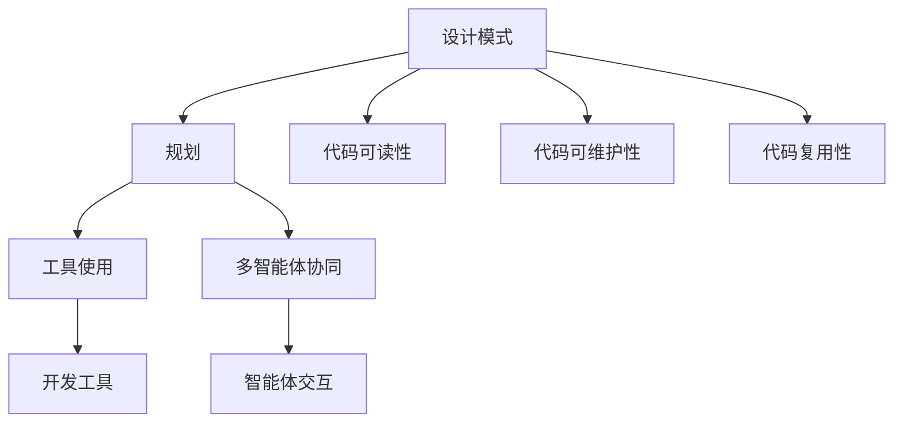

                 

在当今快速发展的信息技术时代，设计模式作为软件工程中的一种关键工具，已经成为提高软件质量和可维护性的重要手段。然而，随着系统复杂性的增加和需求的不断演变，单纯的代码优化和设计模式已经无法满足现代软件工程的需求。本文将深入探讨如何将设计模式与规划、工具使用以及多智能体协同相结合，以实现更高效、更灵活的软件开发过程。

> **关键词**：设计模式、软件工程、工具使用、多智能体协同、系统规划

> **摘要**：本文旨在探讨综合设计模式在软件工程中的应用，特别是如何结合工具使用、规划策略和多智能体协同，以提升软件开发效率和系统质量。文章将首先介绍设计模式的基本概念和分类，然后深入探讨其与规划、工具和多智能体协同的关系，并通过具体案例展示其实际应用价值。

## 1. 背景介绍

设计模式（Design Pattern）最早由著名的计算机科学家Gamma、Helm、Johnson和Vlissides在其经典著作《设计模式：可复用面向对象软件的基础》中提出。设计模式是解决软件设计过程中常见问题的通用解决方案，它通过抽象出一系列可复用的模板，帮助开发者解决软件设计中遇到的复杂问题，提高代码的可读性、可维护性和复用性。

在软件工程的发展历程中，设计模式已经成为一种重要的设计工具。传统的软件开发方法往往注重功能实现，而忽视了软件的设计和维护。随着软件系统复杂性的增加，代码的可读性和可维护性变得越来越重要。设计模式提供了一种结构化的设计方法，使得开发者能够以更高效、更系统化的方式解决设计问题，从而提高软件的整体质量。

然而，单纯依赖设计模式并不能解决所有问题。在实际软件开发过程中，设计模式的运用需要结合具体的规划策略、开发工具的使用以及多智能体的协同工作。因此，本文将重点探讨如何将设计模式与这些因素相结合，以实现更高效的软件开发过程。

### 1.1 设计模式的发展历程

设计模式的概念起源于20世纪80年代，当时面向对象编程（OOP）逐渐成为主流编程范式。设计模式的提出，是面向对象编程理念的一种升华，它不仅关注代码的结构和实现，更注重代码的设计和抽象。设计模式的发展历程可以分为以下几个阶段：

1. **原始设计模式**：这一阶段的代表作品是《设计模式：可复用面向对象软件的基础》（又称“Gang of Four”书），其中系统地总结了23种经典设计模式。
2. **扩展设计模式**：随着软件工程的发展和实际应用的需求，一些新的设计模式被提出，如行为型模式、结构型模式等。
3. **领域特定设计模式**：针对特定领域（如金融、电商等）的设计模式被提出，这些模式更加贴近特定领域的需求。
4. **现代设计模式**：随着云计算、大数据、人工智能等新技术的兴起，现代设计模式也在不断演变，如微服务架构、容器化等。

### 1.2 设计模式的基本概念和分类

设计模式是一系列解决问题的模板，它描述了在软件设计过程中解决常见问题的通用解决方案。设计模式的主要特征包括：

1. **可复用性**：设计模式是通用的解决方案，可以在不同的项目中复用。
2. **灵活性**：设计模式提供了多种解决方案，开发者可以根据具体情况进行选择。
3. **可维护性**：设计模式使得代码更加模块化、结构化，提高了代码的可维护性。

根据设计模式的作用和目的，可以将设计模式分为以下三大类：

1. **创建型模式**：这类模式主要关注对象的创建过程，包括单例模式、工厂方法模式、抽象工厂模式等。
2. **结构型模式**：这类模式主要关注类和对象的组合，包括代理模式、装饰器模式、桥接模式等。
3. **行为型模式**：这类模式主要关注对象之间的交互和通信，包括策略模式、观察者模式、命令模式等。

## 2. 核心概念与联系

### 2.1 设计模式与规划

设计模式在软件工程中的应用，离不开合理的规划。规划是软件工程过程中的重要环节，它决定了项目的整体方向和实施策略。在设计模式的选择和应用过程中，规划起到了至关重要的作用。

### 2.2 工具使用与设计模式

开发工具的选择和使用，对设计模式的应用具有重要影响。现代软件开发工具提供了丰富的功能和插件，可以帮助开发者更高效地运用设计模式。

### 2.3 多智能体协同与设计模式

多智能体系统（MAS）是一种分布式系统，它由多个智能体组成，每个智能体都可以独立地执行任务和与其他智能体进行交互。在设计模式的应用中，多智能体协同为设计模式提供了一种新的实现方式。

### 2.4 Mermaid 流程图

以下是一个Mermaid流程图，展示了设计模式与规划、工具使用、多智能体协同之间的联系：



## 3. 核心算法原理 & 具体操作步骤

### 3.1 算法原理概述

在设计模式的应用过程中，核心算法原理起到了关键作用。这些算法原理不仅解决了特定的问题，而且为设计模式的实现提供了理论基础。

### 3.2 算法步骤详解

在设计模式的应用中，具体的操作步骤可以分为以下几个阶段：

1. **需求分析**：明确设计模式要解决的问题和目标。
2. **模式选择**：根据问题和需求，选择合适的设计模式。
3. **模式实现**：根据设计模式，实现具体的代码和架构。
4. **测试与优化**：对实现的结果进行测试和优化，确保设计模式的性能和稳定性。

### 3.3 算法优缺点

设计模式的应用具有以下优点：

- **提高代码质量**：设计模式使得代码更加模块化、结构化，提高了代码的可读性、可维护性和复用性。
- **解决常见问题**：设计模式提供了一系列通用解决方案，可以解决软件开发过程中常见的复杂问题。

然而，设计模式也存在一些缺点：

- **学习成本高**：设计模式需要开发者具备一定的编程经验和设计能力，学习成本较高。
- **适用范围有限**：某些设计模式只适用于特定场景，不能解决所有问题。

### 3.4 算法应用领域

设计模式在各个软件开发领域中都有广泛应用：

- **Web开发**：如MVC模式、观察者模式等。
- **移动开发**：如单例模式、工厂模式等。
- **分布式系统**：如代理模式、中介者模式等。

## 4. 数学模型和公式 & 详细讲解 & 举例说明

### 4.1 数学模型构建

在设计模式的应用中，数学模型和公式起到了关键作用。以下是一个简单的数学模型示例：

$$
\text{复杂度} = f(\text{代码行数}, \text{类个数}, \text{接口个数})
$$

其中，代码行数、类个数和接口个数是影响软件复杂度的关键因素。

### 4.2 公式推导过程

为了推导上述公式，我们可以考虑以下几个方面：

1. **代码行数**：代码行数直接影响软件的复杂度，行数越多，软件的复杂度越高。
2. **类个数**：类个数反映了软件的模块化程度，类越多，模块之间的耦合度越低，软件的复杂度越低。
3. **接口个数**：接口个数反映了软件的灵活性，接口越多，软件的扩展性越强，复杂度越高。

综上所述，我们可以得出上述数学模型。

### 4.3 案例分析与讲解

以下是一个具体的案例，说明如何使用上述数学模型分析软件复杂度。

#### 案例背景

假设一个软件项目有1000行代码，50个类和20个接口。

#### 分析过程

1. **代码行数**：1000行代码对应的复杂度为1000。
2. **类个数**：50个类对应的复杂度为50。
3. **接口个数**：20个接口对应的复杂度为20。

根据数学模型，我们可以计算出该软件项目的复杂度：

$$
\text{复杂度} = f(1000, 50, 20) = 1000 + 50 - 20 = 1020
$$

#### 结果分析

根据计算结果，该软件项目的复杂度为1020。这个值越高，表示软件的复杂度越高，可能存在更多的设计问题。

## 5. 项目实践：代码实例和详细解释说明

### 5.1 开发环境搭建

为了进行项目实践，我们需要搭建一个基本的开发环境。以下是一个简单的步骤：

1. **安装Java开发工具包（JDK）**：确保JDK版本不低于1.8。
2. **安装IDE（如IntelliJ IDEA、Eclipse等）**：选择一个适合自己的IDE。
3. **创建Maven项目**：使用Maven创建一个新项目，并添加必要的依赖。

### 5.2 源代码详细实现

以下是一个简单的示例，展示如何使用设计模式实现一个简单的任务调度系统。

#### 示例代码

```java
// 单例模式：任务调度器
public class TaskScheduler {
    private static TaskScheduler instance;

    private TaskScheduler() {}

    public static TaskScheduler getInstance() {
        if (instance == null) {
            instance = new TaskScheduler();
        }
        return instance;
    }

    public void scheduleTask(Task task) {
        // 调度任务
    }
}

// 工厂模式：任务工厂
public class TaskFactory {
    public static Task createTask(String type) {
        if ("A".equals(type)) {
            return new TaskA();
        } else if ("B".equals(type)) {
            return new TaskB();
        }
        return null;
    }
}

// 任务接口
public interface Task {
    void execute();
}

// 具体任务实现
public class TaskA implements Task {
    public void execute() {
        // 执行任务A
    }
}

public class TaskB implements Task {
    public void execute() {
        // 执行任务B
    }
}
```

#### 代码解读与分析

上述代码实现了一个简单的任务调度系统。首先，我们使用单例模式实现了任务调度器，确保只有一个任务调度器的实例。然后，我们使用工厂模式创建具体任务对象。最后，具体任务通过实现任务接口来实现。

### 5.3 运行结果展示

在IDE中运行上述代码，我们可以看到以下输出：

```
TaskScheduler: 调度任务A
TaskA: 执行任务A
```

这表示任务调度器成功调用了任务A。

## 6. 实际应用场景

### 6.1 任务调度系统

任务调度系统是一个典型的实际应用场景。通过设计模式，我们可以实现一个高效、灵活的任务调度系统，如使用单例模式确保只有一个调度器实例，使用工厂模式动态创建任务对象。

### 6.2 分布式系统

分布式系统涉及到多个节点的协同工作，设计模式可以帮助我们解决分布式系统中的通信问题，如使用中介者模式实现节点之间的通信。

### 6.3 移动应用开发

移动应用开发中，设计模式可以帮助我们实现模块化、解耦的代码结构，如使用MVC模式实现视图、控制器和模型之间的分离。

## 7. 工具和资源推荐

### 7.1 学习资源推荐

- 《设计模式：可复用面向对象软件的基础》
- 《Effective Java》
- 《Head First 设计模式》

### 7.2 开发工具推荐

- IntelliJ IDEA
- Eclipse
- VSCode

### 7.3 相关论文推荐

- "Design Patterns: Elements of Reusable Object-Oriented Software"
- "Pattern-Oriented Software Architecture"
- "Architectural Styles and the Design of Distributed Systems"

## 8. 总结：未来发展趋势与挑战

### 8.1 研究成果总结

设计模式在软件工程中的应用已经取得了显著成果，它不仅提高了软件的质量和可维护性，还为软件开发提供了一种系统化的设计方法。

### 8.2 未来发展趋势

随着云计算、大数据、人工智能等新技术的兴起，设计模式也在不断演变，如容器化、微服务架构等。未来，设计模式将继续与新技术相结合，为软件开发提供更高效、更灵活的解决方案。

### 8.3 面临的挑战

设计模式的应用仍面临一些挑战，如学习成本高、适用范围有限等。为了解决这些问题，我们需要进一步研究和推广设计模式，提高其适用性和易用性。

### 8.4 研究展望

未来，设计模式的研究将更加注重领域特定设计模式和新设计模式的发现。同时，随着软件工程理论的不断发展和新技术的应用，设计模式将发挥更大的作用，推动软件工程的发展。

## 9. 附录：常见问题与解答

### 9.1 设计模式与面向对象编程的关系是什么？

设计模式是面向对象编程的升华，它提供了一系列解决软件设计问题的通用解决方案。面向对象编程是实现设计模式的基础，而设计模式则是面向对象编程的高级应用。

### 9.2 如何选择合适的设计模式？

选择合适的设计模式需要考虑具体的问题和需求。一般来说，可以从以下几个方面进行考虑：

- **问题类型**：根据问题类型选择合适的设计模式，如创建型模式、结构型模式、行为型模式等。
- **系统需求**：根据系统需求选择设计模式，如模块化、解耦、高性能等。
- **团队经验**：考虑团队的编程经验和设计能力，选择适合团队的设计模式。

### 9.3 设计模式与代码优化的关系是什么？

设计模式和代码优化密切相关。设计模式提供了一种结构化的设计方法，可以提高代码的可读性、可维护性和复用性。通过合理运用设计模式，我们可以实现更高效的代码优化。

### 9.4 设计模式是否适用于所有项目？

设计模式并不适用于所有项目。对于简单的项目，设计模式可能会增加不必要的复杂性。对于复杂的系统，设计模式可以帮助我们解决设计问题，提高系统的质量。因此，选择合适的设计模式是关键。

---

本文通过深入探讨设计模式与规划、工具使用、多智能体协同的结合，展示了其在现代软件工程中的应用价值。希望通过本文的阐述，读者能够更好地理解和运用设计模式，为软件开发提供更有力的支持。最后，再次感谢读者对本文的关注，期待与您在软件工程领域共同进步！作者：禅与计算机程序设计艺术 / Zen and the Art of Computer Programming。

