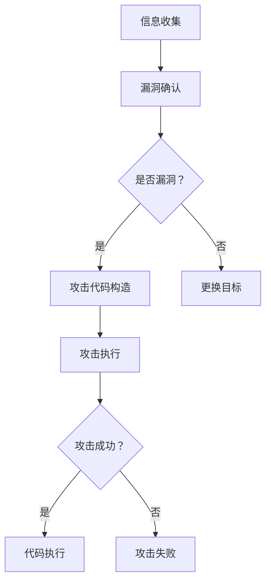

                 

关键词：缓冲区溢出攻击、网络安全模拟、系统实现、安全防护、漏洞利用

> 摘要：本文将深入探讨缓冲区溢出攻击的网络安全模拟系统实现。首先，我们将介绍缓冲区溢出攻击的背景和原理，然后分析其技术实现，并通过构建一个模拟系统来展示如何在实际环境中检测和防范此类攻击。文章还将讨论相关的数学模型和公式，并提供一个详细的代码实例，最后探讨缓冲区溢出攻击在实际应用场景中的使用及其未来展望。

## 1. 背景介绍

缓冲区溢出攻击是一种常见的网络安全威胁，它利用了计算机程序中的缓冲区错误。这种攻击能够通过在程序的缓冲区中输入超过其容量的数据，从而使程序的行为变得不可预测，甚至完全失控。缓冲区溢出攻击最早在1980年代被提出，随着计算机系统的发展，其影响也日益严重。尽管现代操作系统和编程语言提供了许多防范措施，但缓冲区溢出攻击依然是一个重要的网络安全问题。

缓冲区溢出攻击的原理在于，当程序在处理输入数据时，如果缓冲区的大小不足以存储输入的数据，超出的部分就会溢出到相邻的内存区域。如果这个内存区域恰好被程序的重要部分所占用，攻击者就可能通过控制溢出的数据来修改程序的执行流程，甚至执行任意代码。这种攻击常常伴随着其他恶意行为，如窃取敏感信息、破坏系统稳定性等。

### 1.1 缓冲区溢出攻击的历史与发展

1980年代，缓冲区溢出攻击开始被广泛研究，这一时期著名的例子包括1988年的莫里斯蠕虫（Morris Worm），它是通过缓冲区溢出攻击实现对UNIX系统的攻击。1990年代，随着网络技术的发展，缓冲区溢出攻击逐渐成为黑客攻击的主要手段之一。2000年后，随着操作系统和编程语言的改进，缓冲区溢出攻击的难度有所增加，但仍有很多成功的案例。

### 1.2 缓冲区溢出攻击的分类

根据攻击的方法和目的，缓冲区溢出攻击可以分为以下几种类型：

- **栈溢出攻击**：通过溢出栈上的数据来控制程序的执行流程。
- **堆溢出攻击**：通过溢出堆上的数据来控制程序的执行流程。
- **格式化字符串漏洞**：通过构造特定的字符串输入，导致程序执行不当。
- **整数溢出攻击**：通过构造特定的整数输入，导致程序执行不当。

### 1.3 缓冲区溢出攻击的影响

缓冲区溢出攻击的影响范围广泛，包括但不限于：

- **系统崩溃**：缓冲区溢出可能导致系统停止响应或直接崩溃。
- **数据泄露**：通过溢出攻击，攻击者可以窃取系统中的敏感信息。
- **代码执行**：攻击者可以通过溢出攻击在系统中执行任意代码，从而实现恶意操作。
- **远程控制**：攻击者可以利用缓冲区溢出获取系统的控制权，进而进行其他攻击。

## 2. 核心概念与联系

### 2.1 缓冲区溢出攻击的原理

缓冲区溢出攻击的原理在于，程序的缓冲区用于存储临时数据，当输入的数据超过缓冲区的大小时，超出的部分就会溢出到相邻的内存区域。如果这个内存区域被程序的重要部分所占用，攻击者就可以通过控制溢出的数据来修改程序的执行流程。具体来说，攻击者会构造一个特殊的输入数据包，这个数据包不仅包含了正常的输入数据，还包括了用于控制程序执行流程的代码和数据。

### 2.2 攻击流程

缓冲区溢出攻击的流程通常包括以下几个步骤：

1. **信息收集**：攻击者首先会收集目标系统的信息，包括操作系统版本、程序细节等，以便确定攻击的最佳方法。
2. **漏洞确认**：攻击者会通过各种手段确定目标系统中存在的缓冲区溢出漏洞。
3. **攻击代码构造**：攻击者会构造一个特殊的输入数据包，这个数据包包含了用于溢出缓冲区和控制程序执行流程的代码。
4. **攻击执行**：攻击者将构造好的数据包发送到目标系统，触发缓冲区溢出攻击。
5. **代码执行**：如果攻击成功，攻击者就可以在目标系统中执行任意代码，实现恶意目的。

### 2.3 防护措施

为了防范缓冲区溢出攻击，系统管理员和开发者可以采取以下措施：

- **使用现代编程语言**：现代编程语言提供了许多内置的安全机制，如自动内存管理，可以减少缓冲区溢出的风险。
- **安全编码实践**：开发者应该遵循安全编码的最佳实践，如检查输入数据的长度、使用格式化字符串漏洞防护工具等。
- **操作系统更新**：及时更新操作系统和软件，以修补已知的漏洞。
- **防火墙和入侵检测系统**：部署防火墙和入侵检测系统，监控网络流量，及时发现和阻止攻击行为。
- **安全审计**：定期进行安全审计，检查系统中的安全漏洞，及时修复。

### 2.4 Mermaid 流程图

以下是缓冲区溢出攻击的 Mermaid 流程图：



## 3. 核心算法原理 & 具体操作步骤

### 3.1 算法原理概述

缓冲区溢出攻击的核心算法原理在于利用程序的缓冲区溢出漏洞，通过构造特殊的输入数据包来控制程序的执行流程。具体来说，攻击者会构造一个包含恶意代码的数据包，当这个数据包被程序处理时，会导致缓冲区溢出，进而使程序执行恶意代码。

### 3.2 算法步骤详解

#### 3.2.1 信息收集

1. **目标系统识别**：首先，攻击者需要识别目标系统的类型、操作系统版本和程序细节。
2. **漏洞扫描**：使用漏洞扫描工具对目标系统进行扫描，查找可能存在的缓冲区溢出漏洞。
3. **漏洞验证**：对扫描结果进行验证，确认是否存在缓冲区溢出漏洞。

#### 3.2.2 攻击代码构造

1. **缓冲区分析**：分析目标程序的缓冲区，确定缓冲区的大小和内存布局。
2. **构造输入数据**：根据缓冲区的大小和内存布局，构造一个包含恶意代码的数据包。
3. **编码技巧**：使用编码技巧，确保数据包在发送时不会被截断或修改。

#### 3.2.3 攻击执行

1. **发送数据包**：将构造好的数据包发送到目标系统。
2. **触发溢出**：在目标系统中执行数据包处理过程，触发缓冲区溢出。
3. **执行恶意代码**：利用溢出的数据控制程序的执行流程，执行恶意代码。

### 3.3 算法优缺点

#### 优点

- **高效性**：缓冲区溢出攻击通常能够快速实现对目标系统的控制。
- **隐蔽性**：攻击者可以通过构造特殊的数据包来隐藏攻击意图。

#### 缺点

- **依赖漏洞**：缓冲区溢出攻击依赖于特定的缓冲区溢出漏洞，因此需要事先进行漏洞扫描和验证。
- **安全性提高**：随着操作系统和编程语言的安全措施增强，缓冲区溢出攻击的成功率有所下降。

### 3.4 算法应用领域

缓冲区溢出攻击的应用领域广泛，包括但不限于：

- **网络安全测试**：通过模拟缓冲区溢出攻击来测试系统的安全防护能力。
- **恶意软件开发**：攻击者可以利用缓冲区溢出攻击开发恶意软件，实现对目标系统的控制。
- **漏洞挖掘**：研究人员可以利用缓冲区溢出攻击来挖掘系统中的漏洞。

## 4. 数学模型和公式

### 4.1 数学模型构建

缓冲区溢出攻击的数学模型主要涉及缓冲区大小、输入数据长度和溢出量之间的关系。具体模型如下：

$$
\text{溢出量} = \text{输入数据长度} - \text{缓冲区大小}
$$

### 4.2 公式推导过程

假设一个缓冲区的大小为 $B$，输入数据长度为 $L$，则当 $L > B$ 时，会产生溢出。溢出量的计算公式为：

$$
\text{溢出量} = L - B
$$

### 4.3 案例分析与讲解

假设一个缓冲区大小为 100 字节，攻击者输入了 120 字节的数据，则溢出量为：

$$
\text{溢出量} = 120 - 100 = 20 \text{字节}
$$

如果这 20 字节溢出到程序的栈区，攻击者就可以通过控制溢出数据来修改程序的执行流程。

## 5. 项目实践：代码实例和详细解释说明

### 5.1 开发环境搭建

为了实现缓冲区溢出攻击的模拟系统，我们需要搭建一个合适的开发环境。以下是一个基本的开发环境搭建步骤：

1. **操作系统**：选择一个支持C语言编程的操作系统，如Ubuntu或Windows。
2. **编译器**：安装GCC编译器，用于编译C语言程序。
3. **开发工具**：安装一个集成开发环境（IDE），如Visual Studio Code或Eclipse。

### 5.2 源代码详细实现

以下是一个简单的缓冲区溢出攻击的示例代码，用于演示缓冲区溢出的原理。

```c
#include <stdio.h>
#include <string.h>

void vulnerable_function(char *input) {
    char buffer[100];
    strcpy(buffer, input);
}

int main() {
    char input[120];
    strcpy(input, "This is a vulnerable string.");
    
    vulnerable_function(input);
    
    return 0;
}
```

在这段代码中，我们定义了一个名为 `vulnerable_function` 的函数，它接受一个字符串参数并将其复制到一个固定大小的缓冲区中。在主函数中，我们构造了一个包含恶意字符串的输入数据包，并将其传递给 `vulnerable_function`。

### 5.3 代码解读与分析

1. **缓冲区定义**：在 `vulnerable_function` 中，我们定义了一个名为 `buffer` 的字符数组，其大小为 100 字节。
2. **函数调用**：在主函数中，我们构造了一个长度为 120 字节的输入字符串，并将其传递给 `vulnerable_function`。
3. **缓冲区溢出**：由于输入字符串的长度超过了缓冲区的大小，当 `strcpy` 函数将输入字符串复制到 `buffer` 时，会导致缓冲区溢出。

### 5.4 运行结果展示

当运行这段代码时，程序会崩溃，这表明缓冲区溢出攻击成功。具体的崩溃原因可以通过调试工具（如GDB）来分析。

## 6. 实际应用场景

### 6.1 网络设备

缓冲区溢出攻击常用于攻击网络设备，如路由器、交换机等。通过攻击网络设备，攻击者可以窃取网络流量、控制设备或实施分布式拒绝服务攻击（DDoS）。

### 6.2 服务器

服务器是网络攻击的主要目标之一。通过缓冲区溢出攻击，攻击者可以在服务器上执行任意代码，进而控制服务器、窃取敏感数据或实施其他恶意行为。

### 6.3 恶意软件

缓冲区溢出攻击是恶意软件攻击的一种常见手段。通过缓冲区溢出，恶意软件可以在受感染的系统中执行恶意代码，从而实现对系统的控制。

### 6.4 未来应用展望

随着网络安全技术的发展，缓冲区溢出攻击的应用场景也在不断变化。未来，缓冲区溢出攻击可能会更多地应用于物联网设备、自动驾驶汽车等领域。此外，随着对抗样本技术的进步，缓冲区溢出攻击的防范难度也将增加。

## 7. 工具和资源推荐

### 7.1 学习资源推荐

- 《缓冲区溢出攻击与防御》
- 《网络安全技术》
- 《C语言程序设计：现代方法》

### 7.2 开发工具推荐

- GCC编译器
- GDB调试器
- Wireshark网络分析工具

### 7.3 相关论文推荐

- "Buffer Overflow Attacks: Techniques, Tools and Defenses"
- "Exploiting Buffer Overflows: Code Reuse Techniques for Attackers"
- "A Survey of Buffer Overflow Attack Techniques and Countermeasures"

## 8. 总结：未来发展趋势与挑战

### 8.1 研究成果总结

本文深入探讨了缓冲区溢出攻击的原理、技术实现、应用场景和防范措施。通过构建一个模拟系统，我们展示了缓冲区溢出攻击的检测和防范方法。同时，本文还介绍了相关的数学模型和公式，并提供了一个详细的代码实例。

### 8.2 未来发展趋势

未来，缓冲区溢出攻击将在网络安全领域中继续扮演重要角色。随着物联网、自动驾驶等新技术的应用，缓冲区溢出攻击的应用场景将更加广泛。此外，随着对抗样本技术的进步，缓冲区溢出攻击的防范难度也将增加。

### 8.3 面临的挑战

缓冲区溢出攻击的防范面临以下挑战：

- **新漏洞的发现**：新的缓冲区溢出漏洞不断被发现，攻击者可以利用这些漏洞进行攻击。
- **防范技术的进步**：随着防范技术的不断进步，缓冲区溢出攻击的成功率可能下降。
- **对抗样本技术**：对抗样本技术使得攻击者可以绕过防范措施，进行更有效的攻击。

### 8.4 研究展望

未来的研究方向包括：

- **新型防范技术**：研究新型防范技术，如基于硬件的安全措施、自动化的漏洞检测和修复工具等。
- **对抗样本技术**：研究对抗样本技术，提高防范措施的鲁棒性。
- **应用场景拓展**：研究缓冲区溢出攻击在新型应用场景中的使用，如物联网、自动驾驶等。

## 9. 附录：常见问题与解答

### Q1：什么是缓冲区溢出攻击？

缓冲区溢出攻击是一种利用程序缓冲区错误的攻击手段。攻击者通过输入超过缓冲区容量的数据，导致缓冲区溢出到相邻的内存区域，从而控制程序的执行流程。

### Q2：缓冲区溢出攻击的危害有哪些？

缓冲区溢出攻击的危害包括系统崩溃、数据泄露、代码执行和远程控制等。

### Q3：如何防范缓冲区溢出攻击？

防范缓冲区溢出攻击的方法包括使用现代编程语言、遵循安全编码实践、操作系统更新、防火墙和入侵检测系统等。

### Q4：缓冲区溢出攻击的分类有哪些？

缓冲区溢出攻击的分类包括栈溢出攻击、堆溢出攻击、格式化字符串漏洞和整数溢出攻击等。

### Q5：什么是对抗样本技术？

对抗样本技术是一种通过构造特殊样本来绕过防范措施的技术。在缓冲区溢出攻击中，攻击者可以使用对抗样本技术来绕过防范措施，进行更有效的攻击。

### 作者署名

作者：禅与计算机程序设计艺术 / Zen and the Art of Computer Programming
----------------------------------------------------------------

### 总结

本文深入探讨了缓冲区溢出攻击的网络安全模拟系统实现。通过对缓冲区溢出攻击的原理、技术实现、应用场景和防范措施进行详细分析，我们展示了如何构建一个模拟系统来检测和防范此类攻击。同时，本文还介绍了相关的数学模型和公式，并提供了一个详细的代码实例。未来的研究可以进一步探索新型防范技术和对抗样本技术，以提高缓冲区溢出攻击的防范能力。通过本文的研究，我们期望能够为网络安全领域提供有价值的参考和指导。

