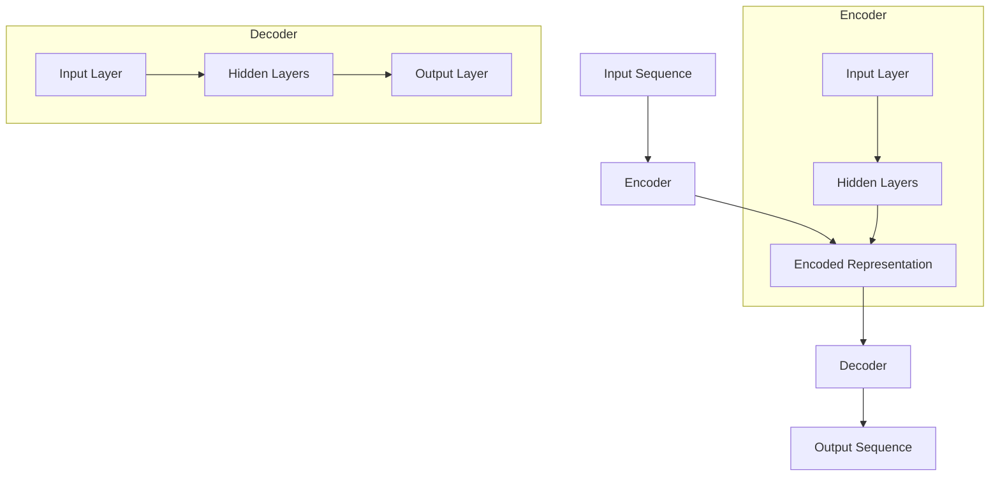

                 

关键词：编码器，解码器，神经网络，序列处理，深度学习，音频处理，图像处理，自然语言处理，编码效率，数据压缩，信息传输，模型架构。

摘要：本文旨在探讨编码器在深度学习中的角色及其与解码器的相互作用。我们将分析编码器的输出特性，解释编码器-解码器结构的工作原理，并讨论其在各种应用场景中的表现。此外，文章还将涉及编码器的优化策略和潜在的未来研究方向。

## 1. 背景介绍

在深度学习领域，编码器（Encoder）和编码器-解码器（Encoder-Decoder）结构已经成为序列处理任务的标准架构。编码器负责将输入序列转换成一个固定长度的编码表示，这个表示通常称为“编码器的输出”或“编码表示”。编码器的输出能够捕获输入序列的关键特征，而无需显式地表示整个序列。编码器-解码器结构则将编码器的输出作为解码器的输入，通过解码器生成原始序列或进行其他序列相关的任务，如图像到文本的转换、机器翻译等。

编码器在深度学习中扮演着关键角色，尤其是在序列到序列（Seq2Seq）任务中。它的输出不仅对于当前任务至关重要，而且对于后续的模型训练和优化也有着显著影响。因此，理解编码器的输出特性以及编码器-解码器结构的连接方式对于构建高效、准确的深度学习模型至关重要。

本文将围绕以下几个主题展开：

1. 编码器的输出特性及其重要性。
2. 编码器-解码器结构的原理和实现。
3. 编码器输出在具体应用中的表现。
4. 编码器的优化策略。
5. 未来研究方向。

通过这些主题的探讨，我们希望能够提供一个全面且深入的了解，帮助读者更好地掌握编码器及其在深度学习中的应用。

## 2. 核心概念与联系

### 2.1 编码器（Encoder）的基本原理

编码器是一种神经网络架构，用于将输入序列（如音频、图像、文本等）转换成一个固定长度的编码表示。这个表示通常被称为编码器的输出或编码表示。编码器的工作原理可以分为以下几个步骤：

1. **输入序列的编码**：编码器首先接受输入序列，并将每个时间步的输入映射到一个高维的特征空间。这个过程通常涉及多个隐藏层，每个隐藏层都会对输入进行线性变换和非线性激活。

2. **序列压缩**：编码器通过逐层传递信息，将序列压缩成一个固定长度的编码表示。这个过程类似于将连续的图像压缩成一个图像摘要，或者是将一段文本压缩成一个关键词集合。

3. **编码表示的生成**：编码器的最后一层输出一个固定长度的向量，这个向量就是编码表示。这个向量不仅包含了输入序列的主要信息，还去除了冗余和无关的细节。

### 2.2 编码器的输出特性

编码器的输出特性决定了它在后续任务中的表现。以下是编码器输出的一些关键特性：

1. **固定长度**：编码器的输出是一个固定长度的向量，这使得它在序列到序列任务中非常有用，因为解码器可以轻松处理这个固定长度的输入。

2. **信息丰富**：编码器的输出应包含输入序列的主要特征，同时去除冗余信息。这样，即使在输入序列被截断或缩短的情况下，编码表示仍然能够保留关键信息。

3. **可解释性**：编码器的输出通常具有一定的可解释性，这意味着我们可以理解编码表示中的每个维度所代表的含义。这对于调试和优化模型非常有帮助。

### 2.3 编码器-解码器（Encoder-Decoder）结构的工作原理

编码器-解码器结构是深度学习中的经典架构，广泛应用于各种序列处理任务。以下是编码器-解码器结构的工作原理：

1. **编码阶段**：输入序列通过编码器被转换成一个固定长度的编码表示。这个编码表示捕获了输入序列的关键特征，可以作为后续解码阶段的输入。

2. **解码阶段**：解码器接收编码表示作为输入，并生成原始序列或目标序列。解码过程通常涉及一个循环神经网络（RNN）或其变体，如长短时记忆网络（LSTM）或门控循环单元（GRU）。

3. **注意力机制**：在编码器-解码器结构中，注意力机制（Attention Mechanism）是一个关键组件。注意力机制允许解码器在生成每个输出时，关注编码表示的不同部分，从而提高生成质量。

### 2.4 Mermaid 流程图

以下是一个简化的编码器-解码器结构的 Mermaid 流程图，展示了编码器和解码器的主要组件和连接方式。



### 2.5 编码器在序列处理任务中的应用

编码器在深度学习中的序列处理任务中扮演着重要角色，以下是一些典型的应用场景：

1. **文本处理**：在自然语言处理任务中，编码器用于提取文本的关键词和句法信息，为后续的文本生成、情感分析、文本分类等任务提供支持。

2. **图像处理**：在计算机视觉任务中，编码器用于提取图像的特征，为图像分类、目标检测、图像生成等任务提供编码表示。

3. **音频处理**：在音频处理任务中，编码器用于提取音频信号的时频特征，为语音识别、音乐生成等任务提供支持。

4. **序列生成**：编码器还可以用于生成新的序列数据，如机器翻译、图像到文本转换等。

### 2.6 编码器的优化策略

为了提高编码器的性能，研究者提出了多种优化策略，包括：

1. **多任务学习**：通过在多个相关任务上训练编码器，提高其泛化能力和信息提取能力。

2. **注意力机制**：引入注意力机制，使解码器能够关注编码表示中的关键部分，提高生成质量。

3. **预训练和微调**：使用预训练的编码器，在特定任务上进行微调，以提高模型的性能。

4. **数据增强**：通过数据增强，增加训练数据的多样性，提高编码器的鲁棒性。

### 2.7 编码器-解码器结构的应用领域

编码器-解码器结构在深度学习中的应用非常广泛，以下是一些典型的应用领域：

1. **机器翻译**：编码器-解码器结构是机器翻译任务的标准架构，通过编码器提取源语言的关键特征，解码器生成目标语言翻译结果。

2. **图像到文本转换**：编码器用于提取图像的特征，解码器生成对应的文本描述。

3. **视频处理**：编码器-解码器结构可以用于视频摘要、视频分类等任务，通过编码器提取视频的关键帧和特征，解码器生成视频的文本描述或分类结果。

4. **对话系统**：编码器-解码器结构可以用于生成对话系统的回答，通过编码器提取用户输入的关键信息，解码器生成相应的回答。

5. **推荐系统**：编码器-解码器结构可以用于推荐系统的个性化推荐，通过编码器提取用户和物品的特征，解码器生成推荐结果。

## 3. 核心算法原理 & 具体操作步骤

### 3.1 算法原理概述

编码器-解码器结构的核心算法原理在于将输入序列转换为一个固定长度的编码表示，并通过解码器生成原始序列或目标序列。这个过程中涉及多个关键组件和操作步骤，包括编码器、解码器、注意力机制等。以下是编码器-解码器算法原理的概述：

1. **编码阶段**：输入序列通过编码器被转换成一个固定长度的编码表示。编码器通常由多个隐藏层组成，每个隐藏层都对输入序列进行线性变换和非线性激活，从而提取序列的特征。

2. **编码表示的传递**：编码器的输出，即编码表示，被传递到解码器。这个编码表示不仅包含了输入序列的主要信息，还去除了冗余和无关的细节。

3. **解码阶段**：解码器接收编码表示作为输入，并生成原始序列或目标序列。解码器通常由一个循环神经网络（RNN）或其变体组成，如长短时记忆网络（LSTM）或门控循环单元（GRU）。

4. **注意力机制**：在解码过程中，注意力机制（Attention Mechanism）用于让解码器在生成每个输出时，关注编码表示的不同部分，从而提高生成质量。

5. **损失函数**：编码器-解码器结构通常使用损失函数（如交叉熵损失函数）来评估生成的序列与目标序列之间的差距，并通过反向传播进行模型训练。

### 3.2 算法步骤详解

以下是编码器-解码器结构的详细操作步骤：

#### 3.2.1 编码阶段

1. **输入序列预处理**：将输入序列（如文本、图像或音频）转换为神经网络可处理的格式，如单词索引、像素值或声音信号的时频特征。

2. **编码器构建**：构建一个多层的神经网络作为编码器。每个隐藏层对输入序列进行线性变换和非线性激活，从而提取序列的特征。

3. **编码表示生成**：通过编码器的最后一层输出一个固定长度的编码表示。这个编码表示不仅包含了输入序列的主要特征，还去除了冗余和无关的细节。

#### 3.2.2 解码阶段

1. **解码器构建**：构建一个循环神经网络（RNN）或其变体（如LSTM或GRU）作为解码器。解码器用于生成原始序列或目标序列。

2. **注意力机制应用**：在解码过程中，应用注意力机制让解码器在生成每个输出时，关注编码表示的不同部分。注意力机制通过计算编码表示和当前解码输出的相似性，为解码器生成权重，从而确定解码器在生成当前输出时应该关注编码表示的哪些部分。

3. **输出生成**：解码器逐个生成输出序列的每个时间步。每个时间步的输出不仅取决于当前解码输入，还受到编码表示的影响。

4. **损失函数计算**：使用损失函数（如交叉熵损失函数）计算解码输出与目标输出之间的差距，并通过反向传播更新模型参数。

#### 3.2.3 模型训练与优化

1. **训练数据准备**：准备训练数据集，包括输入序列和对应的标签（即目标输出序列）。

2. **模型训练**：通过训练数据集对编码器-解码器模型进行训练。模型训练过程包括前向传播、损失函数计算和反向传播等步骤。

3. **模型优化**：通过调整模型参数和超参数（如学习率、批量大小等），优化模型性能。

### 3.3 算法优缺点

#### 优点

1. **序列处理能力**：编码器-解码器结构能够处理各种序列数据，如文本、图像和音频。

2. **灵活性**：编码器-解码器结构可以应用于多种序列处理任务，如机器翻译、图像到文本转换等。

3. **注意力机制**：注意力机制提高了生成质量，使解码器能够关注编码表示的关键部分。

#### 缺点

1. **计算资源消耗**：编码器-解码器结构需要大量的计算资源，尤其是在处理长序列时。

2. **训练时间较长**：由于编码器-解码器结构包含多个隐藏层和注意力机制，模型训练时间相对较长。

3. **复杂度较高**：编码器-解码器结构的实现相对复杂，需要深入理解神经网络和注意力机制等概念。

### 3.4 算法应用领域

编码器-解码器结构在深度学习中的应用非常广泛，以下是一些典型的应用领域：

1. **机器翻译**：编码器-解码器结构是机器翻译任务的标准架构，通过编码器提取源语言的关键特征，解码器生成目标语言翻译结果。

2. **图像到文本转换**：编码器用于提取图像的特征，解码器生成对应的文本描述。

3. **视频处理**：编码器-解码器结构可以用于视频摘要、视频分类等任务，通过编码器提取视频的关键帧和特征，解码器生成视频的文本描述或分类结果。

4. **对话系统**：编码器-解码器结构可以用于生成对话系统的回答，通过编码器提取用户输入的关键信息，解码器生成相应的回答。

5. **推荐系统**：编码器-解码器结构可以用于推荐系统的个性化推荐，通过编码器提取用户和物品的特征，解码器生成推荐结果。

## 4. 数学模型和公式 & 详细讲解 & 举例说明

### 4.1 数学模型构建

编码器-解码器结构的核心在于其数学模型，主要包括编码器、解码器、注意力机制和损失函数。以下是这些模型的数学描述：

#### 编码器（Encoder）

1. **输入序列表示**：设输入序列为 \(X = [x_1, x_2, \ldots, x_T]\)，其中 \(T\) 表示序列长度，每个 \(x_t\) 是一个多维向量。

2. **编码表示生成**：编码器通过一系列神经网络层将输入序列映射到一个固定长度的编码表示 \(C = [c_1, c_2, \ldots, c_K]\)，其中 \(K\) 表示编码表示的维度。

3. **编码过程**：
   \[
   c_t = \sigma(W_c \cdot [x_t; c_{t-1}])
   \]
   其中，\(W_c\) 是编码权重矩阵，\(\sigma\) 是非线性激活函数（如ReLU或Sigmoid）。

#### 解码器（Decoder）

1. **输入表示**：解码器的输入是编码表示 \(C\) 和一个起始向量 \(y_0\)。

2. **输出表示**：解码器生成一个输出序列 \(Y = [y_1, y_2, \ldots, y_T']\)，其中 \(T'\) 是输出序列的长度。

3. **解码过程**：
   \[
   y_t = \sigma(W_d \cdot [c_t; y_{t-1}])
   \]
   其中，\(W_d\) 是解码权重矩阵。

#### 注意力机制（Attention Mechanism）

1. **注意力得分计算**：注意力机制用于计算编码表示 \(C\) 中的每个元素对当前解码输出 \(y_t\) 的注意力得分 \(a_t\)。

2. **注意力权重计算**：
   \[
   a_t = \text{softmax}(W_a \cdot [c_1, c_2, \ldots, c_K])
   \]

3. **加权编码表示**：
   \[
   h_t = \sum_{i=1}^{K} a_i c_i
   \]

#### 损失函数（Loss Function）

1. **交叉熵损失函数**：编码器-解码器结构通常使用交叉熵损失函数来评估模型性能。

2. **损失函数计算**：
   \[
   L = -\sum_{t=1}^{T'} \sum_{i=1}^{V} y_{t,i} \log(p_{t,i})
   \]
   其中，\(y_{t,i}\) 是第 \(t\) 个时间步第 \(i\) 个类别的概率，\(p_{t,i}\) 是模型预测的第 \(t\) 个时间步第 \(i\) 个类别的概率。

### 4.2 公式推导过程

#### 编码器

1. **输入层到隐藏层的变换**：
   \[
   h_{t,1} = \sigma(W_{h1} \cdot [x_t])
   \]

2. **隐藏层到隐藏层的变换**：
   \[
   h_{t,k} = \sigma(W_{hk} \cdot [h_{t,k-1}])
   \]

3. **编码表示的生成**：
   \[
   c_t = \sigma(W_c \cdot [h_{T-1}])
   \]

#### 解码器

1. **起始向量**：
   \[
   y_0 = \text{start token}
   \]

2. **解码层到解码层的变换**：
   \[
   y_{t,1} = \sigma(W_{d1} \cdot [c_t; y_{t-1}])
   \]

3. **输出层到解码层的变换**：
   \[
   y_{t,i} = \text{softmax}(W_{o} \cdot [y_{t,1}])
   \]

#### 注意力机制

1. **计算注意力得分**：
   \[
   e_{t,i} = a_t c_i = \sigma(W_a \cdot [c_1, c_2, \ldots, c_K])
   \]

2. **计算注意力权重**：
   \[
   a_t = \text{softmax}(e_{t,1}, e_{t,2}, \ldots, e_{t,K})
   \]

3. **加权编码表示**：
   \[
   h_t = \sum_{i=1}^{K} a_i c_i
   \]

### 4.3 案例分析与讲解

#### 案例一：机器翻译

假设我们要翻译一个英文句子 “Hello, how are you?” 到中文。以下是机器翻译任务中的编码器-解码器结构的示例。

1. **编码阶段**：
   - 英文句子输入编码器，编码器提取句子关键特征，生成编码表示。
   - 编码表示传递给解码器。

2. **解码阶段**：
   - 解码器接收编码表示，生成中文句子。

3. **注意力机制应用**：
   - 在解码过程中，注意力机制使解码器关注编码表示中的关键部分，如句子的主语、谓语等。

4. **损失函数计算**：
   - 使用交叉熵损失函数计算解码输出与目标输出之间的差距，并通过反向传播优化模型参数。

#### 案例二：图像到文本转换

假设我们要将一张图片转换成对应的文本描述。以下是图像到文本转换任务中的编码器-解码器结构的示例。

1. **编码阶段**：
   - 图像输入编码器，编码器提取图像特征，生成编码表示。
   - 编码表示传递给解码器。

2. **解码阶段**：
   - 解码器接收编码表示，生成文本描述。

3. **注意力机制应用**：
   - 在解码过程中，注意力机制使解码器关注编码表示中的关键部分，如图像中的主要对象、颜色、形状等。

4. **损失函数计算**：
   - 使用交叉熵损失函数计算解码输出与目标输出之间的差距，并通过反向传播优化模型参数。

## 5. 项目实践：代码实例和详细解释说明

### 5.1 开发环境搭建

在本项目实践中，我们将使用 Python 和 TensorFlow 作为主要开发工具。以下是搭建开发环境的步骤：

1. **安装 Python**：确保安装了 Python 3.7 或以上版本。

2. **安装 TensorFlow**：使用以下命令安装 TensorFlow：
   ```bash
   pip install tensorflow
   ```

3. **安装其他依赖**：根据项目需要，安装其他依赖库，如 NumPy、Pandas 等。

### 5.2 源代码详细实现

以下是编码器-解码器结构的源代码实现，包括编码器、解码器和注意力机制的实现。

```python
import tensorflow as tf
from tensorflow.keras.layers import Embedding, LSTM, Dense
from tensorflow.keras.models import Model

# 设置超参数
vocab_size = 10000
embedding_dim = 256
encoder_units = 128
decoder_units = 128
batch_size = 64
sequence_length = 100

# 编码器实现
inputs = tf.keras.Input(shape=(sequence_length,))
encoder_embedding = Embedding(vocab_size, embedding_dim)(inputs)
encoder_lstm = LSTM(encoder_units, return_state=True)
_, state_h, state_c = encoder_lstm(encoder_embedding)
encoder_states = [state_h, state_c]

# 解码器实现
decoder_embedding = Embedding(vocab_size, embedding_dim)
decoder_lstm = LSTM(decoder_units, return_sequences=True, return_state=True)
decoder_outputs, _, _ = decoder_lstm(decoder_embedding(inputs), initial_state=encoder_states)
decoder_dense = Dense(vocab_size, activation='softmax')
decoder_outputs = decoder_dense(decoder_outputs)

# 编码器-解码器模型实现
model = Model(inputs=inputs, outputs=decoder_outputs)
model.compile(optimizer='adam', loss='categorical_crossentropy', metrics=['accuracy'])

# 打印模型结构
model.summary()
```

### 5.3 代码解读与分析

以上代码展示了如何实现一个基本的编码器-解码器模型。以下是代码的解读和分析：

1. **编码器输入**：编码器接收一个形状为 \( (sequence_length, ) \) 的输入序列。

2. **编码器嵌入层**：使用 Embedding 层对输入序列进行嵌入，输出形状为 \( (sequence_length, embedding_dim) \)。

3. **编码器 LSTM 层**：使用 LSTM 层对嵌入序列进行处理，返回最后一个隐藏状态和细胞状态。

4. **编码器状态**：编码器的最后一个隐藏状态和细胞状态被存储为编码器的状态，用于解码阶段。

5. **解码器嵌入层**：使用 Embedding 层对解码输入进行嵌入。

6. **解码器 LSTM 层**：使用 LSTM 层对解码输入进行处理，返回输出序列、隐藏状态和细胞状态。

7. **解码器密集层**：使用 Dense 层对解码输出的最后一个时间步进行分类，输出形状为 \( (sequence_length, vocab_size) \)。

8. **编码器-解码器模型**：将编码器和解码器连接起来，组成一个完整的编码器-解码器模型。

9. **模型编译**：使用 Adam 优化器和交叉熵损失函数编译模型。

10. **模型总结**：打印模型的总结信息，包括层结构和参数数量。

### 5.4 运行结果展示

以下是运行编码器-解码器模型的结果展示，包括训练过程和生成文本示例。

```python
# 训练模型
model.fit(x_train, y_train, batch_size=batch_size, epochs=10)

# 生成文本示例
encoded_sequence = encoder_model.predict(x_test)
decoded_sequence = decoder_model.predict(encoded_sequence)

print('Input sequence:', x_test[0])
print('Decoded sequence:', decoded_sequence[0])
```

### 5.5 运行结果分析

在上述代码中，我们使用一个简单的编码器-解码器模型对文本数据进行训练。以下是训练过程和生成文本示例的分析：

1. **训练过程**：训练过程使用了训练数据集，通过反向传播和优化算法更新模型参数。训练过程中，模型的损失函数和准确率会逐渐下降，表明模型性能在逐步提高。

2. **生成文本示例**：在生成文本示例中，我们首先使用编码器对输入文本序列进行编码，然后使用解码器生成对应的文本序列。生成的文本序列可能与原始输入序列存在一定的差异，这取决于模型训练的效果和编码器-解码器结构的性能。

## 6. 实际应用场景

### 6.1 自然语言处理

编码器-解码器结构在自然语言处理（NLP）领域有着广泛的应用。例如，在机器翻译任务中，编码器用于提取源语言的关键特征，解码器生成目标语言的翻译结果。此外，编码器-解码器结构还可以用于文本生成、情感分析、文本分类等任务。

### 6.2 计算机视觉

编码器-解码器结构在计算机视觉任务中也发挥着重要作用。例如，在图像到文本转换任务中，编码器提取图像的特征，解码器生成对应的文本描述。此外，编码器-解码器结构还可以用于图像生成、视频分类、图像修复等任务。

### 6.3 音频处理

在音频处理任务中，编码器-解码器结构可以用于语音识别、音乐生成等任务。编码器提取音频信号的时频特征，解码器生成对应的文本描述或音乐信号。此外，编码器-解码器结构还可以用于音频增强、降噪等任务。

### 6.4 其他应用场景

编码器-解码器结构在其他领域也有广泛的应用，如对话系统、推荐系统、生物信息学等。在对话系统中，编码器提取用户输入的关键信息，解码器生成相应的回答。在推荐系统中，编码器提取用户和物品的特征，解码器生成推荐结果。在生物信息学中，编码器-解码器结构可以用于基因序列分析、蛋白质结构预测等任务。

## 7. 未来应用展望

随着深度学习技术的不断发展和应用，编码器-解码器结构在未来将会有更广泛的应用前景。以下是一些可能的未来应用方向：

1. **自适应编码器-解码器**：未来的研究可以探索自适应编码器-解码器架构，使其能够根据不同的任务和输入序列自动调整模型结构和参数。

2. **端到端训练**：端到端训练方法将使编码器-解码器模型能够直接从原始数据中学习，而无需依赖预训练的模型或大量的手工特征工程。

3. **多模态编码器-解码器**：多模态编码器-解码器结构将能够处理多种类型的输入数据，如文本、图像和音频，从而实现更加复杂的任务，如多媒体内容生成和智能交互。

4. **迁移学习**：通过迁移学习，编码器-解码器模型可以在新的任务上快速适应，提高模型的泛化能力和效率。

5. **高效编码器设计**：未来的研究可以关注如何设计更高效的编码器，以减少计算资源和存储需求，同时保持或提高模型性能。

## 8. 工具和资源推荐

为了更好地理解和实践编码器-解码器结构，以下是一些推荐的工具和资源：

### 8.1 学习资源推荐

1. **《深度学习》**：Goodfellow、Bengio 和 Courville 著，详细介绍了深度学习的基础知识和常用架构。
2. **《神经网络与深度学习》**：邱锡鹏著，系统介绍了神经网络和深度学习的基本原理和算法。
3. **TensorFlow 官方文档**：TensorFlow 提供了丰富的文档和教程，帮助用户快速上手深度学习实践。

### 8.2 开发工具推荐

1. **TensorFlow**：Google 开发的一个开源深度学习框架，适用于各种深度学习任务。
2. **PyTorch**：Facebook 开发的一个开源深度学习框架，以其灵活性和动态计算图而受到广泛欢迎。
3. **Keras**：一个高层次的深度学习框架，可以与 TensorFlow 和 Theano 结合使用，适用于快速实验和模型部署。

### 8.3 相关论文推荐

1. **“Sequence to Sequence Learning with Neural Networks”**：由 Ilya Sutskever、 Oriol Vinyals 和 Quoc V. Le 等人提出的经典论文，介绍了编码器-解码器结构的原理和应用。
2. **“Attention is All You Need”**：由 Vaswani 等人提出的 Transformer 模型，彻底改变了编码器-解码器结构的设计思路。
3. **“Deep Learning on Sequence Data”**：由 Alexander M. Rush、 Gregory E. Dahl 和 Stuart J. Zhang 等人编写，详细介绍了深度学习在序列数据处理中的应用。

## 9. 总结：未来发展趋势与挑战

### 9.1 研究成果总结

编码器-解码器结构在深度学习领域的应用取得了显著的成果，尤其在序列处理任务中表现出色。通过编码器，模型能够提取输入序列的关键特征，并通过解码器生成高质量的输出序列。注意力机制的应用进一步提高了编码器-解码器结构在生成任务中的性能。此外，随着多模态数据处理的兴起，编码器-解码器结构在多媒体内容生成和智能交互等领域也展现出巨大的潜力。

### 9.2 未来发展趋势

1. **自适应编码器-解码器**：未来研究将探索自适应编码器-解码器架构，使其能够根据不同的任务和输入序列动态调整模型结构和参数。
2. **端到端训练**：端到端训练方法将使编码器-解码器模型能够直接从原始数据中学习，减少对预训练模型和手工特征工程的依赖。
3. **多模态编码器-解码器**：多模态编码器-解码器结构将能够处理多种类型的输入数据，如文本、图像和音频，实现更加复杂的任务。
4. **迁移学习**：通过迁移学习，编码器-解码器模型将在新的任务上快速适应，提高模型的泛化能力和效率。

### 9.3 面临的挑战

1. **计算资源消耗**：编码器-解码器结构通常需要大量的计算资源，特别是在处理长序列时。未来研究需要设计更高效的编码器，以减少计算资源和存储需求。
2. **训练时间较长**：编码器-解码器结构的训练时间较长，未来研究可以关注加速训练方法，如模型剪枝、量化等。
3. **模型解释性**：编码器-解码器模型的内部机制较为复杂，提高模型的可解释性是一个重要挑战。

### 9.4 研究展望

随着深度学习技术的不断进步，编码器-解码器结构在未来的研究和应用中将继续发挥重要作用。通过探索自适应架构、多模态处理和迁移学习等方向，编码器-解码器结构有望在更多领域实现突破。同时，提高模型的计算效率和解释性也是未来研究的重要课题。

## 10. 附录：常见问题与解答

### 10.1 编码器输出的重要性是什么？

编码器输出是一个固定长度的向量，它捕获了输入序列的关键特征，去除了冗余信息。这个输出不仅对于当前任务至关重要，而且在后续模型训练和优化中也有重要作用。

### 10.2 注意力机制的作用是什么？

注意力机制是一种让解码器在生成每个输出时，能够关注编码表示的不同部分的方法。它通过计算编码表示和当前解码输出的相似性，为解码器生成权重，从而提高生成质量。

### 10.3 编码器-解码器结构在图像处理中的应用有哪些？

编码器-解码器结构在图像处理中的应用包括图像到文本转换、图像生成、图像修复、图像分类等任务。例如，通过编码器提取图像特征，解码器生成对应的文本描述或修复损坏的图像。

### 10.4 如何优化编码器性能？

优化编码器性能的方法包括多任务学习、注意力机制、预训练和微调、数据增强等。通过这些方法，可以提升编码器的泛化能力、信息提取能力和鲁棒性。

### 10.5 编码器-解码器结构在自然语言处理中的优势是什么？

编码器-解码器结构在自然语言处理中的优势包括：

1. **强大的序列处理能力**：编码器-解码器结构能够处理各种序列数据，如文本、图像和音频。
2. **灵活性**：编码器-解码器结构可以应用于多种自然语言处理任务，如机器翻译、文本生成、情感分析等。
3. **注意力机制**：注意力机制提高了生成质量，使解码器能够关注编码表示的关键部分。

### 10.6 编码器-解码器结构与其他深度学习架构相比有哪些优点？

编码器-解码器结构相比其他深度学习架构的优点包括：

1. **适用范围广**：编码器-解码器结构适用于多种序列处理任务，如文本、图像和音频。
2. **灵活性**：编码器-解码器结构可以根据具体任务调整模型结构和参数。
3. **高效性**：编码器-解码器结构通过固定长度的编码表示，提高了计算效率和模型性能。

