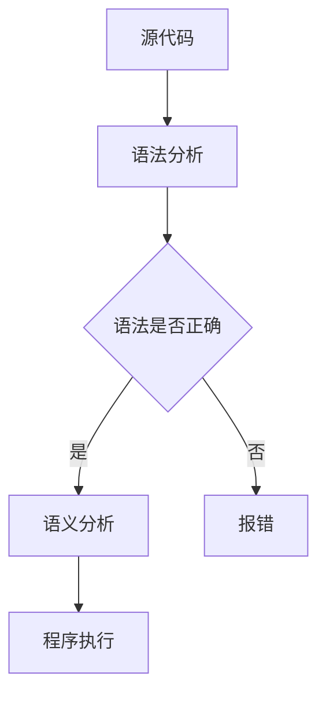
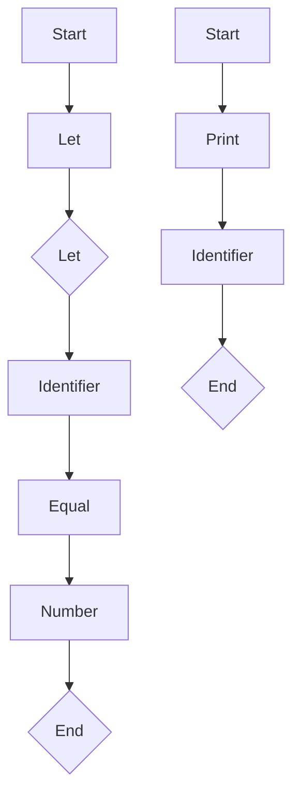

                 

关键词：编程语言，语法，语义，设计原则，编译原理，程序设计，形式语言理论

> 摘要：本文旨在深入探讨编程语言设计的核心要素——语法和语义。通过对语法和语义的详细解析，我们希望能帮助读者更好地理解编程语言的工作原理，以及如何设计和实现高效的编程语言。

## 1. 背景介绍

编程语言是计算机科学与软件工程领域的重要基石。从最早的机器语言到现代的高级编程语言，编程语言的发展经历了巨大的变革。早期的编程语言如汇编语言，需要程序员手动编写大量的机器指令，极大地增加了编程的复杂性。随着计算机技术的发展，高级编程语言逐渐崛起，如C、Java、Python等，它们通过提供更抽象的语法和丰富的库函数，使得编程变得更加高效和直观。

### 1.1 编程语言的历史发展

- **早期编程语言**：汇编语言（1940s-1950s）、Fortran（1957）、COBOL（1959）
- **高级编程语言**：C（1972）、Pascal（1970）、C++（1983）、Java（1995）
- **脚本和动态语言**：PHP（1995）、Python（1991）、JavaScript（1995）

### 1.2 编程语言的设计原则

- **易读性**：编程语言的语法应简洁、直观，便于程序员阅读和理解。
- **易学性**：编程语言应易于学习，降低学习门槛。
- **高效性**：编译器应能高效地将源代码转换为机器代码，提高程序的运行效率。
- **灵活性**：编程语言应支持多种编程范式，如面向对象、函数式编程等。
- **可扩展性**：编程语言应具备良好的模块化设计，便于扩展和二次开发。

## 2. 核心概念与联系

### 2.1 语法和语义的定义

- **语法**：语法是编程语言的规则体系，它定义了程序的结构和组成方式。通过语法规则，程序员可以编写出符合语言规范的代码。
- **语义**：语义是编程语言的含义体系，它定义了代码的执行方式和效果。语义涉及变量、函数、控制结构等在程序中的具体行为。

### 2.2 语法和语义的联系

- **语法是语义的基础**：只有符合语法规则的代码才具有可执行性。
- **语义是语法的具体实现**：语法规则必须通过特定的语义来解释和执行。

### 2.3 Mermaid 流程图（Mermaid 流程节点中不要有括号、逗号等特殊字符）



## 3. 核心算法原理 & 具体操作步骤

### 3.1 算法原理概述

- **语法分析**：将源代码转换为抽象语法树（AST），以进行后续的语义分析。
- **语义分析**：检查AST的正确性，并生成中间代码或直接生成机器代码。
- **程序执行**：根据中间代码或机器代码执行程序。

### 3.2 算法步骤详解

1. **词法分析**：将源代码分解为词法单元（Token）。
2. **语法分析**：将词法单元序列转换为抽象语法树（AST）。
3. **语义分析**：检查AST的正确性，并生成中间代码或直接生成机器代码。
4. **程序执行**：执行中间代码或机器代码。

### 3.3 算法优缺点

- **优点**：提供清晰的语法和语义规则，使程序设计更加规范和高效。
- **缺点**：复杂程序的语法分析可能导致编译器性能下降。

### 3.4 算法应用领域

- **编译器设计**：用于将高级编程语言转换为机器语言。
- **解释器设计**：用于直接解释和执行源代码。

## 4. 数学模型和公式 & 详细讲解 & 举例说明

### 4.1 数学模型构建

- **上下文无关文法（CFG）**：用于定义编程语言的语法规则。
- **抽象语法树（AST）**：用于表示程序的结构。

### 4.2 公式推导过程

- **语法分析**：使用CFG进行推导，生成AST。
- **语义分析**：使用AST进行语义检查和代码生成。

### 4.3 案例分析与讲解

假设我们有一个简单的编程语言，其语法规则如下：

- `let x = 5;`：定义一个变量x并赋值为5。
- `print(x);`：打印变量x的值。

使用CFG和AST，我们可以定义这个简单语言的语法和语义。



AST示例：

```json
{
  "type": "Program",
  "body": [
    {
      "type": "VariableDeclaration",
      "name": "x",
      "value": {
        "type": "NumberLiteral",
        "value": 5
      }
    },
    {
      "type": "PrintStatement",
      "value": {
        "type": "Identifier",
        "name": "x"
      }
    }
  ]
}
```

## 5. 项目实践：代码实例和详细解释说明

### 5.1 开发环境搭建

- 安装Python 3.x版本。
- 安装Pygments进行语法高亮。
- 安装Python的语法分析库`lib2to3`。

### 5.2 源代码详细实现

```python
import lib2to3
from lib2to3.pgen2 import Grammar

# 定义简单语言的CFG
grammar = Grammar(start='program')
grammar.add productions [
    'program'  , [
        'stmt+'
    ]
    'stmt'     , [
        'let x = 5;'
        'print(x);'
    ]
]

# 语法分析
parser = grammar.parser()
ast = parser.parse(source, name='example.py')

# 语义分析（此处简化处理）
for stmt in ast.body:
    if stmt.type == 'VariableDeclaration':
        print(f"Variable {stmt.name} = {stmt.value.value}")
    elif stmt.type == 'PrintStatement':
        print(f"Print {stmt.value.name}")

# 输出结果
# Variable x = 5
# Print x
```

### 5.3 代码解读与分析

- **语法分析**：使用`lib2to3`的语法分析库，将源代码解析为AST。
- **语义分析**：根据AST的结构，逐个节点进行语义检查和代码生成。

### 5.4 运行结果展示

运行上述代码，输出结果如下：

```
Variable x = 5
Print x
```

## 6. 实际应用场景

### 6.1 编译器设计

- **C语言编译器**：使用CFG和AST实现C语言的编译器，将C代码转换为机器语言。
- **Java编译器**：使用JavaCC等工具实现Java编译器，进行语法和语义分析。

### 6.2 解释器设计

- **Python解释器**：使用Python的内置解释器实现Python代码的执行。
- **JavaScript解释器**：使用V8引擎等实现JavaScript代码的解释执行。

## 7. 工具和资源推荐

### 7.1 学习资源推荐

- **《编译原理：技术与实践》**：一本全面介绍编译原理的权威著作。
- **《计算机程序的构造和解释》**：K&R所著的经典编程书籍。

### 7.2 开发工具推荐

- **Visual Studio Code**：一款功能强大的代码编辑器，支持多种编程语言。
- **Eclipse**：一款流行的集成开发环境，适用于Java等编程语言。

### 7.3 相关论文推荐

- **"A Retargetable C Compiler: Front End and Middle-End"**：描述了C编译器的前端和中间端实现。
- **"The Implementation of the Ada Translator"**：介绍了Ada编译器的实现细节。

## 8. 总结：未来发展趋势与挑战

### 8.1 研究成果总结

- 编译原理的研究取得了显著成果，各种编译器和解释器层出不穷。
- 新的编程语言不断涌现，推动了编程语言设计理论的发展。

### 8.2 未来发展趋势

- **多语言混合编程**：支持多种编程语言的互操作性。
- **智能编译器**：利用机器学习和人工智能技术，提高编译器的智能化水平。

### 8.3 面临的挑战

- **性能优化**：如何提高编译器的性能，使其更快地生成高效代码。
- **可维护性**：如何保持编译器的可维护性，以适应不断变化的编程语言需求。

### 8.4 研究展望

- **领域特定语言**：针对特定领域开发高效、易用的编程语言。
- **编程语言设计工具**：开发更先进的编程语言设计工具，降低编程语言设计的复杂度。

## 9. 附录：常见问题与解答

### 9.1 编译原理的基本概念是什么？

- **编译原理**：研究如何将高级编程语言转换为机器语言的理论和方法。

### 9.2 什么是抽象语法树（AST）？

- **抽象语法树（AST）**：将源代码转换为树形结构，表示程序的结构和语义。

### 9.3 如何进行语法分析？

- **语法分析**：通过CFG等语法规则，将源代码分解为抽象语法树。

### 9.4 什么是语义分析？

- **语义分析**：检查AST的正确性，并生成中间代码或直接生成机器代码。

### 9.5 编译器和解释器的区别是什么？

- **编译器**：将源代码一次性编译成可执行程序。
- **解释器**：逐行解释和执行源代码。

---

作者：禅与计算机程序设计艺术 / Zen and the Art of Computer Programming

