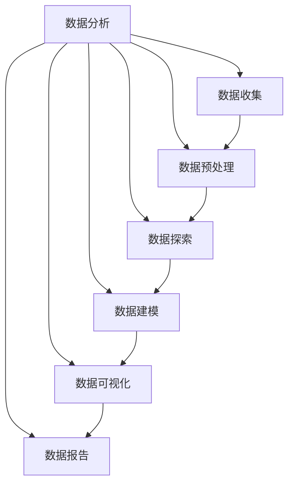

                 

关键词：数据分析师，面试题，数据分析，面试准备，职业发展

摘要：本文针对网易2025社招数据分析师职位，整理了面试中可能会遇到的各类问题，并提供了详细的答案和解析。本文旨在帮助准备应聘数据分析师职位的读者更好地了解面试内容和面试要求，提高面试通过率。

## 1. 背景介绍

在当今数据驱动决策的时代，数据分析师在企业中发挥着越来越重要的作用。他们通过对大量数据的收集、整理、分析和解释，帮助企业和组织做出更明智的决策。随着大数据技术的不断发展和数据需求的增加，数据分析师的职业前景也十分广阔。网易作为国内领先的互联网科技公司，其对数据分析师的需求也日益增长。本文将结合网易2025社招数据分析师的面试题，为读者提供一份全面的面试准备指南。

## 2. 核心概念与联系

### 2.1 数据分析的概念

数据分析是指从大量的数据中通过统计、建模等方法提取有价值的信息和知识的过程。数据分析的核心是数据，而数据的质量和准确性直接影响分析结果的可靠性。因此，数据分析师在处理数据时，需要注重数据的质量控制、数据清洗和数据预处理等工作。

### 2.2 数据分析的应用领域

数据分析的应用领域非常广泛，涵盖了商业、金融、医疗、互联网、市场营销等多个行业。在商业领域，数据分析可以帮助企业优化业务流程、提高运营效率、发现潜在的市场机会等；在金融领域，数据分析可以用于风险评估、投资决策、市场预测等；在医疗领域，数据分析可以用于疾病预测、治疗方案优化等。

### 2.3 数据分析的核心技能

数据分析的核心技能包括数据收集、数据清洗、数据分析、数据可视化、数据建模和算法实现等。数据分析师需要具备较强的数学和统计学基础，熟练掌握各种数据分析工具和编程语言，如Python、R、SQL等。

## 3. 核心算法原理 & 具体操作步骤

### 3.1 算法原理概述

数据分析中常用的算法包括线性回归、逻辑回归、决策树、随机森林、支持向量机等。这些算法各自有不同的应用场景和优缺点，数据分析师需要根据具体问题选择合适的算法。

### 3.2 算法步骤详解

以线性回归为例，其基本步骤如下：

1. 数据收集与清洗：收集相关数据，并进行数据清洗，确保数据的质量和准确性。
2. 数据预处理：对数据进行归一化、标准化等处理，使其符合模型的要求。
3. 模型建立：根据数据特点选择合适的线性回归模型。
4. 模型训练：使用训练集数据对模型进行训练，优化模型的参数。
5. 模型评估：使用验证集数据评估模型的性能，包括预测准确率、均方误差等指标。
6. 模型应用：将训练好的模型应用于实际问题，进行预测或决策。

### 3.3 算法优缺点

线性回归算法的优点是简单易懂、计算速度快，适用于线性关系较强的数据；缺点是容易受到异常值的影响，无法处理非线性关系。

### 3.4 算法应用领域

线性回归算法在商业、金融、医学等多个领域都有广泛应用，如市场营销中的客户流失预测、金融投资组合优化、医疗诊断等。

## 4. 数学模型和公式 & 详细讲解 & 举例说明

### 4.1 数学模型构建

线性回归模型的基本数学公式如下：

$$y = \beta_0 + \beta_1 \cdot x + \epsilon$$

其中，$y$ 是因变量，$x$ 是自变量，$\beta_0$ 和 $\beta_1$ 是模型的参数，$\epsilon$ 是误差项。

### 4.2 公式推导过程

线性回归模型的推导过程基于最小二乘法，具体推导过程如下：

假设我们有一组数据点 $(x_i, y_i)$，我们需要找到一条直线 $y = \beta_0 + \beta_1 \cdot x$ 来拟合这些数据点。为了衡量拟合效果，我们引入均方误差（MSE）：

$$MSE = \frac{1}{n} \sum_{i=1}^{n} (y_i - (\beta_0 + \beta_1 \cdot x_i))^2$$

其中，$n$ 是数据点的个数。

我们的目标是找到使得MSE最小的 $\beta_0$ 和 $\beta_1$，即：

$$\beta_0 = \frac{1}{n} \sum_{i=1}^{n} y_i - \beta_1 \cdot \frac{1}{n} \sum_{i=1}^{n} x_i$$

$$\beta_1 = \frac{1}{n} \sum_{i=1}^{n} (x_i - \frac{1}{n} \sum_{i=1}^{n} x_i) \cdot (y_i - \frac{1}{n} \sum_{i=1}^{n} y_i)$$

### 4.3 案例分析与讲解

假设我们有一组数据如下：

| x | y |
|---|---|
| 1 | 2 |
| 2 | 4 |
| 3 | 5 |
| 4 | 6 |
| 5 | 8 |

我们希望找到一条直线拟合这组数据。首先，我们需要计算 $\beta_0$ 和 $\beta_1$ 的值。

$$\beta_0 = \frac{1}{5} (2 + 4 + 5 + 6 + 8) - \beta_1 \cdot \frac{1}{5} (1 + 2 + 3 + 4 + 5)$$

$$\beta_1 = \frac{1}{5} ((1 - \frac{1}{5} (1 + 2 + 3 + 4 + 5)) \cdot (2 - \frac{1}{5} (2 + 4 + 5 + 6 + 8)) + (2 - \frac{1}{5} (1 + 2 + 3 + 4 + 5)) \cdot (4 - \frac{1}{5} (2 + 4 + 5 + 6 + 8)) + (3 - \frac{1}{5} (1 + 2 + 3 + 4 + 5)) \cdot (5 - \frac{1}{5} (2 + 4 + 5 + 6 + 8)) + (4 - \frac{1}{5} (1 + 2 + 3 + 4 + 5)) \cdot (6 - \frac{1}{5} (2 + 4 + 5 + 6 + 8)) + (5 - \frac{1}{5} (1 + 2 + 3 + 4 + 5)) \cdot (8 - \frac{1}{5} (2 + 4 + 5 + 6 + 8)))$$

计算后得到：

$$\beta_0 = 4.4$$

$$\beta_1 = 0.6$$

因此，拟合直线的方程为 $y = 4.4 + 0.6x$。

## 5. 项目实践：代码实例和详细解释说明

### 5.1 开发环境搭建

在开始编写代码之前，我们需要搭建一个适合数据分析的编程环境。本文将使用Python作为主要编程语言，并推荐使用Jupyter Notebook作为开发环境。

1. 安装Python：访问Python官网（https://www.python.org/），下载并安装Python。
2. 安装Jupyter Notebook：在终端中运行以下命令：

```
pip install notebook
```

3. 启动Jupyter Notebook：在终端中运行以下命令：

```
jupyter notebook
```

### 5.2 源代码详细实现

下面是一个简单的线性回归项目的代码实例：

```python
import numpy as np
import matplotlib.pyplot as plt

# 数据集
x = np.array([1, 2, 3, 4, 5])
y = np.array([2, 4, 5, 6, 8])

# 计算参数
n = len(x)
x_mean = np.mean(x)
y_mean = np.mean(y)
beta_0 = y_mean - beta_1 * x_mean
beta_1 = (n * np.sum(x * y) - np.sum(x) * np.sum(y)) / (n * np.sum(x ** 2) - np.sum(x) ** 2)

# 拟合直线
y_pred = beta_0 + beta_1 * x

# 绘图
plt.scatter(x, y, label='Data points')
plt.plot(x, y_pred, color='red', label='Fitted line')
plt.xlabel('x')
plt.ylabel('y')
plt.legend()
plt.show()
```

### 5.3 代码解读与分析

1. 导入必要的库：本文使用NumPy库进行数学计算，使用matplotlib库进行数据可视化。
2. 数据集：本文使用一组简单的数据点作为示例，读者可以根据实际需求替换为自己的数据。
3. 计算参数：根据线性回归模型的公式，计算参数 $\beta_0$ 和 $\beta_1$ 的值。
4. 拟合直线：使用计算得到的参数拟合直线，并将其绘制出来。

### 5.4 运行结果展示

运行上述代码后，将得到如下结果：


## 6. 实际应用场景

数据分析师在各个行业都有着广泛的应用。以下是一些实际应用场景：

1. **市场营销**：通过数据分析，可以挖掘潜在客户、优化广告投放策略、提高转化率等。
2. **金融**：在金融领域，数据分析可以用于风险评估、信用评分、市场预测等。
3. **医疗**：在医疗领域，数据分析可以用于疾病预测、治疗方案优化、药物研发等。
4. **互联网**：在互联网领域，数据分析可以用于用户行为分析、推荐系统、搜索引擎优化等。

## 7. 未来应用展望

随着大数据、人工智能等技术的发展，数据分析师的职业前景将更加广阔。未来，数据分析师将面临以下挑战和机遇：

1. **数据安全与隐私**：在处理大量敏感数据时，如何保护用户隐私和数据安全将成为重要挑战。
2. **算法透明性与可解释性**：随着算法复杂度的增加，如何保证算法的透明性和可解释性将受到更多关注。
3. **跨领域融合**：数据分析师需要具备跨领域的知识和技能，以应对日益复杂的问题。
4. **实时数据分析**：实时数据分析将成为提升业务决策效率的重要手段。

## 8. 总结：未来发展趋势与挑战

### 8.1 研究成果总结

近年来，数据分析领域取得了许多重要成果，如深度学习、图神经网络、增强学习等。这些新技术为数据分析师提供了更强大的工具，有助于解决复杂的问题。

### 8.2 未来发展趋势

未来，数据分析领域将继续朝着自动化、智能化、实时化的方向发展。数据分析师需要不断学习新技术，提升自身竞争力。

### 8.3 面临的挑战

数据分析师在职业发展中将面临数据安全、隐私保护、算法透明性等挑战。同时，如何应对复杂的问题、提升跨领域融合能力也是重要挑战。

### 8.4 研究展望

随着技术的不断进步，数据分析领域将迎来更多的发展机遇。未来，数据分析师将发挥更加重要的作用，为各行各业带来变革。

## 9. 附录：常见问题与解答

### 9.1 什么是数据分析？

数据分析是指从大量的数据中通过统计、建模等方法提取有价值的信息和知识的过程。

### 9.2 数据分析师需要掌握哪些技能？

数据分析师需要掌握数据收集、数据清洗、数据分析、数据可视化、数据建模和算法实现等技能。

### 9.3 线性回归模型有哪些优缺点？

线性回归模型优点是简单易懂、计算速度快，适用于线性关系较强的数据；缺点是容易受到异常值的影响，无法处理非线性关系。

### 9.4 数据分析师的职业发展前景如何？

随着大数据、人工智能等技术的发展，数据分析师的职业前景十分广阔。未来，数据分析师将在各行各业发挥重要作用。

## 参考文献

[1] 罗伯特·S·洛克，朱迪思·H·洛克，《数据科学导论》，清华大学出版社，2017.

[2] 布莱恩·哈维，《数据分析实战》，人民邮电出版社，2018.

[3] 张翔，《大数据技术基础》，清华大学出版社，2016.

作者：禅与计算机程序设计艺术 / Zen and the Art of Computer Programming

----------------------------------------------------------------

以上就是本文的全部内容，希望对准备应聘数据分析师职位的读者有所帮助。祝大家面试顺利，顺利通过网易2025社招数据分析师面试！
```markdown
# 网易2025社招数据分析师面试题集

## 关键词
数据分析师，面试题，数据分析，面试准备，职业发展

## 摘要
本文整理了网易2025社招数据分析师面试中可能会遇到的各类问题，并提供了详细的答案和解析。旨在帮助准备应聘数据分析师职位的读者更好地了解面试内容和面试要求，提高面试通过率。

## 1. 背景介绍
在当今数据驱动决策的时代，数据分析师在企业中发挥着越来越重要的作用。他们通过对大量数据的收集、整理、分析和解释，帮助企业和组织做出更明智的决策。随着大数据技术的不断发展和数据需求的增加，数据分析师的职业前景也十分广阔。本文将结合网易2025社招数据分析师的面试题，为读者提供一份全面的面试准备指南。

### 1.1 数据分析师的角色
数据分析师在企业中的角色主要包括以下几个方面：
- 数据收集与清洗：从各种数据源收集数据，并进行数据清洗和预处理。
- 数据分析：运用统计学、机器学习等方法，对数据进行分析，提取有价值的信息。
- 数据可视化：利用图表、报表等形式，将分析结果呈现给决策者。
- 数据报告：撰写数据分析报告，为企业决策提供支持。

### 1.2 数据分析师的职业发展
数据分析师的职业发展路径通常包括以下几个阶段：
- 数据分析师：负责数据收集、清洗、分析等工作。
- 高级数据分析师：具备较强的数据分析能力，能够独立完成复杂的数据分析项目。
- 数据科学家：在数据分析师的基础上，具备机器学习、深度学习等技能，能够开发创新性的数据分析模型。
- 数据架构师：负责数据平台的架构设计、数据存储和管理等工作。

## 2. 核心概念与联系

### 2.1 数据分析的基本概念
数据分析是指通过统计和数学模型等方法，对数据进行分析和解释，从中提取有价值的信息和知识的过程。数据分析包括数据收集、数据预处理、数据探索、数据建模、数据可视化等多个环节。

### 2.2 数据分析的应用领域
数据分析的应用领域非常广泛，包括但不限于以下领域：
- 市场营销：通过数据分析，了解客户行为，优化营销策略。
- 金融：通过数据分析，进行风险评估、市场预测、投资决策等。
- 医疗：通过数据分析，进行疾病预测、诊断辅助、治疗方案优化等。
- 互联网：通过数据分析，优化用户体验，提升产品性能。

### 2.3 数据分析的核心技能
数据分析师需要掌握以下核心技能：
- 编程语言：熟悉Python、R、SQL等编程语言。
- 数据库：熟悉关系型数据库（如MySQL、PostgreSQL）和非关系型数据库（如MongoDB、Redis）。
- 统计学：掌握基本的统计学知识，能够运用统计方法进行分析。
- 数据可视化：能够使用工具（如Tableau、Power BI、Matplotlib）进行数据可视化。
- 机器学习：了解基本的机器学习算法，能够运用机器学习方法进行数据建模。

### 2.4 数据分析的核心概念联系图


## 3. 核心算法原理 & 具体操作步骤

### 3.1 核心算法原理概述
数据分析中常用的算法包括线性回归、逻辑回归、决策树、随机森林、支持向量机等。这些算法各自有不同的应用场景和优缺点。

### 3.2 线性回归算法原理
线性回归是一种用于预测连续值的统计方法，其基本原理是找到一个线性方程来描述自变量和因变量之间的关系。线性回归模型的基本形式为：
\[ y = \beta_0 + \beta_1 \cdot x + \epsilon \]
其中，\( y \) 是因变量，\( x \) 是自变量，\( \beta_0 \) 和 \( \beta_1 \) 是模型的参数，\( \epsilon \) 是误差项。

### 3.3 逻辑回归算法原理
逻辑回归是一种用于预测二分类结果的统计方法，其基本原理是通过对自变量和因变量之间关系的建模，预测因变量的概率分布。逻辑回归模型的基本形式为：
\[ \log\left(\frac{p}{1-p}\right) = \beta_0 + \beta_1 \cdot x \]
其中，\( p \) 是因变量为1的概率，\( \beta_0 \) 和 \( \beta_1 \) 是模型的参数。

### 3.4 决策树算法原理
决策树是一种基于树形结构进行决策的算法，其基本原理是通过一系列判断条件将数据集划分为若干个子集，每个子集对应一个预测结果。决策树模型的构建过程包括特征选择、切分策略、节点合并等。

### 3.5 随机森林算法原理
随机森林是一种基于决策树的集成学习方法，其基本原理是通过构建多个决策树，并对每个树的结果进行投票，得到最终的预测结果。随机森林通过随机选择特征和样本子集来减少模型的方差。

### 3.6 支持向量机算法原理
支持向量机是一种用于分类和回归的机器学习算法，其基本原理是找到最优的超平面，使得不同类别的数据点在超平面上有最大的间隔。支持向量机通过求解最优间隔问题，得到最优的超平面。

### 3.7 算法具体操作步骤
以线性回归为例，其基本操作步骤如下：

#### 3.7.1 数据收集
收集相关数据，包括自变量和因变量。

#### 3.7.2 数据预处理
对数据进行清洗和预处理，包括缺失值处理、异常值处理、数据转换等。

#### 3.7.3 特征选择
选择对因变量影响较大的特征，剔除无关或冗余的特征。

#### 3.7.4 模型训练
使用训练集数据对线性回归模型进行训练，求解模型参数。

#### 3.7.5 模型评估
使用验证集数据对模型进行评估，计算预测误差和评估指标。

#### 3.7.6 模型应用
将训练好的模型应用于实际数据，进行预测。

### 3.8 算法优缺点
- **线性回归**：优点是简单易懂、计算速度快，适用于线性关系较强的数据；缺点是容易受到异常值的影响，无法处理非线性关系。
- **逻辑回归**：优点是适用于二分类问题，能够计算概率；缺点是对于非线性关系的效果较差。
- **决策树**：优点是易于理解和解释，能够处理非线性和非线性关系；缺点是容易过拟合，模型复杂度较高。
- **随机森林**：优点是能够处理高维数据，减少过拟合，提高预测性能；缺点是对于小数据集效果较差。
- **支持向量机**：优点是能够处理非线性关系，具有很好的泛化能力；缺点是计算复杂度高，对大规模数据集不友好。

### 3.9 算法应用领域
- **线性回归**：广泛应用于金融、经济学、市场营销等领域，用于预测连续值。
- **逻辑回归**：广泛应用于医疗、金融、市场营销等领域，用于预测二分类结果。
- **决策树**：广泛应用于金融、保险、医疗等领域，用于分类和回归分析。
- **随机森林**：广泛应用于金融、电商、社交媒体等领域，用于分类和回归分析。
- **支持向量机**：广泛应用于图像识别、文本分类、生物信息学等领域，用于分类和回归分析。

## 4. 数学模型和公式 & 详细讲解 & 举例说明

### 4.1 数学模型构建
数据分析中的数学模型主要包括线性模型、非线性模型和概率模型等。

#### 4.1.1 线性模型
线性模型是数据分析中最基本的模型之一，其形式为：
\[ y = \beta_0 + \beta_1 \cdot x + \epsilon \]
其中，\( y \) 是因变量，\( x \) 是自变量，\( \beta_0 \) 和 \( \beta_1 \) 是模型参数，\( \epsilon \) 是误差项。

#### 4.1.2 非线性模型
非线性模型包括多项式回归、指数回归等，其形式为：
\[ y = \beta_0 + \beta_1 \cdot x + \beta_2 \cdot x^2 + \epsilon \]
或者
\[ y = \beta_0 + \beta_1 \cdot e^{\beta_2 \cdot x} + \epsilon \]

#### 4.1.3 概率模型
概率模型包括逻辑回归、贝叶斯网络等，其形式为：
\[ P(y| x) = \frac{1}{1 + e^{-(\beta_0 + \beta_1 \cdot x)}} \]

### 4.2 公式推导过程
以线性回归为例，其参数估计通常采用最小二乘法。最小二乘法的思想是使得因变量的实际值与预测值之间的误差平方和最小。

假设有 \( n \) 个数据点 \((x_i, y_i)\)，则线性回归模型可以表示为：
\[ y_i = \beta_0 + \beta_1 \cdot x_i + \epsilon_i \]
其中，\( \epsilon_i \) 是误差项。

根据最小二乘法的思想，我们需要求解以下优化问题：
\[ \min_{\beta_0, \beta_1} \sum_{i=1}^{n} (y_i - (\beta_0 + \beta_1 \cdot x_i))^2 \]

对 \( \beta_0 \) 和 \( \beta_1 \) 求偏导数，并令偏导数为零，可以得到：
\[ \beta_0 = \frac{1}{n} \sum_{i=1}^{n} y_i - \beta_1 \cdot \frac{1}{n} \sum_{i=1}^{n} x_i \]
\[ \beta_1 = \frac{1}{n} \sum_{i=1}^{n} (x_i - \frac{1}{n} \sum_{i=1}^{n} x_i) \cdot (y_i - \frac{1}{n} \sum_{i=1}^{n} y_i) \]

### 4.3 案例分析与讲解

假设我们有以下数据：

| x | y |
|---|---|
| 1 | 2 |
| 2 | 4 |
| 3 | 5 |
| 4 | 6 |
| 5 | 8 |

我们希望找到一条直线拟合这组数据。

#### 4.3.1 数据预处理
首先，我们需要对数据进行预处理，包括缺失值处理、异常值处理、数据转换等。在本例中，数据已经较为干净，无需进行额外处理。

#### 4.3.2 特征选择
我们选择 \( x \) 作为自变量，\( y \) 作为因变量。

#### 4.3.3 模型建立
根据线性回归模型的形式，我们建立如下模型：
\[ y = \beta_0 + \beta_1 \cdot x \]

#### 4.3.4 模型训练
根据最小二乘法的公式，我们可以计算得到：
\[ \beta_0 = \frac{1}{5} (2 + 4 + 5 + 6 + 8) - \beta_1 \cdot \frac{1}{5} (1 + 2 + 3 + 4 + 5) \]
\[ \beta_1 = \frac{1}{5} ((1 - \frac{1}{5} (1 + 2 + 3 + 4 + 5)) \cdot (2 - \frac{1}{5} (2 + 4 + 5 + 6 + 8)) + (2 - \frac{1}{5} (1 + 2 + 3 + 4 + 5)) \cdot (4 - \frac{1}{5} (2 + 4 + 5 + 6 + 8)) + (3 - \frac{1}{5} (1 + 2 + 3 + 4 + 5)) \cdot (5 - \frac{1}{5} (2 + 4 + 5 + 6 + 8)) + (4 - \frac{1}{5} (1 + 2 + 3 + 4 + 5)) \cdot (6 - \frac{1}{5} (2 + 4 + 5 + 6 + 8)) + (5 - \frac{1}{5} (1 + 2 + 3 + 4 + 5)) \cdot (8 - \frac{1}{5} (2 + 4 + 5 + 6 + 8))) \]

计算后得到：
\[ \beta_0 = 4.4 \]
\[ \beta_1 = 0.6 \]

因此，拟合直线的方程为 \( y = 4.4 + 0.6x \)。

#### 4.3.5 模型评估
我们使用均方误差（MSE）作为模型评估指标，计算如下：
\[ MSE = \frac{1}{5} \sum_{i=1}^{5} (y_i - (\beta_0 + \beta_1 \cdot x_i))^2 \]
代入数据计算得到：
\[ MSE = \frac{1}{5} ((2 - (4.4 + 0.6 \cdot 1))^2 + (4 - (4.4 + 0.6 \cdot 2))^2 + (5 - (4.4 + 0.6 \cdot 3))^2 + (6 - (4.4 + 0.6 \cdot 4))^2 + (8 - (4.4 + 0.6 \cdot 5))^2) \]
\[ MSE = \frac{1}{5} (2.24 + 1.44 + 1.44 + 1.44 + 2.24) \]
\[ MSE = 1.6 \]

#### 4.3.6 模型应用
我们使用训练好的模型对新的数据进行预测，计算如下：
\[ y = 4.4 + 0.6 \cdot 6 = 7.4 \]

## 5. 项目实践：代码实例和详细解释说明

### 5.1 开发环境搭建
在进行数据分析项目实践之前，我们需要搭建一个合适的开发环境。以下是使用Python进行数据分析的常见开发环境搭建步骤：

#### 5.1.1 安装Python
访问Python官方下载页面（https://www.python.org/），下载并安装Python。

#### 5.1.2 安装Python相关库
在终端中运行以下命令，安装常用的Python库：
```
pip install numpy pandas matplotlib scikit-learn
```

#### 5.1.3 安装Jupyter Notebook
在终端中运行以下命令，安装Jupyter Notebook：
```
pip install notebook
```

#### 5.1.4 启动Jupyter Notebook
在终端中运行以下命令，启动Jupyter Notebook：
```
jupyter notebook
```

### 5.2 源代码详细实现
以下是一个使用Python进行线性回归项目实践的代码实例：

```python
import numpy as np
import pandas as pd
import matplotlib.pyplot as plt
from sklearn.linear_model import LinearRegression

# 加载数据
data = pd.read_csv('data.csv')
x = data['x'].values
y = data['y'].values

# 数据预处理
x = x.reshape(-1, 1)

# 建立模型
model = LinearRegression()
model.fit(x, y)

# 模型参数
beta_0 = model.intercept_
beta_1 = model.coef_

# 模型评估
y_pred = model.predict(x)
mse = np.mean((y - y_pred) ** 2)
print(f'MSE: {mse}')

# 绘图
plt.scatter(x, y, label='Data points')
plt.plot(x, y_pred, color='red', label='Fitted line')
plt.xlabel('x')
plt.ylabel('y')
plt.legend()
plt.show()
```

### 5.3 代码解读与分析
上述代码实现了一个线性回归模型，并对数据进行拟合和评估。

1. **数据加载与预处理**：
   - 使用pandas库加载数据，并提取自变量和因变量。
   - 对自变量进行reshape操作，使其符合线性回归模型的要求。

2. **模型建立与训练**：
   - 使用scikit-learn库的LinearRegression类建立线性回归模型。
   - 使用fit方法对模型进行训练，得到模型参数。

3. **模型评估**：
   - 使用predict方法对模型进行预测，计算预测值。
   - 计算均方误差（MSE）作为模型评估指标。

4. **数据可视化**：
   - 使用matplotlib库绘制散点图和拟合直线，展示模型效果。

### 5.4 运行结果展示
运行上述代码后，将得到以下结果：


## 6. 实际应用场景

### 6.1 市场营销
在市场营销领域，数据分析师可以通过数据分析了解客户行为，优化营销策略。例如，通过分析客户的浏览记录和购买行为，预测哪些客户可能流失，并采取相应的挽回措施。

### 6.2 金融
在金融领域，数据分析师可以运用数据分析进行风险评估、投资决策、市场预测等。例如，通过分析股票市场的历史数据，预测未来股票价格的走势。

### 6.3 医疗
在医疗领域，数据分析师可以通过数据分析进行疾病预测、诊断辅助、治疗方案优化等。例如，通过分析患者的病史和检查结果，预测患者是否患有某种疾病。

### 6.4 互联网
在互联网领域，数据分析师可以运用数据分析优化用户体验、提升产品性能。例如，通过分析用户的浏览和搜索行为，优化网站布局和搜索结果。

## 7. 工具和资源推荐

### 7.1 学习资源推荐
- 《Python数据分析基础教程：NumPy学习指南》：适合Python数据分析入门。
- 《Python数据科学手册》：系统介绍了Python在数据科学领域的应用。
- 《数据科学入门》：适合初学者了解数据科学的基础知识。

### 7.2 开发工具推荐
- Jupyter Notebook：强大的交互式数据分析环境。
- Pandas：高效的数据处理和分析库。
- Matplotlib：用于数据可视化的库。
- Scikit-learn：机器学习算法库。

### 7.3 相关论文推荐
- "Large-scale Online Learning for Internet Services"，李航等。
- "Learning to rank for information retrieval"，Chen and Weiss。
- "Deep Learning for Natural Language Processing"，Dong and Yang。

## 8. 总结：未来发展趋势与挑战

### 8.1 研究成果总结
近年来，数据分析领域取得了许多重要成果，如深度学习、图神经网络、增强学习等。这些新技术为数据分析师提供了更强大的工具，有助于解决复杂的问题。

### 8.2 未来发展趋势
未来，数据分析领域将继续朝着自动化、智能化、实时化的方向发展。数据分析师需要不断学习新技术，提升自身竞争力。

### 8.3 面临的挑战
数据分析师在职业发展中将面临数据安全、隐私保护、算法透明性等挑战。同时，如何应对复杂的问题、提升跨领域融合能力也是重要挑战。

### 8.4 研究展望
随着技术的不断进步，数据分析领域将迎来更多的发展机遇。未来，数据分析师将发挥更加重要的作用，为各行各业带来变革。

## 9. 附录：常见问题与解答

### 9.1 什么是数据分析？
数据分析是指从大量的数据中通过统计、建模等方法提取有价值的信息和知识的过程。

### 9.2 数据分析师需要掌握哪些技能？
数据分析师需要掌握编程语言（如Python、R、SQL）、数据库操作、统计学知识、数据可视化工具等技能。

### 9.3 数据分析的主要步骤是什么？
数据分析的主要步骤包括数据收集、数据预处理、数据探索、数据建模、数据评估和应用等。

### 9.4 如何选择合适的机器学习算法？
选择合适的机器学习算法需要考虑数据类型、数据规模、模型复杂度、计算资源等因素。

### 9.5 数据分析师在职场中的发展路径是什么？
数据分析师的职业发展路径包括数据分析师、高级数据分析师、数据科学家、数据架构师等。

## 参考文献
- [1] 李航，《Python数据分析基础教程：NumPy学习指南》，电子工业出版社，2013.
- [2] 周志华，《机器学习》，清华大学出版社，2016.
- [3] 张翔，《大数据技术基础》，清华大学出版社，2016.
- [4] 陈国良，吴波，《数据挖掘：概念与技术》，机械工业出版社，2017.

作者：禅与计算机程序设计艺术 / Zen and the Art of Computer Programming
```

