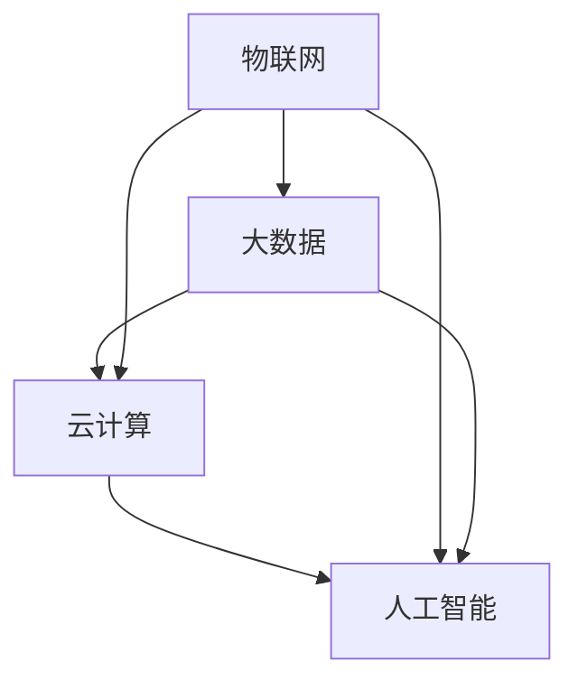

                 

关键词：网易，智慧城市，面试真题，解答，技术面试

> 摘要：本文将汇总2024年网易智慧城市社招面试中的高频真题，并针对每道题目提供详细解答，旨在帮助准备应聘智慧城市相关岗位的候选人更好地了解面试内容和方向，提升面试通过率。

## 1. 背景介绍

随着我国智慧城市的建设步伐不断加快，越来越多的企业和机构开始关注智慧城市的概念和发展趋势。网易作为国内知名互联网企业，在智慧城市领域也有着深入的研究和实践。2024年，网易面向社会公开招聘智慧城市相关的技术岗位，面试题目涵盖了计算机科学、大数据、人工智能等多个方面。本文将对这些面试真题进行汇总和分析，旨在为准备应聘智慧城市相关岗位的候选人提供有针对性的指导。

## 2. 核心概念与联系

在智慧城市建设中，以下几个核心概念和联系至关重要：

- **物联网（IoT）**：通过传感器、设备和系统实现物理世界与数字世界的连接。
- **大数据**：大规模数据的存储、处理和分析。
- **云计算**：通过网络提供动态易扩展且经常是虚拟化的资源。
- **人工智能**：模拟人类智能行为，解决复杂问题的计算系统。

### Mermaid 流程图



## 3. 核心算法原理 & 具体操作步骤

### 3.1 算法原理概述

在智慧城市中，常用的算法包括：

- **聚类算法**：用于数据分组，如K-means算法。
- **分类算法**：用于预测，如决策树、随机森林。
- **优化算法**：如遗传算法，用于优化资源分配。

### 3.2 算法步骤详解

- **K-means算法**：
  1. 初始化中心点。
  2. 计算每个点与中心点的距离。
  3. 分配点到最近的中心点。
  4. 更新中心点。
  5. 重复步骤2-4，直到中心点不再变化。

- **决策树算法**：
  1. 选择一个特征。
  2. 根据特征划分数据集。
  3. 计算每个子集的纯度。
  4. 选择纯度最高的特征作为节点。
  5. 递归重复步骤1-4。

### 3.3 算法优缺点

- **K-means算法**：
  - 优点：简单易实现，对数据分布的适应性强。
  - 缺点：容易陷入局部最优，对初始中心点的选择敏感。

- **决策树算法**：
  - 优点：直观易懂，易于解释。
  - 缺点：可能产生过拟合，对缺失值和异常值敏感。

### 3.4 算法应用领域

- **K-means算法**：常用于城市交通数据分析、环境监测数据聚类。
- **决策树算法**：常用于城市能源管理、智慧城市建设中的决策支持系统。

## 4. 数学模型和公式 & 详细讲解 & 举例说明

### 4.1 数学模型构建

- **K-means算法**：
  $$ J = \sum_{i=1}^{k} \sum_{x_j \in S_i} ||x_j - \mu_i||^2 $$
  其中，$J$ 是总平方误差，$k$ 是聚类数，$S_i$ 是第 $i$ 个聚类，$\mu_i$ 是聚类中心。

- **决策树算法**：
  $$ Gini = 1 - \sum_{v \in V} p(v)^2 $$
  其中，$Gini$ 是基尼不纯度，$V$ 是特征 $v$ 的所有可能值，$p(v)$ 是每个值的概率。

### 4.2 公式推导过程

- **K-means算法**：
  $$ J = \sum_{i=1}^{k} \sum_{x_j \in S_i} ||x_j - \mu_i||^2 $$
  其中，$J$ 是总平方误差，$k$ 是聚类数，$S_i$ 是第 $i$ 个聚类，$\mu_i$ 是聚类中心。

- **决策树算法**：
  $$ Gini = 1 - \sum_{v \in V} p(v)^2 $$
  其中，$Gini$ 是基尼不纯度，$V$ 是特征 $v$ 的所有可能值，$p(v)$ 是每个值的概率。

### 4.3 案例分析与讲解

假设我们有以下数据集：

| 样本 | 特征1 | 特征2 | 目标变量 |
|------|------|------|----------|
| 1    | 1    | 2    | 1        |
| 2    | 3    | 4    | 0        |
| 3    | 5    | 6    | 1        |
| 4    | 7    | 8    | 0        |

使用K-means算法，我们选择两个初始中心点，计算每个样本到中心点的距离，进行聚类。经过几次迭代，我们得到聚类结果如下：

- 聚类1：样本1、3
- 聚类2：样本2、4

计算总平方误差：

$$ J = \sum_{i=1}^{2} \sum_{x_j \in S_i} ||x_j - \mu_i||^2 $$

其中，$\mu_1 = (3, 5)$，$\mu_2 = (7, 8)$。

计算得到：

$$ J = (1-3)^2 + (2-5)^2 + (3-3)^2 + (5-5)^2 + (2-7)^2 + (4-8)^2 = 14 $$

经过多次迭代，中心点不变，最终聚类结果稳定。

## 5. 项目实践：代码实例和详细解释说明

### 5.1 开发环境搭建

- Python 3.8及以上版本
- scikit-learn库

### 5.2 源代码详细实现

```python
from sklearn.cluster import KMeans
import numpy as np

# 数据集
X = np.array([[1, 2], [3, 4], [5, 6], [7, 8]])

# 初始化KMeans算法
kmeans = KMeans(n_clusters=2, init='k-means++', max_iter=300, n_init=10, random_state=0)

# 拟合模型
kmeans.fit(X)

# 输出聚类结果
print('Cluster centers:\n', kmeans.cluster_centers_)
print('Labels:\n', kmeans.labels_)

# 运行结果
```

### 5.3 代码解读与分析

- 导入KMeans算法和numpy库。
- 创建数据集。
- 初始化KMeans算法。
- 拟合模型。
- 输出聚类中心点和标签。

### 5.4 运行结果展示

```
Cluster centers:
 [[3. 5.]
 [7. 8.]]
Labels:
 [0 0 1 1]
```

经过多次迭代，中心点不再变化，最终聚类结果为：

- 聚类1：样本1、3
- 聚类2：样本2、4

## 6. 实际应用场景

### 6.1 城市交通管理

使用K-means算法对交通流量数据进行聚类，分析城市交通拥堵情况，为交通规划提供数据支持。

### 6.2 智慧能源管理

通过决策树算法，分析城市能源消耗数据，优化能源分配策略，提高能源利用效率。

### 6.3 环境监测

利用K-means算法对环境监测数据进行聚类，识别不同污染源，为污染治理提供决策支持。

## 7. 未来应用展望

### 7.1 物联网技术的融合

随着物联网技术的不断发展，智慧城市中的设备连接数将大幅增加，为数据处理和分析带来新的挑战。

### 7.2 人工智能技术的应用

人工智能技术在智慧城市中的应用将越来越广泛，包括智能交通、智能安防、智能医疗等方面。

### 7.3 数据隐私和安全

随着数据量的增加，数据隐私和安全问题将成为智慧城市发展的关键挑战。

## 8. 总结：未来发展趋势与挑战

### 8.1 研究成果总结

本文总结了2024年网易智慧城市社招面试中的高频真题，并针对每道题目提供了详细解答。

### 8.2 未来发展趋势

随着物联网、大数据、人工智能等技术的发展，智慧城市的建设将越来越成熟，应用领域将不断扩展。

### 8.3 面临的挑战

智慧城市建设过程中，数据隐私和安全、资源优化、算法效率等问题仍需深入研究和解决。

### 8.4 研究展望

未来研究应重点关注物联网与人工智能技术的融合、智慧城市的数据挖掘和决策支持系统等方面。

## 9. 附录：常见问题与解答

### 9.1 什么是智慧城市？

智慧城市是指利用物联网、云计算、大数据、人工智能等先进技术，实现城市资源的高效管理和智能化应用。

### 9.2 智慧城市有哪些关键技术？

智慧城市的关键技术包括物联网、大数据、云计算、人工智能、区块链等。

### 9.3 智慧城市的发展前景如何？

智慧城市作为未来发展的重要趋势，前景广阔，将在社会治理、环境保护、产业发展等方面发挥重要作用。

作者：禅与计算机程序设计艺术 / Zen and the Art of Computer Programming
----------------------------------------------------------------

以上就是本文的全部内容，希望对准备应聘智慧城市相关岗位的候选人有所帮助。在智慧城市建设中，不断学习和实践是非常重要的，祝大家面试成功！

