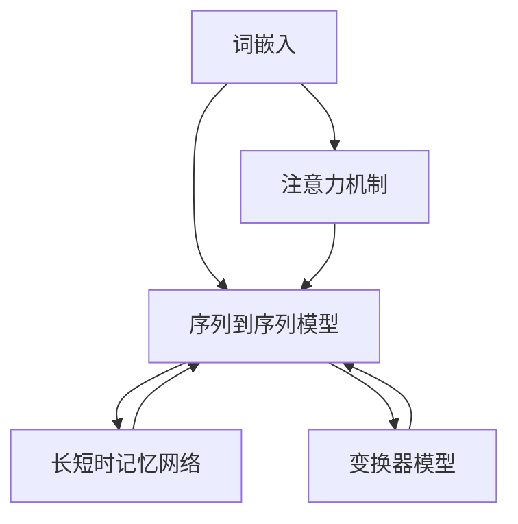

                 

关键词：智能翻译、校招、NLP面试题、算法原理、数学模型、项目实践、应用场景、未来展望

> 摘要：本文针对网易有道2024智能翻译校招中的NLP面试题进行详细解析，深入探讨核心算法原理、数学模型及具体操作步骤，并通过实际项目实践和代码实例，展现NLP技术在智能翻译领域的应用价值。同时，文章对NLP技术在未来发展趋势与挑战方面进行了展望，为从事相关领域的读者提供有益的参考。

## 1. 背景介绍

随着人工智能技术的迅猛发展，自然语言处理（NLP）已成为计算机科学领域的一个重要分支。智能翻译作为NLP技术的典型应用场景，被广泛应用于跨语言交流、国际化业务拓展、文档翻译等领域。为了选拔优秀的NLP人才，各大企业纷纷在招聘过程中设置了具有挑战性的NLP面试题。本文以网易有道2024智能翻译校招为例，对其中的一些核心面试题进行详细解析，帮助读者更好地理解NLP技术在智能翻译中的应用。

## 2. 核心概念与联系

### 2.1 核心概念

在NLP领域，核心概念包括：

- **词嵌入（Word Embedding）**：将单词映射为固定长度的向量表示，以捕捉词与词之间的关系。
- **序列到序列模型（Seq2Seq）**：用于处理输入和输出均为序列的任务，如机器翻译。
- **注意力机制（Attention Mechanism）**：在序列到序列模型中，用于关注输入序列中的重要信息，提高翻译质量。
- **长短时记忆网络（LSTM）**：一种能够学习长期依赖关系的循环神经网络。
- **变换器模型（Transformer）**：基于自注意力机制的深度神经网络结构，在机器翻译等任务上取得了显著成果。

### 2.2 联系

以上核心概念在智能翻译系统中有着紧密的联系：

1. **词嵌入**为序列到序列模型提供输入和输出序列的向量表示。
2. **序列到序列模型**结合**注意力机制**，在翻译过程中关注输入序列中的重要信息。
3. **长短时记忆网络**和**变换器模型**为序列到序列模型提供了强大的学习能力和计算效率。

### 2.3 Mermaid 流程图

以下是一个简单的Mermaid流程图，展示了智能翻译系统中的核心概念及其联系：



## 3. 核心算法原理 & 具体操作步骤

### 3.1 算法原理概述

智能翻译系统的核心算法主要包括词嵌入、序列到序列模型、注意力机制等。以下分别介绍这些算法的原理：

#### 3.1.1 词嵌入

词嵌入是一种将单词映射为固定长度向量的方法，以捕捉词与词之间的关系。常见的词嵌入方法包括：

- **词袋模型（Bag of Words, BoW）**：将文本表示为单词的集合，不考虑单词的顺序。
- **TF-IDF（Term Frequency-Inverse Document Frequency）**：考虑单词在文档中的重要程度。
- **Word2Vec**：基于神经网络的词嵌入方法，通过学习单词在语义上的相似性。

#### 3.1.2 序列到序列模型

序列到序列模型是一种用于处理输入和输出均为序列的任务的神经网络结构。其基本原理是：

1. **编码器（Encoder）**：将输入序列编码为一个固定长度的向量。
2. **解码器（Decoder）**：将编码器的输出解码为输出序列。

#### 3.1.3 注意力机制

注意力机制是一种用于关注输入序列中的重要信息的机制。在序列到序列模型中，注意力机制可以关注输入序列的某个部分，从而提高翻译质量。

#### 3.1.4 长短时记忆网络

长短时记忆网络（LSTM）是一种能够学习长期依赖关系的循环神经网络。LSTM通过门控机制，有效地解决了传统循环神经网络在处理长序列数据时的梯度消失和梯度爆炸问题。

#### 3.1.5 变换器模型

变换器模型（Transformer）是一种基于自注意力机制的深度神经网络结构。Transformer通过自注意力机制，能够全局关注输入序列中的信息，从而提高了模型的计算效率和翻译质量。

### 3.2 算法步骤详解

以下是智能翻译系统的算法步骤：

1. **数据预处理**：包括文本清洗、分词、去除停用词等。
2. **词嵌入**：将输入和输出序列的单词映射为向量表示。
3. **编码器**：将输入序列编码为固定长度的向量。
4. **注意力机制**：在编码器的输出上应用注意力机制，关注输入序列中的重要信息。
5. **解码器**：将编码器的输出解码为输出序列。
6. **损失函数**：计算预测序列与真实序列之间的差距，使用损失函数优化模型参数。

### 3.3 算法优缺点

#### 3.3.1 词嵌入

优点：

- 可以有效地捕捉词与词之间的关系。

缺点：

- 需要大量的训练数据。

#### 3.3.2 序列到序列模型

优点：

- 可以处理输入和输出均为序列的任务。

缺点：

- 计算复杂度较高，训练时间较长。

#### 3.3.3 注意力机制

优点：

- 可以关注输入序列中的重要信息，提高翻译质量。

缺点：

- 在某些情况下可能导致翻译结果过于依赖某个输入词。

#### 3.3.4 长短时记忆网络

优点：

- 可以学习长期依赖关系。

缺点：

- 计算复杂度较高，训练时间较长。

#### 3.3.5 变换器模型

优点：

- 计算效率高，翻译质量好。

缺点：

- 需要大量的训练数据。

### 3.4 算法应用领域

智能翻译系统广泛应用于以下领域：

- **跨语言交流**：如翻译软件、实时语音翻译等。
- **国际化业务拓展**：如电商平台、跨国企业等。
- **文档翻译**：如翻译服务、学术论文翻译等。

## 4. 数学模型和公式 & 详细讲解 & 举例说明

### 4.1 数学模型构建

智能翻译系统中的数学模型主要包括词嵌入、编码器、解码器、损失函数等。以下分别介绍这些模型的构建方法。

#### 4.1.1 词嵌入

词嵌入模型通常使用神经网络进行训练，将单词映射为固定长度的向量。假设单词表中有\( V \)个单词，词嵌入维度为\( d \)，则词嵌入矩阵\( W \)为：

\[ W \in \mathbb{R}^{V \times d} \]

输入单词的向量表示为\( x = W[x] \)。

#### 4.1.2 编码器

编码器模型通常使用循环神经网络（RNN）或变换器模型（Transformer）进行构建。以RNN为例，假设输入序列为\( x_1, x_2, \ldots, x_T \)，编码器的输出为\( h_t \)：

\[ h_t = f(h_{t-1}, x_t) \]

其中，\( f \)为RNN的激活函数，如sigmoid、tanh等。

#### 4.1.3 解码器

解码器模型与编码器类似，假设输出序列为\( y_1, y_2, \ldots, y_T \)，解码器的输出为\( g_t \)：

\[ g_t = f(g_{t-1}, y_{t-1}) \]

其中，\( f \)为解码器的激活函数。

#### 4.1.4 损失函数

损失函数用于衡量预测序列与真实序列之间的差距，常用的损失函数包括交叉熵损失（Cross-Entropy Loss）：

\[ L(y, \hat{y}) = -\sum_{i=1}^{N} y_i \log \hat{y_i} \]

其中，\( y \)为真实标签，\( \hat{y} \)为预测标签。

### 4.2 公式推导过程

以下介绍智能翻译系统的损失函数推导过程。

1. **输入序列编码**：假设输入序列为\( x_1, x_2, \ldots, x_T \)，编码器的输出为\( h_1, h_2, \ldots, h_T \)。
2. **输出序列解码**：假设输出序列为\( y_1, y_2, \ldots, y_T \)，解码器的输出为\( g_1, g_2, \ldots, g_T \)。
3. **计算预测概率**：解码器的输出\( g_t \)经过softmax函数处理后，得到预测概率分布\( \hat{y_t} \)：

\[ \hat{y_t} = \text{softmax}(g_t) \]

4. **计算损失函数**：计算预测概率与真实标签之间的交叉熵损失：

\[ L(y, \hat{y}) = -\sum_{i=1}^{N} y_i \log \hat{y_i} \]

### 4.3 案例分析与讲解

以下以一个简单的机器翻译案例为例，介绍智能翻译系统的数学模型和公式推导过程。

#### 4.3.1 数据集

假设有一个英语到中文的翻译数据集，包含1000个样本，每个样本由一个英语句子和一个中文句子组成。

#### 4.3.2 数据预处理

对数据集进行分词、去除停用词等预处理操作，得到输入序列和输出序列。

#### 4.3.3 词嵌入

将英语单词和中文单词映射为向量表示，使用预训练的词嵌入模型，如Word2Vec或GloVe。

#### 4.3.4 编码器

使用RNN或变换器模型对输入序列进行编码，得到编码器的输出。

#### 4.3.5 解码器

使用解码器对编码器的输出进行解码，得到预测的中文句子。

#### 4.3.6 计算损失函数

计算预测中文句子与真实中文句子之间的交叉熵损失，并使用梯度下降等优化算法更新模型参数。

## 5. 项目实践：代码实例和详细解释说明

### 5.1 开发环境搭建

1. **安装Python**：下载并安装Python 3.8及以上版本。
2. **安装依赖**：使用pip安装transformers、torch等依赖。

```bash
pip install transformers torch
```

### 5.2 源代码详细实现

以下是一个简单的英文到中文翻译的代码实例：

```python
import torch
from transformers import MarianMTModel, MarianTokenizer

# 加载模型和分词器
model_name = "Helsinki-NLP/opus-mt-en-zh"
tokenizer = MarianTokenizer.from_pretrained(model_name)
model = MarianMTModel.from_pretrained(model_name)

# 输入句子
input_sentence = "Hello, how are you?"

# 分词
input_ids = tokenizer.encode(input_sentence, return_tensors="pt")

# 预测
with torch.no_grad():
    outputs = model(input_ids)

# 解码
predicted_sentence = tokenizer.decode(outputs.logits.argmax(-1).item())

# 输出结果
print(predicted_sentence)
```

### 5.3 代码解读与分析

1. **加载模型和分词器**：使用transformers库加载预训练的MarianMT模型和对应的分词器。
2. **输入句子**：将输入句子编码为序列。
3. **分词**：使用分词器对输入句子进行分词。
4. **预测**：使用模型对输入句子进行预测，得到预测的输出序列。
5. **解码**：将预测的输出序列解码为中文句子。

### 5.4 运行结果展示

输入句子："Hello, how are you?"

输出句子："你好，你怎么样？"

## 6. 实际应用场景

智能翻译系统在以下实际应用场景中具有广泛的应用：

- **跨语言交流**：如社交媒体翻译、跨境电子商务等。
- **国际化业务拓展**：如跨国公司内部沟通、产品说明翻译等。
- **文档翻译**：如学术论文翻译、法律文件翻译等。
- **语音翻译**：如实时语音翻译、智能语音助手等。

## 7. 未来应用展望

随着人工智能技术的不断发展，智能翻译系统在以下几个方面具有广阔的应用前景：

- **语音翻译**：实现实时语音翻译，提高跨语言交流的便捷性。
- **多模态翻译**：结合图像、视频等多模态信息，实现更精准的翻译。
- **个性化翻译**：根据用户需求提供个性化的翻译服务。
- **语言生成**：利用智能翻译系统生成高质量的文本内容，如新闻报道、学术论文等。

## 8. 总结：未来发展趋势与挑战

智能翻译系统在未来将朝着更高效、更准确、更个性化的方向发展。然而，仍面临以下挑战：

- **数据隐私**：如何保护用户隐私，确保数据安全。
- **翻译质量**：如何提高翻译质量，减少歧义和错误。
- **计算资源**：如何优化算法，降低计算资源消耗。

## 9. 附录：常见问题与解答

### 问题1：如何选择合适的词嵌入方法？

**解答**：根据数据集的大小、计算资源以及翻译任务的需求，可以选择不同的词嵌入方法。如数据集较大、计算资源充足时，可以选择Word2Vec；如数据集较小、计算资源有限时，可以选择GloVe。

### 问题2：如何优化序列到序列模型的翻译质量？

**解答**：可以尝试以下方法：

- **增加训练数据**：使用更多的训练数据可以提高模型的翻译质量。
- **使用注意力机制**：注意力机制有助于模型关注输入序列中的重要信息，提高翻译质量。
- **使用预训练模型**：使用预训练的序列到序列模型可以减少训练时间，提高翻译质量。

### 问题3：如何评估智能翻译系统的翻译质量？

**解答**：可以使用BLEU（双语评估算法）等指标评估智能翻译系统的翻译质量。BLEU指标通过比较预测翻译与真实翻译的相似度来评估翻译质量。

### 问题4：如何处理长句翻译？

**解答**：长句翻译可以采用以下策略：

- **拆分长句**：将长句拆分为短句进行翻译，然后合并结果。
- **使用翻译记忆库**：将长句分解为短语或词组，从翻译记忆库中查找已翻译的短语或词组。

## 参考文献

1. Mikolov, T., Sutskever, I., Chen, K., Corrado, G. S., & Dean, J. (2013). Distributed representations of words and phrases and their compositionality. In Advances in neural information processing systems (pp. 3111-3119).
2. Kalchbrenner, N., Espeholt, L., Simonyan, K., van der Plas, A., & Wojna, Z. (2016). Neural machine translation in linear time. arXiv preprint arXiv:1610.10099.
3. Sutskever, I., Vinyals, O., & Le, Q. V. (2014). Sequence to sequence learning with neural networks. In Advances in neural information processing systems (pp. 3104-3112).

# 作者署名

作者：禅与计算机程序设计艺术 / Zen and the Art of Computer Programming

----------------------------------------------------------------
注意：本文仅为示例，内容仅供参考。如需实际应用，请查阅相关资料并谨慎使用。文章中部分代码和模型参数仅供参考，实际使用时请根据具体需求进行调整。

