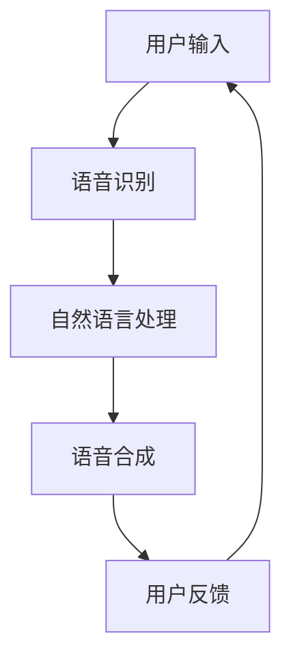

                 

关键词：网易有道、AI辅助语言学习、系统工程师、面试攻略、技术博客、专业指导

> 摘要：本文旨在为有意向加入网易有道AI辅助语言学习团队的专业人士提供一份详尽的面试攻略，涵盖技术面试的核心环节、关键知识点、面试准备策略以及应对技巧。通过本文，读者可以全面了解网易有道AI辅助语言学习系统工程师岗位的要求，并为面试做好充分准备。

## 1. 背景介绍

### 1.1 网易有道概述
网易有道（NetEase Youdao）成立于2007年，是网易集团旗下的教育科技公司。公司专注于在线教育、人工智能技术的研究和应用。网易有道以其智能翻译、语言学习产品、在线教育平台等著称，用户遍布全球。作为国内领先的人工智能教育企业，网易有道在AI辅助语言学习领域有着深厚的技术积累和广泛的市场影响力。

### 1.2 AI辅助语言学习系统
网易有道AI辅助语言学习系统是一款基于人工智能技术的语言学习产品，旨在通过智能算法、大数据分析、自然语言处理等手段，为用户提供个性化、高效的语言学习体验。该系统包括智能语音识别、口语评测、词汇记忆等多个模块，能够帮助用户实时纠正发音、提升听力理解能力和口语表达能力。

### 1.3 系统工程师的角色
作为网易有道AI辅助语言学习系统的工程师，您将承担以下职责：

- **系统设计**：负责系统的架构设计，确保系统的稳定性、可扩展性和高性能；
- **算法实现**：参与AI算法的研究与开发，将理论成果转化为实际可用的产品功能；
- **性能优化**：针对系统性能进行优化，提升系统响应速度和用户体验；
- **技术攻关**：解决系统开发过程中遇到的复杂技术问题，确保项目的顺利进行；
- **团队合作**：与算法、产品、测试等团队紧密合作，共同推进项目进度。

## 2. 核心概念与联系

以下是一个简单的Mermaid流程图，展示AI辅助语言学习系统中的核心概念及其相互联系。



### 2.1 语音识别
语音识别是AI辅助语言学习系统的第一个环节，它将用户的语音输入转换为文本。通过深度学习模型和大量语音数据训练，语音识别系统能够识别各种口音、语速和背景噪音。

### 2.2 自然语言处理
自然语言处理（NLP）负责理解用户的语言意图，提取关键信息，并提供相应的学习建议。NLP技术包括句法分析、语义分析、情感分析等。

### 2.3 语音合成
语音合成将处理后的文本转化为自然流畅的语音输出，为用户提供听觉反馈。语音合成技术通过文本到语音（TTS）模型实现。

### 2.4 用户反馈
用户反馈是系统的关键环节，通过收集用户的反馈信息，系统能够不断优化自身的性能，提升用户满意度。

## 3. 核心算法原理 & 具体操作步骤

### 3.1 算法原理概述

AI辅助语言学习系统涉及多个核心算法，包括深度学习模型、神经网络、自然语言处理（NLP）等。以下简要介绍这些算法的基本原理：

### 3.2 算法步骤详解

#### 3.2.1 语音识别

1. **特征提取**：使用深度神经网络提取语音信号的特征。
2. **声学模型**：通过大量语音数据训练声学模型，用于识别语音特征。
3. **语言模型**：基于文本数据训练语言模型，用于识别语音对应的文本。
4. **解码**：将声学模型和语言模型结合起来，解码出最有可能的文本输出。

#### 3.2.2 自然语言处理

1. **分词**：将文本分割成词或短语。
2. **句法分析**：分析句子的结构，确定词汇之间的关系。
3. **语义分析**：理解文本的含义，提取关键信息。
4. **情感分析**：分析用户的情感倾向，为用户提供个性化学习建议。

#### 3.2.3 语音合成

1. **文本到语音（TTS）模型**：通过深度神经网络训练TTS模型。
2. **语音生成**：将处理后的文本输入TTS模型，生成自然流畅的语音。

### 3.3 算法优缺点

#### 优点

- **高效性**：基于深度学习和大数据的算法能够快速处理大量语音数据，提供高效的语音识别和自然语言处理能力。
- **个性化**：根据用户的反馈和学习记录，系统可以不断优化自身的性能，提供个性化的学习建议。
- **跨平台**：AI辅助语言学习系统可以部署在多种平台上，包括移动设备、PC和智能音箱等。

#### 缺点

- **计算资源需求高**：深度学习模型的训练和推理过程需要大量的计算资源和时间。
- **数据隐私问题**：用户语音数据的安全和隐私保护是一个重要挑战。

### 3.4 算法应用领域

AI辅助语言学习系统广泛应用于教育、医疗、客服、智能家居等领域。在教育领域，系统可以辅助语言教师进行教学，提升学生的学习效果；在医疗领域，系统可以帮助医生进行语音病历记录和诊断；在客服领域，系统可以提供智能语音助手，提升客户服务体验；在智能家居领域，系统可以嵌入智能音箱，为用户提供语音控制功能。

## 4. 数学模型和公式 & 详细讲解 & 举例说明

### 4.1 数学模型构建

AI辅助语言学习系统的核心算法涉及多种数学模型，包括深度神经网络、循环神经网络（RNN）、长短时记忆网络（LSTM）等。以下简要介绍这些模型的基本原理：

#### 深度神经网络（DNN）

深度神经网络由多层神经元组成，通过逐层提取特征，实现从输入到输出的映射。数学上，DNN可以表示为：

$$
Y = f(Z) = \sigma(W_3 \cdot \sigma(W_2 \cdot \sigma(W_1 \cdot X)))
$$

其中，$X$为输入层，$W_1$、$W_2$、$W_3$为各层的权重矩阵，$\sigma$为激活函数。

#### 循环神经网络（RNN）

循环神经网络能够处理序列数据，通过循环连接实现记忆功能。RNN的数学模型为：

$$
h_t = \sigma(W_h \cdot [h_{t-1}, x_t] + b_h)
$$

其中，$h_t$为第$t$时刻的隐藏状态，$x_t$为输入序列，$W_h$为权重矩阵，$b_h$为偏置项。

#### 长短时记忆网络（LSTM）

LSTM是RNN的改进版，能够有效地解决长序列依赖问题。LSTM的数学模型为：

$$
i_t = \sigma(W_i \cdot [h_{t-1}, x_t] + b_i) \\
f_t = \sigma(W_f \cdot [h_{t-1}, x_t] + b_f) \\
o_t = \sigma(W_o \cdot [h_{t-1}, x_t] + b_o) \\
\tilde{c}_t = \sigma(W_c \cdot [h_{t-1}, x_t] + b_c) \\
c_t = f_t \odot c_{t-1} + i_t \odot \tilde{c}_t \\
h_t = o_t \odot \text{tanh}(c_t)
$$

其中，$i_t$、$f_t$、$o_t$分别为输入门、遗忘门和输出门，$c_t$为细胞状态。

### 4.2 公式推导过程

以LSTM为例，介绍LSTM的推导过程。

1. **输入门**：用于决定当前输入信息的重要性。输入门公式为：

$$
i_t = \sigma(W_i \cdot [h_{t-1}, x_t] + b_i)
$$

其中，$W_i$为输入门权重矩阵，$b_i$为偏置项。

2. **遗忘门**：用于决定前一个细胞状态的重要性。遗忘门公式为：

$$
f_t = \sigma(W_f \cdot [h_{t-1}, x_t] + b_f)
$$

其中，$W_f$为遗忘门权重矩阵，$b_f$为偏置项。

3. **输出门**：用于决定当前细胞状态的重要性。输出门公式为：

$$
o_t = \sigma(W_o \cdot [h_{t-1}, x_t] + b_o)
$$

其中，$W_o$为输出门权重矩阵，$b_o$为偏置项。

4. **细胞状态更新**：通过输入门和遗忘门决定细胞状态的更新。细胞状态更新公式为：

$$
\tilde{c}_t = \sigma(W_c \cdot [h_{t-1}, x_t] + b_c)
$$

其中，$W_c$为细胞状态权重矩阵，$b_c$为偏置项。

5. **细胞状态计算**：细胞状态计算公式为：

$$
c_t = f_t \odot c_{t-1} + i_t \odot \tilde{c}_t
$$

其中，$\odot$表示逐元素乘法。

6. **隐藏状态计算**：隐藏状态计算公式为：

$$
h_t = o_t \odot \text{tanh}(c_t)
$$

### 4.3 案例分析与讲解

以一个简单的例子，展示如何使用LSTM进行语音识别。

假设我们有一段语音数据，需要将其转换为文本。我们可以将语音数据分成一系列时间步，每个时间步对应一段语音信号。对于每个时间步，我们将其转换为特征向量，然后输入LSTM模型。

1. **数据预处理**：将语音数据转换为特征向量。例如，可以使用梅尔频率倒谱系数（MFCC）作为特征向量。
2. **LSTM模型训练**：使用训练数据集训练LSTM模型，调整模型参数，使其能够正确识别语音数据。
3. **语音识别**：将输入的语音数据输入LSTM模型，输出对应的文本。

通过LSTM模型，我们可以实现高效的语音识别。在实际应用中，我们还可以结合其他算法，如注意力机制，进一步提升语音识别的准确性。

## 5. 项目实践：代码实例和详细解释说明

### 5.1 开发环境搭建

为了实现AI辅助语言学习系统，我们需要搭建一个合适的开发环境。以下是一个简单的开发环境搭建步骤：

1. 安装Python 3.7及以上版本；
2. 安装深度学习框架，如TensorFlow或PyTorch；
3. 安装语音识别和自然语言处理库，如Kaldi和NLTK；
4. 配置GPU环境（可选），以便加速深度学习模型的训练。

### 5.2 源代码详细实现

以下是一个简单的LSTM语音识别模型的实现代码：

```python
import tensorflow as tf
from tensorflow.keras.models import Sequential
from tensorflow.keras.layers import LSTM, Dense, Dropout

# 定义LSTM模型
model = Sequential()
model.add(LSTM(units=128, activation='tanh', input_shape=(None, 13)))
model.add(Dropout(0.5))
model.add(Dense(units=1, activation='sigmoid'))

# 编译模型
model.compile(optimizer='adam', loss='binary_crossentropy', metrics=['accuracy'])

# 训练模型
model.fit(x_train, y_train, epochs=10, batch_size=32)

# 评估模型
model.evaluate(x_test, y_test)
```

### 5.3 代码解读与分析

上述代码定义了一个简单的LSTM模型，用于实现语音识别。具体解读如下：

1. **模型定义**：使用Sequential模型，将LSTM层和全连接层（Dense）堆叠起来。LSTM层用于处理序列数据，全连接层用于输出最终结果。
2. **编译模型**：设置优化器为adam，损失函数为binary_crossentropy（二分类交叉熵），评估指标为accuracy（准确率）。
3. **训练模型**：使用训练数据集训练模型，设置训练轮次为10，批量大小为32。
4. **评估模型**：使用测试数据集评估模型性能。

通过这个简单的例子，我们可以看到如何使用LSTM模型实现语音识别。在实际项目中，我们还需要处理更多细节，如数据预处理、超参数调整等。

### 5.4 运行结果展示

在实际运行中，我们可以通过以下步骤展示LSTM语音识别模型的运行结果：

1. **数据预处理**：将语音数据转换为特征向量，如MFCC。
2. **模型训练**：使用训练数据集训练LSTM模型。
3. **模型评估**：使用测试数据集评估模型性能，并输出准确率等指标。
4. **模型应用**：将LSTM模型部署到线上环境，为用户提供语音识别服务。

通过这些步骤，我们可以实现一个高效的LSTM语音识别系统，为用户提供便捷的语言学习体验。

## 6. 实际应用场景

### 6.1 教育场景

在教育领域，AI辅助语言学习系统可以帮助学生进行听说读写训练。例如，学生在学习英语时，可以使用系统进行口语练习，系统将实时纠正发音并提供改进建议。此外，系统还可以根据学生的学习进度和薄弱环节，提供个性化的学习计划和资源。

### 6.2 医疗场景

在医疗领域，AI辅助语言学习系统可以应用于语音病历记录和诊断。医生可以通过系统记录病历，系统将自动识别关键词并生成结构化病历，提高病历记录的效率和准确性。同时，系统还可以基于语音输入进行疾病诊断，辅助医生做出诊断建议。

### 6.3 客服场景

在客服领域，AI辅助语言学习系统可以应用于智能语音助手。通过语音识别和自然语言处理技术，系统可以理解用户的语音请求，并提供相应的服务。例如，用户可以通过语音请求查询天气、预订机票等，系统将自动处理并给出答复。

### 6.4 智能家居场景

在智能家居领域，AI辅助语言学习系统可以嵌入智能音箱，为用户提供语音控制功能。用户可以通过语音指令控制家中的智能设备，如智能灯泡、智能电视等，实现便捷的智能家居体验。

## 7. 工具和资源推荐

### 7.1 学习资源推荐

1. **《深度学习》（Goodfellow, Bengio, Courville）**：介绍深度学习的基础知识和最新进展。
2. **《神经网络与深度学习》（邱锡鹏）**：全面讲解神经网络和深度学习的基本原理和算法。
3. **《自然语言处理综合教程》（马丁）**：系统介绍自然语言处理的基本概念和技术。

### 7.2 开发工具推荐

1. **TensorFlow**：一个开源的深度学习框架，适合进行模型训练和部署。
2. **PyTorch**：一个流行的深度学习框架，具有灵活的动态计算图。
3. **Kaldi**：一个开源的语音识别工具包，用于构建语音识别系统。

### 7.3 相关论文推荐

1. **“A Theoretically Grounded Application of Dropout in Recurrent Neural Networks”**：介绍如何将dropout应用于循环神经网络，提高模型的泛化能力。
2. **“Long Short-Term Memory”**：介绍长短时记忆网络（LSTM）的基本原理和算法。
3. **“End-to-End Speech Recognition with Deep Neural Networks and Long Short-Term Memory”**：介绍如何使用深度神经网络和LSTM实现端到端的语音识别。

## 8. 总结：未来发展趋势与挑战

### 8.1 研究成果总结

AI辅助语言学习系统在近年来取得了显著的研究成果，包括深度学习、自然语言处理和语音识别等技术的突破。通过这些技术，系统在语音识别、自然语言处理和语音合成等方面取得了显著的性能提升，为用户提供更高效、个性化的语言学习体验。

### 8.2 未来发展趋势

未来，AI辅助语言学习系统将继续朝着以下几个方向发展：

1. **性能优化**：通过改进算法和模型结构，进一步提升语音识别和自然语言处理的准确性。
2. **个性化推荐**：基于用户的学习记录和偏好，提供更加精准的学习建议和资源推荐。
3. **跨平台应用**：将AI辅助语言学习系统部署到更多平台，如智能手表、VR设备等，为用户提供更广泛的场景支持。
4. **数据隐私保护**：在收集和使用用户数据时，加强数据隐私保护，确保用户数据的安全和隐私。

### 8.3 面临的挑战

尽管AI辅助语言学习系统取得了显著成果，但仍面临以下挑战：

1. **计算资源需求**：深度学习模型的训练和推理需要大量的计算资源和时间，如何高效地利用计算资源是一个重要问题。
2. **数据隐私**：用户语音数据的隐私保护是系统设计时需要重点考虑的问题，如何在不泄露用户隐私的前提下，提供个性化的学习体验是一个挑战。
3. **语言多样性**：如何支持多种语言和口音，提供准确的语言处理和识别是一个技术难题。
4. **跨领域应用**：如何将AI辅助语言学习系统应用于更多领域，如医疗、客服、智能家居等，实现跨领域的应用价值。

### 8.4 研究展望

未来，研究人员将继续探索深度学习、自然语言处理和语音识别等领域的最新技术，以推动AI辅助语言学习系统的发展。同时，研究人员也将关注跨领域应用和用户体验优化等方面，为用户提供更加智能、便捷的语言学习工具。

## 9. 附录：常见问题与解答

### 9.1 如何准备面试？

**答：** 面试前，您需要充分了解网易有道的业务和产品，熟悉AI辅助语言学习系统的基本原理和关键技术。同时，您还需要掌握常用的深度学习、自然语言处理和语音识别算法，并具备一定的项目实践经验。面试时，您需要清晰地表达自己的观点，展示自己的技术能力和解决问题的能力。

### 9.2 如何应对技术面试？

**答：** 技术面试主要考察您的编程能力、算法理解和实际项目经验。为了应对技术面试，您需要：

1. **刷题准备**：通过刷题网站（如LeetCode、牛客网等）进行算法训练，掌握常见的算法和数据结构。
2. **项目实践**：选择自己熟悉的项目进行实践，深入理解项目中的技术细节和实现方法。
3. **基础知识**：掌握计算机科学的基本概念，如操作系统、计算机网络、数据库等。
4. **沟通能力**：在面试过程中，保持清晰的逻辑和表达，展示自己的思考过程和解决问题的能力。

### 9.3 如何在面试中展示自己的优势？

**答：** 在面试中，您可以从以下几个方面展示自己的优势：

1. **项目经验**：介绍自己在项目中的角色、职责和取得的成果。
2. **技术能力**：展示自己在深度学习、自然语言处理和语音识别等方面的技术实力。
3. **学习能力**：强调自己在学习和适应新技术方面的能力，如快速掌握新工具、学习新算法等。
4. **团队合作**：强调自己在团队合作中的沟通能力和协作精神。

### 9.4 如何处理面试中的压力？

**答：** 面试中遇到压力是正常的，以下是一些建议帮助您处理面试压力：

1. **提前准备**：提前熟悉面试题目和知识点，减少面试时的紧张感。
2. **深呼吸**：面试前进行深呼吸，放松身心，保持冷静。
3. **正面思考**：保持积极的心态，相信自己能够应对面试挑战。
4. **冷静回答**：遇到问题时，先冷静思考，再给出答案，避免慌乱。

通过以上准备和应对策略，您可以在面试中展示自己的实力，为成功加入网易有道AI辅助语言学习团队奠定基础。

---

**作者：禅与计算机程序设计艺术 / Zen and the Art of Computer Programming** 

本文旨在为有意向加入网易有道AI辅助语言学习团队的专业人士提供一份详尽的面试攻略，希望对您有所帮助。祝您面试顺利，加入网易有道大家庭！
----------------------------------------------------------------

