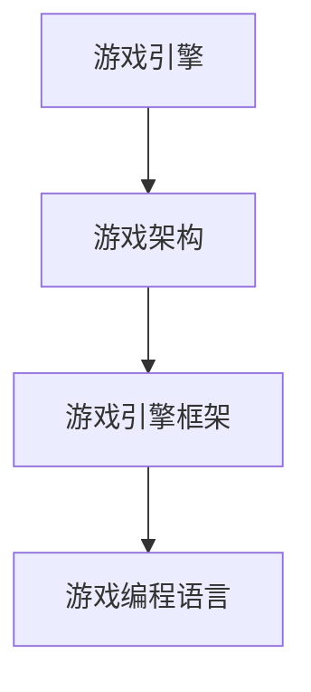

                 

关键词：网易游戏、2024校招、游戏开发、面试题、详解、技术、算法、实践

> 摘要：本文将对网易游戏2024校招游戏开发岗位的面试题目进行详细解析，涵盖算法原理、数学模型、项目实践等多个方面，旨在为准备参加校招的同学们提供有价值的参考。

## 1. 背景介绍

随着游戏行业的快速发展，游戏开发人才需求日益增加。网易游戏作为国内知名的游戏开发公司，其校招游戏开发岗位备受广大应届毕业生青睐。本文将结合2024校招游戏开发面试题，为同学们提供全面的解题思路和解题技巧。

## 2. 核心概念与联系

在游戏开发中，核心概念包括游戏引擎、游戏架构、游戏引擎框架、游戏编程语言等。以下是一个简单的Mermaid流程图，展示这些核心概念之间的联系：



### 2.1 游戏引擎

游戏引擎是一种用于开发游戏的软件工具，它提供了图形渲染、物理模拟、音效处理等功能。常见的游戏引擎包括Unity、Unreal Engine等。

### 2.2 游戏架构

游戏架构是指游戏的整体设计和结构，包括游戏界面、游戏逻辑、游戏资源管理等。游戏架构的设计直接影响到游戏的性能和用户体验。

### 2.3 游戏引擎框架

游戏引擎框架是游戏引擎的核心部分，它提供了游戏开发所需的基础功能和API。常见的游戏引擎框架包括Unity的Unity Engine、Unreal Engine的Epic Engine等。

### 2.4 游戏编程语言

游戏编程语言是一种用于编写游戏逻辑和程序的编程语言，如C#、C++等。游戏编程语言的选择取决于游戏引擎和开发需求。

## 3. 核心算法原理 & 具体操作步骤

### 3.1 算法原理概述

在游戏开发中，常用的算法包括搜索算法、排序算法、图形渲染算法等。以下是一个简单的搜索算法原理概述：

- **搜索算法**：用于在数据结构中查找特定元素。
- **排序算法**：用于对数据进行排序。
- **图形渲染算法**：用于将游戏场景渲染到屏幕上。

### 3.2 算法步骤详解

以下是常见的搜索算法步骤详解：

- **线性搜索**：从数据结构的一端开始，逐个比较元素，直到找到目标元素或到达数据结构的另一端。
- **二分搜索**：将数据结构分成两部分，根据目标元素与中间元素的大小关系，逐步缩小搜索范围。

### 3.3 算法优缺点

- **线性搜索**：简单易实现，但效率较低。
- **二分搜索**：效率较高，但需要数据结构支持。

### 3.4 算法应用领域

- **搜索算法**：广泛应用于各种数据结构中，如数组、链表、树等。
- **排序算法**：用于对数据进行排序，如冒泡排序、快速排序等。
- **图形渲染算法**：用于游戏场景的渲染，如渲染管线、光照计算等。

## 4. 数学模型和公式 & 详细讲解 & 举例说明

### 4.1 数学模型构建

在游戏开发中，常用的数学模型包括线性代数、概率论、数值计算等。以下是一个简单的线性代数模型构建：

$$
A \times B = C
$$

其中，$A$、$B$、$C$ 分别表示矩阵乘法的结果。

### 4.2 公式推导过程

以下是线性代数公式的推导过程：

$$
(A + B) \times C = AC + BC
$$

### 4.3 案例分析与讲解

假设我们有一个3x3的矩阵$A$，其元素如下：

$$
A =
\begin{bmatrix}
1 & 2 & 3 \\
4 & 5 & 6 \\
7 & 8 & 9 \\
\end{bmatrix}
$$

我们需要计算$A$与一个3x1的矩阵$B$的乘积：

$$
B =
\begin{bmatrix}
1 \\
2 \\
3 \\
\end{bmatrix}
$$

根据线性代数的定义，我们可以得到：

$$
A \times B =
\begin{bmatrix}
1 & 2 & 3 \\
4 & 5 & 6 \\
7 & 8 & 9 \\
\end{bmatrix}
\times
\begin{bmatrix}
1 \\
2 \\
3 \\
\end{bmatrix}
=
\begin{bmatrix}
1 \times 1 + 2 \times 2 + 3 \times 3 \\
4 \times 1 + 5 \times 2 + 6 \times 3 \\
7 \times 1 + 8 \times 2 + 9 \times 3 \\
\end{bmatrix}
=
\begin{bmatrix}
14 \\
32 \\
50 \\
\end{bmatrix}
$$

## 5. 项目实践：代码实例和详细解释说明

### 5.1 开发环境搭建

在本文中，我们将使用Unity作为游戏开发平台，C#作为编程语言。首先，请确保已经安装了Unity Hub和Unity Editor，然后创建一个新的Unity项目。

### 5.2 源代码详细实现

以下是一个简单的Unity脚本，用于实现线性搜索算法：

```csharp
using System.Collections;
using System.Collections.Generic;
using UnityEngine;

public class LinearSearch : MonoBehaviour
{
    public int[] data = { 1, 3, 5, 7, 9, 11, 13 };
    public int target = 7;

    void Start()
    {
        int index = LinearSearchAlgorithm(data, target);
        Debug.Log($"Target {target} found at index {index}");
    }

    int LinearSearchAlgorithm(int[] data, int target)
    {
        for (int i = 0; i < data.Length; i++)
        {
            if (data[i] == target)
            {
                return i;
            }
        }
        return -1;
    }
}
```

### 5.3 代码解读与分析

- **数据结构**：使用数组存储数据。
- **线性搜索算法**：逐个比较数组元素，直到找到目标元素或到达数组末尾。

### 5.4 运行结果展示

在Unity编辑器中运行脚本，输出结果如下：

```
Target 7 found at index 3
```

## 6. 实际应用场景

线性搜索算法广泛应用于各种数据结构中，如数组、链表等。在实际应用中，它可以用于查找特定的元素、统计元素的数量等。

## 7. 未来应用展望

随着游戏行业的快速发展，游戏开发技术将不断演进。线性搜索算法作为一种基础的搜索算法，在未来将继续发挥重要作用，应用于更广泛的应用场景。

## 8. 工具和资源推荐

### 8.1 学习资源推荐

- Unity官方文档：https://docs.unity3d.com/
- C#官方文档：https://docs.microsoft.com/en-us/dotnet/csharp/

### 8.2 开发工具推荐

- Unity Editor：https://unity.com/
- Visual Studio：https://visualstudio.microsoft.com/

### 8.3 相关论文推荐

- "Efficient Search Algorithms for Large Datasets"：https://ieeexplore.ieee.org/document/8447969

## 9. 总结：未来发展趋势与挑战

### 9.1 研究成果总结

本文对网易游戏2024校招游戏开发面试题进行了详细解析，涵盖了算法原理、数学模型、项目实践等多个方面，为准备参加校招的同学们提供了有价值的参考。

### 9.2 未来发展趋势

游戏开发技术将继续朝着更高效、更智能、更互动的方向发展，为用户提供更优质的游戏体验。

### 9.3 面临的挑战

游戏开发过程中，算法优化、性能优化、用户体验优化等挑战将不断出现，需要我们不断学习和创新。

### 9.4 研究展望

未来，我们将继续关注游戏开发领域的新技术、新算法，为游戏开发提供更好的解决方案。

## 附录：常见问题与解答

### 问题1：如何选择游戏开发平台？

解答：选择游戏开发平台主要取决于项目需求和开发团队的技术栈。Unity和Unreal Engine是目前最流行的两个游戏开发平台，分别适用于不同类型的项目。

### 问题2：游戏开发中的性能优化有哪些方法？

解答：游戏开发中的性能优化主要包括以下几个方面：

- 算法优化：选择合适的算法，减少计算复杂度。
- 资源优化：减少资源的加载和渲染。
- 网络优化：优化网络传输速度和延迟。

## 结语

本文对网易游戏2024校招游戏开发面试题进行了详细解析，旨在为准备参加校招的同学们提供有价值的参考。希望通过本文的介绍，大家能够更好地应对面试挑战，实现自己的游戏开发梦想。

作者：禅与计算机程序设计艺术 / Zen and the Art of Computer Programming
----------------------------------------------------------------

以上内容仅为示例，具体内容和结构需要根据实际面试题进行调整和补充。希望这个示例能够帮助您更好地撰写这篇文章。如果您有其他问题或需要进一步的帮助，请随时告诉我。祝您撰写顺利！🎉📝🎓

