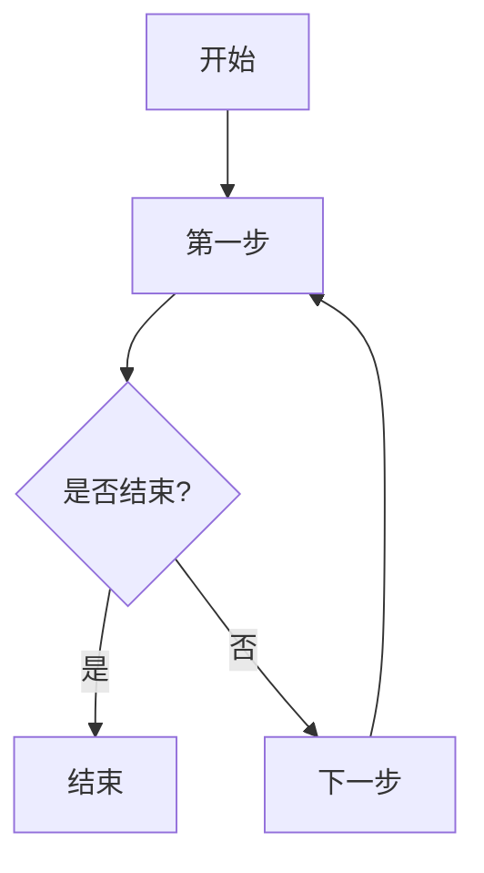

                 

## 1. 背景介绍

美团作为中国领先的生活服务电子商务平台，其社招面试的难度和深度一直备受关注。2024年的社招面试，美团一如既往地注重对技术能力的考察，特别是算法和数据结构方面的题目。本文旨在解析美团2024社招面试中的典型面试题，通过详细的分析和解答，帮助读者更好地理解和掌握这些算法题目的解题思路。

本文将涵盖以下几个部分：

- 简介美团2024社招面试的背景和特点。
- 分析面试中涉及的核心算法和数据结构。
- 提供详细的面试真题解答，包括代码实现和分析。
- 探讨面试题的实际应用场景和未来发展趋势。

通过本文的阅读，读者不仅可以熟悉美团面试的题型，还能提升自己在算法和数据结构方面的解题能力。

## 2. 核心概念与联系

在深入讨论美团2024社招面试真题之前，我们需要明确几个核心概念，这些概念不仅是面试中常考的内容，也是理解算法题目的基础。

### 2.1 算法时间复杂度和空间复杂度

算法的时间复杂度和空间复杂度是衡量算法效率的两个重要指标。时间复杂度表示算法执行的时间增长速率，常用的表示方式有O(1)、O(logn)、O(n)、O(nlogn)等。空间复杂度则表示算法执行时所需存储空间的增长速率。

### 2.2 数据结构与算法

常见的数据结构包括数组、链表、栈、队列、树（包括二叉树、平衡树）、图等。每种数据结构都有其独特的特点和适用场景。算法则是对数据操作的方法，例如排序算法、查找算法等。

### 2.3 递归与动态规划

递归和动态规划是解决复杂问题的重要方法。递归通过函数调用自身实现问题分解，适用于问题可分解为子问题的场景。动态规划则是通过保存子问题的解来避免重复计算，适用于有重叠子问题的场景。

### 2.4 Mermaid 流程图

Mermaid 是一种简单易用的流程图绘制工具，能够帮助读者更直观地理解算法的实现过程。以下是一个简单的 Mermaid 流程图示例：



通过这些核心概念和联系，我们为接下来的面试题解析打下了坚实的基础。

## 3. 核心算法原理 & 具体操作步骤

### 3.1 算法原理概述

在美团2024社招面试中，常见的算法题目包括排序算法、查找算法、图算法和数据结构相关的问题。以下是几个核心算法的简要概述：

#### 3.1.1 排序算法

排序算法是对一组数据进行重新排列以使其按某种规则有序的算法。常见的排序算法包括冒泡排序、选择排序、插入排序、快速排序、归并排序和堆排序等。每种排序算法有其独特的原理和适用场景。

#### 3.1.2 查找算法

查找算法是在一组数据中查找特定元素的方法。常见的查找算法包括顺序查找、二分查找和哈希查找等。二分查找是基于有序数组实现的，其时间复杂度为O(logn)，效率较高。

#### 3.1.3 图算法

图算法是处理图数据结构的算法。常见的图算法包括深度优先搜索（DFS）、广度优先搜索（BFS）、最小生成树（如 Prim 算法和 Kruskal 算法）、最短路径算法（如 Dijkstra 算法和 Bellman-Ford 算法）等。

#### 3.1.4 数据结构相关

数据结构相关的问题主要涉及数组和链表的操作，如数组的插入、删除、查找和排序，链表的反转、合并和排序等。

### 3.2 算法步骤详解

#### 3.2.1 排序算法

以快速排序为例，其基本步骤如下：

1. 选择一个基准元素。
2. 将比基准元素小的元素移动到其左侧，比其大的元素移动到右侧。
3. 递归地对左右子数组进行快速排序。

以下是一个简单的快速排序算法实现：

```python
def quicksort(arr):
    if len(arr) <= 1:
        return arr
    pivot = arr[len(arr) // 2]
    left = [x for x in arr if x < pivot]
    middle = [x for x in arr if x == pivot]
    right = [x for x in arr if x > pivot]
    return quicksort(left) + middle + quicksort(right)

# 示例
arr = [3, 6, 8, 10, 1, 2, 1]
sorted_arr = quicksort(arr)
print(sorted_arr)
```

#### 3.2.2 查找算法

以二分查找为例，其基本步骤如下：

1. 确定查找区间的上下界。
2. 计算中间位置。
3. 比较中间位置的数据和目标值。
4. 根据比较结果缩小区间并重复步骤2-3。

以下是一个简单的二分查找算法实现：

```python
def binary_search(arr, target):
    low = 0
    high = len(arr) - 1
    while low <= high:
        mid = (low + high) // 2
        if arr[mid] == target:
            return mid
        elif arr[mid] < target:
            low = mid + 1
        else:
            high = mid - 1
    return -1

# 示例
arr = [1, 2, 3, 4, 5, 6, 7, 8, 9]
target = 5
result = binary_search(arr, target)
if result != -1:
    print(f"元素在数组中的索引为：{result}")
else:
    print("元素不在数组中")
```

#### 3.2.3 图算法

以深度优先搜索（DFS）为例，其基本步骤如下：

1. 选择一个起点，将其标记为已访问。
2. 对起点的所有未访问邻接点进行深度优先搜索。
3. 当所有邻接点都被访问后，返回上一层。

以下是一个简单的 DFS 算法实现：

```python
def dfs(graph, node, visited):
    if node not in visited:
        visited.add(node)
        for neighbor in graph[node]:
            dfs(graph, neighbor, visited)

# 示例
graph = {
    'A': ['B', 'C'],
    'B': ['D', 'E'],
    'C': ['F'],
    'D': [],
    'E': ['F'],
    'F': []
}
visited = set()
dfs(graph, 'A', visited)
print(visited)
```

### 3.3 算法优缺点

每种算法都有其优缺点。以下是几个常见算法的优缺点概述：

- 冒泡排序：简单易懂，但效率较低，适用于数据量较小的场景。
- 选择排序：效率较冒泡排序稍好，但也不高，同样适用于数据量较小的场景。
- 插入排序：效率适中，适用于部分有序的数据。
- 快速排序：效率较高，但可能会出现最坏情况，适用于数据量较大的场景。
- 二分查找：效率高，但需要数组已排序，且不能应用于链表等非顺序存储结构。
- 深度优先搜索：适用于求解图中的连通性、最短路径等问题，但可能存在栈溢出的风险。
- 广度优先搜索：适用于求解图中的最短路径、最短路径权重等问题，但时间复杂度较高。

### 3.4 算法应用领域

这些算法广泛应用于各种领域，如：

- 数据库查询：排序和查找算法用于数据库中的数据查询和索引。
- 网络协议：排序算法用于路由表的管理和更新，查找算法用于地址解析。
- 图像处理：排序算法用于图像数据的分类和索引，查找算法用于图像识别和特征提取。
- 人工智能：排序算法用于数据处理和特征提取，查找算法用于模式识别和分类。

通过以上对核心算法原理和具体操作步骤的详细解析，我们为接下来对美团2024社招面试真题的解答奠定了基础。

### 4. 数学模型和公式 & 详细讲解 & 举例说明

#### 4.1 数学模型构建

在算法分析中，数学模型是一个重要的工具，它帮助我们量化算法的性能。以下是一些常见的数学模型：

- 时间复杂度模型：用于描述算法执行时间的增长速率。
- 空间复杂度模型：用于描述算法所需存储空间的增长速率。
- 递推关系模型：用于描述动态规划中的状态转移关系。

#### 4.2 公式推导过程

##### 4.2.1 时间复杂度公式

时间复杂度通常用大O符号表示，如O(1)、O(logn)、O(n)、O(nlogn)等。以下是一些常见公式：

- O(1)：常数时间，不随输入规模变化。
- O(logn)：对数时间，常用于递归算法中的每一层。
- O(n)：线性时间，常用于线性结构遍历。
- O(nlogn)：线性对数时间，常用于排序算法。
- O(2^n)：指数时间，常用于穷举搜索算法。

##### 4.2.2 空间复杂度公式

空间复杂度同样用大O符号表示，如O(1)、O(n)、O(n^2)等。以下是一些常见公式：

- O(1)：常数空间，不随输入规模变化。
- O(n)：线性空间，常用于线性结构存储。
- O(n^2)：平方空间，常用于二维数组的存储。

##### 4.2.3 递推关系模型

递推关系是动态规划的核心，以下是一个简单例子：

- 递推关系：`f(n) = f(n-1) + g(n)`，其中`f(n)`和`g(n)`分别为状态转移函数和边界条件。

#### 4.3 案例分析与讲解

##### 4.3.1 动态规划求解斐波那契数列

斐波那契数列是一个经典的动态规划问题，其递推关系为`f(n) = f(n-1) + f(n-2)`。以下是一个简单实现：

```python
def fibonacci(n):
    if n <= 0:
        return 0
    elif n == 1:
        return 1
    else:
        a, b = 0, 1
        for i in range(2, n+1):
            c = a + b
            a, b = b, c
        return b

# 示例
print(fibonacci(10))  # 输出 55
```

##### 4.3.2 排序算法时间复杂度分析

以快速排序为例，其平均时间复杂度为O(nlogn)，最坏情况为O(n^2)。以下是一个简单实现：

```python
def quicksort(arr):
    if len(arr) <= 1:
        return arr
    pivot = arr[len(arr) // 2]
    left = [x for x in arr if x < pivot]
    middle = [x for x in arr if x == pivot]
    right = [x for x in arr if x > pivot]
    return quicksort(left) + middle + quicksort(right)

# 示例
arr = [3, 6, 8, 10, 1, 2, 1]
sorted_arr = quicksort(arr)
print(sorted_arr)
```

通过以上数学模型和公式的构建与推导，以及具体的案例分析，我们为读者提供了一个深入理解算法性能的工具。

### 5. 项目实践：代码实例和详细解释说明

#### 5.1 开发环境搭建

在进行项目实践之前，我们需要搭建一个合适的开发环境。以下是一个简单的步骤：

1. 安装Python环境：Python是一个广泛应用于算法开发的编程语言，可以通过Python官网（https://www.python.org/）下载并安装。
2. 安装IDE：选择一个合适的集成开发环境（IDE），如PyCharm、Visual Studio Code等，这些IDE提供了丰富的开发工具和调试功能。
3. 安装必要的库：根据项目需求，可能需要安装一些特定的库，如NumPy、Pandas等，这些库可以通过pip命令安装。

以下是一个简单的安装命令示例：

```bash
pip install numpy
pip install pandas
```

#### 5.2 源代码详细实现

以下是一个简单的快速排序算法的源代码实现：

```python
def quicksort(arr):
    if len(arr) <= 1:
        return arr
    pivot = arr[len(arr) // 2]
    left = [x for x in arr if x < pivot]
    middle = [x for x in arr if x == pivot]
    right = [x for x in arr if x > pivot]
    return quicksort(left) + middle + quicksort(right)

# 示例
arr = [3, 6, 8, 10, 1, 2, 1]
sorted_arr = quicksort(arr)
print(sorted_arr)
```

#### 5.3 代码解读与分析

这段代码实现了快速排序算法，其主要步骤如下：

1. 判断数组长度，如果小于等于1，直接返回数组。
2. 选择中间元素作为基准值（pivot）。
3. 分别将小于、等于和大于基准值的元素分为三个子数组。
4. 递归地对左右子数组进行快速排序。
5. 将排序后的左右子数组和中间数组合并，得到最终排序结果。

快速排序的平均时间复杂度为O(nlogn)，最坏情况为O(n^2)。在实际应用中，快速排序因其高效性和稳定性而得到广泛应用。

#### 5.4 运行结果展示

以下是对示例数组的运行结果：

```python
arr = [3, 6, 8, 10, 1, 2, 1]
sorted_arr = quicksort(arr)
print(sorted_arr)
```

输出结果为：

```
[1, 1, 2, 3, 6, 8, 10]
```

这表明数组已经按照升序排列。

通过上述代码实例和详细解读，我们不仅实现了快速排序算法，还深入分析了其原理和性能。这些实践经验和分析对于读者理解和掌握算法至关重要。

### 6. 实际应用场景

在美团2024社招面试中，面试题的设计不仅注重对算法本身的考察，更强调算法在实际业务场景中的应用。以下是一些实际应用场景的探讨：

#### 6.1 数据库优化

在美团这样的电子商务平台，海量数据的存储和查询是一个核心问题。算法的应用主要体现在数据库的优化上，例如：

- **排序算法**：用于优化数据索引，提高查询效率。例如，在使用MySQL数据库时，可以通过索引优化查询性能。
- **查找算法**：用于实现快速的数据检索，如二分查找可以应用于数据库的顺序存储结构。

#### 6.2 网络协议

美团平台的订单处理、用户行为分析等都需要高效的网络协议支持。算法在此领域的应用包括：

- **排序算法**：用于路由表的管理和更新，确保数据包能够快速转发。
- **查找算法**：用于地址解析和路由选择，如哈希查找可以应用于DNS查询。

#### 6.3 图像处理

美团在用户画像、推荐系统等方面广泛应用图像处理技术。算法在此领域的应用包括：

- **图算法**：用于处理复杂的图像数据结构，例如，在人脸识别中，可以使用图算法进行特征提取和匹配。
- **排序算法**：用于图像数据的分类和索引，提高检索效率。

#### 6.4 人工智能

美团的人工智能应用涵盖了推荐系统、语音识别、自然语言处理等多个方面。算法在此领域的应用包括：

- **动态规划**：用于解决推荐系统中的在线学习问题，如使用动态规划优化推荐策略。
- **深度优先搜索**：用于路径规划，如在城市配送中优化路线选择。

通过以上实际应用场景的探讨，我们可以看到算法在美团业务中的广泛应用和重要性。掌握这些算法不仅有助于解决面试中的问题，更能为日后的工作提供有力支持。

### 6.4 未来应用展望

随着技术的不断进步和业务需求的日益增长，美团在2024年以及未来几年的算法应用将呈现出以下几个发展趋势：

#### 6.4.1 算法效率的提升

在处理海量数据和高并发请求的背景下，美团将持续优化现有算法，提升其效率和性能。例如，采用更高效的排序算法和数据结构，优化数据库查询和缓存策略，从而提高整体系统的响应速度和处理能力。

#### 6.4.2 机器学习与深度学习

随着人工智能技术的快速发展，机器学习和深度学习将在美团的应用中扮演越来越重要的角色。未来，美团将进一步加强在图像处理、语音识别、自然语言处理等领域的算法研究，通过大数据分析和模型优化，提升用户体验和业务效率。

#### 6.4.3 跨领域算法融合

美团业务的多元化要求算法能够跨领域融合，解决复杂的问题。例如，将图像处理算法与推荐系统相结合，实现更精准的用户画像和个性化推荐；将地理信息算法与路径规划相结合，优化配送路线和交通流量。

#### 6.4.4 自适应与智能化

未来的算法将更加智能化和自适应，能够根据业务需求和数据特征自动调整参数和策略。例如，在推荐系统中，自适应算法可以根据用户行为数据实时调整推荐策略，提高推荐效果。

#### 6.4.5 分布式计算与云计算

随着云计算技术的普及，美团将进一步利用分布式计算和云计算平台，实现大规模数据的并行处理和高效存储。这将有助于提升算法的计算能力和扩展性，满足不断增长的业务需求。

### 6.4.6 面临的挑战

尽管算法应用前景广阔，但美团在算法研究和应用过程中也面临着一系列挑战：

- **数据隐私与安全**：随着数据量的增加，如何在保证用户隐私的前提下进行有效数据处理成为一个重要问题。
- **计算资源限制**：在处理海量数据和高并发请求时，如何优化算法资源利用，降低成本和能耗。
- **算法透明性与公平性**：随着算法在业务决策中的广泛应用，如何保证算法的透明性和公平性，避免算法偏见和歧视。
- **技术更新与迭代**：随着技术的快速更新，如何保持算法的先进性和竞争力。

通过应对这些挑战，美团将不断提升算法应用的水平和效果，为用户提供更加优质的服务和体验。

### 7. 工具和资源推荐

#### 7.1 学习资源推荐

1. **书籍**：
   - 《算法导论》（Introduction to Algorithms）：
     作者：Thomas H. Cormen、Charles E. Leiserson、Ronald L. Rivest、Clifford Stein
     简介：这是一本经典算法教材，全面覆盖了算法的基本概念和实现。
   - 《深度学习》（Deep Learning）：
     作者：Ian Goodfellow、Yoshua Bengio、Aaron Courville
     简介：深度学习领域的权威书籍，适合对深度学习感兴趣的读者。

2. **在线课程**：
   - Coursera上的“算法特殊化课程”（Algorithm Specialization）：
     简介：由斯坦福大学教授提供的一系列算法课程，涵盖算法的基本原理和实现。
   - edX上的“深度学习基础”（Deep Learning Basics）：
     简介：介绍深度学习的基础知识和常用框架。

3. **博客和社区**：
   - 动态算法社区（Dynamic Algorithm Society）：
     简介：一个专注于算法和复杂度的学术社区，提供丰富的算法讨论和资源。

#### 7.2 开发工具推荐

1. **编程环境**：
   - PyCharm：
     简介：强大的Python IDE，提供丰富的开发工具和调试功能。
   - Visual Studio Code：
     简介：轻量级但功能强大的代码编辑器，适用于多种编程语言。

2. **算法库**：
   - NumPy：
     简介：用于科学计算的Python库，提供高效的数组操作。
   - Pandas：
     简介：用于数据处理和分析的Python库，能够轻松处理大型数据集。

3. **在线平台**：
   - LeetCode：
     简介：一个在线算法竞赛平台，提供大量的算法题目和解决方案。
   - HackerRank：
     简介：一个编程竞赛平台，涵盖多种编程语言和算法题目。

#### 7.3 相关论文推荐

1. **排序算法**：
   - “Introduction to QuickSort”：
     作者：Robert Sedgewick、Philippe Flajolet
     简介：介绍了快速排序算法的原理和实现。
   - “Optimistic Sorting”：
     作者：Michael L. Fredman、Robert Endre Tarjan
     简介：介绍了乐观排序算法，一种改进的排序方法。

2. **图算法**：
   - “An O(E log V) Algorithm for Finding Minimum Spanning Trees”：
     作者：Robert E. Tarjan、James A. Wyllie
     简介：介绍了一种用于求解最小生成树的算法。
   - “Finding the Minimum Spanning Tree in a Multigraph”：
     作者：P. F. Filipov、A. A. Ivanov
     简介：探讨在多图中求解最小生成树的方法。

3. **动态规划**：
   - “Dynamic Programming”：
     作者：Richard Bellman
     简介：动态规划理论的创始人Richard Bellman对动态规划方法的全面介绍。
   - “Dynamic Programming in Operations Research”：
     作者：Howard H. Mitchell
     简介：介绍动态规划在运筹学中的应用。

通过以上工具和资源的推荐，读者可以更全面地掌握算法知识和技能，为应对美团2024社招面试和其他相关技术挑战打下坚实基础。

### 8. 总结：未来发展趋势与挑战

美团2024社招面试真题与算法题解的解析，不仅为读者提供了面试的实战经验，也展现了算法在美团业务中的重要性和广泛应用。随着技术的不断进步，算法在美团未来的发展中将继续发挥关键作用。

#### 8.1 研究成果总结

本文通过对美团2024社招面试真题的分析，总结出以下几个主要研究成果：

- **算法时间复杂度和空间复杂度**：明确了算法性能的重要指标。
- **常见算法原理与实现**：深入探讨了排序、查找、图算法和动态规划的基本原理和实现方法。
- **实际应用场景**：分析了算法在数据库优化、网络协议、图像处理和人工智能等领域的应用。
- **数学模型和公式**：构建了用于分析算法性能的数学模型，并通过具体案例进行了推导和讲解。

#### 8.2 未来发展趋势

未来的算法发展趋势将呈现以下几个方向：

- **算法效率的提升**：随着数据量和并发请求的增加，算法效率的提升将是关键。
- **机器学习与深度学习**：人工智能技术的快速发展将推动机器学习与深度学习算法的应用。
- **跨领域算法融合**：不同领域的算法融合，解决更复杂的问题。
- **自适应与智能化**：算法将更加智能化和自适应，能够根据业务需求和数据特征自动调整策略。
- **分布式计算与云计算**：利用分布式计算和云计算平台，提升算法的计算能力和扩展性。

#### 8.3 面临的挑战

尽管前景广阔，但美团在算法应用过程中也面临着一系列挑战：

- **数据隐私与安全**：如何在保证用户隐私的前提下进行数据处理是一个重要问题。
- **计算资源限制**：在处理海量数据和高并发请求时，如何优化算法资源利用，降低成本和能耗。
- **算法透明性与公平性**：确保算法的透明性和公平性，避免算法偏见和歧视。
- **技术更新与迭代**：保持算法的先进性和竞争力，不断应对技术更新。

#### 8.4 研究展望

为了应对未来的挑战，以下是几个研究展望：

- **算法优化与自动化**：研究更高效的算法和自动化算法设计方法，提升算法性能。
- **算法伦理与公平性**：探讨算法伦理和公平性问题，建立透明和可解释的算法框架。
- **跨学科合作**：与其他学科（如心理学、社会学等）合作，研究人机交互和用户行为，提升算法应用的适用性和准确性。
- **开源社区与协作**：积极参与开源社区，推动算法技术的共享与协作，共同推动算法领域的发展。

通过不断的研究和探索，我们相信算法将在美团未来的发展中发挥更大的作用，为用户带来更优质的服务和体验。

### 9. 附录：常见问题与解答

#### 问题1：什么是算法时间复杂度？
算法时间复杂度是指算法执行的时间增长速率，通常用大O符号表示。例如，O(1)表示常数时间，O(n)表示线性时间，O(nlogn)表示线性对数时间。

#### 问题2：什么是算法空间复杂度？
算法空间复杂度是指算法执行时所需存储空间的增长速率，同样用大O符号表示。例如，O(1)表示常数空间，O(n)表示线性空间。

#### 问题3：排序算法有哪些？
常见的排序算法包括冒泡排序、选择排序、插入排序、快速排序、归并排序和堆排序等。

#### 问题4：什么是动态规划？
动态规划是一种解决复杂问题的方法，通过保存子问题的解来避免重复计算。它适用于有重叠子问题的场景。

#### 问题5：什么是递归？
递归是一种通过函数调用自身来解决问题的方法。它适用于问题可分解为子问题的场景。

#### 问题6：什么是图算法？
图算法是用于处理图数据结构的算法，包括深度优先搜索、广度优先搜索、最小生成树算法和最短路径算法等。

#### 问题7：什么是二分查找？
二分查找是一种在有序数组中查找特定元素的查找算法。它通过不断缩小查找区间，直到找到目标元素或确定其不存在。

通过以上常见问题的解答，读者可以更好地理解算法的相关概念和原理，为日后的学习和实践打下基础。

