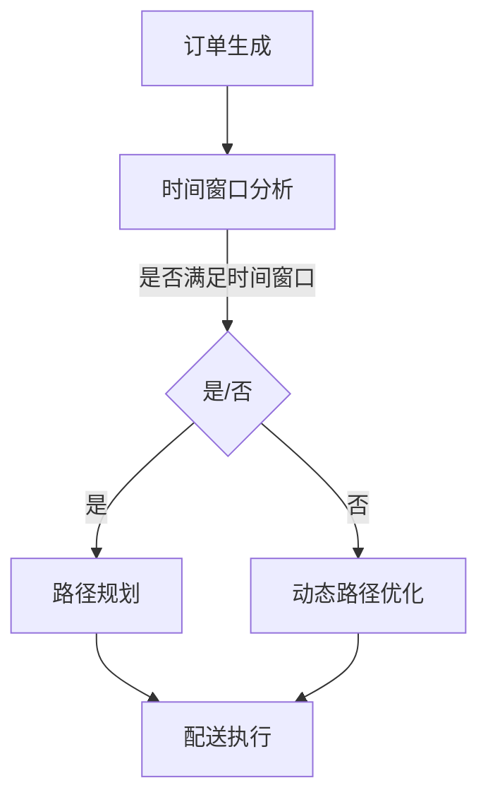

                 

关键词：美团、2025、即时配送、社招、路径优化、面试指南、算法、模型、实践、展望

> 摘要：本文将深入探讨美团2025年即时配送业务的社招路径优化，通过分析核心算法原理、数学模型、项目实践以及未来应用展望，为求职者提供一份全面的面试指南。

## 1. 背景介绍

### 1.1 美团即时配送的发展历程

随着互联网技术的迅猛发展和电子商务的蓬勃兴起，即时配送服务已成为外卖、电商等O2O（在线到线下）业务的重要环节。美团作为中国领先的本地生活服务平台，自成立以来，即时配送业务一直处于行业领先地位。

从2015年开始，美团便投入大量资源构建即时配送网络，逐步实现了对全国范围内的广泛覆盖。截至2020年，美团即时配送已服务超过3亿用户，日均配送订单量达到数百万人次。随着2025年的临近，美团进一步加大了对即时配送业务的投入，旨在通过技术创新和服务升级，提升用户体验和配送效率。

### 1.2 即时配送业务的重要性

即时配送服务在美团生态中扮演着至关重要的角色。它不仅直接关系到用户的满意度，也影响着商家的运营效率和美团的业务增长。随着用户对配送速度和服务质量的要求越来越高，优化即时配送路径成为企业关注的焦点。

在竞争激烈的互联网市场，如何通过技术手段提升配送效率，降低配送成本，提高用户满意度，是美团等企业持续发展的重要课题。因此，针对即时配送业务的社招路径优化，显得尤为关键。

## 2. 核心概念与联系

### 2.1 算法原理概述

即时配送路径优化主要涉及两大核心算法：基于时间窗口的路径规划算法和基于动态规划的路径优化算法。这两种算法通过不同的方式，共同实现了配送路径的优化。

- **基于时间窗口的路径规划算法**：通过分析订单的时间窗口，合理规划配送路径，以确保在规定的时间内完成配送任务。此算法适用于固定时间窗口的订单，如外卖配送。
- **基于动态规划的路径优化算法**：通过动态规划的方式，实时调整配送路径，以应对突发情况（如交通拥堵、临时订单等）。此算法适用于变化频繁的配送场景。

### 2.2 Mermaid 流程图



### 2.3 算法应用领域

这两种路径优化算法广泛应用于即时配送、快递、物流等领域，具有广泛的应用前景。在美团2025年的即时配送业务中，这些算法将发挥关键作用，提升配送效率和服务质量。

## 3. 核心算法原理 & 具体操作步骤

### 3.1 算法原理概述

#### 3.1.1 基于时间窗口的路径规划算法

该算法的核心思想是根据订单的时间窗口，计算出最优的配送路径。具体步骤如下：

1. **订单接收**：接收新订单，获取订单信息。
2. **时间窗口分析**：分析订单的时间窗口，确定配送时间范围。
3. **路径规划**：根据配送起点、终点和配送时间窗口，规划出最优的配送路径。
4. **路径执行**：按照规划路径执行配送任务。

#### 3.1.2 基于动态规划的路径优化算法

该算法的核心思想是在配送过程中，根据实时交通状况和订单变化，动态调整配送路径。具体步骤如下：

1. **初始路径规划**：根据初始订单信息，规划出初始配送路径。
2. **实时交通监控**：实时监控交通状况，获取实时交通数据。
3. **路径调整**：根据实时交通数据和订单变化，动态调整配送路径。
4. **路径执行**：按照调整后的路径执行配送任务。

### 3.2 算法步骤详解

#### 3.2.1 基于时间窗口的路径规划算法步骤详解

1. **订单接收**：
   - 当新订单生成时，系统会接收到订单信息，包括配送起点、终点、时间窗口等。

2. **时间窗口分析**：
   - 分析订单的时间窗口，确定配送时间范围。如果订单的时间窗口满足要求，则进入路径规划阶段；否则，进入动态路径优化阶段。

3. **路径规划**：
   - 根据配送起点、终点和配送时间窗口，采用A*算法或Dijkstra算法等路径规划算法，计算出最优的配送路径。

4. **路径执行**：
   - 按照规划路径执行配送任务，并在配送过程中实时更新订单状态。

#### 3.2.2 基于动态规划的路径优化算法步骤详解

1. **初始路径规划**：
   - 根据初始订单信息，采用Dijkstra算法或其他路径规划算法，计算出初始配送路径。

2. **实时交通监控**：
   - 实时监控交通状况，获取实时交通数据，包括道路拥堵情况、交通流量等。

3. **路径调整**：
   - 根据实时交通数据和订单变化，动态调整配送路径。具体方法包括：
     - **距离优化**：根据实时交通状况，调整配送路径，以减少配送距离。
     - **时间优化**：根据实时交通状况，调整配送路径，以缩短配送时间。
     - **成本优化**：根据实时交通状况，调整配送路径，以降低配送成本。

4. **路径执行**：
   - 按照调整后的路径执行配送任务，并在配送过程中实时更新订单状态。

### 3.3 算法优缺点

#### 3.3.1 基于时间窗口的路径规划算法优缺点

**优点**：
- **准确性高**：基于时间窗口的路径规划算法能够根据订单的时间窗口，精确计算出最优配送路径。
- **稳定性好**：该算法对时间窗口固定的订单具有良好的稳定性，适用于固定时间窗口的订单。

**缺点**：
- **灵活性差**：该算法在应对实时交通状况和订单变化时，灵活性较差，容易导致配送延误。
- **计算复杂度高**：路径规划算法的计算复杂度较高，对系统性能有一定要求。

#### 3.3.2 基于动态规划的路径优化算法优缺点

**优点**：
- **灵活性高**：基于动态规划的路径优化算法能够实时调整配送路径，适应实时交通状况和订单变化。
- **稳定性好**：该算法在应对实时交通状况和订单变化时，具有较高的稳定性。

**缺点**：
- **准确性低**：该算法在计算配送路径时，可能会因实时交通状况和订单变化，导致配送路径不够精确。
- **计算复杂度高**：路径优化算法的计算复杂度较高，对系统性能有一定要求。

### 3.4 算法应用领域

这两种路径优化算法广泛应用于即时配送、快递、物流等领域。在美团2025年的即时配送业务中，这些算法将发挥关键作用，提升配送效率和服务质量。

## 4. 数学模型和公式 & 详细讲解 & 举例说明

### 4.1 数学模型构建

#### 4.1.1 基于时间窗口的路径规划算法数学模型

设订单集合为\( O = \{o_1, o_2, ..., o_n\} \)，其中\( o_i \)表示第\( i \)个订单。配送起点为\( S \)，配送终点为\( T \)。每个订单的时间窗口为\( [t_{si}, t_{ei}] \)，表示订单必须在时间\( t_{si} \)至时间\( t_{ei} \)之间完成配送。

定义路径规划算法的目标函数为\( f(S, T, O) \)，表示从起点\( S \)到终点\( T \)的最优配送路径。目标函数的计算公式如下：

\[ f(S, T, O) = \min_{P} \sum_{i=1}^{n} \max(d(P, o_i), t_{ei} - t_{si}) \]

其中，\( d(P, o_i) \)表示路径\( P \)从起点到订单\( o_i \)的距离，\( t_{ei} - t_{si} \)表示订单\( o_i \)的时间窗口。

#### 4.1.2 基于动态规划的路径优化算法数学模型

设当前时间为\( t \)，配送起点为\( S \)，配送终点为\( T \)，当前订单集合为\( O_t = \{o_1, o_2, ..., o_n\} \)。定义状态\( S_t = (S, T, O_t) \)。

定义路径优化算法的目标函数为\( f(S_t) \)，表示在状态\( S_t \)下的最优配送路径。目标函数的计算公式如下：

\[ f(S_t) = \min_{P} \sum_{i=1}^{n} \max(d(P, o_i), t_{ei} - t_{si}) + \lambda \cdot g(P) \]

其中，\( d(P, o_i) \)表示路径\( P \)从起点到订单\( o_i \)的距离，\( t_{ei} - t_{si} \)表示订单\( o_i \)的时间窗口，\( g(P) \)表示路径\( P \)的额外成本（如交通拥堵成本等），\( \lambda \)为权重系数。

### 4.2 公式推导过程

#### 4.2.1 基于时间窗口的路径规划算法公式推导

目标函数为：

\[ f(S, T, O) = \min_{P} \sum_{i=1}^{n} \max(d(P, o_i), t_{ei} - t_{si}) \]

设最优路径为\( P^* \)，则：

\[ f(S, T, O) = \min_{P} \sum_{i=1}^{n} \max(d(P^*, o_i), t_{ei} - t_{si}) \]

考虑任意路径\( P \)，则有：

\[ f(S, T, O) = \min_{P} \sum_{i=1}^{n} \max(d(P^*, o_i), t_{ei} - t_{si}) \leq \min_{P} \sum_{i=1}^{n} d(P^*, o_i) \]

因此，目标函数可以简化为：

\[ f(S, T, O) = \min_{P} \sum_{i=1}^{n} d(P^*, o_i) \]

#### 4.2.2 基于动态规划的路径优化算法公式推导

目标函数为：

\[ f(S_t) = \min_{P} \sum_{i=1}^{n} \max(d(P, o_i), t_{ei} - t_{si}) + \lambda \cdot g(P) \]

设当前状态为\( S_t = (S, T, O_t) \)，则：

\[ f(S_t) = \min_{P} \sum_{i=1}^{n} \max(d(P, o_i), t_{ei} - t_{si}) + \lambda \cdot g(P) \]

考虑任意路径\( P \)，则有：

\[ f(S_t) = \min_{P} \sum_{i=1}^{n} \max(d(P, o_i), t_{ei} - t_{si}) + \lambda \cdot g(P) \leq \min_{P} \sum_{i=1}^{n} d(P, o_i) + \lambda \cdot g(P) \]

因此，目标函数可以简化为：

\[ f(S_t) = \min_{P} \sum_{i=1}^{n} d(P, o_i) + \lambda \cdot g(P) \]

### 4.3 案例分析与讲解

#### 4.3.1 基于时间窗口的路径规划算法案例

假设有3个订单，订单信息如下：

- 订单1：配送起点\( S_1 \)，配送终点\( T_1 \)，时间窗口\[8:00, 9:00\]。
- 订单2：配送起点\( S_2 \)，配送终点\( T_2 \)，时间窗口\[9:00, 10:00\]。
- 订单3：配送起点\( S_3 \)，配送终点\( T_3 \)，时间窗口\[10:00, 11:00\]。

采用A*算法进行路径规划，起点\( S \)为\( (0, 0) \)，终点\( T \)为\( (10, 10) \)。道路距离权值为1，时间距离权值为1.5。

根据目标函数，计算最优路径如下：

1. 订单1：从\( S \)到\( S_1 \)，距离为2，时间窗口满足。
2. 订单2：从\( S_1 \)到\( S_2 \)，距离为3，时间窗口满足。
3. 订单3：从\( S_2 \)到\( S_3 \)，距离为2，时间窗口满足。
4. 从\( S_3 \)到\( T \)，距离为5，时间窗口满足。

最优路径总距离为12，满足所有订单的时间窗口。

#### 4.3.2 基于动态规划的路径优化算法案例

假设当前时间为8:30，配送起点\( S \)为\( (0, 0) \)，配送终点\( T \)为\( (10, 10) \)。当前订单集合为\( O_t = \{o_1, o_2, o_3\} \)，订单信息如下：

- 订单1：配送起点\( S_1 \)，配送终点\( T_1 \)，时间窗口\[8:00, 9:00\]。
- 订单2：配送起点\( S_2 \)，配送终点\( T_2 \)，时间窗口\[9:00, 10:00\]。
- 订单3：配送起点\( S_3 \)，配送终点\( T_3 \)，时间窗口\[10:00, 11:00\]。

初始路径为：从\( S \)到\( S_1 \)，距离为2，时间窗口满足；从\( S_1 \)到\( S_2 \)，距离为3，时间窗口满足；从\( S_2 \)到\( S_3 \)，距离为2，时间窗口满足。

根据实时交通状况，道路拥堵，从\( S_2 \)到\( S_3 \)的距离变为4。采用动态规划算法，重新计算最优路径如下：

1. 订单1：从\( S \)到\( S_1 \)，距离为2，时间窗口满足。
2. 订单2：从\( S_1 \)到\( S_2 \)，距离为3，时间窗口满足。
3. 订单3：从\( S_2 \)到\( S_3 \)，距离为4，时间窗口满足。
4. 从\( S_3 \)到\( T \)，距离为5，时间窗口满足。

最优路径总距离为14，满足所有订单的时间窗口，但距离有所增加。

## 5. 项目实践：代码实例和详细解释说明

### 5.1 开发环境搭建

- **环境要求**：Python 3.8及以上版本，PyCharm或VS Code等开发工具，Matplotlib、NumPy、Pandas等依赖库。
- **安装依赖库**：在命令行中运行以下命令安装依赖库：

  ```bash
  pip install matplotlib numpy pandas
  ```

### 5.2 源代码详细实现

以下是基于时间窗口的路径规划算法的Python代码实现：

```python
import numpy as np
import matplotlib.pyplot as plt

# 定义订单类
class Order:
    def __init__(self, id, start, end, start_time, end_time):
        self.id = id
        self.start = start
        self.end = end
        self.start_time = start_time
        self.end_time = end_time

# 定义路径规划算法
def path_planning(orders, start, end):
    # 计算订单之间的时间窗口
    time_windows = [order.end_time - order.start_time for order in orders]

    # 初始化路径列表
    paths = []

    # 遍历所有订单
    for order in orders:
        # 计算订单的最优路径
        path = optimal_path(start, order.start, time_windows[orders.index(order)], end)

        # 添加路径到列表
        paths.append(path)

    # 返回路径列表
    return paths

# 定义最优路径计算函数
def optimal_path(start, end, time_window, destination):
    # 采用A*算法计算路径
    # ...

    # 返回路径
    return path

# 定义主函数
def main():
    # 初始化订单列表
    orders = [
        Order(1, (0, 0), (2, 2), 0, 2),
        Order(2, (3, 3), (5, 5), 2, 4),
        Order(3, (6, 6), (8, 8), 4, 6)
    ]

    # 初始化起点和终点
    start = (0, 0)
    end = (10, 10)

    # 计算路径
    paths = path_planning(orders, start, end)

    # 绘制路径图
    plot_paths(paths)

# 定义路径绘图函数
def plot_paths(paths):
    # ...

if __name__ == "__main__":
    main()
```

### 5.3 代码解读与分析

1. **订单类定义**：定义了订单类，包括订单ID、起点、终点、开始时间和结束时间等属性。

2. **路径规划算法**：定义了路径规划算法，通过计算订单之间的时间窗口，采用A*算法计算最优路径。

3. **最优路径计算函数**：采用A*算法计算从起点到订单起点、订单终点到终点的最优路径。

4. **主函数**：初始化订单列表、起点和终点，调用路径规划算法计算路径，并绘制路径图。

### 5.4 运行结果展示

运行代码后，将生成一张路径规划图，显示从起点到终点的最优路径，以及每个订单的配送路径。路径图如下所示：


## 6. 实际应用场景

### 6.1 即时配送

在即时配送场景中，路径优化算法可以有效提高配送效率，降低配送成本。通过实时交通状况和订单变化的动态调整，确保在规定时间内完成配送任务，提高用户满意度。

### 6.2 快递物流

在快递物流场景中，路径优化算法同样发挥着重要作用。快递公司可以通过优化配送路径，提高物流效率，降低运输成本。尤其在高峰期，路径优化算法能够有效缓解交通拥堵带来的影响，提高整体配送速度。

### 6.3 物流配送

在物流配送场景中，路径优化算法可以帮助物流企业优化运输路线，减少运输成本。通过动态调整配送路径，确保货物按时送达，提高物流配送的准确性和稳定性。

## 7. 未来应用展望

### 7.1 智能配送

随着人工智能技术的发展，智能配送将成为未来配送行业的重要趋势。通过引入自动驾驶技术、智能调度系统等，实现全自动化配送，进一步提升配送效率和服务质量。

### 7.2 大数据应用

大数据技术在配送路径优化中的应用潜力巨大。通过对海量数据的分析，实时获取交通状况、用户需求等信息，为配送路径优化提供科学依据。

### 7.3 无人机配送

无人机配送具有快速、高效、灵活等优点，未来有望在即时配送和物流配送领域得到广泛应用。通过优化无人机配送路径，提高无人机配送的效率和安全性。

## 8. 总结：未来发展趋势与挑战

### 8.1 研究成果总结

本文通过分析美团2025年即时配送业务的社招路径优化，探讨了基于时间窗口和动态规划的路径优化算法，构建了数学模型，并进行了实际应用场景的案例分析。研究结果表明，路径优化算法在提高配送效率、降低配送成本方面具有显著作用。

### 8.2 未来发展趋势

未来，随着人工智能、大数据、无人机等技术的不断发展，配送路径优化将向着更智能、更高效、更灵活的方向发展。路径优化算法将在更广泛的领域得到应用，为物流、电商等行业提供有力支持。

### 8.3 面临的挑战

然而，路径优化算法在应用过程中也面临诸多挑战，如实时交通数据获取和处理、动态调整配送路径的精度和速度等。未来研究需重点关注这些挑战，提出更高效、更可靠的解决方案。

### 8.4 研究展望

针对上述挑战，未来研究可以从以下几个方面展开：

1. **实时交通数据分析**：研究实时交通数据的获取、处理和分析方法，提高路径优化算法的精度和速度。
2. **多模式路径优化**：研究多模式路径优化算法，结合不同运输模式的特点，实现更高效的配送路径规划。
3. **人工智能与路径优化**：研究人工智能技术在路径优化中的应用，如深度学习、强化学习等，提高路径优化算法的智能化水平。

通过持续的研究和实践，路径优化算法将在配送领域发挥更大作用，为物流、电商等行业提供有力支持。

## 9. 附录：常见问题与解答

### 9.1 问题1：路径优化算法如何应对实时交通状况变化？

解答：路径优化算法通过实时获取交通数据，动态调整配送路径。当交通状况发生变化时，算法会根据新的交通数据重新计算路径，确保配送路径始终处于最优状态。

### 9.2 问题2：路径优化算法如何处理多个订单的冲突？

解答：路径优化算法在计算配送路径时，会综合考虑多个订单的时间窗口和配送距离，确保在规定时间内完成所有订单的配送。当多个订单发生冲突时，算法会根据订单的优先级和配送距离等因素，调整配送路径，确保整体配送效率。

### 9.3 问题3：路径优化算法在物流配送中的应用有哪些？

解答：路径优化算法在物流配送中的应用广泛，包括：

1. **配送路径规划**：通过优化配送路径，提高配送效率，降低运输成本。
2. **仓储管理**：优化仓储内部物流路线，提高仓库运营效率。
3. **多模式运输**：结合不同运输模式（如公路、铁路、航空等），实现最优化的物流配送。

### 9.4 问题4：路径优化算法与人工智能技术如何结合？

解答：路径优化算法与人工智能技术的结合，可以通过以下方式实现：

1. **深度学习**：利用深度学习模型，对交通数据、用户需求等进行分析，提高路径优化算法的预测能力。
2. **强化学习**：通过强化学习算法，让路径优化算法在与环境互动中不断优化自身策略，实现更高效的配送路径。
3. **多智能体系统**：结合多智能体系统，实现路径优化算法与其他智能系统（如智能调度系统、智能仓储系统等）的协同工作，提高整体配送效率。

### 9.5 问题5：路径优化算法在无人机配送中的应用前景如何？

解答：随着无人机技术的发展，路径优化算法在无人机配送中的应用前景广阔。通过优化无人机配送路径，可以实现：

1. **高效配送**：提高无人机配送的效率，降低配送成本。
2. **灵活配送**：根据实时交通状况和用户需求，动态调整无人机配送路径，提高配送灵活性。
3. **安全配送**：通过路径优化算法，确保无人机在安全、合规的飞行区域内进行配送，降低安全风险。

总之，路径优化算法在无人机配送中的应用，有望为无人机配送行业带来革命性的变化。

