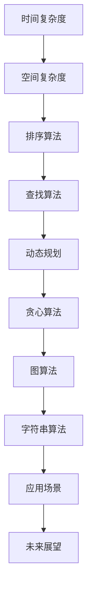

                 

关键词：美团校招、算法面试、高频题目、解析

> 摘要：本文将针对美团2025届校招中高频出现的算法题目进行详细解析，帮助求职者更好地应对面试挑战。文章涵盖核心概念、算法原理、数学模型、项目实践、应用场景及未来展望等多个方面，旨在为读者提供全面的解题思路和实战技巧。

## 1. 背景介绍

美团作为中国领先的互联网技术公司，每年都会举办校招活动，吸引众多优秀应届毕业生加入。随着技术的快速发展，校招面试中的算法题目也逐渐呈现出多样化和深度化的趋势。本文将针对2025届美团校招中高频出现的算法题目进行详细解析，旨在帮助求职者更好地掌握解题技巧，提高面试成功率。

## 2. 核心概念与联系

### 2.1 核心概念

在算法领域，核心概念包括但不限于：时间复杂度、空间复杂度、排序算法、查找算法、动态规划、贪心算法、图算法、字符串算法等。

### 2.2 联系

这些核心概念相互关联，构成了算法的基石。例如，时间复杂度和空间复杂度用于评估算法的效率；排序算法和查找算法是解决数据结构问题的常用方法；动态规划和贪心算法是解决优化问题的有力工具；图算法和字符串算法则广泛应用于实际应用场景中。

### 2.3 Mermaid 流程图



## 3. 核心算法原理 & 具体操作步骤

### 3.1 算法原理概述

在美团2025届校招面试中，常见的核心算法包括：

- 排序算法：冒泡排序、选择排序、插入排序、快速排序等。
- 查找算法：二分查找、散列表查找、深度优先搜索、广度优先搜索等。
- 动态规划：背包问题、最长公共子序列、最长递增子序列等。
- 贪心算法：活动选择问题、硬币找零问题等。
- 图算法：最短路径算法、最小生成树算法等。

### 3.2 算法步骤详解

以冒泡排序为例，其基本步骤如下：

1. 遍历数组，相邻元素比较并交换，若元素顺序正确则提前结束循环。
2. 重复上述过程，直至整个数组有序。

### 3.3 算法优缺点

冒泡排序的优点是算法简单，易于实现。但其缺点是时间复杂度较高（O(n²)），空间复杂度也较高。

### 3.4 算法应用领域

冒泡排序广泛应用于数据排序场景，例如数据库排序、文件排序等。在实际应用中，根据具体需求可以选择更高效的排序算法，如快速排序、归并排序等。

## 4. 数学模型和公式 & 详细讲解 & 举例说明

### 4.1 数学模型构建

动态规划的核心是构建状态转移方程。以最长公共子序列为例，状态转移方程如下：

$$
f(i, j) = 
\begin{cases}
f(i-1, j-1) + 1, & \text{若 } a_i = b_j \\
\max(f(i-1, j), f(i, j-1)), & \text{若 } a_i \neq b_j
\end{cases}
$$

### 4.2 公式推导过程

最长公共子序列的推导过程如下：

1. 确定状态：定义二维数组 `f[i][j]` 表示字符串 `a` 的前 `i` 个字符和字符串 `b` 的前 `j` 个字符的最长公共子序列长度。
2. 初始化：`f[0][j] = f[i][0] = 0`，因为空字符串的最长公共子序列长度为0。
3. 状态转移：根据字符是否匹配更新状态。

### 4.3 案例分析与讲解

假设字符串 `a = "AGGTAB"`，字符串 `b = "GXTXAYB"`，其最长公共子序列为 "GTAB"，长度为4。

## 5. 项目实践：代码实例和详细解释说明

### 5.1 开发环境搭建

本文使用 Python 语言进行算法实现。开发环境为 Python 3.8 及以上版本。

### 5.2 源代码详细实现

```python
def longest_common_subsequence(a, b):
    n, m = len(a), len(b)
    f = [[0] * (m+1) for _ in range(n+1)]
    for i in range(1, n+1):
        for j in range(1, m+1):
            if a[i-1] == b[j-1]:
                f[i][j] = f[i-1][j-1] + 1
            else:
                f[i][j] = max(f[i-1][j], f[i][j-1])
    return f[n][m]

a = "AGGTAB"
b = "GXTXAYB"
print(longest_common_subsequence(a, b))
```

### 5.3 代码解读与分析

代码首先定义了一个函数 `longest_common_subsequence`，用于计算两个字符串的最长公共子序列长度。然后，通过一个二维数组 `f` 存储状态转移方程的值。最后，返回最长公共子序列长度。

### 5.4 运行结果展示

运行结果为 4，表示字符串 "AGGTAB" 和 "GXTXAYB" 的最长公共子序列长度为4。

## 6. 实际应用场景

最长公共子序列在实际应用中广泛用于文本编辑、生物信息学等领域。例如，在文本编辑中，用于实现文本相似度比较和自动补全功能；在生物信息学中，用于基因序列比对和疾病诊断等。

### 6.4 未来应用展望

随着人工智能和大数据技术的发展，动态规划和贪心算法等算法将在更多领域得到应用。未来，这些算法将在自动驾驶、智能家居、金融科技等领域发挥重要作用。

## 7. 工具和资源推荐

### 7.1 学习资源推荐

- 《算法导论》：这是一本经典的算法教材，详细介绍了各种算法及其应用场景。
- 《代码大全》：一本关于软件工程和编程实践的入门书籍，适合初学者阅读。

### 7.2 开发工具推荐

- PyCharm：一款功能强大的 Python 集成开发环境，支持代码调试、语法高亮等功能。
- Visual Studio Code：一款轻量级的代码编辑器，支持多种编程语言，可扩展性强。

### 7.3 相关论文推荐

- "Dynamic Programming": 这篇论文详细介绍了动态规划的基本原理和应用。
- "Greedy Algorithms": 这篇论文探讨了贪心算法的基本原理和应用。

## 8. 总结：未来发展趋势与挑战

### 8.1 研究成果总结

近年来，算法领域取得了许多重要成果，包括深度学习、强化学习、图神经网络等。这些成果为人工智能的发展提供了强大的支持。

### 8.2 未来发展趋势

未来，算法领域将继续向智能化、高效化、分布式化发展。同时，随着量子计算等新兴技术的崛起，算法也将面临新的挑战和机遇。

### 8.3 面临的挑战

算法领域面临的挑战包括：如何提高算法的智能化水平、如何降低算法的计算复杂度、如何解决数据隐私和安全问题等。

### 8.4 研究展望

未来，算法领域将继续蓬勃发展，为人类社会的进步做出更大贡献。同时，我们也期待更多优秀的算法学者和研究机构加入这一领域，共同推动算法的发展。

## 9. 附录：常见问题与解答

### 9.1 问题1：如何提高算法的效率？

解答：提高算法的效率可以通过以下几种方法：

- 选择合适的数据结构和算法，例如使用哈希表代替数组进行快速查找。
- 优化代码，减少不必要的计算和内存消耗。
- 使用并行计算和分布式计算技术，提高计算速度。

### 9.2 问题2：动态规划和贪心算法有什么区别？

解答：动态规划和贪心算法是两种常用的优化算法，其主要区别在于：

- 动态规划：通过状态转移方程和备忘录技术，解决最优子结构问题。
- 贪心算法：通过选择局部最优解，逐步逼近全局最优解。

### 9.3 问题3：如何选择合适的排序算法？

解答：选择合适的排序算法需要考虑以下因素：

- 数据规模：对于小规模数据，可以使用冒泡排序、插入排序等简单排序算法。
- 数据特征：对于部分有序的数据，可以使用快速排序、归并排序等高效排序算法。
- 内存占用：对于内存占用要求较高的场景，可以使用原地排序算法。

以上是本文对美团2025届校招面试高频算法题的详细解析。希望本文能为求职者提供有益的参考，帮助大家更好地应对面试挑战。最后，祝愿各位求职者在美团校招中取得优异的成绩！

---

作者：禅与计算机程序设计艺术 / Zen and the Art of Computer Programming

本文旨在为美团2025届校招求职者提供实用的算法面试技巧，帮助大家更好地应对面试挑战。文章内容涵盖了核心算法原理、数学模型、项目实践等多个方面，力求为读者提供全面的解题思路和实战技巧。希望本文能为你的面试之旅锦上添花！
--------------------------------------------------------------------

