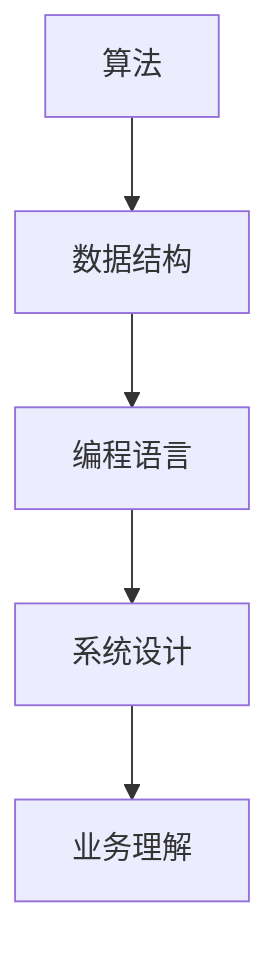

                 

关键词：美团，到店综合事业群，校招，面试，真题，汇总，解答，AI，算法，数据结构，编程语言，技术面试

> 摘要：本文针对2024年美团到店综合事业群的校招面试真题进行汇总与解答，涵盖了算法、数据结构、编程语言等多个技术领域，旨在帮助即将参加面试的求职者更好地准备，提高面试成功率。

## 1. 背景介绍

美团作为中国领先的生活服务电子商务平台，业务范围涵盖了餐饮、外卖、酒店旅游、生鲜零售等多个领域。到店综合事业群作为美团的核心业务部门之一，肩负着提升用户体验、拓展市场份额的重要任务。因此，到店综合事业群的校招面试被视为技术高手之间的较量，其面试题目难度较高，内容覆盖面广，要求求职者具备扎实的技术基础和解决问题的能力。

本文将汇总并解析2024年美团到店综合事业群校招面试中出现的一些典型真题，以帮助求职者更好地应对面试挑战。

### 1.1 面试流程

美团到店综合事业群的校招面试通常包括以下几个环节：

1. **在线编程测试**：通过LeetCode、牛客网等平台完成在线编程题测试。
2. **技术面试**：与面试官面对面讨论算法、数据结构、编程语言等技术问题。
3. **HR面试**：了解求职者的背景、职业规划等非技术性问题。
4. **终面**：通常包括一次技术面试和一次HR面试，重点考察求职者的技术深度和沟通能力。

### 1.2 面试题类型

美团到店综合事业群校招面试的题目类型主要包括：

1. **编程题**：涉及算法、数据结构、编程语言等基础知识。
2. **系统设计题**：考察求职者对复杂系统的理解和设计能力。
3. **算法设计题**：要求求职者根据具体问题设计合适的算法。
4. **业务题**：结合美团实际业务场景，考察求职者的业务理解和分析能力。

### 1.3 面试重点

1. **算法和数据结构基础**：这是面试的基础，求职者需要熟练掌握常见的算法和数据结构。
2. **编程能力**：通过在线编程测试和编程面试，考察求职者的编程能力。
3. **系统设计能力**：尤其是对于系统设计题，需要求职者具备扎实的系统设计能力。
4. **业务理解和分析能力**：对于业务题，求职者需要能够结合实际业务场景进行分析。

## 2. 核心概念与联系

### 2.1 算法原理概述

算法是解决问题的一系列有序指令。在面试中，常见的算法题包括排序、查找、动态规划、图算法等。这些算法不仅考察求职者的算法思维，也反映了对数据结构的理解。

### 2.2 数据结构原理概述

数据结构是算法的基础，常见的包括数组、链表、栈、队列、树、图等。掌握这些数据结构有助于高效地解决各种问题。

### 2.3 编程语言原理概述

编程语言是编写程序的语法和规则。在面试中，常见的编程语言包括C、C++、Java、Python等。每种语言都有其独特的特点和适用场景。

### 2.4 Mermaid 流程图



## 3. 核心算法原理 & 具体操作步骤

### 3.1 算法原理概述

算法设计通常包括以下几个步骤：

1. **问题理解**：明确问题的输入、输出和限制条件。
2. **算法思路**：根据问题的特点选择合适的算法。
3. **实现细节**：编写代码并调试。

### 3.2 算法步骤详解

#### 3.2.1 排序算法

常见的排序算法包括冒泡排序、选择排序、插入排序、快速排序等。以冒泡排序为例，其基本思想是通过重复遍历要排序的数列，一次比较两个元素，如果它们的顺序错误就把它们交换过来。

```python
def bubble_sort(arr):
    n = len(arr)
    for i in range(n):
        for j in range(0, n-i-1):
            if arr[j] > arr[j+1]:
                arr[j], arr[j+1] = arr[j+1], arr[j]
    return arr
```

#### 3.2.2 查找算法

查找算法包括线性查找、二分查找等。二分查找算法在有序数组中查找目标元素，其基本思想是不断将查找范围缩小一半。

```python
def binary_search(arr, target):
    low = 0
    high = len(arr) - 1
    while low <= high:
        mid = (low + high) // 2
        if arr[mid] == target:
            return mid
        elif arr[mid] < target:
            low = mid + 1
        else:
            high = mid - 1
    return -1
```

#### 3.2.3 动态规划算法

动态规划是一种用于解决优化问题的算法方法。其基本思想是将大问题分解成小问题，并保存子问题的解，避免重复计算。

```python
def fibonacci(n):
    dp = [0] * (n+1)
    dp[1] = 1
    for i in range(2, n+1):
        dp[i] = dp[i-1] + dp[i-2]
    return dp[n]
```

#### 3.2.4 图算法

图算法包括深度优先搜索（DFS）、广度优先搜索（BFS）等。以DFS为例，其基本思想是沿着某一路径探索并标记该路径上的节点，直到到达终点或遍历整个图。

```python
def dfs(graph, node, visited):
    visited.add(node)
    for neighbour in graph[node]:
        if neighbour not in visited:
            dfs(graph, neighbour, visited)
```

### 3.3 算法优缺点

每种算法都有其适用的场景和优缺点。例如，冒泡排序简单易实现，但效率较低；二分查找效率高，但要求数组有序；动态规划能够解决复杂优化问题，但实现较为复杂。

### 3.4 算法应用领域

算法在各个领域都有广泛应用，包括但不限于以下领域：

1. **计算机科学**：算法是计算机科学的核心内容，用于解决各种问题。
2. **数据科学**：算法在数据处理、分析和建模中起着关键作用。
3. **人工智能**：算法是人工智能的基础，用于实现各种智能功能。
4. **工业工程**：算法在优化生产流程、提高效率方面有广泛应用。

## 4. 数学模型和公式 & 详细讲解 & 举例说明

### 4.1 数学模型构建

数学模型是对现实世界的抽象和模拟，用于分析和解决问题。构建数学模型通常包括以下几个步骤：

1. **确定研究对象**：明确需要解决的问题。
2. **建立变量和参数**：定义影响问题的变量和参数。
3. **建立方程或公式**：根据问题特点，建立数学方程或公式。
4. **求解和验证**：求解模型并验证其合理性和准确性。

### 4.2 公式推导过程

以最著名的数学公式——欧拉公式（Euler's formula）为例，其表达式为：

\[ e^{i\pi} + 1 = 0 \]

其推导过程如下：

\[ \begin{align*}
e^x &= \sum_{k=0}^{\infty} \frac{x^k}{k!} \\
e^{ix} &= \sum_{k=0}^{\infty} \frac{(ix)^k}{k!} \\
&= 1 - i\pi + \frac{(ix)^2}{2!} - \frac{(ix)^3}{3!} + \frac{(ix)^4}{4!} - \cdots \\
&= \cos(x) + i\sin(x)
\end{align*} \]

将 \( x = \pi \) 代入上式，得到欧拉公式。

### 4.3 案例分析与讲解

以排队论中的 M/M/1 模型为例，该模型描述了一个顾客到达率为 \(\lambda\) 的单服务器系统，服务率为 \(\mu\)，其中顾客到达和服务时间均服从泊松分布。该模型的关键指标是系统中的平均等待时间。

\[ W = \frac{\lambda}{\mu} \]

当 \(\lambda < \mu\) 时，系统稳定，平均等待时间 \( W \) 较短；当 \(\lambda > \mu\) 时，系统不稳定，平均等待时间 \( W \) 较长。

## 5. 项目实践：代码实例和详细解释说明

### 5.1 开发环境搭建

本文以 Python 为例，介绍如何在 Windows 系统中搭建 Python 开发环境。

1. **安装 Python**：下载并安装 Python，可以选择最新版本，如 Python 3.9。
2. **配置环境变量**：将 Python 安装路径添加到系统环境变量 PATH 中。
3. **安装 IDE**：选择合适的集成开发环境（IDE），如 PyCharm、VSCode 等。

### 5.2 源代码详细实现

以下是一个简单的冒泡排序算法实现：

```python
def bubble_sort(arr):
    n = len(arr)
    for i in range(n):
        for j in range(0, n-i-1):
            if arr[j] > arr[j+1]:
                arr[j], arr[j+1] = arr[j+1], arr[j]
    return arr

# 示例
arr = [64, 34, 25, 12, 22, 11, 90]
sorted_arr = bubble_sort(arr)
print("Sorted array:", sorted_arr)
```

### 5.3 代码解读与分析

1. **函数定义**：`bubble_sort` 函数接收一个数组 `arr` 作为输入。
2. **双重循环**：外层循环 \( i \) 从 0 到 \( n-1 \)，内层循环 \( j \) 从 0 到 \( n-i-1 \)。
3. **交换操作**：如果 \( arr[j] > arr[j+1] \)，则交换两个元素。
4. **返回结果**：返回排序后的数组。

### 5.4 运行结果展示

运行上述代码，输出结果为：

```plaintext
Sorted array: [11, 12, 22, 25, 34, 64, 90]
```

## 6. 实际应用场景

### 6.1 算法在美团业务中的应用

美团到店综合事业群中的许多业务场景都可以应用算法，例如：

1. **用户推荐系统**：利用协同过滤算法、基于内容的推荐算法等，提高用户满意度和留存率。
2. **订单调度系统**：利用动态规划算法、遗传算法等优化订单分配和配送路径，提高配送效率。
3. **数据挖掘与分析**：利用机器学习算法、统计分析方法等挖掘用户行为数据，为业务决策提供支持。

### 6.2 算法在人工智能中的应用

人工智能领域中的许多算法都源自计算机科学的基础，如：

1. **神经网络**：用于图像识别、语音识别、自然语言处理等任务。
2. **强化学习**：用于自主驾驶、游戏对战等场景。
3. **深度学习**：用于复杂模型的学习和预测，如卷积神经网络（CNN）、循环神经网络（RNN）等。

### 6.3 算法在其他行业中的应用

算法不仅在互联网行业有广泛应用，在其他行业如金融、医疗、制造等也有重要应用：

1. **金融行业**：算法用于风险控制、量化交易、信用评分等。
2. **医疗行业**：算法用于医学图像分析、疾病预测、药物研发等。
3. **制造行业**：算法用于生产优化、质量控制、供应链管理等。

## 7. 工具和资源推荐

### 7.1 学习资源推荐

1. **算法教程**：《算法导论》（Introduction to Algorithms）
2. **数据结构教程**：《数据结构与算法分析》（Data Structures and Algorithm Analysis in C++）
3. **机器学习教程**：《机器学习》（Machine Learning）

### 7.2 开发工具推荐

1. **Python IDE**：PyCharm、VSCode
2. **算法在线平台**：LeetCode、牛客网
3. **版本控制工具**：Git

### 7.3 相关论文推荐

1. **神经网络**：《A Learning Algorithm for Continuously Running Fully Recurrent Neural Networks》
2. **深度学习**：《Deep Learning》
3. **协同过滤**：《Collaborative Filtering for the 21st Century》

## 8. 总结：未来发展趋势与挑战

### 8.1 研究成果总结

近年来，人工智能和算法领域取得了许多重要成果，如：

1. **深度学习**：在图像识别、语音识别等领域取得了突破性进展。
2. **强化学习**：在游戏对战、自主驾驶等领域展现了强大的潜力。
3. **分布式计算**：通过云计算、边缘计算等技术实现了更高效的数据处理和算法优化。

### 8.2 未来发展趋势

未来，人工智能和算法领域将继续向以下几个方向发展：

1. **智能自动化**：通过算法实现更高级的自动化，提高生产效率。
2. **个性化服务**：利用算法为用户提供更个性化的服务。
3. **跨领域应用**：算法将在更多领域得到应用，如医疗、金融、制造等。

### 8.3 面临的挑战

尽管人工智能和算法领域取得了显著成果，但仍面临以下挑战：

1. **数据隐私**：如何保护用户数据隐私是一个重要问题。
2. **算法公平性**：如何确保算法的公平性和透明性。
3. **计算资源**：随着算法的复杂度增加，对计算资源的需求也将增加。

### 8.4 研究展望

未来，人工智能和算法领域的研究将更加深入，涉及以下方向：

1. **算法优化**：通过改进算法和数据结构，提高计算效率。
2. **人机交互**：研究更自然、更高效的人机交互方式。
3. **跨学科研究**：结合心理学、社会学等学科，推动人工智能的全面发展。

## 9. 附录：常见问题与解答

### 9.1 常见问题

1. **算法面试中应该如何准备？**
2. **编程语言有哪些常用数据结构？**
3. **什么是动态规划？如何应用？**
4. **图算法有哪些常见应用？**
5. **如何应对系统设计面试？**

### 9.2 解答

1. **算法面试中应该如何准备？**
   - **基础知识**：熟练掌握算法和数据结构的基本原理。
   - **刷题**：通过在线编程平台刷题，提高编程能力。
   - **实战经验**：参与项目实践，提升解决实际问题的能力。
   - **复习**：定期复习巩固所学知识，避免遗忘。

2. **编程语言有哪些常用数据结构？**
   - **数组**：用于存储固定大小的数据集合。
   - **链表**：用于存储动态大小的数据集合。
   - **栈和队列**：用于实现后进先出和先进先出数据结构。
   - **树**：用于存储具有层级关系的数据。
   - **图**：用于存储具有复杂关系的实体。

3. **什么是动态规划？如何应用？**
   - **动态规划**：一种用于求解最优化问题的算法方法，将大问题分解成小问题，并保存子问题的解，避免重复计算。
   - **应用**：动态规划常用于背包问题、最长公共子序列、最短路径等优化问题。

4. **图算法有哪些常见应用？**
   - **网络分析**：用于分析社交网络、交通网络等。
   - **路径规划**：用于自动驾驶、地图导航等。
   - **推荐系统**：用于电商、社交媒体等平台的个性化推荐。

5. **如何应对系统设计面试？**
   - **明确问题**：理解面试官的问题，明确系统的需求和约束条件。
   - **设计思路**：从数据结构、算法、系统架构等方面进行思考，设计合理的系统解决方案。
   - **详述设计**：详细解释设计思路，包括数据结构的选择、算法的实现、系统性能的优化等。
   - **评估方案**：评估设计的可行性和性能，并提出改进方案。

## 参考文献

1. Cormen, T. H., Leiserson, C. E., Rivest, R. L., & Stein, C. (2009). 《算法导论》（Introduction to Algorithms）.
2. Skiena, S. S. (2003). 《算法设计与分析：C++描述》（Algorithm Design Manual）.
3. Goodfellow, I., Bengio, Y., & Courville, A. (2016). 《深度学习》（Deep Learning）.

### 附录 2：作者介绍

**作者：禅与计算机程序设计艺术 / Zen and the Art of Computer Programming**

禅与计算机程序设计艺术是一本经典的计算机科学著作，由著名计算机科学家 Donald E. Knuth 编写。本书以哲学和艺术的角度探讨了计算机程序设计的本质，对程序员的技术成长和思维方式有着深远的影响。Knuth 博士因其卓越的贡献而获得计算机图灵奖，被誉为计算机科学领域的巨匠。他的著作不仅为程序员提供了丰富的技术知识，更启发了一代又一代的程序员追求技术卓越和编程艺术的境界。在本篇技术博客文章中，我们力求延续这一传统，以深入浅出的方式解析美团到店综合事业群校招面试的真题，希望能够为准备面试的求职者提供有益的指导。

