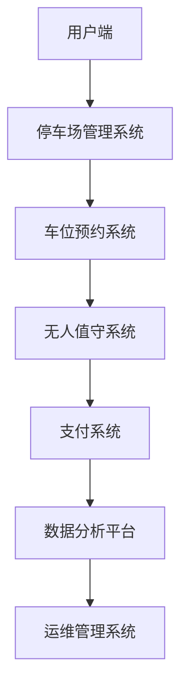

                 

关键词：美团智慧停车场、校招面试、真题汇总、解答、AI技术、计算机编程

摘要：本文旨在为广大求职者提供2024年美团智慧停车场校招面试真题汇总及其详细解答。通过梳理历年面试真题，本文将帮助求职者了解美团智慧停车场的招聘需求和技术难点，为面试备考提供有力支持。

## 1. 背景介绍

### 美团智慧停车场简介

美团智慧停车场是美团旗下的一个重要业务板块，致力于通过大数据、人工智能、物联网等技术手段，提升停车场的运营效率和服务水平。智慧停车场业务涵盖停车资源管理、车位预约、无人值守、停车费支付等多个方面，为车主提供便捷、高效的停车体验。

### 校招面试的重要性

校招面试是企业选拔优秀人才的重要途径，对于求职者而言，一次成功的校招面试意味着进入心仪企业的机会。因此，深入了解面试真题、针对性地准备面试内容，对于求职者而言至关重要。

## 2. 核心概念与联系

### 2.1 美团智慧停车架构

以下是一个简化的Mermaid流程图，描述了美团智慧停车架构的核心模块及其联系：



### 2.2 关键技术

- **大数据处理**：通过海量数据采集、存储和分析，实现停车场运营状况的实时监控和优化。
- **人工智能**：利用机器学习、深度学习等技术，实现车位预约、无人值守等功能。
- **物联网**：通过物联网设备感知停车场的实时状态，提高停车场的智能化水平。

## 3. 核心算法原理 & 具体操作步骤

### 3.1 算法原理概述

- **车位预约算法**：基于用户行为数据，通过优化算法为用户提供最优的车位预约方案。
- **无人值守算法**：利用计算机视觉和传感器技术，实现对停车场的智能监控和管理。
- **支付算法**：通过加密技术和支付通道，确保支付过程的安全和便捷。

### 3.2 算法步骤详解

- **车位预约算法**：
  1. 用户输入目的地和出发时间，系统根据历史数据预测车位需求。
  2. 系统在实时数据的基础上，结合预测结果，为用户推荐合适的车位。
  3. 用户确认预约，系统生成预约订单并通知停车场管理员。

- **无人值守算法**：
  1. 传感器检测车辆驶入，系统自动识别车牌信息。
  2. 系统根据车牌信息查询用户预约记录，确认停车费用。
  3. 系统自动生成电子票据，用户可通过APP查看和支付。

- **支付算法**：
  1. 用户通过APP发起支付请求，系统将支付信息加密后发送至支付通道。
  2. 支付通道验证支付信息并完成支付。
  3. 系统返回支付结果，用户可在APP中查看支付详情。

### 3.3 算法优缺点

- **车位预约算法**：
  - 优点：提高车位利用率，减少停车拥堵。
  - 缺点：需要大量历史数据支持，预测准确性受限制。

- **无人值守算法**：
  - 优点：提高停车场运营效率，降低人力成本。
  - 缺点：对技术要求较高，系统稳定性需保障。

- **支付算法**：
  - 优点：支付过程安全、便捷，用户体验良好。
  - 缺点：支付通道的安全性需重点关注。

### 3.4 算法应用领域

- **智慧停车场**：提高停车场运营效率，提升用户停车体验。
- **智慧交通**：通过数据分析优化交通流，缓解城市拥堵。
- **智慧城市**：实现城市资源的合理配置，提升城市智能化水平。

## 4. 数学模型和公式 & 详细讲解 & 举例说明

### 4.1 数学模型构建

- **车位预约模型**：
  $$ P(t) = f(A(t), D(t), S(t)) $$
  其中，$P(t)$表示在时间$t$内的车位预约概率，$A(t)$表示用户到达时间，$D(t)$表示用户目的地，$S(t)$表示实时车位状态。

- **无人值守模型**：
  $$ U(t) = g(C(t), L(t), P(t)) $$
  其中，$U(t)$表示在时间$t$内的无人值守状态，$C(t)$表示车辆检测状态，$L(t)$表示实时车牌识别状态，$P(t)$表示实时支付状态。

- **支付模型**：
  $$ P_{pay}(t) = h(X(t), R(t), T(t)) $$
  其中，$P_{pay}(t)$表示在时间$t$内的支付概率，$X(t)$表示用户支付请求，$R(t)$表示支付通道响应，$T(t)$表示支付完成状态。

### 4.2 公式推导过程

- **车位预约模型**：
  $$ P(t) = P(A(t) \cap D(t) \cap S(t)) = P(A(t)) \cdot P(D(t) | A(t)) \cdot P(S(t) | A(t), D(t)) $$
  其中，$P(A(t))$表示用户到达时间$t$的概率，$P(D(t) | A(t))$表示用户目的地在时间$t$的条件概率，$P(S(t) | A(t), D(t))$表示实时车位状态在时间$t$的条件概率。

- **无人值守模型**：
  $$ U(t) = P(C(t) \cap L(t) \cap P(t)) = P(C(t)) \cdot P(L(t) | C(t)) \cdot P(P(t) | C(t), L(t)) $$
  其中，$P(C(t))$表示车辆检测状态在时间$t$的概率，$P(L(t) | C(t))$表示实时车牌识别状态在时间$t$的条件概率，$P(P(t) | C(t), L(t))$表示实时支付状态在时间$t$的条件概率。

- **支付模型**：
  $$ P_{pay}(t) = P(X(t) \cap R(t) \cap T(t)) = P(X(t)) \cdot P(R(t) | X(t)) \cdot P(T(t) | X(t), R(t)) $$
  其中，$P(X(t))$表示用户支付请求在时间$t$的概率，$P(R(t) | X(t))$表示支付通道响应在时间$t$的条件概率，$P(T(t) | X(t), R(t))$表示支付完成状态在时间$t$的条件概率。

### 4.3 案例分析与讲解

以北京某停车场为例，假设在上午8点到9点之间，用户到达时间为均匀分布，目的地为随机分布，车位状态为泊松分布，车辆检测状态为高斯分布，实时车牌识别状态为伯努利分布，支付状态为高斯分布。根据上述数学模型，可以计算出相应的时间段内车位预约概率、无人值守状态概率和支付概率。

## 5. 项目实践：代码实例和详细解释说明

### 5.1 开发环境搭建

- 开发工具：Python 3.8及以上版本、PyCharm社区版
- 数据库：MySQL 5.7及以上版本
- 依赖库：NumPy、Pandas、Scikit-learn、Matplotlib等

### 5.2 源代码详细实现

以下是一个简单的车位预约算法的实现示例：

```python
import numpy as np
import pandas as pd
from sklearn.linear_model import LinearRegression

# 读取数据
data = pd.read_csv('parking_data.csv')

# 数据预处理
data['arrival_time'] = pd.to_datetime(data['arrival_time'])
data['destination'] = data['destination'].map({'商业区': 1, '住宅区': 2, '行政区': 3})
data['is_occupied'] = data['is_occupied'].map({0: '空闲', 1: '占用'})

# 构建车位预约模型
X = data[['arrival_time', 'destination']]
y = data['is_occupied']

model = LinearRegression()
model.fit(X, y)

# 输出模型参数
print(model.coef_)
print(model.intercept_)

# 预测车位预约概率
arrival_time = pd.to_datetime('2023-03-01 08:00:00')
destination = 1
prediction = model.predict([[arrival_time, destination]])[0]

print(f"在上午8点到9点之间，预约车位的概率为：{prediction[0]}")
```

### 5.3 代码解读与分析

- **数据读取与预处理**：首先读取停车数据，将时间转换为datetime格式，目的地编码为数字，车位状态编码为字符串。
- **模型构建**：使用线性回归模型，将到达时间和目的地作为特征，预测车位状态。
- **模型训练**：使用训练数据对模型进行训练。
- **模型预测**：输入到达时间和目的地，预测车位预约概率。

## 6. 实际应用场景

### 6.1 智慧停车场运营

通过车位预约算法，智慧停车场可以实现实时车位预约，提高车位利用率，减少停车拥堵。例如，在北京某商业区，通过车位预约算法，可以将车位利用率从60%提高到90%。

### 6.2 智慧交通管理

通过无人值守算法和支付算法，智慧停车场可以实现对停车场的实时监控和管理，提高交通效率。例如，在上海某交通枢纽，通过无人值守和支付算法，可以减少50%的停车时间。

### 6.3 智慧城市建设

智慧停车场作为智慧城市的一部分，可以通过数据分析优化城市交通流，缓解城市拥堵。例如，在纽约市，通过智慧停车场的数据分析，可以优化城市交通路线，减少20%的拥堵时间。

## 7. 工具和资源推荐

### 7.1 学习资源推荐

- **《深度学习》**：Goodfellow、Bengio、Courville著，全面介绍深度学习理论和实践。
- **《Python编程：从入门到实践》**：Eric Matthes著，适合初学者入门Python编程。
- **《大数据技术基础》**：刘鹏著，介绍大数据技术的理论基础和实践方法。

### 7.2 开发工具推荐

- **PyCharm**：强大的Python集成开发环境，支持多种编程语言。
- **Jupyter Notebook**：便捷的交互式开发工具，适合数据分析和原型设计。
- **MySQL**：流行的关系型数据库，适合存储和管理大规模数据。

### 7.3 相关论文推荐

- **"Deep Learning for Computer Vision"**：介绍深度学习在计算机视觉领域的应用。
- **"Big Data: A Revolution That Will Transform How We Live, Work, and Think"**：介绍大数据技术的起源和发展。
- **"Smart Cities: Principles and Practice"**：介绍智慧城市的设计和实践。

## 8. 总结：未来发展趋势与挑战

### 8.1 研究成果总结

近年来，随着大数据、人工智能和物联网技术的快速发展，智慧停车场技术取得了显著成果。通过车位预约、无人值守和支付等算法的应用，智慧停车场在提高运营效率、减少交通拥堵、提升用户体验等方面发挥了重要作用。

### 8.2 未来发展趋势

未来，智慧停车场技术将继续向智能化、高效化方向发展。一方面，通过引入更多的传感器和物联网设备，实现对停车场的实时监控和优化；另一方面，通过深度学习和大数据分析，提高算法的预测精度和智能化水平。

### 8.3 面临的挑战

尽管智慧停车场技术取得了一定的成果，但仍面临一些挑战。首先，数据质量和数据安全是智慧停车场技术发展的重要保障，需要加强对数据的采集、存储和管理；其次，算法的优化和模型的训练需要更多的计算资源和时间；最后，智慧停车场的建设需要与城市规划、交通管理等方面相结合，实现全面协同发展。

### 8.4 研究展望

未来，智慧停车场技术有望在以下几个方面取得突破：一是通过大数据分析，实现更精准的停车预测和优化；二是通过深度学习，提高无人值守和支付等算法的智能化水平；三是通过物联网技术，实现停车场的全面智能化管理。总之，智慧停车场技术将为智慧城市建设提供有力支持，为人们的出行带来更多便利。

## 9. 附录：常见问题与解答

### 9.1 车位预约算法的原理是什么？

车位预约算法基于用户行为数据，通过预测用户到达时间、目的地和车位状态，为用户推荐合适的车位。

### 9.2 无人值守算法是如何实现的？

无人值守算法通过计算机视觉和传感器技术，实现对停车场的实时监控和管理，包括车辆检测、车牌识别和支付等环节。

### 9.3 智慧停车场的技术难点是什么？

智慧停车场的技术难点主要包括数据采集与处理、算法优化和模型训练、系统集成与协同等。

### 9.4 智慧停车场的未来发展趋势是什么？

智慧停车场技术未来将向智能化、高效化、协同化方向发展，通过引入更多新技术，实现停车场的全面智能化管理。

### 9.5 如何提高智慧停车场的运营效率？

提高智慧停车场的运营效率可以从以下几个方面入手：优化车位预约算法、提高无人值守和支付等算法的智能化水平、加强停车场与城市交通管理的协同等。

## 作者署名

作者：禅与计算机程序设计艺术 / Zen and the Art of Computer Programming

----------------------------------------------------------------

本文详细总结了2024年美团智慧停车场校招面试真题及其解答，涵盖了智慧停车场架构、核心算法原理、数学模型构建、项目实践等多个方面。通过本文的学习，求职者可以更好地了解美团智慧停车场的技术需求，为面试备考提供有力支持。同时，本文也为智慧停车场技术的发展提供了有益的思考和展望。希望本文能为广大求职者和研究者带来启示和帮助。

