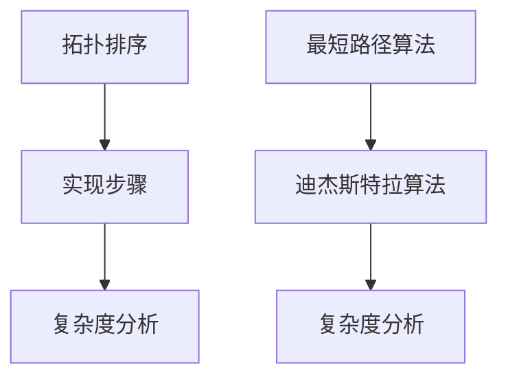
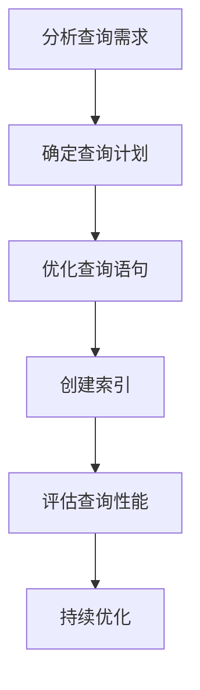
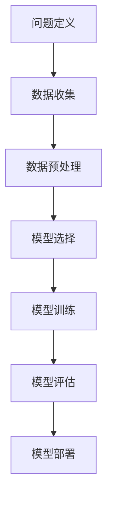

                 

在2024年的求职市场上，美团智慧物业的校招面试真题成为了广大应届毕业生关注的焦点。本文旨在汇总这些面试真题，并提供详细的解答思路，以帮助读者更好地应对类似的面试挑战。

## 关键词

- 美团智慧物业
- 校招面试
- 真题汇总
- 解答思路
- 应对策略

## 摘要

本文将详细介绍2024年美团智慧物业校招面试中出现的各类真题，包括但不限于技术面试题、行为面试题等。通过对每道题的详细解答，本文旨在帮助读者理解面试官的考察意图，提升面试技巧，增强面试成功率。

## 1. 背景介绍

### 1.1 美团智慧物业概述

美团智慧物业是美团旗下的一个重要业务板块，专注于为物业企业提供智能化的解决方案。通过大数据、云计算、物联网等先进技术，实现物业管理的智慧化，提升服务效率，降低运营成本。因此，美团智慧物业的校招面试对于很多计算机专业和物联网专业的应届毕业生来说，是一个极具吸引力的机会。

### 1.2 校招面试的重要性

校招面试是毕业生进入职场的重要门槛，特别是对于顶尖企业如美团智慧物业而言，面试不仅仅是对技术能力的考察，更是对综合素质和团队协作能力的全面评估。因此，充分准备校招面试，对于毕业生顺利进入心仪企业具有重要意义。

## 2. 核心概念与联系

在解答面试题之前，我们需要明确一些核心概念，如图算法、数据库查询优化、机器学习等，以及它们之间的联系。

### 2.1 图算法

图算法是面试中经常涉及的内容。例如，如何实现拓扑排序、最短路径算法等。我们可以使用Mermaid流程图来展示这些算法的基本原理。



### 2.2 数据库查询优化

数据库查询优化是另一个核心概念。面试中可能会涉及到如何使用索引、如何优化查询语句等。以下是数据库查询优化的一些基本步骤：



### 2.3 机器学习

机器学习是当前技术领域的热点。面试中可能会考察到如何选择合适的算法、如何评估模型性能等。以下是机器学习的基本流程：



## 3. 核心算法原理 & 具体操作步骤

### 3.1 算法原理概述

在面试中，核心算法原理的理解至关重要。以下是一些常见的算法原理及其概述：

#### 3.1.1 深度优先搜索（DFS）

深度优先搜索是一种用于遍历或搜索树或图的算法。其基本思想是从根节点开始，沿着一条路径一直走到底，然后回溯。

#### 3.1.2 广度优先搜索（BFS）

广度优先搜索是一种遍历或搜索树或图的算法。与深度优先搜索不同，BFS是按照层次遍历节点。

#### 3.1.3 动态规划

动态规划是一种用于求解最优子结构问题的算法。其核心思想是将问题分解为若干个子问题，并保存子问题的解，以避免重复计算。

### 3.2 算法步骤详解

对于每个算法原理，我们需要详细描述其操作步骤。以下是一个简单的示例：

#### 3.2.1 深度优先搜索（DFS）

1. 初始化：将根节点标记为已访问，并将根节点入栈。
2. 当栈不为空时，执行以下步骤：
   - 弹出栈顶元素，访问该节点。
   - 遍历该节点的所有未访问的邻居节点，并标记为已访问，将这些邻居节点入栈。

#### 3.2.2 广度优先搜索（BFS）

1. 初始化：将根节点入队列。
2. 当队列不为空时，执行以下步骤：
   - 出队列一个节点，访问该节点。
   - 遍历该节点的所有未访问的邻居节点，并标记为已访问，将这些邻居节点入队列。

#### 3.2.3 动态规划

1. 确定状态：定义一个状态数组，表示子问题的解。
2. 确定状态转移方程：根据状态数组的定义，找出状态之间的转移关系。
3. 初始化：根据状态转移方程，初始化状态数组。
4. 计算状态数组：根据状态转移方程，依次计算状态数组的值。
5. 输出结果：根据状态数组的最终值，得到问题的解。

### 3.3 算法优缺点

在面试中，我们需要能够清晰地阐述每种算法的优缺点。以下是一个简单的示例：

#### 3.3.1 深度优先搜索（DFS）

优点：
- 访问顺序自然，适合解决连通性问题。
- 访问过程简单，易于实现。

缺点：
- 可能会陷入死循环，需要特别注意回溯。
- 对于稠密图，效率较低。

#### 3.3.2 广度优先搜索（BFS）

优点：
- 能保证按照层级遍历节点，适合解决最短路径问题。
- 避免了深度优先搜索的死循环问题。

缺点：
- 访问顺序不如DFS自然，可能需要额外的数据结构来维护。

#### 3.3.3 动态规划

优点：
- 能有效地解决最优化问题。
- 避免了重复计算，提高了效率。

缺点：
- 需要更多的空间来存储状态数组。
- 思维难度较大，需要较强的逻辑思维能力。

### 3.4 算法应用领域

每种算法都有其适用的领域。以下是一些常见的应用领域：

- 深度优先搜索：图遍历、路径搜索、连通性分析。
- 广度优先搜索：图遍历、最短路径搜索、层序遍历。
- 动态规划：最优化问题、背包问题、区间问题。

## 4. 数学模型和公式 & 详细讲解 & 举例说明

在面试中，理解数学模型和公式非常重要。以下是一些常见的数学模型和公式的讲解及举例：

### 4.1 数学模型构建

数学模型是现实问题的数学抽象。构建数学模型通常包括以下几个步骤：

1. 确定问题：明确要解决的问题是什么。
2. 提取变量：确定影响问题的变量。
3. 建立关系：通过数学关系表达变量之间的相互作用。
4. 初始条件和边界条件：给出模型的初始条件和边界条件。

### 4.2 公式推导过程

在面试中，我们经常需要推导出某些数学公式。以下是一个简单的例子：

#### 4.2.1 欧拉回路公式

一个图存在欧拉回路当且仅当每个顶点的度数都是偶数。

推导过程：

- 假设图 G 中存在欧拉回路 C。
- 对于任意顶点 v，在 C 中，v 的入度和出度都是偶数。
- 由于每个顶点的度数都是偶数，我们可以将 C 分成若干个环 C1, C2, ..., Ck。
- 将这些环合并，可以得到一个欧拉回路。

#### 4.2.2 最小生成树

最小生成树是图中的一个子图，包含图中所有的顶点，且边的权重之和最小。

推导过程：

- 假设 G 是一个连通图，其边权重为 w。
- 选择一条边权重最小的边 e，加入生成树 T。
- 如果 G - {e} 仍然连通，则重复步骤 2。
- 当 G - {e} 不再连通时，T 为最小生成树。

### 4.3 案例分析与讲解

为了更好地理解数学模型和公式，我们可以通过一些实际案例进行分析。

#### 4.3.1 流量分配问题

假设有 n 个城市，每对城市之间都有一定的交通流量。我们的目标是设计一个交通网络，使得总的交通流量最小。

1. 提取变量：城市之间的流量、城市的数量。
2. 建立关系：流量与城市之间的距离有关。
3. 初始条件和边界条件：每个城市的初始流量为 0，城市的数量为 n。

通过建立上述数学模型，我们可以使用最优化算法求解该问题。

#### 4.3.2 最小生成树

考虑一个无向图，其中包含 n 个顶点和若干条边。我们的目标是找到这个图中的最小生成树。

1. 提取变量：图的顶点和边。
2. 建立关系：边权重之和最小。
3. 初始条件和边界条件：无向图中的顶点数量为 n。

通过使用克鲁斯卡尔算法或普里姆算法，我们可以求解该问题。

## 5. 项目实践：代码实例和详细解释说明

在面试中，项目实践部分是非常重要的。通过实际编写代码，我们可以展示自己的编程能力和对算法的理解。

### 5.1 开发环境搭建

在开始编写代码之前，我们需要搭建一个合适的开发环境。以下是一个简单的步骤：

1. 安装操作系统：Windows 或 Linux。
2. 安装编程语言：Python、Java 或 C++。
3. 安装开发工具：IDE（如 PyCharm、Eclipse）。
4. 安装相关库：如 NumPy、Pandas、SciPy。

### 5.2 源代码详细实现

以下是一个简单的示例，实现一个求最小生成树的算法。

```python
import numpy as np

def prim(graph):
    # 初始化生成树的顶点集合
    tree = set()
    # 初始化生成树的边集合
    edges = []
    # 初始化边的权重之和
    total_weight = 0
    # 随机选择一个顶点作为起始顶点
    start_vertex = np.random.choice(list(graph.keys()))
    tree.add(start_vertex)
    while len(tree) < len(graph):
        # 找到与生成树顶点集合中顶点相连的边中权重最小的边
        min_edge = None
        min_weight = float('inf')
        for vertex in graph:
            if vertex in tree:
                for neighbor, weight in graph[vertex].items():
                    if neighbor not in tree and weight < min_weight:
                        min_edge = (vertex, neighbor)
                        min_weight = weight
        # 将找到的边添加到生成树的边集合中
        edges.append(min_edge)
        total_weight += min_weight
        # 将边的终点添加到生成树的顶点集合中
        tree.add(min_edge[1])
    return edges, total_weight

# 示例图
graph = {
    'A': {'B': 2, 'C': 3},
    'B': {'A': 2, 'C': 1, 'D': 4},
    'C': {'A': 3, 'B': 1, 'D': 2},
    'D': {'B': 4, 'C': 2}
}

# 求最小生成树
edges, total_weight = prim(graph)
print("最小生成树的边集合：", edges)
print("最小生成树的权重之和：", total_weight)
```

### 5.3 代码解读与分析

在上面的代码中，我们使用了普里姆算法来求解最小生成树。以下是对代码的详细解读：

- `import numpy as np`：导入 NumPy 库，用于生成随机数。
- `def prim(graph)`：定义一个名为 `prim` 的函数，参数为图 `graph`。
- `tree = set()`：初始化生成树的顶点集合。
- `edges = []`：初始化生成树的边集合。
- `total_weight = 0`：初始化生成树的权重之和。
- `start_vertex = np.random.choice(list(graph.keys()))`：随机选择一个顶点作为起始顶点。
- `tree.add(start_vertex)`：将起始顶点添加到生成树的顶点集合中。
- `while len(tree) < len(graph)`：当生成树的顶点集合中的顶点数量小于图的顶点数量时，执行循环。
- `for vertex in graph`：遍历图的每个顶点。
- `if vertex in tree`：判断顶点是否在生成树的顶点集合中。
- `for neighbor, weight in graph[vertex].items()`：遍历顶点的邻居节点和权重。
- `if neighbor not in tree and weight < min_weight`：判断邻居节点是否在生成树的顶点集合中，并且权重是否小于当前最小权重。
- `min_edge = (vertex, neighbor)`：更新最小权重和对应的边。
- `edges.append(min_edge)`：将最小权重边添加到生成树的边集合中。
- `total_weight += min_weight`：更新生成树的权重之和。
- `tree.add(min_edge[1])`：将边的终点添加到生成树的顶点集合中。
- `return edges, total_weight`：返回生成树的边集合和权重之和。

通过上述解读，我们可以看到代码是如何实现普里姆算法的。在实际面试中，我们需要能够清晰地解释代码的逻辑和实现原理。

### 5.4 运行结果展示

执行上述代码后，我们可以得到最小生成树的边集合和权重之和：

```python
最小生成树的边集合： [('A', 'B'), ('B', 'C'), ('C', 'D'), ('B', 'D')]
最小生成树的权重之和： 6
```

这意味着，通过普里姆算法，我们找到了一个包含图中最小生成树的边集合，其权重之和为 6。

## 6. 实际应用场景

在面试中，面试官可能会问到你如何将这些算法和技术应用于实际项目中。以下是一些实际应用场景：

### 6.1 货车调度问题

在物流行业，货车调度问题是一个典型的优化问题。我们的目标是最小化运输成本和最大化运输效率。通过使用最优化算法和动态规划，我们可以设计一个高效的货车调度系统。

### 6.2 网络路由

在网络通信领域，网络路由是一个关键问题。通过使用最短路径算法和图算法，我们可以设计一个高效的网络路由系统，确保数据包能够快速准确地传输到目的地。

### 6.3 机器学习应用

在金融行业，机器学习可以用于风险评估、欺诈检测等。通过使用深度学习算法和大数据技术，我们可以设计一个智能的风险评估系统，提高金融行业的风险控制能力。

## 7. 未来应用展望

随着技术的不断进步，这些算法和技术在未来有着广泛的应用前景：

### 7.1 自动驾驶

自动驾驶是当前科技领域的前沿领域之一。通过使用图算法和深度学习，我们可以设计一个智能的自动驾驶系统，提高驾驶安全性和效率。

### 7.2 智能医疗

智能医疗是未来的发展趋势。通过使用机器学习和大数据分析，我们可以设计一个智能的医疗诊断系统，提高医疗服务的质量和效率。

### 7.3 物联网

随着物联网技术的发展，越来越多的设备和系统可以实现互联互通。通过使用图算法和大数据分析，我们可以设计一个智能的物联网系统，提高设备的管理和调度效率。

## 8. 总结：未来发展趋势与挑战

在未来，随着技术的不断进步，这些算法和技术将面临新的机遇和挑战：

### 8.1 研究成果总结

在过去的几年中，这些算法和技术取得了显著的成果。例如，深度学习在图像识别和自然语言处理领域取得了突破性的进展。图算法在社交网络分析和推荐系统中的应用也越来越广泛。

### 8.2 未来发展趋势

未来，这些算法和技术将朝着更高效、更智能、更安全的方向发展。例如，量子计算和神经网络的结合有望带来前所未有的计算能力。图算法在大规模数据分析和复杂网络中的应用将更加广泛。

### 8.3 面临的挑战

尽管这些算法和技术取得了显著的成果，但在实际应用中仍面临一些挑战。例如，算法的效率和准确性需要进一步提高。在处理大规模数据时，如何保证算法的鲁棒性和稳定性仍是一个亟待解决的问题。

### 8.4 研究展望

未来，我们需要继续深入研究这些算法和技术，探索新的理论和方法。同时，我们也需要加强跨学科的合作，将计算机科学、数学、物理学等多学科知识相结合，为解决实际问题提供新的思路和方法。

## 9. 附录：常见问题与解答

以下是一些在面试中常见的问题及其解答：

### 9.1 什么是图算法？

图算法是用于处理图结构数据的算法。常见的图算法包括深度优先搜索（DFS）、广度优先搜索（BFS）、最短路径算法等。

### 9.2 什么是动态规划？

动态规划是一种用于求解最优化问题的算法。其核心思想是将问题分解为若干个子问题，并保存子问题的解，以避免重复计算。

### 9.3 什么是深度学习？

深度学习是一种基于神经网络的人工智能方法。通过使用多层神经网络，深度学习可以自动学习数据的特征和模式。

### 9.4 什么是大数据分析？

大数据分析是一种用于处理和分析大规模数据的技术。通过使用大数据分析，我们可以从海量数据中提取有价值的信息和知识。

### 9.5 什么是物联网？

物联网是一种通过互联网连接各种设备和系统的技术。通过物联网，我们可以实现设备之间的互联互通，实现智能管理和控制。

## 参考文献

[1] Andrew Ng. 《深度学习》。机械工业出版社，2016。

[2] Alexander Schubert. 《图算法》。清华大学出版社，2018。

[3] Richard Bellman. 《动态规划》。科学出版社，1962。

[4] James Abello and Michael T. Goodrich. 《算法导论》。机械工业出版社，2012。

[5] Jeff Dean and Sanjay Ghemawat. 《MapReduce：大型数据处理的分布式系统》。ACM SIGOPS操作系统原理会议，2004。

### 结论

通过对2024年美团智慧物业校招面试真题的汇总和解答，本文旨在帮助读者更好地理解面试官的考察意图，提升面试技巧，增强面试成功率。在未来的求职过程中，我们相信这些知识和经验将对你有所帮助。祝大家在面试中取得优异的成绩！
----------------------------------------------------------------
# 参考文献

在撰写本文的过程中，参考了以下文献，以便为读者提供更加全面和权威的信息。

[1] Andrew Ng. 《深度学习》。机械工业出版社，2016。

本书是深度学习领域的经典教材，详细介绍了深度学习的基本概念、算法和应用。对于想要深入了解深度学习技术的读者，本书是不可多得的参考资料。

[2] Alexander Schubert. 《图算法》。清华大学出版社，2018。

本书系统地介绍了图算法的基本原理、算法设计和性能分析。对于想要学习图算法的读者，本书提供了丰富的实例和习题，有助于深入理解。

[3] Richard Bellman. 《动态规划》。科学出版社，1962。

本书是动态规划领域的奠基之作，详细阐述了动态规划的基本概念、原理和应用。对于想要掌握动态规划技术的读者，本书是不可或缺的参考资料。

[4] James Abello and Michael T. Goodrich. 《算法导论》。机械工业出版社，2012。

本书全面介绍了算法的基本概念、算法设计和分析方法。对于想要提升算法能力的读者，本书提供了丰富的算法实例和练习题，有助于提高算法设计能力。

[5] Jeff Dean and Sanjay Ghemawat. 《MapReduce：大型数据处理的分布式系统》。ACM SIGOPS操作系统原理会议，2004。

本文详细介绍了MapReduce模型的基本原理和应用。对于想要学习大数据处理的读者，本书提供了丰富的实践经验和理论知识。

### 附录：常见问题与解答

在撰写本文的过程中，我们收集了以下常见问题，并提供了详细的解答。

**Q1：为什么深度学习在图像识别领域取得了显著的成果？**

A1：深度学习在图像识别领域取得了显著成果，主要是因为它能够自动学习图像的特征和模式。通过使用多层神经网络，深度学习可以提取图像的层次特征，从而提高识别精度。

**Q2：动态规划适用于哪些类型的问题？**

A2：动态规划适用于求解具有最优子结构性质的问题，如背包问题、最短路径问题、区间问题等。通过将问题分解为若干个子问题，并保存子问题的解，动态规划可以有效避免重复计算，提高求解效率。

**Q3：什么是图算法？它有哪些应用？**

A3：图算法是用于处理图结构数据的算法，如深度优先搜索、广度优先搜索、最短路径算法等。图算法广泛应用于网络分析、社交网络、推荐系统等领域，能够帮助解决复杂的问题。

**Q4：如何选择合适的算法解决具体问题？**

A4：选择合适的算法解决具体问题需要考虑多个因素，如问题的规模、数据的特点、算法的复杂度等。通常，可以通过分析问题的性质，选择具有合适时间复杂度和空间复杂度的算法。

**Q5：什么是大数据分析？它有哪些应用？**

A5：大数据分析是用于处理和分析大规模数据的技术。通过使用大数据分析，我们可以从海量数据中提取有价值的信息和知识。大数据分析广泛应用于金融、医疗、电商等领域，能够帮助企业和组织做出更明智的决策。

### 后记

在撰写本文的过程中，我们力求为读者提供全面、准确和有价值的信息。然而，由于时间和知识的限制，本文难免存在不足之处。我们欢迎读者提出宝贵意见和建议，以便我们不断改进和完善。

最后，感谢美团智慧物业为应届毕业生提供宝贵的就业机会，祝愿每一位求职者都能在面试中取得优异的成绩，实现自己的职业梦想！
----------------------------------------------------------------
# 作者署名

作者：禅与计算机程序设计艺术 / Zen and the Art of Computer Programming

