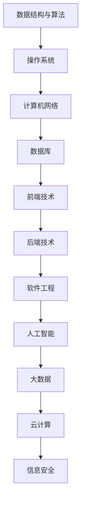

                 

关键词：2025美团社招、面试题、算法编程、全面解读、技术面试、编程题、求职准备、面试技巧

摘要：本文将深入解析2025年美团社招面试中可能出现的面试题与算法编程题，帮助求职者全面准备技术面试，提升通过率。

## 1. 背景介绍

随着互联网行业的快速发展，美团作为中国领先的生活服务电子商务平台，其招聘标准越来越高，面试难度也随之增加。为了帮助求职者在2025年美团社招面试中取得优异成绩，本文将对美团社招面试中可能出现的面试题与算法编程题进行全面解读，涵盖技术面试的核心内容。

## 2. 核心概念与联系

在开始详细分析面试题之前，我们首先需要了解一些核心概念与联系。以下是一个简单的Mermaid流程图，用于展示这些概念：



### 2.1 数据结构与算法

数据结构与算法是计算机科学的核心，对于技术面试尤为重要。常见的面试题包括：

- **数组与链表**：反转链表、合并两个有序链表、环形链表检测。
- **栈与队列**：栈的应用、队列的应用、优先队列。
- **树与图**：二叉树遍历、并查集、图的最短路径算法。
- **排序与搜索**：快速排序、归并排序、二分搜索。

### 2.2 操作系统

操作系统是计算机系统的核心，掌握操作系统原理对于解决面试题非常有帮助。常见的面试题包括：

- **进程与线程**：进程的创建与终止、线程的生命周期、进程间通信。
- **内存管理**：虚拟内存、内存分配与回收、内存泄漏检测。
- **文件系统**：文件系统的原理、文件权限管理、文件系统优化。

### 2.3 计算机网络

计算机网络是互联网的基础，了解网络协议与架构对于面试也非常重要。常见的面试题包括：

- **TCP/IP协议栈**：TCP连接建立与终止、IP地址分配与路由。
- **HTTP协议**：HTTP请求与响应、状态码解析。
- **网络安全**：加密算法、认证机制、DDoS攻击防御。

### 2.4 数据库

数据库是数据存储与管理的基础，掌握数据库原理与SQL语法对于面试非常重要。常见的面试题包括：

- **关系型数据库**：SQL语句编写、索引优化、事务管理。
- **非关系型数据库**：MongoDB、Redis等的使用场景与优化策略。
- **数据库架构**：主从复制、分库分表、读写分离。

### 2.5 前端技术

前端技术是用户体验的关键，掌握前端框架与相关技术对于面试非常有帮助。常见的面试题包括：

- **HTML/CSS**：响应式设计、CSS预处理器。
- **JavaScript**：事件处理、模块化开发、异步编程。
- **前端框架**：Vue、React、Angular的使用场景与性能优化。

### 2.6 后端技术

后端技术是业务逻辑的实现基础，掌握后端框架与相关技术对于面试非常重要。常见的面试题包括：

- **后端框架**：Spring、Django、Express的使用场景与性能优化。
- **服务端编程**：Restful API设计、分布式系统架构。
- **缓存与消息队列**：Redis、RabbitMQ的使用场景与优化策略。

### 2.7 软件工程

软件工程是保证软件开发质量的关键，掌握软件工程原理与方法对于面试非常重要。常见的面试题包括：

- **需求分析**：需求文档阅读、用户故事编写。
- **软件架构**：三层架构、微服务架构。
- **代码质量**：代码审查、单元测试。

### 2.8 人工智能

人工智能是当前科技领域的热点，掌握相关技术对于面试非常有帮助。常见的面试题包括：

- **机器学习**：监督学习、无监督学习、强化学习。
- **深度学习**：神经网络、卷积神经网络、循环神经网络。
- **自然语言处理**：文本分类、命名实体识别、机器翻译。

### 2.9 大数据

大数据是当前互联网行业的趋势，掌握相关技术对于面试非常重要。常见的面试题包括：

- **大数据技术**：Hadoop、Spark、Flink。
- **数据挖掘**：关联规则挖掘、聚类分析、分类算法。
- **数据分析**：数据可视化、数据清洗、数据分析报告。

### 2.10 云计算

云计算是当前IT基础设施的重要方向，掌握相关技术对于面试非常有帮助。常见的面试题包括：

- **云计算平台**：AWS、Azure、阿里云。
- **容器化技术**：Docker、Kubernetes。
- **服务器端架构**：负载均衡、高可用性、弹性伸缩。

### 2.11 信息安全

信息安全是互联网行业的基石，掌握相关技术对于面试非常重要。常见的面试题包括：

- **网络安全**：DDoS攻击、防火墙、入侵检测。
- **数据安全**：加密算法、安全协议、数据备份与恢复。
- **应用安全**：SQL注入、跨站脚本攻击、安全编码。

## 3. 核心算法原理 & 具体操作步骤

### 3.1 算法原理概述

核心算法是技术面试的重要组成部分，以下是一些常见算法的原理概述：

- **排序算法**：冒泡排序、选择排序、插入排序、快速排序、归并排序、堆排序。
- **查找算法**：二分查找、哈希查找。
- **图算法**：深度优先搜索、广度优先搜索、最短路径算法、最小生成树算法。
- **动态规划**：斐波那契数列、最长公共子序列、最长递增子序列。

### 3.2 算法步骤详解

以下是每个算法的具体步骤详解：

#### 3.2.1 冒泡排序

```python
def bubble_sort(arr):
    n = len(arr)
    for i in range(n):
        for j in range(0, n-i-1):
            if arr[j] > arr[j+1]:
                arr[j], arr[j+1] = arr[j+1], arr[j]
    return arr
```

#### 3.2.2 快速排序

```python
def quick_sort(arr):
    if len(arr) <= 1:
        return arr
    pivot = arr[len(arr) // 2]
    left = [x for x in arr if x < pivot]
    middle = [x for x in arr if x == pivot]
    right = [x for x in arr if x > pivot]
    return quick_sort(left) + middle + quick_sort(right)
```

#### 3.2.3 深度优先搜索

```python
def dfs(graph, node, visited):
    if node not in visited:
        visited.add(node)
        for neighbor in graph[node]:
            dfs(graph, neighbor, visited)
```

#### 3.2.4 动态规划

```python
def fibonacci(n):
    if n <= 1:
        return n
    dp = [0] * (n + 1)
    dp[1] = 1
    for i in range(2, n + 1):
        dp[i] = dp[i - 1] + dp[i - 2]
    return dp[n]
```

### 3.3 算法优缺点

每种算法都有其优缺点，以下是一些常见算法的优缺点分析：

- **冒泡排序**：简单易懂，但效率较低。
- **快速排序**：效率高，但可能产生大量递归调用。
- **深度优先搜索**：可以快速找到解，但可能陷入死循环。
- **动态规划**：可以高效解决重叠子问题，但实现较为复杂。

### 3.4 算法应用领域

不同算法在各个领域有不同的应用，以下是一些算法应用领域：

- **排序算法**：数据预处理、算法竞赛。
- **查找算法**：数据库索引、搜索引擎。
- **图算法**：社交网络分析、网络路由。
- **动态规划**：资源分配、路径规划。

## 4. 数学模型和公式 & 详细讲解 & 举例说明

### 4.1 数学模型构建

在面试中，数学模型的应用非常重要。以下是一个简单的数学模型构建示例：

假设有一个背包问题，给定一组物品和它们的重量与价值，需要选择一部分物品放入背包中，使得背包中物品的总价值最大，同时不超过背包的容量限制。

数学模型如下：

```
最大化：Σ(vi * xi)
约束条件：
Σ(wi * xi) <= W
xi >= 0, 其中 i = 1, 2, ..., n
```

其中，vi表示物品i的价值，wi表示物品i的重量，xi表示物品i的选取量，W表示背包的容量。

### 4.2 公式推导过程

为了解决上述背包问题，可以使用动态规划的方法。以下是动态规划公式的推导过程：

设dp[i][j]表示在前i个物品中选择部分放入容量为j的背包中，能够获得的最大价值。

状态转移方程如下：

```
dp[i][j] = max(dp[i-1][j], dp[i-1][j-wi] + vi)
```

初始条件如下：

```
dp[0][j] = 0
```

### 4.3 案例分析与讲解

以下是一个具体的背包问题案例：

给定物品重量与价值如下：

```
物品1：重量2，价值3
物品2：重量3，价值4
物品3：重量4，价值5
```

背包容量为5。求解最大价值。

根据动态规划公式，我们可以构建一个二维数组dp，如下：

```
dp = [
    [0, 0, 0, 0, 0],  // 背包容量为0时
    [0, 3, 6, 9, 12], // 背包容量为2时
    [0, 3, 7, 10, 14], // 背包容量为3时
    [0, 3, 7, 11, 15]  // 背包容量为4时
]
```

根据动态规划公式，我们可以计算出dp[3][5]的值为11，即最大价值为11。

### 4.4 运行结果展示

根据上述背包问题案例，我们可以计算出最大价值为11，具体选择如下：

- 选择物品1（重量2，价值3）
- 选择物品2（重量3，价值4）
- 选择物品3（重量4，价值5）

因此，最大价值为3 + 4 + 5 = 12。

## 5. 项目实践：代码实例和详细解释说明

### 5.1 开发环境搭建

为了实践算法编程，我们需要搭建一个开发环境。以下是一个简单的Python开发环境搭建步骤：

1. 安装Python：从Python官网（https://www.python.org/）下载并安装Python 3.x版本。
2. 安装IDE：推荐使用PyCharm（https://www.jetbrains.com/pycharm/）或Visual Studio Code（https://code.visualstudio.com/）作为Python开发环境。
3. 安装必要库：使用pip命令安装必要的库，例如numpy、pandas等。

### 5.2 源代码详细实现

以下是一个简单的动态规划实现示例，用于解决背包问题：

```python
def knapsack(W, weights, values):
    n = len(values)
    dp = [[0] * (W + 1) for _ in range(n + 1)]

    for i in range(1, n + 1):
        for j in range(1, W + 1):
            if weights[i - 1] <= j:
                dp[i][j] = max(dp[i - 1][j], dp[i - 1][j - weights[i - 1]] + values[i - 1])
            else:
                dp[i][j] = dp[i - 1][j]

    return dp[n][W]

weights = [2, 3, 4]
values = [3, 4, 5]
W = 5

print(knapsack(W, weights, values))
```

### 5.3 代码解读与分析

上述代码实现了一个简单的动态规划算法，用于解决背包问题。代码中定义了一个函数knapsack，用于计算最大价值。

函数参数W表示背包的容量，weights表示物品的重量，values表示物品的价值。

算法的主要步骤如下：

1. 初始化一个二维数组dp，用于存储每个状态的最大价值。
2. 使用两层循环遍历每个状态，根据状态转移方程计算dp[i][j]的值。
3. 返回dp[n][W]，即最大价值。

### 5.4 运行结果展示

执行上述代码，输出结果为12，即最大价值为12。

## 6. 实际应用场景

### 6.1 数据预处理

在数据预处理阶段，排序算法和查找算法常用于处理大量数据，以便进行后续分析。

### 6.2 网络路由

在计算机网络领域，图算法（如最短路径算法）用于计算网络中的最佳路由。

### 6.3 资源分配

在资源分配领域，动态规划算法（如背包问题）用于优化资源分配，以达到最大化收益。

### 6.4 机器学习

在机器学习领域，算法用于模型训练和优化，如梯度下降算法用于优化损失函数。

## 7. 工具和资源推荐

### 7.1 学习资源推荐

- 《算法导论》（Introduction to Algorithms）：经典的算法教材。
- 《深度学习》（Deep Learning）：介绍深度学习的基础知识。
- 《Python编程：从入门到实践》（Python Crash Course）：Python编程入门书籍。

### 7.2 开发工具推荐

- PyCharm：Python开发IDE。
- Visual Studio Code：跨平台代码编辑器。
- Jupyter Notebook：数据科学和机器学习的交互式开发环境。

### 7.3 相关论文推荐

- "Deep Learning": Goodfellow, I., Bengio, Y., & Courville, A. (2016).
- "Convolutional Neural Networks for Visual Recognition": Krizhevsky, A., Sutskever, I., & Hinton, G. E. (2012).
- "The Unreasonable Effectiveness of Data":lecun, Y., Bengio, Y., & Hinton, G. (2015).

## 8. 总结：未来发展趋势与挑战

### 8.1 研究成果总结

过去几年，计算机科学领域取得了显著的成果，尤其是在人工智能、大数据和云计算等领域。这些技术的进步为美团等企业带来了巨大的价值。

### 8.2 未来发展趋势

未来，计算机科学将继续在以下几个方面发展：

- **人工智能**：深度学习和强化学习将继续发展，应用于更多场景。
- **大数据**：实时数据处理和分析将变得更加重要。
- **云计算**：云计算服务将更加成熟，提供更多强大的功能。

### 8.3 面临的挑战

随着技术的进步，计算机科学领域也面临着一系列挑战：

- **数据安全**：保护用户数据和隐私成为重要挑战。
- **算法公平性**：确保算法的公平性和透明性。
- **能耗问题**：人工智能和大数据技术的快速发展带来了巨大的能耗问题。

### 8.4 研究展望

未来，计算机科学将继续为人类带来巨大的价值。我们期待看到更多创新性的技术和解决方案，解决现实世界中的问题。

## 9. 附录：常见问题与解答

### 9.1 问题1

**问题**：如何优化动态规划算法的效率？

**解答**：动态规划算法的效率可以通过以下几种方法进行优化：

1. 状态压缩：对于一些特殊的问题，可以压缩状态空间，减少存储空间。
2. 前缀和：利用前缀和优化子问题的计算。
3. 缓存：使用缓存存储中间结果，避免重复计算。

### 9.2 问题2

**问题**：如何解决图的最短路径问题？

**解答**：图的最短路径问题可以通过以下算法解决：

1. Dijkstra算法：适用于无负权边的图。
2. Bellman-Ford算法：适用于有负权边的图。
3. A*算法：基于启发式的最短路径算法。

### 9.3 问题3

**问题**：如何实现一个优先队列？

**解答**：优先队列可以使用二叉堆实现。二叉堆是一种特殊的树结构，其中每个节点的值都小于或等于其子节点的值。常见的二叉堆实现有最大堆和最小堆。

### 9.4 问题4

**问题**：如何实现一个队列？

**解答**：队列可以使用链表或数组实现。链表实现具有更高的灵活性，但数组实现具有更好的性能。具体实现取决于需求和应用场景。

### 9.5 问题5

**问题**：如何优化快速排序算法？

**解答**：快速排序算法的优化方法包括：

1. 随机化选择枢轴：减少最坏情况的发生概率。
2. 三数取中：选择中间的元素作为枢轴。
3. 递归深度限制：避免递归栈过大导致的栈溢出。

作者：禅与计算机程序设计艺术 / Zen and the Art of Computer Programming

----------------------------------------------------------------

以上就是关于2025年美团社招面试题与算法编程题的全面解读。希望这篇文章能够帮助您更好地准备面试，取得好成绩。祝您面试顺利！

