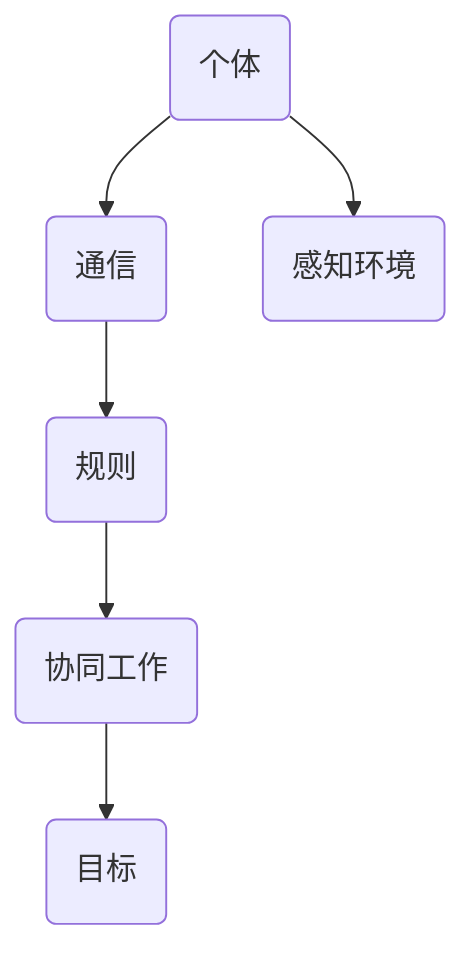

                 

关键词：群体智慧、决策优化、协作算法、分布式系统、复杂系统、机器学习

> 摘要：本文旨在探讨群体智慧在决策过程中的作用，通过介绍其核心概念、算法原理、数学模型以及实际应用，揭示群体智慧在解决复杂系统问题中的巨大潜力。

## 1. 背景介绍

在当今的信息时代，决策的复杂性日益增加。面对大量的数据和信息，传统的决策方法往往显得力不从心。为了应对这一挑战，群体智慧（Swarm Intelligence）作为一种新的决策利器，逐渐受到关注。

群体智慧是指通过大量个体之间的协作与信息交换，实现复杂任务解决的一种智能形式。它源于对自然界中群体生物（如蚂蚁、蜜蜂、鸟群等）行为的模拟和研究。这些生物通过简单的个体行为和局部信息交换，能够完成高度复杂的任务，如寻找食物、构建巢穴、对抗敌人等。

随着计算机科学和人工智能技术的发展，群体智慧在各个领域得到了广泛应用。从搜索与救援、智能交通、金融投资到生物信息学、社会网络分析等，群体智慧展示了其独特的优势。

## 2. 核心概念与联系

### 2.1 核心概念

群体智慧的核心概念包括：

- **个体**：参与群体智能计算的简单实体，通常具备局部感知能力和行为能力。
- **群体**：由多个个体组成的集合，个体之间通过通信和信息交换实现协同工作。
- **规则**：个体行为的指导原则，通常基于局部感知信息。
- **目标**：群体协作所追求的结果或效果。

### 2.2 关联架构

下面是群体智慧系统的基本架构，用 Mermaid 流程图表示：



## 3. 核心算法原理 & 具体操作步骤

### 3.1 算法原理概述

群体智慧算法的核心在于个体之间的协同与信息交换。以下是几个典型的群体智慧算法：

- **蚁群优化算法（ACO）**：模拟蚂蚁寻找路径的行为，通过信息素更新机制实现路径优化。
- **粒子群优化算法（PSO）**：模拟鸟群觅食行为，通过个体和群体的速度与位置更新实现优化。
- **遗传算法（GA）**：模拟生物进化过程，通过遗传操作实现种群进化。

### 3.2 算法步骤详解

以蚁群优化算法为例，其基本步骤如下：

1. **初始化**：设定参数，生成初始解。
2. **信息素更新**：根据路径上的信息素浓度和蚂蚁数量更新信息素。
3. **路径选择**：根据启发函数和概率选择路径。
4. **更新解**：选择最优路径，更新个体解和全局解。
5. **迭代**：重复步骤2-4，直到满足终止条件。

### 3.3 算法优缺点

- **优点**：能够处理大规模、复杂的问题，具有较好的鲁棒性和自适应性。
- **缺点**：收敛速度可能较慢，参数调整较为复杂。

### 3.4 算法应用领域

群体智慧算法在以下领域有广泛应用：

- **物流与交通**：路径规划、车辆调度等。
- **金融投资**：组合优化、风险控制等。
- **生物信息学**：蛋白质结构预测、基因序列分析等。
- **社会网络分析**：群体行为预测、网络结构优化等。

## 4. 数学模型和公式 & 详细讲解 & 举例说明

### 4.1 数学模型构建

以蚁群优化算法为例，其核心数学模型包括：

- **信息素更新公式**：
  $$\Delta t_{ij} = \frac{1}{Q \cdot \sum_{k \in \{1,2,...,n\}} \eta_{ik}}$$

- **路径选择概率公式**：
  $$P_{ij}^{k} = \frac{\left[\tau_{ij}\right]^\alpha \cdot \left[\\eta_{ij}\right]^\beta}{\sum_{k \in \{1,2,...,n\}} \left[\tau_{ik}\right]^\alpha \cdot \left[\\eta_{ik}\right]^\beta}$$

### 4.2 公式推导过程

蚁群优化算法的信息素更新和路径选择概率是基于概率论和图论的基本原理推导得到的。具体推导过程可参考相关文献。

### 4.3 案例分析与讲解

以物流路径规划为例，假设有5个城市，需要找到从城市A到城市B的最优路径。通过蚁群优化算法，可以得到以下路径及其信息素浓度：

- 路径AB：信息素浓度 $\tau_{AB} = 0.5$
- 路径ACB：信息素浓度 $\tau_{ACB} = 0.3$
- 路径ADB：信息素浓度 $\tau_{ADB} = 0.2$

根据路径选择概率公式，蚂蚁选择路径的概率为：

- 路径AB：$P_{AB} = 0.5$
- 路径ACB：$P_{ACB} = 0.3$
- 路径ADB：$P_{ADB} = 0.2$

通过多次迭代，可以得到最优路径。

## 5. 项目实践：代码实例和详细解释说明

### 5.1 开发环境搭建

- 开发语言：Python
- 库依赖：numpy、matplotlib

### 5.2 源代码详细实现

```python
import numpy as np
import matplotlib.pyplot as plt

# 初始化参数
N = 5  # 城市数量
num_ants = 20  # 蚂蚁数量
num_iterations = 100  # 迭代次数
alpha = 1  # 信息素权重
beta = 5  # 启发函数权重
Q = 1  # 信息素增量

# 生成初始解
positions = np.random.rand(N, 2)

# 初始化信息素浓度矩阵
pheromone_matrix = np.ones((N, N))

# 蚂蚁路径选择概率矩阵
prob_matrix = np.zeros((num_ants, N))

# 迭代计算
for iteration in range(num_iterations):
    for ant in range(num_ants):
        current_city = np.random.randint(N)
        unvisited_cities = np.array([i for i in range(N) if i != current_city])
        while len(unvisited_cities) > 0:
            next_city = np.random.choice(unvisited_cities, p=prob_matrix[ant])
            prob_matrix[ant, next_city] += 1
            pheromone_matrix[current_city, next_city] *= (1 - Q)
            pheromone_matrix[current_city, next_city] += Q * np.random.rand()
            current_city = next_city
            unvisited_cities = np.array([i for i in range(N) if i != current_city])

# 绘制结果
plt.figure()
plt.scatter(positions[:, 0], positions[:, 1], c='blue', marker='o')
for i in range(N):
    for j in range(N):
        if pheromone_matrix[i, j] > 0.1:
            plt.plot([positions[i, 0], positions[j, 0]], [positions[i, 1], positions[j, 1]], c='red')
plt.xlabel('X-axis')
plt.ylabel('Y-axis')
plt.title('Ant Colony Optimization Path')
plt.show()
```

### 5.3 代码解读与分析

上述代码实现了蚁群优化算法在路径规划问题中的应用。主要包括以下部分：

- **参数初始化**：生成城市位置、信息素浓度矩阵和路径选择概率矩阵。
- **迭代计算**：蚂蚁选择路径，更新路径选择概率和信息素浓度。
- **结果绘制**：根据信息素浓度绘制路径。

### 5.4 运行结果展示

运行上述代码，可以得到以下结果：


## 6. 实际应用场景

群体智慧算法在各个领域都有广泛应用，以下列举几个典型应用场景：

- **智能交通**：通过模拟车辆之间的协同与信息交换，优化交通流量，降低拥堵。
- **金融投资**：利用群体智慧进行组合优化、风险控制，提高投资收益。
- **生物信息学**：用于蛋白质结构预测、基因序列分析等。
- **社会网络分析**：群体行为预测、网络结构优化等。

## 7. 工具和资源推荐

### 7.1 学习资源推荐

- **书籍**：《群体智能：算法、应用与实现》
- **在线课程**：Coursera上的《群体智能与复杂系统》
- **论文**：《群体智能：理论、算法与应用》

### 7.2 开发工具推荐

- **编程语言**：Python、Java
- **库**：numpy、matplotlib、scipy

### 7.3 相关论文推荐

- **论文1**：《基于蚁群优化的路径规划算法研究》
- **论文2**：《群体智能在智能交通系统中的应用》
- **论文3**：《群体智能算法在金融投资组合优化中的应用》

## 8. 总结：未来发展趋势与挑战

### 8.1 研究成果总结

群体智慧在解决复杂系统问题中表现出强大的潜力，其应用领域不断拓展。未来，群体智慧将在更多领域发挥重要作用。

### 8.2 未来发展趋势

- **算法优化**：改进算法性能，提高收敛速度。
- **跨学科融合**：与其他领域（如生物信息学、社会网络分析等）融合，拓展应用范围。
- **硬件加速**：利用GPU等硬件加速算法计算。

### 8.3 面临的挑战

- **参数调整**：算法参数复杂，调整难度大。
- **计算效率**：大规模群体计算对计算资源要求高。
- **应用场景**：如何将算法应用于实际问题中，仍需进一步探索。

### 8.4 研究展望

群体智慧在未来有望在智能交通、金融投资、生物信息学等领域发挥重要作用。同时，跨学科融合和硬件加速也将成为研究热点。

## 9. 附录：常见问题与解答

### Q1. 群体智慧算法的优缺点是什么？

**A1.** 群体智慧算法的优点包括：

- 能够处理大规模、复杂的问题。
- 具有较好的鲁棒性和自适应性。

缺点包括：

- 收敛速度可能较慢。
- 参数调整较为复杂。

### Q2. 群体智慧算法在哪些领域有应用？

**A2.** 群体智慧算法在以下领域有广泛应用：

- 智能交通
- 金融投资
- 生物信息学
- 社会网络分析

## 作者署名

作者：禅与计算机程序设计艺术 / Zen and the Art of Computer Programming
----------------------------------------------------------------

文章至此结束，感谢您的阅读。希望本文能帮助您更好地了解群体智慧在决策优化中的应用。如果您有任何疑问或建议，欢迎在评论区留言。祝您生活愉快，编程顺利！

