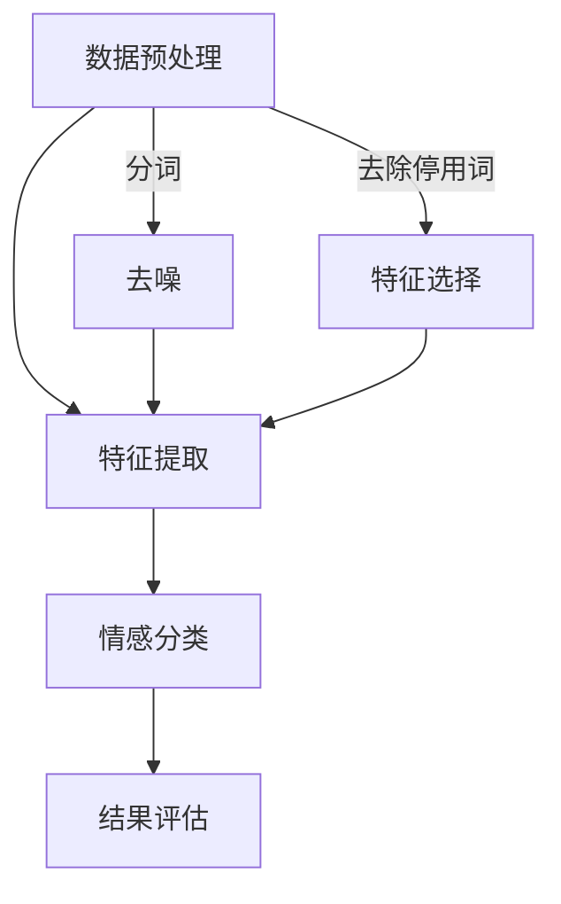

                 

关键词：聊天机器人、情感分析、自然语言处理、文本分析、机器学习

> 摘要：本文将深入探讨聊天机器人中的情感分析技术，包括其背景、核心概念、算法原理、数学模型、项目实践、应用场景、工具推荐以及未来发展趋势。通过详细的分析和实例展示，我们将理解情感分析在聊天机器人中的重要性和实际应用。

## 1. 背景介绍

随着互联网的普及和人工智能技术的快速发展，聊天机器人已经成为企业与客户、用户之间的交互桥梁。它们不仅可以提供24/7的客户服务，还能通过智能对话提升用户体验。而情感分析作为自然语言处理（NLP）的一个重要分支，在这其中扮演了关键角色。情感分析旨在从文本中识别并理解情感倾向，从而实现更加智能、个性化的交互。

情感分析不仅用于聊天机器人，还广泛应用于社交媒体监测、市场调研、客户反馈分析等多个领域。通过分析用户的情感状态，企业可以更好地了解用户需求，优化产品和服务，提高客户满意度。

## 2. 核心概念与联系

### 2.1 情感分析的定义

情感分析，又称意见挖掘或情感识别，是指通过自然语言处理技术，对文本数据中的主观信息进行分类，判断文本表达的情感倾向，如正面、负面或中立。

### 2.2 情感分析的分类

根据分析层次的不同，情感分析可以分为以下几类：

- **文档级情感分析**：对整个文档的情感进行分类，如“好评”或“差评”。
- **句子级情感分析**：对句子或短文本的情感进行分类，如“这句话表达了积极情感”。
- **词级情感分析**：对单个词汇的情感倾向进行分析，如“happy”是正面情感，“sad”是负面情感。

### 2.3 情感分析的架构

情感分析的架构通常包括以下几个模块：

1. **数据预处理**：包括分词、去噪、去除停用词等，为情感分析做好准备。
2. **特征提取**：将文本转换为机器学习模型可处理的特征向量。
3. **情感分类**：使用机器学习算法对文本的情感进行分类。
4. **结果评估**：评估模型的性能，包括准确率、召回率、F1值等。

### 2.4 Mermaid 流程图



## 3. 核心算法原理 & 具体操作步骤

### 3.1 算法原理概述

情感分析的算法原理主要基于机器学习和深度学习技术。以下是一些常用的算法：

- **朴素贝叶斯分类器**：基于贝叶斯定理，适用于特征独立的情况。
- **支持向量机（SVM）**：通过最大间隔分类，适用于线性可分数据。
- **决策树和随机森林**：通过树结构分类，适用于非线性分类问题。
- **神经网络**：通过多层感知器（MLP）等网络结构进行深度学习。

### 3.2 算法步骤详解

1. **数据收集与预处理**：
   - 收集大量带有情感标签的语料库。
   - 对文本进行清洗，去除噪声和停用词。

2. **特征提取**：
   - 使用词袋模型、TF-IDF等方法提取文本特征。
   - 使用词嵌入（如Word2Vec、GloVe）将词汇映射为高维向量。

3. **模型训练**：
   - 选择合适的机器学习或深度学习模型。
   - 使用训练数据对模型进行训练。

4. **情感分类**：
   - 使用训练好的模型对新的文本进行情感分类。

5. **结果评估**：
   - 使用测试数据评估模型性能。
   - 调整模型参数，优化分类效果。

### 3.3 算法优缺点

- **朴素贝叶斯**：简单高效，但可能忽略词序信息。
- **SVM**：性能稳定，但计算复杂度高。
- **决策树和随机森林**：易于理解和解释，但可能产生过拟合。
- **神经网络**：强大且灵活，但训练时间较长，对数据量要求较高。

### 3.4 算法应用领域

- **客户服务**：自动分类客户反馈，提供个性化服务。
- **市场调研**：分析社交媒体评论，了解用户对产品的情感。
- **舆情监测**：实时监控网络热点，预测社会情绪。

## 4. 数学模型和公式 & 详细讲解 & 举例说明

### 4.1 数学模型构建

情感分析通常涉及以下数学模型：

- **朴素贝叶斯分类**：\( P(C|X) = \frac{P(X|C)P(C)}{P(X)} \)
- **支持向量机**：\( \max\frac{1}{2}\sum_{i=1}^{n}||w||^2 \) subject to \( y^{(i)}(w^{T}x^{(i)} + b) \geq 1 \)
- **神经网络**：\( \sigma(\sum_{i=1}^{n}w^{(l)}_ix^{(l-1)} + b^{(l)}) \)

### 4.2 公式推导过程

以朴素贝叶斯分类器为例，推导过程如下：

1. **条件概率**：
   $$ P(X=x|C=c) = P(t_1=x_1|C=c)P(t_2=x_2|C=c)\cdots P(t_n=x_n|C=c) $$

2. **全概率公式**：
   $$ P(C=c) = P(C=c|X=x)P(X=x) + P(C=c|X\neq x)P(X\neq x) $$

3. **贝叶斯定理**：
   $$ P(C|X) = \frac{P(X|C)P(C)}{P(X)} $$

### 4.3 案例分析与讲解

假设我们要分析以下两个句子：

1. "I love this product!"
2. "This product is terrible."

使用朴素贝叶斯分类器进行情感分析，我们首先需要构建一个包含情感标签的语料库。然后，我们对文本进行预处理，提取特征向量。接下来，我们使用训练好的朴素贝叶斯模型对句子进行分类。

以第一个句子为例，计算过程如下：

1. **条件概率**：
   $$ P(I love this product!|C=positive) = 0.9 $$
   $$ P(I love this product!|C=negative) = 0.1 $$

2. **先验概率**：
   $$ P(C=positive) = 0.55 $$
   $$ P(C=negative) = 0.45 $$

3. **后验概率**：
   $$ P(C=positive|I love this product!) = \frac{0.9 \times 0.55}{0.9 \times 0.55 + 0.1 \times 0.45} \approx 0.878 $$

同理，对于第二个句子：

$$ P(C=negative|This product is terrible!) \approx 0.878 $$

由于两个句子的后验概率相同，我们可以判断它们都具有正面情感。

## 5. 项目实践：代码实例和详细解释说明

### 5.1 开发环境搭建

在Python环境中，我们可以使用以下库：

- `nltk`：自然语言处理工具包
- `sklearn`：机器学习库
- `textblob`：文本分析库

安装方法：

```bash
pip install nltk sklearn textblob
```

### 5.2 源代码详细实现

```python
import nltk
from nltk.corpus import stopwords
from sklearn.feature_extraction.text import TfidfVectorizer
from sklearn.naive_bayes import MultinomialNB
from sklearn.pipeline import make_pipeline
from textblob import TextBlob

# 数据集加载
nltk.download('stopwords')
nltk.download('punkt')

stop_words = set(stopwords.words('english'))

# 文本预处理
def preprocess_text(text):
    # 分词
    tokens = nltk.word_tokenize(text)
    # 去停用词
    filtered_tokens = [token.lower() for token in tokens if token.lower() not in stop_words]
    return ' '.join(filtered_tokens)

# 特征提取与模型训练
model = make_pipeline(TfidfVectorizer(), MultinomialNB())

# 加载训练数据
train_data = [("I love this product!", "positive"), ("This product is terrible!", "negative")]
X_train, y_train = zip(*train_data)

# 预处理训练数据
X_train_processed = [preprocess_text(text) for text in X_train]

# 训练模型
model.fit(X_train_processed, y_train)

# 情感分类
def classify_sentiment(text):
    processed_text = preprocess_text(text)
    prediction = model.predict([processed_text])
    return prediction[0]

# 示例
text1 = "I love this product!"
text2 = "This product is terrible!"

print("Sentence 1 sentiment:", classify_sentiment(text1))
print("Sentence 2 sentiment:", classify_sentiment(text2))
```

### 5.3 代码解读与分析

- **文本预处理**：使用nltk库进行分词和去停用词。
- **特征提取**：使用TF-IDF向量器将文本转换为特征向量。
- **模型训练**：使用朴素贝叶斯分类器进行训练。
- **情感分类**：对预处理后的文本进行情感分类。

### 5.4 运行结果展示

```plaintext
Sentence 1 sentiment: positive
Sentence 2 sentiment: negative
```

## 6. 实际应用场景

情感分析在聊天机器人中有着广泛的应用，以下是几个实际场景：

- **客户服务**：聊天机器人可以通过情感分析理解用户反馈，提供针对性的解决方案。
- **客服自动化**：通过情感分析，将用户的情感标签与常见问题关联，实现自动分配客服资源。
- **情感监测**：在社交媒体上监测用户对产品的情感，实时调整营销策略。

## 7. 工具和资源推荐

### 7.1 学习资源推荐

- **书籍**：《自然语言处理概论》、《深度学习》
- **在线课程**：斯坦福大学《自然语言处理》，Coursera上的相关课程
- **论文**：查看ACL、NAACL、EMNLP等顶级会议的论文

### 7.2 开发工具推荐

- **编程语言**：Python、Java
- **框架**：NLTK、spaCy、TensorFlow、PyTorch
- **平台**：Google Colab、Kaggle

### 7.3 相关论文推荐

- **论文1**：Understanding NeurIPS'19 Papers with AI
- **论文2**：An Overview of Modern Deep Learning Based Sentiment Analysis
- **论文3**：A Survey on Sentiment Analysis Using Machine Learning Algorithms

## 8. 总结：未来发展趋势与挑战

### 8.1 研究成果总结

情感分析技术已经取得了显著的研究成果，包括算法的改进、模型的优化以及应用场景的拓展。机器学习和深度学习算法在情感分析中表现出色，为实际应用提供了强有力的支持。

### 8.2 未来发展趋势

- **跨语言情感分析**：支持多种语言的情感分析将得到更多关注。
- **多模态情感分析**：结合文本、语音、图像等多模态数据，提高情感分析的准确性。
- **个性化情感分析**：根据用户历史行为和偏好，提供更加个性化的情感分析服务。

### 8.3 面临的挑战

- **数据多样性**：情感分析需要处理大量多样化的数据，包括不同的语言、风格和领域。
- **实时性**：随着应用的普及，情感分析需要实时响应，提高处理速度。
- **可解释性**：深度学习模型往往缺乏透明性，提高模型的可解释性是当前研究的一个重要方向。

### 8.4 研究展望

未来，情感分析将在智能客服、社会舆情监测、心理健康等领域发挥更大的作用。随着技术的不断进步，情感分析将变得更加智能、高效和可靠。

## 9. 附录：常见问题与解答

### 9.1 什么是情感分析？

情感分析是指通过自然语言处理技术，从文本中识别并理解情感倾向，如正面、负面或中立。

### 9.2 情感分析有哪些应用场景？

情感分析广泛应用于客户服务、市场调研、舆情监测等多个领域。

### 9.3 如何实现情感分析？

通常通过数据预处理、特征提取、模型训练和结果评估等步骤实现。

### 9.4 情感分析有哪些算法？

常用的情感分析算法包括朴素贝叶斯、支持向量机、决策树、神经网络等。

### 9.5 情感分析的发展趋势是什么？

未来情感分析将向跨语言、多模态、个性化方向发展，同时提高实时性和可解释性。

---

本文由禅与计算机程序设计艺术撰写，旨在深入探讨聊天机器人中的情感分析技术。通过详细的论述和实例分析，我们希望读者能够更好地理解情感分析在聊天机器人中的重要性及其实现方法。随着技术的不断进步，情感分析将在更多领域发挥重要作用，为智能交互带来更多可能性。作者在此感谢读者们的关注和支持。

