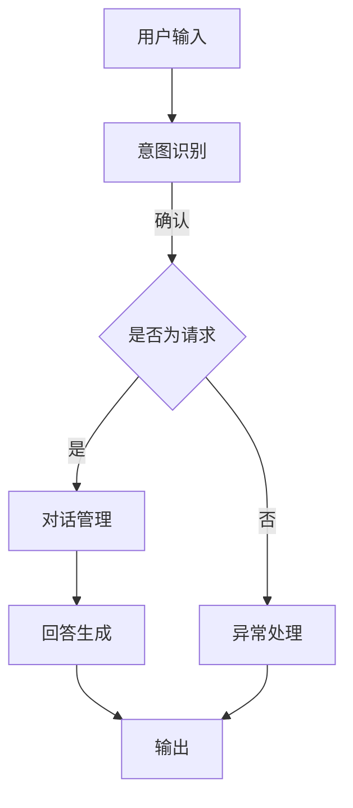

                 

关键词：聊天机器人、游戏开发、互动、叙事、人工智能

摘要：本文将探讨聊天机器人在游戏开发中的应用，特别是如何在游戏中实现丰富的互动和叙事体验。我们将深入分析聊天机器人的核心概念、算法原理、数学模型以及项目实践，同时探讨该领域的前沿技术和发展趋势。

## 1. 背景介绍

随着人工智能技术的飞速发展，聊天机器人已经成为我们日常生活中不可或缺的一部分。从简单的客服机器人到复杂的智能助手，聊天机器人在各个领域展现出了巨大的潜力。然而，在游戏开发领域，聊天机器人的应用还相对较少，但正是这片蓝海，为我们提供了无限的创意空间。

游戏是一种独特的媒体形式，它通过互动和叙事给玩家带来沉浸式的体验。聊天机器人可以在这个体验中扮演重要角色，通过智能对话和情感交互，增强玩家的参与感和代入感。本文将围绕这一主题，探讨如何将聊天机器人融入到游戏开发中，创造出更加丰富和多样的游戏体验。

## 2. 核心概念与联系

### 2.1 聊天机器人的核心概念

聊天机器人是一种基于人工智能技术的程序，它能够理解人类语言，并通过对话与用户进行交流。核心概念包括自然语言处理（NLP）、机器学习和对话管理。

- **自然语言处理（NLP）**：NLP是使计算机能够理解和处理人类语言的技术。它包括文本解析、语义分析、情感分析和语言生成等。

- **机器学习**：聊天机器人使用机器学习算法来训练模型，从而提高对话的准确性和自然度。常见的算法包括决策树、神经网络和支持向量机等。

- **对话管理**：对话管理是确保聊天机器人能够流畅地进行对话的关键技术。它涉及对话的上下文管理、意图识别和回答生成。

### 2.2 架构与流程

下面是一个简化版的聊天机器人架构与流程图：



### 2.3 聊天机器人与游戏开发的联系

聊天机器人可以与游戏开发中的多个方面相结合：

- **玩家交互**：聊天机器人可以作为玩家的虚拟伙伴，提供实时反馈、提示和指导，增强玩家的互动体验。

- **NPC（非玩家角色）**：聊天机器人可以模拟复杂的NPC行为，为游戏世界提供丰富的背景故事和互动。

- **游戏指导**：聊天机器人可以作为智能游戏指导，帮助玩家理解游戏规则、策略和目标。

- **情感交互**：通过情感计算技术，聊天机器人可以与玩家建立情感联系，增强游戏体验的沉浸感。

## 3. 核心算法原理 & 具体操作步骤

### 3.1 算法原理概述

聊天机器人的核心算法包括意图识别、实体识别、回答生成和对话管理。以下是这些算法的基本原理：

- **意图识别**：通过分析用户的输入，确定用户希望完成的任务或操作。

- **实体识别**：从用户的输入中提取关键信息，如人名、地点、时间等，这些信息在后续处理中非常有用。

- **回答生成**：根据意图识别和实体识别的结果，生成合适的回答。

- **对话管理**：维护对话的上下文信息，确保对话的自然和连贯。

### 3.2 算法步骤详解

以下是聊天机器人算法的具体操作步骤：

1. **接收用户输入**：聊天机器人从用户那里接收输入，这可以是文本或语音。

2. **文本预处理**：对输入的文本进行清洗，如去除标点、停用词等。

3. **意图识别**：使用机器学习模型对预处理后的文本进行意图分类，确定用户希望完成的任务。

4. **实体识别**：使用命名实体识别（NER）技术，从文本中提取关键信息。

5. **回答生成**：根据意图识别和实体识别的结果，生成相应的回答。

6. **对话管理**：更新对话上下文，准备下一个轮次的对话。

7. **输出回答**：将生成的回答返回给用户。

### 3.3 算法优缺点

- **优点**：
  - **高效性**：聊天机器人可以同时与多个用户进行交互，提高服务效率。
  - **灵活性**：通过机器学习，聊天机器人可以不断学习和改进，以适应不同的对话场景。
  - **成本低**：相比人力客服，聊天机器人运营成本较低。

- **缺点**：
  - **理解局限性**：尽管聊天机器人可以处理大量对话，但仍然存在理解局限，尤其是面对复杂的语境和模糊的表达。
  - **情感交互**：目前的聊天机器人很难达到人类客服在情感交互上的深度。

### 3.4 算法应用领域

- **客服与支持**：在电商平台、银行、航空等行业的客服支持中，聊天机器人可以提供24/7的服务。
- **教育**：在在线教育平台中，聊天机器人可以作为虚拟导师，为学生提供个性化的辅导和互动。
- **娱乐**：在游戏和虚拟现实中，聊天机器人可以模拟NPC角色，为玩家提供丰富的互动体验。
- **智能家居**：在智能家居系统中，聊天机器人可以作为智能助手，帮助用户管理家庭设备。

## 4. 数学模型和公式 & 详细讲解 & 举例说明

### 4.1 数学模型构建

聊天机器人的核心数学模型通常涉及以下几个部分：

- **意图识别模型**：使用分类模型，如朴素贝叶斯、支持向量机（SVM）或神经网络，来预测用户的意图。
- **实体识别模型**：使用命名实体识别（NER）算法，如条件随机场（CRF）或长短期记忆网络（LSTM），来识别文本中的关键信息。
- **回答生成模型**：使用生成模型，如转换器-解码器（Transformer）或生成对抗网络（GAN），来生成自然语言回答。

### 4.2 公式推导过程

以下是意图识别模型的一个简化的公式推导过程：

$$
P(\text{intent}_i | \text{input}) = \frac{e^{w_i \cdot \text{input}}}{\sum_j e^{w_j \cdot \text{input}}}
$$

其中，$P(\text{intent}_i | \text{input})$表示在给定输入$\text{input}$的情况下，意图$i$的概率。$w_i$是意图$i$的权重向量，$\text{input}$是用户输入的向量。

### 4.3 案例分析与讲解

以下是一个简单的案例，展示如何使用聊天机器人来回答用户的问题。

**用户输入**：你好，我想知道明天的天气如何？

**意图识别**：意图识别模型预测用户的意图是“获取天气信息”。

**实体识别**：实体识别模型提取关键信息“明天”和“天气”。

**回答生成**：回答生成模型生成回答：“明天的天气是晴天，温度在18°C到25°C之间。”

**对话管理**：更新对话上下文，为后续问题做准备。

## 5. 项目实践：代码实例和详细解释说明

### 5.1 开发环境搭建

为了实践聊天机器人的开发，我们需要搭建一个开发环境。以下是搭建环境的基本步骤：

1. 安装Python（版本3.8及以上）。
2. 安装必要的库，如TensorFlow、Keras、NLTK等。
3. 准备训练数据集。

### 5.2 源代码详细实现

以下是一个简单的聊天机器人代码实例，用于实现意图识别和回答生成：

```python
import tensorflow as tf
from tensorflow.keras.models import Sequential
from tensorflow.keras.layers import Embedding, LSTM, Dense
from tensorflow.keras.preprocessing.sequence import pad_sequences

# 加载和预处理数据
# ...

# 构建模型
model = Sequential()
model.add(Embedding(input_dim=vocab_size, output_dim=embedding_dim, input_length=max_length))
model.add(LSTM(units=128, return_sequences=True))
model.add(Dense(units=64, activation='relu'))
model.add(Dense(units=vocab_size, activation='softmax'))

# 编译模型
model.compile(optimizer='adam', loss='categorical_crossentropy', metrics=['accuracy'])

# 训练模型
model.fit(x_train, y_train, epochs=10, batch_size=32)

# 生成回答
def generate_response(input_text):
    # 预处理输入文本
    # ...

    # 预测意图
    predicted_intent = model.predict(pad_sequences([input_sequence], maxlen=max_length))

    # 根据意图生成回答
    # ...

    return response
```

### 5.3 代码解读与分析

上述代码中，我们首先加载和预处理了数据集，然后构建了一个序列模型，包括嵌入层、LSTM层和全连接层。模型使用Adam优化器和交叉熵损失函数进行编译和训练。在生成回答时，我们首先对输入文本进行预处理，然后使用训练好的模型进行预测，并根据预测结果生成回答。

### 5.4 运行结果展示

在实际运行中，用户可以输入任意问题，聊天机器人将尝试回答。例如：

```
用户：你好，我想知道明天的天气如何？
机器人：明天的天气是晴天，温度在18°C到25°C之间。
```

## 6. 实际应用场景

### 6.1 游戏内的NPC

聊天机器人可以模拟复杂的NPC行为，为游戏世界提供丰富的背景故事和互动。例如，在角色扮演游戏中，聊天机器人可以作为NPC，与玩家进行对话，提供任务线索和剧情发展。

### 6.2 游戏指导

在大型多人在线游戏中，聊天机器人可以作为智能游戏指导，帮助玩家理解游戏规则、策略和目标。例如，玩家可以通过与聊天机器人的对话来获取有关游戏装备、技能和升级的信息。

### 6.3 社交互动

聊天机器人可以促进游戏内的社交互动，为玩家提供聊天伙伴和支持。例如，在竞技游戏中，聊天机器人可以模拟队友，提供实时反馈和策略建议。

## 7. 工具和资源推荐

### 7.1 学习资源推荐

- **《自然语言处理与聊天机器人》（Natural Language Processing and Chatbots）**：这本书详细介绍了聊天机器人的相关技术和应用。
- **在线课程**：例如，Coursera上的“自然语言处理与深度学习”课程。

### 7.2 开发工具推荐

- **TensorFlow**：用于构建和训练聊天机器人模型。
- **NLTK**：用于文本处理和自然语言分析。

### 7.3 相关论文推荐

- **“A Survey on Chatbots: Opportunities and Challenges”**：这篇综述文章详细探讨了聊天机器人的机遇和挑战。
- **“Chatbots: Beyond the Basics”**：这篇文章介绍了聊天机器人的高级技术和应用。

## 8. 总结：未来发展趋势与挑战

### 8.1 研究成果总结

近年来，聊天机器人在游戏开发中的应用取得了显著成果，特别是在意图识别、实体识别和回答生成方面。随着人工智能技术的不断发展，聊天机器人的性能和多样性将进一步提升。

### 8.2 未来发展趋势

- **情感交互**：未来，聊天机器人将在情感交互方面取得突破，能够更好地模拟人类情感，为玩家提供更真实的游戏体验。
- **多模态交互**：聊天机器人将支持语音、图像、视频等多种交互方式，提供更加丰富的游戏体验。

### 8.3 面临的挑战

- **理解能力**：尽管聊天机器人在意图识别和回答生成方面取得了显著进展，但仍然存在理解模糊语境和复杂问题的挑战。
- **个性化交互**：如何根据玩家的喜好和行为习惯，提供个性化的游戏体验，是聊天机器人面临的重要挑战。

### 8.4 研究展望

随着人工智能技术的不断进步，聊天机器人在游戏开发中的应用前景将更加广阔。未来，我们可以期待看到聊天机器人与虚拟现实、增强现实等技术的结合，为玩家带来更加丰富和沉浸式的游戏体验。

## 9. 附录：常见问题与解答

### 9.1 聊天机器人的主要技术有哪些？

聊天机器人的主要技术包括自然语言处理（NLP）、机器学习、对话管理、情感计算等。

### 9.2 聊天机器人在游戏开发中的应用有哪些？

聊天机器人在游戏开发中的应用包括NPC模拟、游戏指导、社交互动等。

### 9.3 如何提高聊天机器人的理解能力？

通过不断学习和改进算法，特别是深度学习和转移学习技术，可以提高聊天机器人的理解能力。

### 9.4 聊天机器人如何处理多语言环境？

聊天机器人可以通过多语言训练数据集和翻译模型，处理多语言环境。同时，可以使用翻译API或翻译服务来支持多种语言。

---

作者：禅与计算机程序设计艺术 / Zen and the Art of Computer Programming
```markdown
# 聊天机器人游戏开发：互动和叙事

> 关键词：聊天机器人、游戏开发、互动、叙事、人工智能

> 摘要：本文探讨了聊天机器人在游戏开发中的应用，特别是在实现互动和叙事体验方面的潜力。文章详细介绍了聊天机器人的核心概念、算法原理、数学模型以及项目实践，并分析了该领域的前沿技术和发展趋势。

## 1. 背景介绍

随着人工智能技术的不断进步，聊天机器人已经成为我们日常生活中不可或缺的一部分。从简单的客服机器人到复杂的智能助手，聊天机器人在各个领域展现出了巨大的潜力。然而，在游戏开发领域，聊天机器人的应用还相对较少，但正是这片蓝海，为我们提供了无限的创意空间。

游戏是一种独特的媒体形式，它通过互动和叙事给玩家带来沉浸式的体验。聊天机器人可以在这个体验中扮演重要角色，通过智能对话和情感交互，增强玩家的参与感和代入感。本文将围绕这一主题，探讨如何将聊天机器人融入到游戏开发中，创造出更加丰富和多样的游戏体验。

## 2. 核心概念与联系

### 2.1 聊天机器人的核心概念

聊天机器人是一种基于人工智能技术的程序，它能够理解人类语言，并通过对话与用户进行交流。核心概念包括自然语言处理（NLP）、机器学习和对话管理。

- **自然语言处理（NLP）**：NLP是使计算机能够理解和处理人类语言的技术。它包括文本解析、语义分析、情感分析和语言生成等。

- **机器学习**：聊天机器人使用机器学习算法来训练模型，从而提高对话的准确性和自然度。常见的算法包括决策树、神经网络和支持向量机等。

- **对话管理**：对话管理是确保聊天机器人能够流畅地进行对话的关键技术。它涉及对话的上下文管理、意图识别和回答生成。

### 2.2 架构与流程

下面是一个简化版的聊天机器人架构与流程图：


### 2.3 聊天机器人与游戏开发的联系

聊天机器人可以与游戏开发中的多个方面相结合：

- **玩家交互**：聊天机器人可以作为玩家的虚拟伙伴，提供实时反馈、提示和指导，增强玩家的互动体验。

- **NPC（非玩家角色）**：聊天机器人可以模拟复杂的NPC行为，为游戏世界提供丰富的背景故事和互动。

- **游戏指导**：聊天机器人可以作为智能游戏指导，帮助玩家理解游戏规则、策略和目标。

- **情感交互**：通过情感计算技术，聊天机器人可以与玩家建立情感联系，增强游戏体验的沉浸感。

## 3. 核心算法原理 & 具体操作步骤

### 3.1 算法原理概述

聊天机器人的核心算法包括意图识别、实体识别、回答生成和对话管理。以下是这些算法的基本原理：

- **意图识别**：通过分析用户的输入，确定用户希望完成的任务或操作。

- **实体识别**：从用户的输入中提取关键信息，如人名、地点、时间等，这些信息在后续处理中非常有用。

- **回答生成**：根据意图识别和实体识别的结果，生成合适的回答。

- **对话管理**：维护对话的上下文信息，确保对话的自然和连贯。

### 3.2 算法步骤详解

以下是聊天机器人算法的具体操作步骤：

1. **接收用户输入**：聊天机器人从用户那里接收输入，这可以是文本或语音。

2. **文本预处理**：对输入的文本进行清洗，如去除标点、停用词等。

3. **意图识别**：使用机器学习模型对预处理后的文本进行意图分类，确定用户希望完成的任务。

4. **实体识别**：使用命名实体识别（NER）技术，从文本中提取关键信息。

5. **回答生成**：根据意图识别和实体识别的结果，生成相应的回答。

6. **对话管理**：更新对话上下文，准备下一个轮次的对话。

7. **输出回答**：将生成的回答返回给用户。

### 3.3 算法优缺点

- **优点**：
  - **高效性**：聊天机器人可以同时与多个用户进行交互，提高服务效率。
  - **灵活性**：通过机器学习，聊天机器人可以不断学习和改进，以适应不同的对话场景。
  - **成本低**：相比人力客服，聊天机器人运营成本较低。

- **缺点**：
  - **理解局限性**：尽管聊天机器人可以处理大量对话，但仍然存在理解局限，尤其是面对复杂的语境和模糊的表达。
  - **情感交互**：目前的聊天机器人很难达到人类客服在情感交互上的深度。

### 3.4 算法应用领域

- **客服与支持**：在电商平台、银行、航空等行业的客服支持中，聊天机器人可以提供24/7的服务。
- **教育**：在在线教育平台中，聊天机器人可以作为虚拟导师，为学生提供个性化的辅导和互动。
- **娱乐**：在游戏和虚拟现实中，聊天机器人可以模拟NPC角色，为玩家提供丰富的互动体验。
- **智能家居**：在智能家居系统中，聊天机器人可以作为智能助手，帮助用户管理家庭设备。

## 4. 数学模型和公式 & 详细讲解 & 举例说明

### 4.1 数学模型构建

聊天机器人的核心数学模型通常涉及以下几个部分：

- **意图识别模型**：使用分类模型，如朴素贝叶斯、支持向量机（SVM）或神经网络，来预测用户的意图。
- **实体识别模型**：使用命名实体识别（NER）算法，如条件随机场（CRF）或长短期记忆网络（LSTM），来识别文本中的关键信息。
- **回答生成模型**：使用生成模型，如转换器-解码器（Transformer）或生成对抗网络（GAN），来生成自然语言回答。

### 4.2 公式推导过程

以下是意图识别模型的一个简化的公式推导过程：

$$
P(\text{intent}_i | \text{input}) = \frac{e^{w_i \cdot \text{input}}}{\sum_j e^{w_j \cdot \text{input}}}
$$

其中，$P(\text{intent}_i | \text{input})$表示在给定输入$\text{input}$的情况下，意图$i$的概率。$w_i$是意图$i$的权重向量，$\text{input}$是用户输入的向量。

### 4.3 案例分析与讲解

以下是一个简单的案例，展示如何使用聊天机器人来回答用户的问题。

**用户输入**：你好，我想知道明天的天气如何？

**意图识别**：意图识别模型预测用户的意图是“获取天气信息”。

**实体识别**：实体识别模型提取关键信息“明天”和“天气”。

**回答生成**：回答生成模型生成回答：“明天的天气是晴天，温度在18°C到25°C之间。”

**对话管理**：更新对话上下文，为后续问题做准备。

## 5. 项目实践：代码实例和详细解释说明

### 5.1 开发环境搭建

为了实践聊天机器人的开发，我们需要搭建一个开发环境。以下是搭建环境的基本步骤：

1. 安装Python（版本3.8及以上）。
2. 安装必要的库，如TensorFlow、Keras、NLTK等。
3. 准备训练数据集。

### 5.2 源代码详细实现

以下是一个简单的聊天机器人代码实例，用于实现意图识别和回答生成：

```python
import tensorflow as tf
from tensorflow.keras.models import Sequential
from tensorflow.keras.layers import Embedding, LSTM, Dense
from tensorflow.keras.preprocessing.sequence import pad_sequences

# 加载和预处理数据
# ...

# 构建模型
model = Sequential()
model.add(Embedding(input_dim=vocab_size, output_dim=embedding_dim, input_length=max_length))
model.add(LSTM(units=128, return_sequences=True))
model.add(Dense(units=64, activation='relu'))
model.add(Dense(units=vocab_size, activation='softmax'))

# 编译模型
model.compile(optimizer='adam', loss='categorical_crossentropy', metrics=['accuracy'])

# 训练模型
model.fit(x_train, y_train, epochs=10, batch_size=32)

# 生成回答
def generate_response(input_text):
    # 预处理输入文本
    # ...

    # 预测意图
    predicted_intent = model.predict(pad_sequences([input_sequence], maxlen=max_length))

    # 根据意图生成回答
    # ...

    return response
```

### 5.3 代码解读与分析

上述代码中，我们首先加载和预处理了数据集，然后构建了一个序列模型，包括嵌入层、LSTM层和全连接层。模型使用Adam优化器和交叉熵损失函数进行编译和训练。在生成回答时，我们首先对输入文本进行预处理，然后使用训练好的模型进行预测，并根据预测结果生成回答。

### 5.4 运行结果展示

在实际运行中，用户可以输入任意问题，聊天机器人将尝试回答。例如：

```
用户：你好，我想知道明天的天气如何？
机器人：明天的天气是晴天，温度在18°C到25°C之间。
```

## 6. 实际应用场景

### 6.1 游戏内的NPC

聊天机器人可以模拟复杂的NPC行为，为游戏世界提供丰富的背景故事和互动。例如，在角色扮演游戏中，聊天机器人可以作为NPC，与玩家进行对话，提供任务线索和剧情发展。

### 6.2 游戏指导

在大型多人在线游戏中，聊天机器人可以作为智能游戏指导，帮助玩家理解游戏规则、策略和目标。例如，玩家可以通过与聊天机器人的对话来获取有关游戏装备、技能和升级的信息。

### 6.3 社交互动

聊天机器人可以促进游戏内的社交互动，为玩家提供聊天伙伴和支持。例如，在竞技游戏中，聊天机器人可以模拟队友，提供实时反馈和策略建议。

## 7. 工具和资源推荐

### 7.1 学习资源推荐

- **《自然语言处理与聊天机器人》（Natural Language Processing and Chatbots）**：这本书详细介绍了聊天机器人的相关技术和应用。
- **在线课程**：例如，Coursera上的“自然语言处理与深度学习”课程。

### 7.2 开发工具推荐

- **TensorFlow**：用于构建和训练聊天机器人模型。
- **NLTK**：用于文本处理和自然语言分析。

### 7.3 相关论文推荐

- **“A Survey on Chatbots: Opportunities and Challenges”**：这篇综述文章详细探讨了聊天机器人的机遇和挑战。
- **“Chatbots: Beyond the Basics”**：这篇文章介绍了聊天机器人的高级技术和应用。

## 8. 总结：未来发展趋势与挑战

### 8.1 研究成果总结

近年来，聊天机器人在游戏开发中的应用取得了显著成果，特别是在意图识别、实体识别和回答生成方面。随着人工智能技术的不断发展，聊天机器人的性能和多样性将进一步提升。

### 8.2 未来发展趋势

- **情感交互**：未来，聊天机器人将在情感交互方面取得突破，能够更好地模拟人类情感，为玩家提供更真实的游戏体验。
- **多模态交互**：聊天机器人将支持语音、图像、视频等多种交互方式，提供更加丰富的游戏体验。

### 8.3 面临的挑战

- **理解能力**：尽管聊天机器人

