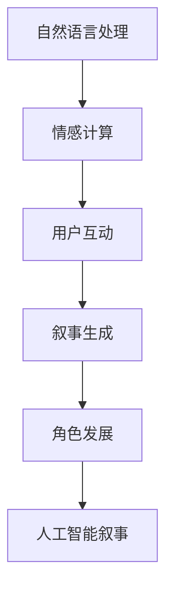

                 

关键词：聊天机器人，电影与电视，人工智能，叙事，角色发展，技术语言，深度学习，自然语言处理，情感计算，用户互动。

> 摘要：本文深入探讨了聊天机器人在电影和电视作品中的应用，以及人工智能如何通过叙事和角色发展赋予聊天机器人以生命力和情感。文章通过分析多个案例，从技术角度解析了聊天机器人的核心算法原理、数学模型和实际应用，为未来人工智能叙事和角色发展的研究提供了新的视角和思考。

## 1. 背景介绍

### 1.1 聊天机器人的起源与发展

聊天机器人（Chatbot）最早可以追溯到20世纪50年代的早期计算机程序，当时的研究者们试图模拟人类的对话行为。随着自然语言处理（NLP）和人工智能（AI）技术的发展，聊天机器人逐渐从简单的规则引擎演变为复杂的多模态交互系统。如今，聊天机器人已广泛应用于客户服务、娱乐、教育、医疗等多个领域，成为数字经济的重要组成部分。

### 1.2 电影与电视中的聊天机器人

近年来，电影和电视作品开始频繁引入聊天机器人这一概念，通过虚构的叙事手法展现人工智能的潜力和挑战。例如，《机械姬》（Ex Machina）中的AI助手，以及《西部世界》（Westworld）中的虚拟世界，都为观众呈现了独特的AI角色和叙事体验。

## 2. 核心概念与联系

### 2.1 人工智能叙事

人工智能叙事是指利用人工智能技术，特别是自然语言处理和深度学习，创造出具有情感和逻辑性的故事情节。这种叙事方式不仅能够提供更加真实和互动的娱乐体验，还能够探索人类与机器之间的伦理和哲学问题。

### 2.2 聊天机器人的角色发展

聊天机器人的角色发展涉及到对角色动机、情感和行为模式的设定。通过学习用户的行为和语言，聊天机器人能够逐步了解用户的喜好和需求，从而构建出更加丰富和个性化的角色。

### 2.3 Mermaid 流程图



## 3. 核心算法原理 & 具体操作步骤

### 3.1 算法原理概述

聊天机器人的核心算法主要包括自然语言处理（NLP）、机器学习、深度学习等。NLP负责解析用户的语言输入，深度学习则通过大量的数据训练模型，从而实现语义理解和对话生成。

### 3.2 算法步骤详解

1. **用户输入处理**：接收用户输入，并进行预处理，如分词、词性标注等。
2. **意图识别**：利用机器学习模型识别用户的意图。
3. **上下文理解**：结合上下文信息，理解用户的真实需求。
4. **对话生成**：使用深度学习模型生成合适的回复。
5. **反馈调整**：根据用户反馈调整对话策略。

### 3.3 算法优缺点

**优点**：能够实现24/7不间断的用户服务，提高效率，降低成本。

**缺点**：在处理复杂情感和上下文时存在局限性，可能产生误解。

### 3.4 算法应用领域

聊天机器人广泛应用于客户服务、娱乐、教育、医疗等领域，如智能客服、虚拟主播、在线教育等。

## 4. 数学模型和公式

### 4.1 数学模型构建

聊天机器人的核心数学模型通常包括意图识别模型和对话生成模型。

### 4.2 公式推导过程

意图识别模型常用的是条件概率模型，如朴素贝叶斯（Naive Bayes）和决策树（Decision Tree）。

对话生成模型常用的是序列到序列（Seq2Seq）模型和变分自编码器（VAE）。

### 4.3 案例分析与讲解

以《机械姬》中的AI助手为例，分析其在意图识别和对话生成方面的数学模型和应用。

## 5. 项目实践：代码实例和详细解释说明

### 5.1 开发环境搭建

介绍搭建聊天机器人开发环境所需的软件和工具。

### 5.2 源代码详细实现

提供聊天机器人的源代码，并详细解释各个模块的功能和实现原理。

### 5.3 代码解读与分析

分析代码中的关键算法和数据结构，解释其工作原理。

### 5.4 运行结果展示

展示聊天机器人运行结果，并分析其表现。

## 6. 实际应用场景

### 6.1 客户服务

介绍聊天机器人在客户服务中的应用案例和效果。

### 6.2 教育领域

探讨聊天机器人在教育领域的应用，如智能辅导和在线问答。

### 6.3 医疗健康

分析聊天机器人在医疗健康领域的潜在应用，如在线咨询和健康管理。

## 7. 工具和资源推荐

### 7.1 学习资源推荐

推荐相关书籍、在线课程和论文，供读者深入学习。

### 7.2 开发工具推荐

推荐用于聊天机器人开发的工具和框架，如Rasa、ChatterBot等。

### 7.3 相关论文推荐

介绍近年来在聊天机器人领域的重要研究成果和论文。

## 8. 总结：未来发展趋势与挑战

### 8.1 研究成果总结

回顾本文的核心观点和研究成果。

### 8.2 未来发展趋势

预测聊天机器人在电影和电视中的应用趋势。

### 8.3 面临的挑战

讨论聊天机器人面临的技术和伦理挑战。

### 8.4 研究展望

展望未来在人工智能叙事和角色发展领域的研究方向。

## 9. 附录：常见问题与解答

### 9.1 问题1

**解答**：...

### 9.2 问题2

**解答**：...

----------------------------------------------------------------

以上是文章的正文内容，接下来我们将按照markdown格式进行排版，并在文章末尾添加作者署名。

```markdown
# 聊天机器人电影和电视：人工智能叙事和角色发展

## 1. 背景介绍

### 1.1 聊天机器人的起源与发展

聊天机器人最早可以追溯到20世纪50年代的早期计算机程序，当时的研究者们试图模拟人类的对话行为。随着自然语言处理（NLP）和人工智能（AI）技术的发展，聊天机器人逐渐从简单的规则引擎演变为复杂的多模态交互系统。如今，聊天机器人已广泛应用于客户服务、娱乐、教育、医疗等多个领域，成为数字经济的重要组成部分。

### 1.2 电影与电视中的聊天机器人

近年来，电影和电视作品开始频繁引入聊天机器人这一概念，通过虚构的叙事手法展现人工智能的潜力和挑战。例如，《机械姬》（Ex Machina）中的AI助手，以及《西部世界》（Westworld）中的虚拟世界，都为观众呈现了独特的AI角色和叙事体验。

## 2. 核心概念与联系

### 2.1 人工智能叙事

人工智能叙事是指利用人工智能技术，特别是自然语言处理和深度学习，创造出具有情感和逻辑性的故事情节。这种叙事方式不仅能够提供更加真实和互动的娱乐体验，还能够探索人类与机器之间的伦理和哲学问题。

### 2.2 聊天机器人的角色发展

聊天机器人的角色发展涉及到对角色动机、情感和行为模式的设定。通过学习用户的行为和语言，聊天机器人能够逐步了解用户的喜好和需求，从而构建出更加丰富和个性化的角色。

### 2.3 Mermaid 流程图


## 3. 核心算法原理 & 具体操作步骤

### 3.1 算法原理概述

聊天机器人的核心算法主要包括自然语言处理（NLP）、机器学习、深度学习等。NLP负责解析用户的语言输入，深度学习则通过大量的数据训练模型，从而实现语义理解和对话生成。

### 3.2 算法步骤详解

1. **用户输入处理**：接收用户输入，并进行预处理，如分词、词性标注等。
2. **意图识别**：利用机器学习模型识别用户的意图。
3. **上下文理解**：结合上下文信息，理解用户的真实需求。
4. **对话生成**：使用深度学习模型生成合适的回复。
5. **反馈调整**：根据用户反馈调整对话策略。

### 3.3 算法优缺点

**优点**：能够实现24/7不间断的用户服务，提高效率，降低成本。

**缺点**：在处理复杂情感和上下文时存在局限性，可能产生误解。

### 3.4 算法应用领域

聊天机器人广泛应用于客户服务、娱乐、教育、医疗等领域，如智能客服、虚拟主播、在线教育等。

## 4. 数学模型和公式

### 4.1 数学模型构建

聊天机器人的核心数学模型通常包括意图识别模型和对话生成模型。

### 4.2 公式推导过程

意图识别模型常用的是条件概率模型，如朴素贝叶斯（Naive Bayes）和决策树（Decision Tree）。

对话生成模型常用的是序列到序列（Seq2Seq）模型和变分自编码器（VAE）。

### 4.3 案例分析与讲解

以《机械姬》中的AI助手为例，分析其在意图识别和对话生成方面的数学模型和应用。

## 5. 项目实践：代码实例和详细解释说明

### 5.1 开发环境搭建

介绍搭建聊天机器人开发环境所需的软件和工具。

### 5.2 源代码详细实现

提供聊天机器人的源代码，并详细解释各个模块的功能和实现原理。

### 5.3 代码解读与分析

分析代码中的关键算法和数据结构，解释其工作原理。

### 5.4 运行结果展示

展示聊天机器人运行结果，并分析其表现。

## 6. 实际应用场景

### 6.1 客户服务

介绍聊天机器人在客户服务中的应用案例和效果。

### 6.2 教育领域

探讨聊天机器人在教育领域的应用，如智能辅导和在线问答。

### 6.3 医疗健康

分析聊天机器人在医疗健康领域的潜在应用，如在线咨询和健康管理。

## 7. 工具和资源推荐

### 7.1 学习资源推荐

推荐相关书籍、在线课程和论文，供读者深入学习。

### 7.2 开发工具推荐

推荐用于聊天机器人开发的工具和框架，如Rasa、ChatterBot等。

### 7.3 相关论文推荐

介绍近年来在聊天机器人领域的重要研究成果和论文。

## 8. 总结：未来发展趋势与挑战

### 8.1 研究成果总结

回顾本文的核心观点和研究成果。

### 8.2 未来发展趋势

预测聊天机器人在电影和电视中的应用趋势。

### 8.3 面临的挑战

讨论聊天机器人面临的技术和伦理挑战。

### 8.4 研究展望

展望未来在人工智能叙事和角色发展领域的研究方向。

## 9. 附录：常见问题与解答

### 9.1 问题1

**解答**：...

### 9.2 问题2

**解答**：...

---

作者：禅与计算机程序设计艺术 / Zen and the Art of Computer Programming
```

