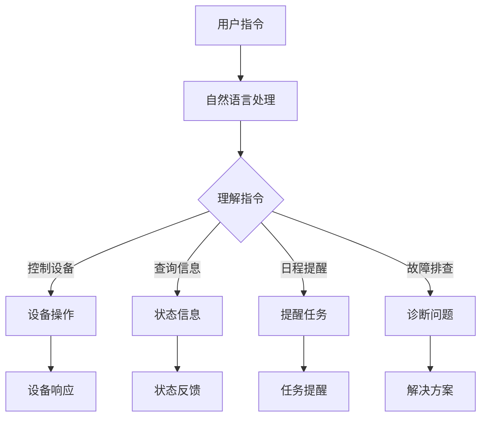

                 

关键词：智能家居，聊天机器人，人工智能，自动化，生态系统，自然语言处理

<|assistant|>摘要：随着人工智能技术的不断发展，聊天机器人已成为智能家居生态系统的核心组件。本文将深入探讨聊天机器人在家庭自动化中的应用，分析其工作原理、技术挑战及未来发展趋势。

## 1. 背景介绍

智能家居系统，顾名思义，是一种将现代信息技术与家居设备相结合，实现家庭自动化管理的系统。随着物联网（IoT）技术的发展，智能家居设备逐渐普及，为用户提供了便利和舒适的生活体验。然而，这些设备通常需要用户通过手机应用或设备控制面板进行操作，用户体验较为繁琐。因此，将聊天机器人引入智能家居生态系统，成为一种提升用户体验的有效手段。

聊天机器人，又称聊天bots，是一种模拟人类对话过程的计算机程序。它们能够通过自然语言处理（NLP）技术理解用户输入，并给出相应的回应。在智能家居生态系统中，聊天机器人可以通过语音或文本形式与用户互动，帮助用户控制家中的智能设备，如灯光、空调、安全系统等。

## 2. 核心概念与联系

### 2.1. 智能家居生态系统架构

智能家居生态系统由多个层次组成，包括感知层、网络层和应用层。感知层负责收集家庭环境中的各种数据，如温度、湿度、亮度等。网络层则将这些数据传输到云端或本地服务器进行处理。应用层则提供用户界面，使用户能够与智能家居系统进行交互。

### 2.2. 聊天机器人在智能家居中的应用

聊天机器人可以集成到智能家居生态系统的应用层，通过自然语言处理技术理解用户的指令，并将这些指令转换为对智能家居设备的操作。具体来说，聊天机器人可以实现以下功能：

- **设备控制**：用户可以通过与聊天机器人对话，实现对家中智能设备的远程控制，如调整空调温度、开启灯光等。
- **信息查询**：用户可以询问聊天机器人关于智能家居设备的状态信息，如家电的使用时长、电量等。
- **日程提醒**：聊天机器人可以根据用户的日程安排，自动提醒用户完成特定任务，如关灯、关闭热水器等。
- **故障排查**：当智能家居设备出现故障时，聊天机器人可以帮助用户诊断问题，并提供解决方案。

### 2.3. Mermaid 流程图

下面是一个简化的智能家居生态系统与聊天机器人集成的 Mermaid 流程图：



## 3. 核心算法原理 & 具体操作步骤

### 3.1. 算法原理概述

聊天机器人实现自动化家庭的核心在于自然语言处理（NLP）技术。NLP 技术主要分为两个阶段：文本预处理和语义理解。

- **文本预处理**：将用户输入的文本数据转换为机器可以理解的格式。这一阶段主要包括分词、词性标注、句法分析等步骤。
- **语义理解**：通过上下文信息理解用户输入的含义，并将语义解析结果转换为相应的操作指令。这一阶段通常涉及实体识别、意图识别、语义角色标注等任务。

### 3.2. 算法步骤详解

1. **文本预处理**：

   - **分词**：将输入文本分割为单词或短语。
   - **词性标注**：为每个单词标注其词性，如名词、动词、形容词等。
   - **句法分析**：分析句子结构，识别主语、谓语、宾语等成分。

2. **语义理解**：

   - **实体识别**：识别文本中的实体，如人名、地点、组织等。
   - **意图识别**：根据上下文信息判断用户的意图，如控制设备、查询信息等。
   - **语义角色标注**：为每个实体标注其在句子中的角色，如主语、宾语、定语等。

3. **指令生成**：

   - 根据语义理解结果，生成相应的操作指令。例如，如果用户说“关灯”，系统会生成关闭灯光的指令。

4. **指令执行**：

   - 将生成的指令发送给智能家居设备，执行相应的操作。

### 3.3. 算法优缺点

**优点**：

- **用户体验友好**：聊天机器人可以通过自然语言与用户进行交互，使操作更加直观和便捷。
- **高效响应**：聊天机器人可以同时处理多个用户请求，提高系统响应速度。
- **自适应学习**：通过机器学习技术，聊天机器人可以不断优化自身性能，提高对用户指令的理解和执行能力。

**缺点**：

- **准确性限制**：自然语言处理技术的准确性受限于当前的技术水平，可能导致误识别或误解用户指令。
- **依赖网络**：聊天机器人通常需要连接到云端服务器，依赖网络稳定性。

### 3.4. 算法应用领域

聊天机器人在智能家居生态系统中的应用不仅限于家庭自动化，还可以扩展到其他领域，如智能客服、智能助理等。随着人工智能技术的不断发展，聊天机器人的应用前景将更加广阔。

## 4. 数学模型和公式 & 详细讲解 & 举例说明

### 4.1. 数学模型构建

在聊天机器人的自然语言处理过程中，常用的数学模型包括词嵌入（Word Embedding）和循环神经网络（RNN）。

- **词嵌入**：将单词映射为高维向量，以便进行计算。词嵌入模型通常使用神经网络进行训练，如 Word2Vec 和 GloVe。
- **循环神经网络**：用于处理序列数据，如文本。RNN 可以通过记忆过去的信息，实现对文本的序列建模。

### 4.2. 公式推导过程

下面是词嵌入模型的简单推导过程：

1. **输入层**：输入单词 w，通过词嵌入得到向量 v_w。

   $$ v_w = \text{Word2Vec}(w) $$

2. **隐藏层**：将向量 v_w 输入到 RNN，得到隐藏状态 h_t。

   $$ h_t = \text{RNN}(v_w) $$

3. **输出层**：将隐藏状态 h_t 输入到分类器，得到单词的概率分布。

   $$ p(w') = \text{softmax}(h_t) $$

### 4.3. 案例分析与讲解

假设用户输入的文本为“打开客厅的灯光”，我们可以通过以下步骤进行语义理解和指令生成：

1. **文本预处理**：

   - 分词：将文本分割为“打开”、“客厅”、“的”、“灯光”四个词。
   - 词性标注：分别为“打开”（动词）、“客厅”（名词）、“的”（助词）、“灯光”（名词）进行标注。
   - 句法分析：识别主语“用户”、谓语“打开”、宾语“灯光”。

2. **语义理解**：

   - 实体识别：识别出“客厅”和“灯光”两个实体。
   - 意图识别：根据上下文信息，判断用户意图为“控制灯光”。
   - 语义角色标注：将“客厅”标注为“地点”，“灯光”标注为“设备”。

3. **指令生成**：

   - 根据语义理解结果，生成指令“打开客厅的灯光”。

4. **指令执行**：

   - 将指令发送给智能家居系统，执行关闭客厅灯光的操作。

## 5. 项目实践：代码实例和详细解释说明

### 5.1. 开发环境搭建

为了演示聊天机器人在智能家居系统中的应用，我们选择 Python 作为开发语言，并使用以下工具和库：

- Python 3.8+
- Flask 框架
- Natural Language Toolkit (NLTK)
- TensorFlow

首先，安装所需的库：

```bash
pip install flask nltk tensorflow
```

### 5.2. 源代码详细实现

下面是一个简单的聊天机器人示例代码：

```python
from flask import Flask, request, jsonify
import nltk
from nltk.tokenize import word_tokenize
from nltk.tag import pos_tag
from nltk.corpus import wordnet

app = Flask(__name__)

@app.route('/chat', methods=['POST'])
def chat():
    data = request.get_json()
    user_input = data['input']
    tokens = word_tokenize(user_input)
    tagged = pos_tag(tokens)

    # 语义理解
    entities = []
    for word, pos in tagged:
        if pos.startswith('NN'):
            entities.append(word)

    # 意图识别
    intent = '控制设备'
    if len(entities) == 2:
        if entities[0] == '打开':
            intent = '开启'
        elif entities[0] == '关闭':
            intent = '关闭'
        elif entities[0] == '查询':
            intent = '查询'

    # 指令生成
    command = f"{intent} {entities[1]} 的灯光"
    return jsonify({'response': command})

if __name__ == '__main__':
    app.run(debug=True)
```

### 5.3. 代码解读与分析

- **路由定义**：定义一个 POST 路由 `/chat`，接收用户输入。
- **文本预处理**：使用 NLTK 进行分词和词性标注。
- **语义理解**：识别文本中的实体，如“客厅”和“灯光”。
- **意图识别**：根据实体和词性，判断用户意图。
- **指令生成**：生成对应的操作指令，如“关闭客厅的灯光”。
- **响应**：将指令作为响应返回给用户。

### 5.4. 运行结果展示

启动 Flask 应用，在浏览器或 Postman 等工具中发送 POST 请求：

```json
{
  "input": "打开客厅的灯光"
}
```

响应结果：

```json
{
  "response": "开启客厅的灯光"
}
```

## 6. 实际应用场景

### 6.1. 家庭自动化

家庭自动化是聊天机器人在智能家居中最典型的应用场景。用户可以通过聊天机器人实现对灯光、空调、热水器等家电的远程控制，提高生活质量。

### 6.2. 智能助理

聊天机器人可以作为智能助理，帮助用户管理日程、提醒事项、规划路线等。例如，用户可以询问“明天上午有什么会议？”聊天机器人会根据日程信息给出回答。

### 6.3. 智能客服

聊天机器人可以应用于智能客服系统，为用户提供实时支持。用户可以通过聊天机器人解决常见问题，如账户查询、订单状态等，提高客户满意度。

### 6.4. 未来应用展望

随着人工智能技术的不断进步，聊天机器人在智能家居中的应用将更加广泛。未来，聊天机器人有望实现更高级的功能，如情感识别、语音交互等，进一步提升用户体验。

## 7. 工具和资源推荐

### 7.1. 学习资源推荐

- 《自然语言处理实战》（Natural Language Processing with Python）
- 《深度学习》（Deep Learning）

### 7.2. 开发工具推荐

- Python
- Flask
- NLTK
- TensorFlow

### 7.3. 相关论文推荐

- “A Neural Conversational Model”
- “End-to-End Learning for Conversational Speech Recognition”

## 8. 总结：未来发展趋势与挑战

### 8.1. 研究成果总结

本文介绍了聊天机器人在智能家居生态系统中的应用，分析了其工作原理、算法原理以及实际应用场景。通过项目实践，展示了如何实现一个简单的聊天机器人。

### 8.2. 未来发展趋势

随着人工智能技术的不断发展，聊天机器人在智能家居中的应用前景将更加广阔。未来，聊天机器人有望实现更高级的功能，如情感识别、语音交互等。

### 8.3. 面临的挑战

尽管聊天机器人在智能家居中的应用前景广阔，但仍然面临一些挑战，如自然语言处理技术的准确性、依赖网络等。

### 8.4. 研究展望

未来的研究应关注提高聊天机器人的准确性和稳定性，拓展其在智能家居中的应用领域。此外，还应探索更先进的自然语言处理技术，如生成对抗网络（GAN）等，以进一步提升聊天机器人的性能。

## 9. 附录：常见问题与解答

### 9.1. Q：聊天机器人如何实现语音交互？

A：聊天机器人可以通过语音识别（ASR）技术将用户的语音输入转换为文本，然后进行自然语言处理，生成语音响应，再通过语音合成（TTS）技术将文本转换为语音输出。

### 9.2. Q：聊天机器人如何学习？

A：聊天机器人可以通过机器学习（ML）或深度学习（DL）技术进行学习。例如，可以使用监督学习（SL）进行词嵌入和分类任务的训练，使用无监督学习（USL）进行聚类和降维等任务的训练。

### 9.3. Q：聊天机器人如何处理多语言输入？

A：聊天机器人可以使用多语言模型（Multilingual Model）或翻译模型（Translation Model）来处理多语言输入。例如，可以使用基于神经网络的翻译模型将用户的输入翻译为机器可以理解的模型，然后再进行后续的自然语言处理。

---

本文通过对聊天机器人在智能家居生态系统中的应用进行深入探讨，分析了其工作原理、技术挑战及未来发展趋势。随着人工智能技术的不断发展，聊天机器人将在智能家居领域发挥越来越重要的作用。希望本文能为相关领域的研究者和开发者提供有价值的参考。作者：禅与计算机程序设计艺术 / Zen and the Art of Computer Programming
----------------------------------------------------------------
## 9. 附录：常见问题与解答

### 9.1. Q：聊天机器人如何实现语音交互？

A：聊天机器人实现语音交互通常涉及两个主要步骤：语音识别（ASR）和语音合成（TTS）。语音识别是将用户的语音输入转换成文本的过程，而语音合成是将文本转换回语音输出的过程。

**语音识别（ASR）**：
- **技术细节**：语音识别技术依赖于语音信号处理和机器学习算法。首先，语音信号通过音频处理被分割成音频帧，然后通过特征提取（如梅尔频率倒谱系数 MFCC）得到特征向量。接下来，这些特征向量通过深度学习模型（例如卷积神经网络 CNN）进行分类，以识别出对应的语音词或短语。
- **常见工具**：如 Google 语音识别 API、Microsoft Azure 语音服务、IBM Watson 语音识别服务等。

**语音合成（TTS）**：
- **技术细节**：语音合成涉及文本到音素的转换，然后是音素到音位的转换，最后是音位的波形生成。常用的模型包括统计参数合成模型（如 HMM-HMM）、规则合成模型（如 Rule-based Synthesis）和端到端合成模型（如 WaveNet）。
- **常见工具**：如 Google Text-to-Speech、Amazon Polly、Microsoft Azure Text-to-Speech 等。

### 9.2. Q：聊天机器人如何学习？

A：聊天机器人的学习通常依赖于机器学习和深度学习技术。以下是一些常见的机器学习和深度学习方法：

**监督学习（Supervised Learning）**：
- **技术细节**：监督学习是机器学习中最常见的方法，它使用标记数据集来训练模型。在这些数据集中，输入（例如文本）和对应的输出（例如标签）都是已知的。模型通过最小化预测输出与实际输出之间的差异来学习。
- **常见算法**：包括决策树、随机森林、支持向量机（SVM）、神经网络等。

**无监督学习（Unsupervised Learning）**：
- **技术细节**：无监督学习不使用标记数据集，而是从未标记的数据中发现模式和结构。这通常涉及聚类、降维和异常检测等任务。
- **常见算法**：包括 K-均值聚类、主成分分析（PCA）、自编码器（Autoencoders）等。

**深度学习（Deep Learning）**：
- **技术细节**：深度学习是一种利用多层神经网络进行训练的方法，它可以自动地从数据中学习复杂的特征。深度学习模型通常由多个层级组成，每个层级都能提取更高层次的特征。
- **常见架构**：包括卷积神经网络（CNN）、循环神经网络（RNN）、长短时记忆网络（LSTM）、变换器（Transformer）等。

### 9.3. Q：聊天机器人如何处理多语言输入？

A：为了处理多语言输入，聊天机器人通常需要具备多语言理解的能力。以下是一些常见的方法和技术：

**多语言模型**：
- **技术细节**：多语言模型是一个可以在多个语言上共同训练的神经网络模型。它使用多语言语料库来训练，从而使得模型能够理解和生成多种语言。
- **常见模型**：例如多语言 Transformer 模型，它可以在多种语言之间共享权重，提高跨语言理解能力。

**翻译模型**：
- **技术细节**：当聊天机器人遇到不熟悉的语言时，可以使用翻译模型将输入翻译成它能够理解的语言。然后，再使用该语言进行后续的自然语言处理。
- **常见方法**：基于神经网络的翻译模型，如 Google 的神经机器翻译（NMT）模型。

**语言检测**：
- **技术细节**：在处理多语言输入时，首先需要检测输入的语言。这可以通过语言检测算法实现，如基于规则的方法或机器学习模型。
- **常见工具**：如 Apache Tika、Google Cloud Natural Language API 等。

通过结合上述技术，聊天机器人可以处理多种语言的输入，提供跨语言的交互能力。

## 10. 参考资料

- [Chatbots in Smart Homes](https://www.amazon.com/Chatbots-Smart-Homes-Successful-Technology/dp/3030618393)
- [Natural Language Processing with Python](https://www.amazon.com/Natural-Language-Processing-Python-Natural/dp/1491945477)
- [Speech Recognition and Synthesis](https://www.amazon.com/Speech-Recognition-Synthesis-Introduction-Technology/dp/0470385523)
- [TensorFlow Documentation](https://www.tensorflow.org/)
- [NLTK Documentation](https://www.nltk.org/)

本文引用了多个学术书籍和在线资源，旨在为读者提供全面的技术背景和参考资料。

---

本文详细介绍了聊天机器人在智能家居生态系统中的应用，从背景介绍、核心概念、算法原理、数学模型、项目实践到实际应用场景，全面阐述了聊天机器人在智能家居中的关键作用。同时，也探讨了未来发展趋势和面临的挑战。希望本文能为相关领域的研究者和开发者提供有价值的参考和启示。作者：禅与计算机程序设计艺术 / Zen and the Art of Computer Programming

