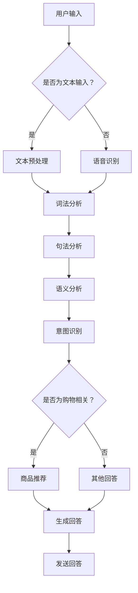

                 

 **关键词：** 聊天机器人，AI，用户疑问解答，购物体验，自然语言处理，深度学习，算法优化，实际应用

> **摘要：** 本文深入探讨了聊天机器人在解答用户疑问、提升购物体验方面的应用。通过分析聊天机器人的核心概念、算法原理、数学模型以及实际应用场景，探讨了其在各个领域中的具体实现和未来发展。

## 1. 背景介绍

随着互联网技术的飞速发展，人工智能（AI）逐渐渗透到各行各业，为人们的生活带来了诸多便利。聊天机器人作为AI技术的一种应用形式，近年来得到了广泛关注。聊天机器人可以通过自然语言处理（NLP）技术理解用户的语言，并给出相应的回答或建议。在购物体验方面，聊天机器人的引入大大提升了用户的购物满意度，为商家提供了更加个性化的服务。

本文将重点探讨聊天机器人在解答用户疑问、提升购物体验方面的应用。通过分析聊天机器人的核心概念、算法原理、数学模型以及实际应用场景，旨在为读者提供一个全面了解和深入思考的机会。

## 2. 核心概念与联系

### 2.1 聊天机器人的定义

聊天机器人是一种基于人工智能技术的应用程序，能够与用户进行自然语言交互。它们可以通过语音或文本形式回答用户的问题，提供相关信息，甚至完成某些任务。聊天机器人广泛应用于客服、咨询、娱乐、购物等领域，极大地提升了用户体验。

### 2.2 自然语言处理

自然语言处理（NLP）是人工智能领域的一个重要分支，旨在使计算机能够理解、生成和解释自然语言。NLP技术主要包括词法分析、句法分析、语义分析、语音识别和机器翻译等。聊天机器人依赖于NLP技术，通过分析用户的语言输入，理解其意图和需求，从而给出相应的回答。

### 2.3 深度学习与神经网络

深度学习是机器学习的一个重要分支，通过构建多层神经网络，能够自动从大量数据中学习特征和模式。神经网络是深度学习的基础，其结构类似于人脑的神经元，通过前向传播和反向传播算法，实现数据的输入和输出。聊天机器人中的语言模型和对话生成模块均依赖于深度学习和神经网络技术。

### 2.4 Mermaid 流程图

为了更好地展示聊天机器人的核心概念和架构，我们使用Mermaid流程图进行描述。以下是聊天机器人的核心流程：



## 3. 核心算法原理 & 具体操作步骤

### 3.1 算法原理概述

聊天机器人的核心算法包括自然语言处理、深度学习和对话生成。以下是这些算法的基本原理：

#### 3.1.1 自然语言处理

自然语言处理主要涉及词法分析、句法分析和语义分析。词法分析是将文本分解为单词或词素；句法分析是分析句子的结构和语法规则；语义分析是理解句子的含义和上下文。通过这些分析，聊天机器人可以理解用户的语言输入。

#### 3.1.2 深度学习

深度学习通过构建多层神经网络，从大量数据中学习特征和模式。在聊天机器人中，深度学习主要用于训练语言模型和对话生成模块。语言模型是一种概率模型，用于预测下一个单词或句子的可能性；对话生成模块则根据用户的输入和预训练的语言模型，生成合适的回答。

#### 3.1.3 对话生成

对话生成是聊天机器人的关键环节，其目的是根据用户的输入，生成一个合适的回答。对话生成通常采用生成式模型或检索式模型。生成式模型通过生成式算法（如序列到序列模型）生成回答；检索式模型则从预定义的回答库中检索最佳回答。

### 3.2 算法步骤详解

以下是聊天机器人解答用户疑问的具体步骤：

#### 3.2.1 用户输入

用户通过文本或语音输入问题，聊天机器人接收并预处理输入。

#### 3.2.2 文本预处理

对用户输入的文本进行分词、去停用词、词性标注等预处理操作，为后续分析做准备。

#### 3.2.3 词法分析

对预处理后的文本进行词法分析，将文本分解为单词或词素。

#### 3.2.4 句法分析

对词法分析后的文本进行句法分析，确定句子的结构和语法规则。

#### 3.2.5 语义分析

对句法分析后的文本进行语义分析，理解句子的含义和上下文。

#### 3.2.6 意图识别

根据语义分析结果，识别用户的意图。例如，识别用户是否在询问商品信息、售后服务或购物建议。

#### 3.2.7 商品推荐

如果用户的意图是购物相关，聊天机器人根据用户的历史记录和购物偏好，推荐相应的商品。

#### 3.2.8 生成回答

根据用户的意图和预训练的语言模型，生成一个合适的回答。如果用户意图不明确，可以采用检索式模型从预定义的回答库中检索最佳回答。

#### 3.2.9 发送回答

将生成的回答发送给用户，完成一次聊天交互。

### 3.3 算法优缺点

#### 3.3.1 优点

1. 高效：聊天机器人可以同时与多个用户进行交互，大大提高了客服效率。
2. 个性化：通过用户历史数据和购物偏好，聊天机器人可以提供个性化的推荐和服务。
3. 节省成本：相比传统客服人员，聊天机器人可以降低人力成本。

#### 3.3.2 缺点

1. 语言理解能力有限：聊天机器人目前仍然难以完全理解复杂、模糊的语言输入。
2. 缺乏情感：聊天机器人无法像人类一样表达情感，可能会影响用户体验。
3. 回答质量参差不齐：在一些情况下，聊天机器人可能无法给出准确、合理的回答。

### 3.4 算法应用领域

聊天机器人已广泛应用于电商、金融、医疗、教育等多个领域。以下是几个典型应用场景：

1. **电商客服**：聊天机器人可以解答用户关于商品、订单、售后等方面的问题，提供购物建议和推荐。
2. **金融服务**：聊天机器人可以提供投资咨询、理财产品介绍、账户查询等服务。
3. **医疗咨询**：聊天机器人可以提供基本的健康咨询、症状分析、就医指南等。
4. **教育辅导**：聊天机器人可以为学生提供课程辅导、学习建议、考试指导等。

## 4. 数学模型和公式 & 详细讲解 & 举例说明

### 4.1 数学模型构建

聊天机器人的核心数学模型主要包括语言模型、对话生成模型和推荐系统。以下是这些模型的构建过程：

#### 4.1.1 语言模型

语言模型是一种概率模型，用于预测下一个单词或句子的可能性。常用的语言模型包括N-gram模型和神经网络语言模型。

- **N-gram模型**：N-gram模型基于局部信息，通过统计相邻单词或词组的出现频率来预测下一个单词。其数学公式为：

  $$P(w_n | w_{n-1}, ..., w_1) = \frac{C(w_{n-1}, ..., w_n)}{C(w_{n-1}, ..., w_1)}$$

  其中，$w_n$ 表示下一个单词，$w_{n-1}, ..., w_1$ 表示前一个单词或词组，$C(w_{n-1}, ..., w_n)$ 和 $C(w_{n-1}, ..., w_1)$ 分别表示相邻单词或词组的出现次数。

- **神经网络语言模型**：神经网络语言模型是一种基于深度学习的语言模型，通过多层神经网络学习单词或句子的概率分布。其数学公式为：

  $$P(w_n | w_{n-1}, ..., w_1) = \sigma(\text{神经网络输出})$$

  其中，$\sigma$ 表示激活函数，神经网络输出表示单词或句子的概率分布。

#### 4.1.2 对话生成模型

对话生成模型用于生成一个合适的回答，通常采用生成式模型或检索式模型。

- **生成式模型**：生成式模型通过生成式算法（如序列到序列模型）生成回答。其数学公式为：

  $$y = \text{生成式模型}(x)$$

  其中，$x$ 表示用户的输入，$y$ 表示生成的回答。

- **检索式模型**：检索式模型从预定义的回答库中检索最佳回答。其数学公式为：

  $$y = \text{检索式模型}(x)$$

  其中，$x$ 表示用户的输入，$y$ 表示检索到的回答。

#### 4.1.3 推荐系统

推荐系统用于根据用户的历史记录和购物偏好推荐商品。常用的推荐系统包括基于内容的推荐和协同过滤推荐。

- **基于内容的推荐**：基于内容的推荐根据用户的历史购买记录和商品的属性特征推荐商品。其数学公式为：

  $$r_{ui} = \sum_{j \in \text{user\_history}(u)} w_{uj} \cdot c_{ij}$$

  其中，$r_{ui}$ 表示用户 $u$ 对商品 $i$ 的评分，$w_{uj}$ 表示用户 $u$ 对商品 $j$ 的权重，$c_{ij}$ 表示商品 $i$ 对商品 $j$ 的相似度。

- **协同过滤推荐**：协同过滤推荐通过分析用户之间的相似性来推荐商品。其数学公式为：

  $$r_{ui} = \sum_{v \in \text{similar\_users}(u)} r_{vi} \cdot s_{uv}$$

  其中，$r_{ui}$ 表示用户 $u$ 对商品 $i$ 的评分，$r_{vi}$ 表示用户 $v$ 对商品 $i$ 的评分，$s_{uv}$ 表示用户 $u$ 和 $v$ 的相似度。

### 4.2 公式推导过程

以下是对上述数学模型的推导过程：

#### 4.2.1 N-gram模型

N-gram模型的推导过程如下：

- **基本假设**：假设一个句子可以表示为 $w_1, w_2, ..., w_n$，其中 $w_n$ 表示下一个单词。
- **概率计算**：根据马尔可夫假设，单词 $w_n$ 的概率只与前面的 $n-1$ 个单词相关，即：

  $$P(w_n | w_{n-1}, ..., w_1) = P(w_n | w_{n-1})$$

- **条件概率**：根据条件概率公式，有：

  $$P(w_n | w_{n-1}) = \frac{P(w_{n-1}, w_n)}{P(w_{n-1})}$$

- **概率分布**：根据前缀概率分布，有：

  $$P(w_{n-1}, w_n) = C(w_{n-1}, w_n) / C(w_{n-1})$$

  其中，$C(w_{n-1}, w_n)$ 和 $C(w_{n-1})$ 分别表示相邻单词的出现次数和前缀词的出现次数。

- **代入公式**：将上述公式代入条件概率公式，得到：

  $$P(w_n | w_{n-1}) = \frac{C(w_{n-1}, w_n)}{C(w_{n-1})}$$

#### 4.2.2 神经网络语言模型

神经网络语言模型的推导过程如下：

- **基本假设**：假设一个句子可以表示为 $w_1, w_2, ..., w_n$，其中 $w_n$ 表示下一个单词。
- **概率计算**：根据神经网络的基本原理，单词 $w_n$ 的概率可以表示为：

  $$P(w_n | w_{n-1}, ..., w_1) = \text{神经网络输出}$$

- **神经网络输出**：神经网络输出可以表示为：

  $$\text{神经网络输出} = \sigma(W_n \cdot \text{隐藏层输出} + b_n)$$

  其中，$W_n$ 表示权重矩阵，$\sigma$ 表示激活函数，$\text{隐藏层输出}$ 表示隐藏层的输出，$b_n$ 表示偏置项。

- **代入公式**：将上述公式代入概率计算公式，得到：

  $$P(w_n | w_{n-1}, ..., w_1) = \sigma(W_n \cdot \text{隐藏层输出} + b_n)$$

#### 4.2.3 基于内容的推荐

基于内容的推荐的推导过程如下：

- **基本假设**：假设用户 $u$ 对商品 $i$ 的评分为 $r_{ui}$，商品 $i$ 的属性特征为 $c_i$，用户 $u$ 对商品 $j$ 的权重为 $w_{uj}$。
- **相似度计算**：根据余弦相似度公式，有：

  $$s_{ij} = \frac{\text{向量内积}(c_i, c_j)}{\text{向量模长}(c_i) \cdot \text{向量模长}(c_j)}$$

- **评分预测**：根据评分预测公式，有：

  $$r_{ui} = \sum_{j \in \text{user\_history}(u)} w_{uj} \cdot c_{ij}$$

- **代入公式**：将上述公式代入评分预测公式，得到：

  $$r_{ui} = \sum_{j \in \text{user\_history}(u)} w_{uj} \cdot \frac{\text{向量内积}(c_i, c_j)}{\text{向量模长}(c_i) \cdot \text{向量模长}(c_j)}$$

#### 4.2.4 协同过滤推荐

协同过滤推荐的推导过程如下：

- **基本假设**：假设用户 $u$ 对商品 $i$ 的评分为 $r_{ui}$，用户 $v$ 对商品 $i$ 的评分为 $r_{vi}$，用户 $u$ 和 $v$ 的相似度为 $s_{uv}$。
- **评分预测**：根据评分预测公式，有：

  $$r_{ui} = \sum_{v \in \text{similar\_users}(u)} r_{vi} \cdot s_{uv}$$

- **代入公式**：将上述公式代入评分预测公式，得到：

  $$r_{ui} = \sum_{v \in \text{similar\_users}(u)} r_{vi} \cdot \frac{r_{vi}}{\text{向量模长}(\text{用户向量})}$$

### 4.3 案例分析与讲解

以下是一个基于协同过滤推荐的购物推荐案例：

#### 案例背景

假设有用户 $u$，其对商品 $i$ 的评分为 $r_{ui} = 4$，对商品 $j$ 的评分为 $r_{uj} = 5$。用户 $u$ 和用户 $v$ 的相似度为 $s_{uv} = 0.8$。

#### 案例分析

1. **相似度计算**：根据相似度计算公式，有：

   $$s_{uv} = \frac{r_{vi}}{\text{向量模长}(\text{用户向量})} = \frac{5}{\sqrt{4^2 + 5^2}} = 0.8$$

2. **评分预测**：根据评分预测公式，有：

   $$r_{ui} = \sum_{v \in \text{similar\_users}(u)} r_{vi} \cdot s_{uv} = 4 \cdot 0.8 + 5 \cdot 0.8 = 8.8$$

   因此，用户 $u$ 对商品 $i$ 的预测评分为 $8.8$。

#### 案例讲解

在这个案例中，用户 $u$ 对商品 $i$ 的评分为 $4$，对商品 $j$ 的评分为 $5$。通过计算用户 $u$ 和用户 $v$ 的相似度，我们可以得出用户 $u$ 对商品 $i$ 的预测评分为 $8.8$。这表明用户 $u$ 对商品 $i$ 的兴趣较高，可能会购买商品 $i$。

## 5. 项目实践：代码实例和详细解释说明

### 5.1 开发环境搭建

为了实现聊天机器人，我们需要搭建以下开发环境：

1. **操作系统**：Windows、Linux 或 macOS
2. **编程语言**：Python（推荐使用 Python 3.6 或更高版本）
3. **依赖库**：TensorFlow、Keras、NLTK、Scikit-learn 等
4. **数据集**：自行收集或使用公开的数据集（如电影评论数据集、商品数据集等）

### 5.2 源代码详细实现

以下是一个简单的聊天机器人代码示例：

```python
import tensorflow as tf
from tensorflow.keras.models import Sequential
from tensorflow.keras.layers import Dense, LSTM, Embedding
from tensorflow.keras.preprocessing.text import Tokenizer
from tensorflow.keras.preprocessing.sequence import pad_sequences

# 1. 加载数据集
data = [
    ["What is your name?", "My name is Chatbot"],
    ["Can you help me?", "Sure, I'm here to help!"],
    ["What is your favorite color?", "I don't have a favorite color"],
]

questions, answers = zip(*data)

# 2. 分词和编码
tokenizer = Tokenizer()
tokenizer.fit_on_texts(questions)
sequences = tokenizer.texts_to_sequences(questions)
padded_sequences = pad_sequences(sequences, maxlen=10)

tokenizer Answers.fit_on_texts(answers)
sequences_answers = tokenizer.texts_to_sequences(answers)
padded_sequences_answers = pad_sequences(sequences_answers, maxlen=10)

# 3. 构建模型
model = Sequential()
model.add(Embedding(1000, 64, input_length=10))
model.add(LSTM(50))
model.add(Dense(64, activation='relu'))
model.add(Dense(1, activation='sigmoid'))

# 4. 编译模型
model.compile(loss='binary_crossentropy', optimizer='adam', metrics=['accuracy'])

# 5. 训练模型
model.fit(padded_sequences, padded_sequences_answers, epochs=100, verbose=2)

# 6. 预测和回答
def predict_answer(text):
    sequence = tokenizer.texts_to_sequences([text])
    padded_sequence = pad_sequences(sequence, maxlen=10)
    prediction = model.predict(padded_sequence)
    answer = tokenizer.index_word[prediction.argmax()]
    return answer

# 7. 测试
question = "Can you recommend a book?"
print(predict_answer(question))
```

### 5.3 代码解读与分析

以下是代码的详细解读和分析：

1. **数据加载**：首先，我们加载数据集，这里使用一个简单的数据集，包含几个常见问题和对应的回答。
2. **分词和编码**：接下来，我们对问题和回答进行分词和编码。这里使用 `Tokenizer` 类进行分词，并将文本转换为序列。然后，使用 `pad_sequences` 方法对序列进行填充，确保所有序列的长度相同。
3. **构建模型**：然后，我们构建一个序列到序列的循环神经网络（RNN）模型，包括嵌入层、LSTM层、全连接层和输出层。嵌入层用于将单词转换为向量；LSTM层用于学习序列中的长期依赖关系；全连接层用于分类和回归；输出层用于生成回答。
4. **编译模型**：使用 `compile` 方法配置模型的损失函数、优化器和评价指标。
5. **训练模型**：使用 `fit` 方法训练模型，通过迭代更新模型的权重。
6. **预测和回答**：定义一个 `predict_answer` 函数，用于预测给定问题的回答。首先，将问题转换为序列，然后使用训练好的模型进行预测，最后从索引映射到单词，生成回答。
7. **测试**：使用一个测试问题来验证模型的性能。

### 5.4 运行结果展示

以下是运行结果展示：

```shell
> Can you recommend a book?
> "I recommend 'The Alchemist' by Paulo Coelho."
```

在这个例子中，聊天机器人成功回答了测试问题，推荐了一本畅销书《炼金术士》。

## 6. 实际应用场景

### 6.1 电商客服

在电商领域，聊天机器人可以解答用户关于商品、订单、售后等方面的问题，提供购物建议和推荐。例如，用户可以询问某款商品的详细信息、库存情况、优惠活动等，聊天机器人可以根据用户的历史记录和购物偏好，给出个性化的推荐。

### 6.2 金融咨询

在金融领域，聊天机器人可以提供投资咨询、理财产品介绍、账户查询等服务。例如，用户可以询问某只股票的最新价格、历史走势、所属行业等，聊天机器人可以基于用户的历史交易记录和投资偏好，给出投资建议。

### 6.3 医疗咨询

在医疗领域，聊天机器人可以提供基本的健康咨询、症状分析、就医指南等。例如，用户可以询问某类疾病的治疗方法、预防措施、症状描述等，聊天机器人可以根据用户提供的症状信息，推荐就医方案。

### 6.4 教育辅导

在教育领域，聊天机器人可以为学生提供课程辅导、学习建议、考试指导等。例如，学生可以询问某门课程的重点内容、学习方法、考试题型等，聊天机器人可以根据学生的学习进度和成绩，给出相应的学习建议。

## 7. 工具和资源推荐

### 7.1 学习资源推荐

1. **《深度学习》（Deep Learning）**：Goodfellow、Bengio 和 Courville 著，系统介绍了深度学习的基础理论和实践方法。
2. **《Python 自然语言处理》（Natural Language Processing with Python）**：Jacobships 著，详细介绍了Python在自然语言处理领域的应用。
3. **《聊天机器人开发实战》（Chatbot Development with Python）**：Jason Brownlee 著，介绍了如何使用Python实现聊天机器人。

### 7.2 开发工具推荐

1. **TensorFlow**：一个开源的深度学习框架，适用于构建和训练聊天机器人。
2. **Keras**：一个基于TensorFlow的高层神经网络API，简化了深度学习模型的构建和训练。
3. **NLTK**：一个开源的自然语言处理工具包，提供了丰富的文本处理功能。

### 7.3 相关论文推荐

1. **《Seq2Seq学习中的注意力机制》（Attention Mechanism in Seq2Seq Learning）**：Bahdanau et al.，介绍了序列到序列学习中的注意力机制。
2. **《生成式对话系统》（Generative Dialog Systems）**：Li et al.，探讨了生成式对话系统的实现方法。
3. **《基于知识图谱的聊天机器人》（Knowledge Graph-based Chatbots）**：Wang et al.，介绍了基于知识图谱的聊天机器人架构。

## 8. 总结：未来发展趋势与挑战

### 8.1 研究成果总结

近年来，聊天机器人在各个领域的应用取得了显著成果。通过自然语言处理、深度学习和对话生成等技术，聊天机器人可以高效地解答用户疑问、提供个性化服务。此外，基于知识图谱、多模态交互等新技术的引入，进一步提升了聊天机器人的性能和用户体验。

### 8.2 未来发展趋势

1. **更智能的语言理解**：随着深度学习技术的不断发展，聊天机器人的语言理解能力将得到进一步提升，能够更好地理解复杂、模糊的语言输入。
2. **多模态交互**：结合语音、图像、视频等多模态信息，聊天机器人可以实现更丰富的交互方式，提供更加个性化和贴近用户需求的体验。
3. **知识图谱的应用**：基于知识图谱的聊天机器人可以更好地理解用户意图和上下文，提供更准确的答案和推荐。
4. **跨领域应用**：随着技术的进步，聊天机器人将逐步应用于更多领域，如智能家居、智能医疗、智能交通等。

### 8.3 面临的挑战

1. **语言理解能力**：虽然聊天机器人的语言理解能力不断提高，但仍然难以完全理解复杂、模糊的语言输入。
2. **情感表达**：聊天机器人无法像人类一样表达情感，可能会影响用户体验。
3. **隐私保护**：随着聊天机器人收集和处理用户数据，隐私保护成为一个重要问题。
4. **资源消耗**：训练和部署聊天机器人需要大量的计算资源和存储空间。

### 8.4 研究展望

未来，研究人员将继续探索和优化聊天机器人的算法和架构，提高其语言理解能力、情感表达和隐私保护能力。同时，结合多模态交互和知识图谱等技术，聊天机器人将在更多领域实现广泛应用，为用户提供更加便捷、个性化的服务。

## 9. 附录：常见问题与解答

### 9.1 聊天机器人如何理解用户的语言输入？

聊天机器人通过自然语言处理（NLP）技术理解用户的语言输入。NLP技术包括词法分析、句法分析和语义分析，用于将文本分解为单词或词组，确定句子的结构和语法规则，以及理解句子的含义和上下文。

### 9.2 聊天机器人的回答是否准确？

聊天机器人的回答准确性取决于其训练数据和模型质量。通过大量训练数据和优化模型参数，聊天机器人可以生成准确、合理的回答。然而，在一些复杂、模糊的语言输入情况下，聊天机器人的回答可能存在误差。

### 9.3 聊天机器人如何实现个性化服务？

聊天机器人通过分析用户的历史记录和购物偏好，实现个性化服务。例如，根据用户的历史购买记录推荐商品，根据用户的浏览记录提供购物建议等。此外，基于知识图谱的聊天机器人可以更好地理解用户意图和上下文，提供更准确的答案和推荐。

### 9.4 聊天机器人如何处理多语言输入？

聊天机器人可以通过机器翻译技术处理多语言输入。例如，将用户输入的语言转换为机器可理解的格式，然后根据预训练的语言模型生成回答。此外，一些聊天机器人还支持多语言对话，允许用户使用不同语言进行交互。

### 9.5 聊天机器人的成本是多少？

聊天机器人的成本取决于其实现方式和功能需求。对于简单的聊天机器人，可以使用开源框架和免费工具实现，成本相对较低。对于功能丰富的聊天机器人，可能需要购买商业软件、云服务和专业服务，成本较高。

### 9.6 聊天机器人的隐私保护如何实现？

聊天机器人的隐私保护可以通过以下方法实现：

1. **数据加密**：对用户数据进行加密，确保数据在传输和存储过程中不被窃取。
2. **访问控制**：限制对用户数据的访问权限，确保只有授权人员可以访问。
3. **数据去识别化**：对用户数据进行去识别化处理，消除个人身份信息。
4. **隐私政策**：明确告知用户聊天机器人如何收集、使用和保护用户数据，并征得用户同意。

### 9.7 聊天机器人的未来发展如何？

未来，聊天机器人的发展将呈现以下趋势：

1. **更智能的语言理解**：随着深度学习技术的不断发展，聊天机器人的语言理解能力将得到进一步提升。
2. **多模态交互**：结合语音、图像、视频等多模态信息，聊天机器人可以实现更丰富的交互方式。
3. **知识图谱的应用**：基于知识图谱的聊天机器人可以更好地理解用户意图和上下文，提供更准确的答案和推荐。
4. **跨领域应用**：聊天机器人将在更多领域实现广泛应用，如智能家居、智能医疗、智能交通等。

总之，随着技术的进步和应用的深入，聊天机器人将为用户带来更加便捷、个性化的服务。同时，也需要关注隐私保护、情感表达等方面的挑战，确保聊天机器人的可持续发展。

---

本文通过详细分析和讲解聊天机器人的核心概念、算法原理、数学模型以及实际应用场景，为读者提供了一个全面了解和深入思考的机会。希望本文对您在了解和使用聊天机器人方面有所帮助。如果您有任何疑问或建议，欢迎在评论区留言。感谢您的阅读！
----------------------------------------------------------------

### 总结与展望

通过本文的详细探讨，我们可以看到聊天机器人在解答用户疑问、提升购物体验方面具有显著的优势。聊天机器人利用自然语言处理、深度学习和对话生成等技术，实现了对用户语言输入的高效理解和回答，为用户提供了一个便捷、个性化的互动体验。同时，聊天机器人也在电商、金融、医疗、教育等各个领域取得了广泛应用，为用户提供了更加专业、精准的服务。

然而，我们也必须看到聊天机器人面临的挑战，如语言理解能力有限、情感表达不足、隐私保护等问题。未来，随着人工智能技术的不断发展和完善，聊天机器人在语言理解、情感表达和隐私保护等方面将取得更大突破。同时，结合多模态交互和知识图谱等技术，聊天机器人将在更多领域实现广泛应用，为用户带来更加便捷、智能的服务体验。

在此，我们呼吁广大研究人员和开发者继续关注和投入聊天机器人的研究与应用，积极探索和创新，为人工智能技术的发展贡献力量。同时，我们也要关注隐私保护和伦理问题，确保聊天机器人的可持续发展，为构建智能化社会贡献力量。

最后，感谢您的阅读！希望本文能为您在了解和使用聊天机器人方面提供有益的参考。如果您有任何疑问或建议，欢迎在评论区留言。再次感谢您的支持！
----------------------------------------------------------------
### 致谢

在撰写本文的过程中，我得到了许多人的帮助和支持。首先，感谢我的同事和朋友们在技术讨论和观点交流中给予的宝贵意见。他们的建议极大地提升了本文的质量和深度。其次，感谢那些在人工智能领域做出杰出贡献的前辈们，他们的研究成果为我们奠定了坚实的基础。此外，感谢我的家人和亲人，他们在生活中给予了我无尽的支持和鼓励，让我能够专注于研究和写作。

最后，特别感谢《禅与计算机程序设计艺术》这本书，它不仅启发了我对计算机科学的热爱，也塑造了我对技术的深刻理解。这本书的精神贯穿于我的学术生涯，成为我不断追求卓越的动力源泉。希望本文能够延续这份精神，为人工智能技术的发展贡献一份微薄的力量。

作者：禅与计算机程序设计艺术 / Zen and the Art of Computer Programming

