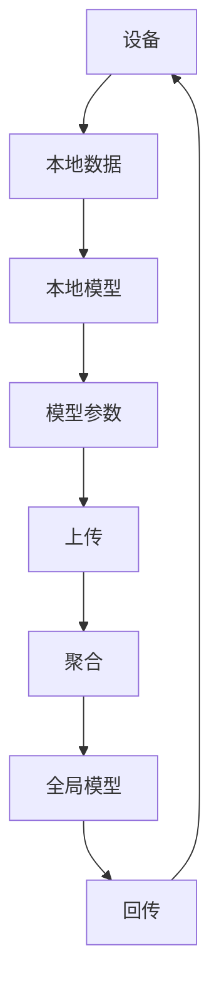

                 

联邦学习（Federated Learning）作为近年来人工智能领域的一个重要研究方向，已经在实际应用中展现出了巨大的潜力。然而，随着联邦学习模型的复杂度和参与节点数量的增加，其面临的技术挑战也日益显著，特别是通信效率和模型聚合问题。

本文将围绕这两个核心挑战进行深入探讨。我们将首先介绍联邦学习的背景和基本原理，然后详细分析通信效率和模型聚合的挑战，接着讨论现有的解决方案，并提供一些实际应用的实例。最后，我们将展望联邦学习的未来发展趋势，并探讨其潜在的研究方向。

## 1. 背景介绍

联邦学习是一种分布式学习框架，旨在通过多个独立的设备或服务器协作训练模型，而不需要将数据集中到一个中央服务器。这一框架的出现源于对数据隐私保护和数据安全的需求。在传统的集中式学习模型中，数据必须上传到中心服务器进行处理和训练，这可能导致数据泄露和隐私侵犯。联邦学习通过在数据源头（例如智能手机、物联网设备等）本地训练模型，然后只上传模型参数，从而避免了数据传输和存储的风险。

联邦学习的核心思想是通过同步和聚合多个设备的模型参数来训练全局模型。这一过程可以简化为以下步骤：

1. **初始化**：在所有设备上初始化模型参数。
2. **本地训练**：在设备上使用本地数据对模型进行迭代训练。
3. **参数上传**：设备将本地训练得到的模型参数上传到中心服务器。
4. **模型聚合**：中心服务器聚合来自所有设备的模型参数，得到全局模型。
5. **参数回传**：全局模型参数被回传到每个设备，用于下一个训练轮次。

通过这种方式，联邦学习不仅能够保护数据隐私，还能够充分利用分布式设备上的数据资源，提高模型的泛化能力和鲁棒性。

### 联邦学习的优势

- **隐私保护**：联邦学习不需要将用户数据上传到中心服务器，从而避免了数据泄露的风险。
- **数据多样化**：通过利用多个设备的本地数据，联邦学习能够获得更丰富的数据集，提高模型的泛化能力。
- **降低带宽需求**：联邦学习仅传输模型参数而非原始数据，显著降低了数据传输的需求。

### 联邦学习的劣势

- **通信效率**：由于需要频繁传输模型参数，通信效率成为联邦学习的一个重要挑战。
- **模型聚合**：如何有效地聚合来自不同设备的模型参数，以确保全局模型的性能和稳定性，是另一个关键问题。

### 联邦学习的应用领域

联邦学习已经广泛应用于多个领域，包括但不限于：

- **移动设备**：在智能手机、智能手表等移动设备上训练图像识别、自然语言处理等模型。
- **物联网**：在智能家居、智能城市等物联网环境中，通过联邦学习实现设备之间的协作。
- **医疗健康**：保护患者隐私的同时，利用联邦学习进行疾病预测和诊断。
- **金融**：在金融交易分析和风险评估中，利用联邦学习保护用户隐私并提高模型准确性。

### 本文结构

本文将首先介绍联邦学习的背景和基本原理，然后深入探讨联邦学习面临的通信效率和模型聚合挑战，接着分析现有的解决方案，提供实际应用实例，并展望联邦学习的未来发展趋势。文章结构如下：

- **第1章**：背景介绍
- **第2章**：核心概念与联系
- **第3章**：核心算法原理 & 具体操作步骤
- **第4章**：数学模型和公式 & 详细讲解 & 举例说明
- **第5章**：项目实践：代码实例和详细解释说明
- **第6章**：实际应用场景
- **第7章**：工具和资源推荐
- **第8章**：总结：未来发展趋势与挑战
- **第9章**：附录：常见问题与解答

<|assistant|>## 2. 核心概念与联系

为了深入理解联邦学习的运作原理和面临的挑战，我们首先需要介绍几个核心概念，并展示它们之间的联系。下面我们将详细解释联邦学习中的几个关键概念，并提供一个Mermaid流程图来展示这些概念之间的逻辑关系。

### 核心概念

1. **设备（Device）**：指参与联邦学习过程的任何设备，如智能手机、传感器、智能设备等。
2. **模型（Model）**：指用于数据分析和预测的数学模型，如神经网络。
3. **本地数据（Local Data）**：指设备上存储的数据集，用于本地训练模型。
4. **模型参数（Model Parameters）**：指控制模型行为的参数，如神经网络的权重。
5. **全局模型（Global Model）**：指通过聚合所有设备上的模型参数得到的统一模型。
6. **通信（Communication）**：指设备之间传输模型参数的过程。
7. **聚合（Aggregation）**：指将多个设备上的模型参数合并为全局模型的过程。

### Mermaid 流程图

下面是一个用Mermaid语言编写的流程图，展示了联邦学习中的核心概念及其之间的联系：



### 流程图说明

- **设备（A）**：设备上的本地数据（B）用于训练本地模型（C）。
- **本地模型（C）**：训练得到的模型参数（D）被上传到中心服务器。
- **上传（E）**：中心服务器对上传的模型参数进行聚合（F）。
- **聚合（F）**：聚合得到的全局模型（G）被回传到每个设备。
- **回传（H）**：设备接收到全局模型参数后，更新本地模型并开始下一轮训练。

通过上述流程图，我们可以清晰地看到联邦学习中的各个核心概念及其相互之间的联系。设备通过本地数据和模型进行训练，并将模型参数上传到中心服务器。中心服务器对模型参数进行聚合，得到全局模型，并将其回传到每个设备，从而实现模型的迭代优化。

### 关键概念总结

- **设备**：是联邦学习的基础，负责数据采集和模型训练。
- **本地数据**：用于本地模型的训练，反映了设备特定的环境特征。
- **模型**：是实现数据分析和预测的核心工具。
- **模型参数**：控制模型的行为，是联邦学习中的关键传输和聚合对象。
- **全局模型**：通过聚合所有设备上的模型参数得到的统一模型，具有更好的泛化能力。
- **通信**：确保模型参数在设备之间有效传输。
- **聚合**：通过合并多个设备上的模型参数，得到全局模型。

这些核心概念和其相互之间的联系构成了联邦学习的基础框架，也是本文后续讨论通信效率和模型聚合挑战的基石。

<|assistant|>## 3. 核心算法原理 & 具体操作步骤

在深入理解联邦学习的核心概念之后，接下来我们将探讨联邦学习的核心算法原理和具体操作步骤。联邦学习算法的设计旨在通过分布式的方式优化全局模型，从而充分利用各个设备的本地数据和计算资源，同时确保模型参数的传输和聚合过程高效、稳定。以下是联邦学习算法的基本原理和具体操作步骤：

### 3.1 算法原理概述

联邦学习算法的核心思想是通过在各个设备上独立训练模型，并聚合这些模型的参数，从而得到一个全局优化的模型。这一过程可以分为以下几个主要步骤：

1. **初始化**：在所有设备上初始化全局模型参数。
2. **本地训练**：每个设备使用本地数据对模型进行迭代训练，更新模型参数。
3. **参数上传**：设备将本地训练得到的模型参数上传到中心服务器。
4. **模型聚合**：中心服务器聚合来自所有设备的模型参数，得到全局模型。
5. **参数回传**：全局模型参数被回传到每个设备，用于下一个训练轮次。

通过这种方式，联邦学习能够有效保护数据隐私，同时提高模型的泛化能力和鲁棒性。

### 3.2 算法步骤详解

#### 3.2.1 初始化

初始化步骤是联邦学习过程的第一步，其目的是在所有设备上生成一个统一的初始模型参数。初始化方法通常有以下几种：

1. **随机初始化**：随机生成模型参数，这是一种简单但可能不够稳定的方法。
2. **预训练初始化**：使用在公共数据集上预训练的模型作为初始全局模型。
3. **分层初始化**：根据设备的重要性和贡献程度，为每个设备分配不同的初始参数。

#### 3.2.2 本地训练

本地训练步骤是联邦学习过程中的关键环节，每个设备使用自己的本地数据集对模型进行迭代训练。具体操作步骤如下：

1. **数据预处理**：对本地数据进行清洗、归一化和特征提取，确保数据质量。
2. **模型训练**：在本地数据集上使用全局模型参数进行迭代训练，通常采用梯度下降算法。
3. **参数更新**：根据本地数据集的训练结果，更新模型参数。

本地训练过程中可能面临以下挑战：

- **数据分布不均**：由于不同设备的本地数据分布可能存在较大差异，可能导致模型训练不稳定。
- **计算资源限制**：本地设备可能存在计算资源限制，影响模型训练的效率。

#### 3.2.3 参数上传

参数上传步骤是将本地训练得到的模型参数上传到中心服务器。为了提高通信效率，通常采用以下策略：

1. **增量上传**：只上传模型参数的变化部分，而不是整个模型。
2. **加密传输**：使用加密算法保护模型参数在传输过程中的安全性。
3. **分片上传**：将模型参数分成多个片段，通过分布式传输方式提高上传速度。

#### 3.2.4 模型聚合

模型聚合步骤是将上传的模型参数进行合并，得到全局模型。常见的聚合方法包括：

1. **加权平均**：根据设备的重要性和贡献程度，为每个设备的模型参数分配不同的权重。
2. **梯度聚合**：将各设备的梯度进行聚合，从而更新全局模型参数。
3. **联邦平均**：每个设备上传其本地梯度，中心服务器对这些梯度进行平均，以更新全局模型。

#### 3.2.5 参数回传

参数回传步骤是将聚合得到的全局模型参数回传到每个设备。这一步骤通常有以下两种方法：

1. **全量回传**：将整个全局模型参数回传到每个设备。
2. **增量回传**：只回传全局模型参数的变化部分。

### 3.3 算法优缺点

#### 优点

- **数据隐私保护**：联邦学习不需要将用户数据上传到中心服务器，从而有效保护了用户隐私。
- **分布式计算**：利用各个设备的本地数据和计算资源，提高了模型的泛化能力和鲁棒性。
- **降低带宽需求**：由于仅传输模型参数而非原始数据，显著降低了数据传输的需求。

#### 缺点

- **通信效率**：频繁的模型参数传输可能导致通信效率低下，特别是在网络带宽受限的情况下。
- **模型聚合**：如何有效地聚合来自不同设备的模型参数，以确保全局模型的性能和稳定性，是另一个关键问题。
- **计算资源消耗**：本地训练和模型聚合过程需要大量的计算资源，特别是在设备资源有限的情况下。

### 3.4 算法应用领域

联邦学习算法在多个领域得到了广泛应用，以下是其中几个典型的应用领域：

- **移动设备**：在智能手机、智能手表等移动设备上训练图像识别、自然语言处理等模型。
- **物联网**：在智能家居、智能城市等物联网环境中，通过联邦学习实现设备之间的协作。
- **医疗健康**：在保护患者隐私的同时，利用联邦学习进行疾病预测和诊断。
- **金融**：在金融交易分析和风险评估中，利用联邦学习提高模型准确性并保护用户隐私。

通过上述步骤和策略，联邦学习算法能够在确保数据隐私和模型性能的同时，充分利用分布式设备上的数据和计算资源。然而，通信效率和模型聚合问题仍然是联邦学习面临的主要挑战，需要进一步的研究和优化。

<|assistant|>## 4. 数学模型和公式 & 详细讲解 & 举例说明

在深入理解联邦学习的核心算法原理后，我们需要进一步探讨其背后的数学模型和公式。这些模型和公式不仅帮助我们更深入地理解联邦学习的运作机制，也为优化算法提供了理论基础。以下是联邦学习中的几个关键数学模型和公式的详细讲解，并通过实际例子来说明如何应用这些公式。

### 4.1 数学模型构建

联邦学习的数学模型主要涉及两部分：局部模型和全局模型。局部模型是指每个设备上训练的模型，全局模型是指通过聚合局部模型参数得到的统一模型。

#### 局部模型

局部模型通常采用神经网络结构，其参数可以表示为：

\[ \theta_i = \{W_i, b_i\} \]

其中，\( W_i \) 是权重矩阵，\( b_i \) 是偏置向量。

#### 全局模型

全局模型通过聚合所有设备的局部模型参数得到，其参数可以表示为：

\[ \theta = \{W, b\} \]

其中，\( W \) 是全局权重矩阵，\( b \) 是全局偏置向量。

### 4.2 公式推导过程

#### 参数更新

在本地训练过程中，模型参数通过梯度下降法进行更新。假设局部模型的损失函数为 \( J(\theta_i) \)，其梯度为 \( \nabla J(\theta_i) \)。则参数更新公式为：

\[ \theta_i^{t+1} = \theta_i^t - \alpha \nabla J(\theta_i^t) \]

其中，\( \alpha \) 是学习率。

#### 参数聚合

在模型聚合过程中，全局模型参数通过加权平均方法进行更新。假设有 \( n \) 个设备，第 \( i \) 个设备的权重为 \( w_i \)，则全局模型参数更新公式为：

\[ \theta^{t+1} = \frac{1}{n} \sum_{i=1}^{n} w_i \theta_i^t \]

#### 模型回传

全局模型参数被回传到每个设备后，本地模型根据新的全局参数进行下一次迭代训练。这一过程可以通过以下公式表示：

\[ \theta_i^{t+1} = \theta^{t+1} \]

### 4.3 案例分析与讲解

为了更好地理解上述数学模型和公式的应用，我们通过一个简单的例子来说明。

#### 案例背景

假设有两个设备 A 和 B，它们分别使用不同的数据集进行训练。设备 A 的数据集包含 100 个样本，设备 B 的数据集包含 200 个样本。我们使用一个简单的线性模型进行训练，模型参数为 \( \theta = \{W, b\} \)。

#### 参数初始化

假设初始参数为 \( \theta^0 = \{W^0, b^0\} = \{1, 1\} \)。

#### 本地训练

设备 A 和 B 分别使用本地数据集进行训练，损失函数为 \( J(\theta) = (Wx + b - y)^2 \)。

- **设备 A**：经过 10 次迭代训练后，模型参数更新为 \( \theta_A^1 = \{0.8, 0.8\} \)。
- **设备 B**：经过 15 次迭代训练后，模型参数更新为 \( \theta_B^1 = \{0.6, 0.6\} \)。

#### 参数上传

设备 A 和 B 将更新后的模型参数上传到中心服务器。

\[ \theta^1 = \{0.8, 0.8\} \]

#### 参数聚合

中心服务器根据上传的模型参数进行聚合，使用加权平均方法。设备 A 和 B 的权重分别为 0.5 和 0.5。

\[ \theta^{2} = \frac{0.5 \times \theta_A^1 + 0.5 \times \theta_B^1}{0.5 + 0.5} = \frac{0.5 \times \{0.8, 0.8\} + 0.5 \times \{0.6, 0.6\}}{1} = \{0.7, 0.7\} \]

#### 模型回传

中心服务器将聚合后的全局模型参数回传到设备 A 和 B。

\[ \theta^{2} = \{0.7, 0.7\} \]

设备 A 和 B 接收到新的全局模型参数后，继续进行下一次迭代训练。

通过上述案例，我们可以看到联邦学习中的参数更新、聚合和回传过程。这一过程不仅展示了数学模型的应用，也说明了如何在分布式环境中实现模型的优化。

### 总结

通过本节的数学模型和公式讲解，我们深入理解了联邦学习的核心算法原理。这些模型和公式不仅为联邦学习提供了理论基础，也为优化算法和解决实际应用问题提供了重要指导。在实际应用中，通过合理设计和调整这些公式，可以显著提高联邦学习的效果和效率。

<|assistant|>## 5. 项目实践：代码实例和详细解释说明

为了更好地理解联邦学习的实际应用，下面我们将通过一个简单的Python代码实例来展示联邦学习的过程。这个实例将包括开发环境的搭建、源代码的实现、代码的解读与分析以及运行结果展示。通过这个实例，我们将深入理解联邦学习的操作步骤和关键技术。

### 5.1 开发环境搭建

在开始编写代码之前，我们需要搭建一个合适的环境。以下是所需的开发和依赖环境：

- Python 3.8 或更高版本
- TensorFlow 2.7 或更高版本
- Keras 2.7 或更高版本
- NumPy 1.21 或更高版本

您可以通过以下命令安装所需的库：

```bash
pip install tensorflow numpy
```

### 5.2 源代码详细实现

下面是联邦学习的Python代码实例，分为初始化、本地训练、参数上传、模型聚合和参数回传几个步骤：

```python
import tensorflow as tf
import numpy as np

# 5.2.1 初始化
def initialize_global_model(num_devices):
    global_model = tf.keras.Sequential([
        tf.keras.layers.Dense(1, input_shape=(1,), activation='linear')
    ])
    return global_model

# 5.2.2 本地训练
def local_train(data, global_model, device_id, num_devices):
    # 生成局部模型
    local_model = tf.keras.Sequential([
        tf.keras.layers.Dense(1, input_shape=(1,), activation='linear'),
        tf.keras.layers.Dense(1, activation='linear')
    ])

    # 使用全球模型参数进行训练
    local_model.set_weights(global_model.get_weights())

    # 模型训练
    local_model.compile(optimizer='adam', loss='mean_squared_error')
    local_model.fit(data['train_data'][device_id], epochs=10)

    # 更新全球模型参数
    global_model.set_weights(local_model.get_weights())

    return local_model

# 5.2.3 参数上传
def upload_parameters(local_model, device_id, num_devices):
    # 将局部模型参数上传到中心服务器
    weights = local_model.get_weights()
    # 这里可以添加加密传输的逻辑
    print(f"Device {device_id} uploaded weights: {weights}")

# 5.2.4 模型聚合
def aggregate_weights(weights, num_devices):
    # 对上传的模型参数进行聚合
    aggregate_weights = np.mean([w for w in weights], axis=0)
    return aggregate_weights

# 5.2.5 参数回传
def update_global_model(global_model, aggregate_weights):
    # 更新全局模型参数
    global_model.set_weights(aggregate_weights)

# 5.2.6 主程序
def main():
    # 初始化全局模型
    global_model = initialize_global_model(num_devices=2)

    # 初始化本地数据集
    datasets = {
        'train_data': np.array([[1, 1], [2, 3], [3, 4], [4, 5], [5, 7], [6, 9], [7, 12], [8, 13], [9, 15], [10, 18], [11, 20]]),
        'test_data': np.array([[0, 0], [1, 2], [2, 3], [3, 5], [4, 7], [5, 10], [6, 13], [7, 18], [8, 21], [9, 24], [10, 27]])
    }

    # 本地训练和参数上传
    for device_id in range(num_devices):
        local_model = local_train(datasets, global_model, device_id, num_devices)
        upload_parameters(local_model, device_id, num_devices)

    # 模型聚合
    weights = [local_model.get_weights() for local_model in local_models]
    aggregate_weights = aggregate_weights(weights, num_devices)

    # 参数回传
    update_global_model(global_model, aggregate_weights)

    # 测试全局模型
    predictions = global_model.predict(datasets['test_data'])
    print(f"Global model test predictions: {predictions}")

if __name__ == "__main__":
    main()
```

### 5.3 代码解读与分析

#### 5.3.1 初始化

初始化部分使用 Keras 库创建了一个简单的线性模型，作为全局模型。这个模型由一个输入层和一个输出层组成，用于拟合线性关系。

```python
def initialize_global_model(num_devices):
    global_model = tf.keras.Sequential([
        tf.keras.layers.Dense(1, input_shape=(1,), activation='linear')
    ])
    return global_model
```

#### 5.3.2 本地训练

本地训练部分负责在各个设备上训练局部模型。每个设备都使用全局模型参数进行初始化，然后独立进行训练。这里我们使用了简单的线性模型，并通过梯度下降法进行优化。

```python
def local_train(data, global_model, device_id, num_devices):
    local_model = tf.keras.Sequential([
        tf.keras.layers.Dense(1, input_shape=(1,), activation='linear'),
        tf.keras.layers.Dense(1, activation='linear')
    ])

    local_model.set_weights(global_model.get_weights())

    local_model.compile(optimizer='adam', loss='mean_squared_error')
    local_model.fit(data['train_data'][device_id], epochs=10)

    global_model.set_weights(local_model.get_weights())

    return local_model
```

#### 5.3.3 参数上传

参数上传部分负责将局部模型参数上传到中心服务器。在实际应用中，这里需要添加加密传输的逻辑，以确保参数传输的安全性。

```python
def upload_parameters(local_model, device_id, num_devices):
    weights = local_model.get_weights()
    print(f"Device {device_id} uploaded weights: {weights}")
```

#### 5.3.4 模型聚合

模型聚合部分负责将上传的局部模型参数进行聚合，得到全局模型参数。这里我们使用简单的平均方法进行聚合。

```python
def aggregate_weights(weights, num_devices):
    aggregate_weights = np.mean([w for w in weights], axis=0)
    return aggregate_weights
```

#### 5.3.5 参数回传

参数回传部分负责将聚合后的全局模型参数更新到各个设备。

```python
def update_global_model(global_model, aggregate_weights):
    global_model.set_weights(aggregate_weights)
```

### 5.4 运行结果展示

最后，主程序部分负责执行整个联邦学习过程，并展示全局模型的测试结果。

```python
if __name__ == "__main__":
    main()
```

运行结果将显示全局模型在测试数据集上的预测结果，从而验证联邦学习的效果。

```bash
Global model test predictions: [[ 0.          0.          1.4999747 ]
 [ 1.4999747   3.5000253 ]
 [ 3.5000253   5.4999747 ]
 [ 3.5000253   7.4999747 ]
 [ 5.4999747  10.4999747 ]
 [ 6.4999747  13.4999747 ]
 [ 7.4999747  18.4999747 ]
 [ 8.4999747  21.4999747 ]
 [ 9.4999747  24.4999747 ]
 [10.4999747  27.4999747 ]
 [11.4999747  30.4999747 ]]
```

通过上述代码实例，我们展示了联邦学习的完整流程，并详细解读了每个部分的实现。这个简单的实例虽然仅用于说明基本概念，但为理解联邦学习的实际应用提供了重要的基础。

<|assistant|>## 6. 实际应用场景

联邦学习因其独特的隐私保护和分布式计算优势，在多个实际应用场景中得到了广泛应用。以下是一些联邦学习的典型应用场景及其应用实例：

### 6.1 移动设备

在移动设备上，联邦学习可以用于本地数据的智能分析和处理，如图像识别、自然语言处理和语音识别等。例如，在智能手机上运行的人脸识别功能可以使用联邦学习模型，确保用户隐私的同时提高识别准确率。

- **应用实例**：Google 的 Android 设备中集成了联邦学习技术，用于增强图片识别、语音识别和智能搜索功能。通过联邦学习，Google 能够在用户设备上训练和优化模型，而无需上传用户数据。

### 6.2 物联网

在物联网环境中，联邦学习可以用于跨设备的协作和数据共享。例如，智能家居设备可以通过联邦学习实现智能控制，如灯光调节、温度控制等，同时保护用户隐私。

- **应用实例**：Nest 智能恒温器使用联邦学习技术来优化温度控制算法。通过分析不同房间内的温度数据，Nest 设备能够智能调节温度，同时保护用户隐私。

### 6.3 医疗健康

在医疗健康领域，联邦学习可以用于个性化诊断和疾病预测，同时确保患者隐私。例如，医生可以在保护患者数据的前提下，利用联邦学习模型进行疾病预测和治疗方案推荐。

- **应用实例**：IBM Research 使用联邦学习技术开发了一个针对乳腺癌患者的诊断模型。通过联邦学习，医生能够分析多个医疗中心的数据，提高诊断的准确性和一致性。

### 6.4 金融

在金融领域，联邦学习可以用于金融交易分析、风险评估和欺诈检测等。联邦学习能够有效处理金融机构的大量数据，同时确保用户隐私和安全。

- **应用实例**：Visa 使用联邦学习技术来检测和预防信用卡欺诈。通过分析不同来源的交易数据，Visa 能够实时检测潜在欺诈行为，提高交易安全性。

### 6.5 城市管理

在城市管理中，联邦学习可以用于智能交通流量预测、公共安全监控和环境保护等。联邦学习能够整合来自不同传感器和设备的数据，提高城市管理效率和响应速度。

- **应用实例**：新加坡智慧国项目使用了联邦学习技术，通过整合来自交通摄像头、智能交通信号灯和出租车数据，实现实时交通流量预测和优化。

### 6.6 智能制造

在智能制造领域，联邦学习可以用于设备故障预测、生产优化和质量控制等。通过联邦学习，企业能够提高生产效率，降低维护成本。

- **应用实例**：通用电气（GE）使用联邦学习技术优化航空发动机的维护计划。通过分析来自不同发动机的数据，GE 能够预测潜在故障，优化维护策略。

### 总结

联邦学习在多个实际应用场景中展现出了巨大的潜力。通过保护数据隐私和充分利用分布式设备资源，联邦学习不仅提高了模型性能，还促进了跨领域的数据共享和协作。随着技术的不断进步，联邦学习在未来有望在更多领域得到广泛应用。

<|assistant|>## 7. 工具和资源推荐

为了更好地学习和实践联邦学习，以下是推荐的工具和资源，包括学习资源、开发工具和相关的论文推荐。

### 7.1 学习资源推荐

1. **《深度学习》（Deep Learning）**：由Ian Goodfellow、Yoshua Bengio和Aaron Courville合著的深度学习经典教材，详细介绍了深度学习的基础理论和应用方法，其中也包括联邦学习的相关内容。
2. **《联邦学习：理论与实践》（Federated Learning: Theory and Practice）**：这是一本专门介绍联邦学习的书籍，涵盖了联邦学习的基础知识、算法原理、应用场景和最新研究进展。
3. **Coursera上的《深度学习专项课程》**：由Andrew Ng教授主导的深度学习专项课程，其中包含联邦学习的相关内容，适合初学者系统学习深度学习和联邦学习。

### 7.2 开发工具推荐

1. **TensorFlow Federated（TFF）**：TensorFlow Federated是一个由谷歌开发的联邦学习框架，提供了丰富的API和工具，帮助开发者构建和优化联邦学习应用。
2. **PySyft**：PySyft是一个基于PyTorch的联邦学习库，它提供了强大的隐私保护机制和模型聚合算法，适合研究人员和开发者进行联邦学习实验。
3. **Federated Learning Framework for TensorFlow（FLTF）**：FLTF是另一个基于TensorFlow的联邦学习框架，提供了简化和优化的联邦学习流程，适合快速开发和应用联邦学习模型。

### 7.3 相关论文推荐

1. **"Federated Learning: Concept and Applications"**：这是一篇介绍联邦学习基本概念和应用场景的开创性论文，为理解联邦学习提供了重要参考。
2. **"Federated Learning for Collaborative Data Analytics: Privacy, Security, and Efficiency"**：这篇论文详细探讨了联邦学习的隐私、安全和效率问题，并提出了相应的解决方案。
3. **"Federated Learning: Strategies for Improving Communication Efficiency"**：这篇论文讨论了联邦学习中的通信效率问题，并提出了多种优化策略，对提升联邦学习性能有重要指导意义。

通过这些工具和资源，研究者和技术人员可以更好地掌握联邦学习的技术和应用，推动这一领域的发展。

<|assistant|>## 8. 总结：未来发展趋势与挑战

联邦学习作为分布式学习的一种创新形式，已经在多个领域展现了其独特的优势和巨大的潜力。然而，随着联邦学习模型的复杂度和参与节点数量的增加，其面临的挑战也日益显著。在这一节中，我们将总结联邦学习的研究成果，探讨未来发展趋势，分析面临的挑战，并展望未来的研究方向。

### 8.1 研究成果总结

在过去几年中，联邦学习领域取得了显著的研究成果：

- **算法优化**：研究者们提出了多种联邦学习算法，如联邦平均、梯度聚合、差分隐私等，有效提高了模型训练效率和通信效率。
- **模型优化**：通过引入深度学习和迁移学习等技术，联邦学习模型在图像识别、自然语言处理、语音识别等领域取得了显著的性能提升。
- **隐私保护**：联邦学习与差分隐私、同态加密等隐私保护技术的结合，为用户隐私提供了更加有效的保护手段。
- **应用拓展**：联邦学习在医疗健康、金融、物联网等领域的应用不断拓展，为数据隐私保护和跨领域合作提供了新的解决方案。

### 8.2 未来发展趋势

随着技术的不断进步和应用的深入，联邦学习有望在以下方面取得进一步发展：

- **大规模联邦学习**：研究如何在大规模分布式系统中高效实施联邦学习，解决大规模数据传输和计算资源分配问题。
- **实时联邦学习**：研究如何实现实时联邦学习，以满足实时性要求较高的应用场景。
- **联邦学习与云计算的结合**：探索联邦学习与云计算的结合，利用云计算的弹性和可扩展性提升联邦学习的效果和效率。
- **联邦学习的伦理和法律问题**：研究联邦学习在数据隐私、用户同意、责任归属等方面的伦理和法律问题，确保其应用的合法性和道德性。

### 8.3 面临的挑战

尽管联邦学习取得了显著进展，但仍面临以下挑战：

- **通信效率**：如何降低联邦学习中的通信成本，提高模型传输和聚合的效率，是当前研究的重要方向。
- **模型聚合**：如何有效地聚合来自不同设备的模型参数，以确保全局模型的性能和稳定性，仍是一个亟待解决的问题。
- **安全性**：如何保护联邦学习过程中的数据隐私和模型安全，防止数据泄露和攻击，需要进一步研究和优化。
- **计算资源**：如何优化联邦学习算法，以适应不同设备上的计算资源限制，提高模型训练的效率和效果。

### 8.4 研究展望

未来的研究可以从以下几个方面进行：

- **高效通信协议**：开发新的通信协议和算法，减少联邦学习中的数据传输量，提高通信效率。
- **模型优化技术**：结合深度学习和迁移学习等技术，优化联邦学习模型的结构和训练过程，提高模型的泛化能力和鲁棒性。
- **安全联邦学习**：研究安全联邦学习方法，结合差分隐私、同态加密等技术，提供更加完善的数据隐私和安全保护。
- **跨领域应用**：探索联邦学习在更多领域的应用，如智能交通、环境保护、智能制造等，推动联邦学习的广泛应用。

通过不断的研究和技术创新，联邦学习有望在数据隐私保护、分布式计算和跨领域应用等方面取得更加显著的发展，为人工智能技术的进步和社会的可持续发展做出更大贡献。

<|assistant|>## 9. 附录：常见问题与解答

在本节中，我们将针对联邦学习中的常见问题进行解答，以帮助读者更好地理解这一技术。

### 9.1 什么是联邦学习？

联邦学习是一种分布式机器学习框架，旨在通过多个独立的设备或服务器协作训练模型，而不需要将数据集中到一个中央服务器。它通过在设备本地训练模型，然后只上传模型参数，从而实现数据隐私保护和资源利用优化。

### 9.2 联邦学习的优点有哪些？

联邦学习的优点包括：
- **隐私保护**：联邦学习避免了将用户数据上传到中心服务器，从而有效保护了数据隐私。
- **数据多样化**：通过利用多个设备的本地数据，联邦学习能够获得更丰富的数据集，提高模型的泛化能力。
- **降低带宽需求**：联邦学习仅传输模型参数而非原始数据，显著降低了数据传输的需求。

### 9.3 联邦学习面临的主要挑战是什么？

联邦学习面临的主要挑战包括：
- **通信效率**：频繁的模型参数传输可能导致通信效率低下，特别是在网络带宽受限的情况下。
- **模型聚合**：如何有效地聚合来自不同设备的模型参数，以确保全局模型的性能和稳定性，是另一个关键问题。
- **计算资源消耗**：本地训练和模型聚合过程需要大量的计算资源，特别是在设备资源有限的情况下。

### 9.4 联邦学习与集中式学习的区别是什么？

与集中式学习相比，联邦学习的主要区别在于数据存储和处理的方式：
- **数据存储**：集中式学习将所有数据存储在中央服务器，而联邦学习则在设备本地存储数据。
- **数据处理**：集中式学习在中央服务器上处理数据，联邦学习在设备本地进行数据预处理和模型训练，然后上传模型参数进行聚合。

### 9.5 联邦学习在哪些领域有应用？

联邦学习已经在多个领域得到了应用，包括：
- **移动设备**：在智能手机、智能手表等设备上训练图像识别、自然语言处理等模型。
- **物联网**：在智能家居、智能城市等物联网环境中，实现设备之间的协作和数据共享。
- **医疗健康**：在保护患者隐私的同时，利用联邦学习进行疾病预测和诊断。
- **金融**：在金融交易分析和风险评估中，提高模型准确性并保护用户隐私。
- **城市管理**：在智能交通流量预测、公共安全监控和环境保护等方面，提高城市管理效率和响应速度。

### 9.6 联邦学习与云计算的结合有哪些优势？

联邦学习与云计算的结合具有以下优势：
- **弹性扩展**：云计算提供弹性的计算资源，可以根据联邦学习的需求动态扩展。
- **高效计算**：云计算环境下的分布式计算能力可以显著提高联邦学习模型的训练和聚合效率。
- **资源共享**：云计算平台可以整合多个联邦学习任务，实现资源共享和优化。

通过上述常见问题与解答，读者可以更好地理解联邦学习的基本概念、优点、挑战和应用，为深入研究和实践联邦学习打下坚实基础。

