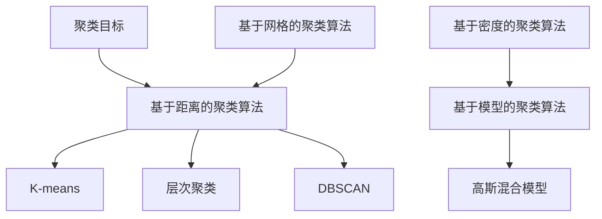

                 

关键词：聚类分析、K-means算法、层次聚类、DBSCAN、高斯混合模型、Python实现、数据可视化、算法优缺点、应用领域、数学模型

## 摘要

聚类分析是一种无监督学习技术，用于将相似的数据点分组在一起，形成不同的簇。本文将详细介绍聚类分析的核心概念、算法原理以及在实际应用中的操作步骤。通过代码实例，我们将深入理解K-means、层次聚类、DBSCAN和高斯混合模型等常见的聚类算法。本文旨在帮助读者全面掌握聚类分析的理论和实践，并为其在数据挖掘、机器学习和商业分析等领域的应用提供指导。

## 1. 背景介绍

在数据密集型时代，如何从大量数据中提取有价值的信息成为了一项重要的任务。聚类分析作为一种无监督学习方法，无需事先标记数据，就能够发现数据中的内在结构和模式，从而为数据分析和决策提供有力支持。聚类分析的应用领域非常广泛，包括市场细分、社交网络分析、生物信息学、图像处理等。

聚类分析的目标是将一组数据点分为若干个簇，使得同一簇中的数据点彼此相似，而不同簇之间的数据点差异性较大。这种分组方式有助于数据可视化、模式识别、异常检测等任务。

本文将首先介绍聚类分析的核心概念，包括聚类目标、聚类算法类型和评价指标。然后，我们将深入探讨K-means、层次聚类、DBSCAN和高斯混合模型等常见聚类算法的原理和实现，并通过Python代码实例进行详细讲解。最后，我们将分析聚类算法的优缺点，讨论其在实际应用中的适用场景，并展望未来的发展趋势。

### 1.1 聚类分析的定义

聚类分析（Cluster Analysis）是一种无监督学习技术，用于将一组数据点划分为多个簇，使得同一簇内的数据点彼此相似，而不同簇之间的数据点差异性较大。具体来说，聚类分析的目的是通过某种距离度量，将数据点划分为几个不同的簇，使得簇内距离较近，簇间距离较远。

聚类分析可以应用于多个领域，如：

- **市场细分**：根据消费者的购买行为和偏好，将消费者划分为不同的群体，以便制定有针对性的营销策略。
- **社交网络分析**：通过分析用户之间的社交关系，识别社交网络中的不同社区和群体。
- **生物信息学**：在基因组学、蛋白质组学等领域中，聚类分析有助于发现不同样本之间的相似性和差异性。
- **图像处理**：通过将图像中的像素点进行聚类，可以实现图像分割、特征提取等任务。
- **异常检测**：在金融、安防等领域中，聚类分析可用于检测异常行为或异常数据。

### 1.2 聚类分析的应用场景

聚类分析在实际应用中具有广泛的应用场景，以下是一些典型的应用例子：

- **市场细分**：企业在进行市场分析时，可以使用聚类分析将潜在客户划分为不同的群体，以便针对不同的客户群体制定个性化的营销策略。
- **社交网络分析**：通过分析用户之间的社交关系，聚类分析可以帮助识别社交网络中的不同社区和群体，从而更好地理解社交网络的动态特征。
- **生物信息学**：在基因组学和蛋白质组学研究中，聚类分析可以用于识别不同样本之间的相似性和差异性，从而帮助研究人员进行疾病诊断和药物筛选。
- **图像处理**：在图像分割、特征提取等领域中，聚类分析可以实现图像的自动分类和标注。
- **异常检测**：在金融、安防等领域中，聚类分析可以帮助识别异常行为或异常数据，从而提高系统的安全性和可靠性。

### 1.3 聚类分析的发展历史

聚类分析作为一种基本的数据挖掘技术，其发展历史可以追溯到20世纪50年代。以下是聚类分析的一些重要发展阶段：

- **1957年**：MacQueen提出了K-means算法，这是最著名的聚类算法之一。
- **1960年代**：层次聚类（Hierarchical Clustering）算法得到发展，主要包括凝聚层次聚类和分裂层次聚类。
- **1970年代**：DBSCAN（Density-Based Spatial Clustering of Applications with Noise）算法被提出，它是一种基于密度的聚类算法，能够有效地处理噪声和异常点。
- **1980年代**：高斯混合模型（Gaussian Mixture Model）成为了一种流行的概率聚类方法，它通过概率密度函数来描述数据分布。
- **21世纪初**：随着大数据和机器学习的兴起，聚类分析得到了进一步的发展，出现了一些基于深度学习的聚类算法。

## 2. 核心概念与联系

在深入探讨聚类算法之前，我们需要了解一些核心概念，包括聚类目标、聚类算法类型和聚类评价指标。

### 2.1 聚类目标

聚类分析的目标是将一组数据点划分为多个簇，使得同一簇内的数据点彼此相似，而不同簇之间的数据点差异性较大。具体来说，聚类目标可以概括为以下几点：

- **最大化簇内相似度**：同一簇内的数据点应该尽可能接近，以便更好地保持数据的局部结构。
- **最小化簇间差异性**：不同簇之间的数据点应该尽可能远离，以便更好地区分不同的簇。
- **最小化噪声干扰**：聚类结果应该尽可能排除噪声和异常点的影响。

### 2.2 聚类算法类型

聚类算法可以根据不同的分类标准进行分类，以下是几种常见的聚类算法类型：

- **基于距离的聚类算法**：这类算法通过计算数据点之间的距离来划分簇。常见的算法包括K-means、层次聚类和DBSCAN。
- **基于密度的聚类算法**：这类算法通过识别数据点的高密度区域来划分簇。DBSCAN是典型的基于密度的聚类算法。
- **基于模型的聚类算法**：这类算法通过构建概率模型来描述数据分布，然后根据模型参数进行聚类。高斯混合模型是典型的基于模型的聚类算法。
- **基于网格的聚类算法**：这类算法将空间划分为网格单元，然后根据网格单元的密度进行聚类。

### 2.3 聚类评价指标

聚类评价指标用于衡量聚类结果的质量，以下是几种常见的聚类评价指标：

- **内聚度（Cohesion）**：表示簇内数据点之间的相似度，内聚度越高，说明聚类效果越好。
- **分离度（Separation）**：表示不同簇之间的差异性，分离度越高，说明聚类效果越好。
- **完整性（Completeness）**：表示簇内数据点是否都属于同一个簇，完整性越高，说明聚类效果越好。
- **V-measure**：综合考虑内聚度和分离度，V-measure介于0和1之间，值越高，说明聚类效果越好。

### 2.4 Mermaid流程图

下面是一个Mermaid流程图，展示了聚类分析的核心概念和算法类型的联系。



## 3. 核心算法原理 & 具体操作步骤

### 3.1 K-means算法原理

K-means算法是一种基于距离的聚类算法，其目标是将数据点划分为K个簇，使得每个数据点与其分配的簇中心之间的距离最小。K-means算法的基本步骤如下：

1. **初始化**：随机选择K个数据点作为初始簇中心。
2. **分配数据点**：计算每个数据点与簇中心的距离，将其分配到距离最近的簇。
3. **更新簇中心**：重新计算每个簇的新簇中心，新簇中心是当前簇中所有数据点的平均值。
4. **迭代**：重复步骤2和步骤3，直到满足停止条件，如簇中心不再发生变化或达到最大迭代次数。

### 3.2 K-means算法步骤详解

#### 3.2.1 初始化

初始化簇中心是K-means算法的关键步骤，常用的方法包括：

- **随机初始化**：随机选择K个数据点作为初始簇中心。
- **K-means++初始化**：基于当前簇中心，选择下一个簇中心时，考虑与已有簇中心的距离，使得初始化的簇中心更加分散。

#### 3.2.2 数据点分配

数据点分配的过程如下：

1. 计算每个数据点与簇中心的距离。
2. 将每个数据点分配到距离最近的簇。

距离计算常用的方法是欧氏距离（Euclidean Distance），公式如下：

$$
d(p, q) = \sqrt{\sum_{i=1}^{n} (p_i - q_i)^2}
$$

其中，$p$和$q$分别是两个数据点，$n$是数据点的维度。

#### 3.2.3 簇中心更新

簇中心更新的过程如下：

1. 计算每个簇中所有数据点的平均值。
2. 将计算得到的平均值作为新的簇中心。

#### 3.2.4 迭代终止条件

K-means算法的迭代终止条件通常有：

- 簇中心的变化小于某个阈值。
- 达到最大迭代次数。

### 3.3 K-means算法优缺点

#### 优点

- **计算简单**：K-means算法的原理简单，易于实现。
- **运行速度快**：对于大规模数据集，K-means算法具有较高的运行速度。
- **易于扩展**：K-means算法可以应用于高维数据，并可以很容易地扩展到多维空间。

#### 缺点

- **敏感度较高**：K-means算法对初始簇中心的选择敏感，可能导致局部最优解。
- **不适合非球形簇**：K-means算法假设簇形状为球形，对于非球形簇，聚类效果较差。
- **无法处理异常点**：K-means算法容易受到异常点的影响，导致簇结构不合理。

### 3.4 K-means算法应用领域

K-means算法在多个领域有着广泛的应用，以下是一些典型的应用场景：

- **市场细分**：在市场营销中，K-means算法可以帮助企业将潜在客户划分为不同的群体，从而制定有针对性的营销策略。
- **图像分割**：在计算机视觉中，K-means算法可以用于图像分割，将图像中的像素点划分为不同的区域。
- **文本分类**：在自然语言处理中，K-means算法可以用于文本分类，将文本数据划分为不同的主题。
- **社交网络分析**：在社交网络分析中，K-means算法可以用于识别社交网络中的不同社区和群体。

## 4. 数学模型和公式 & 详细讲解 & 举例说明

### 4.1 数学模型构建

在K-means算法中，我们使用一个数学模型来描述聚类过程。该模型包括两部分：数据模型和目标函数。

#### 数据模型

假设我们有一组数据点$P = \{p_1, p_2, ..., p_n\}$，每个数据点$p_i$是一个多维向量，表示为$p_i = (p_{i1}, p_{i2}, ..., p_{id})$，其中$d$是数据点的维度。我们用$X$表示数据集，即$X = \{p_1, p_2, ..., p_n\}$。

#### 目标函数

K-means算法的目标是找到K个簇中心$c_1, c_2, ..., c_K$，使得目标函数$J$最小化。目标函数通常采用平方误差准则，公式如下：

$$
J = \sum_{i=1}^{n} \sum_{j=1}^{K} w_{ij} (p_i - c_j)^2
$$

其中，$w_{ij}$是权重系数，表示数据点$p_i$属于簇$c_j$的概率。通常，$w_{ij}$可以通过以下公式计算：

$$
w_{ij} = \begin{cases}
1 & \text{如果 } p_i \in c_j \\
0 & \text{否则}
\end{cases}
$$

#### 簇中心更新规则

在K-means算法中，簇中心$c_j$的更新规则如下：

$$
c_j = \frac{1}{N_j} \sum_{i=1}^{n} p_i
$$

其中，$N_j$是簇$c_j$中的数据点个数。

### 4.2 公式推导过程

在K-means算法中，目标函数$J$的推导过程如下：

首先，我们将数据点$p_i$和簇中心$c_j$之间的距离表示为欧氏距离：

$$
d(p_i, c_j) = \sqrt{\sum_{k=1}^{d} (p_{ik} - c_{jk})^2}
$$

然后，我们可以将目标函数$J$表示为：

$$
J = \sum_{i=1}^{n} \sum_{j=1}^{K} w_{ij} d(p_i, c_j)^2
$$

接下来，我们考虑如何最小化$J$。由于$w_{ij}$是权重系数，因此我们可以将$w_{ij}$看作是约束条件。为了最小化$J$，我们需要找到一组簇中心$c_1, c_2, ..., c_K$，使得$J$最小。

根据最小二乘法，我们可以将$J$表示为：

$$
J = \sum_{i=1}^{n} \sum_{j=1}^{K} w_{ij} (p_i - c_j)^2
$$

为了最小化$J$，我们需要对$c_1, c_2, ..., c_K$求导，并令导数为0。具体来说，我们可以对$c_j$求导，得到：

$$
\frac{\partial J}{\partial c_j} = \sum_{i=1}^{n} w_{ij} (p_i - c_j) = 0
$$

由于$w_{ij}$是权重系数，因此我们可以将上式改写为：

$$
\sum_{i=1}^{n} p_i = K \cdot c_j
$$

这意味着簇中心$c_j$是当前簇中所有数据点的平均值。因此，我们可以将簇中心更新规则表示为：

$$
c_j = \frac{1}{N_j} \sum_{i=1}^{n} p_i
$$

其中，$N_j$是簇$c_j$中的数据点个数。

### 4.3 案例分析与讲解

为了更好地理解K-means算法，我们来看一个简单的例子。

假设我们有一组二维数据点$P = \{(1, 2), (2, 3), (3, 1), (4, 3), (5, 2)\}$，我们希望使用K-means算法将其划分为两个簇。

#### 步骤1：初始化簇中心

我们可以随机选择两个数据点作为初始簇中心。假设我们选择$(1, 2)$和$(5, 2)$作为初始簇中心。

#### 步骤2：分配数据点

我们计算每个数据点与簇中心的距离，并将其分配到距离最近的簇。具体来说：

- 数据点$(1, 2)$与初始簇中心$(1, 2)$的距离为0，与初始簇中心$(5, 2)$的距离为$\sqrt{2}$，因此它属于簇1。
- 数据点$(2, 3)$与初始簇中心$(1, 2)$的距离为$\sqrt{2}$，与初始簇中心$(5, 2)$的距离为$\sqrt{2}$，因此它属于簇1。
- 数据点$(3, 1)$与初始簇中心$(1, 2)$的距离为$\sqrt{10}$，与初始簇中心$(5, 2)$的距离为$\sqrt{10}$，因此它属于簇2。
- 数据点$(4, 3)$与初始簇中心$(1, 2)$的距离为$\sqrt{10}$，与初始簇中心$(5, 2)$的距离为$\sqrt{2}$，因此它属于簇2。
- 数据点$(5, 2)$与初始簇中心$(1, 2)$的距离为$\sqrt{2}$，与初始簇中心$(5, 2)$的距离为0，因此它属于簇1。

#### 步骤3：更新簇中心

我们重新计算每个簇的新簇中心，得到：

- 簇1的新簇中心为$\left(\frac{1+2}{2}, \frac{2+3}{2}\right) = (1.5, 2.5)$。
- 簇2的新簇中心为$\left(\frac{3+5}{2}, \frac{1+2}{2}\right) = (4, 1.5)$。

#### 步骤4：迭代

我们重复步骤2和步骤3，直到簇中心不再发生变化或达到最大迭代次数。在本例中，经过几次迭代后，簇中心稳定下来，分别为$(1.5, 2.5)$和$(4, 1.5)$。

最终，我们得到两个簇：

- 簇1：$\{(1, 2), (2, 3), (5, 2)\}$
- 簇2：$\{(3, 1), (4, 3)\}$

通过这个简单的例子，我们可以看到K-means算法的基本步骤和原理。在实际应用中，K-means算法的聚类结果可能受到初始簇中心的影响，因此通常需要尝试不同的初始化方法，以找到最优聚类结果。

## 5. 项目实践：代码实例和详细解释说明

### 5.1 开发环境搭建

在本文中，我们将使用Python作为编程语言，并借助NumPy、Scikit-learn和Matplotlib等库来实现聚类分析。以下是搭建开发环境的基本步骤：

1. **安装Python**：确保已经安装了Python 3.x版本。
2. **安装NumPy**：使用pip命令安装NumPy库：
   ```bash
   pip install numpy
   ```
3. **安装Scikit-learn**：使用pip命令安装Scikit-learn库：
   ```bash
   pip install scikit-learn
   ```
4. **安装Matplotlib**：使用pip命令安装Matplotlib库：
   ```bash
   pip install matplotlib
   ```

### 5.2 源代码详细实现

在本节中，我们将使用Python代码实现K-means算法，并进行数据可视化。

```python
import numpy as np
import matplotlib.pyplot as plt
from sklearn.cluster import KMeans

# 生成模拟数据
np.random.seed(0)
data = np.random.rand(100, 2)

# 初始化K-means算法
kmeans = KMeans(n_clusters=3, random_state=0)

# 拟合数据，获取聚类结果
kmeans.fit(data)

# 获取聚类中心
centroids = kmeans.cluster_centers_

# 获取每个数据点的簇标签
labels = kmeans.labels_

# 绘制聚类结果
plt.figure(figsize=(8, 6))
colors = ['r', 'g', 'b']
for i in range(3):
    # 绘制簇中心
    plt.scatter(centroids[i, 0], centroids[i, 1], marker='^', s=100, c='k')
    # 绘制簇成员
    plt.scatter(data[labels == i, 0], data[labels == i, 1], marker='o', s=30, c=colors[i])
plt.title('K-means Clustering')
plt.xlabel('Feature 1')
plt.ylabel('Feature 2')
plt.show()
```

### 5.3 代码解读与分析

#### 5.3.1 数据生成

我们首先使用NumPy库生成一组模拟数据，数据维度为2，总数为100。

```python
np.random.seed(0)
data = np.random.rand(100, 2)
```

这里，`np.random.rand(100, 2)`生成了100个二维数据点，每个数据点在单位正方形内随机分布。

#### 5.3.2 初始化K-means算法

我们使用Scikit-learn中的`KMeans`类初始化K-means算法，并设置`n_clusters=3`，表示我们希望将数据划分为3个簇。

```python
kmeans = KMeans(n_clusters=3, random_state=0)
```

`random_state`参数确保了每次运行代码时聚类结果一致。

#### 5.3.3 拟合数据和获取聚类结果

我们使用`fit`方法将数据拟合到K-means模型中，并获取聚类中心、簇标签等信息。

```python
kmeans.fit(data)
centroids = kmeans.cluster_centers_
labels = kmeans.labels_
```

`fit`方法返回一个`KMeans`对象，包括聚类中心`cluster_centers_`和簇标签`labels_`。

#### 5.3.4 数据可视化

最后，我们使用Matplotlib库绘制聚类结果。我们分别绘制簇中心和簇成员，以便直观地观察聚类效果。

```python
plt.figure(figsize=(8, 6))
colors = ['r', 'g', 'b']
for i in range(3):
    plt.scatter(centroids[i, 0], centroids[i, 1], marker='^', s=100, c='k')
    plt.scatter(data[labels == i, 0], data[labels == i, 1], marker='o', s=30, c=colors[i])
plt.title('K-means Clustering')
plt.xlabel('Feature 1')
plt.ylabel('Feature 2')
plt.show()
```

通过这个简单的代码实例，我们可以看到K-means算法的基本实现过程。在实际应用中，我们需要根据具体的数据特点和需求，调整算法参数，以提高聚类效果。

## 6. 实际应用场景

### 6.1 数据挖掘

聚类分析在数据挖掘领域有着广泛的应用。通过将大量数据划分为不同的簇，数据挖掘专家可以发现数据中的潜在模式和趋势。以下是一些具体的应用实例：

- **客户细分**：在电子商务和市场营销中，聚类分析可以帮助企业识别不同的客户群体，从而制定个性化的营销策略。
- **异常检测**：在金融领域，聚类分析可以用于检测异常交易行为，从而提高金融系统的安全性。
- **推荐系统**：在推荐系统中，聚类分析可以用于发现用户之间的相似性，从而推荐相似的产品或服务。

### 6.2 机器学习

聚类分析在机器学习中也有着重要的应用。作为无监督学习技术，聚类分析可以帮助机器学习模型更好地理解数据的结构，从而提高模型的性能。以下是一些具体的应用实例：

- **特征提取**：在图像和文本处理中，聚类分析可以用于提取数据中的关键特征，从而简化数据处理过程。
- **降维**：通过聚类分析，可以识别数据中的主要结构，从而实现数据的降维，减少计算成本。
- **分类和回归**：聚类分析可以作为预处理步骤，用于帮助分类和回归模型更好地拟合数据。

### 6.3 商业分析

聚类分析在商业分析中也具有广泛的应用。通过聚类分析，企业可以深入了解客户行为和市场动态，从而做出更明智的决策。以下是一些具体的应用实例：

- **市场细分**：聚类分析可以帮助企业识别不同的市场细分群体，从而制定更精准的市场策略。
- **产品定位**：通过聚类分析，企业可以了解产品的消费者群体，从而进行产品定位和营销。
- **供应链优化**：聚类分析可以用于优化供应链中的库存管理和物流配送。

### 6.4 未来应用展望

随着大数据和人工智能技术的发展，聚类分析的应用前景将更加广阔。以下是一些未来的应用方向：

- **社交网络分析**：聚类分析可以用于分析社交网络中的用户行为和关系，从而为社交网络平台提供更精准的服务。
- **生物信息学**：聚类分析在基因组学和蛋白质组学中的应用将不断深入，有助于揭示生物系统的复杂性和机理。
- **智慧城市**：聚类分析可以用于智慧城市的建设，通过分析城市数据，实现智能交通、智能医疗、智能环境管理等。

## 7. 工具和资源推荐

### 7.1 学习资源推荐

- **书籍**：《机器学习》（周志华著）提供了聚类分析的基本概念和算法实现。
- **在线课程**：Coursera上的《机器学习》课程涵盖了聚类分析的理论和实践。
- **博客和文档**：Scikit-learn官方文档（https://scikit-learn.org/stable/modules/clustering.html）提供了详细的聚类算法实现和用法。

### 7.2 开发工具推荐

- **Python**：Python是一种易于学习且功能强大的编程语言，适用于聚类分析的开发。
- **Jupyter Notebook**：Jupyter Notebook是一种交互式编程环境，方便进行数据分析和可视化。

### 7.3 相关论文推荐

- **《K-means++: The Advantages of Careful Seeding》**：这篇论文介绍了K-means++初始化方法，提高了聚类效果。
- **《DBSCAN: ADensity-Based Algorithm for Discovering Clusters in Large Spatial Databases with Noise》**：这篇论文介绍了DBSCAN算法，适用于密度聚类。
- **《Gaussian Mixture Models for Clustering**：这篇论文介绍了高斯混合模型，适用于概率聚类。

## 8. 总结：未来发展趋势与挑战

### 8.1 研究成果总结

聚类分析作为一种基本的数据挖掘技术，已经在多个领域取得了显著的研究成果。目前，K-means、层次聚类、DBSCAN和高斯混合模型等算法已经得到了广泛应用，并在理论和实践方面取得了丰富的成果。此外，随着大数据和人工智能技术的发展，新的聚类算法不断涌现，如基于深度学习的聚类算法，为聚类分析的应用带来了新的可能性。

### 8.2 未来发展趋势

1. **算法优化**：现有聚类算法在处理大规模数据、异常点和非球形簇时存在一定局限性，未来的研究将致力于算法优化，提高聚类效果和鲁棒性。
2. **多模态数据聚类**：随着多模态数据的广泛应用，如何有效地对多模态数据进行聚类分析成为研究热点。
3. **在线聚类**：在线聚类算法能够实时处理流数据，对于实时分析和决策具有重要意义。
4. **交互式聚类**：交互式聚类算法能够与用户进行交互，根据用户的反馈调整聚类结果，为实际应用提供更灵活的解决方案。

### 8.3 面临的挑战

1. **数据预处理**：聚类分析对数据质量要求较高，如何有效地处理噪声、异常点和缺失值成为挑战。
2. **算法可扩展性**：如何将聚类算法扩展到高维数据、复杂数据结构和实时数据处理场景，需要进一步研究。
3. **算法解释性**：如何提高聚类算法的可解释性，使其更容易被非专业人士理解和应用，是一个重要的研究方向。
4. **算法评估**：如何评价聚类结果的质量，如何选择合适的评价指标，仍是一个亟待解决的问题。

### 8.4 研究展望

随着数据量的不断增长和复杂性提升，聚类分析在未来将面临更多的挑战和机遇。通过算法优化、新算法研究和技术融合，聚类分析将在数据挖掘、机器学习和商业分析等领域发挥更大的作用。同时，跨学科合作也将成为推动聚类分析发展的重要动力，为数据科学和人工智能的进步做出更大贡献。

## 9. 附录：常见问题与解答

### 9.1 聚类分析中的常见问题

1. **什么是聚类分析？**
   聚类分析是一种无监督学习方法，用于将一组数据点划分为不同的簇，使得同一簇内的数据点彼此相似，而不同簇之间的数据点差异性较大。

2. **聚类分析的目的是什么？**
   聚类分析的主要目的是发现数据中的内在结构和模式，从而为数据可视化、模式识别、异常检测等任务提供支持。

3. **聚类算法有哪些类型？**
   聚类算法可以分为基于距离的聚类算法、基于密度的聚类算法、基于模型的聚类算法和基于网格的聚类算法等。

4. **K-means算法如何初始化簇中心？**
   K-means算法通常使用随机初始化或K-means++初始化方法来选择初始簇中心。

5. **如何选择合适的簇数K？**
   选择合适的簇数K是K-means算法的关键步骤。常用的方法包括肘部法则、 silhouette系数和交叉验证等。

### 9.2 聚类分析中的常见问题解答

1. **什么是聚类分析？**
   聚类分析是一种无监督学习方法，用于将一组数据点划分为不同的簇，使得同一簇内的数据点彼此相似，而不同簇之间的数据点差异性较大。聚类分析的目标是发现数据中的内在结构和模式，从而为数据可视化、模式识别、异常检测等任务提供支持。

2. **聚类分析的目的是什么？**
   聚类分析的目的是将一组数据点划分为不同的簇，以便更好地理解数据、发现数据中的潜在关系和模式。具体来说，聚类分析的目的是：

   - 发现数据中的隐含结构。
   - 帮助数据可视化。
   - 为其他数据挖掘和机器学习任务（如分类、回归、预测等）提供输入。
   - 支持市场细分、社交网络分析、生物信息学、图像处理等实际应用。

3. **聚类算法有哪些类型？**
   聚类算法可以根据不同的分类标准进行分类，以下是几种常见的聚类算法类型：

   - **基于距离的聚类算法**：这类算法通过计算数据点之间的距离来划分簇。常见的算法包括K-means、层次聚类和DBSCAN。
   - **基于密度的聚类算法**：这类算法通过识别数据点的高密度区域来划分簇。DBSCAN是典型的基于密度的聚类算法。
   - **基于模型的聚类算法**：这类算法通过构建概率模型来描述数据分布，然后根据模型参数进行聚类。高斯混合模型是典型的基于模型的聚类算法。
   - **基于网格的聚类算法**：这类算法将空间划分为网格单元，然后根据网格单元的密度进行聚类。

4. **K-means算法如何初始化簇中心？**
   K-means算法初始化簇中心的方法有多种，以下是几种常见的方法：

   - **随机初始化**：随机选择K个数据点作为初始簇中心。
   - **K-means++初始化**：基于当前簇中心，选择下一个簇中心时，考虑与已有簇中心的距离，使得初始化的簇中心更加分散。这种方法可以避免初始簇中心的选择对聚类结果的影响。

5. **如何选择合适的簇数K？**
   选择合适的簇数K是K-means算法的关键步骤。以下是一些常用的方法来选择簇数K：

   - **肘部法则（Elbow Method）**：通过计算每个簇数K下的聚类平方误差，找到平方误差下降速度显著减缓的点，该点对应的簇数K即为合适的簇数。
   - ** silhouette系数（Silhouette Coefficient）**：计算每个数据点与其分配簇的平均距离，并与最接近的簇的平均距离进行比较。silhouette系数介于-1和1之间，值越接近1，说明聚类效果越好。
   - **交叉验证（Cross-Validation）**：通过将数据集划分为训练集和测试集，使用训练集来训练模型，使用测试集来评估模型性能，从而选择最优的簇数K。

通过上述常见问题与解答，读者可以更好地理解聚类分析的核心概念和实现方法，为实际应用提供指导。

